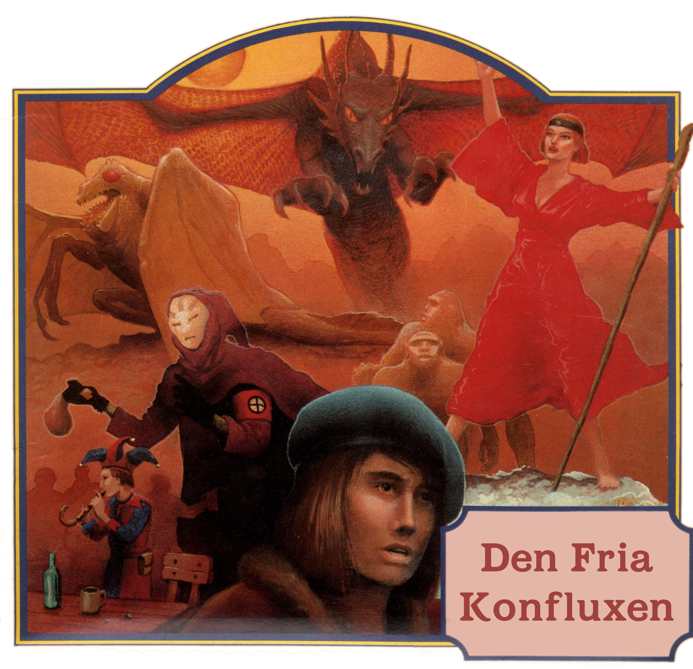

<title>Den fria konfluxen</title>

# Den fria konfluxen

Välkomna till *Den fria konfluxen*!

*Den femte konfluxen* var en rollspelskampanj i fem delar som jag skrev mellan 1986 och 1994. Efter avsevärt arbete av mig och Klas Lindberg har jag till sist glädjen att släppa speltexterna fria under Creative Commons-licens på det sätt som framgår nedan.

Mycket nöje i Trakorien!
*Erik Granström*

## Upphovsrätt

### Svavelvinter

**Text:** Erik Granström
**Omslag:** Steven Stahlberg (Hägg)
**Illustrationer:** Stefan Kayat
**Kartor:** Ann-Sophie Qvarnström

### Trakorien

**Text:** Erik Granström
**Illustrationer:** Marc Grieves, Tony Cronstam (Darwiche)
**Kartor:** Ann-Sophie Qvarnström

### Oraklets fyra ögon

**Text:** Erik Granström
**Omslag:** Greg Hildebrandt
**Illustrationer:** Gregor Eldarb, Tobias Green, Maximilian Bech-Larsen, Håkan Ackegård
**Kartor:** Ann-Sophie Qvarnström

### Kristalltjuren

**Text:** Erik Granström
**Omslag:** James Warhola
**Illustationer:** Kenneth Nyman
**Kartor:** Kenneth Nyman

### Den femte konfluxen

**Text:** Erik Granström
**Stridssystem:** Johan Sjöberg, Mats Mariedahl
**Omslag:** Greg Hildebrandt
**Illustrationer:** Peter Bergting
**Kartor:** Håkan Ackegård, Åsa Hedenskog, Ann-Sophie Qvarnström

## Licens

Härmed släpps texterna till nedan listade rollspeläventyr som undertecknad, Erik Granström, skrev mellan 1986 och 1993 under [**Creative Commons (CC) licensen CC BY-NC-SA 2.5 SE**](https://creativecommons.org/licenses/by-nc-sa/2.5/se/legalcode) med följande tillägg:

Licenseringen gäller enbart följande modulers text i de versioner som publicerades digitalt av Erik Granström 2019:

* Svavelvinter (1987)
* Trakorien (1988)
* Oraklets fyra ögon (1990)
* Kristalltjuren (1992)
* Den femte konfluxen (1994)

Illustrationer och kartor täcks INTE av licensen.

*Svavelvinter* och *Trakorien* är registrerade varumärken som ägs av Erik Granström och dessa ord får INTE användas i varumärkesliknande sammanhang utan särskild tillåtelse. Orden kan däremot användas i löptext enligt licensen.

Vid återpublicering av det utlicenserade materialet i original eller bearbetad form, ska här angivna villkor framgå, liksom var licensen respektive texten i originalutförande kan hittas.

Uppsala 2019-09-15

### Förklaring

Det här är bara en förklaring. Läs vid behov de längre licensvillkoren på nätet:

* Översikt: [https://creativecommons.org/licenses/by-nc-sa/2.5/se](https://creativecommons.org/licenses/by-nc-sa/2.5/se)
* Licenstexten: [https://creativecommons.org/licenses/by-nc-sa/2.5/se/legalcode](https://creativecommons.org/licenses/by-nc-sa/2.5/se/legalcode)

Spelmodulerna i den ursprungliga Konfluxsviten gavs ut mellan 1987 och 1994. Licensen gäller dock endast de digitala versionerna som släpptes 2019.

Den som vill får använda, sprida, göra om, modifiera, bygga vidare och skapa nya verk baserade på *texterna* i den digitala versionen enligt licensen. Detta så länge vederbörande erkänner Erik Granström som upphovsman, användningen är icke-kommersiell och de verk som skapas utifrån de täckta verken i sin tur licensieras under samma licens. 

**Observera:** Licensen gäller enbart texter som Erik Granström har upphovsrätt till. Samtliga illustratörer, kartritare, layoutare och originalare som medverkat i modulerna, förutom den avlidne Frank Frazetta, har medgivit att deras originalarbeten publiceras icke-kommersiellt och med angivande av respektive upphovsman tillsammans med den utlicensierade texten i originallydelse, men deras arbeten omfattas i sig INTE av licensen. Den som vill använda illustrationerna på annat sätt måste själv försäkra sig om att användningen inte kränker någons upphovsrätt. En lista på aktuella upphovsrättsinnehavare finns ovanför under rubriken [Upphovsrätt](#upphovsratt).

## Distribution

En ursprunglig och oförvanskad version av detta verk hittas här: [strimlad.se/fri_konflux/00.titelblad.html](http://strimlad.se/fri_konflux/00.titelblad.html)

Hela materialet finns även som komprimerat arkiv: [strimlad.se/fri_konflux/fri_konflux.zip](http://strimlad.se/fri_konflux/fri_konflux.zip)
