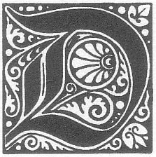
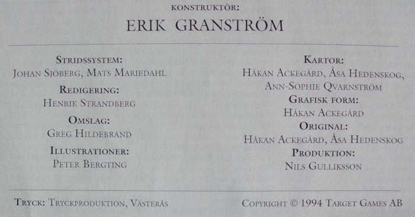

<title>Den femte konfluxen</title>

*ödgångarna lägger sista stenen på sin bro före kvällen”, säger överste Grisban torrt och sneglar mot prästen vid stensättningen. Han är den ransardiska eskortens anförare, ett uppdrag av föga ära. ”Och ett trakoriskt segel bröt horisonten i morse. Vet ni vad det innebär, Sharkishati? Snart är de över oss som flugor på en död gris, och ni har ännu inte funnit er konflux.” ”Njut då av friden så länge den varar”, genmäler Manzonla, utan att störas i sina oändliga ritualer. ”Shamashi nåd skall skänka mig ett tecken i tid.” Knappt har orden lämnat hans mun förrän marken gör ett våldsamt kast som fäller hela sällskapet. Med ett dovt rytande slits klippan itu ända upp mot fyrtornet. Monoliterna faller som frukter. ”Bara ett jordskalv, ingen fara”, kacklar prästen och reser sig på ostadiga ben, men soldaterna skyndar redan mot lägret. Manzonlas tjänare, Dumuzi, rycker i mästarens kåpa. ”Herre, herre!” Mannens ansikte är vitt. ”Solen, herre... Se, den rör sig åt fel håll.” Flera gånger måste Sharkishatin blinka mot öster innan han kan erkänna att mannen faktiskt har rätt.*

Ska äventyrarna lyckas överlista den uråldriga ondskan på Marjura? Kan de skydda den femte konfluxen mot sin ärkefiende Shagul, mot kung Ottars vandöda arméer, och mot de trakoriska och ransardiska krigsflottorna? Svaret ges i avslutningen av denna episka äventyrssaga, som tidigare omfattats av [*Svavelvinter*](../svavelvinter/00.titelblad.html), [*Trakorien*](../trakorien/00.titelblad.html), [*Oraklets fyra ögon*](../oraklets_fyra_ögon/00.titelblad.html) och [*Kristalltjuren*](../kristalltjuren/00.titelblad.html). Förutom rollspelsäventyret innehåller *Den femte konfluxen* även ett komplett krigsspel som simulerar de olika inblandade styrkornas rörelser på ön Clusta Noba, där slutuppgörelsen äger rum.

# 00. Titelblad

Detta äventyr tillägnas alla dem som med en blandning av glada rop, goda råd, spännande spelkrönikor och allvarliga förmaningar förmått mig att fullborda den femte konfluxen. Bland dessa vill jag särskilt nämna:

Thomas ”Quack” Allvin, Henrik Bergman, Anders Blixt, Louis Dubois, Dag Stålhandske, Fredrik Agetoft, Martin Rundkvist

...och så alla ni som jag glömt och som kanske å andra sidan glömt mig.

-Erik Granström

## Erkännanden

**Konstruktör:** Erik Granström
**Stridssystem:** Johan Sjöberg, Mats Mariedahl
**Omslag:** Greg Hildebrandt
**Illustrationer:** Peter Bergting
**Kartor:** Håkan Ackegård, Åsa Hedenskog, Ann-Sophie Qvarnström
**Digitalisering:** Klas Lindberg

> ### För den historieintressarade
> 
> Titelbladets lista med erkännanden hade ursprungligen detta innehåll:
> 
> 
