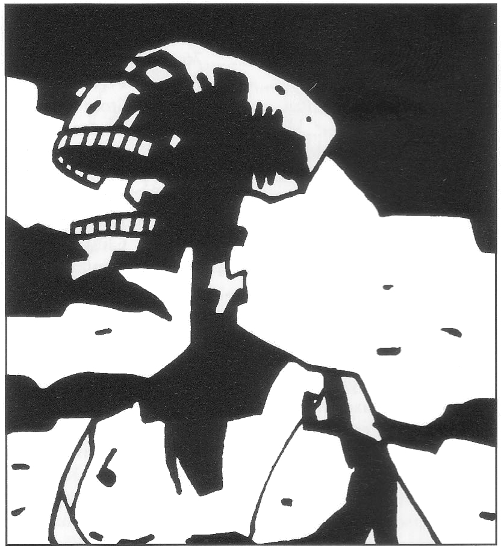

<title>Spelledarens inledning - Den femte konfluxen</title>

# 01. Spelledarens inledning

> *.... och alla berg och öar flyttades bort från sin plats.*
> 
> Apokalypsen 6:14

### Introduktion

Krönikan om den femte konfluxen går mot sitt ödesmättade slut. Tidigare har *Svavelvinter*, *Trakorien*, *Oraklets fyra ögon* och *Kristalltjuren* publicerats i serien. Från ett blygsamt byscenario i *Svavelvinter* har de strävsamma äventyrarna nu nått finalen där världen måste räddas med buller och bång. Vinstvillkoren är egentligen mycket enkla:

*Närmast den femte konfluxen vinner*

Det är vägen dit som är besvärlig. Såväl spelledare som spelare kommer att få offra blod, svett och tårar, förhoppningsvis inte förgäves. Deläventyren leder alla mot slutmålet. Äventyrarna kan misslyckas med det mesta och ändå fortsätta spela, men varje misslyckande försvårar fortsättningen och ökar risken för ett totalt fiasko i slutet. Spelledaren (förkortas i fortsättningen SL) bör redan från början upplysa spelarna om att slutet ingalunda är givet.

Historien har naturligtvis varierat från kampanj till kampanj så att förutsättningarna kan vara mycket olika. Sannolikt måste varje spelledare göra sina anpassningar. Det klarar han säkert, men för säkerhets skull ber jag på förhand om ursäkt för eventuella luckor i texten. Personer och platser har beskrivits olika detaljerat dels beroende på vad som krävs för spelet, dels beroende på författarens inspiration. SL bör efter förmåga brodera ut med detaljer och sidospår för att inte ledtrådarna ska bli för uppenbara.

Kraven på äventyrarna (och spelarna) är i slutmodulen tuffare än tidigare. En hel del klurande måste till. Man hamnar inte sällan i situationer av typen ”lös problemet eller dö! ” Det beror delvis på att konstruktören med åren förlorat mycket av sitt ungdomliga mjäk, delvis på att rollpersonerna vid det här laget bör besitta betydande krafter. Samtidigt får nackhackarna minst 150% valuta för sina ansträngningar eftersom Cruris vandöda har för vana att resa sig till en andra rond sedan de gjorts ner. En pikant krydda är att lärt luskande lönar sig mer än vanligt. Äventyrarna spar mycken möda om de samlar på sig information längs vägen.

### Nya spelare

Sällskapet har flera gånger infiltrerats av lönnmördare och demoner. Rimligtvis släpper de inga främlingar in på livet i detta kritiska slutskede. Om nya spelare ändå ska in i rollspelet kan de ta över någon lämplig SLP, till exempel Desaba, Perrima eller Bodonius av Ranz. Alternativt kan de spela en gråalv ur *Bladverks* besättning. Den som faller ur kan också erbjudas befälet över någon av styrkorna i det strategiska spelet.

Nyskapade rollpersoner kan få 150 BP i stället för de normala 125.

### Några råd innan spelet börjar

* SL BÖR LÄSA IGENOM HELA MODULEN INNAN SPELET BÖRJAR. Många olika varelser och grupper försöker dominera konfluxen och SL måste vara bekant med dem alla för att veta vem som reagerar när och hur. Händelsekedjorna i spelet korsar ofta varandra och påbörjas i många fall bara under vissa omständigheter.
* INFORMATION DUBBLERAS BARA UNDANTAGSVIS. Viktiga ledtrådar i ett äventyr kan ofta finnas i aktuella personbeskrivningar eller andra artiklar.
* SL BÖR FÖRA EN SPELKALENDER så att han dels kan följa parallella handlingar på olika platser, dels pricka in förutbestämda händelser. Till exempel inträffar konfluxen 30 dagar ±2T20 timmar efter att äventyrarna befriat jorddragaren Jagernatha.
* I spelet kan följande parter delta:
    + en grupp äventyrare för det egentliga rollspelet,
    + en spelare som sköter ärkeskurken Shaguls drag och leder Chrachsiska trupper i det strategiska spelet,
    + en spelare som leder Trakoriska trupper och eventuellt rollspelar Praanz da Kaelve,
    + en spelare som leder Ransardiska trupper och eventuellt rollspelar Trugdan Järnbuk,
    + en spelare som leder Stegosiska trupper och eventuellt rollspelar Arn Dunkelbrink eller Naramsi av den östra klyftan.

### Om färd på Marjura

För resor på Marjura kan SL använda kartan från *Svavelvinter* liksom modulens beskrivningar av klimat, djur och natur. Räkna med att glaciärkanten överallt dragit sig tillbaka 10 kilometer.

### Om Vox Ranzina

Vox Ranzina är en profetia från *Oraklets fyra ögon*. Profetian förutsäger den femte konfluxen, Shaguls och Tricilves död, Det heliga Kishatets fall m.m. Det fiffiga
med profetior är emellertid att de kan tolkas på flera sätt. Ingen kan vara helt säker på vilken tolkning som är den rätta, kanske inte ens i efterhand. Ännu fiffigare är att samma vers kan användas flera gånger i olika sammanhang. En ambitiös SL kan därför använda Vox Ranzina som ett musikaliskt tema vilket i varierade former återkommer i spelets obönhörliga ödessymfoni. En lärd SLP, till exempel det blå barnet från *Oraklets fyra ögon*, kan ha för vana att förundrat mumla aktuella rader så snart tillfälle ges och tillföra äventyret en ödesmättad stämning alternativt gå äventyrarna på nerverna med sin vad-var-det-jag-sa-attityd.

Om Melealina sa Vox Ranzina till exempel:

> *Ögat slukas hellre än slaktas
> att blunda synskt bak pansarlock*
  
Denna profetia uppfylldes såväl när demonen Ghumgakk slukade alvkvinnan för att skydda henne från Ebharing i Kristalltjuren som när hon i detta äventyr söker skydd inne i Store Stenfar och när hon låter sig tas upp av Kaklunen från järntornet.

## Resumé

Trakoriska riket ockuperade år 595 eO den ogästvänliga ön **Marjura** långt uppe i nordhavet för att få kontroll över de värdefulla svavelträsken. På Marjura fanns vid den tiden en nekromantikersekt som kallade sig Shaguliter efter grundaren **Shagul**. Äventyrarna reste till Marjura för att göra upp med sekten. Efter flera äventyr, bland annat med draken Blatifagus och isdruiden Perrima, besegrades de onda trollkarlarna under en slutstrid i deras järntorn. Tornet sänktes sedan i lavan det vilade på genom en inbyggd förstörelsemekanism. När allt borde ha varit över steg plötsligt Shagul själv fram ur sin grav och påstod sig ligga bakom allt som hänt med högst personliga intressen.

Äventyrarna fick snopna återvända till Trakorien. Av misstag hade man dessförinnan råkat väcka ett gammalt Marjuriskt kungadöme som legat i magisk dvala under åttahundra år. Dessa **Crurer**, som drar kraft från **jordblodkällan**, körde med tiden bort alla levande varelser från Marjura, anförda av kung **Ottar** som Shagul kontrollerar med sin magi. Ottar har ett magiskt svärd besatt av demonen **Ebharing**, vilken Shagul planerar att släppa in i spelvärlden hel och hållen.

Rollpersonerna trodde de var klara med Marjura och Shagul ända tills trollkarlen skickade lönnmördarligan **RhabdoRana** för att döda dem. Äventyrarna blev i sista stund varnade av munken Bodonius från berget **Ranz**. Det heliga berget hade just fullbordat sin profetia, **Vox Ranzina**, som bland annat spår att Shagul, som finns i ett antal klonade varianter, ska dödas av någon som sett hans rätta ansikte. Profetian talade vidare om **den femte konfluxen**, en ödespunkt i tid och rum och om fyra varelser som måste räddas undan RhabdoRana för att inte Shagul ska lyckas dominera konfluxen. De fyra varelserna visade sig vara alvkvinnan **Melealina** som av gudarna fått uppgiften att lotsa den femte konfluxen förbi samtidens farligheter, vargkvinnan **Rirba**, som under vansinnesguden **Remuntras** inflytande kan slå upp dörrar med sin sång, matematikern **Nastigast** och **det blå barnet**, en piratklon av Shagul som odlats fram av magikern **Manghalde**, den enda shagulit som överlevde sin mästares förräderi.

Samtidigt utbröt ett större krig i Trakorien. Arvfienden **Ransard** gick till anfall i allians med gudastaten **Det heliga Kishatet**. De höll på att vinna kriget när **Stegoserna** kom seglande ur det fördömelsens mörker som legat över dem sedan tvåhundra år efter ett edsbrott. Status Quo lägrade sig. Melealina, Manghalde och de överlevande oraklen sökte skydd på Stegos hos **Arn Dunkelbrink**, som blivit kung sedan han som första utlänning landat på ön, ditburen av draken Blatifagus.

Läget på Stegos grusades emellertid av att kungen inte medfört hjälten **Store Stenfar** i enlighet med profetian och att hans värdighet därför ifrågasattes. Melealina kunde lokalisera Store Stenfar till en annan värld, men då hon och Manghalde försökte nå honom anfölls de i gränstrakterna mellan världarna av demonen Ebharing. Demonen gjorde slut på Manghalde, men Melealina räddades av en annan demon, RhabdoRanas skyddsväsen **Ghumgakk**, som retat upp sig på att Shagul använder hans dyrkare för egna syften. Istället fick äventyrarna försöka hämta Store Stenfar från **Bythos**, en modellvärld vars skapare, den inkompetente **Nominatorn**, höll Store Stenfar fången.

Sedan de räddat Store Stenfar i form av en **kristalltjur**, och plockat med sig den gudomliga **regnbågspennan** från Nominatorn återvände rollpersonerna till spelvärlden. På vägen hem stötte de ihop med Ebharing i de Grå hallarna mellan världarna, men besegrade odjuret med hjälp av kristalltjuren. Samtidigt som man trädde återkom till spelvärlden omformades kristalltjuren till en oval kristall och regnbågspennan tog formen av en skyttel med regnbågsfärgad tråd. Melealina mötte dem vid en ödslig kust med det levande gråalvskeppet *Bladverk*. Hon sade sig ha flytt Stegos sedan RhabdoRana mördat Nastigast. Nu är hon klar över att den femte konfluxen kommer att äga rum på den lilla holmen **Clusta Noba** nära Marjura...

## Kort översikt

Modulen omfattar tre huvuddelar: INLEDNINGEN — som du läser nu, ÄVENTYRET — med händelser och uppdrag i kronologisk ordning, och ARTIKLAR — med kringfakta och händelser som sker parallellt med äventyret.

### Mot Isakra

Skeppet Bladverk med äventyrarna ombord stävar mot staden Isakra för att finna multimandalan, gudarnas ”ritning” över Trakorien, och korrigera den med hjälp av regnbågspennan de för med sig från *Kristalltjuren*. Under färden håller deras anförare, alvoraklet Melealina från *Oraklets fyra ögon*, ett rådsslag där sällskapet får veta vad de måste göra. Intermezzon, bl.a. med draken Blatifagus från *Svavelvinter* inträffar.

### Isakra

Sällskapet försöker hitta multimandalan hos den skygga vävarsekten som förvarat kartan under de senaste tusen åren. Viktig information bör hämtas från Etemenankitemplet i staden. Man rollspelar mot potentiella allierade och fiender. Valen Grono som skyddar *Bladverk* måste räddas från stadens valjägare, m.m.

### Mot Clusta Noba

Sällskapet seglar vidare med multimandalan mot Clusta Noba och kan råka ut för komplikationer på vägen. De trakoriska, ransardiska och Stegosiska krigsflottorna är också på väg, liksom kungen Arn Dunkelbrink. Fortsatt spel påverkas av när de olika flottorna anländer. De tre krigsflottorna kan skötas av fristående spelare som inte deltar i rollspelet. Se f.ö. ”Slaget om Clusta Noba”.

### Clusta Noba

Äventyrarna ska skaffa sig en bas på ön, helst genom att vinna förtroende hos de munkskolor som finns på plats. Vidare ska man lokalisera platsen för konfluxen, skaffa ledtrådar från lokalbefolkningen, plantera Store Stenfar, få slottet att gro och växa samt ta sig in i det och försvara det.

### Jorddragaren

Äventyrarna kontaktas av kung Ottars hovmagiker, häxan Rirba, som ligger bakom det vandöda rikets återuppståndelse. Hon ångrar sig och vill befria sina fränder från det vanärande skuggliv de vaknat till. Hon vill också hämnas på Shagul som utnyttjar Crurernas svaghet.

Melealina har redan insett att något är fel med konfluxen. Det tycks finnas två utvalda platser, vilket är omöjligt. Rirba berättar att Marjura för tolvhundra år sedan släpades från södra halvklotet mot nordpolen, som straff för Crurernas magi. Färden ombesörjdes av Jagernatha, en jorddragare av det gigantiska släkte som nere i magman sköter kontinentaldriften i spelvärlden. Crurerna fann emellertid den karta jorddragaren följde och bytte den mot en magisk cirkel. Följden är att Marjura och därmed konfluxpunkten på Clusta Noba ligger på fel plats. Äventyrarna måste återställa den rätta kartan, vilken naturligtvis är multimandalan, till jorddragaren långt nere under jorden. Det innebär att ta sig dit genom att tolka ledtrådar och undvika fällor som Crurerna lämnat efter sig och sedan ta sig tillbaka till ytan innan man blir upphunnen av lava som frigörs med jorddragaren häftiga uppvaknande.

Jorddragaren börjar dra Marjura med Clusta Noba söderut som en gigantisk oceanångare och påbörjar därmed nedräkningen mot den femte konfluxen.

### Staden under isen

Nästa uppgift är att släcka jordblodkällan från vilken Crurerna hämtar sin kraft. Gör man inte det kommer besvärjelsen *Landakennings lagoband* att utvidgas till de öar man krockar med och väcka alla döda. För detta behöver Rirba utrustning från sitt gamla laboratorium i Crurernas infrusna stad Krau-Ki, som just börjar smälta fram ur isen. Äventyrarna ska ta sig till staden före Shaguls folk, undvika eller besegra den mäktiga varelse som en gång körde bort befolkningen, finna det mäktiga svärdet Blåbite, ta sig in i laboratoriet (förbi de hinder Rirba själv satt upp och sedan glömt) och hämta de föremål häxan vill ha. Inte minst ska de ta sig ut igen.

### Damgambit

Shagul vill använda den femte konfluxen till att släppa in den mäktige demonen Ebharing i spelvärlden. I detta intermezzo offrar sig Melealina för att skaffa undan Ebharing genom en ohelig allians med en kaklun, en märklig odödlig varelse som Shaguliterna höll inspärrad i *Svavelvinter*, men som slapp lös när järntornet smälte.

### Jordblodkällan

Äventyrarna tar sig till Crurernas nya hemvist, staden Fari-Nhata, för att släcka jordblodkällan. De måste antingen ta sig in via Shaguls lönngång som preparerats för att fånga dem, eller via den hårt bevakade huvudporten. I staden kan de träffa kung Ottar, hans drottning Ottilia, najaden Inadrel, m.fl. Innan rollpersonerna släcker jordblodkällan bör de samla lite jordblod i en magisk kruka för att hälla det i havet och på så sätt tvinga Crurerna att följa efter. Såväl Rirba som raugonerhonan Keriaka har emellertid andra planer för krukan och dess innehåll.

### Konfluxen

Det visar sig att konfluxen inte äger rum på markytan utan i en grotta trettio meter ner. Den som dominerar konfluxen vinner spelet. I kapitlet beskrivs åtta möjliga slut. Optimalt blir det en slutstrid i själva grottan.

### Artiklar

#### Shagul

Regler för Shaguls makt, regler för vad en Shagulspelare kan göra och hur Shagul kan dö.

#### Cruri

Beskrivning av Crurerna, deras historia, egenskaper och motiv, liksom av den kraftfulla besvärjelse, *Landakennings lagoband*, som håller dem vid liv.

#### Marjuri förflyttning

Beskrivning av hur jorddragaren Jagernatha drar Marjura över världshaven, vad konsekvenserna blir för Marjura och Clusta Noba under spelet och för Trakorien när ön kommer dit.

#### Personer och varelser

Beskrivning av spelledarpersoner man stöter på under spelet.

### Slaget om Clusta Noba

Regler för ett regelrätt strategi-spel med truppmarkörer som flyttas runt på hexagonkartan, vilket kan pågå parallellt med rollspelet och interagera med detta. Tre spelare + eventuellt Shagulspelaren kan delta i det strategiska spelet. Lämpligast spelas detta parallellt med rollspelsäventyret, av andra eller samma spelare, så att man vet VEM som befinner sig VAR, och NÄR, vilket kan vara av väsentlig vikt för själva äventyrets utveckling.

I avsnittet ingår dessutom data om trupper och fartyg.

## Hexagonkarta

Som bilaga medföljer en karta över Clusta Noba med sexkantiga hexagonrutor (kallas i reglerna ”hexrutor”) som dels tillåter strategiskt spel, dels kan användas i rollspelet. I böckerna förekommer även ett antal svartvita kartor, diagram och bilder.

