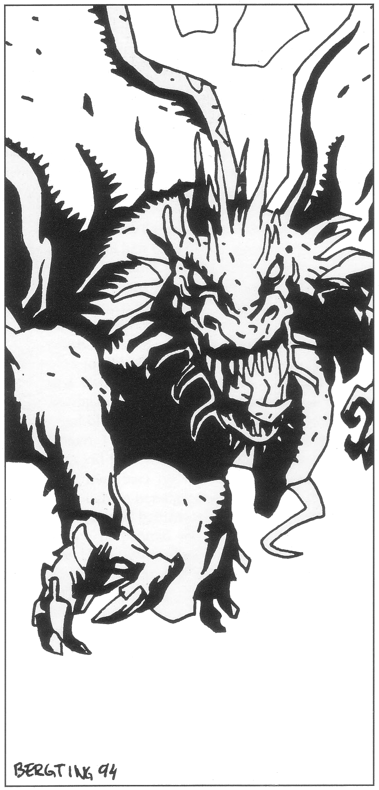

<title>Mot Isakra! - Den femte konfluxen</title>

# 02. Mot Isakra!

Det levande alvskeppet *Bladverk* seglar från fiskarbyn Frakudd på Palamux där förra delen av äventyret slutade. Destinationen är staden Isakra på Trinsmyra. Kristallfröet av Store Stenfar ligger surrat på däck, fasthållet av framkommenderade grenar och täckt av sammanflätade lövmattor.

## Melealinas rådslag

Under resan mot Isakra samlar Melealina rollpersonerna för ett allvarligt rådsslag. Rådslaget kan lämpligen rollspelas som inledning, om inte annat för att summera vad som gäller och för att inviga nya rollpersoner/spelare. Förutom äventyrarna deltar skeppets befälhavare Aldrun, ranzinermunken Bodonius och Didra Damagi, om det stämmer med tidigare spel. Dessutom träffar sällskapet raugonen Keriaka som väckts ur sin slummer för tillfället och är på ganska dåligt humör.
Melealina förklarar att hon beslutat berätta det hon vet för sällskapet, eftersom framtiden är mycket oviss och farofylld . Det finns inte tid för hemlighetsmakeri. Döden kan plötsligt nå ifatt dem alla. Faller någon ifrån måste övriga i sällskapet veta vad som ska göras och inte tveka att själva fortsätta kampen eftersom mycket står på spel.

### Om raugonerna

Aldrun introducerar raugonerna och förklarar uppriktigt att hon inte vet vilken roll de spelar i sammanhanget. Hon vet bara att insektoiderna är på ett heligt uppdrag i samband med den femte konfluxen. Ingen profet har formulerat deras uppdrag. Det har uppstått som en kollektiv oro i hela deras art. Sannolikt vet de inte själva vad pilgrimsfärden går ut på men litar på att instinkten ska leda dem rätt när stunden kommer. Raugoner har en ordlös naturreligion som fördömer allt vad odöda, demoner och magi heter. De förmår inte ljuga eller föreställa sig.

Gråalverna lever under en urgammal fred med raugonerna och Aldrun bedömer att de står på samma sida som äventyrarna i kampen mot skenlivets makter. Hon har väckt upp Keriaka så att hon och rollpersonerna inte ska ta varandra för fiender om de stöter ihop senare. Raugonhonan får delta i rådslaget. Hur mycket och på vilket sätt hon förstår vad som sägs är svårt att veta, men man ska inte underskatta raugonerna som är en betydligt äldre art än människorna. Melealina har inget att invända mot Aldruns bedömning.

#### För Spelledaren:

Keriaka behöver känna på människorna med sina antenner och gärna sörpla upp lite kroppssekret av varierande slag för att kunna identifiera dem och lämna kunskapen vidare till sina hannar. Man bör klara ett slag på Skräcktabellen för att inte känna obehag inför beröringen. Den som vägrar samarbeta blir inte igenkänd som vän om man möts senare i äventyret utan tas då för bytesdjur.

#### Ett intermezzo

När/om Keriaka pillar på äventyrarna kommer hon att ge den mansperson som har lägst PSY ett lätt bett som drar blod. Hon ursäktar sin klumpighet via gråalverna och skyller på reflexer i käkarna. Hon påstår sig vara ogiftig för närvarande så att ingen fara är skedd. Som väntecken erbjuder hon den bitne en klunk av sin helande vätska.

Efter denna incident kommer alla raugoner att bemöta den bitne med största respekt som utvald fader till nästa pilgrimigra. De visar sin vördnad genom att stanna, stirra, knäppa med käkarna på ett obehagligt sätt och utsöndra ett skarpt luktande sekret när personen kommer i närheten. Gråalverna är förvånade över deras beteende som de aldrig tidigare sett. De noterar också att raugonerna talar om den utvalde som ”drönaren av pilgrimigran”, eller ”drönaren av konflustern”.

#### För Spelledaren:

I själva verket är bettet varken en olyckshändelse eller ogiftigt. Keriaka ger offret en liten dos kraftigt hallucinatorisk afrodisiakum med periodiskt fördröjd effekt. Personen kommer då och då att drabbas av underliga mardrömmar med sexuell underton och vakna utmattad utan minne av drömmens detaljer men med klösmärken han tillfogat sig själv. Mer om den falska honans avsikter i slutet av kapitlet ”Konfluxen”.

### Om den femte konfluxen

Från varje situation och tidpunkt kan normalt en mängd olika och oberoende händelsekedjor utveckla sig. Den som har förmågan att se in i framtiden kan bedöma dessa olika vägar klarare än andra. Nu närmar sig den femte konfluxen. En konflux är en tid och en plats som pekats ut av himlakropparnas positioner. Konfluxen är ett nålsöga, den smala kanalen i ett timglas, där bara en händelselinje är möjlig vilken kommer att ligga till grund för alla framtidens vägar. Därför får skeendet i själva konfluxen ett avgörande inflytande på framtiden. Konfluxer kan ses som ett slags rundningsmärken och milstolpar i en världs historia. Det är som alla förstår mycket viktigt att inte trollkarlen Shagul, demonen Ebharing eller den odöde kung Ottar får dominera den femte konfluxen.

Melealina har äntligen insett var konfluxen kommer att äga rum. Det mycket märkliga är att stjärnorna pekar ut inte en utan två platser. Dels på ön Clusta Noba vid Marjura — den exakta punkten kan Melealina bara bestämma när de kommer dit. Dels en position i Trakoriska sjön, några mil nordost om Stegos, där nytt land kommer att resa sig över havsytan. Tiden för konfluxen kan ännu inte fastställas exakt, men ligger minst ett par månader framåt i tiden. Melealina tror att konfluxläget

på Clusta Noba idag kan pekas ut av alla skickliga astrologer. Bara få kommer däremot att upptäcka den andra platsen i tid, mest för att alla är inställda på att se en enda plats och därför tappar koncentrationen så snart de lokaliserat Clusta Noba.

#### Paradoxen

Nu till paradoxen: en konflux kan bara inträffa på ett ställe vid en tidpunkt. Det får inte finnas två platser. En delad konflux är som en ofokuserad bild, något förvrängt och felaktigt, en vanverklighet, liksom de odödas skenliv är en förvriden skugga av riktigt liv. Tanken skrämmer Melealina. Alvkvinnan ser risken att konfluxens ena fokus på Clusta Noba kommer att besättas av onda krafter under Shaguls kontroll medan det andra fokus i Trakoriska sjön domineras av goda krafter, antagligen av Stegoserna under deras kung Arn Dunkelbrink. Konfluxen skulle då präglas av själva motsättningen. Resultatet kunde bli ett skoningslöst krig, ett tusenårigt blodbad som ingen kan vinna förrän nästa konflux bryter den kluvna förbannelsen.

Melealinas och sällskapets första uppgift måste alltså vara att sammanfoga konfluxen till en, hur nu det ska gå till. Hon känner att hon vet alldeles för lite, men att hon ändå är tvungen att agera för att liksom raugonerna lita på sin instinkt allt eftersom händelserna utvecklas.

Alvkvinnans närmaste planer är att plantera Store Stenfar på Clusta Noba som är den tydligare och farligare av de två platserna. Store Stenfar kommer att skydda konfluxens läge där. När *Bladverk* fört henne, oraklen, Stora Stenfar och äventyrarna till Clusta Noba, vill hon skicka tillbaka Aldrun med det levande skeppet för att försvara den andra positionen i Trakoriska sjön. Förhoppningsvis hinner de tillbaka i tid.

Varelser i haven har berättat för Melealina att flera flotteskadrer redan har eller snart kommer att avsegla mot Marjura, fullastade med trupper.

### Om multimandalan och regnbågspennan

I *Kristalltjuren* förde rollpersonerna med sig Store Stenfar och den gudomliga regnbågspennan till vår värld från Nominatorn som missbrukade de mäktiga föremålen. De bilder man ritar med regnbågspennan blir verklighet. I synnerhet kan man rita på bitar av multimandalan, gudarnas stora karta över multiversum, och på så sätt påverka de länder kartbitarna föreställer.

Melealina vet att den bit av Multimandalan som föreställer trakterna norr om Trakorien finns i Etemenankitemplet i Isakra. Den har funnits där i tusen år även om hon aldrig sett den själv. Kanske är det just därför platsen är helig för alla religioner. Regnbågspennan har antagligen inte kommit till vår värld strax innan den femte konfluxen av en slump. Alvkvinnan tror att det finns något fel i kartan som förklarar konfluxens kluvenhet och att Nominatorns regnbågspenna kommit till spelvärlden för att felet ska kunna korrigeras. Därför vill hon föra pennan till templet och söka rätt på kartbiten.

### Skaffa mer kunskap!

När de ändå besöker Isakra bör sällskapet söka reda på information av värde i Piondermunkarnas utmärkta bibliotek. Melealina själv kan dessvärre bara läsa alviska, men Bodonius åtar sig gärna studieuppgiften om han finns med.

Melealina påminner också om berget Ranz profetior (den finns i *Oraklets fyra ögon*). Varje läskunnig person i sällskapet bör åter studera dem noga i skenet av vad som hänt och vad man nu känner till.

### Om ondskan på Marjura

Det finns alltför mycket ondska på Marjura, företeelser som inte har någon plats i vår värld, som inte stämmer med gudarnas planer för spelvärlden. Melealina tror att ondskan i sig kan ha stört konfluxens maskineri. Konfluxen kanske var planerad till Clusta Noba sedan många tusen år, men nu har ondskan gjort platsen olämplig. Lägre gudar satta att styra maskineriet enligt planerna har börjat tveka så att störningar uppkommit. Ondskan måste tillintetgöras, om möjligt före konfluxen. Även om konfluxen inte kan enas måste ondskan utplånas för att inte påverka dess fokus på Clusta Noba.

Melealina tror att hon och äventyrarna måste bekämpa ondskan genom att:

* **Läka såret i Cruri där jordblodet strömmar i dagen.** Äventyrarna stötte på jordblodkällan nere i kung Ottars grav (i Svavelvinter). Det vandöda folket hämtar kraft till sitt skenliv från källan. Melealina vet inte vad jordblod egentligen är eller hur såret ska läkas, bara att det verkligen är ett sår i själva Moder Jord och att jordblodet aldrig var menat för ytan.
* **Slutgiltigt återföra kung Ottar och hans vandöda folk till gravens ro.** Folket i Cruri förvisades en gång med sin fördömda stad Krau-Ki till Marjura som straff för sin ogudaktig magi. Nu är de i farten igen, fast som vandöda, vilket knappast gör saken bättre. Äventyrarna bör utplåna denna styggelse en gång för alla. Eftersom Crurerna hämtar kraft från jordblodkällan kanske det räcker med att stoppa källans flöde.
* **En gång för alla avvisa demonen Ebharing från vår värld.** Demonen Ebharing har redan dödat trollkarlen Manghalde och försökt avliva såväl Melealina som äventyrarna. En del av demonen finns redan i spelvärlden — i form av kung Ottars svärd med samma namn — men Shagul försöker få hit hela varelsen, kanske med kraft från den femte konfluxen. Melealina vet inte hur demonen skulle manifestera sig i spelvärlden, men han skulle knappast göra världen bättre och hör definitivt inte hit. De sammansvurna bör förstöra svärdet och döda eller köra iväg demonen från spelvärldens närhet för överskådlig framtid.
* **Döda eller åtminstone oskadliggöra trollkarlen Shagul.** Trollkarlen Shagul ligger bakom mycket av det elände man befinner sig i och är ett ständigt hot. Han har oräkneliga liv på sitt samvete och skulle med glädje mörda både Melealina och äventyrarna. Hans makt och kunnande är ett hot mot gudarnas ordning i spelvärlden och ses med ogillande. Detta har den mäktige Ghumgakk som står nära gudinnan Inashtar själv berättat för Melealina. Shaguls alla kloner bör dödas eller oskadliggöras.
* **Skydda den femte konfluxen.** Oavsett om ondskan besegras måste konfluxen skyddas mot olämpligt inflytande. Flera militärmakter mobiliserar redan för att besätta Clusta Noba under den femte konfluxen.

## Vad händer under tiden på annat håll?

### Arn Dunkelbrink lämnar Stegos

Kung Arn Dunkelbrink på Stegos älskade alvkvinnan Melealina. När hon mystiskt försvann i *Kristalltjuren* beslöt han leta rätt på henne. Efter stränga förhör med sitt husfolk fick han reda på det budskap Melealina lämnat till en läkekvinna i palatset, med innebörden att rollpersonerna skulle möta henne i Isakra såvida de inte träffades tidigare. Arn klädde sig då i sina gamla pilgrimskläder och gav sig ensam av mot Isakra i en liten båt.

### Stegosernas flotta

Innan han for gav Arn Dunkelbrink sin adjutant, Naramsi av den östra klyftan, uppdraget att utrusta en flotta och sända den mot Marjura. Detta eftersom Stegosi hovastrolog har sagt att framtiden ska avgöras på Clusta Noba i samband med den femte konfluxen, om vilken även Melealina talat. Arn tänker ansluta till flottan, ditburen av draken Blatifagus såvida han inte hittar Melealina i Isakra. Dessa planer grusas av att draken försvinner enligt nedan.

De krafter på Stegos som aldrig erkänt Arn Dunkelbrinks rätt till tronen får med kungens nya försvinnande vatten på sin kvarn. Ska man nu i krigstider med hot från Trakorier och Ransarder skicka hela flottan upp i ishavet efter en nyck från denne vresige utlänning? Rådgivare hämtas från det gamla Kishatet som åter far inflytande. Situationen med de kungatrogna i minoritet utvecklas nästan till fullt inbördeskrig. Naramsi och hans kungatrogna besätter hamnen, uppmanar alla som är lojala med kungen att följa med och seglar bort.

### Trakorier och Ransarder mobiliserar

Sedan högt uppsatta trakoriska och ransardiska astrologer lokaliserat den femte konfluxen till Clusta Noba, mobiliserar de varsin flotta för omedelbar avfärd norrut. Sällskapet kan möta flottstyrkorna under färden mot Isakra eller senare. Se vidare kapitlen Äventyr i Isakra respektive Slaget om Clusta Noba.

### Shaguls vagga

Enligt profetian Vox Ranzina i *Oraklets fyra ögon* är Shaguls födelsestad med stor sannolikhet dömd till undergång. I *Kristalltjuren* visade sig den utpekade staden vara Tricilve, Trakoriska rikets huvudstad. Om rollpersonerna tog resterna av Shaguls vagga från herr Merinor i *Kristalltjuren* och lämnar dessa bevis till trakorierna, till exempel i Isakra, bli det stor uppståndelse. Kommer uppgifterna ut blir det panik i huvudstaden.
Digeta Longa kommer i vilket fall att ge rollpersonerna obegränsade resurser i form av hjälp/trupper/information/belöningar för att bekämpa Shaguls planer. I gengäld kräver riket lojalitet intill döden av rollpersonerna. Det är naturligtvis möjligt att lämna Shaguls vagga via ombud och diskret undvika all inblandning i affären om man så föredrar.

## Några händelser under färden

### Shaguls allierade på Chrachz

Som det berättas i *Kristalltjuren*, kände Shagul på sig när och var Store Stenfar kom till spelvärlden. Platsen är byn Frakudd på Palamoxi västkust, en av de mest otillgängliga platserna i Trakorien. Enda vägen därifrån är norrut eller söderut via båt. Det är sannolikt att Shagul omedelbart ber sina nya allierade på Chrachz att bevaka sundet mellan ön och Palamux. Om rollpersonerna känner till Shaguls allians med kannibalerna kan de varna gråalverna för faran. Om de struntade i herr Merinor i *Kristalltjuren* känner de inte till alliansen. SL bör i detta fall låta Chrachzerna upptäcka skeppet *Bladverk* via sin starka magi eller genom vanlig spaning och underrätta Shagul eller söka kapa farkosten. Det mest ”naturliga” sättet vore att låta odöda simmare anfalla ur undervattensläge. (Observera skillnaden mellan simmande, ”vanliga” odöda och de vandöda arméerna på Marjura som inte kan släppa kontakt med land.)

### Bladverks strid med draken Blatifagus

Arn Dunkelbrink har tills vidare skickat ut Blatifagus på spaning efter alvkvinnan och äventyrarna i vattnen runt Palamux. De två har gjort upp om att senare mötas utanför Isakra. Blatifagus undersöker varje båt han ser. På en halv kilometers avstånd från ett skepp ökar han farten med några kraftiga vingslag och glider sedan ljudlöst mot sitt mål bara några meter över havsytan. På större fartyg skrämmer han upp besättningen med några vrål och eldkvastar. Han letar efter bekanta ansikten allt eftersom folket strömmar upp på däck innan han ger sig av.

Varje dag på öppet hav finns 25% chans att draken upptäcker det levande skeppet *Bladverk* som vid tillfället ifråga bör ha land i sikte. Någon rollperson står kanske på vakt och röker en pipa i godan ro när Blatifagus plötsligt sveper över däck med ett rytande och vinddraget från en lågsniffande jumbojet. (Drakar är alltid svaga för effekter.) Allmänt tumult uppstår och draken får snart syn på någon han känner igen. Han kommer då att kräva alvkvinnan utlämnad i Arn Dunkelbrinks namn. Besättningen ska sätta henne i en livbåt och segla vidare. Annars kommer han att döda dem alla.

Naturligtvis vägrar man lyda (alverna om inte spelarna). Blatifagus lägger sig åter på inflygning för att sprida lite lagom död och skräck som ytterligare argument, men far en synnerligen obehaglig överraskning. Strax innan draken är framme vid *Bladverk*, skjuter kaskeloten Grono upp ur djupet mellan honom och skeppet. Draken hinner inte väja. Valens käftar sluter sig om hans vänstra vinge och båda försvinner ner under havsytan i kaskader av vatten och ånga.

Det blir alldeles tyst. Efter ungefär en halv minut börjar vattnet bukta uppåt där varelserna försvann och ett par sekunder senare dyker Blatifagus upp. Mäktiga vingslag lyfter honom ur havet, stänker ner skeppet med blodblandat saltvatten innan han är i luften igen. Mödosamt stiger draken högre och högre tills han försvinner mot solen.

> *Lyckat färdighetsslag i Läkekonst, Zoologi eller någon annan av färdigheterna i Drakar => Blatifagus ena vinge tycks vara ganska allvarligt skadad.*

Gronos rygg höjer sig efter en stund nära relingen och blåser en rosafärgad kaskad i triumf. Nu tror alla att det blivit lugnt, men icke så. En gammal drake ger sig inte så lätt. Efter 1T20+60 minuter kommer draken störtdykande som en örn rakt uppifrån. Han slår rakt ner på kristallfröet, vars lövmattor blåste bort redan under den första striden. Kraften i nerslaget är så stark att skeppets akter trycks ner under ytan med fören högt i vädret. Alla på däck måste klara ett svårt SMI-slag för att inte falla omkull. De som faller måste klara ytterligare ett svårt SMI-slag för att inte ramla överbord, tappa det de har i händerna överbord eller ta 1T8 KP i skada.

Ögonblicket efter nerslaget har draken slitit loss Store Stenfar från grenarna som höll fröet fast och stiger åter mot skyn med sitt byte. Det är mycket svårt att skjuta efter honom för *Bladverk* kränger fortfarande våldsamt. Emellertid ser flera att draken är alltför skadad för att bära sitt byte särskilt långt. Blatifagus sätter kurs mot närmas te kust. Återstår att följa efter så snabbt man kan.

Kristallfröet ligger på stranden nedsölat med drakblod. Blatifagus är försvunnen och dyker inte upp igen. Rollpersonerna får lasta ombord fröet och fortsätta sin färd utan att begripa vad som hänt. Som komplikation kan lokalbefolkningen ha hittat Store Stenfar och börjat bygga en släde för att ta med den vackra kristallen till sin by.

#### Vad som egentligen hände:

Blatifagus lockades starkt av den vackra kristall som han antog var en ovärderlig briljant. Efter sin nesliga strid med valen beslöt draken att stjäla stenen för att hjälpligt rädda ansiktet.

Sedan Blatifagus väl slagit klorna i fröet började det tala till honom på det *höga språket*, det språk som gudarna använder och som bara drakar förstår av alla levande varelser i Altor (se *Kristalltjuren*). Fröet erbjöd draken ett uppdrag. Han ska flyga till sina födelsetrakter, Valgussjöns fjärran arkipelager på andra sidan Ereb, för att där samla en här bland sina fränder och sedan återvända för att tjäna Store Stenfar under trehundra år. I gengäld lovade fröet draken och alla som följer honom ett nytt namn, inte en ersättning för namnet Blatifagus, utan ett nytt, riktigt namn på det höga språket. Sitt nuvarande namn avslöjade draken olyckligt för Arn Dunkelbrink, vilket är kungens hållhake på honom. Ett nytt namn innebär att Blatifagus blir löst ur sin tjänst hos riddaren för att istället på ett mer hedersamt sätt tjäna den gudomliga makten i kristallfröet. Vad är dessutom trehundra år för en drake?

Blatifagus antog erbjudandet med glädje, lämnade fröet på stranden och flög därifrån (skadan var inte så allvarlig som många trodde). I själva verket är detta
drakens chans till ett nytt ärofullt liv. Drakar sätter sin självkänsla högst av allt. Blatifagus återkommer först om några veckor i äventyrets slutfas. Även andra drakar kommer att lockas av att få ett nytt namn. Det innebär för dem ett reningsbad, att alla gamla misslyckanden och oförtreter försvinner med det gamla namnet. Deras ord för en sådan rening, *Nâchoberudh*, betyder egentligen *”att ömsa skinn”*.

### Bladverk och barbarerna på Manovga, Lumaria och Crachz

*Bladverk* seglar förbi de ytterligt barbariska öarna Manovga, Lumaria och Crachz norr om Palamux på sin färd mot Isakra. Med stor sannolikhet kommer barbarerna att attackera det märkliga fartyget om de får tillfälle, speciellt om de av Shagul fått ordern att kapa alla fartyg de kan lägga vantarna på för att bygga upp en flotta.

### Bladverk och andra flottstyrkor

*Bladverk* kan under färden mot Isakra råka sikta Trakoriska eller Ransardiska flottstyrkor på väg norrut, eller enstaka plundrare.

### Ranzinermunkarna och Store Stenfar

Det är en fördel för rollpersonerna och SL, om än inte nödvändigt, att Bodonius eller någon annan ranzinermunk följer med till Clusta Noba eftersom Store Stenfar då kan berätta saker för sällskapet. Store Stenfar vet det mesta och kan via ranzinermunken pytsa ut nödvändig information som sällskapet missar. Han meddelar sig ohyggligt sakta och svarar inte på tilltal, båda utmärkta begränsningar för att ransonera hjälpen till ett minimum.

En Ranzinermunk som kommer nära kristallfröet faller genast i gråt av lycka och kastar sig till marken, ty kristallen besitter samma gudomliga kraft som lämnade berget Ranz när Ranzinersekten upplöstes. Munken beslutar omgående att viga resten av sitt fattiga liv till att tolka och tjäna den återuppståndne stenguden. Med tiden kommer de skingrade sektmedlemmar som överlevt förföljelser och prövningar att samlas där fröet planteras. Den munk som först mötte Stenfar kommer att stiga till sektledare och en ny religion uppstår. Mer om detta senare.

