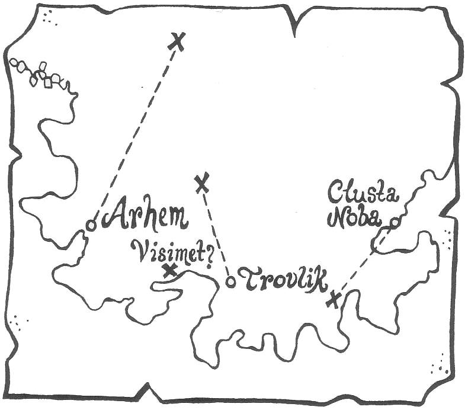
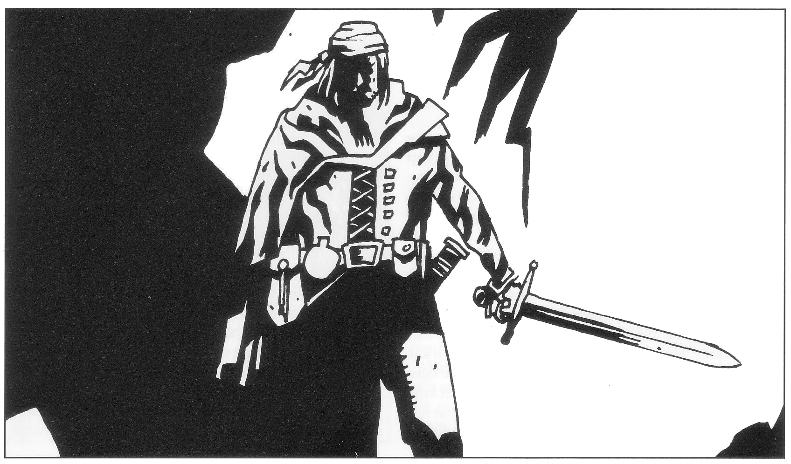

<title>Äventyr i Isakra - Den femte konfluxen</title>

# 03. Äventyr i Isakra

## Översikt

Sällskapet kommer till Isakra, Trakoriens nordligaste stad, där det urgamla alltemplet Etemenanki tronar på norra stadsberget. I staden ska de lokalisera vävarsekten som gått under jorden. Sekten vaktar multimandalan som börjat falla sönder och som måste repareras med regnbågspennan. Sedan man hittat sekten beslutas att mandalan och tre sektmedlemmar ska följa med till Clusta Noba.

Det fortsatta äventyrandet påverkas av spelet i Isakra genom att man träffar och kanske allierar sig med personer eller hämtar värdefull information i Piondermunkarnas kända bibliotek. SL bör hålla viss koll så att nödvändiga bitar kommer med.

#### Sidohändelser

Under vistelsen i staden kan flera sidohändelser inträffa:

* Trakoriernas och ransardernas krigsflottor kan dyka upp för att proviantera i Isakra på sin väg mot den femte konfluxen.
* Valen Grono kan bli instängd i hamnbassängen.
* Man kan komma i kontakt med observatörer från RhabdoRana från kontinentens fastland.
* Remuntradyrkande liftare kan begära skjuts till Marjura, m.m.

## Äventyrarna och Multimandalan

### Vävarsekten

Vävarsekten är så gammal och förtorkad att de fåtaliga medlemmarna inte längre minns sitt ursprung. De har i alla tider vaktat den heliga väven i sitt obemärkta kapell i Etemenakitemplets tredje krets, ägnat sig åt sitt hantverk och utfört sina ritualer i stillhet utan att störa grannarna eller väcka uppmärksamhet.

För ett par veckor sedan gjordes så en fruktansvärd upptäckt. Sektens ledare, Primamus varpdragare, närmade sig i tidig morgontimme den heliga vävens kammare och hörde redan i förgången ett dovt raspande som när tillskärarens kniv löper genom grov segelduk. Ljudet fyllde honom med förebåd och skräck. Han slöt instinktivt i sin egen hand Shivrans hand, talismanen som alltid hänger i sin kedja runt hans hals. Ändå var sanningen värre än han anat.

Väven satt som alltid uppspänd i sin ram, mäktig med sina skiftande färger och anade djup, men nedanför låg redan en handfull lösa trådar, ohjälpligt sammanhärvade. Primamus rusade fram och inför hans ögon utspelade sig det otroliga — väven repade upp sig själv. Trådändar kastade som avhuggna maskar, slingrade sig ur varandras grepp och föll mot klippgolvet där de blev liggande i tilltagande mängd. Han skrek och han skrek och fäder Megelat örnypa av de fyra vindarnas brödraskara hann just fram innan varpdragaren förlorade medvetandet och föll i grannprästens feta famn.

Redan samma dag packades väven ner och sekten flydde hastigt grottan för att undgå de demoner som tagit den i besittning. De vet vad ingen annan vet: att väven är gudarnas bild av världen och att allt som händer med väven får sin motsvarighet i världen. Skräckslagna har de gömt sig hos Primamus bror Snodegald i en fiskarbod nere i trästaden. Där fördriver de dagarna med böner och späkelse i väntan på ett tecken som ska ge dem ledning genom dessa de yttersta av tider...

#### Vävarsektens glömda ursprung

Crurerna på Marjura stal multimandalan från jorddragaren Jagernatha för tolvhundra år sedan, i samband med den tredje konfluxen. Mandalan fördes först till Crurernas stad Krau-Ki, men fick med tiden många dyrkare vilket landets ledare starkt ogillade. För nära tusen år sedan sattes därför mandalan och dess prästerskap på ett skepp söderut. Prästerna, under sin ledare Shivran, fick order om att aldrig återvända såvida livet var dem kärt.

Skeppet löpte efter svåra stormar in i en okänd fjord där prästerna anlade staden Esach-Rha med ett tempel till vävens ära. Templet har med tiden växt till alltemplet Etemenanki och staden kallas nu Isakra. Tempelgrundaren Shivran led senare en kvalfylld martyrdöd i händerna på isbarbarer, men prästerna fann och mumifierade hans kvarlevor samtidigt som Shivran helgonförklarades. De trogna har i alla tider burit helgonets delar som talismaner, en sed som fortfarande praktiseras men som blir ödesdiger för de sektmedlemmar som reser till Marjura.

### Hur hittar äventyrarna vävarsekten?

Vävarsekten har alltså gått under jorden. Ingen vet var man finner den eller dess medlemmar. Religiöst intresserade personer i staden känner till sektens vackra, uråldriga väv, men vet inget om dess sanna natur. Gudarnas multimandala är allmänt känd i myterna, men den som påstår att mandalan finns i verkligheten blir antagligen utskrattad.

#### Förfrågningar i Etemenankitemplet

Ett uppenbart sätt att börja leta efter mandalan är att gå till Etemenankitemplet och fråga. Sällskapet möter då syster Dobcharel, en fyrtioårig runglerkvinna som följer gudinnan Inashtar. Hon blir utsedd till deras kontaktperson i templet och kan även hjälpa dem tillrätta i staden. Syster Dobcharel kan visa äventyrarna Etemenankerriddarnas förteckning över alla sekter som tilldelats plats i templet. Listan, som är ett par hundra år gammal, upptar sekternas namn, antal medlemmar, speciella önskemål i samband med gudadyrkan, anvisad plats i templet och lite annat. Listan upptar 517 sekter, men är inte särskilt aktuell — Dobcharel kan på rak arm peka ut åtminstone ett dussin som inte längre finns kvar. Sekterna skrivs nämligen bara in när de söker plats, inte när de flyttar eller försvinner.

> *FV B4 i Kulturkännedom (allmän) eller FV B1 i Kulturkännedom (Trakorien, Trinsmyra, eller Inashtar) => Syster Dobcharel väntar sig en motgåva till templet för sin hjälp, men visar inte sitt missnöje om hon inget får. Genom dagligt prat bland ortsbefolkningen minskar dock sällskapets bristande tacksamhet deras FV i kommunikationsfärdigheter i staden med 1T4+2.*

#### Melealinas magi

Melealina är säker på att regnbågspennan känner igen multimandalan om den bara förs i dess närhet. Sedan det står klart att mandalan inte finns i templet tror alvkvinnan att hon kan hitta den genom att meditera i pennans närhet. Hon tar i detta gärna hjälp av någon lämplig rollperson som är magiker. (Manghalde gick visserligen åt vid förra försöket, men skam den som ger sig!)

Per sex timmars mediterande finns det 50% chans + (de ”medmediterandes” högsta skolvärde %) att Melealina förnimmer en av nedanstående ledtrådar:

* ”Vårt hus är kallt. Under oss brusar havet.”
* ”Bortom dussinet dussinalnar sjunger bronset i havet.”
* ”Män smeker oss och ber inför vårt ansikte. De är inte onda, men rädda. En död man famnar dem alla”
* ”Lukten av halstrad mysködla tränger in mellan husets brädor.” *(En exotisk rätt, antyder närhet till Lilla världen)*
* Riktning till platsen (±1T2 ”klockslag”, alltså 30°).
* Avstånd till platsen (±1T6 x 100 meter).

#### Efterfrågningar hos tempeldvärgarna

Tempeldvärgarna, templets snickare och vaktmästare, har ensamma överblick över vad som finns och inte finns inne i berget, även om de varken förstår eller bryr sig om religionerna som sådana. Ingången till dvärgarnas enkla boning finns nära Yottakastellet. Dvärgarna är från Rung och stannar vid templet några månader i taget innan de blir utbytta. Ofta skickas ungdvärgar till Isakra för att få en första kontakt med världen och lära sig göra affärer med människor. Dessa kanske trettioåriga spolingar talar bara dvärgspråk och Rungli, men de anförs alltid av en erfaren gruvmästare som talar jori. När rollpersonerna kommer till Isakra leder mäster Gulser tempeldvärgarna. Gulser är en mycket skicklig lantmätare som äventyrarna bör få med sig till Clusta Noba.

Dvärgarna är inte särskilt sociala utanför sina egna kretsar. De känner naturligtvis till att vävarna nyligen lämnat sin grotta, men ser ingen anledning till att berätta detta för några frågvisa utlänningar. Rollpersonerna kan låtsas vara utsända av någon kyrka som vill anlägga ett kapell i templet. I så fäll är det ganska naturligt att de visas till den nyligen utrymda vävarnas grotta.

#### Undersökningar i templet

Rollpersonerna kan naturligtvis leta på egen hand i templet som ju står öppet för alla. Letandet ger tillfälle att botanisera bland andra sekter. Av utrymmesskäl har tyvärr inga andra sekter kunnat utarbetas, utan SL får hitta på dem själv.

Lyckas rollpersonerna med hjälp av dvärgarna eller på egen hand återfinna vävarnas övergivna grotta, kan de med ett lyckat färdighetsslag i Finna dolda ting dels finna några trådar från väven, dels en mumifierad underkäke uppträdd på en halskedja i silver.

> *Lyckat färdighetsslag i Läkekonst => Käken är en tusen år gammal impregnerad människokäke med gummifyllningar i tänderna av en typ läkaren aldrig sett. Det finns 30% chans per dag att novisen Trydulne kommer för att leta efter denna sin tappade talisman. Trydulne blir normalt livrädd och försöker omedelbart fly om han får syn på främlingar. Ovan som han är vid elakt spel, springer han raka vägen till huset där mandalan förvaras och kan enkelt skuggas. Fångar man honom avslöjar han var mandalan finns vid minsta påtryckning.*

Mäster Megelat Örnypa av de fyra vindarnas brödraskap i grannkapellet träder fram om han får syn på främlingar. Primamus har bett mästern rapportera allt som händer i det övergivna kapellet. Örnypa slår sig därför gärna i slang med besökare. Megelat Örnypa träffar regelbundet Primamus på ett torg nere vid hamnen, men han vet inte var sekten gömmer sig. Han är en bestämd person som inte låter sig skrämmas i första taget.

### När äventyrarna hittat vävarsekten

När rollpersonerna väl hittat vävarsekten kan de försöka vinna prästernas förtroende eller göra ner dem och ta mandalan utan större problem. De sju sektmedlemmarna är skräckslagna och förvirrade och vill inget hellre än att få en förklaring och ett hopp för framtiden. Sedan mattan började repa upp sig själv har de levt i skräck för världens undergång utan att förstå vad som händer.

Regnbågspennan kommer omedelbart att övertyga dem i sin form av skyttel med samma slags färgskiftande tråd som i väven. Vävarna tar aldrig i mandalan med händerna utan sköter den med en komplicerad uppsättning metallinstrument som de hanterar virtuost.

#### Väven lagas

Redan på flera meters håll vänder regnbågspennan sin trådförande ände mot mandalan som en kraftig stavmagnet. För man den en meter från mandalan skjuter dess tråd ut som en huggande orm och slingrar sig runt en av mandalans lösa trådstumpar. De sammantvinnade trådarna dyker som delfiner upp och ner i väven som samtidigt tycks luckras upp eller dras åt på egen hand. Pennan skjuter en ny tråd som börjar sitt arbete medan den gamla fortfarande rör sig. Vävarna skriker av glädje utan att kunna tystas. De arbetande föremålen utstrålar värme och narkotisk eufori som får åskådarna att känna sig berusade av glädje. Alla känner en instinktiv respekt och ovilja att röra dem, men den som ändå sticker dit fingrarna måste klara ett SMI-slag för att inte snärjas in och bli av med kroppsdelar när väven dras åt.

Vävandet fortsätter snabbare än ögat hinner uppfatta under 1T6+4 timmar. Mat hämtas från grannhusen, eldar tänds och allmän fest bryter ut, ja, faktiskt kommer hela Trakorien att minnas just denna kväll som ovanligt trevlig eftersom mandalans glädje påverkar området den föreställer. Larmet drar till sig många utomstående utan att mycket kan göras åt saken.

När reparationen är klar ligger väven skimrande som nyfallen dagg med pennan vid sin sida. Man anar att den föreställer något, ungefär som en fixeringsbild, men kan inte avgöra vad. Publiken drar sig hemåt efter en ovanligt lyckad fest som blir dagens samtalsämne i hamnen.

> *SL: Mandalan är fortfarande kodad och blir inte helt återställd förrän den återbördas till jorddragaren.*

#### Vad händer om någon attackerar mandalan?
Någon vettvilling kan naturligtvis ge sig på mandalan bara för att se vad som händer. Om de får tillfälle kan vävarna upplysa en sådan galning om att mandalan inte bara avbildar Trakorien utan även alla levande varelser i sin närhet inklusive angriparen själv. Mandalan är i själva verket så konstruerad att varje angrepp ofelbart dödar angriparen själv i form av en hjärtattack, en nedfallande meteor eller vådaskjuten pil, medan resten av väven förblir intakt.

### Vad göra efter reparationen?

Sedan mandalan lagats med buller och bång inser alla att den snarast måste föras bort från Isakra. Melealina berättar för vävarna om konfluxen och föreslår att mandala och penna bärs ombord på *Bladverk* för vidare färd mot Clusta Noba. Hon vet ännu inte vilken roll föremålen spelar för den femte konfluxen. Vävarna accepterar men bara om tre av dem får följa med för att vaka över den heliga mattan: Varpdragare Primamus, spinnarmäster Mannohar och novisen Trydulne. De andra ska ligga lågt tills konfluxens läge säkrats och vänta på bud. Man kan ta med sig alla sju om de får plats på *Bladverk*.

### Risken för läckor

Information om mandalans reparation och festen i Isakra når så småningom såväl Shagul som Trakorier och Ransarder. Hur snart beror på omständigheterna. Om inte rollpersonerna vidtar säkerhetsåtgärder, till exempel hyr skepp för att få med sig alla nära vittnen, kommer de vävare som lämnas kvar i Isakra snart att förhöras. De avslöjar allt de vet vid minsta hot. Om äventyrarna har berättat om sina planer på Marjura läcker informationen vidare.

### Vävarnas heliga skrifter

Om Primamus och de andra vävarna ska åka med till Clusta Noba, propsar de på att förutom Multimandalan ta med sig sina heliga skrifter. Dessa visar sig bestå av en maskstungen, hundrafemtio kilo tung koffert med tusentals små lertavlor grupperade i mindre och större fack. Varje lertavla har ett främmande symmetriskt tecken inristat som varken vävarna eller någon annan begriper sig på. Skrifterna har enligt Primamus gått i arv sedan sekten bildades och används symboliskt i de dagliga ritualerna. Varpdragaren är mycket noga med hur tavlorna förvaras eftersom de inte tål vatten. I koffertens lock finns en alvisk inskription som Primamus översätter till: ”Itilgres tungomål”.

#### Detaljer:

En språkintresserad rollperson känner igen tecknen på tavlorna från Svavelvinter. Liknande ristningar fanns på statyetten som hjälpte äventyrarna hitta kung Ottars gravkammare och på det svarta svärdet Nabakos. Det rör sig om Ithilgroms döda tunga som dolken Demens talade flytande och som fortfarande används av de vandöda Crurerna.

> *FV B4 i Alviska => Primamus översättning är inte helt korrekt. Alviskan innehåller visserligen ordet "tungomål", men i kofferten står det ordagrant "Ithilgres mål för tungan", där "mål för tungan" inte är synonymt med "språk". Den som ristat tecknen har antingen varit okunnig i alviska eller menat något helt annat.*

#### För Spelledaren:

Lertavlorna utgör i själva verket en snabbkurs i Ithilgroms tunga som de ursprungliga nybyggarna förde med sig för att inte glömma sitt modersmål. Tavlorna var ursprungligen starkt laddade med magi. Kunskapen att använda ett tecken i tal och skrift fördes omedelbart över till den som slickade på motsvarande tavla, därav ”mål för tungan”. Nu har tavlorna bara kvar magi för en lektion — slickar man på dem lär man sig motsvarande tecken, men samtidigt försvinner det från tavlan som i 30% av fallen omedelbart fäller sönder till vävarnas förskräckelse.
Den som slickar sig igenom hela kurspaketet, vilket minst tar ett par veckor, får sårig tunga, dålig andedräkt och upp till FV B5 i att tala och skriva Ithilgroms tunga'. A-FV kan dock inte bli högre än personens INT. Två personer kan dela kursen men får då högst FV B2. Språket kommer väl till pass i det fortsatta äventyret. Den som lär sig språket FV B4-B5 kan i sin tur lära ut det med FV B1 till någon språkbegåvad person under resans gång.

## Andra uppgifter i Isakra

### Piondermunkarnas bibliotek

När man anländer till Isakra ber Melealina någon lärd person i sällskapet söka rätt på allt av värde han kan finna om Marjura, Cruri och Clusta Noba hos piondermunkarna som driver ett utmärkt bibliotek i Etemenanker-templets översta krets. Alldeles särskilt bör man skaffa en bra karta över ön, med så noggranna positionsangivelser som möjligt. Piondermunkarna är ett gästvänligt och omständligt släkte som uppmuntrar all vetgirighet. Uppgiften är tidsödande men odramatisk, såvida man inte stöter på trakoriska eller ransardiska lärde i samma ärende. Manzonla störtar till biblioteket så snart han anländer till Isakra. Det finns 50% chans per fyra timmars sökande att man hittar ett av nedanstående dokument:

#### Karta över Clusta Noba

Spelarna far tillgång till flygbilden över Clusta Noba.

#### Karta över Isakra

Spelarna får tillgång till SLs karta över staden eller till en enklare kopia.

#### Karta över Marjura

Spelarna får tillgång till kartan från Svavelvinter.

#### Portolan från Svaveltradens tid

Innan kung Ottars folk tog över Marjura var ön en viktig inkomstkälla för trakorierna som skeppade svavel från träsken vid Arhem. Piondermunkarna har lyckats köpa en portolan (=navigationshandbok) från en lots på svaveltraden. Portolanen innehåller uppgifter om vindar, rev, strömmar, navigering efter stjärnorna, ankringsplatser, etc. på rutterna Isakra-Arhem och Arhem-Clusta Noba. Dessutom beskrivs faror på vägen, främst sjöormar, isberg och pirater. Portolanen underlättar resan till Marjura.

#### Kejserlig rapport från Shaguliternas järntorn

Dokumentet är den trakoriske fortifikationsofficeren Zettas rapport från ett besök i Shaguliternas järntorn år 607 eO. Det innehåller inget nytt även om SL kan brodera ut detaljerna från *Svavelvinter*.

#### Konfluximetrisk kommentar (i brev mellan lärda herrar)

> *Bäste herre!*
> *Förvisserligen synes Mig Edra spörsmål vara av synnerligen obegåvat slag. Nännes Mig dock av ren rättfärd och medlidnad nämnas Edert opasserligt osköna antagande rörande Confluxa Quadra. Tidskonvertibeln skall sättas i jämna hexibler. Sålunda motsvaras timmen av sex landmeter — icke mer', icke mindre — då konfluximetriske distanser avses beräknas. Detta torde vara uppenbart för var tänkande varelse högre än svinet.*
> 
> *Misskunnerligast*
> *Sambarsynd Coria, syntaldicus astrometricus*

#### För Spelledaren:
Syntaldens oförskämdhet antyder att timmar kan översättas till meter när avståndet till en konflux ska beräknas. Se f.ö. avsnittet om konfluxen.

#### Geomagerns anteckningar från Marjura

I biblioteket finns några sidor reseanteckningar från den s.k. geomagerns resor på Marjura. Geomagern var en naturintresserade magiker som med andra fritänkare kördes bort från Trinsmyra av Ganfryd Åålskalle år 405 eO. Fritänkarna grundade kolonin Arhem på Marjura. Geomagern, vars rätta namn är okänt, företog resor över hela ön, tog de första kontakterna med isjättar och dvärgar och skrev reseskildringar om landet.
Han fann vidare en metod att med hjälp av magi bestämma longituden på en viss plats. Den gick till på följande vis: Latituden kunde geomagern bestämma med en vanlig solkvadrant. Med hjälp av magi hade han vidare lärt sig bestämma det exakta avståndet till en välkänd plats. När han kom nu kom till en ny plats mätte geomagern solhöjden och bestämde så hur långt norr om hans hemstad Rakma på Trinsmyra platsen befann sig. Med sin magiska formel tog han reda på avståndet till Rakma och räknade sedan ut förskjutningen i västlig ledd med hjälp av Pytagoras sats (som vi kallar den). Geomagern trodde visserligen att spelvärlden var en platt värld, men metoden fungerade tillräckligt bra för att han skulle kunna rita kartor.

Dokumentet man finner i biblioteket är ett äldre pergament av sälskinn med texten:

> *...kommo vi städse när Clusta Nobe, skönt stadsatt å sin holme i havsbukten inom Marjuri sydspets. Dess benämmelse hafva sprungit av Clusta, det tecknar var samling av boningar, samt Nobe ety dess sena ankommelse. Funno vi därvardes den kimära, förvist en trehövdad säl fången, om hvilken mångt ordats byarne runt. Jag vinnlade mig strax dess trifida spina för ett ringa värde, skulle besten blott andan uppgifva, något det lätt komme åstad vid min örtakunnad. Mätte jag vid middagstimmen solhöjd samt Rakmidistans, det min lista nu kunna skrivas:*
> <i><pre>
> Areheim        86 vid 595
> Trovelik       81 och 19 vid 589
> Visimet        78 och 16 vid 583
> Clusta Nobe    78 och 16 vid 568
</pre></i>

Tillsammans med texten ligger följande karta, ritad på papper för kanske tio år sedan.

Till kartan finns en kort, nyskriven not fästad:

> *Broder, mig syns det snarare som solens skiljande gång högt i norrhavet torde vara orsak. Geomagerns äldre mätande å Trinsmyra visar förvisso ej dylik misspassning. Byn Visimet omtalas under dussinet år, men plundras för att sedan övergivas ety sitt utsatta läge.*

#### För Spelledaren:

Det intressanta med Geomagerns beskrivning och kartan är dels att Clusta Noba sägs ligga vid Marjuras sydspets, dels de till synes felaktiga positioner geomagern angivit för Arhem, Trovlik och Clusta Noba på Marjura. Geomagerns uppmätta positioner (kryssen) har av någon anonym munkbroder som inte längre finns i Isakra ritats in på kartan tillsammans med orternas placering idag. Förklaringen till de felaktiga angivelserna är att hela Marjura vridit sig ca 60° motsols under de senaste tvåhundra åren. Spelarna har ännu ingen användning av geomagerns observationer, men behöver dem senare i äventyret.

Vridningen beror på jorddragaren Jaghernatas rörelser, vilket ingen mer än kung Ottars hovmagiker Rirba känner till. Genom att jämföra hur orterna förskjutit sig kan man pricka in vridningens centrum till Itlasbergen. På så sätt hittar man ingången till jorddragarens inre öga där Crurerna fjättrade jorddragaren med sin magiska cirkel för tolvhundra år sedan. Mer om detta i äventyret om jorddragaren. Den arkeologiskt intresserade kan också lokalisera ruinerna av byn Visimet via kartan.

#### Kortversion av ”Jorddragarhymnen"

Sällskapet får tag på ett pergament med texten:

> *De äldre etemenankiske kosmonomier;
> andra sviten — jorddragarnes hymn*
> 
> *kosmonie syntaldicus Dëamon Psuggus
> sammanskrev från förgrunde stenhuggor*
> 
> *II:I -VI
> I gudars urtid levde de friflygande furianerna, ett folk av eld till kropp och sinne. Som svärmar av eldflugor tumlade de genom rymder där vatten och varelser ännu strömmade fritt i den första stora vinden, den vind som stammar direkt ur Marduks andedräkt.*
> 
> *II:VII-XIX
Men deras sånger och skratt blandades med stjärnljuset och störde missvarelser från den tidiga skapelsen, förkrympta gudaspillror som avundades furianerna deras glädje och kastade klippstycken mot deras lysande svärmar, sådana stenblock vi kalla meteorer. Då drog eldfolket lott och allt eftersom lotten föll, utsågs en av hundra att till skydsel lämna den brinnande gemenskapen.*
> 
> *II:XX-XXVII
Furianernas kämpar kallade sig tektoner. De smidde väldiga sköldar, höll dessa över sina huvuden och slöt sköld vid sköld till ett ogenomträngligt värn, ett pansarklot som omslöt deras fränder och från alla håll skyddade dem mot angriparnas klippkast.*
> 
> *II:XXVIII-XXXVI
Och klotet löpte mäktigt sin ban genom rymderna, men med tiden samlades oceaner, mull och liv på dess yta, såsom daggen, mossan och småkrypen plägar klä gamla stenar. Dessa småkryp är vi och denna mossa våra skogar fält och städer. Vår levnad tillbringa vi således på tektonernas sköldar.*
> 
> *II:XXXVII-L
Men i jordens djup dansar ännu furianerna och kastar i hänryckning sin eld, den vi kallar lava, mot himlen närhelst en glipa står mellan tektonernas sköldar, ty än minns de rymdernas fria danser. Och tektonerna omflyttar sig städse så att marken skälver och klippornas lägen ändras, det vi jordbävan kalla. Detta sker då ett särderligt anfall väntas eller eljest då högre gudar så påbjuda.”*

#### Avtryck av tempelgrunden

Man finner ett svartmålat ark med vita krumelurer. Munkarna berättar att pappret är ett avtryck från en av templets äldsta grundstenar. Texten är på det döda och obegripliga språk som kallas Ithilgroms tunga, vilket rollpersonerna kan lära sig från vävarnas heliga skrifter.

Eftersom texten är spegelvänd, men inte de enskilda tecknen eftersom dessa alltid är symmetriska, kommer varje strof baklänges. Fattar inte spelarna detta får de den spegelvända versionen:

**Spegelvänd:**

> *VÄG MANDALANS
> malms av klangen
> salta tungans
> vägen högt
> vägen lågt inte
> kraft kittels brinner*
>
> *Sång havets höra öron
> Öronens blod smakar i munnen
> form himlens märka händerna
> ljusskenets ögonen*

**Rättvänd:**

> *MANDALANS VÄG
> en klang av malm
> en tungans sälta
> en högväg
> ej en hålväg
> en eldkittels kraft*
> 
> *Den örte höre havets sång
> den mynte smake dess blod
> den hänte röne himlens form
> den ögte skåde dess ljus*

#### För Spelledaren:

Orden är ledtrådar för att ta sig till Jorddragaren. De är ristade av själve Shivran för den händelse man någon gång skulle vilja återlämna mandalan.

### Befria kaskeloten Grono

När man kommer till Isakra möter kaskeloten Grono något ännu mer lockande än kärleken till skeppet *Bladverk*: sirendernas underbara sång. Man håller just ett mindre sångargille i staden och de underbara brölen drar oemotståndligt in den stora vita valen i fjorden där hamnens valspanare tappar rösten i pur upphetsning. Lodfallet aktiveras omgående och den stora kedjan spärrar hamninloppet. Ingen i Isakra har tidigare sett en sådan fantastisk val. Detta är julafton, sommarlov och födelsedag på en gång. All annan aktivitet i staden så gott som upphör, alla andra samtalsämnen förbleknar.

Nu slipar varje fångstman sina harpuner och krokar för den stora jakt som ska börja om några dagar när djuret hunnit lugna ner sig och jaktfogden blåser klarsignal. Tal om att valen är tam och tillhör de nyanlända främlingarna skrattar men bort. Vem har någonsin hört talas om en tam val och vem bryr sig förresten? Den här valen släpper man helt enkelt inte. Det finns inget att diskutera.

Aldrun och Melealina kräver att man räddar Grono av humanitära och religiösa skäl. Om valen ändå slaktas kommer *Bladverks* resa till Marjura att bli långsammare och mer farofylld eftersom man då saknar skydd mot sjöormar och annat otyg.

Problemen kan sammanfattas så här:

* Ortsbefolkningen är i extatisk feststämning och kan inte övertalas att skona valen.
* Den tunga kedjan spärrar hamninloppet för både *Bladverk* och Grono.
* Även om kedjan försvann skulle Grono stanna kvar i hamnen, hypnotiserad av sirendernas sång.

Lösningen är att skrämma bort Grono från Isakra med det värsta ljud en val kan uppleva, nämligen baron Angantyr Bälgnäsas sång. Ungefär samtidigt måste kedjan över hamninloppet undanröjas och alla inblandade fly så snabbt de kan för att inte bli lynchade av stadsborna. Man bör alltså ha uträttat sina övriga ärenden vid det laget.

### Skaffa vildeld

Enligt Vox Ranzinas profetior och underrättelser från Melealinas havsvänner, är mer eller mindre fientliga flottstyrkor på väg mot Clusta Noba. Flottstrider är inte *Bladverks* starka sida. Några tunnor vildeld vore bra att ha som försvar. Vildeld är en vätska som fattar eld då den kommer i kontakt med vatten och som flitigt användes under Trinsmyrernas befrielsekrig mot Trakorierna. Receptet för vildeld är emellertid topphemligt och det är ytterst osannolikt att någon från Trinsmyra skulle sälja vätskan till främlingar.

Den som frågar efter vildeld i Isakra drar sannolikt på sig spionmisstankar. De militanta runglerna från bergen sänder någon från RhabdoRana att undersöka sådana spekulanter. RhabdoRanas kretsar i Rung har frigjort sig från Shaguls kontroll och är mycket intresserade av information om trollkarlens förehavanden. Kretsledaren Desaba, som just kommit till Rung från fastlandet, följer med för att se hur Runglerkretsen opererar. Mötet kan leda till en allians enligt nedan.

### Allians med RhabdoRana

RhabdoRana vill hämnas på den varelse som infiltrerat dem, men känner inte närmare till Shagul eller hans motiv. Får de reda på hela historien kan sektmördarna vilja samarbeta med rollpersonerna för att stoppa den lömske nekromantikern. Vid en sådan allians får äventyrarna tillgång till styrkor motsvarande den ursprungliga Runglerkretsen (i *Oraklets fyra ögon*) med sektledaren Desaba som anförare. Speciellt imponerade blir sektmedlemmarna av att Melealina träffat deras skyddsdemon Ghumgakk personligen. De kommer att betrakta alvkvinnan som en andlig ledare.

Medlemmar av RhabdoRana i Rung kan effektivt bevaka sällskapets intressen på Trinsmyra, men inte lämna sitt land utan att bli sjuka enligt reglerna i *Trakorien*. Det gick bra tidigare när man kunde hämta kraft från sektens kollektiva medvetande, men inte nu längre. Därför kan äventyrarna bara få med sig Desaba och i hemlighet hans dotter Dahobny som förstärkning till Clusta Noba, vilket i och för sig kan vara en tillgång.

#### Hur sker kontakten?

Om Shagulspelaren i tidigare moduler skickat ut en allmän efterlysning med rollpersonernas signalemente till RhabdoRana, känner Runglerkretsen igen äventyrarna när dessa kommer till Isakra. Sekten kommer att försöka kidnappa eller på annat sätt förhöra någon ur sällskapet för att få fler ledtrådar till Shagul (som man inte känner till). Avslöjar den förhörda personen allt han vet kan en allians bli aktuell. Lyckas äventyraren däremot dölja sanningen blir han sannolikt avlivad och kroppen diskret undanskaffad.

### Lantmätaren

Melealina misstänker att det kan behövas en lantmätare för att tillräckligt noggrannt mäta ut konfluxens position på Clusta Noba. Hon ber äventyrarna försöka få tag på en bra och diskret karl som inte har olämpliga bindningar till någon konkurrent. Vederbörande ska vara skicklig och villig att följa med till Marjura utan att ställa frågor. Betalningen har mindre betydelse.

#### Mäster Gulser

Den enda lantmätaren av klass i Isakra är mäster Gulser, tempeldvärgarnas förman. Emellertid är det mycket svårt att övertala en dvärg att åka båt över havet, speciellt om han är något äldre och redan har allt han begär av livet. Kidnappar man honom lär han knappast samarbeta, och en sådan lösning accepterar alverna hur som helst inte. Det bästa, kanske enda sättet att övertala dvärgen är med hjälp av RhabdoRana i Rung. De vet var dvärgen bor och kan diskret ”ge honom ett erbjudande som han inte kan motstå”. Mäster Gulser mycket väl vad RhabdoRana kan hitta på utan att det behöver förklaras närmare.

### Ranzinermunkar

Ranzinermunkarna är på flykt i Trakorien sedan Digeta Longa förklarade orden fredlös. Om Bodonius/Kinquarras är med i sällskapet finns det 20% chans per dag att han i staden möter någon av sina kollegor som gärna hakar på. I 50% av fallen kan Bodonius gå i god för personen ifråga. Annars är de mer flyktigt bekanta. Personen kan naturligtvis vara en av Shaguls spioner. Det har hänt förr.

### Remuntradyrkarna

Om det märkliga skeppet *Bladverk* öppet visar sig i Isakras hamn drar det snart till sig tre remuntradyrkare som kallar sig broder Tåtitta, syster Ystre och Pullepot. De paddlar ut till havslinden i tre sammanbundna tunnor och ber om lift till Marjura, något man enligt seden inte kan neka dem utan att dra på sig olycka. Alver är visserligen immuna mot Remuntras vansinne (beskrivs i Trakorien), men står sämre än andra ut med dyrkarnas ihållande ylanden.

SL får avgöra ett lämpligt straff, t.ex. i form av minus på alla tärningar, eller osannolik otur om dyrkarna avvisas. Den som dräper en remuntradyrkare löper 50% risk att via sin vidskepelse och sina drömmar smittas av vansinnet inom en vecka eller senare när han slår högt på Skräcktabellen.

Shaguls bästa chans att få en spion med båten är antagligen att låta en klon agera remuntradyrkare. Ingen vill undersöka dem närmare för att inte riskera att smittas av vansinnet.
Dyrkarna ber att få bli avsläppta på Marjuri fastland när de kommer fram och beger sig raka vägen till kaklunen som de tror är guden Remuntra uppenbarad. Se vidare avsnittet ”Damgambit”.

### Möte med Arn Dunkelbrink

Arn Dunkelbrink kan komma till staden före, efter, eller samtidigt som äventyrarna. Kommer han dit för sent tar han värvning som soldat i ransardernas eller trakoriernas flottstyrka eller fortsätter ensam mot Clusta Noba. Upptäcker han rollpersonerna försöker han hitta Melealina, kanske genom att ta någon av dem till fånga. Arn förstår inte vad som hänt och är därför mycket misstänksam. Han håller inte för otroligt att äventyrarna med trollkonster fört bort alvkvinnan i onda syften.

Träffar han Melealina berättar hon sanningen för honom (så som äventyrarna känner den). Hon säger att fienden var henne i hälarna så att hon tvingades teleportera sig från Stegos utan att berätta vart eller varför. Hon berättar också varför Store Stenfar inte kan föras till Stegos utan att kristallfröet måste planteras på Clusta Noba för att skydda den femte konfluxen. Hon föreslår att Arn återvänder till Stegos och med sin flotta bevakar den andra konfluxpunkten i trakoriska sjön.

Till detta genmäler kungen att han ingalunda åker någonstans utan alvkvinnan. Vill hon norrut så inte honom emot. Han har varit på Marjura tidigare och kan nog bistå om det sedan gäller strid eller vildmarksliv. Stegos är han trött på. Visar han sig där igen blir det krig, sedan får profetiorna gläfsa bäst de gitter. De mannar han litar på är hur som helst på väg till Marjura med egna skepp och på hans order.

Melealina suckar och säger att han i så fall kan komma med. Någon rollperson slås nu eller senare av hur sorgset hon ser på kungen.

Arn undrar naturligtvis varför inte draken Blatifagus väntar på honom i Isakra som de kommit överens om. Berättar äventyrarna om striden till havs tar kungen för givet att draken dött av sina skador, men fäller inga överdrivna tårar för det.

## Konkurrenter i staden

Ransarderna och/eller trakorierna kan vara eller kan ha varit i Isakra när rollpersonerna kommer dit. Beroende på omständigheterna kan Arn Dunkelbrink respektive Shaguls folk också ha hunnit dit.

#### Beräkna när konkurrenterna kommer till Isakra

Räkna dagen då Bladverk avseglar från Frakudd som dag 0.

* Bladverk kommer till Isakra efter 7 dagar + ev. förseningar
* Trakoriernas flotta under Praanz da Kaelve kommer till Isakra efter 1T8+6 dagar
* Ransardernas flotta under Trugdan Järnbuk kommer till Isakra efter 1T10+10 dagar
* Stegosernas flotta under Naramsi kommer till Isakra efter 1T6+20 dagar
* Arn Dunkelbrink kommer till Isakra efter 1T4+6 dagar
* Shaguls styrkor kan redan vara i staden, eller anlända beroende på order

#### Trakorierna i staden

Trakorierna anlöper Isakra för att proviantera. De stannar två nätter i staden och avseglar sedan tidigt på morgonen. De hårdföra elitsoldaterna från fartygen uppträder arrogant och oförskämt mot alla de möter, men har order att undvika direkta provokationer. Under vistelsen besöker Praanz da Kaelve personligen Etemenankitemplet för att offra vid ett par stridsgudars kapell. Lärda män i hans sällskap söker information i Piondermunkarnas bibliotek och har samma chans som rollpersonerna att hitta aktuella dokument. Trakorierna tar med sig allt de hittar av intresse för att sopa igen spåren. Munkarna protesterar, men kan inget göra. Naturligtvis har de kvar gömda avskrifter.

Om rollpersonerna öppet visar sig i staden samtidigt som trakorierna är där, finns 50% per dag att de blir igenkända av Praanz da Kaelve eller hans spioner.

Skulle stadsborna stänga in flottan när Grono kommer in i hamnbassängen, kapar trakorierna helt enkelt hamnkedjan när de ska avsegla, vilket löser ett problem för äventyrarna.

Stadsborna avskyr av naturliga skäl trakorierna och motarbetar dem så fort de får tillfälle. Detta bekymrar inte besökarna det minsta eftersom de är militärt överlägsna.

#### Ransarderna i staden

Ransarderna har samma ärende i staden som trakorierna och stannar lika länge. Flottans anförare, Trugdan Järnbuk, törs emellertid inte släppa iland sina hetsiga soldater utan åker själv till staden med en mindre livvakt (2 magiker +15 stridsmän). Ransarderna känner varken till multimandalan eller rollpersonerna såvida inte Shagulspelaren allierat sig med dem och informerat dem. Manzonla spenderar hela vistelsen i Piondermunkarnas bibliotek.

#### Strid mellan trakorier och ransarder

Om ransarder och trakorier samtidigt är i staden, slå 1T6:

1. Flottorna drabbar samman i hamnen eller strax utanför
2. Ransarderna lyckas genom sabotage sänka en av trakoriernas kavareller
3. Trakorierna lyckas genom sabotage sänka en av ransardernas kavareller
4. Båda flottorna lyckas genom sabotage sänka en kavarell för den andra
5. Soldater från flottstyrkorna börjar slåss inne i staden
6. Glåpord växlas, men inga strider uppstår

#### Shaguls folk har hunnit till staden

Om någon av Shaguls kloner, demoner eller trogna RhabdoRanamördare lyckas ta sig till Isakra före rollpersonerna, kan de leta rätt på Multimandalan precis som äventyrarna, botanisera i biblioteket eller lägga de försåt Shagulspelaren finner lämpliga. En god idé vore att söka nästla in någon spion på resan norrut, t.ex. som remuntradyrkare eller som medlem i vävarnas sekt.

Runglerkretsen har 30% chans att identifiera varje främmande RhabdoRanamördare som kommer till Isakra eftersom de är bekanta med arbetssättet.

Shagul litar knappast så mycket på sina nya allierade ransarderna att han berättar något om äventyrarna för dem.

### Fullsatt på *Bladverk*

*Bladverk* är en mycket populär båt vilket framgått av ovanstående. Det finns en risk att den blir nerlastad med folk. Bortsett från sin ursprungliga besättning har eller kan följande ansluta: Raugonerhonan Keriaka med hennes fem hannar, Melealina med de återstående oraklen, äventyrarna och deras bekanta, vävarna Primamus, Mannohar och Trydulne, lantmätaren Gulser, remuntradyrkarna Tåtitta, syster Ystre och Pullepot med kamrater, Arn Dunkelbrink, RhabdoRanaledaren Desaba och säkert fler ändå.

Utöver sin ordinarie besättning kan *Bladverk* maximalt ta tjugo människostora varelser med normal packning. Om skeppets kapacitet överskrids finns möjligheten att köpa/hyra ett vanligt skepp och segla med detta i konvoj. Grono försvarar inte ett sådant skepp utan bryr sig bara om *Bladverk*.

I hamnen kan äventyrarna på reda på att kondottiären Telbora hyr ut sin flottstyrka nu när Trinsmyrerna dragit sig ur kriget. Hon ligger för ankar i Rakma med 1T4 skepp (en karrack + resten karaveller. Skeppen motsvarar ransardernas utan gripar, men med fem laddningar vildeld kvar på karacken sedan kriget.)
