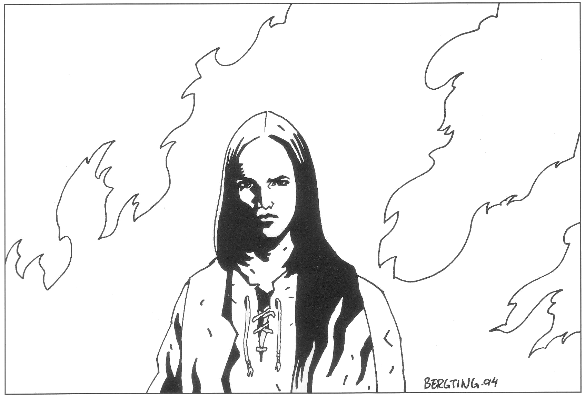
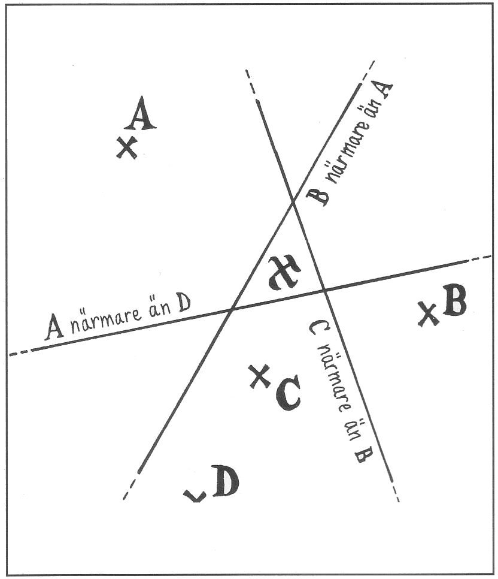
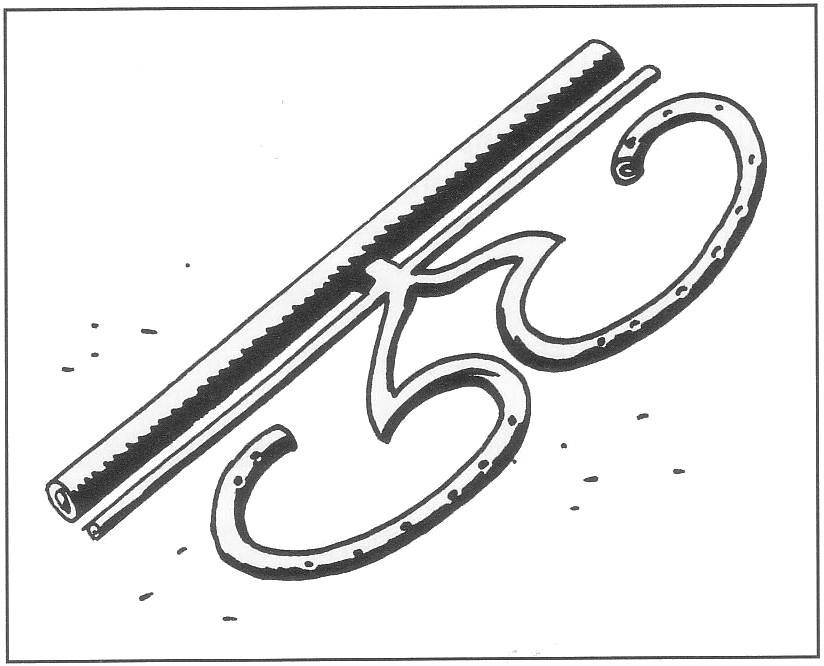
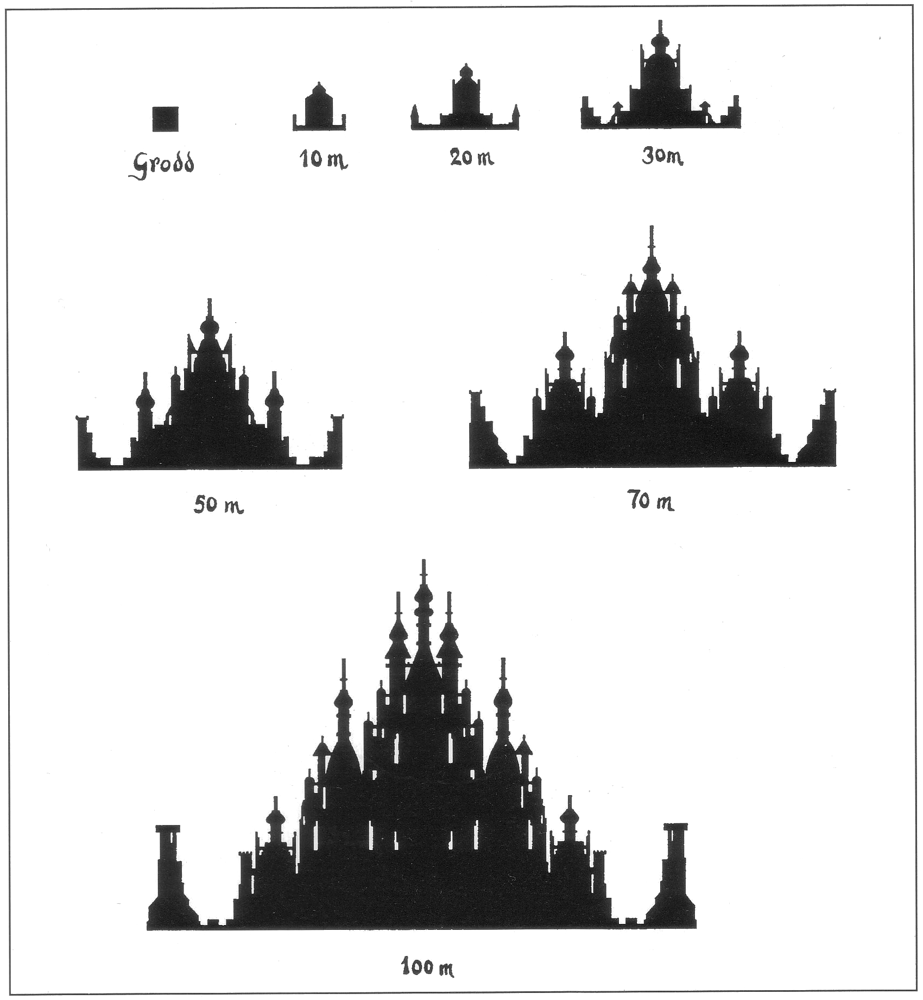
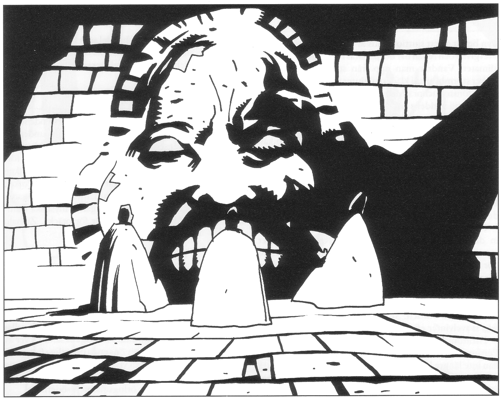
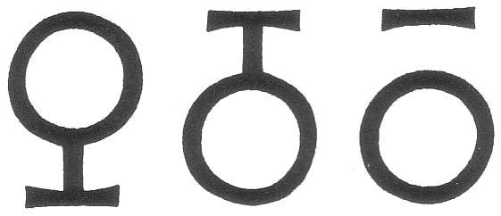

<title>Äventyr på Clusta Noba - Den femte konfluxen</title>

# 06. Äventyr på Clusta Noba

Rollpersonerna måste antagligen äventyra på Clusta Noba parallellt med uppdragen på Marjura om de ska hinna med allting. På Clusta Noba ska rollpersonerna skaffa sig en bas, lokalisera platsen för den femte konfluxen tillräckligt exakt, plantera Store Stenfar, få slottet att gro, ta sig in i det och stärka dess tillväxt genom att avlägsna hämmande faktorer i omvärlden. Spelarna måste sedan fördela sina styrkor mellan kommandouppdrag på Marjura, bevakning av konfluxläget och rena militära operationer om man vill engagera sig i slaget om ön.

## Att skaffa sig en bas

Vid sin ankomst sätter *Bladverk* först av Raugoner och Remuntradyrkare en bra bit ifrån varandra på Marjura (på det att de förra ej må äta de senare, åtminstone inte medan man ser på). Därefter sätter man iland äventyrarna med följeslagare och packning där de önskar på Clusta Noba. Eftersom Melealina snarast vill skicka tillbaka *Bladverk* mot konfluxpunkten i Trakoriska sjön måste sällskapet efter det första dygnet klara sig på egen hand. Upp till tio alvkrigare kan *Bladverk* dock avvara som spelarna så önskar. Den brokiga skaran består hur som helst av en skrymmande hoper folk och utrustning. Första målet är därför att skaffa sig en fast bas på ön, vilket kan vara nog så svårt, speciellt om den redan ockuperats av tusentals soldater.



#### Läger på Marjura

Propsar spelarna på det kan man försöka slå läger på själva Marjura. Äventyrarna vet det inte ännu, men Crurerna har 20% chans per dag att hitta lägret via sin förmåga att känna närvaron av levande varelser. De Crurer som upptäcker lägret är i 25% av fallen Rirbas folk. Om så är fallet kontaktar häxan äventyrarna direkt i lägret istället för via Noriman Bävergäll och uppmanar dem samtidigt att flytta sin bas till Clusta Noba (se avsnittet om Jorddragaren). Om Crurerna som upptäcker lägret istället är lojala med Ottar går de till attack utan att vänta på förstärkning och försöker enligt sina order ta fångar som Shagul kan förhöra.

#### Läger i vildmarken på Clusta Noba

Ett bättre alternativ är att slå läger på en otillgänglig plats i Clusta Nobas berg. Risken att bli upptäckt av fientliga patruller framgår i avsnittet ”Slaget om Clusta Noba” (rubriken ”Att passera obemärkt”). Kom ihåg att klimatet är mycket hårt och att flera i sällskapet är ovana vid vildmarksliv.

#### Kvarter hos lokalbefolkningen

Bästa alternativet är att vinna lokalbefolkningens förtroende och hitta logi på någon av öns gårdar eller ännu hellre i munkskolorna. Det går lättare om man har känningar på ön via yrke, art eller tidigare spel. Om äventyrarna kommer som första grupp till ön blir de normalt hänvisade till byns primitiva värdshus. Främlingar på Clusta Noba är en stor sak och redan nästa dag kommer alla att känna till dem.

Om Clusta Noba redan ockuperats när äventyrarna anländer är det betydligt lättare för en motståndare till ockupationsmakten att få diskret hjälp.

#### Allians med andra styrkor

SL bör inte glömma möjligheten att rollpersonerna kan alliera sig med någon av de andra flottstyrkorna och kampera med dem. En allians med trakorier och stegoser kan balansera styrkeförhållandena om ransarderna allierat sig med Crurerna under Shagul.

## Hur lokaliseras konfluxens läge?

Innan sällskapet kommer till Clusta Noba måste SL slumpmässigt eller medvetet bestämma var konfluxen ska äga rum. Tänkbara platser har markerats med tecknet ”” på spelledarens förenklade hexagonkarta på sid SL-28.

För äventyrarna gäller det att snabbt men diskret lokalisera platsen så exakt som möjligt, helst innan konkurrenterna gör det. Store Stenfar ska planteras och hinna växa upp för att i tid skydda konfluxen. Äventyrarna behöver en karta över ön, till exempel Piondermunkarnas karta från Isakra. Felikermunkarna har i sitt tempel på Clusta Noba en hyfsad karta som kan kopieras. Lantmätaren Gulser kan också rita en god karta på två dygn om han får besöka bergen på nordudden, sydudden samt Felikernas berg.

Sedan man fått en karta kan två olika utgångslägen finnas:

### Alternativ 1: Äventyrarna räddade Nastigast

Nastigast från Oraklets fyra ögon kunde mycket exakt beräkna stjärnornas framtida positioner. Om Melealina har samarbetat med matematikern, kan hon lättare finna konfluxens läge. Rent speltekniskt får spelarna i så fall använda hexkartan över Clusta Noba med de tänkbara konfluxplatserna. De behöver bara hitta rätt hexruta och bör kunna bestämma konfluxens läge redan efter ett par dygn.

#### Alternativ 2: Äventyrarna räddade inte Nastigast

Om Melealina inte kunde arbeta med Nastigast, vet hon bara att konfluxen ska äga rum någonstans på Clusta Noba. Speltekniskt får spelarna använda Översiktskartan på sid SL-28, när de letar efter konfluxens plats. Processen kan då bli mycket tidsödande.

#### Att lokalisera den exakta platsen

Genom att ostört meditera på en viss plats under sex timmar kan Melealina avgöra om avståndet till konfluxen där är större eller mindre än på andra platser där hon mediterat. Sällskapet kan efter hand pejla in konfluxen mer och mer noggrant genom att strategiskt välja platser (se figuren). Alvkvinnan orkar bara meditera på en plats per dygn. Hon kan inte meditera i rutor med fientliga eller neutrala truppstyrkor. Meditationen misslyckas om en patrull kommer in i rutan.

> *Speltekniskt tipz: Om tiden går bör sällskapet ta itu med sina andra uppgifter samtidigt som Melealina letar efter konfluxen. Några man måste avdelas för att skydda alvkvinnan, lämpligen kompetenta SLP som Arn Dunkelbrink, ett gäng alvkrigare från Bladverk eller lönnmördaren Desaba. Finns ingen rollperson på plats vet spelarna naturligtvis inte vad som händer på Clusta Noba. SL spelar då ifatt nästa gång man får kontakt. SL bör inte parallellspela själv eftersom spelarna bör styra pejlingen.*



> *Exempel: Konfluxen ska inträffa vid . Melealina mediterar under sammanlagt fyra dygn på platserna A, B, C och D. För varje ny plats kan en linje dras mitt emellan den och varje tidigare plats. Melealina kan då säga om konfluxen ligger hitom eller bortom varje sådan linje. Genom att välja platserna omsorgsfullt kan konfluxens läge pejlas in till ett allt mindre område.*

#### Hur väl lyckas pejlingen?

Tiden går och till slut måste man bestämma sig för en plats där man tror konfluxen ska äga rum.

Om spelarna funnit rätt ruta på hexkartan enligt alternativ 1, slår SL 2T100. Tärningsslaget anger hur många meter Melealinas valda plats ligger från det korrekta läget. Har man haft hjälp av mäster Gulser med mätningarna dras 50 från varje tärningsslag där negativa tal räknas som noll.

Om sällskapet letat enligt alternativ 2, kan de meditera och mäta så länge de gitter. Närhelst de vill får de gissa på en exakt punkt på skissen över Clusta Noba, varpå SL mäter avståndet till den korrekta platsen. Om mäster Gulser hjälpt äventyrarna halveras det uppmätta avståndet.

> *Speltipz: Som spelledare bör man självfallet respektera sina spelares idoga pejlande och beräknande. Inte desto mindre blir spelet intressantare om fröet planteras på lagom avstånd, säg sextio meter, från konfluxen så att utgången förblir oviss in i det längsta.*

#### Hur kan konkurrenterna hitta konfluxen?

Shagul kan hitta konfluxen på samma sätt som Melealina enligt alternativ 2 men utan hjälp av Gulser. Bara en klon kan meditera åt gången.

Trakoriernas och Ransardernas astrologer är sämre och har mindre chans att lokalisera konfluxen. Varje speldag som respektive flottstyrka har trupper på Clusta Noba får de gissa på en hexruta som deras astrologer har möjlighet att besöka. Väljer de fel får de gissa på nytt nästa dag. Gissar de på konfluxrutan eller en angränsande ruta meddelar SL att de är nära. Gissar de på en ruta två rutor från konfluxen meddelar SL att de är nära i 50% av fallen. För att verkligen identifiera konfluxrutan måste de gissa på rätt ruta två gånger. Trakorierna och Ransarderna kan inte komma närmare än till rätt hexruta vilket speltekniskt innebär att de gissar 3T100 meter fel. Det kan innebära att äventyrarna fortfarande har en chans att smyga in och plantera Store Stenfar på den rätta platsen.

### När inträffar konfluxen?

Konfluxen äger rum senast femtio dygn efter äventyrarnas ankomst till Clusta Noba eller när de två konflux -punkterna sammanfaller innan dess. För att konflux-punkterna ska sammanfalla måste jorddragaren hinna dra Marjura med Clusta Noba till Trakorien, vilket tar honom 30 dygn ±20 timmar. Han måste alltså komma iväg inom 20 dygn för att inte konfluxen ska bli kluven.

#### Astrologer förutsäger tidpunkten för konfluxen

Så snart Marjura börjat röra sig kan alla astrologer ganska exakt säga när konfluxen ska äga rum. Varje astrolog anger en tid ±K timmar från den exakta och tror att denna tidpunkt är rätt ±K/2 timmar.

```
  Astrolog             K (timmar)
  Melealina¹                4
  Melealina²               12
  Shagul                    8
  Andra astrologer         48
```

¹ Om hon arbetat med Nastigast
² Om hon inte arbetat med Nastigast

## Store Stenfar

När sällskapet har gissat var konfluxen ska äga rum måste de skydda platsen. Det är bara en tidsfråga innan någon armé kommer dit och äventyrarna kan inte räkna med att hålla stånd på egen hand. Bästa sättet är att befästa platsen med hjälp av det ointagliga, växande slottet Store Stenfar. Det är naturligtvis inte är så lätt som det låter.

Store Stenfar måste planteras, förmås att gro och hinna växa sig så stor så att han täcker platsen för den femte konfluxen. Dessutom måste man ta sig in i och accepteras av slottet.

### Store Stenfar planteras

Store Stenfar behöver inte grävas ner som ett vanligt frö, men om man inte får honom att gro omedelbart kan man gömma honom på platsen tills förutsättningarna är uppfyllda och täcka honom med jord så att inte det gyllene skenet avslöjar platsen. Melealina planterar gärna sin blomsterek ovanför fröet så att det innesluts i slottet. Blomstereken kommer då att på ett smakfullt sätt inrymmas i riddarsalen och växa som vanligt eftersom slottet släpper igenom dagsljus.

### Store Stenfar gror

Store Stenfar gror endast till vargkvinnan Raogas ylande eller till tonerna av guldnyckeln från Krau-Ki. Kan inget av dessa villkor uppfyllas får man klara sig utan slott.

Om Raoga — det vita ögat från *Oraklets fyra ögon* — finns med behöver man bara släppa henne lös. Hon kommer förtjust att gå fram till den glittrande jättekristallen, sätta sig på den och börja sjunga. Snart förstärks och ackompanjeras hennes sång av mäktiga toner som får berget att skälva. De tycks ibland komma från kristallen, ibland från själva jorden och påminner om klangen från stora metallstycken eller sången från havsisen när den bryts upp av våren. Svarta metallformationer skjuter ut från kristallen som grenar och rötter på ett sätt som får åskådaren att gå en bit åt sidan. Utskotten breddas och viks så att man inom ett par minuter vare sig ser kristallen eller vargkvinnan längre. Snart står inför åskådarna en svart, sluten cylinder över vars yta metallstråk krälar som ormar, smälter samman, bildar nya ytor och skjuter nya skott. Hela tiden hörs den öronbedövande musiken. Efter 20 minuter växer på cylinderns övre periferi sex grinande mytiska djurhuvuden fram, inte olika stavdemonerna i Bythos. Efter ytterligare tio minuter kommer kloförsedda armar fram ur metallen. Två av skulpturerna bär svärd, två bär spjut och två bär pilbågar. Efter en timmes tillväxt framträder en stängd port i cylindern. På ytterligare tjugo minuter växer två spjutförsedda vakter fram ur väggen på båda sidor om porten.

Groningsprocessen är avslutad efter två timmar. Inget mer händer med slottet förrän villkoren för ytterligare tillväxt uppfylls enligt nedan.

Om Store Stenfar gror för att någon spelar på guldnyckeln från Krau-Ki är förloppet likartat. Musikanten kan antingen stå nära fröet och hamnar då inne i det färdiga tornet eller mer vid sidan av och hamna utanför. När tillväxten är avslutad rämnar nyckeln och kan inte lagas.



#### Vad säger grannarna när Store Stenfar dyker upp?

Ljuden när Store Stenfar gror eller växer hörs sex hexrutor bort från platsen. Om trakorierna och/eller ransarderna sköts av spelare, rapporterar SL bara ljudet och låter dem agera efter behag.

Annars kommer alla arméer inom hörhåll om möjligt att skicka patruller för att undersöka vad som händer. Likaså kommer lokalbefolkningen under de närmaste dygnen att besöka platsen. Blir de nyfikna för många och för närgångna kommer slottet att anse sig belägrat och aktivera demonerna på murarna till försvar. Se nedan.

### Store Stenfar växer

#### Vad krävs för att Store Stenfar ska växa?

Store Stenfar är en mytisk men känslig gestalt kopplad till spelet runt den femte konfluxen. Han växer bara om händelseutvecklingen går åt rätt håll. SL kan gärna låta Stenfar visa eventuellt missnöje genom att slå i dörrar etc.

Speltekniskt styrs växten av ett tillväxttal (S) som är noll från början och modifieras enligt följande:

```
  Omständighet                  Modifikation av S
  Raoga fortsätter sjunga inne i
  slottet                                +1
  Jorddragaren befrias                   +1
  Kmeard dör                             +1
  Blåbite aktiveras med effektgrad ≥6    +1
  Ebharing försvinner från spelvärlden   +1
  Jordblodkällan släcks                  +1
  Alla Crurer dränker sig i havet        +1
  Slottets periferi är högst trettio
  meter från konfluxen                   +1
  Shaguls sista klon dör                 +1
  Crurerna dominerar hexruta med den
  femte konfluxen                        -1
  Någon som inte har tillträde till
  slottet finns i konfluxens grotta      -1
  *Landakennings lagoband* utsträcks
  till Palamux och Stegos                -3
```

#### Hur växer Store Stenfar?

Slottet tillväxer sfäriskt (som ett klot), lika mycket under jord som ovanför. När tillväxtsfären når konfluxens grotta bryter slottets svarta rötter in i klipprummet, omsluter allt och alla som finns i det och inkorporerar platsen som ett rum i sina källarvåningar. Konfluxen är därmed säkrad under förutsättning att man inte fått in någon obehaglig varelse i slottet på köpet.

Sfärens storlek beror på tillväxttalet S:

```
  S      radien av Store Stenfars utbredning
  <0     Grodden vissnar och dör
  0-1    grodden står oförändrad som ett ensamt torn
  2      10 meter
  3      20 meter
  4      30 meter
  5      50 meter
  6      70 meter
  ≥7     100 meter
```

När slottet växer expanderar det med S meter per dygn åt alla håll till sin nya gräns. Proceduren påminner om groningen. Ovan jord tränger det undan allt i sin väg. Underjord skjuter slottet rötter genom berget. Rötterna vidgas och bildar underjordiska kamrar som kan nås via trappor från marknivån. Slottet kan aldrig krympa även om S minskar igen. Om S blir negativt dör slottet och står kvar som en bräcklig ruin av svart sten. Slottet kan inte återupplivas om det en gång dött.

Om Shagul, Ebharing, någon odöd eller vandöd kommer in i slottet före konfluxen dör det omedelbart. Landakennings lagoband förmår emellertid inte väcka upp döda inne i slottet.

### Store Stenfars utseende

Store Stenfar beskrivs inte detaljerat, dels av utrymmesskäl, dels därför att spelarna ändå inte hinner utnyttja de många kala och oinredda rummen. De skarvlösa murarna är helt svarta, men taken glänser som silver. Nedanstående silhuetter ger en uppfattning om hur slottet ter sig på håll i plan terräng. Siffrorna nedanför varje silhuett anger slottets ungefärliga radie. Tornen på kanterna är muren i genomskärning.



#### Insidan

Trots de svarta väggarna är slottets inre lika ljust som en skuggad plats utanför murarna. Man känner sig därför inte instängd trots att fönster saknas i många rum. Ljuset kommer inte från någon särskild källa utan fyller rummen som om väggarna inte stoppade omgivningens ljus. Om natten är det följaktligen lika mörkt som ute, men inget hindrar att man tänder facklor och lampor. Det finns inga öppna spisar, men gör man ändå upp eld, finner man att slottet släpper ut röken genom väggarna lika behändigt som det släpper in ljuset. Det finns inga lås inne i byggnaden och går heller inte att montera några eftersom inga verktyg biter på väggar eller dörrar.

### Några viktiga utrymmen

#### Gästbokens kammare

På en piedestal i ett rum längst in i slottet ligger en stor bok. Boken kan inte flyttas eftersom ryggen är en del av piedestalen som är en del av golvet. Sidorna är vita och släta som pergament av bästa kvalitet. Man kan skriva sitt namn i boken en gång med vilket spetsigt föremål som helst. Försöker man skriva något mer eller något annat lämnar skrivdonet däremot inga märken på sidorna.

Store Stenfar accepterar bara varelser som skrivit sitt namn i boken. Man kan med blotta handen radera namnet på personer som skrivit in sig senare än en själv, men inga som skrivit in sig tidigare.

#### Stenansiktets kammare

Högst upp i slottet finns ett dovt mullrande rum vars ena vägg helt upptas av ett mansansikte. Ansiktet ser skulpterat ut, men tittar man på det med några timmars mellanrum ser man att minen har ändrats. Här sitter Ranzinermunkarna i skift med sina griffeltavlor och lyssnar till Store Stenfars budskap.

#### Vattenreservoaren

Längst ner i slottet finns en reservoar med friskt vatten som rötterna suger upp. Innevånarna behöver alltså aldrig törsta. Store Stenfar håller däremot inte med mat, men — o trevliga tillfällighet — Blomstereken kan föda upp till tjugo man med sina frukter och sin sav om den finns i riddarsalen.

#### Riddarsalen

I slottets exakta mitt finns en stor sal som kommer att växa till gigantiska proportioner med gallerier i flera våningar när slottet växer. Mitt i salen ligger kristallfröet nedbäddat i golvet. Om Blomstereken planterats över den lyser dess ljus fram mellan rötterna och badar salen i ett sällsamt och underbart ljus.

### Hur kommer man in i Store Stenfar?

Bara slottet självt kan öppna porten och släpper bara in acceptabla personer. Om man använder portklappen i form av ett tjurhuvud öppnas porten för varelser som slottet accepterar. Om oacceptabla personer dyker upp inne i slottet eller tidigare accepterade personer blir oacceptabla, attackeras de av väggarnas försvar enligt nedan.

* De som får slottet att gro eller befinner sig inom 20 m från slottet när det gror kommer alltid att accepteras.
* De som befinner sig i konfluxens grotta när denna innesluts under slottets tillväxt kommer alltid att accepteras.
* Ranzinermunkar, Raoga och Arn Dunkelbrink accepteras alltid.
* Den som besitter landakenningens mäktigaste vapen accepteras alltid. Innan Crurernas Stenbro är klar kanske någon av äventyrarna besitter Clusta Nobas mäktigaste vapen. Så snart stenbron är klar blir Ebharing på Marjura mäktigare och bäraren av det tidigare mästervapnet blir oacceptabel, kastas ut eller görs ner. Svärdet Blåbite i Krau-Ki är det enda vapnet i närheten med större makt än Ebharing (detta under förutsättning att vapnet fortfarande har effektgrad >6; se rubriken ”Svärdet Blåbite”). Innan man lagt vantarna på Blåbite finns därför en stor fara: Shagul kan när som helst klappa på porten till Store Stenfar och stiga in, vilket i sin tur dödar slottet. Som tur är känner nekromantikern inte till denna svaghet.
* Den som har kroppskontakt hud mot hud med en redan accepterad person accepteras, men bara så länge han håller kontakten. Man kan alltså ledsaga sina vänner in till gästboken och släppa dem först sedan de skrivit in sig.
* Den som skrivit sitt namn i slottets gästbok accepteras så länge namnet står kvar.

Efter konfluxen gäller enbart preferenserna hos slottets
herre för vem som ska accepteras.

### Store Stenfars försvar

Slottet Store Stenfar är genom sina försvarsmekanismer
praktiskt taget ointagligt. Det kan bara falla genom list,
slarv, förräderi eller ett totalt misslyckat äventyrande.

* Ingen magi fungerar inom slottets radie utom magi bunden i magiska vapen.
* Store Stenfars murar är av en svart metall som inte påverkas av några fysiska eller magiska attacker, eller någon annan magi alls, för den delen.
* På slottets yttre murar och på byggnadernas avsatser sitter människostora grinande metalldemoner med två meters mellanrum. De är utsmyckningar och en del av själva muren, och därmed är de HELT osårbara. De har perfekt mörkersyn och ser även osynliga varelser. De kan inte luras med illusioner, sövas eller påverkas av magi överhuvudtaget. Var tredje demon bär långsvärd som den hanterar med FV 12+S. Var tredje demon bär ett spjut som den kan stöta med FV 12+S eller kasta med FV 10+S, varvid ett nytt spjut växer ut i dess hand efter två minuter. Var tredje demon, slutligen, har en långbåge som den kan avlossa varannan stridsfas med FV 12+S. Nya pilar växer ständigt ut i kogret den har över axeln. Normalt är varelserna orörliga statyer, men om någon icke accepterad varelse kryper eller flyger över murarna blir de närmaste demonerna levande och går till attack. Om mer än femtio oacceptabla personer samtidigt kommer inom femtio meter från murarna aktiveras murens samtliga demoner och börjar bekämpa främlingarna. SL bör uppmärksamma risken för ett blodbad på oskyldiga om köpmän och tiggare samlas utanför murarna.
* Alla innerväggar i slottet är täckta av reliefer av krigsmän. Om en oacceptabel person kommer in i slottet blir relieferna levande. Först stirrar de på främlingen och pekar mot utgången. Om inkräktaren omedelbart lämnar slottet kan han ta sig ut oskadd via porten som öppnas. Så snart han stannar eller rör sig åt fel håll går relieferna till attack på samma sätt som varelserna på murarna. Om demonerna på murarna är allmänt aktiverade varnar inte relieferna utan attackerar omedelbart varje inkräktare. Relieferna har samma förmågor och är lika vanligt förekommande som demonerna.
* Det finns bara en port in i Store Stenfar och den kan varken forceras med våld eller magi. En spjutförsedd staty står på var sida om porten och aktiveras på samma sätt som murarnas demoner, men ger dubbel skada genom sin storlek. Innanför porten finns ett förrum och en inre port. Den inre porten öppnas bara sedan den yttre stängts och under förutsättning att ingen oacceptabel person befinner sig i förrummet.

### Store Stenfar och Ranzinermunkarna

I *Oraklets fyra ögon* samarbetade äventyrarna med Ranzinermunkar från Paratorna. Bodonius eller Kinquarras av Ranz kan fortfarande finnas i sällskapet och kommer till användning på Clusta Noba. Fler Ranzinermunkar kan ansluta i Isakra. Enligt munkarna lämnade den gudomliga rösten berget Ranz när Vox Ranzina fullbordades och sekten upplöstes. Inuti Store Stenfar känner de emellertid att samma röst har återuppstått och de önskar inget hellre än att tjäna slottet under resten av sin livstid. Kärleken tycks vara besvarad eftersom slottet accepterar alla Ranzinermunkar.

Ranzinerna förmår ensamma tolka vad Store Stenfar säger tack vare sitt upptränade sittfläsk. De lyssnar dag som natt till den gudomliga varelsens tal i stenansiktets kapell. Slottet säger en mening på tre dagar. För vanliga människor låter rösten som ett knappt hörbart, monotont muller, men för ranzinermunkarna är han snabb som en sportkommentator. Något samtal är det inte fråga om eftersom slottet antingen inte hör eller inte bryr sig om vad andra säger.



Genom Ranzinerna kan SL meddela spelarna:

* allsköns viktig information som de missat och som SL tycker de behöver
* det faktum att slottets tillväxt kan påverkas av händelser i närheten
* information om konfluxens verkliga läge. Store Stenfar är antingen ledsen för att avståndet är så stort att han inte mäktar innesluta platsen i tid, eller lycklig för att den snart är hans. Han anger avstånd och riktning till platsen, men i svårtolkade måttenheter. Avstånd anges i ”pelarkretsar”. Spelarna far själva lista ut att en pelarkrets motsvarar omkretsen av en pelare i de grå hallarna från *Kristalltjuren*, där Store Stenfar bodde innan han kom till spelvärlden. En pelarkrets motsvarar tvåhundra steg eller sextio meter. Riktning anges mot föremål som är så avlägsna att rollpersonerna bara grovt kan gissa vilket håll som avses, såvida de inte behärskar fjärrsyn. Exempel: ”Konfluxen vill ske trekvarts pelarkrets åt kristallfingret” (Shamashi finger utanför Ziddisbar i Trakorien).
* information om vad som gör Store Stenfar lycklig eller missnöjd, dvs. vad som påverkar tillväxttalet S. Meddelandet kan exempelvis vara att ”Stenfadern sörjer enär brodern under bergen ännu blöder” (om jordblodkällan) eller att ”Stenfadern glädjes då den behornade nu fatt ro” (om Kmeards död)

## Clusta Noba

I lugnare tider tjänade Clusta Noba som handelspunkt för lokala varelser av skiftande arter. Höst och vår fick man färsk påfyllning av varor via svavelkonvojen söderifrån. Nu är situationen helt annorlunda. Crurerna utplånade Arhemkolonin år 611 eO och körde snart bort alla människor från Marjura. Efter något år hade dvärgar och jättar också fått nog och vandrade bort över isen i norr sånär som på några envisa kämpar som ville sälja sig så dyrt som möjligt. Därmed isolerades Clusta Noba så att de flesta övergav ön och sökte sig till fetare trakter, särskilt inför hotet av Crurernas invasion via stenbron. Flera av personerna på Clusta Noba är flyktingar från Arhem och beskrivs i *Svavelvinter*.

Lönnmördaren Tobik från *Svavelvinter* kan finnas på ön som en mystisk osynlig hjälpare. Han/hon vill hjälpa äventyrarna att hämnas Gobrugda/Manghalde som en gång var hans uppdragsgivare.

### 1. Byn Clusta Noba

Byn består av ett sjuttiotal hus av vilka de allra flesta står övergivna och redan har börjat slitas i stycken av det kärva klimatet. Vandrar man upp från stenpiren i hamnen rycker stormbyarna i kläderna, tjuter runt ödeknutar och slår i fönsterluckor. Man tycker sig med viss rätt ha kommit till världens ände.

#### Värdshuset ”Svinhugg”

På ett hus vid bytorget finns en bastant skylt fastspikad med ett ilsket galthuvud och texten ”Svinhugg” ursinnigt huggen ur plankorna. Längre ner står ett liksom ursäktande ”Välkommen” ristat med sirlig kniv. Ljus tränger ut genom de sprickor man inte lyckats täta. Knackar man på öppnar Hildur Ornetand, värdshusvärden från Arhem, som med sin familj tagit över bykrogen.

Huset är en storstuga med ett par mindre rum längre in där familjen bor. Man håller logi i ett övergivet grannhus för de enstaka jägare och köpmän som ännu gör sig ärende till ön. Någon handfull pälsjägare som bara med svårighet kan skiljas från sina bytesdjur sitter hopkurade i hörnen, bligar misstroget, ovana vid möbler och väggar. Om någon armé ockuperat byn sitter lägre officerare vid borden. SL kan plocka in andra personer från svavelvinter efter behag och omständigheter.

Förutom familjen Ornetand bor Guzier da Ollach och Perrima i huset. Sedan den gamle mannen fick slag har han inte längre kontakt med omvärlden utan stirrar bara framför sig. Den tidigare Kmordadriuden Perrima＊ har förfallit å det sorgligaste till prostitution och spritmissbruk. Hildur låter henne ligga vid elden på nätterna, till viss del av medlidande, till viss del av skamsen lystnad — hans reumatiska hustru uppskattar inte längre kroppsövningar i sänghalmen.

> *(＊: Om Perrima har rönt ett annat öde i din kampanj är den sista Kmordadruiden någon annan.)*

#### Smeden Kuveste

Bysmeden, som inte har familj och därmed mindre att förlora, har stannat kvar. Han kan inte räkna längre än till fingrar och tår och blir som regel lurad av sina kunder.

#### Andra fasta innevånare

I övrigt bor fem fiskarfamiljer och tre fårfarmare kvar i byn.

### 2. Moggers gård

Handelsankorna Asimund och Gizmo Mogger köpte en av gårdarna vid inre sundet när de tvingades fly från Arhem. Då fanns ännu en viss trafik på Clusta Noba vilken nu har sinat. Ankorna stannar kvar därför att Gizmo ogärna överger en investering, men i byn och bland jägarna ryktas att bröderna tvingades lämna hela sin nedgrävda förmögenhet på Marjura och fortfarande hoppas få den tillbaka. I fyllan händer det att vildhjärnor kastar sjöfågelägg på deras hus, en ohygglig skymf bland ankor.

Ankorna sköter den lilla handel som fortfarande lever, såsom leveranser till munkskolorna och tobak till pälsjägarna. De håller ett enkelt varulager som man kan handla från.

### 3. Ödegård

Gårdens kvinnor och barn har flyttat till okänt öde sedan familjens båt försvann med man och allt under en fiskefärd för två år sedan. Gården anses otursdrabbad och undviks av alla utom av Zymald, *Måsen* kallad, en förståndskadad herdepojke och sonson till hertigen vilken leker stad därinne med tallkottar och musselskal. Pojken har en påhittad beskyddare som han kallar ”Mangarux den fruktansvärde”. Han hjälper gärna mystiska främlingar efter förmåga om de inte är för otäcka. Zymald försäkrar att även Mangarux ställer upp.

### 4. Hertigens gods

Byns ålderman kallas skämtsamt ”Hertigen av Clusta Noba”, eftersom han tar sin uppgift på stort allvar. Han har vägrat lämna sin ö och sköter gården med sina fyra söner och deras familjer. Manbyggnaden där alla bor är ett traditionellt långhus i sten med torvtak. Fåren vallas på natten in i husets ena ände. Hertigens familj lever av fårskötsel och fiske och äger öns enda egentliga fartyg, en tvåmastad kustseglare som visserligen inte kan hävda sig i sjöstrid, men som under någon av hertigens söner lätt seglar ifrån de klumpiga örlogsmännen söderifrån.

På gården bor även den ytterst olycklige Klomelliska skalden Arvor, samt ett koppel besvärliga släktingar som flytt från byn vid fyren på Pik Muur.

### 5. Kyrias högre tacticum

Kyrias högre tacticum är en oglamorös trakorisk officers-skola med högt anseende bland yrkeskrigare ur lägre samhällsklasser. Adelsmän föredrar som regel mer bekväma inrättningar närmare civilisationen. Den tidigare hirdmannen Kyrias har anlagt sin skola på Clusta Noba för att komma så långt ifrån hemlandets korrupta slapphet som möjligt och för att kunna använda öns munkar som läromästare. Kyrias är en i grunden fridsam person, men som officer helt lojal mot Trakorien. För skolans räkning har Kyrias köpt ett mindre stenbrott med tillhörande gård nära byn.

#### Militär styrka

Kyrias förfogar över totalt trettio soldater, varav tio kan användas som truppledare med ledarvärde 1. Därtill tre högre officerare med ledarvärde 3 och Kyrias själv med ledarvärde 5.

### 6. Felikernas kloster

Felikerna är en stor munkorden med huvudsäte i Nastrôl. Felikerna håller mängder av katter som läromästare vilkas läte och lukt sätter sin prägel på klostret. Till skillnad från Hypherernas kala stenhus, är Felikernas kloster vackert uppfört i ädelträ som skeppats in från södern. Byggnader är samlade runt en gårdsplan som bara kan nås via porten om man inte vill klättra över den fem meter höga palissaden. Runt klostrets platå finns ytterligare en tre meter hög stenmur uppförd.

Munkarna tränar mycket på tålamod och smidighet och att hushålla med sina krafter tills blixtrande snabb handling krävs. Munkarna lär sig som katter agera på egen hand. Liksom katter tillåter de sig livets njutningar så länge skärpan inte trubbas. De har lättare till samtal och skratt än de gravallvarliga Hyphererna.

#### Militär styrka

Munkarna är sextio stycken, varav tjugo är kvinnor. Alla saknar ledarvärde. De är utmärkta till kommandoräder i mindre grupper, men kan inte ingå i större enheter än en pluton.

### 7. Hypherernas kloster och befästningar

Hypherorden i Nastrôl bildades ursprungligen för att sköta Eniaken, den stora svamphärva som vaktar gränsen mot Kargom på Palamux. På Clusta Noba har de byggt sitt kloster uppe på en otillgänglig klippa som bara nås via en stig så brant att varken vagnar eller klövjedjur tar sig upp. Klostret utgörs av några enkla stenhus, men runt platåns periferi har de odlat fram en mindre version av Eniaken, ett tio meter högt virrvarr av metertjocka myceltrådar. Mycelet kan lätt huggas igenom med en yxa, men i praktiken kan man inte gå så nära. Här och där sitter sporkapslar som med fruktansvärd kraft skjuter sporer vid minsta störning.

Räkna med att mycelet har hundra sporkapslar. Tio kan återbildas per dag sedan de exploderat. En exploderande sporkapsel sprider 5+1T10 sporer i slumpartad riktning. Varje spor kan göra 3T6 i skada med en räckvidd på 150 meter. Man kan alltså inte gå i närheten utan livsfara. En hypherermunk kan med sin sång rikta skotten hos en spor åt ett visst håll och få den att explodera på 1T6 stridsfaser. Sedan Crurerna började bygga sin bro har munkarna expanderat svampen för att avgränsa landstigningsplatsen. Ännu är bara de två befästa hexsidor som utgår från klostret täckta med svampmycel. Andra befästningsverk består bara av en enkel pallisad med stenar.

Den som vill inta klostret måste först desarmera alla sporkapslar genom att träffa dem med missiler eller skicka fram kanonmat tills ammunitionen är slut och sedan storma.

Om gäster ska tas in i klostret, måste de lägga sig i en träkista och bäras in i en säker stenbyggnad av två munkar. Den som rör sig nära svampen måste varje SR klara ett SMI-slag för att inte utlösa någon sporkapsel.

#### Militär styrka

Hyphererna ägnar sig mer åt mental träning än stridskonster. Av de trettio munkarna i klostret kan bara tio användas militärt och då för försvar. Deras förmåga att röra sig helt omärkligt gör dem emellertid ytterligt lämpliga som kurirer. Speltekniskt kan ingen upptäcka kurirer från den armé som har hjälp av Hyphererna oavsett om de måste passera rakt genom fiendens läger.

#### Lojalitet

Hyphererna är strikt neutrala mot civiliserade folk och svurna fiender till barbarer av alla sorter. De deltar bara i kriget i självförsvar.

### 8. Crurernas läger

Vid Crurernas läger finns några enkla, fönsterlösa hus uppmurade där borttappade kroppsdelar sätts fast igen med grova sydon m.m. Närmast stranden står tre kraftiga krigsmaskiner, s.k. trebucheter, som oupphörligt kastar stenar mot murarna på andra sidan sundet. Nattetid använder munkarna dessa stenar för att förstärka murarna.

Oupphörliga strömmar av vandöda bär ständigt sten till bron som ska låta dem inta Clusta Noba. Bron ser ut att när som helst bli klar. Vid ett givet tillfälle finns 800 vandöda och 300 odöda vid lägerplatsen.

#### För Spelledaren:

Bron blir klar exakt 7 dagar efter att äventyrarna kommit till Clusta Noba, men sedan jorddragaren befriats måste den byggas på under ytterligare 14 dagar eftersom vattnet då har stigit.

### 9. Noriman Bävergälls fädernesgård

Ett par kilometer norr om Crurernas läger finns de nedbrända resterna av en bondgård. Detta är platsen där den lokale jägaren Noriman Bävergälls föräldrar bodde och det ställe där Rirba tar kontakt med äventyrarna. En förfallen, tjugo meter lång träpir leder ut i vattnet.

### 10. Geysirfält

Sydostsluttningen på Clusta Nobas högsta berg är genomsatt av varma källor som då och då skjuter kaskader av hetvatten mot skyn. Hela hexrutan ligger för det mesta i dimma oh är ett bra gömställe.

### 11. Fyrtornet

Fyrtornet på Clusta Noba är en säregen konstruktion. Det är murat som en tjugo meter hög avsmalnande skorsten. Nere i berget bubblar gruvgas med jämna mellanrum fram via en hetvattenkälla. Den heta gasen stiger genom skorstenen upp till en järnbur där fyrvaktaren håller glödande kol. Kolet antänder var fyrtionde minut gasen som skjuter i höjden med en ljusfontän och ett visslande ljud som leder in fartyg till hamnen. Fyren sköts av Heria, en gammal excentrisk parfymhandlerska av blåhudingarnas stam. Hon bor i ett skjul nedanför tornet. Man kommer upp till kolburen via en spiraltrappa murad på skorstenens utsida.

## Om konsten att umgås med munkskolor

#### Att vinna munkarnas förtroende

Sedan många år finns alltså två munkskolor och en officersakademi på Clusta Noba. Man har valt den karga miljön för att härdas i den traditionella Banzikans anda. Skolorna samarbetar trots att de har olika bakgrund.

Om rollpersonerna lyckas alliera sig med någon munkskola får de en värdefull, skyddad bas bland ärliga och dugliga människor med lokalkännedom. Munkarna bör dock inte vara alltför lättflörtade. För det första har de dragit sig tillbaka till Clusta Noba just för att få vara ifred. För det andra vill de inte bli inblandade i något bråk mellan de mystiska härar som dyker upp — vad angår krusningar på flodens yta stenen som vilar på dess botten? För det tredje har de onda tiderna gjort dem misstänksamma, och slutligen har de ont om allt inklusive mat och utrymme. Hyphererna släpper mycket ogärna in någon på sitt område, inte minst för att en oförsiktig rörelse kan kosta besökaren livet. Felikerna och Kyrias tacticum tar vänligt emot besökare, men hänvisar för mat och logi till byns värdshus.

#### Intermezzo

Allt sedan munkskolorna anlades på Clusta Noba har det
varit en sägen att öns bäste krigare en dag ska hämta upp
en gigantisk svart pärla ur en jättepurpursnäcka på Kalmanzerrevet en sjömil öster om Clusta Noba. Äventyrarna kan springa ut på havsbottnen för att söka pärlan när det blir ebb under Clusta Nobas vridning. De kanske finner snäckan, men sedan ska de ta sig in i den och tillbaka innan flodvågen återvänder... Ett litet sidoäventyr utvecklas genast.

Speltekniskt kan sällskapets förtroende anges som en förtroendepoäng FP. När äventyrarna först möter munkarna är FP=0.

```
Händelse                                   Hur FP påverkas
Sällskapets talesman                              +(KAR/4)
  (snittvärde om flera)            1 om talesman är gammal 
                                     -1 om talesman är ung
Per hedersam mänsklig stridsman
  eller munk i sällskapet
  (Desaba presenterar sig som munk)                     +1
Per identifierad magiker eller tjuv i sällskapet        -1
Varje gång en rollperson vinner ära
  enligt Banzikans hedersbegrepp＊                      +1
Varje gång en rollperson förlorar
  ära enligt Banzikans hedersbegrepp                    -1
Arn Dunkelbrink i sällskapet                            +6
Store Stenfar ≥30 meter och kontrolleras av sällskapet  +3
Blomstereken ≥6 meter                                   +6
Den svarta pärlan från jättepurpursnäckan hämtas        +6
Munkarna och rollpersonernas får gemensamma
  fiender på ön som är dem båda övermäktiga   FP dubbleras
Direkt fientlig handling mot någon munk        FP halveras
```

＊ Bara hedersamma stridsmän eller munkar kan vinna eller förlora ära. De andra anses bara vara bihang. Extremt dåligt beteende hos dessa bihang drabbar dock den hedersamme i deras sällskap.

För att en händelse ska påverka FP måste munkarna känna till den. Eftersom munkskolorna har täta kontakter gäller samma FP mot dem alla. Vissa modifieringar skiljer dem emellertid:

```
Hyphererna generellt                                    -6
Kattman i sällskapet Felikerna                          +3
Trakorisk officer i sällskapet Kyrias                   +6
```

```
FP    Effekten av FP
≥0    Sällskapet får besöka skolan och samtala med
      priorn
≥12   Sällskapet får kost och logi i skolan
≥20   Sällskapet får obegränsad hjälp att gömma sig,
      utföra sina uppdrag etc. så länge det inte strider
      mot munkarnas principer
```

### Om Banzikans hedersbegrepp

> *FV i Kulturkännedom => valda delar av denna information beroende på B-FV.*

Alla tre skolorna bekänner sig till Banzikans hedersbegrepp. Hyphererna tolkar reglerna strängast medan de andra två är mer överseende.

Banzikan är en urgammal krigarkodex som också beskrivs i *Trakorien*. Den har tre ideal: eken som förmår avgränsa sin röta gentemot kärnan, fröet som samlar sitt väsen i en skyddad kammare och stenen som vilar oberörd på strömmens botten. Banzikans symbol föreställer de tre idealen.



Heder är ett centralt begrepp i Banzikan. Man kan inte uppnå hög rang enbart genom skicklighet utan måste också kunna uppträda korrekt och inse sitt värde och sina begränsningar för att inte drabbas av vanära. Banzikan säger att en man växer med sina utmaningar, dvs. genom att ge sig i kast med uppgifter värdiga sin förmåga. Att ägna sig åt för lätta uppgifter anses vanärande, att anta för svåra utmaningar anses dåraktigt. En mans heder bestäms därför framförallt av hur han hanterar utmaningar.

Med utmaning menas här varje handling som ifrågasätter någons rang eller förmåga. Det kan vara allt från en förolämpning till överlämnandet av en alltför värdefull gåva eller en inbjudan att duellera med vapen. Banzikan gör ingen skillnad mellan sådana provokationer, vilket kan överraska spelarna om de inte känner till att en generös gåva kan jämställas med en förolämpning eller en örfil.

### Vem gäller hedersbegreppet?

Hedersbegreppet gäller framför allt de insatta. De som inte känner till Banzikan anses sakna ära och bör behandlas med överseende av de mer upplysta som annars drar på sig egen vanära. Hedersbegreppet gäller inte fiender i krig. Det är acceptabelt att göra ner klasar av dåligt utrustade fiender om motivet för striden som helhet är ärofullt. Onödigt dödande eller grymhet är dock vanärande i sig.

Tabellen visar hur en man av Banzikan bör hantera utmaningar för att inte förlora heder.