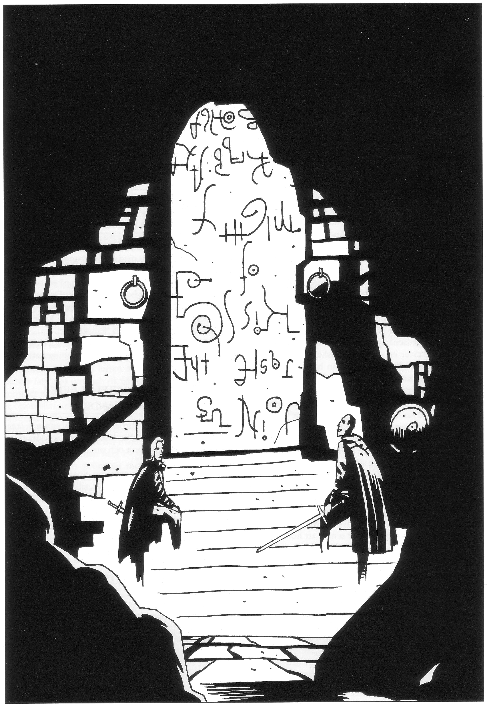
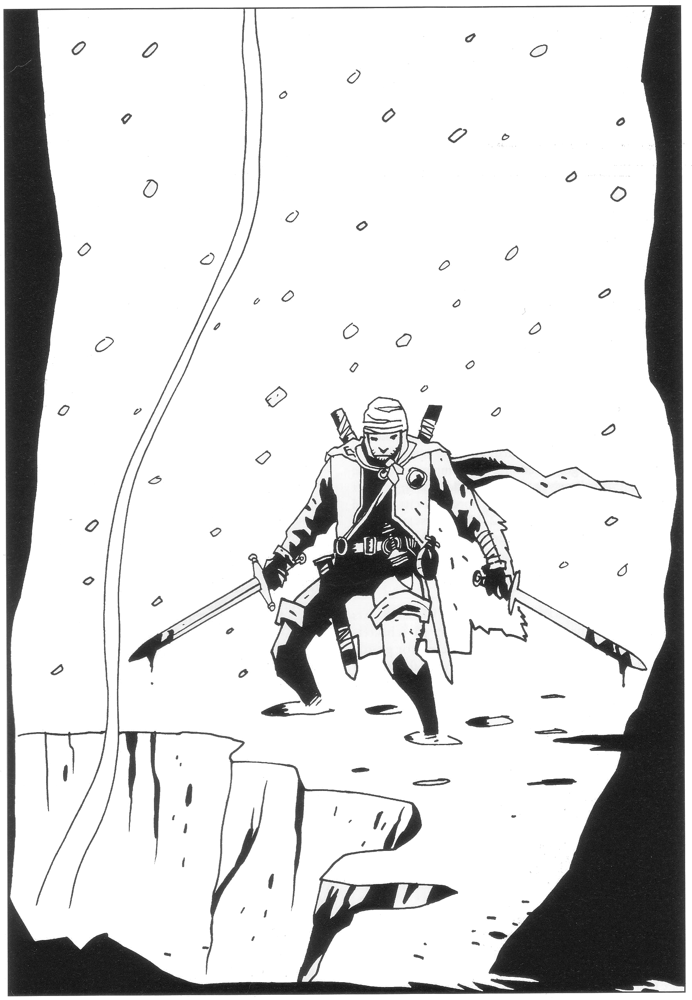
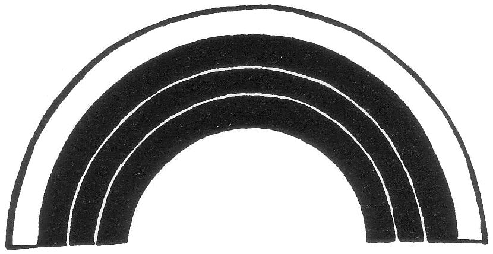
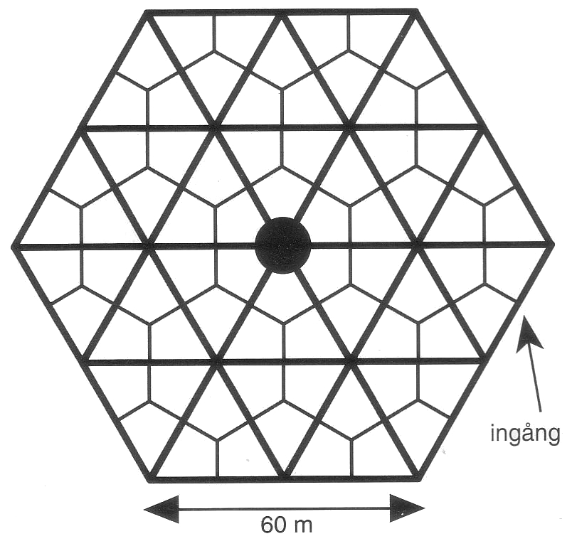
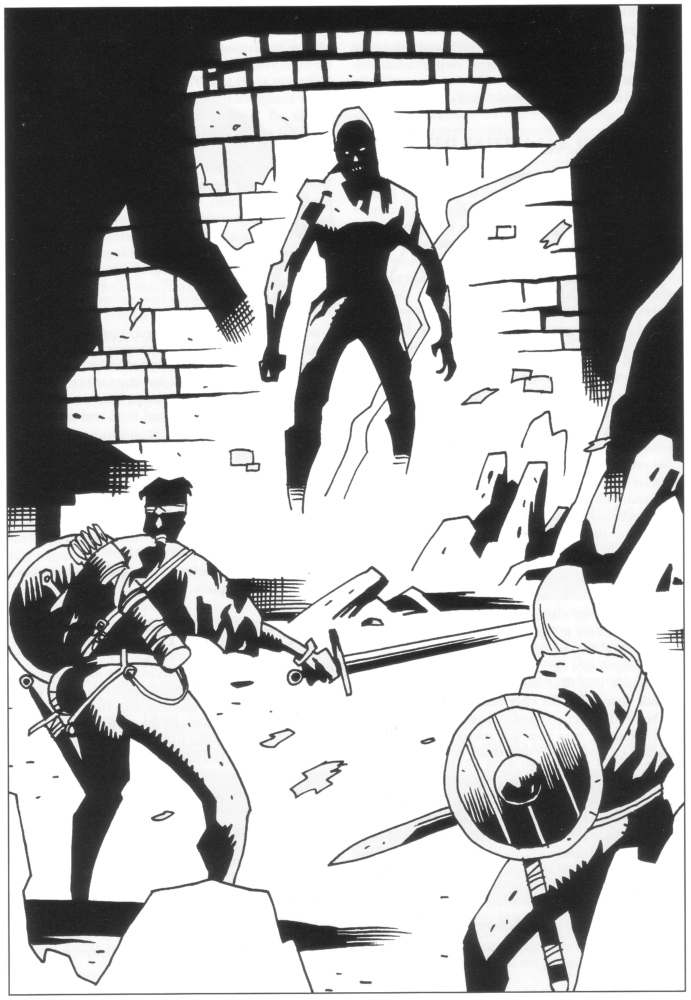
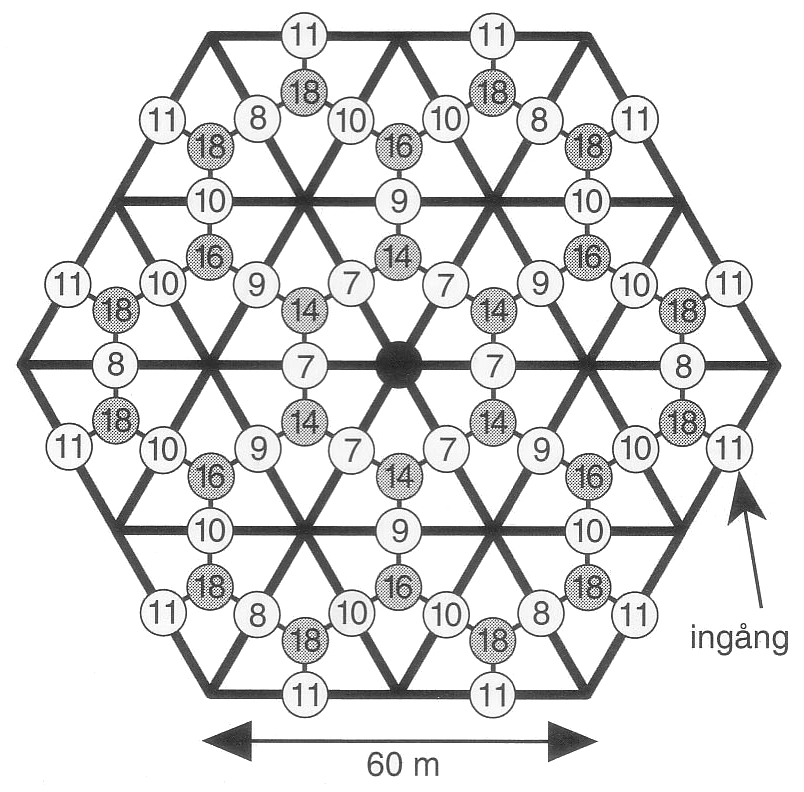

<title>Jorddragaren - Den femte konfluxen</title>

# 07. Jorddragaren

I detta äventyr sätter rollpersonerna igång den definitiva nedräkningen mot den femte konfluxen.

Sällskapet kontaktas av den vandöda häxan Rirba av Cruri. Hon avskyr Shagul och vill stoppa trollkarlen som förslavat hennes en gång stolta folk. Häxan erbjuder äventyrarna en allians. Via Rirba får äventyrarna veta att multimandalan som de medfört från Isakra måste föras ner i underjorden för att befria jorddragaren Jagernatha så att han kan sammanföra de två konfluxpunkterna. Som betalning för informationen ska sällskapet hjälpa Rirba att föra hennes olyckliga, odöda folk till den eviga vilan.

Sedan äventyrarna hittat den klyfta som leder ner till jorddragarens inre öga måste de passera ett antal fällor och hinder för att överlämna mandalan. När jorddragaren befrias rämnar klipporna i djupet, lava strömmar fram och sällskapet måste fly till ytan innan lavan hinner ikapp dem. Den befriade jorddragaren börjar dra hela Marjura söderut vilket möblerar om geografin ordentligt. Därmed har nedräkningen mot den femte konfluxen börjat.

SL bör sätta sig in i avsnittet om Cruri innan han spelar äventyret. Konfluxen inträffar senast *50 dygn sedan multimandalan kommit till Clusta Noba*. Det innebär att äventyrarna måste befria jorddragaren *inom 20 dygn efter sin ankomst* för att inte konfluxen ska bli kluven.

## Noriman Bävergälls meddelande

Noriman Bävergäll är pälsjägare och småhandlare i Clusta Noba. Rirbas odöda krigare tog Norimans bror Moldre som gisslan när bröderna besökte den nerbrända fädernesgården på Marjuri kust norr om Clusta Noba. Noriman har via Rirba fått äventyrarnas signalement (under förutsättning att Shagul dels vet hur de ser ut och dels berättat det för Rirba). För att få tillbaka sin bror måste jägaren lämna ett meddelande när gruppen anländer och övertala dem att träffa Rirba i hemlighet.

Noriman bevakar alla nykomlingar, och vandrar dessutom dagligen över öns otillgängliga delar i sin iver att slutföra uppdraget och få tillbaka brodern. Noriman har 20% chans per dag att upptäcka sällskapets läger i vildmarken. Hans order är att diskret framföra följande budskap:

> *Noldon man nalye
> Noldon man onalye
> Noldon mat khilalye
> Quenuvalmet?*

Noriman har lärt sig budskapet utantill. Han vet varken att orden är alviska eller att de fritt översatt betyder:

> *Jag vet vilka ni är
> Jag vet vad ni bringar
> Jag vet vad ni tarvar
> Ska vi tala?*

Hans vidare instruktioner är att i hemlighet föra äventyrarna till platsen där brodern togs tillfånga. Noriman har en liten eka i byn som man kan använda för färden. Rirba kommer att låta bevaka platsen och teleportera sig dit inom 1T4 timmar sedan äventyrarna dykt upp. Om rollpersonerna är rädda för ett bakhåll, kan Noriman upplysa om att gården har en gammal träpir dit de odöda inte kan gå. Därifrån kan man samtala utan risk för att gripas.

Sedan han lämnat sitt budskap faller jägaren i gråt, antingen av bitterhet över äventyrarnas misstro eller därför att spänningen äntligen släppt.

### Är detta en fälla?

Äventyrarna frågar sig naturligtvis om detta är en fälla. De kan inte få svaret från Noriman. Han vet inget mer, men han tror åtminstone på sin egen berättelse. Väljer de att inte åka till ödegården, går de miste om jorddragaren. Konfluxen förblir då kluven och spelvärlden går ett otrevligt millennium till mötes. Rirba fortsätter emellertid att bevaka platsen ifall de skulle ändra sig.

Melealina är osäker om hon tillfrågas, men tror att alla öppningar måste prövas eftersom tiden är knapp. Hon tycker att någon bör bege sig till platsen, kanske någon som Shagul inte känner igen, för säkerhets skull.

## Mötet med Rirba

När sällskapet kommer till den nerbrända gården ligger platsen till synes öde, men snart rör sig föremål man först trott vara snödrivor eller torvhögar. Tre odöda (inte *vandöda*) reser sig och blir stående stirrande på människorna. De reagerar inte på tilltal. Anfaller man dem försvarar de sig inte.

Efter 1T4 timmar kommer Rirba ensam till platsen. Hon anländer osynlig och står plötsligt vid pirens ände utan att äventyrarna uppfattat någon rörelse. Med en blick sänder hon iväg sina spanare som lämnar platsen utan att se tillbaka.

Rirba frågar nu efter sällskapets ledare på alviska. Om ingen kan alviska förbannar hon deras bondskhet på Ithilgroms tunga. *(”Ack Numulel, vad har jag gjort för att drabbas av dessa de sämsta av tiders förkvurade gröthjärnor.")* Sedan försöker hon samtala på modern jori som hon hjälpligt lärt sig från fångar. Trollpackan accepterar att en eller flera personer träder fram, men säger att det hon har att berätta bör höras av så få som möjligt. Dessutom vill hon helst gå avsides bort från dagsljuset. Om någon i sällskapet lärt sig Ithilgroms tunga via vävarnas språkkurs, blir hon märkbart imponerad men kommer i fortsättningen att vara misstänksam mot personen ifråga eftersom han kanske vet och förstår för mycket.

## Rirbas berättelse före edssvärandet

Rirba berättar vem hon är och om sin stora besvikelse över det liv hennes fädernesland vaknat till. Hon ensam ser det tragiska i Crurernas skuggtillvaro, ett öde som hon dessvärre bär ansvaret för eftersom hon ligger bakom *Landakennings lagoband*, den besvärjelse som håller Crurerna vid liv. Hela hennes folk längtar efter den eviga vilan, men lever vidare av stolthet, av Jordblodkällans kraft och av den brist på initiativ deras skenliv medför. Rirba ensam har kraften att agera och hon tänker sända Cruri till dess slutliga död. I detta ber hon om rollpersonernas hjälp. Hon vill sluta ett avtal som gagnar både hennes och deras intressen.

Emellertid måste såväl avtalet som Rirbas avsikter hållas hemliga för kung Ottar och allra helst för den sjufalt fördömde häxmästaren Shagul och hans anhang. Trollkarlen har med ormens lömska fräckhet trängt sig in i Crurernas öde. Han tänker använda detta stolta folk med dess mångtusenåriga historia för sina egna syften. Detta tilltag kräver en gruvlig blodshämnd som Rirba gärna medverkar till. Emellertid kan hon på inget sätt öppet angripa denne lus som hon i sin krafts dagar kunde ha krossat med sitt minsta fingers nagel. Kommer han komplotten på spåren kan han kommendera henne att avslöja allt med sin makt över de odöda. Hon vill därför inte veta mer än hon måste om äventyrarna.

Rirba berättar att hon känner till äventyrarnas tidigare kamp mot Shagul. Trollkarlen har lämnat ut deras signalement för den händelse de skulle dyka upp på ön. Hon vet att de varit i Bythos och hämtat regnbågspennan (hon nämner inte Store Stenfar som hon heller inte känner till; det står äventyrarna fritt att upplysa henne). Hon känner till multimandalan, liksom den femte konfluxen och vad Shagul tänker använda den till.

Rirba berättar varken nu eller senare att hon är en av blodsbröderna.

### Rirbas förslag

Rirba föreslår en affärsuppgörelse. Multimandalan som de hämtat i Esach-Rha (numer Isakra) kommer ursprungligen från Marjura där den spelade en avgörande roll för Crurernas förbannelse i samband med den tredje konfluxen för tolvhundra år sedan. Rirba kan berätta vad väven egentligen är och vad äventyrarna ska använda den till, information som bara hon känner till och som är nödvändig för att sällskapet ska kunna ena den femte konfluxen. Hon kan också berätta vilka planer Shagul har för konfluxen, liksom något om trollkarlens makt. Framgent kan hon tjäna som sällskapets spion om än med största försiktighet.

I gengäld vill hon ha hjälp med att lokalisera och hämta vissa föremål från den uråldriga staden Krau-Ki som börjar träda fram under den smältande isen. Hon vill också ha hjälp med att släcka jordblodkällan från vilken Crurerna hämtar sin makt. Sist men inte minst vill hon ha ett heligt löfte av sällskapet att uppfylla en begäran som hon senare kommer att ställa. Hon tänker inte avslöja någonting om sin begäran innan dess men kräver som pant att tre ur sällskapet deltar i en ritual som för all evighet kommer att förvandla dem till odöda om de sviker sitt löfte.

## Äventyrarna svär en ed

Om äventyrarna går med på avtalet ber Rirba dem återkomma vid midnatt med en svart tupp, en alruna och annat ockult krafs som SL tycker verkar lämpligt.

Själva edssvärandet får SL själv spela på ett olycksbådande sätt. Effekten är helt psykologisk. De gudar och demoner som åkallas har sedan länge tappat intresset för spelvärlden och besvärjelserna saknar därför all kraft. Rirba kanske är medveten om detta, kanske inte.

Vägrar äventyrarna svära någon ed, går Rirba ändå in på avtalet, men tillägger bittert att de kommer att få äta upp sin oginhet senare.

### Rirbas berättelse efter edssvärandet

Efter ritualen berättar Rirba om *Landakennings lagoband*, om staden Krau-Kis historia, om jorddragaren Jagernatha under Marjura och om multimandalans roll (se avsnittet ”Crurerna”).

Hon berättar det hon vet om Shagul: hur många kloner trollkarlen för närvarande är, vilken makt hon tror att de har, om eventuella allianser med ransarder och barbarer, om den farsot Ebharing kommer att bli om han släpps in i spelvärlden, m.m.

## Häxmästaren Etorgos ande frambesvärjes

Äventyrarna måste alltså ta sig till jorddragarens inre öga. Rirba levde inte själv när Crurerna band varelsen och har därför själv aldrig varit vid ögat. Hennes morfar, den Cruriske häxmästaren Etorgo, deltog däremot aktivt. Rirba är trots vissa risker beredd att kalla fram den döde Etorgo i hans krypta och fråga hur man tar sig till jorddragaren. Hon har ännu inte samtalat med Etorgo eftersom Shagul har stora möjligheter att upptäcka allt udda tasslande nära Crurernas del av dödsriket. En ande från det uråldriga Cruri kommer knappast att passera ut obemärkt. Med stor sannolikhet kommer Shagul att undersöka saken närmare och själv söka framkalla Etorgos ande för att höra vem som frågat honom om vad. Därför måste de agera skyndsamt när kallelsen väl slutförts.



### Kallelsen

I viken tre mil norr om Clusta Noba finns ett oansenligt gravfält. Genom en klippskreva kommer man via en mycket åldrig trappa till en stendörr med främmande inskriptioner. Rirba upplyser om att detta är häxmästaren Etorgos krypta. Den vaktas av gammal opålitlig magi, men som Etorgos ättling kan Rirba träda in. Äventyrarna kan följa med och lyssna, men får inte yppa ett enda ord. Säger de något kommer de osynliga väktarna att märka deras närvaro och en förbannelse att aktiveras.

> *FÖR SPELLEDAREN: Dörrens inskriptioner är på Ithilgroms tunga och lyder: "Här kan du ligga, du arvingars gissel. Snål var du och snålt ska du få. Må nakna stenen skava dina benknotor intill tidens ände. Ditt gravbalsam sätter vi till vällukt bak våra öron."*

Kryptans gamla besvärjelser har för länge sedan lösts upp, vilken enkelt verifieras med en magisk kontroll. Ändå är mänskligt tal så främmande i Etorgos krypta att det i sig utlöser störningar i de uråldriga och dammiga strukturer som omger Cruris del av dödsriket. Rent speltekniskt medför detta att Shagul hör allt som sägs i kryptan av levande människor. Om någon levande talar, vet Shagul vem som har sagt vad och till vem. På plats märks ingenting även om Rirba nu sliter sitt hår och med viss rätt menar att ohjälplig skada är skedd.

> *Speltipz: En ambitiös SL kan utnyttja två bandspelare. Han ställer i ordning ett rum i sin källare som krypta. Någonstans gömmer han en bandspelare som ställts på inspelning innan spelarna högtidligt träder in. När Etorgo frammanas spelas andens raspiga meddelande upp från en annan bandspelare. Om nu spelarna inte kan hålla klaffen under ritualen får Shagulspelaren helt enkelt lyssna på den dolda inspelningen och tolka den som han vill. Han vet vem Etorgo är och kan själv kalla fram anden för att ta reda på vilken frände denne talat med.*

Rirba börjar kalla på Etorgo, monotont men envist. Inledningsvis märker äventyrarna ingenting, men efter hand börjar släpande andetag höras, hesa men regelbundna som från en oändligt trött, lungsjuk gamling som somnat av utmattning efter dygn av plågsam vaka. Andetagen blir alltmer högljudda och tappar sin jämna rytm. De slutar med en gnällande inandning, varpå det blir helt tyst. En dödens kyla tar plats i kryptan och far sällskapet att rysa. Rirba fortsätter oförtrutet att kalla på Etorgo. En svag, klanglös röst hörs:

> *Nej...*

Rirba tycks inte känna de andras impuls att genast lämna röstens ägare ifred utan fortsätter att kalla. Då hörs som det sista ropet från en döende:

> *Skräcken... skräcken ... Nej, frände!...*

Rirba blir mer enträgen och kräver att Etorgos ande ska svara henne. Med långa mellanrum kommer följande:

> *Grymma säd
> ofödd kallar du...
> du vill att jag täljer
> vad äldst jag ser*
> 
> *Jag minns en klockas klyfta...
> ett nedstigande i oändliga djup...
> en klang av malm...
> en tungans sälta...
> en högväg...
> ej en hålväg...
> en eldkittels kraft*
> 
> *Jag minns en sägd om huvud,
> ack minns det väl,
> om ofagert men dock...*
> 
> *Den örte höre havets sång...
> den mynte smake dess blod
> den hänte röne himlens form...
> den ögte skåde dess ljus...*
> 
> *vet du det nu eller ej?*
> 
> *tvungen har jag talat
> nu vill jag tiga*

Etorgos ord, som motsvarar inskriptionen från Etemenankitemplets källare, ger ledtrådar till hur man ska ta sig förbi de hinder och fällor Crurerna lagt på vägen till jorddragaren för att hålla obehöriga borta. Ledtrådarna är ganska långsökta, något som varken är Etorgos eller spelledarens problem.

### Rirbas puderdosa

Efter ritualen uppmanar Rirba äventyrarna att skyndsamt befria jorddragaren och ger dem en puderdosa gjord av en rosa havssnäcka som graverats med ett grishuvud. Hon gjorde två sådana speglar under sin lärlingstid för att kunna meddela sig med sin älskade innan hon växte ifrån sådana dumheter. Man ser och hör den som talar genom den andra spegeln när båda öppnas samtidigt, men bara under svinets timme (03.00-04.00) varje natt.

Sedan jorddragaren befriats kan de via speglarna diskutera hur äventyrarna ska uppfylla sin del av avtalet. Förlorar de spegeln kan de ändå söka henne vid Noriman Bävergälls nerbrända fädernesgård som hon kommer att låta bevaka. Rirba vet inte vad som kommer att hända när jorddragaren befrias och ser ingen anledning till att spekulera i framtiden tills förutsättningarna blivit tydligare. Själv vågar hon inget mer göra på flera dagar av rädsla att dra Shaguls uppmärksamhet till sig.

## Hur hitta klyftan ner till Jorddragaren?

Nu vet äventyrarna vad de behöver veta.

* Rirba har berättat vad de ska göra med multimandalan
* Geomagerns karta låter dem räkna ut var jorddragaren finns
* Genom att tolka Etorgos ledtrådar efter vägen kan de ta sig in till jorddragaren.

Det är dags att ge sig upp på isen. Med hjälp av Geomagerns karta kan de hjälpligt pricka in den klyfta i Itlasbergen runt vilken Marjura roterar. Söker de i området har de första dagen 1/6 chans att hitta klyftan, nästa dag 2/6 chans etc. Hjälper Gulser dem att mäta på kartorna får de +1 på tärningen varje dag. En person med FV Orientering ≥7 far dessutom slå 1T20 per dag och hittar klyftan om han slår under sitt FV. Det finns 30% chans per dag att de träffar jätten Storthule från *Svavelvinter* i bergen. Han har dröjt sig kvar för att se vad som egentligen är i görningen. Lyckas de övertyga jätten om sina goda avsikter, kan han direkt visa dem klyftan de söker och även hjälpa dem i fortsättningen.

#### Shivran vaknar

Under färden till jorddragaren vaknar antagligen den vandöde Shivran. En eller två av vävarna blir nattetid brutalt och oförklarligt mördade mitt i lägret. Det är dock bra om någon vävare överlever så att han kan hjälpa sällskapet vid jorddragaren. Enklast är att novisen Trydulne aldrig återfann sin försvunna underkäke och därför överlever.

## Karta över Jorddragarens klyfta

### 1. Hålets kant

Sällskapet hittar klyftan de söker i ett otillgängligt område nära iskanten. I klyftans botten, tjugo meter längre ner, fortsätter ett nästan runt hål, tio meter i diameter, som leder rakt ner i berget så långt man kan se. Mängder av runda stenar, stora som fotbollar, gör klättringen ner till hålets kant besvärlig. Rullar man ut en sten i schaktet studsar den mot väggarna och ett dovt plask hörs efter ungefär fem sekunder. Nära hålet känns svag värme från stigande vattenånga.

Nere i klyftan vid hålets kant står några bronsformationer: en två meter hög, ärgad mässingsklocka med en platta under hänger från en mässingsbalk i en grov kätting som löper runt ett hjul och försvinner ner i hålet. Bredvid står ett stenaltare på vilket ett tjurhuvud av mässing monterats. Huvudet är i naturlig storlek, men hornen är nästan meterlånga och kröker sig mot skyn som skänklarna på en eldgaffel.

#### Detaljer:

Slår man på tjurhornen hörs en dov men distinkt klang som länge ekar genom klyftan. En musiker identifierar, om han klarar ett INT-slag, tjurhuvudet som en stor stämgaffel stämd i låga f#. Den som varit i HOXOH kan ha sett likadana skulpturerade stämgafflar tidigare. De finns uppställda runt Örnhyllan, det torg där det eviga musikstycket ”Det gambla hafvet” uppförs. Stämgafflarnas uppgift är att ge musiken resonans. Sedan gammalt kallas gafflarna ”havets sång”.

Stenarna vid schaktet är påfallande likstora och väger ca 15 kg styck. Klockans bottenplatta har urgröpningar där stenarna passar som ägg i äggkopp.

Klockan är en kombinerad hiss och dykarklocka. Den hålls uppe av en stor vikt i kedjans andra ände. Innan klockan kan användas måste hjulaxeln smörjas, till exempel med lampolja. Klockan väger cirka sjuhundra kilo. Om den lastas med personer och stenar till >300 kilos vikt, börjar den sjunka ner i schaktet. För att klockan ska åka upp igen måste lasten minskas till 250 kg, till exempel genom att några stenar rullas av. Klockan är oval i genomskärning och har en kraftig mässingskrok på ena sidan.

SL kan på en direkt fråga upplysa spelarna om att högst fyra normalstora människor får plats i klockan om de tränger ihop sig. Med fyra passagerare börjar klockan sjunka utan extra ballast i form av stenar. Detta går naturligtvis bra ända tills man kommer till det kokande vattnet och inte kan bromsa eftersom man inga stenar har att lämpa av. Ytterligare problem uppstår när man vill åka upp igen eftersom någon då måste vänta på schaktets botten och klockan därefter skickas ner igen med stenar etc. Inga problem om det inte var för att schaktet vid den tiden fylls med lava. I ett sådant läge kan man tvingas dra lott om vem som ska offra sig för de andra.

Överlevande vävare som är med vid klyftan insisterar på att följa med expeditionen ner i schaktet.

Man måste naturligtvis inte använda klockan. Viga personer kan klättra ner med rep eller direkt på kedjan.

### 2. Schaktet

Klockan sjunker lodrätt cirka femtio meter varefter schaktet böjer av 10°. Vid denna plats hakar mässingskroken i en skena som styr klockan åt sidan. Efter ytterligare tjugo meter blir schaktet åter lodrätt, nu helt utan dagsljus. Samtidigt blir värmen tryckande (ca 40° C). Svavelstickande vattenånga gör luften dimmig och svår att andas samtidigt som den värmer mässingsfarkosten. Bubblande ljud kan uppfattas nerifrån. Trettio meter längre ner är schaktet fyllt med kokande vatten från en varm källa.



#### Detaljer:

Klockan kan sänkas ner i det kokande vattnet som då strömmar över fotplattan upp till lårhöjd. En person kan tillfälligt undvika vattnet även om klockan sänks ner genom att hänga i handtagen och dra upp benen. Handtagen värms emellertid liksom resten av klockan till 90°C på 2 minuter. Bara den som är immun mot stark hetta, till exempel genom magi, kan överleva mer än någon halv minut. Ca tio meter under vattenytan stannar klockan mot schaktets botten.

#### Hur skaffas vattnet undan?

Det kokande vattnet kan för evigt kommenderas ner i underjorden genom forma vatten ≥E5 eller annan motsvarande magi.

Om de överlevande vävarmunkarna tillfrågas om problemet, så har de den enklaste lösningen. De har länge misstänkt att en liten blå tråd i Multimandalan är en förorening. Nu pillar de ytterst försiktigt bort tråden, och se — vattnet sjunker undan på några minuter.

Den som av någon anledning är immun mot kokande vatten kan naturligtvis ta sig in till jorddragaren utan att tömma bort vattnet. Exempelvis borde en rätt använd FROST (E2), en VIRVELSKÖLD (E2) eller MOTSTÅNDSKRAFT (E6) räcka. ELDFRÄNDE fungerar inte. Man behöver dessutom kunna simma (minst FV B3) också.

### 3. Grottan

När schaktet tömts på kokande vatten och klockan sänkts ytterligare tio meter, stannar farkosten på schaktets botten i en naturlig, cirka fem x fem meter stor grotta. Det är hett och svavelstinkande, men annars finner man inget särskilt i klipprummet, mer än smala sprickor där vattnet försvunnit.

#### Detaljer:

I grottans sydvästra del finns en lönnpassage bortom en falsk vägg av uppmurad sten. Muren har under århundraden byggts på med mineraler så att den knappast längre kan skiljas från den naturliga väggen. En vanlig människa måste slå ett PERFEKT färdighetsslag på Finna dolda ting för att över huvud taget se något konstigt. Varje person får bara göra *ett* sådant slag (görs efter 1T10 timmars letande). En dvärg hittar något mystiskt om han klarar ett vanligt färdighetsslag i Geologi eller liknande färdighet.

Det bästa sättet att hitta lönnpassagen är annars att lyssna efter resonans från stämgaffeln bakom den falska väggen när någon slår på den stora stämgaffeln uppe vid hålets kant. En person hör en svag ton från klippväggen om han lyckas med ett färdighetsslag i Lyssna. Detta förutsatt att han vet vad han lyssnar efter, annars far han -10 på färdighetsslaget. En musiker tycker resonansen låter konstig, som om klangen dämpas av vatten.

Etorgo gav en ledtråd till de två stämgafflarna med sina ord

> *en klang av malm...
> ... Den örte höre havets sång...*

### 4. Muren till lönnpassagen

Lönnpassagen börjar bakom en mur som måste forceras med verktyg eller magi. Muren är ett par decimeter tjock men ganska bräcklig eftersom bruket har vittrat. Den tål 80 KP. Sedan muren brutits loss är hålet bara 70 x 60 cm stort.

> *Lyckat färdighetsslag i Upptäcka fara (-10 på FV) => Det sipprar fram lite vatten från muren.*

Ungefär tjugo kubikmeter hett vatten står kvar i trapphuset innanför muren även sedan grottan tömts. Så snart ett hål brutits upp i muren forsar vattnet ut i grottan. Om inte äventyrarna varit uttalat försiktiga slår SL 1T10. Resultatet anger hur många kubikmeter kokande vatten som störtar in i grottan under första stridsrundan sedan ett hål brutits i muren. En tia på tärningen innebär att muren rämnar omgående av vattentrycket medan en enda mursten faller in om man slår en etta. Vattenflödet ökar med en kubikmeter per SR i takt med att muren faller i bitar under så lång tid vattnet räcker. SL avgör efter omständigheter och försiktighet om personerna i grottan råkar ut för brännskador. Tjugo kubikmeter kan bara fylla den större grottan till ett par decimeters höjd och rinner snart undan, men spelarna får gärna tro att de kommer att kokas och drunkna.

### 5. Tjurarnas rum

I en alkov innanför muren står ett likadan tjurhuvud i mässing som vid klyftans öppning. Bortom alkoven leder smala trappor uppåt. Trapporna fortsätter ungefär trettio meter och slutar med en rutten dörr som leder in i ett kvadratiskt rum med tre meters sida. Rummet är tomt sånär som på en halvgenomskinlig dallrande massa vid ena väggen. Massan, som totalt skulle fylla ett par hinkar, tycks sitta fast vid väggen med några slemmiga tentakler. Från den bortre väggen stirrar fyra skulpturerade tjurhuvuden av sten mot besökarna.

#### Detaljer:

Av värmen och fukten märker man att rummet tills nyligen stått under hett vatten.

Den slemmiga massan är en manetliknande, mycket intelligent varelse från en främmande värld vars yta upptas av kokande oceaner. Varelsen teleporterades till rummet för ett par hundra år sedan under en strid mellan hemvärldens mäktiga magikerskolor. Sedan dess har den levt i det vattenfyllda rummet. Den är nu döende, men kan räddas om den åter läggs ner i kokande vatten inom en halvtimme (en rollperson inser detta om han lyckas med ett färdighetsslag i Läkekonst eller Zoologi). Räddas varelsen kommer den enligt sin egen hederskodex att offra sitt fysiska liv för att tacka och stärka sin räddare. Den övergår i eteriskt tillstånd, söker upp sin räddare och lägger sig som en osynlig sköld runt välgörarens psyke. Rent praktiskt medför detta att personen ifråga permanent tillförs två PSY-poäng, aldrig mer behöver slå på Skräcktabellen och har +8 på alla räddningskast om någon magiskt söker manipulera eller avläsa hans psyke. Den lycklige kommer att känna det som om en skydds-ande vakar över honom, men kan på inget sätt kommunicera med varelsen.

Tjurhuvudena är alla skulpturerade i naturlig storlek av granit. Tungorna som hänger ut från djurens öppna munnar är däremot av olika material. Den vänstra tjuren har en tunga av grön sten, nästa tjur en gulaktig tunga, medan de två tjurarna till höger saknar tungor. En röd stentunga ligger på golvet nära slemvarelsen.

> *Lyckat färdighetsslag i Finna dolda ting => Ett rött stenfragment inne i munnen på tjurhuvudet längst till höger visar var tungan hör hemma. Tjuren näst längst till höger har bara ett hål där tungan suttit.*

Man kan sticka in armen i munnarna på de tjurar som saknar tungor. Längst därinne känner man ett T-format metallvred. Även tungorna på de två övriga tjurarna kan lossas — de sitter med bajonettfattning — varvid motsvarande hål blottas (jodå, det finns vred även innanför dem).

Om vredet i rätt tjurgap vrids, öppnas ett lås så att hela väggen kan vridas och blotta en meterbred korridor snett uppåt i berget. De tre andra vreden håller uppe varsitt stenblock som väger cirka ett ton vardera. När ett sådant vred lossas faller stenblocket ner och krossar den arm som stuckits in i hålet. Armens ägare förlorar omedelbart medvetandet av smärta och blir hängande från tjurgapet eftersom stenen klämmer fast resterna av hans arm. Den försiktige använder därför lämpligen ett rep eller annat föremål för att vrida om ett vred.

De fyra stentungorna hade för åttahundra år sedan varsin kraftig smak som kändes om man slickade på dem. Med seklerna har smaken lakats ur så att den bara känns om man lyckas med ett färdighetsslag i Finna dolda ting. Den gröna tungan är av syrsten, ett mineral med kraftigt sur smak, den gula tungan av svavelgnejs med bitter smak och den röda av honungskvarts som ger svag sötma. Tungan som fattas var en saltsten som lösts upp av vattnet och därför saknas. En person med FV i Geologi eller annan bergskunskap får slå för varje mineral och känner med ett lyckat slag till just det mineralets egenskaper. Geologer använder ofta smaken för att identifiera spelvärldens märkliga mineraler.

Etorgos ande avslöjade rätt tunga med orden:

> *en tungans sälta...
> ... den mynte smake havets blod* (=salt)

### 6. Korridoren

Bortom tjurarnas rum fortsätter den meterbreda korridoren snett uppåt i ungefär femtio meter och börjar därefter stupa ganska brant neråt i ungefär trehundra meter. Det är hett och klippväggarna ljuder då och då av vulkaniska sättningar. Någonstans på vägen finns ett tjugo meter långt korridoravsnitt som är fyllt av ånga från en liten het källa som sprutar fram ur väggen. Det hotfulla väsandet från källan hörs när man närmar sig dimman. Passagen slutar i en stendörr med fyra infattade mässingsringar. Ringarna sitter som fyran på en tärning.

Väggen är en gedigen stenplatta som kan fällas in i rummet bortom genom att stöttan på insidan lyfts bort. När rummet innanför förseglades användes mässings-ringarna för att med rep lyfta in stenplattan i dörrhålet. I taket ovanför dörren finns en magiskt osynliggjord mindre mässingsring som man inte kan se, men väl känna om man för handen över klippan. (Om spelarna inte kan använda huvudets insida, får de använda utsidan och gå mot ringen så att den klirrar.) Drar man i denna ring faller lite puts ner från taket. Den osynliga ringen är fäst i änden på en smal kedja som lyfter stöttan på insidan. Drar man ytterligare bullrar det bortom väggen när stöttan faller åt sidan. Stenplattan i dörrhålet kan nu vältas in i rummet med sammanlagd styrka motsvarande STY 30.

Etorgo antydde den osynliga ringen i taket med orden

> *den hänte röne himlens form...*

### 7. Glashallen

Så snart stendörren faller in går fyra maskerade skelett i rummet innanför till anfall mot inkräktarna. Ett femte står kvar i sin alkov, medan ett sjätte har hamnat i kläm under stenplattan, där det viftar ilsket, men inte tar sig loss. Skeletten bär alla varsin läderhuva med hål för ögonen, men har inga vapen. Rummet är en fyra meter bred och tolv meter lång hall som slutar i en dubbel trädörr. Nära båda långväggarna står pelare efter fyra respektive åtta meter. En svag doft av parfym ligger i rummet och golvet är täckt av en sönderfallande matta.

#### Detaljer:

Längs långväggarna mellan pelarna står sammanlagt sex höga träbord med varsin liten trälåda på. I lådorna finner man cirkelrunda glasskivor av olika färg (röd, orange, gul, grön, blå, indigo), en färg i varje låda. Om skelettens läderhuvor undersöks sedan bärarna gjorts ner (observera att de kan vakna igen av Jordblodkällans kraft), finner man att ögonhålen är klädda med mässingsringar i vilka två färgade glasskivor kan skjutas in.

På den bortre dörren finns följande figur målad i svartvitt:



Skeletten sattes inte i rummet som väktare utan som praktiska hållare åt de sex läderhuvorna. Benen har vaknat av besvärjelsen som alla andra lik på Marjura och går till anfall på odödas vis.

Bilden på dörren är en regnbåge med de innersta färgerna svärtade. Innebörden är att alla regnbågens färger utom den yttersta, dvs rött, ska blockeras när man går in i nästa rum, eftersom ljuset skadar ögonen. Enklaste sättet att skydda sig är att dra på sig en av skelettens läderhuvud och skjuta in rödfärgade glas i ögonhålens ringar. Läderhuvorna är desamma som dvärgsmeder använder vid smide över ässjor med brinnande grönkol, vars gröngula glöd permanent förstör dvärgars mörkerseende. Sålunda kan en dvärg med FV B1 i Hantverk (smide) eller en smed av annan ras med FV B4 inse huvornas användningsområde. Vilken färg som skall användas i ögonhålorna måste de dock fatta med hjälp av regnbågen.

Etorgo antydde annars ljusets betydelse med sina ord:

> *den ögte skåde himlens ljus...*

### 8. Labyrinten

Bortom dubbeldörrarna öppnar sig breda gångar som badar i underbart vackert, blålila ljus men som saknar all annan utsmyckning. Ljuset kommer från kristaller i väggarna. (Äventyrarna har stött på likadana kristaller tidigare i Svavelvinters kvicksilvergruva.)

> *Lyckat färdighetsslag i Värdera (ädelstenar) => kristallerna är värdelösa. De slocknar om man pillar bort dem från väggen. Lyckat färdighetsslag i Geologi => Ljuset från självlysande alger fångade i kristallerna är skadliga för ögonen.*

Den som inte skyddar ögonen på rätt sätt blir efter 1T20 minuter i labyrinten blind under 1T4 dygn av ljuset från de blålysande kristallerna.

Labyrinten är strikt geometriskt uppbyggd enligt följande mönster:

Gångar markerade med kraftigare streck är tre meter breda och sex meter höga. Gångar markerade med smala streck är två meter breda och 3,5 meter höga. Golvet i de smalare gångarna ligger 2,5 meter högre än i de breda gångarna, taket är alltså på samma nivå överallt. Den svarta cirkeln i labyrintens mitt är kammaren med jorddragarens inre öga. Det finns ingen annan ingång i labyrinten än den varifrån man kommer.



### 9. Jorddragarens inre öga

I labyrintens mitt finns en cirkelrund kammare, sex meter i diameter. Sex gångar leder ut från rummet.

Mitt i rummet finns ett upphöjt cirkelrunt stenaltare som är ungefär två meter i diameter. Altarets välvda överdel är halvgenomskinligt som matt glas och lyser upp rummet med vitt ljus. Någon decimeter ovanför glaset svävar en perfekt, meterbred cirkel. Den är svart och tredimensionell som en slang. Det märkliga är att den tycks lysa svart, en illusion som beror på den kraft cirkeln utstrålar.

#### För Spelledaren:

Cirkeln är Crurernas magiska boja, vars hypnotiska kraft håller jorddragarens blick fången och får Marjura att rotera. Dess magi motsvarar E7. Motsvarande effektgrad krävs för att lösa upp den på magisk väg. Cirkeln utstrålar paralysera E3. Alla som drabbas blir stående, stirrande på den tills de törstar ihjäl om ingen hjälper dem. Vävarna är emellertid immuna mot effekten. Förtrollningen bryts om cirkeln upplöses. Cirkeln har vidare egenskapen att absorbera allt den kommer i kontakt med. All materia, inklusive delar av rollpersoner, som kommer i kontakt med cirkeln försvinner helt enkelt.

Om ett annat magiskt föremål vidrör cirkeln slår SL på motståndstabellen, effektgrad mot effektgrad. Vinner cirkeln förlorar det andra föremålet sin magi och löses upp. Vinner det andra föremålet exploderar cirkeln och skickar ut energistrålar åt alla håll med effektgrad motsvarande skillnaden i effektgrad mellan cirkeln och det andra föremålet.

Förs multimandalan i kontakt med cirkeln försvinner den senare utan oväsen.

## Jorddragaren befrias

Jorddragaren befrias genom att den magiska cirkeln löses upp och mandalan placeras i dess ställe mitt på altaret.

När mandalan läggs på altarvalvet blir ljuset kraftigare och tycks tränga upp genom väven underifrån så att färgerna spelar över ytan. Skuggor kryper som insekter över den ojämna ytan. Trådar ändrar färg, reser sig ur väven, slingrar som maskar om varandra. Efter ett par minuter har mandalan antagit formen av ett vävt landskap med hav, kontinenter och berg.

Under några ögonblick hinner äventyrarna studera kartan som är oändligt detaljerad — en skarpögd betraktare tycker sig till och med se små skepp röra sig över dess vatten. Plötsligt rycker hela rummet till ett par meter i sidled med ett öronbedövande dån samtidigt som ljuset från glasvalvet slocknar. Alla som inte klarar ett SMI-slag faller omkull. Den kraftiga jordstöten öppnar en spricka i golvet tvärs över altarets plats. Valvet med mandalan faller rakt ner i underjorden tillsammans med allt som befinner sig på det. Ljuset från korridorerna utanför ger fortfarande ledsyn i kammaren. Äventyrarna står yrvakna efter mandalans sällsamma förvandling. Kvar i rummets mitt finns en till synes bottenlös klyfta. Tittar man ner ser man ett svagt eldsken därnere.

> *Detta är tiden* noll *efter jorddragarens befrielse.*

Från och med nu måste SL börja räkna tiden mycket noga, dels för att se hur äventyrarna klarar sig ur den extrema fara de ovetande befinner sig i, dels för att nedräkningen mot den femte konfluxen nu har börjat. Ett vinande ljud ökar nerifrån hålet, kanske från det fallande altaret. Tre SR efter befrielsen börjar en stark och het vind med en stickande lukt av svavel blåsa upp ur hålet samtidigt som rött ljus tränger upp. Vinandet övergår i ett dovt muller som skakar hela berget.

> *Lyckat färdighetsslag i Geolog eller Överlevnad (allmän) => Mullret, lukten och vinden är klassiska tecken på ett kommande vulkanutbrott. Personen inser tre SR efter befrielsen att sällskapet nu befinner sig inne i en vulkan som inom några få SR kommer att få ett utbrott och med stor sannolikhet fylla hela grottsystemet med lava ända upp till Marjuras yta.*

#### För Spelledaren:

Rycket kommer av att jorddragaren lösts från den magiska cirkelns förtrollning, läst multimandalan och satt sig i rörelse för att korrigera världen enligt ritningen. Samma ryck har känts över hela Marjura och Clusta Noba — se Marjuri förflyttning. Redan när äventyrarna springer från labyrinten har havet börjat forsa ut ur bukten runt Clusta Noba. Nu är det *trettio dygn ±2T20 timmar* kvar till den femte konfluxen som infaller när jorddragaren sammanför de två konfluxpunkterna på Clusta Noba och i Trakoriska sjön. SL bör bestämma tiden exakt och föra in den i spelkalendern.

Ljuset från glasvalvet dechiffrerade multimandalan. Under de korta ögonblick äventyrarna hann betrakta den avkodade kartan, såg den som har Geografi B3 eller klarar ett färdighetsslag i Sjökunnighet att kartan föreställer Trakorien med en ny landmassa nordost om Palamux. Rollpersoner i allmänhet är annars inte alls lika bekanta med Trakoriens geografi som spelarna. De ser en ögrupp med fyra stora öar, men kan inte identifiera ett ombildat Trakorien.

### Hur reagerar vävarna?

Vävarna och deras föregångare har under tolvhundra år levt för multimandalan. De har inget större intresse av sina liv sedan mandalan försvunnit. Vävare som överlevt Shivrans attacker och följt med ner i underjorden kan göra något av följande:

* Hoppa upp på stenaltaret när mandalan börjar omformas för att rädda den eller studera förvandlingen på nära håll och följa med ner i djupet
* Med ett förtvivlat skrik hoppa efter mandalan ner i hålet
* Stanna kvar vid hålet när lavan kommer
* Fly till mässingsklockan och erbjuda sig stanna kvar om inte alla får plats.

## Upp ur vulkanen!

Vinden från hålet ökar till orkanstyrka med hundragradig luft. Sex SR efter befrielsen skjuter en pelare av lava upp ur hålet, sprids i kaskader mot rummets tak och strömmar som ett halvdussin mordlystna expresståg ut i de gångar som leder från rummet. Nu gäller det springa för livet och det åt rätt håll. Lavan kommer först att fylla labyrintens breda gångar, sedan de upphöjda gångarna och därefter förfölja de flyende äventyrarna bort mot schaktet med mässingsklockan.

Flykten bör spelas i realtid, dvs spelarna har lika lång tid på sig som äventyrarna nere i grottorna. De kan fundera medan de springer i korridorerna men får inte längre betänketid. Alla diskussioner framme vid klockan förbrukar motsvarande tid i spelet. Har de inte agerat i tid säger SL att lavan är ifatt dem och att var och en ska säga vad de gör inom fem sekunder utan att konferera. Den som inget säger är paralyserad av skräck och omkommer.



### Hittar äventyrarna ut ur labyrinten?

För att ta sig ut ur labyrinten innan de drunknar i lavan måste äventyrarna för det första ta sig upp i de upphöjda gångarna så snabbt som möjligt och för det andra hitta utgången innan det är för sent. Om äventyrarna inte helt säkert vet vilken gång från jorddragarens inre öga de ska välja, slår SL 1T10.

```
1-3     Gången närmast utgången
4-7     Endera av gångarna närmast ovanstående
8-10    Någon av de återstående gångarna
```

Räkna med att en normal människa kan springa 20 meter på en SR i gångarna och att lavan rör sig med en hastighet av 30 meter/SR. Det innebär att man under den första stridsrundan precis hinner ut ur mittrummet, fram till och upp i närmaste upphöjd gång. Siffrorna på nedanstående figur visar efter hur många SR från befrielsen som golvet i en specifik gång täcks med lava. Vita cirklar är breda gångar som fylls först, grå ringar är upphöjda gångar som fylls i andra vågen.



En person som kan flyga har något mer tid på sig eftersom lavan inte stiger till taket på ett par minuter. När sällskapet tagit sig upp i en upphöjd gång springer de lämpligen vidare. Varje upphöjd raksträcka är tio meter lång. Varje gång de flyende kommer till ett vägskäl får tätpersonen välja höger eller vänster utan betänketid eller kunskap om vad som väntar runt hörnet. De som springer efter kan välja annorlunda. En person ser hur de som är framför springer, men inte vice versa. Spelarna får inte konferera eftersom ljudet i labyrinten nu är så öronbedövande att alla andra ljud drunknar. Om äventyrarna kommer till en lavafylld bredare gång kan de hoppa över den eller vända. Vid varje hopp skall de slå ett färdighetsslag i Hoppa, fummel innebär att de trillar ner i lavan. Dylik olycklig krake kan med ett Normalt SMI-slag lyckas nå och klamra sig fast i kanten, så att hans kamrater kan rädda honom. Skinnet på hans fotsulor krullar sig av hettan, men det torde vara ett litet problem sett till omständigheterna (han har dock halverad för-flyttningsförmåga till fots de närmsta 2 veckorna).

### Hinner äventyrarna till klockan?

När äventyrarna väl hittat ut ur labyrinten måste de fortsätta så snabbt de kan. De har ett visst andrum medan lavan fyller upp labyrinten till taket och tar sig uppför den motsluttande korridoren. Lavan når gångsystemet enligt följande tidtabell:

```
Plats                       Tid efter befrielsen
Glashallen                  2,5 minuter
Korridorens högsta punkt    4 minuter
Tjurarnas rum               4,5 minuter
Grottan                     5 minuter
```

Från grottan stiger lavan i schaktet tjugofem meter per minut.

För normalsnabba personer utan packning tar det en minut att med högsta möjliga fart springa från labyrintens utgång till grottan med schaktet. Då har de kämpat så blodsmaken river dem i lungorna.

Observera att något eller några skelett kan ha vaknat i glashallen igen.

### Hinner äventyrarna upp ur schaktet?

När äventyrarna väl kommit fram till mässingsklockan återstår att ta sig upp. I absolut bästa fall har de mellan tre och en halv och fyra minuter på sig. Har de släppt upp klockan till schaktets mynning får de problem. Står klockan kvar måste lasten minskas till ≤250 kg för att den ska röra sig alls. Det tar då fyra minuter för den att komma upp till ytan. Med en vikt på högst 150 kg går färden på en minut.

Väger personerna nere i schaktet mer än 250 kg tillsammans måste någon eller några vänta med stor risk att dö (SL bör göra risken klar för spelarna). Finns någon vävare kvar erbjuder sig denne att stanna kvar. I annat fall måste man dra lott eller slåss om saken.

Genom att lyckas med färdighetsslag i Klättra kan man klättra fem meter per SR på kedjan (perfekt: 10 m; misslyckande: 0 meter, fummel: ner i lavan!), men kedjan rör sig och den klättrande påverkar naturligtvis viktförhållandena på endera sidan.

Det finns ett radikalt sätt för ett stort sällskap att ta sig upp mycket hastigt med stor risk för skador. Man kan binda fast sig själv med rep i själva kedjan och koppla loss den från klockan (en sprint måste knackas ur och den sista länken slås undan, vilket kan göras av en person på 20-SMI SR). Den ett ton tunga motvikten kommer då att fälla ner i schaktet medan rollpersonerna lika hastigt åker upp. SL får avgöra vilka skador de kan råka ut för (2T20-4 gånger rustningens abs?). Förutom att koppla loss klockan bör de köra ett stadigt svärd genom någon av kedjans sista länkar som stopp mot det hjul kättingen löper runt. Annars blir de själva stoppklossar vilket lär kosta dem en eller annan kroppsdel.

En variant är att skicka upp sällskapets mer ömtåliga deltagare med klockan, binda fast återstående krigare med plåtskal och koppla loss motvikten som kommit ner istället.

Den ambitiöse SL suger naturligtvis alla poänger han kan hitta ur denna pressade situation. Sällskapet kan till exempel vara så gott som uppe med klockan när motvikten möter den stigande lavan och slutar sjunka eller börjar flyta upp igen så att klockan i sin tur stannar eller vänder neråt. Man tvingas kanske klättra sista biten uppför den allt hetare kedjan. Hittar man ingen utväg är det i och för sig rimligt att klockan liksom motvikten följer med upp mot ytan när den når lavan, men metallen blir snart glödhet...

I denna extremt pressade situation krävs kontroller för om en magiker lyckas behålla koncentrationen om han använder en besvärjelse med varaktighet: Konc., exempelvis ett Lätt PSY-slag/SR.

Väl uppe ur klyftan bör sällskapet lämna vulkanens närhet så snart de kan och ta sig tillbaka till Clusta Noba för att träffa Rirba och Melealina. En paus i spelet kan vara på sin plats. Den medicinskt intresserade spelledaren kan i pausen roa sig med att mäta spelarnas puls.
