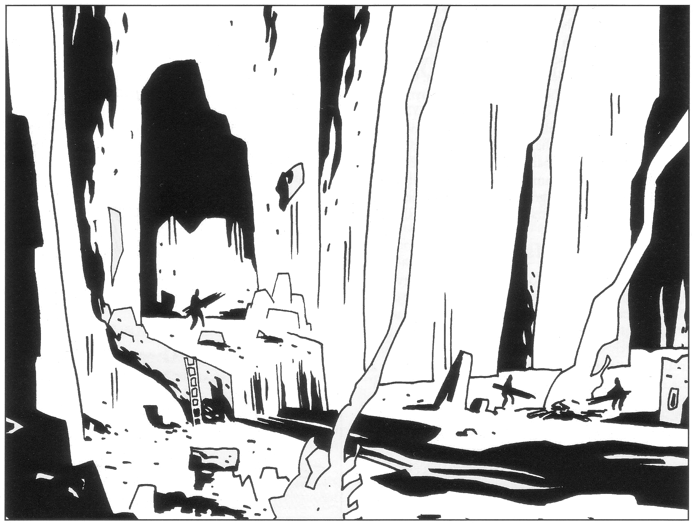
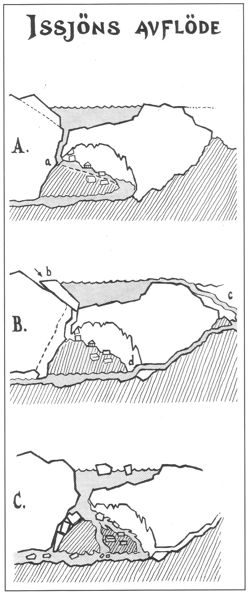
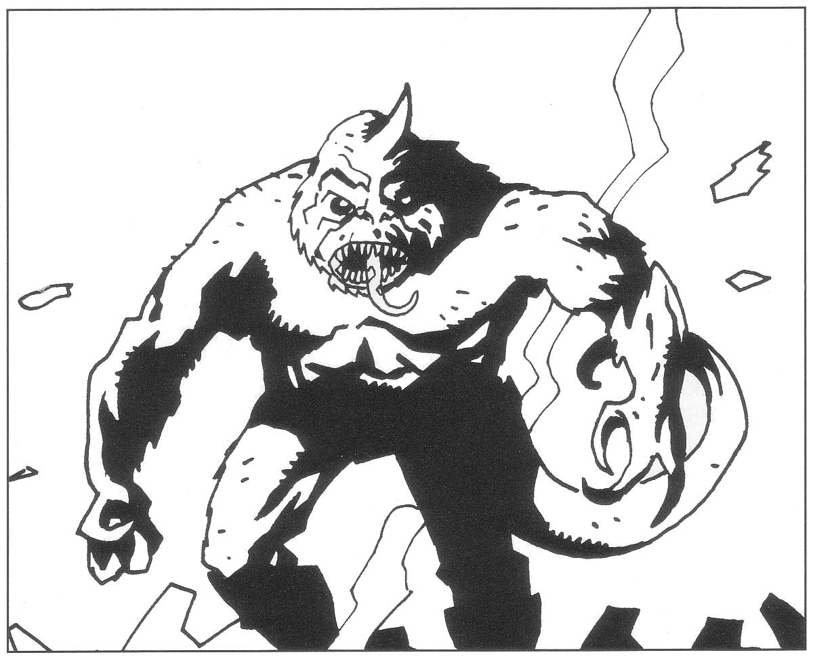
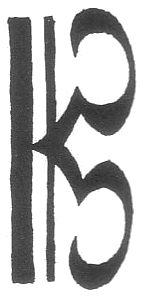
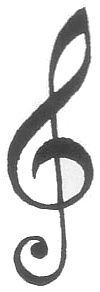
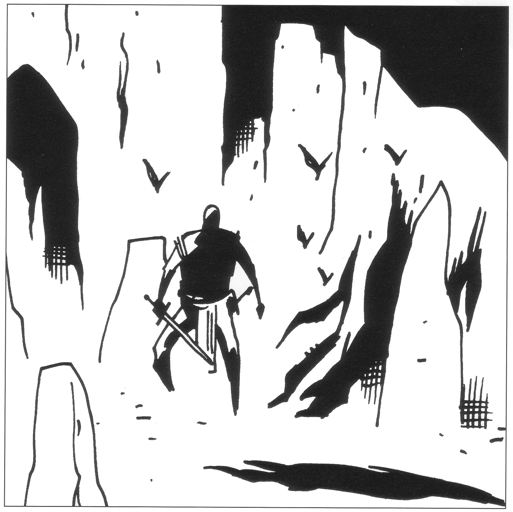
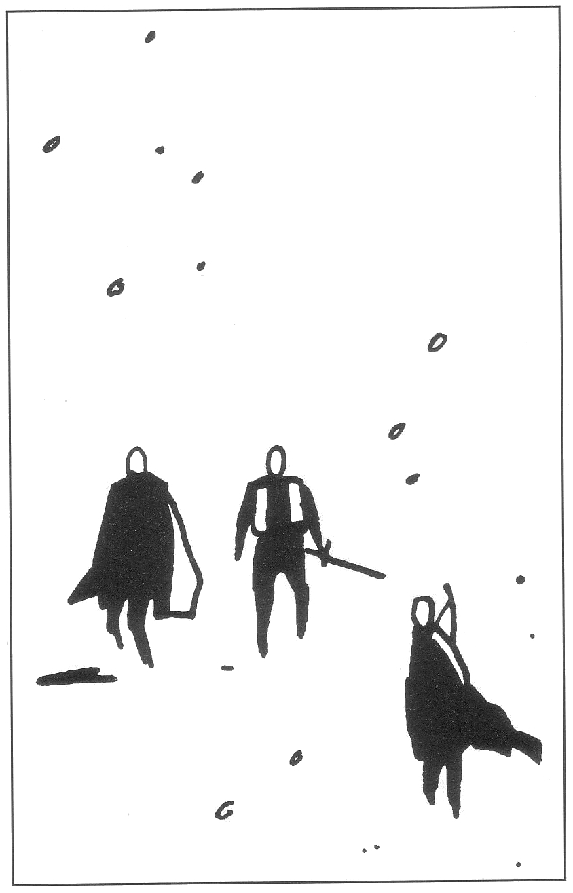

<title>Staden under isen - Den femte konfluxen</title>

# 08. Staden under isen

## Rirbas uppdrag

Sedan äventyrarna befriat jorddragaren kontaktar de antagligen Rirba via puderdosan eller träffar henne vid Bävergällarnas nerbrända gård.

Rirba påminner äventyrarna om att de nu är skyldiga henne en tjänst. Emellertid kommer de själva att vinna stora fördelar av det uppdrag hon ger dem, eftersom hon från den infrusna staden Krau-Ki bara vill ha vissa enklare föremål från sitt magitornium, medan sällskapet kan lägga beslag på allt annat de hittar.

Häxan berättar att staden Krau-Ki ligger på samma vita kalkstensklippa varifrån den en gång blickade ut över Valgussjöns svarta vatten på spelvärldens södra halvklot. Stadens nuvarande läge på Marjuri nordvästra udde är känt såväl av Shagul som av Rirba, men ingen har kunnat ta sig till staden eftersom den varit täckt av tjocka islager som först på senare tid har börjat smälta. Ottars folk har på Shaguls order börjat elda sig in genom glaciären längs en jökelälv som tros passera klippan eftersom den spolar med sig vit kalksand. Trollkarlen hoppas hitta plundergods av intresse i den infrusna staden, något han dessvärre också kommer att göra om inte äventyrarna hinner före. Högst uppe på kalkklippans topp ligger Rirbas *Magitornium*, en högrest byggnad nära stjärnorna. I magitorniet finns vissa magiska föremål som Rirba tvingades lämna vid flykten, saker som hon nu behöver.

Medan Crurerna ännu bebodde staden utstrålade kalkklippan behaglig värme som den lagrat från godare tider i södern. Om klippan fortfarande har värme kvar tror Rirba att den kan ha smält isen underifrån så att staden nu ligger fri i en luftficka med glaciären över sig.

#### Komplikationer

Det finns naturligtvis vissa komplikationer. För det första känner Rirba inte till någon annan väg in till Krau-Ki än den tunnel genom isen som Ottars folk snart smält färdigt. För det andra blev Crurerna bortkörda från sin stad av ett mäktigt odjur. Varelsen, som kallades Kmeard, dök först upp just i Rirbas magitornium, vilket är anledningen till att hon inte vågade hämta de magiska föremålen. Ingen vet varifrån odjuret kom, men Rirba misstänker att det sänktes ner av nattskyarnas illvilliga gudar. Kmeard var en köldvarelse på vilken varken Crurernas vapen eller magi hade någon verkan. Den kunde djupfrysa motståndare med en pust av sin andedräkt och slita bepansrade krigare i stycken med sina klor. Värst av allt var ändå att den kunde dyka upp var som helst utan förvarning.

Efter någon veckas fruktlös kamp flydde Crurerna och byggde staden Fari-Nhata i Cruri nära jordblodkällan, så långt ifrån Krau-Ki de kunde komma på Marjura. Ett par gånger under det första året i exil dök Kmeard upp där också, som för att påminna om sin existens, men sedan sågs han inte till mer. Rirba förhörde sig bland gamla döda kämpar om odjurets svagheter, men fick inga svar. Den urtida hjälten G’dy-brak nämnde ordet ”dragbasun”, antagligen för att hans förskrumpnade öron missuppfattade frågan eller gärna hade lyssnat till detta instrument i sin krafts dagar.

Rirba berättar att det vid tiden för Kmeards ankomst inte fanns någon glaciär på Marjura. Hon tror att kölden i själva verket utgick från varelsen eftersom isen började samlas på Krau-Kis sluttningar redan innan Crurerna hunnit lämna staden. Eftersom glaciären nu börjat smälta, har varelsen antagligen dött eller lämnat Marjura, vilket innebär att inget längre finns att frukta i Krau-Ki *(jag hör spelarnas berättigade hånskratt redan medan jag skriver detta — konstruktörens anmärkning.)*

De magiska föremål Rirba vill ha från sitt magitornium är:

* En livgivande bronsurna med åldriga inskriptioner
* En liten guldflöjt i form av en nyckel
* En elfenbensstav dekorerad med en blå orm vilken ”dämpar ytterligheter”

Föremålen, som hon inte kan beskriva mer exakt, behövs enligt Rirba för den ritual som ska dra jordblodets kraft från Ottars folk så att de slutligen lägger sig ned och dör. Släcker man jordblodkällan på fel sätt blir alla Crurer inklusive hon själv vanliga odöda. De kommer då att vandra runt olyckliga för att hemsöka Marjura under lång tid. Nu när Marjura börjat röra sig söderut, har dessutom en ny allvarlig risk uppstått som hon inte förutsåg tidigare: *Landakennings lagoband* kommer antagligen att utsträckas till andra öar som Marjura kommer i kontakt med längs vägen. Rirba vet inte vart jorddragaren tänker föra ön, men hamnar man i gamla kulturbygder kan hundratusentals odöda vakna ur sina gravar. I värsta fall kolliderar man med kontinenten. Med nuvarande hastighet tror Rirba att man har drygt tre veckor på sig till bebodda trakter.

Rirba har ett vagt minne av att hon skyddade magitorniet med några nyupptäckta besvärjelser just innan flykten. Hon kan inte för sitt liv komma ihåg vad besvärjelserna gick ut på eller var hon gömde de tre föremål hon söker. Hon minns dock att alla besvärjelser i magitorniet var bundna med en och samma runa. Naturligtvis har hon glömt vilken, men runan finns lagd som mosaik på en bottenplatta i bassängen i hennes vingård utanför tornet. I någon form kan runan upplösa var och en av de besvärjelser man stöter på i kontornet.

#### För Spelledaren:

Rirba är fullt medveten om att det inte finns något plundergods att tala om i Krau-Ki eftersom Crurerna hade några dagar på sig att evakuera staden, men det tycker hon är onödigt att berätta för äventyrarna.

Rutinerade spelare misstänker naturligtvis helt korrekt att *Kmeard* är samma ord som *Kmorda*, den nya tidens namn på Marjuras glaciär.

G’dy-braks något långsökta ledtråd ”dragbasun” antyder ett horn som ska dras för att besegra Kmeard. En äventyrare som är musiker kan få associationen att en basun är ett horninstrument.

### Isdruiden Perrimas roll

I *Svavelvinter* hjälpte äventyrarna kmordadruiden Perrima att hämta vissa reliker från det skövlade templet på berget Biletand. I det här äventyret träffar de Perrima igen i Clusta Noba där hon sorgligen förfallit till drogmissbruk och otuktigt leverne eftersom hennes sekt försvunnit. Söker sällskapet upp Perrima och frågar henne om Kmeard, tänds ett nytt hopp i prästinnan. Druidernas äldsta legender talar om Kmorda, dvs. Kmeard, som en behornad gudom vid isens rötter. Det sägs att han vakar över en förbjuden ondska men också över ett mäktigt vapen som ska nyttjas mot ondskan då den åter stiger fram. Perrima blir med ens nykter och kräver att få följa sällskapet till Krau-Ki på det att hennes liv åter ska få en mening eller åtminstone ett värdigt slut. Hon tror sig kunna vara till god nytta på glaciären.

Får sällskapet inte med sig Perrima kan en orimligt snäll SL låta äventyrarna få lära sig ett heligt ord som ger samma verkan på Kmeard som isdruidens närvaro.

#### För Spelledaren:

Som nämns nedan blir Kmeard närmast paralyserad vid åsynen av en Kmordadruid.

#### Legenden om Blåbite

När hon så småningom får syn på Kmeard minns Perrima mer av legenden. Enligt denna ska Kmorda i sin sista strid falla så att hans pannhorn pekar mot den mäktiga klinga han vakar över — ett svärd vid namn *Blåbite*, i styrka säkerligen jämförligt med *Ebharing*. Legenden förtäljer att glaciärens hela kraft ska ligga samlat i Blåbite just vid Kmordas död, men att kraften omedelbart ska börja rinna från svärdet så att det försvagas alltmer tills någon finner det och tar det i sin hand.

#### För Spelledaren:

När Kmeard faller pekar pannhornet naturligtvis mot klingan inne i odjuret som ju i själva verket är dess fortsättning. Se f.ö. Kmeard och Blåbite i persongalleriet.

### Ezers huvud

Om SL inte tycker det blir för lätt, kan Rirba ha gömt helgonet Ezers huvud i en källare på Clusta Noba. Huvudet har samma effekter som i Svavelvinter. Dess kraft förmår dock inte skicka bort demonen Ebharing ur hans svärd. Huvudet har heller ingen effekt mot de vandöda Crurerna eftersom dessa tekniskt sett inte är döda. Varken Perrima eller någon annan känner till dessa begränsningar. De kan visa sig som en besvärande komplikation i ett kritiskt läge.

### Dolken Demens

Om äventyrarna fortfarande har den senila dolken Demens bör han åtminstone kunna läsa Ithilgroms tunga för dem.

## Hur ta sig till staden?

Äventyrarna kan vänta på att Ottars folk får sin tunnel klar och försöka smyga eller storma in, ett företag som inte har stora utsikter att lyckas, särskilt som tunnelns inre är rökfyllt och saknar syre. Det finns också en annan väg till Krau-Ki. I en dal ovanför staden gömmer sig en Kvurerstam som känner till den andra vägen. Den ende som anar Kvurernas existens är Kyrias, emedan han vid vårdagjämningen för ett antal år sedan sökte sig till den mest avlägsna punkten på Marjura för att genomgå den decenniala härdningsritualen. Efter att ha suttit naken på glaciärens topp i tre dygn och fokuserat alla sinnen på sina tår kröp Kvurerna förundrade fram för att studera den nakna isklumpen och räddade hans liv. Då detta enligt Banzikan inte var hedersamt skall det mycket till innan Kyrian berättar att Kvurer håller till i glaciären vid Krau-Ki.

Bitar av jättevitmossa i jökelälven (se nedan) tyder också på att det finns en alternativ väg.

Sällskapet hittar dessutom sannolikt Kvureras gömda högdal om de tar sig upp på glaciären, men däremot knappast den lilla sjöns dolda avflöde såvida de inte får kontakt med Kvurerstammen som gömmer sig i sänkan.

### Kontakt med Kvurerna

Kvurerna söker till varje pris gömma sig för alla främlingar vilka de misstror utan urskiljning. Däremot ger de sig till känna om de lärt känna sällskapet som vänner i *Svavelvinter*.

Det primitiva isfolket är på utdöende och därför djupt bedrövat. Deras sista hopp är att söka hjälp i gudarnas stad under isen till vilken man sägs kunna nedstiga genom issjöns dolda avflöde. Två tappra krigare har den senaste veckan sökt sig dit ned men sedan inte hörts av. Den senare fick med sig ett urgammalt kastvapen mot de demoner som kunde tänkas vakta vägen — en av de två tvillingstjärnor som sades vara ofelbart dödande. (Den andra av dessa stjärnor kunde äventyrarna hitta i *Svavelvinter*.) Han var också knuten med ett rep runt midjan, ett rep som emellertid tycks ha bitits av nere i djupet.

> *Lyckat färdighetsslag i Hantverk (repslageri) eller Sjökunnighet => repet har knappast bitits av utan snarare nötts av mot en vass kant.*

Kvurerna visar gärna passagen ner i isen och hjälper den som vill dit ner. Frågar man dem beskriver de vidskepliga urmänniskorna de mest fantastiska detaljer, men egentligen vet de inte mer än äventyrarna vad som väntar.

### En variant utan Kvurerna

Om äventyrarna inte får kontakt med Kvurerna, kan den nedsänkte krigarens rep istället ha fastnat så att han blev kvar i vattenströmmen under isen och drunknade. Det spända repet sitter då kvar från en trädstam i dalen ner i vattnet. Ett nyfiket sällskap undrar naturligtvis varför. Drar man i repet går det av. Den som då simmar ner för att undersöka dras av strömmen ner under isen och hamnar i grottan utan möjlighet att ta sig tillbaka. Den som följer repet hittar den döde och avflödet.

## Karta över Krau-Kis omgivningar

### 1. Jökelmynningen

Kommer man från höjderna i söder öppnar sig en karg dal nära glaciärkanten. Redan här, på en och en halv kilometers håll, ser man smutsigt vatten och rök välla ut ur en jökelport i glaciärsidan. Vattnet samlas till en sjö i dalens botten innan det rinner vidare mot havet ett par kilometer åt öster. Utanför själva porten är ett femtiotal mänskliga varelser oupphörligt sysselsatta, dag som natt. En del kastar ris och stockar på två stora eldar invid några primitiva stenbyggnader. Andra bär bördor in i eller ut ur tunnelmynningen.

#### Detaljer

Sluttningen ner mot dalsänkan är beströdd med vulkanisk sten och grus. Den som försöker ta sig ner i dalen och inte lyckas med ett normalt SMI-kast sätter igång ett mindre jordskred som i 35% av fallen uppmärksammas av de vandöda vid eldarna. De skickar då en patrull att undersöka. Den som fumlar dras själv med i raset och måste klara ett FYS-kast för att inte ta 5 KP skada i ena benet så att han inte kan gå. Det är möjligt att ta en säkrare väg ner i dalen någon timmes vandring åt väster.

Sjöns vatten är mörkt av sot och slam. Om äventyrarna undersöker närmare finner de förutom kalksand i strandkanten små grenar av färskt vitträ trots att inget vitträ växer inom synhåll.

> *Lyckat färdighetsslag i Botanik* eller *Överlevnad (arktisk)* eller *Perrima är med => vitträ kan inte växa inne i glaciären. Alltså måste älven rinna genom en bevuxen dal högre upp innan den går in i isen. Man kanske kan ta sig in den vägen?*

Håller man lägret under uppsikt ett par timmar kan man uppskatta antalet vandöda till närmare tvåhundrafemtio stycken snarare än de femtio som man såg vid första anblicken. Crurerna tycks hetta upp stenar och metallklot i eldarna för att bära dessa i korgar in i istunneln. En del bär in brinnande stockar. Stenbyggnaderna tycks vara grovt murade fönsterlösa förråd. Terrängen är stenig i dalgången och bör vara lätt att smyga i. (Inte för att det hjälper — de vandöda känner instinktivt närvaron av levande människor oavsett terräng, men det vet kanske inte spelarna ännu.) Grupper av vandöda anländer och lämnar lägret åt sydväst var tredje timme, släpande på stockar och ris till eldarna.

#### För Spelledaren:

De vandöda bränner sig på Shaguls order in genom isen längs flodens västra strand. De bryter igenom till Krau-Kis isgrotta exakt *65 timmar efter att äventyrarna får syn på jökelmynningen*. Först eldade de inne i själva istunneln, men när de kom längre in slocknade eldarna av syrebrist. Nu bär de istället in brinnande stockar och upphettade föremål i asbastkorgar att smälta isen med. När de väl kommer in i Krau-Ki har de order att döda allt som rör sig därinne och därefter hålla vakt. De får inte röra några föremål utan ska invänta en Shagulklon för närmare undersökning.

### 2. Istunneln

Själva den halvkilometerlånga tunneln är ingen trevlig plats för levande varelser. Man stöter på 1T4 vandöda var femtionde meter och luften är tjock av rök. Den blir alltmer fattig på syre och rik på koloxid ju längre in man kommer på grund av de brinnande stockarna. Oskyddade ögon blir i stort sett blinda redan vid jökelmynningen. Koloxiden gör att man omärkligt tappar en FYS-poäng per SR när man kommit längre än hundra meter in i tunneln såvida man inte har magisk andningshjälp. Ökar man farten tappar man bara FYS-poäng fortare.

Vattnet i älven strömmar med en hastighet av fem meter i sekunden vilket gör det omöjligt att simma till staden under isen såvida man inte kan förvandla sig till en lax.

### 3. Issjön

Uppe på glaciären, ovanför Krau-Ki, har smältvattnet bildat en flera mil bred issjö. Den hade tidigare sitt utlopp rakt ner i grottan med staden, men ett stycke av glaciären föll ner och blockerade vägen så att vattnet nu tar omvägen genom Kvurernas dal. När Crurerna öppnar grottan från sin tunnel kommer en del av grottans tak att rasa och vattnet från issjön att forsa ner enligt skissen.

> ***Issjöns avflöde***. *För några år sedan gällde bild A: Issjön hade ett balanserat avflöde ner i grottan med staden Krau-Ki. (A) Floden rann ned i grottan (a; vid ”Gamla inloppet”, #16 på kartan över Krau-Ki), rundade klippan i isrännan (#2 på kartan över Krau-Ki) och flöt ut genom jökeln*
> 
> *Så inträffade ett ras (b) och situationen B uppstod. Avflödet ner i grottan hindrades, issjöns yta steg tills den började rinna ner i Kvurernas dal (c) och därifrån hittade tillbaka till sin gamla fåra (d; #1 på kartan över Krau-Ki). Crurerna smälter sig in längs jökelälven och underminerar samtidigt isen närmast klippan. I och med att de bryter in i  grottan uppstår snart situation C: en bit av grottans tak rasar och stora mängder vatten störtar in.*

### 4. Kvurernas dal

Tar man sig upp på glaciären ovanför Krau-Ki finner man Issjön och dess nya avflöde ner i en gömd dal som ligger en och en halv mil norrut. Dalen är i stort sett fylld med tät vitträskog. I dess södra del finns en liten sjö, snarast en damm, som fylls på via ett vattenfall från Issjön högt ovanför men som saknar synligt avflöde.

Marjuras återstående Kvurer, ungefär sextio stycken, håller sig gömda i dalens nordöstra gren, ledda av köpmannen Umma (beskrivs i *Svavelvinter*). Kommer man något hundratal meter från deras kamouflerade läger känner man stanken av Karsonfett.

### 5. Issjöns avflöde under isen

### 6. Isgrottans läge under isen

## Karta över staden under isen

Kartan visar staden innan vatten från Issjön börjat strömma in ovanifrån. Bara stadens översta delar är frilagda: nöjespalatset med dess park, gardeshallarna, avrättnings-och kampplatsen, skråmästarnas verkstäder och häxan Rirbas magitornium. De mer vardagliga delarna av staden Krau-Ki är fortfarande dolda längre ner i isen.

### 1. Floden

Vattnet lämnar sjön i Kvurernas dal nära östra stranden via en virvelström som bara kan anas på ytan (-10 på färdighetsslag i Finna dolda ting). Bortom virveln fortsätter vattnet tjugo meter genom en tunnel innan det störtar ut i en isklyfta som ett tre meter högt vattenfall. Från klyftans bassäng kan man följa floden vidare genom ett fyrahundra meter långt system av sprickor fram till iskanten där vattnet faller ut i den stora isgrotta som rymmer staden Krau-Ki. Vandringen längs floden tar ett par timmar och är ganska strapatsfylld — man får ibland vada, ibland hasa längs isforsar och ibland simma över kalla vattensamlingar. Ibland finns ledljus genom den tjocka isen ovanför, ibland är passagen becksvart. Det är i stort sett omöjligt att färdas motströms uppför forsarna innan de torrlagts (se nedan). När grottans tak rasat in är å andra sidan detta i praktiken den enda vägen ut ur staden.

Man kommer ut i den trehundra meter stora isgrottan på en isolerad hylla. Anblicken är magnifik. Blått, böljande ljus tränger ner genom vattnet och isen ovanför och spelar över klippans vita sluttningar och byggnader. Ljuset påminner om när man befinner sig djupt ned under vatten, fast i grottan är det helt ljust. Floden forsar från hyllan cirka tjugo meter ner i den djupa, gamla flodrännan som skiljer platsen där man står från resten av grottan. Vattnet samlas vid rännans nedersta punkt till en liten sjö som uppenbarligen har ett avflöde under ytan. Det tycks vara omöjligt att ta sig till själva klippan utan att korsa rännan. På andra sidan rännan, mittemot ishyllan, står en staty bortom vilka trappor leder upp mot bebyggelse.

#### Detaljer:

Ett sträckt rep fäst vid en iskrok leder från ishyllan ner i sjön. Halar man upp repet får man upp det halvruttna liket av en Kvurerkrigare.

> *Lyckat färdighetsslag i Läkekonst => Krigaren har antagligen försökt klättra ner, men halkat, slagit huvudet i och drunknat. (Om den här krigaren drunknade redan vid Kvurernas dal finns han naturligtvis in här.)*

Invid iskroken ligger ett bylte med bärremmar. Packningen innehåller en dosa karsonfett, torkat kött, elddon och en amulett av snäckor och hårtestar. Utanpå sitter ett par dubbelmedade skridskor fastspända.

> *Lyckat färdighetsslag i Överlevnad (arktisk) eller Geologi => Isväggen ovanför flodens utlopp är instabil. Undermineras den ytterligare kommer ett större ras att inträffa.*

### 2. Isrännan

Den tjugo meter djupa och tjugo meter breda rännan efter flodens tidigare lopp är blankslipad som en gigantisk rodelbana. Hamnar man i rännan rutschar man ofelbart ner i sjön. Det första problemet är således att ta sig över till själva staden.

#### För Spelledaren:

Man kan korsa rännan genom att spänna på sig Kvurer-krigarens efterlämnade skridskor, kasta sig ut i rännan och upp på andra sidan som en skateboardåkare för att där grabba tag i statyn med den frusne krigaren, #3. Detta kräver givetvis FV i Skridskoåkning *eller* Akrobatik eller ett lyckat, Svårt SMI-slag. Bekvämast är att flyga om man besitter sådana talanger. Man kan också kasta en änterhake eller ett lasso runt statyn.

### 3. Den frusne krigaren

Det visar sig på närmare håll att statyn bortom rännan inte är någon staty utan en djupfryst kvurerkrigare. Han stirrar skräckslaget upp mot staden, håller en stridsklubba höjd i ena handen och den andra till skydd framför ansiktet.

> *Lyckat färdighetsslag i Läkekonst => Ett svärd eller något annat vapen har slitit upp manens högra kind från munnen ända till örat, men blodflödet är minimalt som om kroppen momentant frusit till is sekunden senare.*

#### Detaljer:

Runt livet har krigaren en ränsel som kan öppnas om man hackar bort en del is. I ränseln finner man förutom torrskaffning en svart kaststjärna i form av en snöflinga.

#### För Spelledaren:

Krigaren blev djupfryst av Kmeards köldvapen. Kaststjärnan är ett ofelbart dödande vapen liknande det man fann i Kmordadruidernas tempel i Svavelvinter. Vapnet förmår döda vilken levande varelse som helst, inklusive Kmeard, Melealina eller en Shagulklon. Kastas stjärnan mot kaklunen dödar den bara en av de varelser detta märkliga odjur består av. Kaklunen faller då i gråt och ägnar den närmaste veckan åt intensiv sorg.

### 4. Trappor

Bara kalkklippans översta platå ligger fri. Resten av staden finns längre ner i isen och kan skymtas som diffusa silhuetter. Flera breda trappor leder från platån ner i isen. Inga körvägar finns eftersom adliga Crurer inte nedlät sig att använda hjulet.

### 5. Gardeshallarna

Tre större baracker ligger nära platåns periferi där den frusne krigaren står. Här kamperade hedersvakten som även bevakade avrättningar och festspel. Hallarna är enkelt inredda med sov- och matsalar.

### 6. Lusthuset

I parkens östra kant ligger ett lusthus från vilket man en gång såg ut över staden nedanför och kunde följa solens blodröda nergång i Valgussjöns mörka vågor. Lusthuset består av en estrad med åtta pelare som bär upp ett välvt tak. En kort trappa leder norrut ut i nöjesparken (#9).

#### Detaljer:

I lusthusets tak finns en sol målad. De åtta pelarna är markerade med symboler enligt följande med början från norr räknat moturs:

> *moln
> moln + fontän
> fontän
> fontän + snöflinga
> snöflinga
> snöflinga + droppe
> droppe
> droppe + moln*

#### För Spelledaren:

Symbolerna motsvarar väderstreck där solens gång liknas vid vatten:

moln = vattenånga = värme = norr (Krau-Ki låg på södra halvklotet)
droppe = solen går ner = öster
snöflinga = kallt vatten = söder
fontän = solen går upp = väster

Äventyrarna behöver inte tolka symbolerna även om det ger dem ledtråden att Krau-Ki anlades på södra halvklotet där solen rör sig åt andra hållet. Dolken Demens tolkar annars gärna om han finns med.

### 8. Promenadstigar

Stigarna i nöjesparken är lagda med rött grus och kantade med dödskallarna från ett av många nedslagna uppror. Hälften av dessa dödskallar har vaknat till liv genom *Landakennings lagoband*. Deras morgonhumör är allt annat än gott och de hugger efter alla som kommer i närheten.

### 9. Nöjesparken

Parkens träd och buskar är i stort sett intakta men grå till färgen och så djupfrysta att de bara kan tinas av magisk eld. De kan alltså inte användas som bränsle till en brasa. Grenar och blad bryts lätt sönder om man till exempel försöker klättra på dem. En frusen, blommande buske eller en tinad tusenårig exotisk frukt skulle göra succé vid varje hov.

### 10. Kmeard i dammen

Närmast paviljongen finns en frusen damm i vars mitt en dansande staty av grön sten grinar mot äventyrarna. Gestalten påminner på ett obehagligt sätt om Ebharings manifestation i de grå hallarna. Öppningar antyder att den en gång sprutat vatten.

#### Detaljer:

Statyns blick tycks följa betraktaren, men det är en illusion skapad av den skicklige skulptören.

En bit vit päls sticker upp över den lätta snö som täcker det frusna vattnet. Borstar man undan snön ser man att en vit, gorillaliknande varelse ligger infrusen under ytan. Varelsen, som ser ytterst välbevarad ut, ligger på rygg med seende ögon. Den har ett två-tre dm långt, trubbigt horn i pannan.

#### För Spelledaren:

Det är naturligtvis frågan om ingen annan än Kmeard nere i isen. Medan spelarna ännu står och funderar förnimmer de stötar i dammens is. Vita sprickor utvecklas och varelsens arm bryter sig fri med ett brak. Isstycken far åt alla håll när Kmeard sätter sig upp och betraktar inkräktarna. Detta är antagligen det bästa tillfallet att dra ut pannhornet, vilket kanske inte är det första som faller spelarna in. Försöker man tala till eller angripa köldvarelsen fasar han ut och lämnar bara kvar ett gorillaformat hål i isen.

Om inte äventyrarna undersöker isen känner Kmeard ändå deras närvaro och vaknar inom 1T4+4 timmar. Sedan Kmeard upptäckt inkräktare i staden under isen händer följande:

1. Kmeard visar sig på ett hotfullt sätt, skadar kanske någon lätt för att skrämmas.
2. 1T8 timmar senare går han till anfall, dräper en person och drar sig sedan tillbaka.
3. 1T4+4 timmar senare dräper han ytterligare en person.
4. 1T6+4 timmar senare ytterligare en.
5. 1T6+4 timmar senare gör han slut på alla som är kvar (det är ju inte så kul, så SL får väl mildra sin blodtörst i detta fall även om det bär emot.)

Kmeard följer inte efter om man tar sig upp till ishyllan (#1).

### 11. Paviljongen

Paviljongen är en pelarsal öppen mot parken, i vilken kungafamiljen kunde ta skydd undan regn och sol medan de väntade på nästa avrättning eller gladiatorkamp. Ett jättelikt långbord dignar fortfarande av djupfryst mat, frukt och viner. Där finns läckerheter som pocherad svan, stuvat smör och sälögon i eget spad, alla serverade med de ljuvligaste yndariska viner. Klart att värma såvida man har tillgång till magisk eld. Kylan har varit så stark att till och med facklornas lågor frusit till skimrande stenar. Maten räcker 30 dagar för en person.

#### För Spelledaren:

Man kan bryta loss en frusen låga och använda den som permanent ljuskälla. Dess ljus är mycket svagt, kanske en femtedel av en normal fackla, men den är en lämplig kuriositet att skänka blaserade drottningar.

### 12. Arena

Bredvid paviljongen finns en mindre arena för utvalda gäster och åskådare. Arenans nedsänkta botten är täckt av vitt grus där små vimplar sticker upp i ett tillsynes slumpmässigt mönster. På två sidor finns gallerportar med små fångceller innanför. Läktarna omringar arenan på tre sidor av fyra. Framför fyra åskådarbås finns varsitt armborst monterat på en ställning.

#### Detaljer:

Arenans vita grus är ätligt ris som räcker obegränsad tid och kan tinas på vanligt sätt. Vimplarna visar sig vara små hullingförsedda spikar nedkörda i riset, varje spik med en tygremsa i änden. Det finns åtta violetta vimplar som alla lutar åt nordväst, sex gröngula som lutar åt öster och åtta blodröda som lutar åt norr. Innanför gallergrindarna som kan lyftas med sammanlagd STY≥30 finns enkla stenkammare.

In en hedersloge finns ett låst träskåp. Bryts dörren upp hittar man ett välbevarat armborst med hullingförsedda skäktor med röda vimplar av samma typ som finns nere i riset. I ett separat etui finns sex betydligt kraftigare skäktor och en reservsträng.

#### För Spelledaren:

Arenan var dåtidens dataspel. Spikarna är skäktor från lätta armborst, nedskjutna i riset från läktaren. Vimplarnas färger markerar vilken spelare som skjutit dem. Lutningen beror på var skytten stod placerad, men äventyrarna far gärna grubbla över dolda meddelanden.

Armborstets reservsträng är betydligt kortare än den som sitter monterad och ger därför den större kraft som krävs för att skjuta av de grövre skäktorna. Man kan skjuta fast ett rep i dörren till magitorniets övre våningar och äntra dit om man inte kan flyga.

### 13. Steglarbacke

På en brant kulle finns tre grova pålar genom vilka järnkrokar slagits. På krokarna hängdes liken av särskilt uppstudsiga fiender inom gott synhåll från paviljongen. En avgnagd bröstkorg hänger fortfarande kvar på en krok.

### 14. Galggropar

Över två avlånga gropar har varsin kraftig stock lagts. I stocken finns metallöglor för upp-hängning av ett dussin ogillade personer. Nere i varje grop ligger en hög störar.

#### Detaljer:

Störarna visar sig vid närmare undersökning vara styltor med plats för båda fötterna på en stylta.

#### För Spelledaren:

Kungen älskade att slå vad om vem av de hängda som längst kunde hålla balansen på sin stylta.

### 15. Skråmästarnas hus

I en särskild grupp hus, avgränsade av en låg mur, ligger skråmästarnas verkstäder. Crurerna uppskattade skickligt hantverk och den gynnade platsen som skråmästare var varje lärlings dröm.

Verkstäderna är ganska renplockade:

Vävarnas hus: Några balar växtfibrer av olika färg ligger i ett hörn. En hopfälld vävstol står i ett sidorum.

Guldsmedernas hus: Ett tiotal mindre städ sitter på ställningar framför väggfasta bänkar. Under en golvplatta finns ett förråd silver- och guldtråd motsvarande 20 gm, 70 sm.

Grovsmedernas hus: En ässja med tänger och ett stort städ. Gjutformar av lera med yxämnen i. Ett mycket vackert svärd som emellertid bara är prydnad.

Garvarnas hus: Läderrester på golvet, tillskärarknivar på en bänk, förseglade krukor med flytande innehåll (syra), en kruka har fallit omkull och innehållit har runnit ut på en marmorslipsten som delvis frätts bort.

Snickeri: En stor stock ur vilken en mansperson är under utskärning. Snickeriverktyg på en bänk

Stenhuggeri: Fotsdjupt med stenskärvor. Två krukor torkad röd färg. En balja fruset vatten i vilken en stor slev frusit fast.

### 16. Gamla inloppet

Flodens gamla inlopp kan med viss möda följas som en ispassage ett femtiotal meter ovanför grottan för att sluta blint.

### 17. Rirbas Magitornium

Högst upp på den vita klippan ligger Rirbas magitornium. De översta våningarna som sitter inbäddade i isgrottans tak, har dragits åt sidan av isens rörelser så att de hänger fritt.

### 17a. Vingården med bassängen

Utanför sitt torn höll Rirba vinstockar som gått i arv ända sedan Etorgos ungdom. De klänger på tre rader utsirade bronsspaljéer, frusna med druvor och allt liksom övrig växtlighet i staden. Några bastkorgar med druvor står mellan spaljéerna. I nordläge närmast tornväggen finns bekväma bänkar framför en liten torrlagd bassäng. Vid bassängkanten ligger en sönderslagen vinkaraff vars vin frusit från pipen mitt i upphällningsögonblicket.

#### Detaljer:

Sopas snön från bassängens botten finner man ett lager vit kalksten.

> *Lyckat färdighetsslag i Finna dolda ting => Vid kanten ser man att kalklagret döljer mosaik. Försöker man hacka bort kalken splittras mosaiken också. De kan inte särskiljas mekaniskt.*
> 
> *Lyckat färdighetsslag i Botanik => Vinrankornas blad vetter åt norr, vilket är helt normalt för växtlighet på södra halvklotet.*

#### För Spelledaren:

Kalken har under århundraden lagrats på bassängens botten från det kalkhaltiga vattnet. För att runan i mosaiken ska kunna läsas måste den avkalkas, lämpligen med syra från garvarboden. Syra löser upp kalksten, vilket en person med FV B2 i vilket Hantverk som helst vet, liksom personer med FV 8 i Geologi, Drogkunskap eller Giftkunskap.

### Mer detaljer:

Sedan mosaiken tvättats finner man diverse icke-föreställande slingor, men på den cirkelrunda plattan i mitten följande tecken:

#### För Spelledaren:

Tecknet föreställer en altklav, i vår värld en stiliserad variant av bokstaven C från 1700-talet som används i notskrift. Samma tecken används för noter i spelvärlden, varför en musiker genast känner igen den. ”Klav” betyder just ”nyckel”, vilket nämns redan i Vox Ranzina, och som språkkunniga personer också kan känna till.

#### Hur hitta nyckeln?

Nyckeln/klaven/flöjten sitter som en bit av vingårdens bronsspaljé. När man funnit den kan den lätt lirkas loss. Man kan blåsa i den lodräta tjockare delen och få ton som i en panflöjt. På bågarna sitter fingerhål med vilka man kan variera tonhöjden. Skrapar man på klaven finner man guld under en matt bronsbeläggning. Man har nämligen hittat just den guldnyckel Rirba vill ha!

#### Klavens egenskaper

Klavens ton fungerar som öppna E5. Klaven kan också få Store Stenfar att gro — se avsnittet ”Äventyr på Clusta Noba”.

> ***Simplare variant:***
> 
> Om spelarna är mindre listiga kan SL byta altklaven mot den vanligare G-klaven som ser ut så här:
> 
> 

### 17b. Dörren

Dörren in till tornet är järnbeslagen ek av god kvalitet. Den är dels mycket svår att dyrka upp (SG 60) eftersom låstypen är helt okänd för en nutida tjuv, dels svår att slå in eftersom den tål 300 KP och man bara har en smal avsats att stå på utanför. Sist men inte minst är den magiskt skyddad med FÖRSEGLA E3.

Enklaste sättet att få upp dörren är att spela på guldflöjten vilket får magin att försvinna och låset att öppna sig.

### 17c. Utrymd källare

Innanför dörren kommer man in i en liten hall med tre dörrar. Dörren till höger leder in i en smal gång som snart viker vänster 90°. Innan man kommer till detta hörn stöter man dock på ett osynligt hinder. På bortre väggen har en träskylt hängts upp som man kan läsa men inte nå.

#### Detaljer:

På skylten står det med Ithilgroms tunga: **Embat-Char lovat stödja. Klar bortom nymånen.*

#### För Spelledaren:

Källarens tak håller på att rasa in. Rirba stöttade det provisorisk med magi (av effektgrad E1) och talade med murarmästaren Embat Char om saken. Om magin skingras rasar takets stenplattor in tillsammans med ett par ton sand som fyller mellanrummet mellan tornets yttre och inre mur. Källaren innanför är tom.

### 17d. Matkällare

Dörren till vänster leder in till en matkällare. Utrymmet är fyllt med bråte, säckar och krukor.

#### Detaljer:

Resterna av tre tygsäckar ligger i ett hörn. De tycks vara söndergnagda och det mögliga riset de innehållit har runnit ut. Man finner lortar och ett skelett av råtta. Fyra mindre bronskärl med skruvlock står på golvet. I två av dem finner man hoptorkade svarta klumpar som inte går att identifiera. Den tredje innehåller en gulaktig massa som ger ifrån sig en obeskrivlig stank om den tinas, medan den fjärde innehåller åtta små vita kulor med varsin pinne i. Kulorna luktar vanilj. Vid en vägg står sex större keramikkrukor med lock. Varje lock har ett hål ur vilket en gul-vit pinne sticker upp. Fyra av krukorna har spruckit och det tidigare flytande innehållet ligger i skärvorna som en frusen klump. Den femte krukan innehåller stark likör. Pinnen ur locket är en slev med vilken man kan avsmaka innehållet. Den sjätte krukan innehåller behagligt tempererat, vitt vin.

#### För Spelledaren:

Maten har förstörts i alla bronskärl utom ett, nämligen i den livgivande urna Rirba vill ha. Urnans innehåll förblir alltid oförändrat oavsett hur länge det förvaras. Inte ens dess temperatur förändras. I urnans botten finns altklaven ingraverad. Dess sida pryds av tecken på Ithilgroms tunga: *”Högvordne Aperte smidde — Etorge besvor”*. Vid magisk kontroll innehåller urnan magi E7.

De åtta kulorna är glass som smakar delikat men inte har någon annan effekt.

Vinet i keramikkrukorna har frusit och spräckt behållarna. Den alkoholstarkare spriten är fortfarande flytande. Vinet i den sjätte krukan har inte frusit därför att sleven är den dämpande stav Rirba vill ha. Staven höll det utsökta vinet vid en behaglig temperatur även under varma dagar och har hindrat det från att frysa. Staven är av vit elfenben och har en ingraverad blå orm på skaftet nere i vinet. Den håller magi motsvarande E6.

### 17e. Bostadsrum

Trappor vindlar upp genom tornet och slutar i resterna av en trälucka som nästan helt brunnit upp. Man kommer till en cirkelrund kammare som saknar tak, men vars väggar är svarta av sot. På en sida finns en öppen spis och tvärs över rummet har väggen rasat. Ett tjugotal meter rakt ovanför lyser isgrottans gröna tak.

#### Detaljer:

Man hittar rester av möbler och lite golvhalm som undsluppit flammorna, men annars inget av intresse.

#### För Spelledaren:

När Kmeard dök upp i tornet sökte han efter utgången, bland annat i den öppna spisen varvid han rakade ut brinnande vedträn i golvhalm och mattor så att tornet stacks i brand. Skrämd av flammorna rusade odjuret tvärs genom den motsatta väggen och vidare ut i staden.

### 17f. Tornets övre del

Ovanför bostadsrummet tycks tornet vara avslitet. Trappan slutar i tomma luften. De övre våningarna hänger fastfrusna i glaciären fyra meter åt sidan och tre meter högre upp. Man ser trappan fortsätta och sluta framför en trädörr som delvis brunnit upp. Man kan inte klättra dit.

#### För Spelledaren:

Magitorniets övre våningar har frusit fast i glaciären och

slitits loss när isen rört sig. Äventyrarna kan antingen flyga dit eller skjuta fast ett rep i trädörren och äntra över. En vanlig pilbågspil fäster emellertid inte tillräckligt bra i dörrens hårda trä, vilket man kanske inte märker förrän man börjat äntra över. Det går bättre att använda armborstet från arenan med dess hullingförsedda skäktor.

Tornets överdel rasar med isväggen när Crurerna smält sig in i grottan.

> *Speltekniskt tipz: Tornets överdel kommer att bli hängande på det orubbliga speglande klotet (se 17G) när isen smälter. Om rollpersonerna befinner sig i tornet då får de garanterat en hisnande upplevelse innan de förstår varför de inte faller mot en säker död! Tornet hänger kvar i 1T4 minuter innan det splittras och dras ned.*

### 17g. Laboratoriet

Tornets övre del hänger ganska osäkert fastfrusen i isen,
och det lutar dessutom betänkligt. Från trappan kommer
man bortom den brända dörren in i en fyrkantig kammare som lutar ca 20° åt höger. Även detta rum är sotigt och golvet täckt av brända mattor. Mot bortre väggen finns tre meterhöga piedestaler. På den högra stenpelaren vilar ett speglande klot. I övrigt finns en takbård med ljusare stenplattor med skrivtecken längs rummets alla fyra väggar. Alldeles till höger om ingången finns resterna av en bänk med trasiga glaskolvar, mortlar, pergamentrester m.m. På vänstra väggen finns en järndörr. Insänkt i dörren finns fem figurer på en hylla, och till höger om figurgruppen en spak som man kan dra nedåt.

#### Detaljer:

På en golvplatta nära bortre högra hörnet finns C-klaven avbildad. Lyfts plattan något kan den öppnas utåt. I ett grunt utrymme bakom finns följande vers inpräntad:

> *Dansen konung, två turi såsom solen vandra
> Drottning sno eder en därmot
> Frukten ej drakar — eder krigare till lov
> Och springaren slår den glupne ulv*

Det speglande klotet är hårt som sten och orubbligt. Dess yta är perfekt utan minsta rispa. Figurerna i dörren står på varsin cirkelrund skiva, ungefär som ett ölunderlägg, och är från vänster:

* en vackert klädd mansperson
* en dito kvinna
* en krigare med spjut pekande snett uppåt
* en grupp odjur, från vänster en drake, en orm och en varg
* en häst

#### För Spelledaren:

Det speglande klotet är ett både lyckat och misslyckat experiment. Rirba ville innesluta sina skatter i skyddande magiska fält och lyckades över förväntan. Klotet reflekterar allt: ljus, magi, beröring så bra att det överhuvud taget inte kan påverkas. Inget kan tas ut och inget kan föras in vilket gör det oanvändbart — ”a waste of space”.

Figurerna är ett kombinationslås in till Rirbas pergamentsamling. Kungen ska vridas två varv medsols (vilket är vad vi kallar motsols eftersom låset gjordes på södra halvklotet) och drottningen ett varv motsols (för oss medsols). Krigaren ska vridas mot draken och fällas framåt så att spjutet vidrör odjuret. Hästen ska vridas med baken mot vargen och fällas framåt så att bakbenen höjs. Vid rätt kombination öppnas dörren när spaken dras ner. Dörren öppnas inte om inte kombinationen är rätt.

### 17h. Pergamentkammaren

I den låsta kammaren förvarade Rirba sina pergament. Tyvärr blev hettan så stark att de antändes vid branden. Längst ner i askan ligger en lertavla som kan läsas på plats men som faller sönder om den flyttas. På tavlan står:

> *Seglar vår förryckta ö vidare in i detta mordätarnas hav. Funno vi denna dag en gråman av havsfolken talande med otygen. Pinades denne att tälja om skaldjurens slakt av Gentima-Sudakas folk. Mente gråmannen desse flygmyringar vara till pilimiger satta på flykt, växande av mansslukeri. Himmelsljusen vill styra även desse, av gråmannen ragana nämnda, alls icke ondnad. Blott för dem i niofaldens konfluster, ej trenne. Lades han under stenkistnad, det till brusto hans bröst, folket till glädje.*

#### För Spelledaren:

Tavlan är skriven under Marjuras ödesstyrda färd norrut för tolvhundra år sedan, samtidigt som köttätande insekter härjade kontinenten i samband med den tredje konfluxen. Med viss fantasi kan man förstå att raugonerna stammar från dessa odjur och misstänka att Raugonerhonan Keriaka kommer att föda en ny mordisk svärm lagom till den femte konfluxen. Mer om detta senare.

## Isgrottans tak störtar in

Så snart Crurerna smält sig genom isen in till Krau-Ki finns 15% chans att väggen störtar in under första timmen och drar med sig taket ovanför. Händer inget är chansen 20% under andra timmen etc., tills händelsen verkligen inträffar.

### Vad händer?

Istaket kollapsar som tur är inte helt och hållet, men stora mängder vatten och isstycken störtar in från sjön ovanför. Magitorniets övre våningar sitter fast i väggen som rasar, följer med i fallet och krossas bland ismassorna medan resten av staden förblir oskadd (det speglande klotet hänger dock kvar där det skapades). Det inströmmande vattnet följer isrännan ut i Crurernas tunnel som helt vattenfylls så att allt och alla i den spolas ut i dalen. Mer vatten forsar in genom taket än tunneln kan tömma vilket innebär att isgrottan börjar vattenfyllas. Vattnet stiger med en meter per minut tills hela grottan fyllts. Issjön ovanför är så stor att den inte töms på flera veckor och då är allt av intresse bortspolat (bortsett från Kmeard om han fortfarande lever).

### Hur tar sig äventyrarna ut?

En vanlig människa kan bara ta sig ut ur isgrottan genom flodfåran mot Kvurernas dal. Flodens flöde minskar snabbt när sjön i dalen utanför inte längre får något tillflöde. Den som spolas ut via Crurernas tunnel överlever knappast. Problemet är att ta sig till ishyllan man kom från över den forsande flod som nu fyller isrännan runt Krau-Ki. Ett sätt är att trampa vatten och vänta tills vattnet stigit upp till klipphyllan. Brrrr.