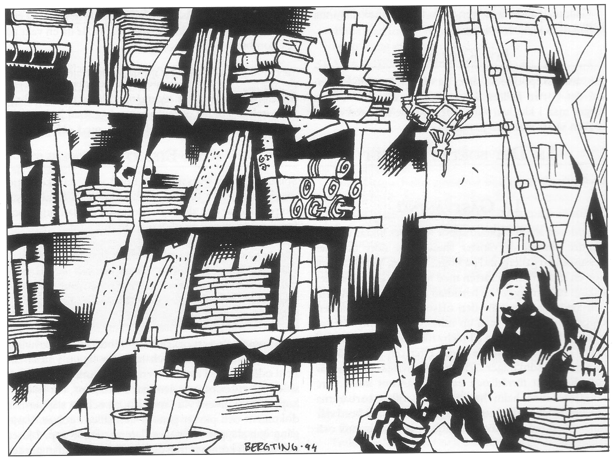
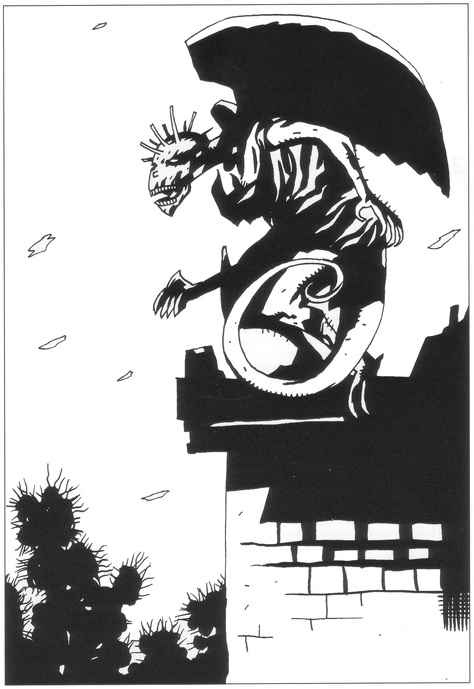
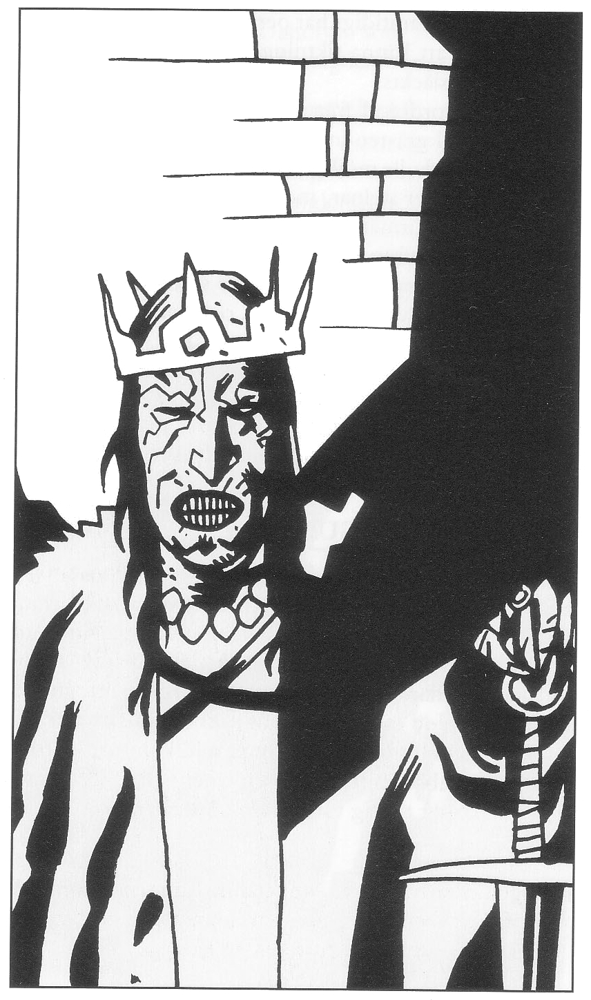

<title>Jordblodkällan - Den femte konfluxen</title>

# 10. Jordblodkällan

Det här avsnittet handlar om äventyr i Cruri. I Stenfingerskrevan, där äventyrarna hittade Kung Ottars grav i *Svavelvinter*, har de vandöda nu byggt staden Fari-Nhata — ”Flugans berusning”. Äventyrarna tar sig antagligen dit för att släcka jordblodkällan. Förhoppningsvis har de redan satt igång Marjuras färd mot Trakorien, planterat Store Stenfar vid konfluxen, varit i Krau-Ki, hämtat Rirbas magiska föremål och erövrat svärdet Blåbite. De kan ha varit hos kaklunen och fått höra att Melealina är fånge i Fari-Nhata.

Handlingen kan som tidigare ta olika vägar. Även om en renlärig SL naturligtvis låter spelet ha sin gång, blir sammanhangen antagligen mest begripliga om sällskapet delar på sig och återförenas senare för att berätta sina olika upplevelser. SL bör självfallet undvika att styra utvecklingen så att spelarna märker det, men det gör inget om någon spelare tas tillfånga av Shagul och får vara med om offerscenen med Melealina. Alvkvinnan får då tillfälle att förklara vad som hänt henne och att hon nu måste lämna spelvärlden. Någon annan, gärna den som talar Ithilgroms tunga, kan träffa kung Ottar, försöka bevisa Shaguls förräderi och kanske föras inför Inadrel i jordblodkällan. En tredje grupp kan smyga runt i Fari-Nhata och lyckas eller misslyckas med att släcka källan.

## Varför ska spelarna ta sig till Cruri?

#### Melealinas synpunkter

1. Jordblodkällan måste naturligtvis släckas.
2. Melealina oroar sig dessutom för demonen Ebharings närvaro på tröskeln till spelvärlden. Om äventyrarna kunde stjäla svärdet som hyser demonen skulle Melealina antagligen kunna fördriva varelsen. Hon vill inte direkt föreslå ett så djärvt tilltag, men uppdraget har vissa utsikter att lyckas eftersom Shagul antagligen inte väntar sig en attack mot sin egen bakgård i Cruri. Att hon har egna planer rörande hur Ebharing (med kaklunens hjälp) skall fördrivas nämner hon aldrig för äventyrarna.

#### Rirbas förslag — ”Landakennings lagoband”

Rirba säger att de nu måste släcka jordblodkällan i Cruri. Det är nödvändigt dels för att skänka Crurerna gravens frid, dels för att undvika massuppståndelse om Marjura kolliderar med bebodda trakter.

Jordblodkällan måste släckas med elfenbensstaven från Krau-Ki, eller med det blå barnets kraft. Uppgiften blir vansklig eftersom minst en Shagulklon, kung Ottar och svärdet Ebharing finns på plats förutom okända mängder vandöda krigare varav några blodsbröder. Ändå kan räden kanske lyckas om man håller den hemlig. Shagul tror antagligen att äventyrarna försöker försvara konfluxen på Clusta Noba dit han också skickat Ottars arméer. Han har ingen anledning att misstänka ett angrepp på jordblodkällan. Blir man ändå upptäckt kan man försöka distrahera försvararna. En grupp kanske kan stjäla svärdet Ebharing för att locka bort vakterna medan några andra diskret tar sig till jordblodkällan. Sällskapet bör dock INTE ANVÄNDA MAGI i Cruris närhet eftersom Shagul omedelbart kommer att upptäcka närbelägna skiftningar i magins kraftflöden och bli förvarnad.

Man får heller inte släcka källan utan vidare eftersom Crurerna då förvandlas till vanliga odöda som sedan måste undanröjas en efter en. Först måste lite jordblod tas undan i den kopparurna som hämtades från Krau-Ki. När källan sedan släcks kommer dess kraft att samlas i urnans jordblod. Med en ritual kan Rirba därefter dämpa Crurernas livslust så att de självmant lägger sig ned och dör.

#### För Spelledaren:

Rirba lämnar ogärna från sig elfenbensstaven och urnan hon fått från Krau-Ki, men inser att hon kanske blir tvungen eftersom hon inte själv vågar sig in till jordblodkällan innan Shagul är död. SL bör hela tiden hålla i minnet att Rirbas mål är att ensam försvinna med det sista jordblodet sedan källan släckts. Hon inser att alla kommer att vara på jakt efter henne om hon lyckas.

### Hur ta sig in i Fari-Nhata?

Enligt Rirba ligger Fari-Nhata i Stenfingerskrevan, en otillgänglig ravin där äventyrarna hittade Ottars grav i Svavelvinter. Häxan känner till två vägar in i Stenfingerskrevan. Den ena går via skrevans mynning som emellertid är hårt bevakad, den andra går via Shaguls hemliga reträttväg som Rirba vagt känner till. Hon vet ungefär var den mynnar, men kan inte hjälpa dem in. Det är inte lämpligt att flyga in över bergen, eftersom vakter på ravinens kant skulle känna de levandes närvaro och slå larm även om de vore osynliga.

## Läget i Fari-Nhata

När äventyrarna smyger in i Fari-Nhata är situationen följande:

* Ottar sitter på sin tron i festsalen och söker förgäves dämpa sitt missmod med undersåtarnas sång och glam.
* Drottning Ottilia sitter på sin audienstron och sjunger sakta med sina döda barn i knäet.
* Shagul har fått låna svärdet Ebharing på egen hand för att göra en ståndsmässig skida som han säger. De två befinner sig (slå 1T20): 1-14: uppe i trollkarlens näste, 15-18: vid jordblodkällan, 19: i festsalen, eller, 20: någon annanstans i staden. Ebharing har tills vidare gått med på att skiljas från Ottar, kanske med löftet om att smaka alvkvinnan Melealinas blod. Om Melealina tagits till fånga är även hon i nästet. Beroende på Shagulspelaren åtgärder kan flera kloner befinna sig i Fari-Nhata.
* Horndemonen Lugash sitter på nästets tak och bevakar vägen dit om han fortfarande lever.
* Najaden Inadrel är i jordblodkällan, okänd för alla.
* Rirba avvaktar någonstans i närheten för att vid tillfälle kunna fylla sin kopparurna med jordblod. Hon vågar inte själv fylla urnan medan Shagul lever, men lämnar den ogärna ifrån sig. Omständigheterna får avgöra.
* Någon av Ottars generaler leder stadens garnison. Han kan vara hos sina soldater vid skrevans mynning eller vandra runt i staden med en patrull.
* Keriaka kan också finnas i faggorna för att stjäla jordblod (ack denna omåttligt populära vätska). Se för övrigt avsnittets senare del.

## Fari-Nhata

Förutom Ottars arméer har hela det Cruriska hovet vaknat efter Svavelvintern. Hovet består till största delen av förnäm men perverterad gammal adel som föga intresserar sig för kriget. Dessa mumifierade livsnjutare strävar nu som tidigare uteslutande efter sin egen tillfredsställelse som emellertid är svårare än vanligt att finna i deras omtöcknade tillstånd. För att om möjligt återvinna svunna tiders glans har de byggt upp sin gamla stad nere i Stenfingerskrevan i Cruri. Staden kallas Fari-Nhata, ”Flugans berusning”, och är ett patetiskt fuskbygge eftersom ingen av de vandöda adelsmännen någonsin arbetade i sina riktiga liv och knappast blivit händigare av åttahundra års skendöd.

Mitt i Fari-Nhata ligger bronstjurens grotta med jordblodkällan. Äventyrarnas uppdrag är att släcka källan innan Marjura ränner in i Palamux och Stegos. Först bör de dock ta undan lite jordblod och hålla det levande i Rirbas kopparurna. Om vätskan hälls i havet kommer såväl de vandöda Crurerna som de odöda att följa jordblodet ner i djupen.

## Karta över staden med omgivningar

### 1a. Ingången till Shaguls lönnpassage

Ingången finns i en liten klippskreva i vilken växer en mjuk matta av björnmossa. Dörren är väl infattad i bergväggen och kan inte brytas upp med våld. Det finns ett nyckelhål under en lapp med falsk lav.

#### Detaljer:

Inne i ett ihåligt träd till höger om porten hänger ett rep. Pillar man upp mossan framför dörren hittar man nyckeln.

#### För Spelledaren:

Shagul själv ringer i klockan och låter sin tjänare öppna. Spelarna kan göra likadant. Ingen annan än väktaren kommer att höra och han måste hur som helst göras ner.

Väktaren är en mumie eller någon annan sorts odöd ur mellanregistret.

### 1b. Bergspassage

Innanför dörren löper en lätt modifierad naturlig spricka 600 meter genom berget. En bäck med utmärkt dricksvatten följer sprickan. Sista biten går sprickan helt in i berget som en grotta.

### 1c. Dörrväktarens rum

Passagen vidgas till en murad valvgång. I taket syns att hela gången kan spärras av en gallerport. Valvgången liksom bäcken fortsätter bortom gallret och svänger vänster efter ett tjugotal meter. På ena väggen framför gallret sitter ett stort bronshantag. En odöd krigare står bredvid handtaget. När han får syn på någon han inte känner igen, går han utan brådska och hämtar en yxa som står mot väggen och avancerar mot inkräktarna.

#### För Spelledaren:

Den odöde krigaren manövrerar gallren med reglaget som han drar ner när någon han känner närmar sig eller då någon ringer i klockan bortom svängen. I strid motsvarar han en standardzombie.

#### Öppningsmekanismen:

Tjugo meter bortom valvgångens krök finns ytterligare ett galler som normalt är stängt. De två gallren kan inte vara öppna samtidigt. När man drar ned spaken fälls det första gallret ned genom att en underjordisk ström kanaliseras om, samtidigt som det andra gallret fälls upp. Så snart man släpper spaken fjädrar den emellertid upp, varvid det andra gallret åker ned igen. Detta innebär att någon antingen måste stanna vid spaken och aldrig komma in i Fari-Nhata, eller att man måste hitta ett sätt att manövrera den sedan man passerat det första gallret.

Det finns naturligtvis minst ett sådant sätt. SL bör inte tillåta billiga lösningar med knutar som rycks upp från långt håll. Spelarna kan förstås trolla men det innebär att Shagul omedelbart blir medveten om att någon använder magi i hans lönngång, vilket äventyrarna varnats för. Den elegantaste lösningen är att hämta en säck salt från gästvåningen bortom kröken, binda ner spaken med säcken som vikt, men placera säcken i bäcken så att saltet långsamt löses upp, vilket sker på 30 minuter. När säcken lättat tillräckligt mycket fjädrar spaken upp och det bortre gallret lyfts samtidigt som äventyrarna naturligtvis ställt sig på rätt sida om det nedfallande första gallret.

Gallren är alldeles för tunga för att någon skall kunna hålla i dem i halvöppet läge.

### 1d. Klockan

En vanlig skeppsklocka sitter på väggen bortom kröken vid det bortre gallret. Kommer man från Fari-Nhata ringer man i klockan varvid den odöde krigaren drar i spaken så att man kan passera.

### 1e. Det bortre gallret

Se 1c.

### 1f. Gästvåning

Korridoren slutar i spiraltrappor ner. Det luktar illa. En mindre passage åt vänster slutar i en dörr och har dessutom en gallergrind på högra väggen. Vid sidan om dörren står en tunna vatten med lock och slev. I hörnet bakom tunnan ligger en besudlad gardin i en pöl av urin och avföring. Innanför den olåsta dörren hörs buller. Öppnar man hittar man en mindre gästvåning där tre nyanlända ädlingar från Chrachz för tillfället bor. Shagul håller dem skilda från de andra eftersom de tillhör en mindre klan som ligger i fejd med de övriga. Rummet är egentligen ett förråd och ganska sparsamt inrett. Tre sänglådor med halm har ställts in, vilket barbarerna emellertid har krafsat ner i en hög på golvet. Ett bord står dukat med halstrat kött (blodigt!), langockermos och dåligt vin.

De tre ädlingarna spelar ett slags kägelspel för att få tiden att gå, där man kastar en käpp mot uppställda benknotor. Chrachzerna vet inte om sällskapet är vänner eller fiender, utan avvaktar. Hälsar man och stänger dörren igen rycker de på axlarna och fortsätter spela. En av dem är nekromantiker med skolvärde 9. Han behärskar bevärjelserna BESUDLA, PARALYSERING, KONTROLLERA LÄGRE ODÖD och RÄDSLA med FV 8. De två andra motsvarar Chrachsiska elitsoldater med kroksablar förgiftade med svartblod (nervgift, STY 17). De talar uteslutande Kargomitiska.

Innanför en dörr finns ett matförråd med tre säckar salt, en tunna vin, två tunnor langockermos, en tunna saltad fisk, torrt bröd på en stång i taket och fem säckar korngryn.

### 1g. Järncell

Gallergrinden är låst med ett bastant lås (SG 25). Innanför finns en kal cell med järngolv och kedjor. En blåslagen Chrachzier sitter fjättrad vid väggen. Han sover eller är medvetslös och skakar av köld.

#### För Spelledaren:

Järngolv är standard i alla fängelser där man vill stänga in potentiella magiker. Chrachziern försökte stjäla Ottars krona från biblioteket och sitter fängslad för att offras vid nästa fullmåne. Ädlingarna i gästvåningen går då och då in och slår honom eftersom han är från en fientlig klan.

Om äventyrarna tas tillfånga stängs de in i samma cell medan de odöda meddelar Shagul. De får då en vakt på sex zombier.

### 1h. Lönngång

En trettio meter lång lönngång tillåter passage förbi biblioteket. För att hitta dörren måste man lyckas med ett färdighetsslag i Finna dolda ting, med -15 på CL.

### 1i. Bibliotek

Spiraltrapporna fortsätter ett tiotal varv, kanske fyrtio meter neråt. Det blir varmare. Eventuella facklor och lampor flackar och slocknar successivt mellan tjugo och fyrtio meter ner. Antagligen är de slut.

> *Lyckat färdighetsslag i Upptäcka fara => Facklan/lampans olja är* inte *slut (spelarna kan gott få tänka på denna möjlighet själva). När det egna ljuset slocknar upptäcker man å andra sida ljus nerifrån trappans slut.*

Man kommer in i ett cirkelrunt bibliotek klätt med hyllor där pergament, böcker och lertavlor ligger i tusental. Fem odöda finns i rummet: en bär dokument, en annan sitter vid ett bord och dammar dokument, två stycken kopierar dokument vid samma bord och en släpper ner dokument och pinnar genom stengaller i golvet. Varje gång han släpper ner något flammar lågor upp. Ljuset och värmen kommer från dessa galler. Kikar man ner ser man lava som trögt flyter fram. Två våningar med balkonger kan nås via trappor. Till höger finns en gallergrind och rakt fram en passage liknande den man kommer från. Det är ca 50°C varmt och luktar svavel.

#### Detaljer:

Läser man en stund upptäcker man att det bara finns tre olika texter i biblioteket. Den ena är årsbokföringen från en asbasthandlare vid namn Taculdo da Melse, den andra är munken Brior Brådfots reseberättelse från Trakorien och den tredje Lugal Fuscas våldsamma och obegåvade angrepp på Banzikan, titulerad ”Detta erbarmliga pjämmer”. De tre skrifterna finns omväxlande på alviska, Ithilgroms tunga, jori eller kargomitiska i bokform, på pergament, lertavlor etc.

#### För Spelledaren:

De odöda skrivarna gör hela tiden nya kopior av samma böcker. Biblioteket är en bluff för att hålla inkräktare sysselsatta tills de förlorar medvetandet. Luften i rummet är mycket syrefattig och rikt på koloxid från förbränningen i lavabrunnarna. Det bekommer varken Shagul eller de odöda som inte behöver andas, men levande varelser förlorar omärkligt 1T4+2 FYS-poäng per minut. Vid FYS≤2 sätter man sig ner och känner sig oändligt trött. Vid FYS≤0 svartnar det för ögonen och man förlorar medvetandet. Man dör då ens FYS når -\[ursprunglig FYS\]. Koloxid är tyngre än luft och ligger därför kvar nere i det nedsänkta biblioteket. Besvärjelsen REN LUFT E2 renar den giftiga luften, men måste förnyas en gång i minuten eftersom ny, koloxidhaltig luft ständigt stiger upp från lavagallrena. Vid det laget har nog Shagul vidtagit åtgärder...



### 1j. Vaktrum

I ett vaktrum mitt emot skattkammaren finns 1T6+6 zombier som hela tiden spanar ut i biblioteket.

#### För Spelledaren:

När den första personen faller samman stormar zombierna ut och försöker ta inkräktarna till fånga för att spärra in dem i cellen (1G) och sedan underrätta Shagul. Den som slåss mot zombierna förlorar 1 FYS per SR eftersom han andas fortare av ansträngningen. Zombierna förföljer inte dem som flyr om de tagit minst en fånge.

### 1k. Skattkammare

Innanför gallret som är låst med tre olika läs, ser man flera kistor med guldföremål. På en ställning vid bortre väggen sitter en magnifik guldkrona.

#### Detaljer:

Den som i Svavelvinter var med ner i kung Ottars grav känner igen hans krona.

#### För Spelledaren:

De tre låsen har SG 12, 16 respektive 32. Guldet är

verkligen guld. Äventyrarna kan plocka på sig så mycket de kan bära. Shagul har stulit det från Crurerna och påstår att de skyldiga finns på Clusta Noba. Luften är lika förrädisk i skattkammaren som i biblioteket.

### 1l. Utgång

Sedan man tagit sig upp för nya spiraltrappor fortsätter en naturlig klippgång 150 meter och slutar i en stenplatta med ett handtag. Öppnas plattan kommer man ut i Fari Nhata ovanför det brinnande gravfältet via en falsk gravsten i klippväggen. Man kan öppna gravstenen från dalsidan genom att trycka in två spärrar på gravstenens kant, men det blir svårt att komma förbi gallren vid 1C. Dock kan man vid det laget antagligen använda magi eftersom överraskning inte längre är nödvändig.

## Allmänt intryck av Stenfingerskrevan

Stenfingerskrevan är en helt sluten dalgång omgiven av höga, branta berg. Den är bara några hundra meter bred och ca en kilometer lång. Sänkan ger ett ytterligt deprimerande intryck: luften är helt stillastående och disig av ånga och svavelrök som stiger ur den vulkaniska marken. Eftersom solljuset aldrig når bottnen ligger skrevan ständigt i halvdunkel. Överallt stöter man på gamla husgrunder och gravstenar. Förvirrade vandöda som inte intresserar sig för kriget vandrar planlöst runt och söker efter något. Deras klaganden och vansinnesskratt ekar mellan bergväggarna. Skrevans inre delar täcks av vitskog och snår av taggiga buskar, men närmare mynningen finns ett öppnare hedlandskap. Inne i själva staden trampar man runt i lera eftersom inga gatstenar lagts ut. De enda djur man stöter på är stora mängder kråkbromsar, jättelika flugor som importerats från skuggornas träsk på Paratorna för att hålla jordblodkällan öppen. Kråkbromsarna, vars psykiska förmågor knappast lättar upp stämningen, beskrivs i *Trakorien*.

### 2. Det brinnande gravfältet

På sluttningen ner från lönngången ligger svavelröken tung och stickande. Ånga pyser ur heta källor och en mängd gravar klär berget. Många gravar står öppna mellan höga klippor, osande av ånga, rök och eldslågor från het lava. Vandöda står eller ligger i gravarna eller sitter på klippan med ansiktet i händerna. Gråt och klagan fyller luften. Marken bränner under fötterna. Scenen är bokstavligen som hämtad ur Dantes inferno *(helvetet IX, 109-133, använd Dorés illustrationer för effekt!)*.

#### För Spelledaren:

En del vandöda beklagar bittert att de vaknat till denna skuggtillvaro. De söker döden genom att långsamt steka sig i lågor och ånga. De tror att pinan ska få gudarna att förbarma sig att inte återväcka dem som odöda, vilket de fruktar mest av allt. Äventyrarna kan få information av dem och kanske begränsad hjälp om de vandöda övertygas om att jordblodkällan måste släckas för att de ska få frid, men de kan inte slåss, är allmänt deprimerade och pratar lätt bredvid mun.

Någon vandöd kan ge en ledtråd med sin klagan: *Jag kan inte dö! Jag skulle följa jordblodet ner i havet, men innan dess låter de mig inte dö!*

### 3. Vitskog

Mellan gravfältet och marknadsplatsen finns ett hundra meter brett parti jättevitmossa, med spridda tallar. Grenarna dignar av uttråkade kråkbromsar — flugorna har inga fiender i dalen och kan därför föröka sig ohämmat.

### 4. Marknadsplats

En del vandöda försöker leva sina liv som tidigare och söker mening i den vardagliga rutinen, till exempel som torghandlare. Marknadsstånden är byggda som runda bord runt de höga stubbarna av fällda tallar med tak högst upp. Crurer ropar med hesa röster ut varor som ingen köper. Någon säljer fisk som legat i ståndet flera veckor och avger en våldsam stank. Går man nära knuffar handlaren bort kråkbromsarna, håller upp något slemmigt och säger att gösen är fin idag. Andra säljer gamla trasor, stenar, ingenting alls, eller riktiga juveler som de påstår är jordgubbar etc. Någon har till och med staplat apatiska stadsinnevånare i sitt stånd och månglar ut dem som prima slavar. *Specialpris för er min herre — tre för samma pris som två — för jag ser ju att ni är en kännare som uppskattar kvalitet!*

### 5. Stenkistan

Nära marknadsplatsen finns stenkistan — stadens avrättningsplats. Stenkistan består av fyra pålar nedslagna i marken vid hörnen av en stenplatta. Pålarna har fjättrar för armar och ben. Lutad mot den ena pålen står en trälåda som är lika stor som stenplattan och har läderremmar fastnitade i hörnen. I närheten ligger en stor hög med knytnävsstora stenar.

#### För Spelledaren:

Crurerna var rädda för att den avrättades ande skulle hämnas, särskilt om offret var mäktigt. Därför hade man som sed att alla deltog i avrättningen. Brottslingen bands på stenplattan, lådan lades på hans bröst och fästes löst i pålarna. Stadsinnevånarna gick sedan förbi på led och lade sten efter sten i lådan tills den olycklige krossades.

### 6. Audienshallen

En hundra meter lång, bred trappa kantad av monoliter leder upp till en vit stenbyggnad anlagd mot klippan. Redan vid trappans fot hör man drottning Ottilias sorgsna sång.

Via en pelargång kommer man in i en trettio meter djup hall. Längst in står en högre och en lägre stentron omgivna av glödande fyrfat. I den lägre tronen sitter drottning Ottilia. En tjänarinna fläktar henne stilla med en pinne vars fjädervippa ramlat av på golvet.

Ottilia hatar häxan Rirba som är skuld till hennes barns död och landets fördärv. Förs häxan på tal börjar hon förbanna sin mans tillit och säger att hon skulle ha klippt huvudet av dockan så snart hon såg den. Frågar man ut henne framkommer det att Ottar lät en annan mäktig trollkarl göra en voodooliknande docka av Rirbas hår eftersom han inte litade riktigt på henne (eller på någon annan för den delen). Dockan skulle ge honom makt över häxan om hon svek. Ottilia vet inte var dockan är nu, bara att Ottar förde den med sig i graven.

Ottilia säger också sorgset till rollpersonerna att hon längtar ut i havet, men bara om hon kunde följa jordblodets väg.

### 7. Stadens bebyggelse

Själva staden är byggd av ett par hundra mer eller mindre misslyckade hus uppförda utan särskild planering. Många har rasat gång på gång och några är byggda så att de blockerar ingången till andra hus. Instängda Crurer bankar beständigt för att bli utsläppta utan att någon bryr sig om dem. Runt husen går vandöda runt och försöker leva som tidigare. Någon sopar gyttjan utanför sitt hus med en kvast, en annan står och stöttar en vägg som håller på att rasa och ropar hela tiden att Pragude ska komma och hjälpa honom, en tredje går runt runt med en kärra som tappat ett hjul, etc.

Hantverkare arbetar i sina verkstäder utan material eller gör stora mängder av samma sak.

Ingen tar någon särskild notis om äventyrarna såvida man inte stöter på en soldatpatrull eller någon ringer i larmklockan.

### 8. Jordblodkällans grotta

Mitt i staden ligger en kulle med en lutande portal, i vilken man huggit in ett tjurhuvud. På kullens topp finns en stor stormklocka som bevakas av 1T10+10 zombiekrigare. Ringer klockan kommer alla i Fari-Nhata att tro sig vara angripna och bli på sin vakt, dvs. slå på sin förmåga att hitta levande. Garnisonen innanför skrevans mynning kommer att inta strategiska platser i staden och Shagul kommer ner från nästet för att se vad som står på såvida han inte påbörjat offerceremonin med Melealina. Stora flugor flyger hela tiden in och ut ur portalen. Nattetid brinner eldar runt kullen.

Innanför portalen leder trappor ner till en smal gång som fortsätter in i kullen. Stanken från gången är förfärlig. Väggarna består av stora stenar på vilka flata block lagts till tak. Efter några meter vidgas gången till ett kvadratiskt rum i vilket väggarna till höger och vänster är hjälpligt stöttade ras. Bortom rummet kan man fortsätta mellan två manshöga krigarstatyer, nerför några trappsteg till en dubbelport som står öppen in till ett svart utrymme. Går man in i kammaren lyfter plötsligt ett hundratal kråkbromsar i ett kaos av brummanden och prasslanden. De flyr på någon minut ut i det fria längs gången. Kammaren är nu helt ljus (om man har facklor med sig vill säga, annars kan man ta en brand från eldarna utanför), men väggar och golv tycks röra sig. Med vämjelse ser man att stenen är täckt av fotslånga vita fluglarver. Mitt på golvet, där larverna krälar i lager på varandra, väller en röd asfaltsliknande vätska fram. Detta är jordblodskällan.

#### Detaljer:

Gräver man i det vänstra raset, där kung Ottar satt, har man 1T4 chans per minut att hitta en trasig tygväst och i dess ficka den lilla voodoodocka som Ottar lät göra av Rirbas hår. Västen fastnade i raset och slets loss när kung Ottar frigjorde sig frän jordmassorna.

Den som var med när det begav sig inser att han är tillbaka i Ottars grav om han klarar ett Normalt INT-slag. Kamrarna till vänster och höger från det kvadratiska rummet tycks dock ha rasat.

#### För Spelledaren:

Den som har voodoodockan kan kommendera Rirba som med nekromantibesvärjelsen KONTROLLERA HÖGRE ODÖD. Kommenderar man henne att dö, förångas både hon och dockan, varpå häxan som blodsbroder står upp vid jordblodkällan igen. Hon kommer inte att uppskatta tilltaget.

Shagul kom på den briljanta idén att hålla jordblodkällan mynning i trim med hjälp av kråkbromsarnas glupska larver. Han importerade några från Skuggornas träsk på Paratorna och de har sedan förökat sig alltmer.

### 9. Festsalen

Mot bergets klippsida har höga murar med stöd rests. Förnämt klädda Crurer rör sig in och ut genom två portaler från vilka man hör musik. Genom portalerna kommer man in i en stor grotta där kanske två hundra vandöda håller vild orgie. Man kommer in i ett dike från vilket några rader läktarbänkar höjer sig. Mellan portalernas diken finns ett upphöjt podium som tjänar som scen. På podiet uppträder akrobater, danserskor, striptöser och gycklare utan större entusiasm eller skicklighet. Jonglörer tappar sina bollar men fortsätter jonglera utan att märka något, akrobater slår frivolter och landar på ryggen, striptöserna drar av hudbitar tillsammans med sina kläder, etc. Eventuellt pågår istället en strid mellan fångna dvärgar. Vid podiets bortre ände spelar en orkester, slår på stora mässingsstycken och trummor, blåser i bronslurar och på flöjter. Nära dem brinner stora eldar på ömse sidor om en trappa. Trappan leder upp till en läktare där kung Ottar sitter på sin tron. Han flankeras av 1T4 soldater och kanske av en general.

Ovanför läktarna löper avsatser där folk sitter vid bord och frossar på läckerheter som ändå inte smakar dem. I väggen vid avsatserna finns alkover där vandöda ligger i olika kombinationer för att bedriva otukt. De lyckas dåligt eftersom deras förtorkade kroppar sedan länge förlorat förutsättningarna för sådana aktiviteter. Istället blir de rasande och slår varandra — ett alternativ som tilltalade dem redan i livet.

Här och var på väggarna hänger misshagliga Chrachzier, dvärgar och vandöda i kedjor som utsmyckning och måltavlor. Innanför dörrarna står bågskyttar som ska skjuta ner de flugor som irrar sig in i lokalen. Lika ofta träffar de någon åskådare på läktarna.

Mitt i allt detta sitter kung Ottar, grällt sminkad, och har tråkigt.

#### För Spelledaren:

Soldaterna är vaksamma, men märker äventyrarna först när musiken gör en paus eftersom den dränker ljuden av deras hjärtslag. När man upptäcker de levande tystar Ottar musik och prat med en gest och säger sedan: ”Mina vänner, vi har gäster!” Mer om detta senare i avsnittet.

### 10. Dalens mynning

Dalens mynning, ca tvåhundra meter från själva staden, är hårt bevakad. Femhundra vandöda krigare ligger förlagda utanför och hundrafemtio innanför. För att ta sig in till Fari-Nhata måste man först ta sig in i en två meter bred bergsspricka som längst ut kan stängas av med ett fällgaller. Sprickan sluter sig efter femtio meter till en tjugo meter lång grotta som även den slutar i ett fällgaller. Ovanför öppningen ut i dalen har en balkong huggits in i berget. Balkongen bemannas alltid av sex krigare. Härifrån manövreras fäll gallren via kedjor och hjul. Här finns också en stor larmklocka som mobiliserar styrkorna och hörs ända upp till nästet.



Utanför mynningen finns tvåhundra odöda som vill in till sina förebilder. Inga odöda släpps emellertid genom passagen bortsett från Shaguls personliga tjänare. När de stoppas, grubblar de odöda några minuter, glömmer det hela och försöker på nytt. Scenen påminner om folkvandringen utanför ett populärt diskotek.

Två patruller om 20 krigare vardera rör sig ständigt i staden.

### 11. Park med trähus

Femtio meter från mynningens inre gallergrind finns en träport i bergssidan. Den är låst med ett nyckelhål på utsidan (SG 15). En smidig person kan dock klättra över klippan som är 12 meter hög. Innanför dörren finns en kort gång som mynnar i liten park helt omgiven av klippor. Ett litet fönsterlöst trähus är byggt mot den lodräta klippan i parkens borte del. Via en olåst dörr kommer man in i ett rum som slutar i en ny dörr. På höger och vänster sida finns ytterligare dörrar.

Den vänstra dörren har en enkel hasp, medan de andra saknar låst. Samtliga dörrar tycks dock vara magiskt FÖRSEGLADE. Talar man Jori i huset hörs rop på hjälp från dörren till vänster.

#### För Spelledaren:

Alla tre dörrarna plus en fallucka i golvet framför dem är bundna med samma FÖRSEGLA E1. SKINGRAR man besvärjelsen öppnas alla dörrarna samt falluckan varvid den som står på den ramlar ner. Hålet under är fyra meter djupt och brant strutformat så att benen kilas fast i botten och den nedfallne inte kan komma upp själv såvida han inte har FV Klättra ≥15.

I rummet till höger finns 8 zombiekrigare anförda av en mumie. De odöda kommer ut när deras dörr låses upp, med instruktioner att hålla kvar inkräktare och meddela Shagul.

I rummet till vänster finns fem hantverkardvärgar som Shagul håller kvar för reparationsarbete. De är undernärda och desperata. Dvärgarna har god kännedom om stadens lokaliteter inklusive Shaguls hemliga gång som de genast vill utnyttja för att fly.

### 12. Stigen till nästet

Innanför dörren rakt fram vindlar en smal stig genom berget, ut i det fria och uppför bergssidan i serpentiner. Stigen fortsätter flera hundra meter och efter ett tag får man en svindlande utsikt över Stenfingerskrevan nedanför. efter ca åttahundra meters brant vandring ser man en stenbyggnad på toppen av en grannklippa. Stigen löper i fullt synfält från nästet, över en bro och vidare mot byggnaden.

#### För Spelledaren:

Den som kan flyga kan finna stigen bortom trähuset utan att öppna dörrarna. Horndemonen Lugash sitter på nästets tak. Han ser alla som närmar sig öppet och varskor Shagul eller går till attack om han är ensam.

### 13. Shaguls näste

Nästet är en enkel stenbyggnad med ett enda rum och välvda fönster i alla väderstreck. Här utspelar sig slutfasen av äventyret *Damgambit* om förutsättningarna stämmer. Samordna gärna med äventyrarnas ankomst. Är de inte fångna kan de komma fram just då Shagul stöter Ebharing i Melealinas bröst. Shagul skulle fortsätta ceremonin även om han blev varnad att inkräktare var på ingående.

I stenväggarna finns järnbojor för att hålla tilltänkta offer på plats och i ett altare i mitten. Via en brant trappa i ett hörn kan man komma upp till ett mindre observatorium på taket, där man hittar kvadrant, pergament med skisser över stjärnornas positioner, matematiskt kladd, m.m.

#### För Spelledaren:

Eftersom Shagul som mentalist såväl kan flyga som använda fjärrsyn behöver han ingen kikare. Med FJÄRRSYN E6 ser han från någon kilometers höjd teoretiskt sett lika bra bort till Clusta Noba som om han befann sig där och kan även få en mer detaljerad bild av stjärnhimlen. Nu är väderförhållandena på Marjura sällan gynnsamma för vare sig flygning eller fjärrskådande.

## Att släcka Jordblodkällan

Lyckas äventyrarna ta sig in till jordblodkällan kan de släcka den på tre sätt: antingen genom det blå barnets handpåläggning, eller genom att trycka ner elfenbensstaven från Krau-Ki i källan, eller genom att doppa svärdet Blåbites hjalt i blodet. I alla tre fallen stelnar blodet omedelbart till gråsten och såret är därmed läkt för att aldrig mer kunna öppnas.

Emellertid kommer najaden Inadrel att försöka stoppa dem innan de kommit så långt. Så snart det blå barnet eller något av de två föremålen passerar statyerna på väg in till källans rum, stiger den bloddrypande kvinnan fram och går till anfall för att döda med sin magi. Hon strider till döds.

## Möte med Ottar

Äventyrarna kan möta Ottar i festsalen. De kan bli fasttagna eller träda fram självmant. Kungen kommer i vilket fall att betrakta dem som inkräktare och fångar, åtminstone till att börja med. Beroende på omständigheterna kan olika saker hända:

#### Äventyrarna halar fram Dolken Demens

Demens agerar som ambassadör för sällskapet och går i god för deras vandel (men kom ihåg att äventyrarna stal Demens från Ottars grav). Han och Ottar känner varandra väl och kungen visar något som liknar glädje vid återseendet. Demens ser att majestätet är bekymrat och kungen berättar gärna vad han vet. Han tror vidare obetingat på allt dolken berättar om världen. Demens ordinerar kungen att dricka från jordblodkällan för att bli piggare.

#### Ingen av äventyrarna kan göra sig förstådd + Ottar hittar plundergods på dem från skatten i Shaguls lönngång

Kungen blir rasande och hugger i bästa fall ner skurkarna omedelbart. Hinner han lugna sig kommer han snart på något mera utdraget och plågsamt.

#### Äventyrarna kan inte göra sig förstådda, men ertappas inte med tjuvgods

```
60%    Kungen vill fråga sin rådgivare Shagul om hur han
       ska agera med dessa spioner
30%    Kungen hugger ner någon av dem och går till Shagul
       med resten
10%    Kungen blir förvirrad och går till jordblodkällan
       för att klara huvudet med en slurk
```

#### Äventyrarna kan göra sig förstådda och påstår sig ha bevis för att Shagul lurat kungen och stulit hans skatt

Kungen blir upprörd och kräver bevis. Under tiden ska en av sällskapet hållas som gisslan i stenkistan där man var tionde minut ska lägga en sten.

#### Äventyrarna påstår sig ha bevis för att Shagul är en förrädare när trollkarlen är med

Kungen blir förvirrad och vill tillsammans med alla inblandade gå ner till jordblodkällan för att klara huvudet. Shagul avråder som tidigare starkt från detta eftersom blodet gör kungen sjuk, men Ottar viftar irriterat bort honom och kräver samtidigt att få tillbaka Ebharing.

#### Någon av fångarna är en ung vacker kvinna

Ottars minnen av livets ljuvhet väcks med plågsam klarhet. Han smeker kvinnans mjukhet med sina förtorkade fingrar och skakar sakta på huvudet. Detta ökar hans benägenhet att välja gravens ro om han träffar Inadrel.



### Ottar går till jordblodkällan

Om Ottar går till jordblodkällan kommer najaden Inadrel att framträda till allas överraskning. Hon väljer att träda fram därför att källan är allvarligt hotad och bara Ottar kan rädda den. Den blodiga kvinnan berättar sin historia, avslöjar att Shagul är en förrädare som förgiftat kungen och hindrat honom från att dricka från källan för att det skulle ha återställt hans tankeförmåga. Hon berättar att Shagul stulit skatten och gömt den inne i berget, att världen är större än Marjura och Clusta Noba. Hon berättar också att Rirba tänker släcka källan sedan hon stulit jordblod för att dricka det vid konfluxen. Sist men inte minst föreslår hon att äventyrarna tvingas dricka på det att hon ska kunna läsa deras avsikter.

Om Shagul följer med till källan kommer han in i det sista att gå mellan källan och kungen för att hindra att monarken dricker. Inadrel kommer då att resa sig ur blodet och dra in trollkarlen i källan mot vilken han saknar makt. Shagul är sedan en klon kortare.

### Inadrels förslag till Ottar

Inadrel uppmanar kungen att dricka så att han får tillbaka sin sans, att återta svärdet Ebharing och döda Shaguls alla uppenbarelser (hon vet hur många de är), att fängsla och mura in Rirba eftersom hon inte kan dödas.

Hon vet att Marjura är på drift mot bebodda trakter och att *Landakennings lagoband* kommer att utsträckas till andra de andra öarna genom källans kraft. Varför sätter inte kungen en armé som vakt vid källan och tar sedan själv befäl över styrkorna vid Clusta Noba för att erövra ön. Inadrel känner till konfluxen, men inte var på Clusta Noba den ska äga rum. Ottar bör döda allt på ön och sedan köra iland alla vandöda så kommer han garanterat att vara närmast. Han kan bli en verklig härskare med miljoner undersåtar. Han kan, kort sagt, vinna spelet.

Om Inadrel blir klar över att äventyrarna vill släcka källan rekommenderar hon att de omedelbart dödas och att deras kroppar bränns för att inte kunna vakna. Det blå barnet bör hur som helst avlivas och elfenbensstaven kastas i närmaste lavapöl.

Sist men inte minst ber hon Ottar skaffa undan alla dessa fördömda flugor. Hon kan i fortsättningen sköta källan lika bra som dem, och de gör henne nervös.

### Hur reagerar Ottar på Inadrels förslag

Ottar dricker ur källan och blir snabbt en mer tänkande varelse. Han kommer att söka hämnd på Shagul och Rirba. Det är däremot inte säkert att tanken på ännu fler odöda tilltalar honom. SL kan själv fatta Ottars beslut. Antingen gör han som kvinnan säger och söker dominera konfluxen, eller så förklarar han sig vara less på alltihop och föredra gravens lugn med orden:

> *...under mer än ett millennium har vi trotsat gudarna, och se vart det har fört oss...*

Han ber äventyrarna fortsätta med vad de måste göra för att skänka hans folk ro utan att bry sig om Inadrels protester och förolämpningar.

Han hjälper dem besegra najaden och hämta jordblod om de har något lämpligt kärl. I detta fall bör Rirba eller hellre Keriaka, som ingen räknar med, redan ha stulit jordblod. Scenen är tilltalande: Man samlar jordblod, släcker källan, går i procession till havet och häller högtidligt ut det, varpå Ottar som blodsbroder rasande upptäcker att någon annan också har jordblod kvar. Han kanske blir så arg att han tror äventyrarna försöker lura honom...

Ottar dödar inte äventyrarna även om han vill försöka dominera konfluxen. Tack vare dem har hans ögon öppnats, de verkar veta en hel del och kan vara bra att ha. Dessutom är det trevligt med några varmblodiga omkring sig, särskilt om de är unga kvinnor.

## Det sista jordblodet

Om jordblodkällan släcks rakt av, dör och förångas omedelbart alla blodsbröder inklusive Rirba, Inadrel och Ottar. Alla vandöda förvandlas omedelbart till vanliga odöda. Alla andra odöda som väckts av källan tappar sin lojalitet mot Cruri och irrar runt på egen hand till de görs ner.

Denna utveckling passar inte ett antal varelser på Marjura som är intresserade av att ta undan en slatt jordblod innan källan släcks.

* Rollpersonerna kommer att försöka norpa det sista jordblodet för att hälla ut det i havet så att vandöda och odöda följer efter.
* Rirba vill ha den sista skvätten för sig själv för att dricka den vid den femte konfluxen för att återvinna liv och makt.
* Keriaka vill ha det sista blodet för att skänka liv åt en ny art insektoider.
* Shagul, Rirba, Keriaka, blodsbröderna och rollpersonerna kommer att jaga efter det sista jordblodet om någon annan fatt tag i det eftersom deras öden hänger på att det bevaras.

Dricker någon av äventyrarna från källan (eller om de gjorde det redan i *Svavelvinter*), faller de i tung sömn under 1T20 timmar och vaknar med smällande huvudvärk. Efter detta känner Inadrel personens tankar lika bra som han själv. Samtidigt har personen fått blodsbrödernas förmåga att känna riktning till det sista jordblodet sedan källan släckts.

Tar man jordblod från källan i en vanlig behållare stelnar det till gråsten inom 1T4 timmar. En snabbflygande varelse skulle möjligen hinna till havet och hälla ut blodet innan det stelnar, men skulle bara få ett försök. Två behållare förmår hålla jordblodet flytande genom sina speciella krafter: Keriakas läderpung respektive Rirbas urna från Krau-Ki. En magiker som behärskar den minimagiska besvärjelsen BEVARA, och besitter ett FV på 15 eller mer i sin bästa magiskola, kan faktiskt även använda denna mycket simpla besvärjelse för att hindra jorblodet från att stelna, men den måste förnyas var tredje timme.

Läs för övrigt om *Landakennings lagoband* i avsnittet om Crurerna.

### Shagul på flykt

Om Ottar upptäcker Shaguls förräderi flyr trollkarlen för att på egen hand söka finna och dominera konfluxen. Han tar med sig Ebharing, men demonen tycker inte om utvecklingen och börjar misstänka att Shagul är en förlorare. Ebharing ställer ultimatum: får han inte smaka Melealinas blod inom sex dagar vägrar han samarbeta.

För Shagul bort demonen med våld kommer svärdet att försöka sabotera trollkarlens planer och kallar samtidigt telepatiskt till sig Ottar som i *Svavelvinter*.