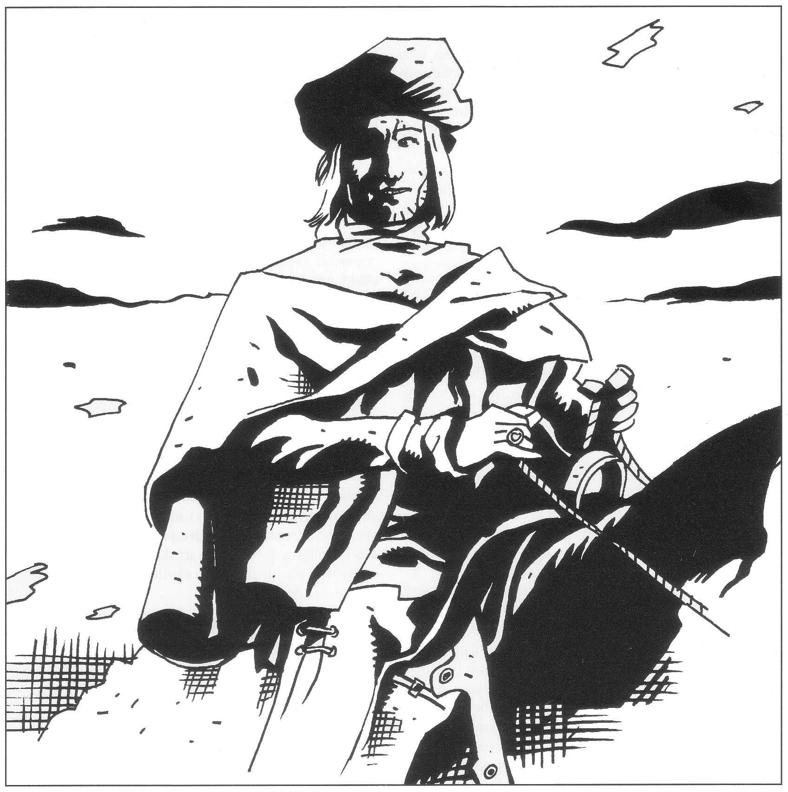

<title>Konfluxen - Den femte konfluxen</title>

# 11. Konfluxen

Detta avsnitt beskriver den slutliga jakten mot konfluxen, en eventuell slutstrid och ett antal möjliga slut på spelet.

## Tillbaka till Clusta Noba!

Sedan äventyren slutförts i Fari-Nhata är det dags att ta sig tillbaka till Clusta Noba för själva konfluxen. Kanske jagar man Rirba eller Keriaka som stulit det sista jordblodet och råkar under vägen ut för strider med dem eller med andra jägare såsom Shagul eller blodsbröderna. Kanske marscherar man som fångar i Ottars armé för att bevittna det sista stora slaget om Clusta Noba.

Det är flera dagsmarscher tvärs över Marjura, men om tiden är knapp kan man teleportera sig med hjälp av ekollonen från blomstereken. Som en sista utväg kan Melealina/kaklunen erbjuda sig att teleportera sällskapet innan den lämnar spelvärlden.

När det bara är något dygn kvar till konfluxen kan Store Stenfar avslöja för ranzinermunkarna att konfluxen äger rum i en grotta trettio meter under jord och det exakta avståndet till grottan.

## Konfluxgrottan

Ett hundrafemtiotal meter från konfluxen öppnades en klyfta i marken när jorddragaren ryckte igång öarna söderut. Klyftan är ca sextio meter lång och löper inte i riktning mot konfluxplatsen. Ånga från någon hetvattenkälla stiger ur klyftan och sikten därnere är begränsad till tio meter. Klättrar man ner i klyftan, som är mellan tre och tjugo meter djup, finner man en avstickare som fortsätter med 30° lutning utför. Himlen försvinner snart och det blir mörkt. Vatten dryper av väggarna och fukten är så tät att facklornas ljus flimrar. Efter fyrtio meters nedstigande stöter man på svavelluktande vatten som är 40° varmt, dvs på gränsen till vad man kan uthärda. Man får vada ett femtiotal meter där vattnet som högst når till midjan och det låga taket gör att man måste böja sig. En dvärg kan upplysa en om att man nu rör sig i riktning mot konfluxplatsen under förutsättning att han känner till den. Grottan börjar leda uppåt igen samtidigt som taket höjs flera meter. Man lämnar vattnet bakom sig och fortsätter ytterligare ett trettiotal meter, där grottan slutar med en avsats tre meter upp. Klättrar man upp ser man att avsatsen bara fortsätter några meter och slutar blint. (Här ligger en raugonhane i bakhåll om Keriaka är i grottan).

> Lyckat färdighetsslag i Finna dolda ting => tio meter tillbaka i sprickan finns en sidospricka fyra meter upp på vänstra väggen. Klättrar man upp i sprickan kommer man via en sex meter lång, trång passage in i en så gott som halvsfärisk grotta. Grottan, som är tjugofem meter i diameter, har fint, vitt sandgolv. Bergskristaller i väggarna reflekterar ljuset från facklorna.

Detta är konfluxens grotta, rakt under den exakta platsen på kartan. Från grottans högsta punkt är det femton meter upp till markytan. Om grottans ingång räknas som klockan sex på en urtavla, är konfluxens exakta plats klockan två, mitt emellan grottans periferi och centrum.

Det tar tio man tre dagar att bryta sig ner genom grottans tak från markytan om de har rätt verktyg.

#### Slutstrid i grottan

Om det här var en normal actionfilm skulle naturligtvis hjältarna möta skurken i själva konfluxgrottan under filmens klimax. Det är ett tilltalande slut även om SL inte behöver krysta fram det. Har Keriaka hunnit hit blir det i alla fall ett rejält slagsmål.

## Vem vinner?

Den som blir konfluxens herre har vunnit spelet. Herre över konfluxen blir den intelligenta varelse som kommer närmast. Bara en person eller varelse kan vinna, men effekterna kommer att smitta av sig på hans folk och land.

## Vem kommer egentligen närmast konfluxen?

De flesta inblandade — rollpersoner, spelare, spelledare, Shagul — tror naturligtvis att det är självklart vem som är närmast konfluxen. När tiden är inne står någon närmast, punkt slut, men så enkelt behöver det inte vara. Resultatet kan bli en överraskning. Nedanstående resonemang är av matematisk natur. Den som inte har intresse eller talang för dylikt kan helt enkelt hoppa över det och köra på den självklara linjen istället.

Konfluxen är en fyrfaldig punkt, dvs en plats och en tid där platsen bestäms av tre koordinater och tiden av en fjärde. Just när konfluxen inträffar är tidskoordinaten noll för alla. Den som då befinner sig på exakt rätt plats har även rumskoordinaterna noll i förhållande till konfluxen. I detta fall är personen närmast utan konkurrens. Det intressanta kan inträffa när ingen befinner sig på exakt rätt plats vid konfluxen.

Beteckna rumskoordinaterna mätta i meter:

NS = avstånd till konfluxpunkten i nord-sydlig riktning

OV = avstånd till konfluxpunkten i ost-västlig riktning

D = avstånd i djup (konfluxen ligger på -30 meter vilket motsvarar D = noll)

Enligt Pytagoras sats blir det geografiska avståndet till konfluxen: √(NS² + OV² + D²) meter.

Om tiden däremot inte är noll, blir även den ett avstånd. Avståndet, kallat T, ska anges i antal timmar gånger sex. En timmes avstånd i tiden motsvarar nämligen sex meters avstånd i rummet, allt enligt elementär konfluximetri, vilket rollpersonerna upplystes om redan i Isakra.

Den generella formeln för avståndet till konfluxen blir: √(NS² + OV² + D² + T²)

#### Praktiska följder

Rent praktiskt innebär detta som ett exempel att den som passerade konfluxens grotta för fem dagar sedan (=120 timmar motsvarande 720 meter) då kom närmare än den som befinner sig 1.000 meter bort just när konfluxen infaller.

Eller föreställ er följande scen: Raugonerhonan Keriaka sitter på rätt plats i konfluxgrottan. Det är tio minuter kvar då äventyrarna dödat hennes hannar och stormar in. En vild strid utbryter, sällskapet magiker lyckas frysa in raugonerhonan i ett isblock, men hon lever fortfarande. Isblocket knuffas ut i gången utanför. Då infaller konfluxen. En rollperson står två meter från rätt plats. Men Keriaka satt på exakt rätt ställe för tio minuter sedan. Tio minuter = en meter. Keriaka kom alltså närmast och hennes ägg börjar kläckas. De förvånade äventyrarna angrips av ett svårt köttätande insektsmoln och finns plötsligt inte mer...

#### Begränsningar

* Tidsavstånd räknas bara bakåt i tiden eftersom konfluxen bestäms när tiden = 0. Man kan alltså inte gå till konfluxgrottan en vecka för sent och tro sig komma närmast i efterhand.
* En person måste fortfarande besitta intelligens >6 när konfluxen inträffar för att komma ifråga. Han kan alltså inte vara död eller odöd.

#### Vad vet Melealina?

Den ende som insåg hur konfluxen verkligen skulle beräknas var den döde matematikern Nastigast. Om Melealina arbetade med Nastigast känner hon till hur tiden måste tas med i beräkningen, annars inte.

### Kluven eller enad konflux

Konfluxen inträffar senast *50 dygn sedan multimandalan kommit till Clusta Noba*. Det innebär att äventyrarna måste befria jorddragaren *inom 20 dygn* efter sin ankomst för att inte konfluxen ska bli kluven. Om äventyrarna misslyckats med att befria jorddragaren (man ryser vid tanken på sådan inkompetens), ligger Marjura kvar långt uppe i norr. Konfluxen kommer då att inträffa dels där, dels i Trakoriska sjön som Melealina fruktade. Utfallet på Marjura blir ungefär detsamma, men samtidigt kommer något att hända som innebär att vinnaren på Marjura får en jämbördig motståndare i Trakorien. (De grå eminenserna kanske dyker upp igen, den självgoda statyn Nekromorbus kanske råkar vandra förbi på havsbottnen eller så materialiseras något hemskt från Krindenland.) De två parterna kommer att strida utan att kunna besegra varandra. Deras strid kommer att sprida sig, pågå till nästa konflux och lägga hela nordvästra kontinenten i ruiner.

Jag går inte in på några detaljer eftersom denna utveckling dels är ganska osannolik, dels är en helt annan historia.

## Olika varianter av konfluxen på Clusta Noba

### Arn Dunkelbrink (Stegos)

Arn Dunkelbrink får anses som favorit till platsen som konfluxens herre. Vinst för kungen är vinst för spelarna och för Trakorien som helhet. Denna utgång motsvarar det lyckliga slutet i en roman eller film.

Vid själva konfluxen rämnar grottans tak och kungen bestrålas av stjärneglans som gör honom till den utvalde och återställer hans utseende. Stegoserna inser genast sitt misstag och ångrar att de tvivlat på honom. Folk i Moskorien, det gamla Kishatet och Lasemos ansluter entusiastiskt. Trakorierna kastar in handduken sedan deras huvudstad förstörts. Ransarderna vill ogärna ge upp så lätt utan mobiliserar de flottstyrkor som överlevt svallvågorna. Dock hinner de knappt inleda sina angrepp förrän drakarna dyker upp (se nedan) och tänder eld på merparten av deras skepp.

Arn Dunkelbrinks makt befästs snart och han ser till att fred sluts i hela regionen. Trinsmyrerna får sin självständighet liksom trakorierna på Paratorna. Saphyna ansluts till Stegosernas rike, men såväl ransarder som trakorier får tullfrihet i öns hamnar och vatten. Handeln blomstrar och regionen får ett uppsving. Rollpersonerna belönas storligen med gods och adelstitlar för sin insats för öarna i Västerhavet.

Efter några år gifter sig kungen med en Melukhisk prinsessa och de får ett halvdussin barn. Kungens sår är dock inte läkt, utan efter ett tjugotal blomstrande år abdikerar han och ger sig ut i Multiversum på jakt efter alvkvinnan han aldrig kunnat glömma. Vid en paus i sitt sökande spelar han schack med döden i Bythos där äventyrarna kunde stöta på honom i Kristalltjuren.

### Rollpersonerna

Det är svårt att generellt säga vad som händer om någon av rollpersonerna dominerar konfluxen eftersom händelseutvecklingen helt beror på vederbörandes bakgrund och önskemål. Äventyraren kommer som en outsider som varken profetior eller siare räknat med och kanske perioden just kommer att präglas av oförutsägbara händelser. Rollpersonen bör med Store Stenfars och drakarnas lojalitet kunna bli en maktfaktor, men knappast en samlande gestalt för de egensinniga länderna i området. SL far läsa alla andra utfall och försöka hitta något som passar den utvalde. Kom ihåg att konfluxen inte behöver vara en lycklig händelse. Det enda som är sagt är den ska sätta sin prägel på eftervärlden.

En RP som dominerat en konflux kan se fram emot att få åtminstone 150 HP, kanske upp till det dubbla om han har något gudastyrt öde eller en snäll SL. Övriga personer i sällskapet kan även av en återhållsam SL tilldelas mellan 50 och 100 HP, beroende på deras del i äventyret. Framstående problemlösare som bidrar till en lycklig konflux bör få åtminstone 100 HP för besväret.

### Shagul och Ebharing

Om Shagul med Ebharing dominerar den femte konfluxen blir det inte roligt. Demonen kan med konfluxens kraft pressa sig in i vår värld helt och hållet. Han manifesterar sig som den fruktansvärda sjukdomen maskpest. Shagul kontrollerar vem som ska smittas och vem som ska dö i sjukdomen som är obotlig och starkt vanställande om man inte dör. Med hänsynslös utpressning tilltvingar sig Shagul makten i hela Trakorien och kanske även i länder på fastlandet. Bara alverna står emot eftersom de är immuna. I konfluxen stärks Shaguls personliga krafter femfaldigt och han blir gudomligt okränkbar till kropp och psyke för femhundra år framåt.

Store Stenfar dör vilket får drakarna att vända hem igen. Alla odöda eller vandöda på öarna blir automatiskt lojala med Shagul.

Trakorien blir med Shamashi ord ”ett eländes elände”. Det är bara att bita ihop och vänta på den sjätte konfluxen.

### Rirba av Cruri

Om Rirba lyckas dominera den femte konfluxen och dricker sin urna med jordblod vid nollpunkten, förvandlas hon till sitt gamla levande jag, en lång blåhårig skönhet med isblå ögon, bara femfalt starkare. Alla vandöda och odöda på Landakenningen blir omedelbart lojala mot henne och hon övertar personligen kraften från jordblodet och besvärjelsen. Rirba kan med sin nyvunna styrka väcka alla döda på Palamux och Stegos och få en odöd armé på hundratusen man. Eftersom kraften nu kommer från häxan och inte från *Landakennings lagoband*, kan de odöda lämna öarna och härja som Rirba befaller. Resultatet blir ett mörkerrike i Trakorien med öde grannländer dit ingen vågar sticka näsan.

Personligen får Rirba skolvärde 30 i alla tillämpliga magiskolor och PSY 60.

### Raugonerhonan Keriaka

Keriakas tror sig med viss rätt vara utvald att bli stammoder till en ny art insektoider som ska bli det mäktigaste folk som någonsin rasslat fram över spelvärldens yta. För detta behöver hon tre saker: Säden från en annan arts hane, gudaföda från underjorden till sin avkomma och den kraft att ge liv som ska skänkas i den utvalda kläcknings-platsen.

I mer begripliga ord innebär detta att hon måste förföra en människa, hämta jordblod till sina telningar från Fari-Nhata, lägga sina ägg i konfluxens grotta och vakta dem till konfluxen kläcker dem. Hon har alltså för avsikt att vinna spelet.

SL bör komma ihåg att Keriaka som raugon inte planerar och intrigerar som en människa. Hon agerar till stor del på instinkt. Raugoner har inga moralbegrepp.

#### Den utvalda säden

Keriaka behöver befruktas av en man för att kunna producera sin muterade avkomma. Redan på skeppet *Bladverk* vådabet hon någon av de manliga rollpersonerna och injicerade en långtidsverkande afrodisaka. Personen har sedan dess haft obehagliga erotiskt färgade drömmar där han klöst sig i sömnen.

Keriaka kommer att söka närma sig mannen i vildmarken, gärna när han ensam sitter vakt på natten, och locka honom bort från sällskapet med höga pipande locktoner som en människa inte kan uppfatta, men som skär i öronen på en vargman eller en spiritus familiarus. Pipandet hypnotiserar offret som genast söker upp raugonerhonan. På lagom avstånd från de andra kommer Keriaka att förmå det hypnotiserade offret att befrukta henne i en akt vars detaljer läsaren ska besparas. Offret kommer barmhärtigt nog inte heller att minnas något, men återvänder ett par timmar senare med glasartad blick, sönderslitna kläder, blödande rivmärken och svedda testiklar.

Om Keriaka inte lyckas förföra äventyraren av en eller annan anledning, hittar hon säkert någon ersättare, men händelsen kan ändå tjäna som ledtråd till vad hon har i görningen. Dessutom innebär ett misslyckande att Keriakas hannar måste döda den tidigare utvalde av religiösa skäl.

#### Gudafödan

Sedan hon blivit befruktad försöker Keriaka hämta jordblod från källan i Fari-Nhata. SL kan spela händelsen eller avgöra hur det går beroende på omständigheterna — Inadrel känner inte till Keriakas avsikter med jordblodet och kommer inte att försöka hindra henne om hon kommer för att hämta lite i sina slemsäckar. Keriaka kan också vara på plats när äventyrarna kommer till Fari-Nhata och tjäna som kavalleri i knepiga lägen.

Keriaka förmår psykiskt dominera skrevans kråkbromsar att hjälpa henne. Hon har inget egentligt hjärta och upptäcks därför inte så lätt av de vandöda.

Om raugonerhonan inte själv får tag i något blod innan källan släcks, känner hon liksom blodsbröderna på sig var urnan med den återstående skvätten finns och jagar efter den.

#### Pyssel i grottan

Keriaka kommer med sin insektoida instinkt att utan större svårighet hitta ingången till konfluxens grotta (myror hittar alltid in i mitt hus). Hon beger sig dit så snart hon fått vad hon ska ha. Hon lämnar två hannar som försvar på vägen in till grottan före vattnet, lägger en i bakhåll på avsatsen nära grottans mynning och tar med sig två. Hon lägger därefter ett hundratal ägg per dag fram till tre dagar före konfluxen. Äggen är läderartade och formade som sprängfulla plånböcker. Hon faster dem på väggarna med kladdigt sekret som när det stelnar blir hårt som epoxilim. De sista dagarna hämtar hon jordblod i munnen, går runt från ägg till ägg, biter försiktigt och injicerar lite blod i varje ägg. Slutligen ger hon de två hannarna varsitt paralyserande bett och lägger dem vid äggen som frukost till sina telningar. Därefter sätter hon sig på den exakta konfluxplatsen för att vakta. Kommer någon in i grottan anfaller hon omedelbart för att döda. I första hand attackerar hon fackelbärare eftersom hon själv ser i mörker.

#### Konfluxen

Om konfluxen inträffar med Keriaka och hennes ägg i grottan, upprepas den tredje konfluxen. Äggen kläcks och ut svärmar miljarder mycket små, snabbflygande insekter *(med drag av fadern!)*. Likt en mikroskopisk pirayasvärm äter de på någon minut upp de paralyserade hannarna och ger sig sedan på mamma som blir ett tomt skal på ytterligare ett par minuter. Surrandet stiger irriterat i brist på mat varpå de hungriga syskonen hittar utgången och tar sig till ytan.

Insekterna växer allt eftersom de äter. Under några veckor kommer de att äta av allt liv inom en radie som växer med tre kilometer om dagen. (Eventuella odöda förvandlas raskt från zombier till skelett.) Samtidigt växer de till en duvas storlek och liknar röda, flygande skalbaggar. Det är mycket svårt att undkomma svärmen, för odjuren är ohyggligt snabba, oräkneligt många, aggressiva som bålgetingar, effektiva som köttkvarnar och har ett paralyserande gift som liknar trädskorpionernas från *Oraklets fyra ögon*. De känner på sig var det finns kött och gnager eller gräver sig in dit någon gömt sig. Efter de två skräckveckorna inleds den egentliga pilgrimigran. Hela svärmen lyfter som på kommando och flyger söderut. Under ett par månader kommer de att äta sig ner genom kontinenten och försvinna in i Samkarnas djungler där de så småningom grundar ett nytt samhälle.

### Manzonla (Ransard)

Om ransarderna dominerar den femte konfluxen ser den f.d. Krystalokraten Manzonla till att vara närmast. Vid själva konfluxen välsignas han av gudomlig förlåtelse. Grottans tak rämnar, Manzonla bestrålas av stjärnornas samlade ödeskonstellation och guden Shamash utser honom till sitt verktyg för en framtida religiös stat. (Shamash tycker antagligen att stegoserna fått sin chans och sumpat den med sitt interna käbbel. Nu återvänder han till beprövade kort som åtminstone visar lite entusiasm.)

Manzonla får kraftigt höjd karisma, kraften att utföra gudomliga under och en ödesbestämd osårbarhet i klass med Arn Dunkelbrinks.

Marjura stannar i detta fall inte vid Stegos utan kör över ön som fullständigt försvinner från spelvärldens geografi och historia.

Omgivande länder underställer sig raskt den nya makten eller sluter vänskapsfördrag. Trakorierna på Paratorna ges emellertid ingen förlåtelse. Under Manzonlas välsignelse slaktar ransardernas arméer öns hela befolkning och införlivar den och Saphyna i sitt rike. Palamux och Trinsmyra blir gudastatens kärna i en nära allians med ransarderna. Riket expanderar snart även på kontinentens fastland, spridande sitt stränga och tråkiga regelverk.

### Praanz da Kaelve (Trakorien)

Om Praanz da Kaelve dominerar konfluxen växer han i de ödesstrålande stjärnornas ljuskaskader. Drakarna anländer, jagar bort de sista ransarderna från Clusta Noba om det finns några kvar och sätter sig snällt att vänta på adelsmannens order, da Kaelves älskade Tricilve går under, vilket han sörjer en tid, men kaos hotar nu Trakorien eftersom hela Bodâken försvann med huvudstaden. Det är känt att da Kaelve i stort sett ensam fört kampen om den femte konfluxen för Trakoriens räkning, ofta motarbetad av de bortspolade rådsherrarna. En delegation från ett hastigt hopkommet adelråd ber da Kaelve bli den nya kejsaren, vilket han accepterar efter kort betänketid. Han proklamerar att en ny huvudstad ska byggas vid konfluxens punkt och att dess namn ska vara Trinoba. Från sitt svarta palats svär han att härska rättrådigt över hela Trakorien.

Praanz da Kaelve har alltid varit en ärlig man och hans välde ger Trakorien en moralisk uppryckning av aldrig skådat like. Hans första åtgärd blir att köra hem ransarderna och förfölja dem in på deras bakgård. I hamnarna bränner drakarna bort hela den ransardiska flottan och äter i förbifarten upp de hippogriffer som sänds mot dem. Ransarderna får en dyrköpt fred där de tvingas avstå från en egen flotta och istället anlita trakoriska skepp för sin handel. Trinsmyra erbjuds eget styre under förutsättning att man betalar skatt till Trakorien och samarbetar militärt. Trinsmyra accepterar inför övermakten. Krigsmakten och flottan byggs åter upp, strikt enligt Banzikans principer. Stegos och Palamux införlivas med riket.

Rollpersonerna får amnesti för sina mystiska äventyr mot rikets intressen, eftersom da Kaelve kommer fram till att de kämpat mot gemensamma fiender var och en efter sin övertygelse. Arn Dunkelbrink erbjuds guvernörskapet över Palamux, vilket han avböjer för att istället försvinna ut i Multiversum på jakt efter Melealina.

### Kung Ottar och Inadrel

Kung Ottar kan bara dominera konfluxen om jordblodkällan finns kvar. Grottans tak rämnar och stjärnornas ödesglans spelar över kungen och över hans folk. All ånger och melankoli blåser bort ur kungens sinne, vilket får hans tanke att klia av verksamhetslust. Marjura krockar med Palamux och Stegos så våldsamt att klyftor slås upp i jorden där färskt jordblod går i dagen. Landakennings lagoband utsträcks till de andra öarna så att hundratusentals odöda reser sig ur sina gravar, helt lojala med Cruri. De vandöda Crurernas vitalitet ökar av det färska jordblodet i kombination med konfluxens kraft så att de återfår samma intelligens som i livet. Landets magiker kan åter börja gräva i förbjudna hemligheter och snart finner man ett sätt att förvara jordblod färskt i behållare.

De lär sig att vandöda kan få del i den stora besvärjelsen så länge de befinner sig inom hundra meter från en sådan behållare. Crurerna kan således börja bygga skepp för att härja på haven och i grannländerna.

Store Stenfar dör när de vandöda dominerar konfluxen och drakarna vänder hemåt. Trakorier och ransarder flyr till sina hemländer som går en svår framtid till mötes och tvingas betala stora tributer till Crurerna för att inte deras städer ska brännas. Rollpersonerna får fri lejd från riket som tack för sin del i rikets lysande återuppståndelse. De gör dock bäst i att stanna i Crurernas rike, emedan de inte direkt kommer att hyllas som hjältar på andra platser... I Cruri kan de å andra sidan skaffa sig framstående positioner i egenskap av hjältar. Alternativt kan de fly spelvärlden och starta på ny kula någon annanstans i Multiversum.

Besvärjelsen som håller Crurerna vid liv kan nu bara brytas genom att samtliga fem kvarvarande jordblodkällor släcks. Ottar sätter var och en av sina generaler som ansvariga för varsin källa. Rirba återvänder och söker nåd hos kungen, men muras in i ett torn där hon får sitta för evinnerlig tid som straff för sitt förräderi. Inadrel dyrkas som landets moder och stort tempel uppförs i Fari-Nhata som blir det vandöda rikets huvudstad.

## Specialeffekter i samband med konfluxen

### Personlig kraftökning

Konfluxens herre blir för en tid gudarnas gunstling. Han får en ödesbunden osårbarhet liknande den som Arn Dunkelbrink haft, dvs. han kommer inte att dö såvida han inte missbrukar gåvan. Gåvan innebär inte att pilar studsar mot hans hud, utan snarare att han alltid kommer att räddas av försynen hur osannolika oddsen än ter sig. Nackdelen kan vara att han liksom Arn Dunkelbrink och Kamalkus blir en främling överallt och till sist måste ge sig av.

Personens förmåga på väsentliga områden kommer som en tumregel att femfaldigas. Han kommer att få kraftigt ökad KAR och befrias från eventuella förbannelser, kroniska krämpor eller lyten.

### Store Stenfars medaljong

Strax efter konfluxen vandrar de två stora svarta statyerna som vaktar porten till Store Stenfar ner från sina platser och söker upp konfluxens herre. Ceremoniöst tilltalar de den utvalde på dennes språk och överlämnar en medaljong som tecken på slottets lojalitet. Den som bär medaljongen väljer själv vilka slottet ska acceptera. Slottet kommer i detta att läsa sin herres tankar via medaljongen. De tidigare arrangemangen med gästboken etc. är inte längre giltiga och slottet kör omedelbart på porten alla som misshagar den utvalde. Vidare kan den utvalde när som helst kalla på de två statyerna som då växer upp ur jorden i hans närhet inom 1T6 SR för att hjälpa honom. Deras egenskaper motsvarar Nekromorbus från *Oraklets fyra ögon*.

#### Förutsättning:

Om konfluxen domineras av Crurer eller Shagul dör Store Stenfar omedelbart. Han erbjuder bara sina tjänster till människor, alver eller andra humanoider.

### Drakarnas ankomst

När draken Blatifagus stal fröet till Store Stenfar i äventyrets början, erbjöd slottet honom Nâchoberudh, vilket innebär ett sprillans nytt namn på det höga språket. I gengäld skulle draken samla en här av fränder i sina hemtrakter nära Yndar och återvända för att under trehundra år tjäna Slottet och dess herre.

Nu anländer Blatifagus med S+(S x 1T4) drakar i en mäktig formation vars samlade styrka ingen armé på kontinenten kan stå emot. (S = Store Stenfars tillväxttal vid tiden för konfluxen.) Enbart åsynen av de stora och uråldriga djuren skrämmer vettet ur de flesta motståndare. SL regisserar naturligtvis drakarnas ankomst så att maximal effekt uppnås. Motståndarna kan gärna samlas i övermäktiga antal för ett avgörande dråpslag när förstärkningen anländer i sista stund, lämpligen till tonerna av Wagners ”Valkyriornas ritt”. När läget lugnat sig landar drakarna vid konfluxens herre. Blatifagus betygar deras lojalitet (under trehundra år i alla fall) och förklarar vad som egentligen hände under färden mot Isakra.

#### Förutsättningar:

Om Store Stenfar dött eller aldrig har grott, vänder drakarna och flyger hem igen. Den oförlåtligt utskämde Blatifagus söker upp den ödsligaste bergstrakt han kan finna någonstans på Akrogal och visar sig aldrig mer. Om Store Stenfars radie är mindre än eller lika med 20 meter, säger drakarna från Yndar att de dagligen bränner upp större slott före frukost och vänder hem igen. Blatifagus återvänder dock.

### Gudarnas storslägga

Den astrologiska förvirringen i *Oraklets fira ögon* och Kristalltjuren berodde till stor del på att spelvärlden närmade sig ett bälte av himmelsstenar som vimsade till stjärnbilderna. En meteorit utplånade den gamla ruinstaden Yoh Niur när meteorsvärmen korsade planetens väg. Nu är spelvärlden förbi stenbältet, men en eftersläntrare finns kvar. Denna himmelssten kommer att slå ner på konfluxherrens huvudmotståndare där det svider som värst. SL kan själv sikta beroende på omständigheterna. En meteorit i huvudet kunde ju vara ett lämpligt slut för Shaguls samlade kloner när de träffats för rådsslag. En mildhjärtad SL kan också utplåna Fari-Nhata och jordblodkällan om rollpersonerna misslyckats med uppgiften (även om detta enligt min mening gränsar till fusk.).