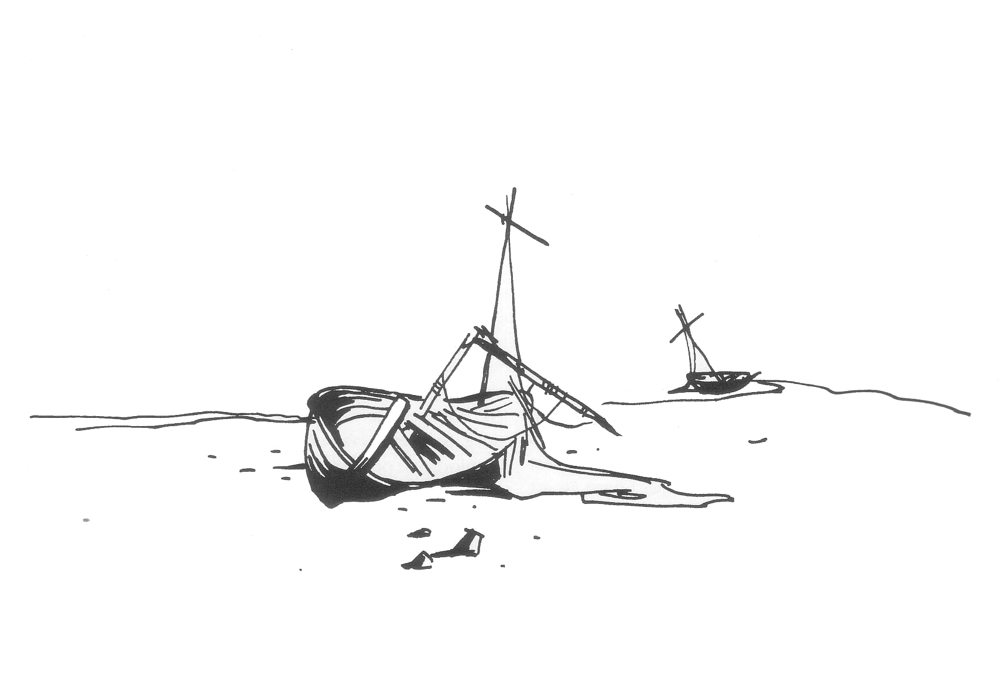

<title>Crurerna - Den femte konfluxen</title>

# 13. Crurerna

Detta är en sammanställning av Crurernas historia och nuvarande s.k. leverne. Rirba känner till Crurernas historia och berättar det som passar hennes intressen för Shagul och äventyrare, kanske med vissa korrigeringar.

Det är väsentligt att SL förstår skillnaden mellan odöda och vandöda, se rubriken ”Kung Ottars folk” nedan om du känner dig osäker.

### Krau-Kis historia

På andra sidan spelvärlden, i en tid då få människor ännu hade satt sin fot på Trakoriens öar, blomstrade staden Krau-Ki på en vit klippa vid kontinenten Yndars nordspets. Men stadens liv var för gudarna en ondskans blomning, ty dess invånare utvecklade nekromantiken och de onämnbara njutningarnas konster till fulländning. Som straff beslöt gudarna i samband med den tredje konfluxen åren 599-598 f.O. att flytta staden till planetens ödsliga och kalla nordhav. Förflyttningen skedde inte över en natt vilket många lärde hävdat. Så snart ljuset vaknade på konfluxens första morgon, bröts Yndars nordspets loss och Crurerna fann sig vara på drift norrut med sin stad genom ett hav som forsade förbi längs de branta stränderna.

Förändringen utlöste febril aktivitet bland stadens skickliga magiker. De offrade till alla kontakter de hade i spelvärlden, dödsriket och i andra världar för att ta reda på vad som hänt och varför. Snart fick de kunskap om gudarnas dom och även om förbannelsens mekanismer.

Gudarna hade städslat en jorddragare vid namn Jagernatha för att dra Krau-Ki till spelvärldens nordhav, ja kanske till själva polen. Jorddragarna, som också kallas tektoner, sägs vara ofattbart stora varelser som lever i den underjordiska magman. För att skydda sina brinnande fränder, furianerna, från meteorbombardemang från rymden, byggde de i urtiden gigantiska sköldar och sammanfogade dem till ett klotformat pansar. Detta klot är spelvärlden, på vilken jord, skogar och oceaner med tiden samlats liksom mossa och dagg samlas på en sten i skogen.

Krau-Ki vilade på jorddragaren Jagernathas sköld och denne hade av gudarna fått order att förflytta sig norrut.

### Multimandalan

En demonprins från trakterna nära eldens elementarkällor kunde för Crurerna berätta hur Jagernathan fått sina order: Multimandalan kallas den stora ritning över alla världar som omtalas även i Kristalltjuren. Före Multiversums uppkomst slets den stora kartan i stycken under gudarnas stridigheter med kaos makter, vilket i sin tur gav upphov till multiversums splittrade utformning. Enligt demonprinsen hade gudarna nu tagit den bit av multimandalan som föreställer spelvärldens polartrakter, ritat in Krau-Ki nära nordpolen och placerat kartbiten i Jagernathans huvud, närmare bestämt i den kristall grotta som är jorddragarens inre öga. Eftersom multimandalan styr verkligheten, började Jagernathan genast förflytta Krau-Ki till den plats där staden enligt gudarnas karta borde befinna sig.

Men Crurerna var ett driftigt folk som inte lät sig nöjas med detta besked. Genom sin magi lyckades de lokalisera kristallgrottan — jorddragarens inre öga. Tiden var nu knapp, ty redan ven kalla vindar runt stadens torn och jorddragaren strävade oförtrutet norrut. I kristallgrottan sökte Crurerna först manipulera multimandalan i syfte att återföra Krau-Ki till dess gamla läge. Men deras förståelse av den gudomliga ritningen var alltför bristfällig. De lyckades bryta jordragarens kurs men inte vända den. Samtidigt vittrade händerna bort på dem som vidrört mandalan och Crurernas ö drabbades av skakningar som inte ville sluta. Då förde man bort mandalan ur kristallgrottan. De yppersta häxmästarna ritade i dess ställe en magisk cirkel och förseglade därefter grottan på det att ingen obehörig skulle frestas till farligheter. Därmed stannade Krau-Ki på den plats där Marjura idag ligger, men ännu roterar ön sakta runt den magiska cirkeln. (Detta är orsaken till geomagerns felaktiga positionsangivelser, men dem vet naturligtvis Rirba inget om.)

Ungefär etthundratrettio år efter Marjuras förflyttning började en röd asfaltsliknande vätska tränga fram ur jorden på flera ställen. Crurerna kallade vätskan jordblod och tog den som ett elakt omen, men lugnades när blodet på någon tid stelnade till sten. Några lärda häxmästare höll emellertid det kraftigaste källflödet öppet och fann att det besatt stora krafter som kunde tyglas. Under kommande sekler kom Crurerna att bygga mycket av sin magiska kraft på jordblodet, men insåg aldrig att det var Jagernathans blod som sprungit fram. Jorddragaren blödde av den onaturliga cirkelrörelse den tvingats till innan dess kropp vant sig. Crurerna höll ådern öppen och växte med tiden i makt tills de åter förargade gudarna. Då hemsöktes deras stad av en fruktansvärd varelse kallad Kmeard på vilken varken vapen eller magi hade verkan. De ogudaktiga tvingades fly och de flydde så långt de kunde komma på sin ö och anlade staden Fari-Nhata i den landsände som ännu kallas Cruri. Fari-Nhata betyder ”Flugans berusning”.

Men ödet fortfor att vara dem ogynnsamt. Ett tjockt istäcke utgick från Krau-Ki och växte över ön, den glaciär som kom att kallas *Kmorda* efter varelsen som drivit Crurerna på flykt. Vid samma tid släcktes de ogudaktigas fruktsamhet så att inga barn längre föddes i Cruri. Ändå lät sig Crurerna inte besegras, ty de var av sturigast möjligt kynne. De beslöt under sin siste kung Ottar och häxmästerskan Rirba att övervintra förbannelsen. De lade sig med jordblodets kraft i den åttahundraåriga dvala som kallats *Svavelvintern* och vaknade först då äventyrarna kom till Marjura i spelets första del.

Innan de gick i dvala raserade de helt sin stad Fari-Nhata och lade sig i primitiva gravar för att dölja sin högkultur. De lämnade sina tjänare, det primitiva Kvurerfolket, vissa föremål och legender, ägnade att återväcka dem när tiden var mogen och förbannelsen till ända.

### Rirbas tolkning av det som nu händer

Rirba känner liksom Melealina till den kluvna konfluxen. Hon tror att kluvenheten beror på Crurernas manipulerande med multimandalan för tolvhundra år sedan när de för en kort tid lyckades få ön ur kurs innan den stannade. Hon minns nu också att multimandalan ska ha skickats bort från Marjura ett par hundra år innan Cruri började sin långa sömn. En troende sekt hade vid den tiden uppstått runt gudaritningen. Sektens självutnämnda präster besvärade kungen och de makthavande trollkarlarna. Eftersom man inte vågade förstöra mandalan sattes den och dess präster på ett skepp söderut. Rirba känner inte till mandalans vidare öden, men enligt legenden grundade prästerna ett tempel tillägnat världens alla gudar där de fann land.

(Äventyrarna inser naturligtvis att det rör sig om Etemenankitemplet i Isakra. De kan välja att berätta detta för Rirba eller låta bli.)

Rirba har hört Ebharing berätta om sitt möte med kristalltjuren och äventyrarna i de grå hallarna. Samtidigt har hon liksom Shagul känt att starka magiska föremål förts in i vår värld. Häxkvinnan är säker på att tjuren själv är ett av dessa föremål och tycker sig ana att ett annat är någon form av redskap, kanske ett skrivdon. Hon tror nu äventyrarna också känner till mandalan och att de är på väg till den för att korrigera världsritningen med hjälp av sina magiska föremål och på så sätt ena konfluxen.

## Landakennings lagoband

Efter många års efterforskningar hade Rirba i sin anfader Etorgos anteckningar funnit runor om en magisk princip kallad *Landakennings lagoband*. Med denna princip kan magi bindas till land som inte bryts av vatten. Principen hade övergivits av Crurerna då den ansågs medföra stora risker men Rirba resonerade att förbannelser redan givits Crurerna i sådan mängd att ytterligare elände knappast kunde göra saken värre.

Rirba utarbetade en komplicerad besvärjelse som hon lät suga kraft från jordblodkällan och vann sådan framgång att dess magi omedelbart utsträcktes till hela Marjura. Eftersom ingen annan magi utnyttjar *Landakennings lagoband*, kommer beteckningen att användas både för principen och själva besvärjelsen.

### Var verkar Landakennings lagoband?

Jordblodkällans kraft är obegränsad och besvärjelsen verkar därför över hela Marjura. Landakenningen innebär att besvärjelsens kraft utsträcks till Clusta Noba så snart stenbron är klar. Om besvärjelsen fortfarande verkar när Marjura krockar med Palamux och Stegos utsträcks den även till dessa öar. Detta skulle innebära att hundratusentals döda reser sig ur sina gravar med förödande konsekvenser för allt mänskligt liv på landakenningen.

### Besvärjelsens effekt

#### Effekt på Crurerna

Besvärjelsen håller Crurerna vid liv som vandöda. Om de tappar kontakt med besvärjelsen eller denna slutar verka förvandlas de omedelbart till vanliga odöda. Crurer kan aldrig bli vandöda igen sedan de en gång blivit odöda.

Det är därför Crurerna måste bygga en stenbro till Clusta Noba. De kan inte skeppas över — så snart skeppen kastade loss skulle de bli vanliga odöda.

#### Effekt på blodsbröderna

Blodsbröderna är direkt kopplade till jordblodkällan. Så snart de förintas eller tappar kontakt med besvärjelsen smälter de till rödbrun smet som snart kokar och förångas. 1T4 timmar senare stiger de åter fram ur källan. Jordblodkällans kraft skyddar blodsbröderna från all magisk påverkan.

#### Effekt på personer som dör

Varje person som dör där besvärjelsen verkar, reser sig i 50% av fallen som en odöd zombie efter 1T4 minuter. Om personen lyckas slå under sitt PSY som levande kommer han att under 1T12 dagar efter sin död tro sig vara levande och försöka leva som tidigare. Hans tankar är under denna tid förvirrade och långsamma. Han klarar inte att resonera om sin odöda belägenhet. En nekromantiker kan under dessa första dagar enkelt ta kontroll över den döde och behålla honom som tjänare för all framtid. Under perioden bleknar stegvis de levande minnena bort varpå den döde fungerar som vilken odöd som helst. Reglerna gäller även eventuellt avlidna rollpersoner. Besvärjelsen börjar omedelbart verka på den som dör och förekommer alla andra försök att väcka upp denne. Den som dör på Marjura hinner inte väckas till mer normalt liv med annan magi, till exempel genom magiska talismaner, animism, etc., utan faller genast offer för jordblodkällan kraft.

Om ett lik hackats i stycken kan delarna ändå bli levande som *dödmanshand*.

Besvärjelsen verkar bara på människor.

#### Effekt på redan vandöda och odöda som görs ner på nytt

Vandöda Crurer eller vanliga odöda som görs ner har 50% chans att vakna igen som vanliga odöda efter 1T4 timmar. Om liket hackats i bitar vaknar dessa som en dödmanshand. Om liket bränns upp är det slutgiltigt borta. Observera dock att lik inte brinner av sig själva utan förbrukar en hel del bränsle. All skog på Clusta Noba skulle inte räcka till att bränna upp hela Ottars armé. Lik som kastas i havet är bortom *Landakennings lagoband* såvida de inte flyter iland.

Vanliga odöda som står under besvärjelsens inflytande är vagt lojala med Crurerna. De kan inte tänka själva, men följer med Crurer de stöter på och gör som dem eller som de blir tillsagda.

#### Effekt på trupper som förintas i krig

Hälften av vandöda eller odöda truppers förluster återuppstår efter 1T4 timmar. När mänskliga trupper förintas vaknar hälften av soldaterna efter 1T4 timmar som odöda trupper. Dessa trupper kommer instinktivt att försöka förena sig med närmaste Crurerstyrka.

### Besvärjelsens begränsningar

Besvärjelsen verkar på alla vandöda och odöda som står i kontakt med Marjura och angränsande land eller befinner sig högst en meter från sådan mark. De vandöda har därmed en stor svaghet som äventyrarna själva får finna ut. Så snart de kommer mer än en meter från marken faller de samman. När de landar kan de naturligtvis så småningom åter väckas upp som vanliga odöda av besvärjelsens kraft, men de är inte längre vandöda Crurer. I envig räcker det om en äventyrare lyfter en vandöd högt från marken för att denne ska dö. Crurerna själva känner instinktivt sin svaghet och undviker att tappa kontakten med marken. STEN och JORD leder besvärjelsen, liksom IS ovanför sten eller jord, men INTE flytande vatten, trä eller annat organiskt material.

### Besvärjelsens ände

Besvärjelsen kan bara ändas genom att jordblodkällan släcks. Om inget jordblod tagits undan när källan släcks förvandlas alla vandöda till vanliga odöda som går omkring och tycker illa om de levande på sedvanligt sätt tills någon ger dem nådastöten. Om jordblod tagits undan i Keriakas eller Rirbas behållare, verkar besvärjelsen tills detta jordblod är borta. Hälls det sista jordblodet ut i havet kommer alla vandöda och odöda som väckts av *Landakennings lagoband* att följa efter och aldrig visa sig igen.

Blodsbröderna förvandlas genast till ånga när det sista jordblodet förvandlas till sten eller hälls ut i havet. Blodsbröderna känner instinktivt var närmaste jordblod finns. Om källan släcks men jordblod tagits undan försöker blodsbröderna få tag i detta eftersom deras existens hänger på det. Jakten på det sista jordblodet prioriteras framför allt annat, till exempel högre än att erövra konfluxen. Blodsbröderna kommer att beordra sina arméer att delta i jakten.

## Kung Ottars folk

Cruris folk övervintrade under åttahundra år gudarnas förbannelse, försatta i magisk dvala av häxan Rirba, en dvala som kommit att kallas Svavelvintern. I de omfattande ritualer som föregick sömnen, sattes villkoren för svavelvinterns slut då Crurerna åter skulle väckas genom Jordblodkällans kraft. Crurerna sövdes medan de ännu levde, men det liv de nu vaknat till är en stor besvikelse. Deras kroppar, själar och tankar är förtorkade och vanställda så att de mer liknar döda än levande. Crurerna känner en stor sorg över sitt öde och en grumlig vrede över de falska löften som gavs dem åtta sekler tidigare. Samtidigt klamrar sig deras dimmiga hjärnor fast vid det enda liv som minnet berättar om. De har inte längre någon uppfattning om tid. De kan inte lagra några minnen. De förstår inte vad som hänt eller vad de ska göra. De är kort sagt *vandöda*. Denna osäkerhet och viljelöshet har låtit trollkarlen Shagul styra dem för sina egna syften.

Så stark var kraften i Rirbas väckande ritual att inte bara de sovande väcktes, utan också många sedan tidigare döda. Därför består kung Ottars arméer av en brokig skara vandöda blandade med magiskt återväckta lik.

### Blodsbröderna

*Landakennings lagoband* vävdes med komplicerade ritualer som bland annat krävde att sju högt uppsatta Crurer direkt sammankopplade sina liv med jordblodkällan.

De sju är kung Ottar, häxan Rirba samt de fem generalerna Cerafox, Galtryn, Peregald, Trus och Hurubam. De två sistnämnda flankerade kung Ottar i hans grav i *Svavelvinter* och tjänade även som kungens adjutanter och väpnare. För detaljerade egenskaper se ”personer och varelser”.

I Stenfingerskrevan vid Fari-Nhata skadas blodsbröderna enbart av magiska vapen.

### Vandöda Crurer

#### Utseende

De vandöda är alla mumifierade med trasiga kläder och utrustning. Huden täcker hela kroppen men är förtorkad, gulaktig och seg som skoläder. Bara ögonen är fuktiga och stirrar otäckt eftersom huden runt dem krympt in mot skelettet.

#### Karaktär och beteende

SL bör spela de vandöda Crurerna med en stämning av sorg, frustrerad vrede och blodfattig hopplöshet, snarare än blodtörst och fanatism. De vandöda försöker leva sina liv som de gjorde innan svavelvintern. Deras konung Ottar har manat dem till krig mot fiender som rådgivaren Shagul pekat ut, och detta lerig utkämpar Crurerna utan att förstå varför. De anfaller utan entusiasm, men också utan rädsla och försiktighet.

#### Egenskaper

Rent tekniskt är Cruris vandöda inte döda. Därför skiljer de sig i många avseenden från vanliga odöda. Vanlig nekromanti fungerar normalt inte på dem. Vanliga vapen biter på dem som på levande varelser. Jordblodkällans kraft skyddar dem från varje slag av psykisk påverkan. De vandöda tror sig vara normala människor och agerar därefter.

De vandöda Crurerna har ett sjätte sinne som låter dem känna närvaron av levande varelser. Vaksamma vandöda, till exempel soldater på patrull, känner närvaron på femtio meters håll. Övriga, till exempel innevånarna i Fari-Nhata, bara på tre meters håll. Sinnet är kopplat till ljudet av ett slående hjärta. Därför kan de upptäcka osynliga människor men inte varelser som maskerats med magisk tystnad.

#### Typiska egenskaper

```
STY 20    STO 11    SMI 5
INT 3     FYS 8     PSY 10
KP  10
```

**Skydd:** Läder 2 poäng (i Stenfingerskrevan vid Fari-Nhata kan de vandöda enbart skadas av magiska vapen.)

**Förflyttning:** L10

**Beväpning** (FV 10): 20% påk, 40% kroksabel, 10% långsvärd, 10% långt spjut, 20% långbåge

### De odöda

De återväckta liken fungerar som vanliga odöda, med den skillnaden att de på ett förvirrat och ytterst ogenomtänkt sätt tror sig vara levande och tjäna i Ottars armé. De odöda påverkas av magi.

De odöda kan vara allt från hela skelett till delar av stinkande zombier beroende på när de dog och hur mycket som finns kvar av dem. Utseende, klädsel och utrustning varierar beroende på likets bakgrund. SL kan lämpligen använda schablonvärden för zombier och skelett från monstermanualerna och gärna lägga in någon mäktigare odöd här och där. Kom ihåg att det blir mer spännande om man inte redan på capen eller tyglindorna ser vad motståndaren går för.

