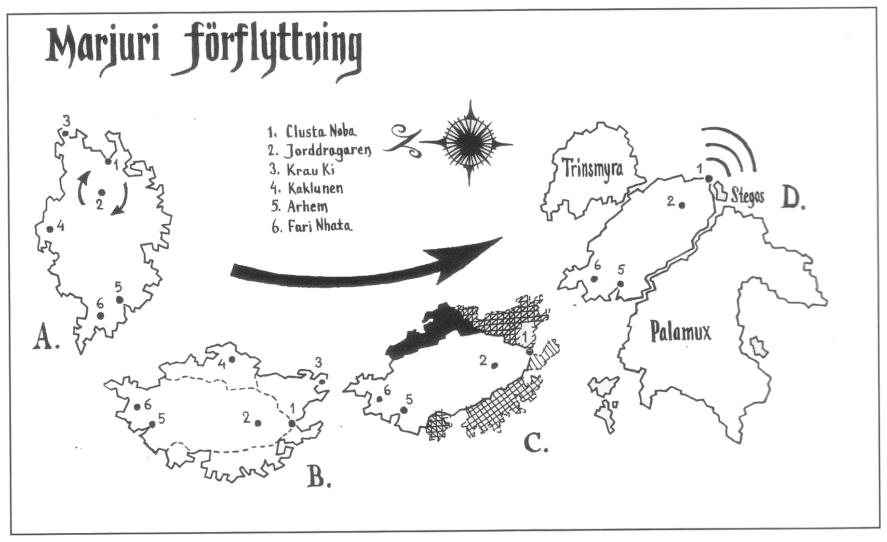

<title>Marjuri förflyttning - Den femte konfluxen</title>

# 14. Marjuri förflyttning

När rollpersonerna placerar den reparerade mandalan på Jagernathans inre öga börjar jorddragaren omedelbart möblera om geografin enligt kartans instruktioner. Hans lott är att snabbt dra Marjura söderut och foga in ön i Trakorien så att de två konfluxplatserna sammanfaller.

#### Tid noll — Rycket

Jorddragaren har varit bunden av Crurernas hypnotiska cirkel i tolvhundra år. Han vaknar med ett ryck som när man har en tid att passa och tror man försovit sig. Jorddragaren *har* en tid att passa och han *har* försovit sig. Rycket kastar momentant hela bergplattan med Marjura och Clusta Noba ett par meter åt väster. Den häftiga rörelsen får marken att rämna på flera håll. Omotiverade klyftor, vulkaner och varma källor kan springa fram efter SL:s önskemål. På Clusta Noba uppkommer minst tre raviner varav en måste läggas nära konfluxplatsen eftersom den ska öppna vägen ner till konfluxens grotta. Se f.ö. avsnittet om konfluxen.

#### Tid 0-7 timmar — Vridningen

En timme efter uppvaknandet har jorddragaren insett vad som ska göras. Han vrider sig och hela bergplattan 60° medsols så att Clusta Noba hamnar rakt söderut från Itlasbergen (bild A och B nedan). Vridningen tar sex timmar. Under Vridningen sugs havsvatten ut från viken vid Clusta Noba med extremt lågvatten (-10 meter) som följd. På hexkartan innebär detta att alla havsrutor som gränsar till landrutor med höjden 0-50 meter tillfälligt torrläggs. Alla rutor med rev torrläggs och angränsande rutor blir rev. Skepp som strandsätts tar 1T20 skrovpoängs skada.

Clusta Noba får på detta sätt en tillfällig landförbindelse med Marjura. Crurerna kan alltså strömma över, men eftersom de var lika lite förberedda på lågvattnet som äventyrarna hinner de inte mobilisera några större styrkor innan vattnet kommer tillbaka. SL slår 1T100 sex gånger. Det lägsta tärningsslaget visar hur många Crurer som tar sig över till Clusta Noba under första timmen, det näst lägsta resultatet antalet vandöda som kommer under andra timmen etc. Crurerna tar sig knappast förbi Hypherermunkarnas barrikader under de sex timmarna.

Den tillfälliga förbindelsen utsträcker *Landakennings lagoband* till Clusta Noba. Det innebär att ytterligare 3T10+30 odöda inom 1T4 timmar vaknar här och där på själva Clusta Noba med en förvirrad önskan om att tjäna kung Ottar vem nu det kan vara. De odöda är inte fler eftersom man under historien begravt sina flesta döda till havs.

Observera att solens gång bör bli ganska märklig denna vridna dag.

#### Tid 7 timmar-4 veckor — Färden

När Vridningen är avslutad sätter jorddragaren sex knops fart söderut med Marjura och Clusta Noba på sina axlar. Nu pressar farten in mängder av vatten i Clusta Nobas vik. Vattnet stiger från -10 meter till +20 meter på en halvtimme och ligger kvar på samma nivå under hela färden. På hexkartan förvandlas alla ljusa rutor intill havet till havsrutor, liksom 50% (slumpa vilka) av alla ljusa rutor en ruta ifrån havet. Trupper och personer som inte kunnat sätta sig i säkerhet spolas iväg och drunknar. (Rent speltekniskt minskas trupper på dränkta rutor med 20% under förutsättning att de kan retirera, annars med mer.)

Effekten på skepp runt Clusta Noba blir att alla ankare lyfts. För alla skepp slår SL 1T10. Skepp som är under gång eller som omgående lättar ankar och hissar segel får -1 på sitt slag. De som ligger på utmärkta ankringsplatser får -1 på slaget. De som ligger inne i sundet mellan Marjura och Clusta Noba får ytterligare -1 på slaget.

```
 1T6    Effekt
 ≤1     Skeppet rider ut flodvågen och hamnar oskadd i
        närmaste havsruta
 2      Skeppet strandar oskadd nära land och kan göras
        flott inom 1T20 timmar med hjälp av ≥50 man
 3      Skeppet strandar på närmast landruta och kan
        inte sjösättas under spelet
 4      Skeppet krossas. Viktiga föremål, personer och
        trupper har 1/3 chans att försvinna/dödas
 5      Skeppet krossas med all utrustning. Varje person
        och trupp har 2/3 chans att dödas
 ≥6     Skeppet krossas med man och allt
```

När vattnet forsar in i viken bryts *Landakennings lagoband* till Clusta Noba. Alla vandöda förvandlas därmed till vanliga odöda som planlöst vandrar omkring och hatar de levande i största allmänhet. Eftersom besvärjelsen är bruten kan de odöda göras ner som vanligt utan att vakna igen. Ett tipz är dock att slänga dem i havet för den händelse landförbindelsen så småningom återupprättas.

Medan jorddragaren rör sig kan inga fartyg lämna eller angöra vare sig Marjura eller Clusta Noba. Flottor som inte hunnit dit kan alltså inte delta i spelet.

Under den första veckans färd ändrar ön successivt kurs till sydost och vrider sig samtidigt motsols så att Clusta Noba fortfarande ligger längst fram. Det som återstår av Marjura kommer efter en månads färd att ränna in i Trakorien via Valbukten mellan Trinsmyra och Palamux.



#### Sönderfallet

Vattnet som strömmar längs stränderna sliter bort delar av Marjura under färden söderut. Den ljusaste biten på bild C nedan faller bort först och den mörkaste sist. När den första biten faller bort öppnas bukten runt Clusta Noba. I och med detta omöjliggörs all sjöfart i bukten på grund av strömmar och svallvågor, utom i sundet mellan Clusta Noba och Marjura. Delarna med Krau-Ki och kaklunen kan försvinna innan man hinner dit eller medan man är där. SL kan antingen bestämma tiden för sönderfallet i förväg eller vänta och se hur spelet utvecklar sig — det har onekligen viss betydelse om spelare är kvar på bitar som ramlar av. Bortfallande bitar kan smulas sönder och sjunka eller bli kvar som egna öar längs vägen beroende på SL:s dagsform.

Under färden sönderfaller Marjura så att ön dels får plats i Valbukten, dels passar som en pusselbit mot Palamux och Stegos när den kommer fram till Trakorien enligt bild D.

#### Tid 4 veckor — Trakorien rammas

Under färdens sista dygn kan man i klart väder se Trinsmyras respektive Palamoxi kuster glida förbi på ömse sidor om den skenande ön. Eftersom man nått bebodda vatten krossas en och annan fiskebåt eller örlogsman mot de framrusande klipporna. De sista fem timmarna blir Stegos synligt rakt föröver från Clusta Noba. Marjura kör i slutfasen över ett par mindre öar, Myxa och Mandruska som ligger mellan Stegos och Trinsmyra. Öarna försvinner i djupen och dras antagligen vidare ner under Marjuri kontinentalplatta för att aldrig mer se dagens ljus. Stegoserna tror naturligtvis att de ska gå samma väg när Marjuri klippor kommer ångande allt närmare. De ångrar bittert sin klentrogenhet mot Arn Dunkelbrink som de nu inser var deras gudavalde ledare.

Emellertid stannar Marjura med en bedövande jord-skakning mot Stegos. Samtidigt lägger sig ön långsides Moskoriens och Nastrôls kust lika behändigt som en pusselbit vid sin granne. HOXOH hamnar oskadd vid en insjö, och det eviga musikstycket ”Det Gambla Hafvet” tystnar för första gången.

Stegos översköljs av en gigantisk syndaflod när Marjuri bogsvall når fram. Den femtio meter höga våg som Marjura byggt upp framför sig i Valbuktens stängda kanal fortsätter mot sydost, tvärs över Trakoriska sjön och når Paratorna efter tio timmar.

Om *Bladverk* hunnit tillbaka till Trakorien finns skeppet enligt order i närheten av den plats där Clusta Noba stannar, såvida man inte kommit i strid med flottstyrkor. *Bladverk* kan rida ut flodvågen och tar heller inga större skador av klipporna såvida den inte kläms mellan två öar.

Rammningen kan i vissa fall ske på ett annat sätt beroende på vem som dominerar den femte konfluxen. Se äventyrets sista del.

### Tricilves död

I Trakoriens huvudstad Tricilve skakar marken när Marjura rammar Stegos. En kvart senare nås staden av det dova mullret från kollisionen. Råttor och fåglar börjar genast söka sig inåt landet, hästar sliter i sina seldon, men fortfarande anar människorna inget om sitt öde. Först när en orimligt hög flodvåg redan tornar upp sig ute i Kruzanderviken tio timmar senare avstannar livet på kajen. Blickar vänds. En barberare blir stående med kniven höjd, stuverskor tappar sina korgar. En fylltratt skrattar plötsligt ur ett spygatt när han minns sitt första slagsmål. Men det är för sent för allt. Några sekunder senare är vattnet över dem och fortsätter ända upp till Ranz. De flesta hus i Tricilve rasar omedelbart, dåligt byggda som de är. Till och med skriken drunknar. När vågen återvänder till havet tar den med sig hus, gator och människor tillsammans med den lerslätt där de valde att bygga sin stad. Tricilve finns inte mer, men på havsbottnen fortsätter Kronolaaben att mäta tiden som om inget av vikt egentligen har inträffat.
