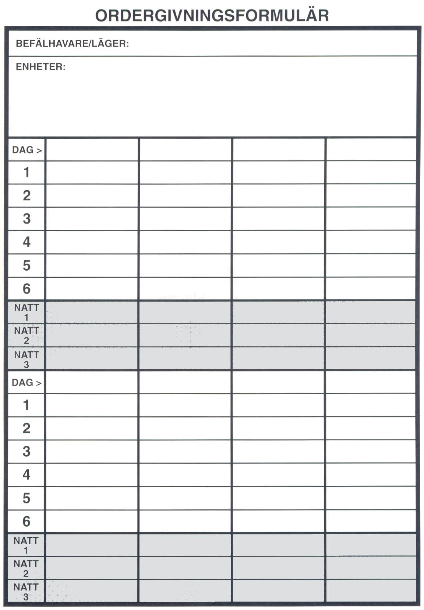

<title>Slaget om Clusta Noba - Den femte konfluxen</title>

# 15. Slaget om Clusta Noba

## Trakorierna

#### Namngivna personer

Amiral Tasseluka da Zafelasi (ledarvärde 4)
Praanz da Kaelve (ledarvärde 3)
Kyrias (ledarvärde 5; endast vid ”högsta prioritet”)

### Styrkor

Praanz da Kaelves styrkor kan variera beroende på Bodakens förtroende för honom. SL kan tilldela da Kaelve resurser beroende på tidigare spel, alternativt välja eller slumpa förutsättningarna. Om man väljer att slumpa förutsättningarna slå 1T20.

#### da Kaelve i onåd (1T20: 1-3)

Om da Kaelve fått sparken för att Bodaken tycker att han jagat hjärnspöken medan landet hamnat i krig, reser han på egen hand till Clusta Noba med sin privata karack (motsvarar stegosisk karack). Han är övertygad om riktigheten i sina misstankar om Shagul, konfluxen och äventyrarna. Eftersom ingen tror på honom fortsätter han undersökningen på egen hand för att återupprätta sin heder. Han har dock med sig en astrolog.

**Trupper totalt:** 250 man

#### Låg prioritet (1T20:4—8)

Bodaken tror att da Kaelve kanske är en komplott på spåren, men just nu kan man bara tänka på kriget och dess konsekvenser.

da Kaelve får för syns skull en galbalon och två kavareller till sitt förfogande. Han får dessutom en astrolog.

**Trupper totalt:** 800 man

#### Hög prioritet (1T20: 9-15)

Praanz da Kaelve har presenterat tunga bevis för en konspiration mot Trakoriens framtid där Ransarderna allierat sig med trollkarlen Shagul och hans lydhövdingar på barbaröarna norr om Palamux.

da Kaelve får två galbaloner och fem kavareller till sitt förfogande samt en förhörsspecialist, en krigsingenjör, en spion samt två astrologer.

**Trupper totalt:** 1.800 man

#### Högsta prioritet (1T20:16-20)

Bodaken har insett att Trakoriens öde snarare hänger på kampen mot Shagul och striden om den femte konfluxen än på kriget mot Ransard.

da Kaelve får fyra galbaloner och åtta kavareller. Dessutom en förhörsspecialist, en krigsingenjör, tre spioner samt två astrologer.

**Trupper totalt:** 3.200 man

#### Specialisterna

ASTROLOGERNA kan undersöka varsin hexruta per dag, enligt de regler som finns i äventyret (se rubriken ”Hur kan konkurrenterna lokalisera konfluxen” i kapitlet ”Äventyr på Clusta Noba”).

FÖRHÖRSSPECIALISTEN från säkerhetstjänstens borg i Fam Kvalvi har FV 20 i Förhöra och tillgång till en arsenal förfinade pinoinstrument.

KRIGSINGENJÖREN låter Trakorierna snabbt bygga belägringsmaskiner och reparera skepp dubbelt så snabbt som andra parter. Bra att ha i åtanke i rollspelsäventyret, men egentligen överflödig i det strategiska spelet.

SPIONER kan inte uppsnappas om de används som kurirer. Spioner som passerar fiendehexrutor kan avgöra exakt hur många trupper som finns i rutan och truppernas typ, samt vilket ledarvärde ledare har. Varje gång en spion går in i en fienderuta finns det 20% chans att han elimineras. Spioner kan dock inte tillfångatas och förhöras utan försvinner från spelet.

#### Mål och medel

Trakorierna vill besätta hela Clusta Noba och hålla ön tills efter den femte konfluxen. De håller sig till Trakorisk krigslag. De låter öns fasta befolkning vara ifred så länge de samarbetar eller åtminstone håller sig neutrala.

da Kaelve vill inte slösa sina krafter på ett blodigt krig mot ransarderna. Han behöver soldaterna för att besätta ön.

## Ransarderna

Ransarderna kommer som de är. Befälhavaren Trugdan Järnbuk agerar helt på egen hand och behöver inte stå till svars för sina metoder så länge han segrar.

#### Namngivna personer

Amiral Trugdan Järnbuk (ledarvärde 4)
Överste Grisban (ledarvärde 3)
Manzonla, tidigare krystalokrat av det heliga Kishatet

### Styrkor

* Tre karacker
* Fyra karaveller
* En spion
* En förhörsledare
* Tre hippogriffer

**Trupper totalt:** 1.470 man

Dessutom har ransarderna 50% chans att annektera varje piratskepp de möter på färden mot Clusta Noba till sin flotta.

Om ransarderna är allierade med Shagul dessutom:

* 1T4+2 Nekromantiker
* En del vapen förgiftade med svartblod vilket ökar tillfogad skada med 25% rundat neråt.

Ransardiska trupper kommer i 50% av fallen att överskrida sina befogenheter åt det svinaktigare hållet när de får tillfälle. Till exempel döda sina motståndare trots order om att ta fångar eller bränna ner en gård de fått order om att undersöka.

#### Specialisterna

FÖRHÖRSSPECIALISTEN: Se Trakorierna. Han har dock ”bara” FV 17.

ASTROLOGER: Ransarderna har en astrolog. Dessutom fuskar Manzonla i ämnet, men han förmår bara undersöka en hexruta varannan dag och ger inte lika precisa angivelser som de övriga astrologerna.

SPIONEN: Se Trakorierna.

HIPPOGRIFFERNA: Dessa flygande varelser används uteslutande för spaning från luften. De fungerar precis som spioner, men har annorlunda förflyttningsvärden.

#### Mål och medel

Ransarderna vill besätta hela Clusta Noba och hålla ön tills efter den femte konfluxen.

På Clusta Noba kräver de lydnad av den fasta befolkningen och neutralitet av Felikerna. Hyphererna och folket på Kyrias högre tacticum är fiender som snarast bör avrättas.

Ransarderna bryr sig inte om några lagar utan gör vad som passar och roar dem. Sådant som roar ransardiska soldater roar sällan någon annan. Därför blir de snart hjärtligt avskydda.

## Stegoserna

#### Namngivna personer

Naramsi av den östra klyftan (ledarvärde 3)

### Styrkor

* En galbalon
* Tre karacker
* En spion
* En god officer (ledarvärde 2)
* Eventuellt även Arn Dunkelbrink, ledarvärde 5)

**Trupper totalt:** 1.050 man

#### Specialister

ASTROLOGEN är ingen mindre än hovastrologen från Stegos. Han fungerar som vanligt.

SPIONEN fungerar som vanligt.

#### Mål och medel

Stegoserna lyder Arn Dunkelbrink. Naramsi av den östra klyftan är misstänksam mot Melealina och lyder därför inte hennes order om inte kungen finns på ön. Han skyddar (arresterar) henne dock till Arn Dunkelbrink kommer.

## Arn Dunkelbrink

#### Mål och medel

Arn Dunkelbrinks enda mål för närvarande är att finna kvinnan han älskar. Han känner sig lurad och är inte god till humöret.

## Crurerna

### Styrkor

**Trupper totalt:** 7.000 odöda + ev. förstärkning från Barbaröarna med två skepp per vecka (motsvarar piratskepp) från och med trettio dagar efter spelets början tills Marjura börjar röra sig.

```
Befälhavare           Ledarvärde
De fem generalerna    4
```

#### Unika regler

Cruriska trupper kan bara förstå orderna: HÅLL, ANFALL och AVANCERA. Crurerna opererar bara i grupper om femhundra. Crurerna tar automatiskt orden HÅLL om de är oledda. Crurerna försöker alltid erövra och besätta en hexruta innan de avancerar till nästa.

#### Effekt på trupper som förintas i krig

Hälften av vandöda eller odöda truppers förluster återuppstår efter 1T4 timmar. När mänskliga trupper förintas vaknar hälften av soldaterna efter 1T4 timmar som odöda trupper. Dessa trupper kommer instinktivt att försöka förena sig med närmaste Crurerstyrka.

#### Relationer till andra makter

Shagul vill vara ensam med sina odöda på Clusta Noba under den femte konfluxen. Alliansen med ransarderna är bara intressant som ett medel att hålla trakorier och stegoser borta. Shagul planerar att svika dem och massakrera dem med sina odöda härar när tidpunkten närmar sig. Kanske kan han hålla en stor bankett för sina ”eviga vänner från Ransard” med lämpliga tillsatser från Traxilmes violetta öknar blandat i vinet. Sådant har hänt förr. På så sätt blir han ju sina allierade trogen intill döden, deras död, eller kanske rent av bortom...

#### Mål och medel

Crurerna tar order av Ottar som i sin tur gör som Shagul säger. Detta innebär en viss tröghet i ordergivningen. Sedan bron är klar, får arméerna ordern att till varje pris och så snart som möjligt döda eller ta tillfånga alla levande på Clusta Noba.

## Lojalitet

På sidan 96 i Äventyrshäftet beskrivs hur olika grupper på Clusta Noba ställer sig till varandra.

## Skepp och sjöstrid

För eventuell sjöstrid kan reglerna från modulen Kopparhavets kapare användas med värden från tabellen på sidan 96 i Äventyrshäftet. Om andra regler används ger tabellen information om farkosternas relativa styrka och manöverförmåga.

För förflyttning med skepp används också systemet från Kopparhavets kapare. En hexruta i Slaget om Clusta Noba antas ha en diameter på 10 hexrutor i Kopparhavets kapare.

## Krigsspelet

Systemet som presenteras är en modifierad version av de fältslagsregler som finns i Krigarens handbok. Det är konstruerat speciellt för att spela de strider som kommer att äga rum på Clusta Noba under tiden före Den femte konfluxen. Det är meningen att varje sida skall styras av en oberoende spelare som inte deltar i rollspelsäventyret. Tänk på att de olika sidorna inte är där för att utplåna varandra, utan för att dominera Den femte konfluxen. Det innebär att de skall överleva cirka 50 dagar på Clusta Noba, varför de gör klokt i att, i varje fall inledningsvis, vara försiktiga och bevaka sina positioner snarare än att tillämpa något chansartat utplåningskrig.

Först måste de dessutom ta reda på var konfluxen kommer att äga rum — annars vet de ju inte vilken del av Clusta Noba de skall försöka försvara. Detta görs med hjälp av de astrologer som samtliga styrkor har tillgängliga och som kan undersöka den hexruta de befinner sig i (de olika sidornas astrologer undersöker hexrutorna olika snabbt).

I kort fungerar systemet så att varje spelare inför varje dag (eller längre fram i tiden) fyller i de order som han (överbefälhavaren) ger sina trupper. Dessa förs sedan fram till truppstyrkorna av kurirer, vilka dock inte alltid når sitt mål. Om något inträffar, exempelvis en sammandrabbning med fiende styrkor, skickas en kurir iväg för att meddela överbefälhavaren vad som hänt. Informationen är tyvärr inte alltid så tillförlitlig som man kanske skulle önska...

Slaget om Clusta Noba spelas i tvåtimmarsperioder som kallas *rundor*. Varje dag består av 6 rundor (06.00-18.00).

Självklart behöver du inte använda systemet som det presenteras här utan är fri att göra tillägg och avdrag. Till exempel är det troligt att spelarna (särskilt den som styr Crurerna) kommer att vilja agera också på natten. Det står dig fritt att bemöta sådana önskningar bäst du vill, men undvik att rubba balansen för då kan spelet lätt bli ointressant och förutsägbart.

Det rekommenderas att krigsspelet spelas någorlunda simultant med rollspelsäventyret — gärna t. o. m. i samma lokal med olika spelledare så att de båda spelledarna kan meddela sig med varandra.

> ***VIKTIGT!*** *Se till att ha noggrann koll på vilken dag det är och vilken tid på dagen. Detta görs lämpligtvis med någon slags tidstavla.*

## Ankomsten

Exakt när de olika arméerna anländer till Clusta Noba beror på väder, vind, och några andra faktorer (detta beskrivs i kapitlet *Mot Clusta Noba!*). Den dag som den första styrkan anländer kallas Dag 0. För att avgöra vilken runda under dagen som en styrka anländer slås 1T6.

Om någon av enheterna hamnar i strid vid landstigningen gäller särskilda regler, se avsnittet Strid.

För landstigning se regler i avsnittet Förflyttning.

> ***TIPS!*** *Under de första dagarna på ön bör du försöka hitta några strategiska punkter och slå läger där och sedan befästa dessa. Har man tillräckligt starka läger är man mycket svårbesegrad och det är under de inledande dagarna som man har möjlighet att befästa dem innan Clusta Noba börjar krylla av crurer och annat löst folk. Se även avsnittet ”Hur grupperar sig styrkorna på Clusta Noba?" i kapitlet "Mot Clusta Noba”.*

## Store Stenfar

När rollpersonerna lyckats lokalisera konfluxpunkten skall de bege sig dit för att plantera Store Stenfar och låta honom växa. Om någon enhet passerar genom rutan när Store Stenfar har planterats finns en viss chans att de upptäcker det (lika stor som att de lyckas tillfångataga en kurir) under den första veckan, sedan upptäcker de det automatiskt.

När Store Stenfar väl planterats kan man inte längre slå läger i den rutan.

Tänk på att rollpersonerna kan få problem med att plantera Store Stenfar om några redan slagit läger på platsen.

## Arméerna

I armélistorna anges hur stora truppstyrkor de olika sidorna i slaget om Clusta Noba har till sitt förfogande. Dessa är från början uppdelade i ”skeppslag”, en enhet från varje fartyg, och i denna formering beskrivs de på armélistorna. Ett skeppslag fungerar som en enskild enhet och representeras av en egen markör. Vänliga enheter på upp till 1.000 man (undantaget lägren där det som mest kan finnas 1.500 man) kan befinna sig i samma hexruta och flytta tillsammans. De kan dock inte strida tillsammans.

#### Trupptabell

```
Enhet        Antal man    Förflyttningsmodifikation
Pluton       10-50        +2
Kompani      51-150       +1
Bataljon     151-350      -
Regemente    351-500      -1
```

## Befälhavare

Vilka befälhavare (de ”namngivna personerna” ovan) som finns tillgängliga för de olika parterna, och deras ledarvärde, anges ovan. En enhet som leds av en befälhavare med 4 eller 5 i ledarvärde kallas superledd.

```
LV    Taktik
1        7
2        9
3       13
4       17
5       21
```

### Hjältepoäng

Varje befälhavare har ett antal hjältepoäng lika med hans ledarvärde. Dessa skall räcka under hela tiden (upp till 50-60 dygn!) som striderna på Clusta Noba kommer att utspela sig. Enda sättet att återfå hjältepoäng är att slå ett perfekt taktikslag, då återfås en hjältepoäng.

Hjältepoängen kan användas till en rad saker:

* **ÖKA TRUPPVÄRDET**. Om befälhavaren spenderar en HP ökar enheternas TV med 50% under en fältslagsrunda. Spenderas före taktikslaget (se Strid).
* **UNDVIKA HJÄLTEDÖD**. Befälhavaren kan genom att spendera en HP undvika att dö hjältedöden (se avsnittet Strid). Poängen får spenderas efter slaget.
* **ILMARSCH**. En befälhavare kan genom att spendera en HP få sina trupper att marschera i ett vansinnestempo. Deras förflyttning fördubblas under en runda.
* **HJÄLTEDÅD**. Då en spelare vill göra något enastående med sina styrkor och SL tycker det verkar rimligt.

> ***TIPS!*** *Tänk på att hjältepoängen skall räcka länge. Använd dem endast när det är helt avgörande.*

### Trupper

Vilka trupper varje styrka förfogar över anges i armélistorna. Deras värden är:

**SV (Stridsvärde)** — Multiplicera med antalet soldater i truppen för att få fram dess Truppvärde (TV).

**Moral** — I kritiska situationer måste man slå moralslag för truppen. Du skall slå lägre än eller lika med detta värde med 1T20.

**Handlingar** — Hur många handlingar truppen får utföra per runda.

**Förhöra** — Vilket förhörsvärde truppen har. Används när man fångar kurirer.

#### Soldattabell

```
Soldat          SV   Moral   Handlingar Förhöra  
Trakorier       2     13         7         8
Ransard*        2     14         6        12
Stegoser        2     18         6        10
Crurer          1,5    -         5         -
Elitsoldater    +1    +3        +1        ±0
```
＊ Förstärkningar från piratskepp och barbaröarna
räknas som ransarder.

### Läger- och befälhavarmarkörer

De markörer som befinner sig i ett läger läggs åt sidan, ovanpå ett papper med påskriften exempelvis ”Norra Bergslägret”. Endast lägermarkören ligger då på kartan, och en motståndare som tittar på kartan kan inte se vilka eller hur mycket trupper som finns i lägret.

Detsamma gäller för de trupper som befinner sig i samma ruta som en befälhavare.

För trupper som inte befinner sig i ett läger eller tillsammans med en befälhavare flyttas markörerna på kartan som vanligt.

## Spelets förlopp

Slaget om Clusta Noba utspelar sig under rundor om två timmar. Varje dag fortlöper i följande steg:

1 **ORDERGIVNING**. Spelarna ger sina trupper nya order och skickar iväg kurirer med dessa. Orderna förs in på ordergivningsbladet som lämnas till SL.

2 **FÖRFLYTTNING**. SL flyttar de olika enheterna i enlighet med deras order och kontrollerar om de kommer i kontakt med några fientliga enheter.

3 **STRID**. Om några enheter möts är det möjligt att strid uppstår. Se avsnittet Strid.

4 **INFORMATION/BOKFÖRING**. I den mån kurirerna hinner nå sina spelare överlämnas den information de här med sig. Spelarna bokför eventuella förändringar i sina trupper. SL antecknar de exakta värdena i sina papper.

5 **NATTVILA**. Under natten kommer kurirer att nå fram med mer exakt information än tidigare om den egna positionen och de egna förlusterna. Observera att det även på natten är fullt möjligt att tillfångataga kurirer.

## Ordergivning

Spelets ryggrad är ordergivningsformuläret. Varje spelare skall ha ett sådant formulär för varje läger och befälhavare (=för varje markör på spelplanen). Varje formulär omfattar upp till åtta dygn, och du får själv skriva i dagarnas nummer.

> **TIPS:** *SL bör ha ett papper där han kan skriva i de händelser som inträffar långt in i framtiden, det kan vara ända upp till 60 dygn framåt!*

På orderformuläret nedtecknas de order som *överbefälhavaren* ger till sina styrkor, vilka kan gälla för i princip hur lång tid som helst framåt. På formuläret ifylles i detalj, runda för runda, vad överbefälhavaren vill att enheten skall göra. Ordern skickas sedan till enheten med en kurir (se avsnittet Att sända och mottaga kurirer).

#### Vem kan ta emot en order?

Orderna måste ges till antingen ett läger eller till en annan befälhavare. De utgår alltid från den ruta där överbefälhavaren befinner sig. Finns det fler än en enhet i ett läger kan skilda order ges till de olika enheterna, men samma ordergivningsformulär används fortfarande för lägrets alla enheter (dela i så fall upp kolumnen "dag” i nya kolumner; en för varje enhet i lägret).

En enskild markör som inte befinner sig i vare sig ett läger eller med en befälhavare kan bara få en enda order — ”Gå till närmsta läger” (fågelvägen). Vill man att den skall göra något annan måste en befälhavare gå till en angränsande ruta först.

#### Utan order?

Om en enhets order upphör att gälla slutar enheten att fungera och gör inget annat än att försvara sig till en ny order anländer (en enhet utan order skickar alltid automatiskt en kurir till överbefälhavaren).

Befälhavare (andra än överbefälhavaren) kan dock agera på eget bevåg. Spelaren skriver ned de tre order han helst vill att enheten skall utföra och rangordnar dem. Sedan slås 1T6 och till resultatet läggs befälhavarens ledarvärde. Blir resultatet 7 eller högre utförs Order #1, 6—4 utförs Order #2, och blir resultatet 3 eller lägre utförs Order #3. Observera att orderna måste vara av vitt skild karaktär — det går alltså inte att göra tre order snarlika, exempelvis ”ANFALL läger A”, "GÅ TILL läger A”, ”GÅ TILL rutan omedelbart söder om läger A”.

Överbefälhavaren undantas frän dessa regler — han agerar alltid som spelaren vill, eftersom spelaren spelar honom.

> ***TIPS!*** *Ge alltid order för en längre tid, i alla fall fyra-fem dagar, då det är lätt att enheten blir avskuren från huvudstyrkan. Om den har order fortsätter ju enheten att utföra dessa, annars slutar den att agera och gör ingen direkt nytta.*

### Orderbeskrivning

Följande order kan ges till ett läger eller en befälhavare. Ordern gäller för samtliga enheter som finns i samma ruta som befälhavaren/lägret.

**Håll:** Enheten ska till varje pris hålla sin position. Moralslag behöver göras först när man förlorat 50% av manskapet.

**Avvakta:** Enheten står stilla i en ruta men flyttar sig en ruta mot närmsta läger om den blir anfallen av en trupp som är större (är den mindre eller lika stor står den kvar och slåss; den fortsätter slåss så länge den är större, annars retirerar den automatiskt).

**Anfall (ange vilken ruta):** Enheten ska gå till angiven hexruta och där anfalla allt motstånd. (Den anfaller inte motstånd som är två snäpp större; i så fall stannar den i rutan innan, skickar kurir och Avvaktar.)

**Gå till (ange vart):** Enheten ska röra sig till en angiven hexruta. Om den springer in i fientliga trupper på vägen kommer enheten att stanna och skicka en kurir till ÖB för att få vidare instruktioner.

**Avancera till (ange vart):** Som ”Gå till...”, fast enheten kommer automatiskt att anfalla fienden om den inte är två snäpp större; i så fall agerar den enligt ”Gå till... ”.

**Gå snarast till (ange vart):** Som ”Gå till...”, fast enheten kommer automatiskt att försöka gå runt fienden den snabbaste vägen. Den avviker så mycket som behövs.

**Slå läger (ange var):** Enheten slår läger i en angiven hexruta. Ordern tar 6 rundor att utföra. När ordern är utförd placeras en lägermarkör i rutan. För att ordern skall kunna utföras krävs att en befälhavare är på plats.

**Befäst:** Ordern kan bara ges till EN enhet om minst 250 man och som befinner sig i ett läger. Om lägret angrips har det en TV-multipel beroende på hur länge ordern har utförts.

```
Antal dagar    TV-multipel
    1-2            x2
    3-5            x2,5
    6-9            x3
    10+            x4
```

**Fånga kurirer:** Enheten kan tillfångataga kurirer i om givande rutor, men får då något sämre försvar efter som delar av enheten (25%) är ute och letar efter kurirer.

**Em-/debarkera:** Enheten ska gå ombord på eller stiga iland från ett fartyg. En enhet per runda och hexruta kan landstiga eller gå ombord. Om enheterna kommer från olika sidor av rutan kan de landstiga i samma hexruta.

**Bakhåll (ange var):** En enhet som får denna order arrangerar ett antal bakhåll i rutan. Om en fientlig enhet kommer in i rutan, får den enhet som ligger i bakhåll en ”fri fältslagsrunda” då de får anfalla med 25% av sitt TV (fiendens TV räknas som noll), och de automatiskt räknas som ”vinnare” av Taktikslaget. Därefter kan de som ligger i bakhåll välja mellan att dra sig ur eller fortsätta strida som vanligt (i så fall endast med 25% av TV!).

**Patrull:** En enhet kan under en dags tid (6 rundor) patrullera alla hexrutor inom två hexrutors radie från rutan där den befinner sig. Om det under dagen kommer in en numerärt mindre fientlig styrka i området anfalls denna automatiskt. En styrka som patrullerar får automatiskt -5 på Taktikslaget i den första fältslagsrundan.

**Spana:** Enheten ska dölja sig och spana och skicka kurirer om fiende observeras. Enheten spanar alla omgivande hexrutor inom en rutas radie för varje runda som spenderas med att spana och kan ge information om eventuella fientliga styrkor. Spaning måste alltid avbrytas vid mörkrets inbrott och kan alltså aldrig utföras mer än 6 rundor i rad. En spejare kan tillfångatagas på samma sätt som kurirer.

**Spå:** Ordern ges till en enhet i vilken det ingår en astrolog. Se i övrigt rubriken ”Hur kan konkurrenterna hitta konfluxen” i kapitlet ”Äventyr på Clusta Noba” i äventyret. Enheten får inte göra någonting annat. Denna order kan ges till endast astrologen, men han kan då tas tillfånga på samma vis som en kurir.

## Förflyttning

Här förklaras vissa specialregler för förflyttning och i tabellen anges kostnaden för att flytta in i hexrutor med olika terräng. Kostnaden i tabellen är angiven i förflyttningspoäng. Om en enhet rör sig upp eller ner ska den angivna siffran adderas till tidskostnaden för den vanliga terrängen.

Eventuella outnyttjade förflyttningspoäng kan inte sparas. Om en förflyttning kostar mer än enhetens kvarvarande förflyttningspoäng kan förflyttningen delas upp och fullföljas nästa runda.

Ordern ”Em-/debarkera” innebär att enheterna landstiger/lastar på en specifik hexruta på kartan. Ett fartyg lastar/landstiger ett skeppslag per hexruta och runda. Vanliga soldater och bågskyttar kan landstiga på låga hexrutor. Elitsoldater kan landstiga i hexrutor på 50 meters höjd.

Orderna ”Gå till...”, ”Avancera...” och "Gå snarast till...” innebär att enheterna förflyttar sig på kartan enligt en given rutt eller närmaste vägen om ingen rutt angivits.

### Formationer

En enhet kan antingen ha marschformation eller stridsformation. En enhet som rör sig i stridsformation har alla förflyttningskostnader fördubblade, men är å andra sidan väl förberedd för strid vid eventuell konfrontation med fientliga enheter.

* En enhet som har ordern ”Avancera till... ” går automatiskt i stridsformation.
* En enhet som har ordern ”Gå snarast till...” går automatiskt i marschformation.
* En enhet som har ordern ”Gå till...” förflyttar sig i marschformation, men byter till stridsformation (och stannar) om de stöter på en fiende.

```
Formation

Terräng           Marsch       Strid     Kurir     Hippogriff
Öppet               1            2        1/2         1/3
Väg (som följs)    1/2           —        1/2          —
Byggnader           1            2        1/2         1/3
Tallskog            2            4         1          1/3
Vitskog             3            6        1,5         1/3
+1 nivå            +1           +2        +1         +1/3
-1 nivå           +1/2          +1       +1/2          —
+2 nivåer          +4       ej tillåtet   +3          +1
-2 nivåer          +2       ej tillåtet   +2         +1/3
+3 nivåer      ej tillåtet  ej tillåtet   +7          +2
-3 nivåer      ej tillåtet  ej tillåtet   +5         +2/3
```
— = terrängen påverkar inte eller formationen kan inte dra nytta av terrängen. Om en enhet följer en väg påverkas den inte av terrängen vid sidan av.

> ***TIPS!*** *Var noga med att ange en så utförlig rutt som möjligt om du tror att vägen blockeras av fientliga styrkor som måste kringgås eller liknande.*

### Nattmarsch

Även om varje dag bara består av sex rundor går det att förflytta sig nattetid. All förflyttning kostar då dubbelt så mycket som dagtid — detta simuleras av att natten mellan två dagar består av tre stycken rundor.

Den största nackdelen med att marschera på natten är att trupperna blir utmattade. För varje ”nattrunda” som en trupp genomför förlorar den 1 handling under hela nästföljande dag. Marscherar man hela natten (3 rundor) har man alltså tre handlingar mindre under hela nästföljande dag.

DESSUTOM sänks TV för en utmattad trupp — 25% för varje nattrunda den agerar (alltså -75% om den marscherar hela natten). Denna effekt gäller ända tills truppen får vila tolv timmar.

Man kan inte göra något annat på natten än att förflytta trupper, utom att skicka kurirer (kurirer blir inte utmattade, dock).

## Strid

När en enhet har order att gå in i en ruta där det finns en ”fientlig” enhet uppstår oftast strid. Detta kan undvikas om:

* ”Anfallaren” har ordern ”Gå till...” (då stannar den och skickar kurir) eller
* ”Anfallaren” har ordern ”Gå snarast till...” (då går den runt) eller
* ”Försvararen” väljer att släppa förbi ”Anfallaren” eller
* ”Försvararen” har ordern ”Avvakta”.

När stridens utgång skall avgöras spelar ett antal faktorer in. Striden avgörs på gränsen mellan två (eller flera) hexrutor. Modifikationen för den ofördelaktigaste av de två terrängerna används.

Fältslagen spelas under trettiominutersrundor, vilket gör att det går fyra fältslagsrundor på en vanlig runda.

### Stridens förlopp

**1-Samla styrkorna.** De trupper som misslyckades med sitt moralslag förra rundan får göra ett nytt försök. Lyckas det samlar de sig och kan agera normalt igen nästa runda.

**2-Taktikslag.** Båda sidornas ledare slår ett Taktikslag. Den som får högst differensvärde kallas hädanefter Vinnare och den andre Förlorare. Blir det oavgjort slås slaget om. En enhet utan Befälhavare förlorar automatiskt Taktikslaget, utom vid fummel från motståndarnas ledare eller befälhavare. Om enheten inte har någon befälhavare räknas ledarens Taktik-FV alltid som 7. Om en enhet har två eller fler befälhavare (vilket är mycket ovanligt) får spelaren själv avgöra vem av dem som skall göra Taktikslaget. Ett perfekt slag ökar differensvärdet med 10.

**3-Strid.** Beräkna skillnaden i TV och differensvärde mellan vinnaren och förloraren. Utläs resultatet i Stridstabellen (siffrorna anger vinnarens och förlorarens procentuella förluster i TV). Gör avdrag från bägge truppernas TV och räkna ut nytt TV att använda i nästa runda. Om någon av enheterna har marschformation gör det att hans styrkor tar 1,5 gånger så stora förluster första rundan och motståndaren tar 0,5 gånger så stora förluster, sedan byter enheten automatiskt till stridsformation. Om mer än ett slags soldater ingår i styrkan fördelas förlusten jämnt mellan dessa.

**4-Moralslag.** Om någon av truppernas TV sjunkit till mindre än 75% av det ursprungliga Truppvärdet måste ett moralslag göras.

#### Stridstabell

```
Vinnarens TV
jämfört med      Skillnad i differensvärde
förlorarens      1-10     11-20     20+
-1100+           50/10    45/10    40/15
-900-(-1099)     45/10    40/15    35/15
-750-(-899)      40/15    35/15    30/20
-600-(-749)      35/15    30/20    25/20
-450-(-599)      30/20    25/20    25/25
-350-(-449)      25/20    25/25    20/25
-250-(-349)      25/25    20/25    20/30
-200-(-249)      20/25    20/30    15/30
-150-(-199)      20/30    15/30    15/35
-100-(-149)      15/30    15/35    15/40
-50-(-99)        15/35    15/35    15/40
-49-49           15/35    15/40    10/40
50-99            15/40    15/40    10/45
100-149          15/40    10/40    10/50
150-199          10/40    10/45    10/60*
200-249          10/45    10/50     5/65*
250-349          10/50    10/60*    5/70*
350-449          10/60*    5/65*    5/80*
450-599           5/65*    5/70*    0/90*
600-749           5/70*    5/80*    0/100
750-899           5/80*    0/90*    0/100†
900-1099          0/90*    0/100    0/100†
1100+             0/100†   0/100†   0/100†
```
15/35 = Vinnaren förlorar temporärt 15% och Förloraren förlorar temporärt 35% av sitt TV (se ”Förluster” nedan).

10/40= Vinnaren förlorar temporärt 10% av sitt TV och Förloraren förlorar permanent 40% av sitt TV.

＊ = Förloraren retirerar automatiskt.

† = Hela Förlorarens enhet dödas permanent.

**Kommentarer till tabellen:** En enhet räknas som ett ’steg’ större (flytta en rad uppåt eller nedåt) om den har höjdöverläge eller befinner sig i bebyggelse när attacken inleds eller är superledd.

### Moralslag

Varje trupp har ett moralvärde (se soldattabellen). När truppen förlorat 25% av sitt ursprungliga TV måste den göra ett moralslag med 1T20 för att inte tvingas till reträtt. Om truppen förlorat med än 75% av sitt ursprungliga TV flyr den automatiskt i panik. Om truppen består av fler än en typ av soldater slås enskilda slag för de olika typerna av soldater. En trupp som misslyckats med sitt moralslag får nästa runda en chans att samla sig. Den rundan betraktas deras SV som 1 lägre än normalt. Om alla trupper i en enhet misslyckas med sitt moralslag samma runda retirerar styrkan i panik.

```
Situation                      Modifikation av moralslaget
Förlorat 50% av TV             -3 (Gäller ej enheter med ordern HÅLL)
Anfall från crurer             -2
Den egna härföraren stupat     -2
Motståndarna ett snäpp större  -2
```

### Hjältedöd

Det finns alltid en viss risk att endera sidans ledare stupar under bataljens gång. Chansen för detta är [förlustprocenten/10]%. Om det inte finns några ytterligare Befälhavare i styrkan räknas den som oledd.

### Reträtt

En enhet som får resultatet Automatisk reträtt eller som misslyckas med sitt moralslag eller kommenderas till reträtt retirerar. Den rör sig alltid en ruta (terrängen spelar ingen roll) mot närmaste (fågelvägen) vänligt sinnade läger och avbryter alla order.

En trupp kan förfölja en retirerande trupp om den har en befälhavare, och de flyttar då in i den ruta där de retirerande tidigare stod. De får +5 på sitt nästa Taktikslag och resultatet läses från en rad fördelaktigare än normalt.

Om det finns flera enheter i en hexruta och bara en av dem retirerar kan de övriga frivilligt följa efter, förutsatt att det finns en befälhavare i rutan. I så fall fungerar samtliga enheter precis som vanligt.

Den segrande enheten kan välja att flytta in i den besegrade enhetens hexruta och sedan avbryta striden.

### Automatisk reträtt

En enhet flyr automatiskt om den hamnar i strid med en enhet som är två ”snäpp” större. Pluton flyr för bataljon och regemente, kompani flyr för regemente.

### Förluster

När truppvärdet i en trupp sjunker delar du det nya truppvärdet med soldaternas SV och får fram det nya antalet soldater i truppen. Om fler än en typ av soldater ingår i enheten fördelas förlusterna jämnt mellan dem.

Av de förluster som görs är 20% verkliga förluster (soldaterna är döda), 20% är svårt skadade och återhämtar sig inom två veckor, 20% är skadade och återhämtar sig inom en vecka och 40% återvänder oskadda till närmaste läger samma kväll.

> **TIPS!** *Om du vill förenkla spelet kan du låta 40% av soldaterna återvända samma kväll och övriga (60%) vara döda.*

### Strider med fler än två deltagare

Troligtvis kommer det att uppstå situationer där fler än två spelare drabbar samman. En spelare som fastnar i en flerfrontssituation får meddela SL hur han vill fördela sina trupper mellan de olika fronterna.

### Landstigning

En trupp som attackerar en annan eller som blir attackerad då den håller på att landstiga har halverat truppvärde under stridens fyra första rundor (inte vanliga rundor utan fältslagsrundor).

### Slumpmässiga händelser

Om rollpersonerna deltar i fältslag kan du använda de regler för slumpmässiga händelser som finns i Krigarens Handbok.

### Belägring och befästningar

Vid belägring av befästa områden används reglerna i Krigarens Handbok.

### Detaljerade Fältslag

Om du vill ha mer detaljerade regler kan du välja att använda något av de spel för figurstrider som finns på marknaden i dag, exempelvis *Fantasy Warriors*.

## Att få information

Under varje dag kommer det att vid ett flertal tillfällen skickas iväg kurirer med information om vad som har inträffat. Den information som kurirer kan ha är information om fiendens storlek och fiendens och egna förluster. Informationen är dock sällan helt korrekt. Hur felaktig den är avgörs med hjälp av nedanstående tabell.

#### Tabell för storlek och förluster

```
1T20  Information
1            -60%
2-3          -40%
4-5          -25%
6-8          -10%
9-11           ±0
12-14        +10%
15-17        +25%
18-19        +40%
20           +60%
```

Ett omodifierat slag av ’10’ ger alltid korrekt information. Resultatet skall modifieras med ett snäpp om fienden konfronterats i skog eller bebyggelse och om enheten är oledd. Är enheten superledd skall slaget också modifieras med ett snäpp, åt det hållet där den mer korrekta informationen står att finna. Är enheten en hippogriff skall slaget modifieras med två snäpp.

## Kurirers sändande och mottagande

Under spelets gäng kommer ett otal kurirer att skickas till de olika spelarna. T.ex. ger varje strid en kurir till varje (inblandad) spelare.

När en kurir ska skickas räknar SL ut hur lång tid deltar att flytta kuriren den närmaste vägen. Kurirer har en egen kolumn i förflyttningstabellen på sidan 7. När den kommer fram ges ordern automatiskt och omedelbart.

Kurirer försöker passera igenom enheter om det inte finns någon väg runt, men normalt går de runt fiender.

#### Risk för upptäckt

Kuriren kan bli tillfångatagen. En enhet kan tillfångata kurirer i dess hexruta och alla hexrutor runt den. Räkna ut procentchansen i tabellen nedan och slå 1T100 för varje enhet som kan försöka ta kuriren tillfånga.

En tillfångatagen kurir kan avtvingas den information han var på väg med till huvudstyrkan och information om huvudstyrkans läge. Detta sker om det finns en tillgänglig förhörsledare som lyckas med ert slag för Förhöra. Om inte någon förhörsledare finns tillgänglig används soldaternas FV. Ett slag per runda får göras. Ett differensvärde på -10 eller fummel innebär att kuriren avlider. (Ransarder är ett undantag på den här punkten. Tack vare deras brutala förhörsmetoder dör kuriren oavsett om de misslyckas eller inte.)

## Att passera obemärkt

Om rollpersonerna passerar en hexruta där det finns trupper eller en hexruta som angränsar till en hexruta där det finns trupper finns en viss risk för att de stöter ihop med en patrull. Om slaget blir lägre än hälften av procentvärdet som anges i tabellen nedan har rollpersonerna stött ihop med huvudstyrkan. Det faktum att rollpersonerna stöter ihop med en patrull behöver inte nödvändigtvis betyda att de blir upptäckta, det är upp till dig som SL att avgöra. Det är lättare för rollpersonerna att gömma sig i en skogsruta än i en öppen hexruta.

#### Risk för konfrontation

```
Truppstorlek    Samma hexruta    Angränsande    Patrull  
Pluton               15%              0%        1T3 soldater
Kompani              30%             10%          1 officer
                                                1T6 soldater
Bataljon             55%             20%          1 officer
                                              1T4+2 soldater
Regemente            85%             30%          1 officer
                                             1T10+1 soldater
```

## Spelexempel

Det är dag 6 och alla parter har redan anlänt till Clusta Noba, men kung Ottars stenbro är ännu inte färdig varför Crurerna ännu inte blandat sig i striderna.

Ransardernas spelare har för dagen utfärdat order om att Vortigi hedersskvadron (enhet 6) och Tupwiths vargar (7) skall bege sig från läger två, beläget på Clusta Nobas södra udde, under befäl av överste Grisban för att anfalla trakorierna som slagit läger på mellersta delen av ön.

Trakoriernas spelare har gett Bralorgi fälthundar (2) order om att patrullera kring läger ett (det som ransarderna planerar att anfalla), men tar det i övrigt lugnt och befäster under Praanz da Kaelves överseende med de övriga enheter som finns i lägret.

#### Kurirtabell — Risk för upptäckt av fientliga enheter

```
Enheter i     Öppen     Tallskog     Vitskog    By    Väg     Egen     Fånga
hexrutan     terräng                                         hexruta   kurir
Plut & komp    10%          5%          0%      10%   +10%     +5%     +20%
Bat & reg      15%         10%          5%      20%   +15%    +10%     +30%
```

Väg = Adderas om kuriren följer väg genom rutan.

Egen hexruta = Adderas om kuriren passerar igenom enhetens egen hexruta.

Fånga kurir = Adderas om enheten har ordern ”Fånga kurirer”.

Stegoserna är på väg mot ransardernas läger med Mea plakoles livgarde (1) med den Gode officeren som befälhavare och med spionen i följe.

SL tar in dagens order och börjar flytta enheterna på sin karta. Han ser att det kommer att bli strid när de ransardiska styrkorna under runda 2 i marschformation oförsiktigt närmar sig det trakoriska lägret och stöter ihop med Mareveldas systrar som är på patrull.

Striden börjar omedelbart. Grisbans taktikslag blir '10', ett differensvärde på 7, trakoriernas ledare slår ’15’, vilket modifieras med -5 (för att de patrullerar). Differensvärdet blir alltså -3, och skillnaden blir 11 (8—(—3 )). Trakorierna är dock betydligt starkare, 1200 jämfört med 720, en skillnad på hela 480 i TV. Resultatet av striden läses av i tabellen: 30/20, men eftersom ransarderna hade marschformation blir resultatet istället 45/ 10, vilket innebär att de förlorar 324 poäng i TV (720 x 0,45=324), alltså 162 mans förluster för ransarderna (324/2). Trakorierna förlorar bara 60 man (1200 x 0,10=120 poäng i TV; vilket motsvarar 60 soldater). SL slår dolt för att se om Grisban dödas, det är en procents chans eftersom trakorierna tog 10%-iga förluster. Han slå ’06’ och klarar sig alltså.

Grisban har fått betala ett dyrt pris för sin oförsiktighet och väljer att göra en samlad reträtt då ingen av enheterna misslyckas med sitt moralslag (de slog ’5’ respektive ’8’). Eftersom Mareveldas systrar inte har någon befälhavare kan de inte följa efter de retirerande ransarderna vilka börjar dra sig tillbaka mot sitt läger med svansen mellan benen.

Under tiden som förflutit har stegoserna nästan nått fram till ransardernas läger, de lyckades smita förbi utan att bli upptäckta när ransarderna slogs med trakorierna. När de börjar närma sig lägret lösgör sig spionen från den övriga enheten och tar sig in i lägret (SL slår dolt en procenttärning, ’68’, spionen klarar sig och återvänder runda 5 till enheten med en fullständig rapport om vilka styrkor som finns i lägret).

När stegoserna står och väntar på sin spion återvänder Grisban och hans styrkor under runda 4, som vanligt i marschformation och överraskar Mea plakoles livgarde, vilka dock förnuftigt nog befinner sig i stridsformation (man vet ju aldrig när det dyker upp några patrullerande ransarder!). Då ingen av styrkorna var förberedda på strid hinner dock ransarderna byta formation till stridsformation eftersom de är superledda (Grisban har LV4).

Stegosernas ledare slår sitt taktikslag, ’12’ vilket ger ett differensvärde på -3, Grisban slår '1' och sedan ’2', perfekt, vilket ger (16+10 för perfekt=) 26 i differensvärde och ett hjältepoäng. Ransardernas truppvärde har nu sjunkit till 396 och stegoserna har 750, en skillnad på 354. I tabellen avläses resultatet som blir 20/25. Ransarderna förlorar (396x0,2080=) 40 man och stegoserna (750x0,25188) 32 elitsoldater och 47 standardsoldater. Både ransardernas och Stegosernas ledare överlever. Stegoserna måste slå ett moralslag vilket de lyckas med (’18’, respektive ’14’).

Andra fältslagsrundan slår Stegosernas officer ’9’, han lyckas precis, och Grisban slår ’5’ vilket ger 12. Grisban väljer att spendera den hjältepoäng han fick förra rundan för att höja truppvärdet tillfälligt till (316x1,5=) 474. Stegoserna har 562, en skillnad på 88. Resultatet blir 15/35. En förlust av (316x0,1548=) 24 man för ransarderna och (562x0,35196) 33 elitsoldater och 49 standardsoldater för stegoserna. Bägge sidornas befälhavare överlever rundan, och samtliga enheter lyckas med sina moralslag. Stegoserna inser att de inte har någon större chans att klara sig mot Grisbans överlägset ledda styrkor och väljer att retirera. Grisban följer inte efter, trots att han skulle kunna ha gjort det utan väljer istället att återvända till lägret och vila för natten.

Stegosernas spion undviker Grisbans styrkor och lyckas snart (den förflyttar sig med samma hastighet som en kurir) hinna ifatt Mea plakoles livgarde, vilka dock själva inte hinner tillbaka till lägret utan tvingas att tillbringa natten ute i det fria på öns västra sida.

Framåt kvällningen återvänder de av soldaterna som inte dödats till sina läger.

## Arméformulär

### Trakoriska armén

```
Skeppslag  Namn                         Antal man       TV   Nuvarande Moral  Nuvarande Förfl. Övrigt
    1      Norra Tricilves stadshird    400 elit       1200        16                    7
    2      Bralorgi fälthundar          400 elit       1200        16                    7
    3      Hjältarna av Hiltre          400 elit       1200        16                    7
    4      Moherri musteloner           400 elit       1200        16                    7
    5      Kamesti träsködlor           200 standard    400        13                    7
    6      Kustalerna av Karnald        200 standard    400        13                    7
    7      Digetens stålklo             200 standard    400        13                    7
    8      De hesapiska björnarna       200 standard    400        13                    7
    9      Gommankerna av Ruhl          200 standard    400        13                    7
   10      Marduci dragoner             200 standard    400        13                    7
   11      Radassabars rävar            200 standard    400        13                    7
   12      Råttorna från Grumm          200 standard    400        13                    7
```

### Ransardiska armén

```
Skeppslag  Namn                         Antal man       TV   Nuvarande Moral  Nuvarande Förfl. Övrigt
    1      Thôrms söner                 100 elit        300        17                    7
                                        150 standard    300        14                    6
    2      Cormvaki garde               100 elit        300        17                    7
                                        150 standard    300        14                    6
    3      ap Griffwuth                 100 elit        300        17                    7
                                        150 standard    300        14                    6
    4      Griparna ap Saexby           180 standard    360        14                    6
    5      Wullfurs blodsbröder         180 standard    360        14                    6
    6      Vortigi hedersskvadron       180 standard    360        14                    6
    7      Tupwiths vargar              180 standard    360        14                    6
```

### Stegosiska armén

```
Skeppslag  Namn                         Antal man       TV   Nuvarande Moral  Nuvarande Förfl. Övrigt
    1      Mea plakoles livgarde        150 elit        450        21                    7
                                        150 standard    300        18                    6
    2      Skuggbataljonen              250 standard    500        18                    6
    3      Soluppgångens bröder         250 standard    500        18                    6
    4      De heliga namnens väktare    250 standard    500        18                    6
```

### Cruriska armén

```
Enhet*     Namn                         Antal man       TV   Nuvarande Moral  Nuvarande Förfl. Övrigt
    1                                   500             750         -                    6
    2                                   500             750         -                    6
    3                                   500             750         -                    6
    4                                   500             750         -                    6
    5                                   500             750         -                    6
    6                                   500             750         -                    6
    7                                   500             750         -                    6
    8                                   500             750         -                    6
    9                                   500             750         -                    6
   10                                   500             750         -                    6
   11                                   500             750         -                    6
   12                                   500             750         -                    6
   13                                   500             750         -                    6
   14                                   500             750         -                    6
   15
   16
   17
   18
```

＊ Då den Cruriska armén ständigt växer är det svårt att avgöra hur den till slut kommer att se ut. De värden som anges på arméformuläret är de inledande.

## Ordergivningsformulär


