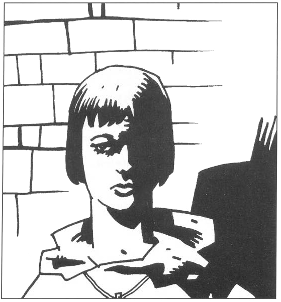
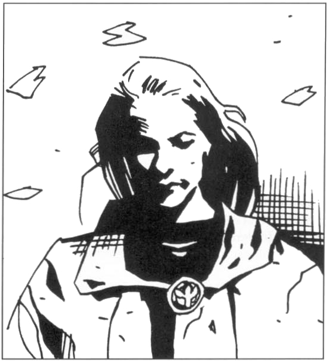
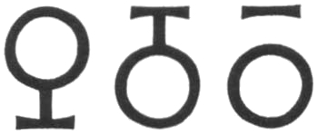

<title>Personer och varelser - Den femte konfluxen</title>

# 16. Personer och varelser

## Alvskeppet Bladverk

Melealina är sedan hundratals år en helig kvinna för gråalverna. På hennes maning lämnade alvskeppet *Bladverk* havsfolkets kolonier långt ute till havs och satte kurs mot Trakorien med sin edssvurna besättning ombord. Då farkosten seglade i farvattnen väster om Palamux teleporterade sig Melealina dit för att möta rollpersonerna och Store Stenfar som återvände från Bythos i äventyret *Kristalltjuren*. Nu seglar *Bladverk* mot staden Isakra på Trinsmyra för att sedan fortsätta mot slutstriden på Marjura och Clusta Noba.

*Bladverk* är ett levande träd som av alverna formats till ett segelskepp. Över trädet reser sig två stora, bakåtlutade master som med sina känsliga lövmattor och spindelsegel alltid fångar vinden på bästa sätt. Farkosten kan även röra sig mot vinden genom att paddla med speciellt utformade grenar längs sidorna och piska med rötterna på undersidan. Den tjocka stammen är grovt skrovformad och ihålig så att besättningen kan ta skydd undan vädret. Fören är klädd med pansarkorall och har en kraftig ramm strax under ytan.

*Bladverk* har på undersidan ett stort antal rötter som suger näring direkt ur havet. Rötterna rör sig ständigt och hjälper till att driva farkosten framåt.

Fartyget kan bara användas och skötas rätt av gråalver. Utan deras vård slutar den levande båten fungera och dör inom tre veckor.

Eld och ointelligenta djur (familiares undantagna) får av religiösa skäl inte förekomma ombord. Överhuvud taget är livet ombord präglat av religiösa regler, särskild föda etc.

När *Bladverk* fraktat sällskapet till Clusta Noba kommer skeppet på Melealinas uppmaning att återvända till Trakorien för att skydda konfluxpunkten där. Äventyrarna kan välja att behålla upp till tio alvkrigare som förstärkning på Clusta Noba om de vill. Om nya rollpersoner ska introduceras i spelet kan de med fördel hämtas från besättningen vars lojalitet är hundraprocentig.

### Speciella egenskaper

#### U-läge

*Bladverk* kan på en halvtimme försvinna helt under ytan men högst till tjugo meters djup genom att kristallisera mineraler ur havsvattnet på rötterna och på så sätt öka sin tyngd. Fartyget kan snabbt komma i ytläge genom att stöta bort kristallerna. Trädet kan stanna i undervattensläge högst sex timmar i sträck och måste sedan hålla sig på ytan under minst ett dygn. Farten dämpas i U-läge till en fjärdedel. Skeppet kan inte anfalla underifrån, men naturligtvis omärkligt föra raugoner (som ofta överraskar skepp på just detta sätt), gråalver och andra passagerare till fientliga fartyg eller kustnära mål. Under vattnet fungerar *Bladverk* som en dykarklocka med luftfickor inne i skrovet. Syret i dessa fickor förbrukas inte på sex timmar. Man måste simma eller klättra för att ta sig in i eller ut ur det sjunkna skeppet.

#### Dimma

*Bladverk* kan med Aldruns sång frisätta dimma ur havet så att skeppet blir helt dolt. Dimman är inte magisk och rör sig inte med farkosten. Den kan bara alstras i stiltje eller svag bris eftersom vinden annars för bort slöjorna snabbare än de bildas. Dimmolnet växer med en radie av 20 meter per minut upp till en maximal radie av 500 meter.

Dimman kan användas för att dölja en landstigning eller en flykt i U-läge.

### Seglerskan Aldrun

Befälhavare på *Bladverk* är gråalvkvinnan Aldrun, som med sin sång manövrerar skeppet. Aldrun är liten och spindeltunn men de grågröna ögonen utstrålar havets kraft och djup. Hennes röst kan vara starkare än stormen och känsligare än ett sovande barns andhämtning. Efter ett tag på *Bladverk* smälter den in i omgivningen som en behaglig kuliss som ersätter två timmar vila per dygn.

**Yrke:** Animist

**Färdigheter:** Sjökunnighet 22, Ledarvärde 3, Animism 24, alla animistiska besvärjelser i Grundreglerna S1T10+10, ÅKALLA STORM S12, Luftmagi 12, alla luftmagiska besvärjelser S1T10+6.

### Bladverks övriga besättning

Under Aldrun finns trettio gråalver utan inbördes rangordning, hälften kvinnor och hälften män. Bara Aldrun och eventuella nya rollpersoner talar jori. Tre av alverna är hamnbytare som kan förvandla sig till gråsälar vid behov.

#### En typisk gråalvskrigare

Gråalvskrigarna på *Bladverk* är de bästa stridsmannen bland sitt folk och har därför onormalt höga värden.

#### Utseende

Se standardreglerna.

#### Karaktär

Gråalverna är inte vana vid andra arter och undviker därför närmare kontakt med alla som inte är alver eller raugoner. De förstår inte människornas vanor, språk eller humor och uppfattas gärna som ogripbara och arroganta. Medpassagerare på *Bladverk* behandlas vänligt avvisande. Som edssvurna tar de sitt uppdrag på största allvar. De dör hellre än sviker gruppens uppdrag. Melelinas ord är lag för dem.

#### Typiska egenskaper

```
STY 12    STO 10    SMI 17
INT 16    FYS 14    PSY 14
KP  12
```

**Yrke:** Sjöfarare

**Färdigheter:** långbåge 18, Långsvärd 17, Sjökunnighet 18, Upptäcka fara 16, Lyssna 16, Ledarvärde 1

## Kaskeloten Grono

Den stora, vita kaskelotvalen Grono är ständig följeslagare till alvskeppet *Bladverk* som han älskar och försvarar mot angripare och andra fåror. Besättningen har obefintlig kontroll över valen som agerar helt efter sina egna instinkter och motiv.

#### Utseende och karaktär

Grono är en klassisk sagoval med vit hud och röda ögon, en sådan man ser i sagorna om baron Münchhausen, Pinocchio eller Jona. Han kan svälja en mindre kustfiskebåt med man och allt i sitt gigantiska gap. Magen är en rymlig köttgrotta utspänd av stora revben, med en liten sjö där fiskar och räkor lever sitt eget liv bland vrakspillror och matrester. När valen sover i ytan tar man honom lätt för en liten kal ö av vit kalksten. Ett hål i valens rygg leder rakt ner i köttgrottan.

Om faror hotar eller någon skadar honom drabbas Grono av ett förkrossande raseri och ger sig på allt i närheten som misshagar honom. Inget djur i nordhavet kan i sådana stunder ge honom en match.

#### Egenskaper

```
STY 300    STO 300    SMI  7
INT   8    FYS  50    PSY 17
KP  175
```

*Naturligt skydd:* Skinn 6 poäng

*Förflyttning:* S 26

## Keriaka och hennes fem raugonhannar

Skeppet *Bladverk* bär med sig de nedkylda kropparna av sex raugoner — havslevande intelligenta rovdjur av insektssläkt (arten beskrivs ingående i *Trakorien*). Passagerarna är raugonhonan Keriaka och fem av hennes dugligaste hanar. De ligger i träkistor som hålls insnärjda under havsytan av trädskeppets grenar. SL kan gärna låta äventyrarna få en skymt av de hemlighetsfulla kistorna innan de känner innehållet.

Keriaka och hennes hannar ligger nedkylda till några plusgrader av det strömmande havsvattnet. Keriaka befinner sig i ett meditationstillstånd där kylan skärper hennes tankes klarhet och kroppens beredskap. Krigarna följer naturligtvis sin drottning i hennes vila och väntar passivt på vidare instruktioner. Keriaka kan väcka sig själv och sitt följe genom att aktivera sin och sina hannars ämnesomsättning med feromoner när tiden är inne. Hon kan även väckas genom uppvärmning, men den som väcker henne bör ha goda skäl och gott om färskt kött att mata henne med. Uppvaknandet tar 1T20+10 timmar.

Ingen, inte gråalverna och kanske inte ens de själva, vet vad raugonerna har för ärende, men de mordlystna insektoiderna har tidigare påträffats på religiösa pilgrimsfärder långt från sina hemtrakter. Havsalverna har alltid levat i fred med rovdjuren och lät dem följa med eftersom de så önskade. Man antar att deras heliga uppdrag har med den femte konfluxen att göra — lärda spelare drar sig till minnes att den tredje konfluxen innebar en religiös massflykt av köttätande gräshoppor som nästan odelade kontinenten. När man kommer till Marjura lämnar raugonerna *Bladverk* utan förklaring. Deras roll framgår av äventyren.

Raugoner och humanoida raser kan knappast förstå varandra eftersom de tänker så olika och använder så olika språk — raugonerna samtalar såväl med pipande ljud som med kroppsrörelser, lukter och antennsignaler.

#### Utseende

Se *Trakorien*. Hannarna är lindade i röda tyglindor fästa med bronsnålar och bär kroksablar. Keriaka är svept i bredare violetta lindor med spretigt formade bronsspännen här och där. Hon bär en stor läderränsel fäst i remmar runt kroppen. Ränseln är dekorerad med många små rispor.

#### Detaljer

Ränseln innehåller ”en helig vätska” som ger raugonerna näring i kylan. En närmare undersökning visar att vätskan är starksprit med levande gula larver i. Risporna är raugonernas skriftspråk som bara kan läsas med magi. Orden ”Det levande blodet” är tecknade på ett hundratal olika sätt (raugonerna har flera hundra synonymer för blod och liv). Ränseln visar sig vid undersökning besitta magi av en underlig naturtyp. Den har någon form av livgivande kraft som inte närmare låter sig bestämmas.

#### För Spelledaren:

Keriaka ska samla jordblod i sin heliga ränsel för att ge till sin planerade avkomma i samband med den femte konfluxen. Jordblod stelnar inte till sten i ränseln. Mer om detta ovan.

```
Egenskaper:        Keriaka    Typisk raugonhanne
STY                  26               17
STO                  16               12
FYS                  24               16
SMI                   9               18
INT                  18               10
PSY                  13                7

Naturliga skydd    Skal 5p          Skal 4p
Naturliga vapen
(2 klor, bett)     12: 1T8          18: 2T4
                   17: 1T8          12: 1T4
Styrkan i käkarnas    
paralyserande gift   13                7
Kroksablar            —               14
```

## Syster Dobcharel av Ardia

Dobcharel av Ardia är en runglisk kvinna som valts in i Etemenankerriddarnas orden på grund av sin tapperhet i strid och sin orubbliga tro till gudinnan Inashtar. Om äventyrarna besöker Etemenankertemplet utses Dobcharel till deras kontaktperson. Hon kan också hjälpa dem tillrätta i staden.

#### Utseende

Den fyrtioåriga Dobcharel är liten till växten, men trots att hon är mager och senig gör hon ett kraftfullt intryck. Hon är mörk med kortklippt hår, intensiv blick och hårda anletsdrag. Som tempelriddare klär hon sig i den enkla bengula tunikan med mörkbruna bårder och etemenankernas tecken, en cirkel i silver, broderad på bröstet, symboliserande alltets enhet. Därtill en silverbrosch som vittnar om hennes egen tro. Broschen är utformad som ett komplicerat svärdshjalt med en stor gulröd ädelsten. Vid bältet har hon sin ordensdolk och runt handlederna enkla svartbruna armband som tycks vara snidade ur horn.



#### Detaljer:

Tittar man närmare på broschen ser man att stenen hålls fast av en klamrande silvergroda med randig rygg. Vidare ser man i mönstret fem pilar genomborra ett öga, ett älskande par och en tusenfoting.

> *Lyckat färdighetsslag i Värdera (smycken) -> Broschen är värd 250 sm. Den infattade stenen är en eldsten som ändrar färg beroende på synvinkel. Lyckat färdighets-slag i Zoologi eller Kulturkännedom => armbanden tycks para segment från en stor insekt.*

Dobcharel kan berätta att armbanden är segment från en skolopod, tecken på att hon är mästarryttare på detta djur. Hennes namn betyder ”fem pilar” på Rungli. Hon fick det sedan hon fällt fem fiender i sin första strid. Den randiga grodan är mycket riktigt RhabdoRana. Sekten med samma namn bekänner sig ju till Inashtar och är helt rumsren i Rung. Dobcharel har dock inte haft mycket med sekten att göra förrän sektledaren Desaba nyligen kom till Rung.

#### Karaktär

Dobcharel uttrycker sig på bergens kärva men raka sätt. Först när hon talar till djur eller barn mjuknar hon i tonen. Hon tar mycket allvarligt på sin roll som ledsagare.

## Baron Angantryn Bälgnäsa

Angantryn Bälgnäsa är en mycket rik Milackisk adelsman som äger ett gods tre kilometer från Isakra. Efter ett liv i stillastående salonger, där slentrianen på sin höjd bryts av ovanligt högljudda rapningar, har baronen på senare tid känt en önskan att åstadkomma något minnesvärt av egen kraft. Åsynen av en strandad val satte som barn djupa spår i hans känsliga sinne och han drömmer nu om att bli en stor sirend, en sjungande betvingare av havens vidunder. Dessvärre sjunger han inte bara illa. Hans sång är i själva verket det mest avskyvärda ljud en val kan höra näst det skärande missljud som uppstår då en efarisk griffelhummer kliar sig på ryggen med klorna. Baronens sång skrämmer ofelbart bort alla valar ur fjorden. Detta inser inte Angantryn som i själva verket tror sig ha grundat en helt ny sirendskola för vilken tiden och valarna ännu ej är mogen. Isakras sirendskrå har lyckats hålla honom borta från de flesta tävlingar, men vill inte säga rakt ut vad de anser eftersom Angantryn Bälgnäsa lämnar stora bidrag till skrået.

Enda sättet att skrämma bort kaskelotvalen Grono ur Isakras hamnbassäng är att låta baronen sjunga i brons-rören vid sirendernas klippa.

#### Utseende

Baron Bälgnäsa har ett mycket säreget för att inte säga vämjeligt utseende, ett mellanting mellan sjöelefant och människa. Släktens märkliga särdrag är den mjuka och köttiga näsa som upptar större delen av ansiktet under de klotformiga ögonen. Vid stor sinnesrörelse fylls näsan med luft liksom bälgen på en säckpipa och töms sedan underhand med ljud som får åhörarna att se på varandra med blandad fasa och förvåning. Angantyr har lärt sig kontrollera denna mekanism och kan på så sätt frambringa ljud som ingen levande varelse tidigare ens kunnat föreställa sig. Han demonstrerar gärna sina talanger.

Baronen klär sig som en man av värld utan övermåttligt prål. Han försöker lägga till några klädsamma stänk av genialitet: en scarf i avvikande färg eller en djärv mouche.

#### Karaktär

Baronen är fullständigt okunnig om världens finare nyanser. Han förstår inte hur fattigt folk kan klä sig i grovt ylle när det finns äkta siden som är så mycket skonsammare mot huden. Han är inte van att ta hänsyn till någon, men är själv överkänslig för kritiska kommentarer, speciellt om de rör hans sång.

#### Egenskaper

```
STY  7    STO 11    SMI 6
INT 14    FYS  8    PSY 6
KAR  3    KP  10
```

**Färdigheter:** Sirendsång -3

## RhabdoRanaledaren Desaba

RhabdoRana på kontinentens fastland misstänkte redan i *Kristalltjuren* att organisationen infiltrerats på de Trakoriska öarna. Därför bröt man sin traditionella indelning i celler för att samla styrkorna. Observatörer skickades till Trakorien, men manipulerades psykiskt och oskadliggjordes. I hemlighet skickade kretsledaren Desaba sin dotter, akrobaten/lönnmörderskan Rafler/Dahobny till Palamux där äventyrarna kanske stötte ihop med henne under jakten på *Kristalltjuren*.

Sedan dess har Shaguls psykiska kontroll över RhabdoRana minskat och trollkarlen har nu bara kvar en kärntrupp under direkt kommando. Desaba har själv nyligen anslutit sig till Runglerkretsen som gjort sig fri och nu jagar ledtrådar för att identifiera infiltratören. Desaba har i hemlighet beordrat sin dotter Dahobny att kontrollera omgivningen utan att ge sig till känna för någon. Ingen annan än Desaba känner till hennes existens. Paret kommunicerar vid behov via kodade meddelanden som de lämnar på överenskomna platser.

Om äventyrarna bildar en allians med RhabdoRana i Rungli mot Shagul kan Desaba följa med till Clusta Noba. Desaba kan skötas av någon spelare som saknar rollfigur. Desaba bor hos Dobcharel i Isakra.

#### Utseende

Desaba förefaller överviktig, men det synbara fettet är i själva verket extremt kraftig muskulatur sektledaren på ett kontrollerat sätt utvecklat som maskering. Han är mörk och liten till växten och gör överhuvud taget inget imponerande intryck. Desaba klär sig diskret som en handelsresande från kontinenten med måttlig kassa. Han bär inga särskilda lönnmördarvapen bortsett från en till mantelsnodd maskerad strypartråd, en dolk och en dos splintersmaragd i sitt ihåliga bältesspänne.

Underläppen har en svart punkt stor som ett knappnålshuvud. Tvingas han förklara fläcken säger Desaba att han stack sig på sitt skrivstift när han somnade över bokföringen som lärling.

#### Karaktär

Som alla högre RhabdoRanaledare håller sig Desaba med en flexibel karaktär som kan anpassas till situationen. Hans standardprofil är blyg återhållsamhet med pladdrighet efter en enstaka öl.

#### Egenskaper

```
STY 17    STO  9    SMI 18
INT 20    FYS 16    PSY 21
KAR 14    KP  13
```

**Yrke:** Lönnmördare

Desaba har egenskaper som motsvarar en femte gradens RhabdoRanamördare. Han talar kontinental jori flytande och rungli hjälpligt.

## Lantmäster Gulser

Mäster Gulser leder för tillfället tempeldvärgarna i Esakratemplet och är den ende i staden som känner till templets alla skrymslen. Han är den den bäste lantmätaren i Isakra, speciellt i bergig terräng och under jord.

#### Utseende

Mäster Gulser är ung för sin höga status, bara 120 är. Skägget är mörkt och så tätt att det tycks tränga upp ansiktsdragen mot pannan, något som ger dvärgen en högdragen uppsyn. Även kroppen i övrigt är ovanligt luden. Svart borst står som halm ur ärmar och stövelskaft. Över axeln bär mästern sin ränsel med instrument av utsökt kvalitet: en kvadrant, ett lod, en ögonvinkel, en tubkikare och en graderad riktstav.

#### Karaktär

Gulser är en hemkär person som inte är överdrivet förtjust i kommenderingen vid Etemenankitemplet. Han längtar hem till sin stora släkt och den friska luften på bergstopparna i Rung. Som stadgad familjefar går han till sängs tidigt och deltar sällan i ungdvärgarnas lekar. Han är osmidig till sättet för att inte säga plump.

#### Egenskaper

```
STY 14    STO   8    SMI   7
INT 13    FYS  12    PSY  16
KAR 10    KP   10
```

**Yrke:** Lärd man

**Färdigheter:** Lantmäteri B5

## Vävarna Primamus, Mannohar och Trydulne

Om äventyrarna gör upp i godo med vävarsekten i Isakra följer sektledaren, Primamus varpdragare, med till Marjura för att vakta Multimandalan tillsammans med spinnarmästaren Mannohar och novisen Trydulne.

#### Utseende

Sektmedlemmarna klär sig alltid i mästerligt vävda, men enkla, grå yllekaftaner för att inte stjäla glans från multimandalan de vaktar. Om huvudet har de lindat landets typiska tygremsor till en turban av olika grå nyanser. Deras hud är blek ty de lämnar sällan sina underjordiska kapell och studerkammare. Bara den något fetlagde Trydulne söker utmärka sig genom att låta en tygremsa djärvt hänga fram över högra kinden. I silverkedja runt halsen bär de sina talismaner — bitar av sektens grundare Shivran. Primamus har helgonets mumifierade högerhand medan Mannohar bär det vänstra knäet som är något otympligt om än torkat. Trydulne har anförtrotts Shivrans underkäke som han visserligen tappade vid flykten från Etemenankitemplet, men som han kanske har fått tillbaka av äventyrarna eller av någon annan.

#### Karaktärer

Vävarna är milda och sällskapliga till sinnes och väl omtyckta av de flesta. Deras erfarenheter av världen är ringa och deras kunskaper oanvändbara till det mesta, men de är ärliga, pålitliga och hjälpsamma och lagda åt stilla skämtsamheter.

#### Egenskaper

Vävarna är en ofrånkomlig men tämligen oanvändbar ballast. Deras enda egenskaper av värde är en mästerlig skicklighet med tyger och rep, samt deras osedvanliga fingerfärdighet med alla typer av finmekaniska instrument.

## Shivran

Shivran var den man från Cruri som enligt sägnen grundade vävarsekten och Etemenankitemplets första kapell för tusen år sedan. Han och hans sektbröder hade då fördrivits från Marjura med den multimandala Crurerna plockat ur jorddragarens inre öga. Shivran är ursprungligen inget namn utan titeln ”tråddragaren” utsagd på Ithilgroms döda tungomål. Efter den helige mannens martyrdöd mumifierades hans hopsamlade kroppsdelar och det bestämdes att varje sektmedlem alltid skulle bära med sig en av dem som talisman. De heliga relikerna har under ett millennium gått i arv från broder till broder. Det mesta finns kvar förutom alla inre organ som möglade till oigenkännelighet redan efter ett par decennier eftersom balsamerarna räknat fel vid arsenikdoseringen. Några enstaka tår har också tappats bort och rostbiffen åts upp av en vakthund i tidernas begynnelse. Som kuriosa kan nämnas att Shivrans delning ligger bakom den trakoriska bodâkens nuvarande indelning efter kroppslemmar, vilket de själva naturligtvis inte har en aning om.

Så snart någon bärare av en Shivran-del stiger iland på Marjura vaknar långsamt den gamle Crurern, driven till skenliv av *Landakennings lagoband*. Detsamma gäller om Crurernas stenbro blir klar medan bärarna är kvar på Clusta Noba.

Shivran vaknar till ett mycket grumligt medvetande med vaga förnimmelser av en omvärld som hotar den multimandala han vigde sitt liv åt att skydda. Det mycket obehagliga dödssätt han fick utstå bidrar till hans förvirring och vrede. Han förstår inget av samtal eller händelser omkring sig, känner bara ett hat mot sina fiender, de obekanta, de varma och rörliga. Delarna, i Primamus, Mannohars och novisen Trydulnes fall Shivrans hand, knä respektive underkäke, kommer att vänta tills det blir lugnt omkring dem, plötsligt söka döda sina bärare och därefter inta sina respektive platser på en i övrigt osynlig andekropp. Efter återföreningen hemsöker Shivran allt levande i multimandalans närhet tills den är ensam kvar med sin skatt eller tills den själv förintas.

#### Utseende

De delar som förts till Marjura intar så snart möjligt sina respektive platser som de satt på den levande mannen. Resten saknas, varför delarna tycks flyga lösa i luften.

#### Egenskaper

```
STY 25    STO 15    SMI 12
INT  2    FYS  0    PSY 17
SB  +1T4  KP  16
```

**Förflyttning:** F20

**Bett/slag/knä:** 1T4+SB

## Amiral Trugdan Järnbuk

Trugdan Järnbuk är befälhavare över den ransardiska flottstyrka som sänts mot Clusta Noba för att lägga vantarna på den femte konfluxen. Sitt namn fick han efter att ha överlevt en femdubbel dos stryknin och tre tum stål i magen vid politiska uppgörelser i Ransard. Sedan den tiden har han många fiender, av vilka många dock försvunnit spårlöst.

#### Utseende

Trugdan Järnbuk är stor och mörk med långt, stripigt hår och glödande ögon som få vågar möta. Hans ansikte och kropp är ärrade efter otaliga duster. Han klär sig som en sjöman i tjocka yllekläder, nyinköpta i Isakra, korta byxor med höga stövlar och en skärmhuva som i storm kan knäppas under hakan och över näsryggen. Vid bältet har han huggare och dolk. Han tuggar ständigt rödrot och spottar läbbiga lobbor var han går.

#### Karaktär

Trugdan Järnbuk är grov, bullrig, smutsig och ovårdad så att många rynkar på näsan när de ser honom för första gången. Få kan emellertid stå emot hans hypnotiska karisma på nära håll. Kvinnor faller för honom, män fruktar honom, hatar honom eller följer honom genom eld och vatten. Själv är Trugdan ointresserad av artigheter, diplomati eller andras seder och bruk. Han gör som han tycker.

#### Egenskaper

```
STY 18    STO 18    SMI  8
INT 14    FYS 20    PSY 13
KAR 20    SB  +1T4  KP  19
```

**Yrke:** Sjöfarare

**Förflyttning:** L12

**Särskilda förmågor:** Gudarnas gunstling (#63), Snabbslående (#66), Härdig mot gift (som #72, fast mot gifter), Extremt orädd (#70), Orubblig vilja (#71).

**Färdigheter:** Huggare 17, Dolk 16, Två vapen 15, Sjökunskap 17, Taktik/Ledarvärde 4

## Överste Grisban

Trugdans andreman Grisban är en ojämförlig taktiker men saknar ledarens karisma. Eftersom soldaterna känner hans duglighet tjänar de gärna under Grisban, men de älskar honom inte som ledare. Grisban har ett diskret erbjudande från mäktiga intressen i Ransard. Om Trugdan skulle råka försvinna långt där uppe i norr har Grisban en generalstitel att vänta och stora mängder klingande guld.

#### Utseende

Stramt ansikte med smala blodtunna läppar. Kisande ögon och bakåtkammat hår. Översten klär sig i strikta, välpressade fältkläder som står i stark kontrast mot amiralens. Han har alltid med sig ett par tjänare i fält som vårdar hans kläder och persedlar.

#### Egenskaper

```
STY 12    STO 12    SMI 13
INT 17    FYS 16    PSY 16
KAR 13    KP  14
```

**Särskilda egenskaper:** Grisban och trupperna i hans hexruta har alltid 50% chans att genomskåda ett bakhåll eller dåliga order och byter på eget initiativ taktik.

**Färdigheter:** Huggare 15, Sjökunskap 16, Taktik 20, Ledarvärde 4

## Manzonla — Kishatets siste krystalokrat

Manzonla var för inte så länge sedan Shar Kishati — det heliga Kishatets ledare. Han låg bakom det samlade anfallet mot Trakorien i *Oraklets fyra ögon*. På höjden av hans bana föll drömmarna om makt och ära ihop när Stegoserna under Arn Dunkelbrink erövrade Kishatet utan strid. Manzonla flydde till sina allierade. Ransarderna å sin sida tog emot den fallne krystalokraten utan entusiasm. Manzonla påstår sig fortfarande vara guds utvalde, och har börjat yra om den femte konfluxen. Till slut skickade man bort honom med några skepp under Trugdan Järnbuk, mest för att slippa båda två ett tag. Rollpersonerna kan möta Manzonla i Pionderbiblioteket i Isakra, snokande efter ledtrådar eller senare på Clusta Noba.

Manzonla för med sig fem koffertar avskrifter ur Nomona Veritrae på flaggskeppet och ägnar det mesta av sin tid till att leta efter vad som gått fel och hur det ska rättas till i de heliga skrifterna. Han blir lätt sjösjuk och magrar därför av under resan.

#### Utseende

Manzonla klär sig mycket stramt i fotsid svart kåpa med läderhuva. Han är senig med gulaktig hy och stirrande blick. På fingret bär han fortfarande kristallringen, den briljantring som är Shar Kishatins ämbetstecken.

#### Karaktär

Manzonla är mycket intensiv och har alltid goda råd om hur andra ska bete sig. Han hyser ett glödande hat mot alla som motarbetat honom. De råa och obildade ransarderna passar honom illa och han kommer närmast att attackera en bildad fånge eller gäst med lärda funderingar, men tål för den skull inga motsägelser efterom han *vet* vad som är rätt.

#### Egenskaper

```
STY  6    STO 13    SMI 4
INT 19    FYS 14    PSY 20
KP  14    KAR 18 (av det religiöst fanatiska slaget)
```

**Yrke:** Lärd man
**Färdigheter:** Läsa/skriva jori 5, Kargomitiska 4, Alviska 5, Rungli 3, Svartfolksspråk 2, Alla lärdomsfärdigheter 14-18

## Remuntradyrkarna

Äventyrarna kan träffa de tre remuntradyrkarna Broder Tåtitta, syster Ystre och Pullepot i Isakra. De vill tillsammans med 1T6 mer anonyma kamrater följa med *Bladverk* till Marjura, där de påstår att Remuntra har uppenbarat sig ur en vulkan. Enligt seden betyder det stor olycka att neka en pilgrim lift på hans heliga resa och speciellt riskabelt är det att börja bråka med Remuntradyrkare.

#### Utseende

Kaotiskt

#### Karaktär

Kaotisk

#### Egenskaper

Kaotiska

## Noriman Bävergäll

Noriman Bävergäll är infödd pälsjägare från Clusta Noba. De bistra tiderna till trots har han valt att stanna på Clusta Noba där han får en hyfsad utkomst av sina pälsar. Han hjälper även flyktingar mot god betalning med husrum, skeppsplats söderut och annat smått och gott. Noriman är en enstöring som inte är särskilt populär ens bland sina grannar. Hans enda mjuka punkt är kärleken till brodern Moldre som är lam från midjan och neråt sedan han blev olyckligt sparkad av en klippkrälare som barn.

Som van jägare har Noriman lätt kunnat undvika kung Ottars odöda soldater under sina jaktturer på Marjura, men när han och brodern för en tid sedan reste till den nerbrända fädernesgården togs Moldre tillfånga av Rirbas garde. De odöda håller Moldre nersövd som gisslan. För att få honom tillbaka måste Noriman hålla utkik efter äventyrarna i Clusta Noba, övertala dem till ett möte med Rirba på Marjura och leda dem till mötesplatsen utan att upptäckas av andra.

#### Utseende

Noriman har ett långt ansikte krönt av en mörk kalufs i pottklippning. Ögonen sitter tätt och djupt över en knotig näsa vars spets hänger fram över två svulstiga läppar. Jägaren klär sig i grågröna yllekläder med jacka av vitt sälskinn i snötider.

#### Karaktär

Pälsjägaren är trög till sinnes och förstår sig inte på skämtsamheter. Han kan inte kallas dum — får han bara fundera en stund tränger sig slutsatserna på. Efter ett liv i vildmarken är tungan ovig och rodnaden står lätt upp till hårfästet med kvinnfolk.

#### Egenskaper

```
STY 14    STO 13    SMI 14
INT  6    FYS 14    PSY  6
KP  14    KAR  7
```

**Yrke:** Jägare
**Färdigheter:** Långbåge 12, Dolk 8, Upptäcka fara 16

## Mäster Kyrias da Kamesti

Efter en framgångsrik karriär som officer i rikets hird öppnade Kyrias sin skola för officersämnen ur lägre samhällsklasser på Clusta Noba. Skolan är uppskattad i Trakorien eftersom den utbildar dugliga ledare och finansieras delvis direkt av Mana Xifa.

#### Utseende

Kyrias är bred i ansiktet med kraftigt markerade drag arrangerade till en hård och ärlig uppsyn. Käken sitter snett sedan Kyrias fick den avslagen i strid med svartfolk och han saknar en del tänder. Håret är fortfarande gult över en väderbiten panna som blir helt slät när krigsmannen grubblar över ett taktiskt problem.

#### Karaktär

Skolmästern är alltid lugn, även i kritiska situationer. Han är övertygad anhängare av Banzikan och följer dess ideal om orörbarhet och inre samling. Kyrias sätter sig alltid in i ett problem innan han ger sina väl genom tänkta synpunkter. Han tror på omsorgsfulla förberedelser och explosiv handling. Han bemöter alla med vänlig förståelse men låter sig aldrig övertalas till något utan goda skäl.

#### Egenskaper

```
STY 16    STO 14    SMI 11
INT 15    FYS 12    PSY 17
KP  14    KAR 15
```

**Yrke:** Riddare
**Färdigheter:** Bredsvärd 19, Ledaregenskap 5

## Barû Sosilaf

Felikernas prior Sosilaf är *Barû sofagi*, en präst som spår framtiden i mat. Som sådan tillåts han en viss rondör vilket skiljer honom från ordens vältränade efterföljare. Den som vill anlita en Barû sofagi brukar bjuda honom på en överdådig middag som prästen i lugnt tempo avnjuter framför beställaren ögon. I rester och rapningar tyder sedan Barûn de bilder som kommer för hans förnöjda sinne.

#### Utseende och karaktär

Barûn har ett barnsligt ansikte av god färg och fetma, snar till skratt och stilla filosofier om världens sanningar. Han tar gärna emot bekvämt liggande på en fäll nära en öppen spis. Klädseln är ledig och alldaglig.

## Premides

Premides, priorn av Hypherernas orden, är inte lagt för småprat. Hans utforskande blick tycks borra efter besökarens ärende och bli nöjd först när gästen kan avfärdas. Han är tyst och försynt som alla Hypherermunkar och står plötsligt i rummet utan att man hört honom komma.

#### Utseende

Premides är liten och tunn med ett gnagarbett över ett svart pipskägg. Håret är stubbat och står rätt upp. Han håller gärna fingertopparna mot varandra och sticker fram hakan som för att vädra mot besökare. Priorn klär sig i enkla yllekläder som hålls nära kroppen med rep. Han bär inga vapen.

## Arvor

Arvor — ”de snyftande pergamentens snickare” — är en romantisk skald från Klomellien, författare till serien ”*Arvor, Arvor*”, ”*Arvor igen*”, ”*Käre Arvor*”, och ”*Hjärtans gärna Arvor*”. Poeten var tidigare känd, eller rättare sagt okänd, under namnet Strypto da Gomza, men han övertog sin populäre hjältes namn när serien blev en framgång. Efter ett par års utsvävande liv i Triska stod han svårt skuldsatt till ockrare av benknäckartyp, och blev därför mycket upplivad när han hörde att en rik godsägare beundrade honom gränslöst. Han accepterade genast godsherrens inbjudan och insåg inte förrän två dagar norr om Isakra att han var på väg till en bondlurk vid världens ände.

Nu framlever han sin tid hos hertigen i djupaste melankoli och skulle tveklöst byta den mot två krossade knäskålar i Triska. Hertigens folk tvingas tassa runt honom och stå ut med hans osminkade elakheter eftersom deras husbonde säger att mästaren väntar på inspiration och måste få allt han ber om.

## Perrima

Perrima är en gammal bekant från *Svavelvinter*. Som isdruid dyrkade hon Kmorda, glaciären som täckt Marjura under de senaste åttahundra åren, men som nu är under upplösning. Det tempel hon tillhörde på berget Biletand skövlades av Shaguliterna i *Svavelvinter* och systern Girinda mördades av en förrädare. Med äventyrarnas hjälp undkom Perrima och lyckades rädda templets heliga relik, helgonet Ezers huvud, vars mumlande korrigerar allt falskt och förvanskat.

Perrima förde reliken till ordenshuset i Etemenanki templet bara för att finna att medlemmarna oförklarligt skingrats. Under ett par år av växande förtvivlan sökte hon sina kamrater. En liderlig Kastykermunk från Karnald lockade henne att pröva droger och förlustade sig sedan med henne tillsammans med sina ordensbröder. Fylld av vämjelse försörjde hon sig en tid som prostituerad men drabbades av livsleda. Trött på söderns svettiga trängsel tog hon sig tillbaka till Clusta Noba på förvirrad jakt efter sig själv. Hildur Ornetand tyckte synd om henne och gav henne sovplats vid elden i storstugan. Där sitter hon nu mest med näsan i ölsejdeln.

I ett smutsig bylte i Hildurs matkällare finns helgonet Ezers huvud undangömt. Reliken har samman kraft som i Svavelvinter, men fungerar inte mot vandöda Crurer och förmår heller inte påverka svärdet Ebharing.

#### Egenskaper m. m.

Perrima är, hur man än vänder och vrider på henne, fortfarande en Kmordadruid. Hennes främsta förmåga beskrivs nedan vid beskrivningen av Kmeard. Andra egenskaper finns i *Svavelvinter*.



## Rirba av Cruri

Häxmästerskan Rirba var Ottars hovmagiker under kungariket Cruris sista år. Hon kom på idén att rida ut gudarnas förbannelse genom att försätta hela riket i sömn under den åttahundraåriga svavelvintern.

#### Utseende

Rirba är en krokig gammal kvinna med fårat, nästan läderartat ansikte som antyder att hon är betydligt äldre än vad människor normalt blir. Hennes kropp ger ett skört intryck, likt en skadad fågelunges, men som alltid med häxor bedrar givetvis skenet. Hon går oftast klädd i en smutsbrun vadmalskåpa. (Se även *Svavelvinter* sid 45.)

#### Karaktär

Rirba behöver äventyrarnas hjälp och behandlar dem därför som jämlikar. Egentligen föraktar hon alla nutidsvarelser och tycker de är bleka skuggor av forntidens storhet. Deras språk är som ankors snattrande i jämförelse med Ithilgroms rika tunga och hon mumlar ofta förolämpningar för sig själv när irritationen blir henne övermäktig.

Det är viktigt att SL sätter sig in i vad som driver Rirba eftersom hon kan byta lojalitet som det passar.

#### Egenskaper

```
STY 25    STO  9    SMI  4
INT 18    FYS 14    PSY 24
KP  12    SB  +1T4
```

**Färdigheter:** Alviska 4, Ithilgroms döda tunga 5, Jori 1, Nekromanti 17, Mentalism 16, Elementarmagi 12, Alla besvärjelser upp till respektive skolvärde (S = FV i magiskolan+1T6).

## Kaklunen

I *Svavelvinter* omtalas att Shagulitersekten höll en odödlig varelse fängslad i Järntornets nedre källarplan. Varelsen hade av misstag kallats till vår värld och hölls inspärrad i en brunn över vilken ett stengaller murats fast. Det berättas att varelsen var så ohyggligt ful, att en oförberedd människa som kikade ner i brunnen kunde drabbas av vansinne vid blotta åsynen.

När Järntornet sänktes i lavan via den inbyggda förstörelsemekanismen (antingen av rollpersonerna eller senare av dvärgarna som byggde tornet), smälte både järn och murar, men den odödliga varelsen påverkades inte av hettan. Befriad ur sin fångenskap flöt den så småningom upp till lavans yta. Den kravlade upp på kraterskorpan, där den fortfarande vandrar omkring eftersom den inte kan eller inte vill klättra uppför de branta kraterväggarna.

#### Om kaklunernas märkliga leverne

Varelsen i kratern är en *kaklun*, en av multiversums märkligaste invånare. Det finns inte många kakluner. Ingen vet var de kommer ifrån, hur gamla de är, hur de uppstod eller ens hur de ser ut, för alla kakluner är olika. Kaklunen är snarare en vandrande fortplantningsprincip än en individ.

En kaklun kännetecknas av sin förmåga och önskan att sammansmälta med andra varelser den möter. Inte med vem som helst, utan bara med livsformer den inte mött tidigare. Dess kropp består av de mer eller mindre deformerade delarna från insmälta gäster, sammanhållna av den plastiska massa som tros vara kaklunens själva grundsubstans. En insmält varelse dör inte. Dess kroppsdelar, såväl som dess tankar, erfarenheter och egenskaper blir en del av kaklunen. Kaklunen bär tydliga drag av de senast insmälta gästerna men delarna genomgår gradvis en mognad och samordning, krymper och uppgår så småningom helt i kaklunens samlade väsen. Bara särskilt användbara organ blir permanent kvar på ytan: ett öga med mörkerseende, några fötter, en smidig tentakel.

När kaklunen fattar tycke till någon den möter, drabbas den av en häftig längtan att inlemma den intressanta nya bekantskapen i sin kropp. Den blir helt enkelt upp över öronen (antennerna/tentaklerna) förälskad. Med alla medel söker den dra till sig sin tilltänkta för att sammansmälta med dess kött. Om kaklunen tidigare tagit upp varelser med PSI-krafter eller magiska egenskaper, söker den använda dessa för att erövra sin nya kärlek.

De flesta intelligenta varelser känner en instinktiv skräck inför en kaklun. Dess vämjeliga närmanden tolkas med stor sannolikhet som ett anfall. En varelse som sugits upp, och som fortfarande kan tala, ordar däremot entusiastiskt om sin nya tillvaro. Han har inblick i hundratals helt olika organismers samlade erfarenheter och tankar. Han predikar om hur fattigt livet var som en enda individ och hur meningslösa alla de gamla bekymren plötsligt verkar. Vid det laget är varelsens tidigare yttre vanligen deformerat och frälsningstalet ökar bara skrämseleffekten.

#### Kaklunens utseende

Av alla intelligenta varelser i spelvärlden tål bara remuntradyrkarna och särdeles kraftfulla individer som Melealina eller Shagul anblicken av en kaklun. Får en normal person syn på den vämjeliga varelsen kan ett av följande inträffa:

* Personen chockas så svårt att han fäller död ner på fläcken
* Personen blir medvetslös under 1T4 dagar och vaknar upp utan att minnas mötet
* Personen inser att världen verkligen är en illusion och blir remuntradyrkare
* Personen tappar permanent fullständigt förståndet och irrar babblande omkring utan begrepp om verkligheten

Klarar personen ett svårt PSY-kast svimmar han bara 1T100 minuter och vaknar upp med förvirrade minnen av något outsägligt hemskt som gör att man snarast vill lämna kratern.

#### Kaklunens odödlighet

Inget i spelvärlden förmår skada eller egentligen påverka en kaklun.

## Kmeard

Kmeard, ett annat ord för Kmorda, är den väktare av Crurernas infrusna stad Krau-Ki från vilken glaciären utgått.

#### Utseende

Kmeard är en vitpälsad, två och en halv meter hög, gorillaliknande humanoid med ett trubbigt, tre decimeter långt pannhorn och ödleliknande svans. Huvudet är abnormt stort och runt med en bred mun fylld av trekantiga sågtänder. Ögonen tycks vara av blåvitt glas. Varelsen stöder sig på knogarna när den förflyttar sig. De tre fingrarna slutar i decimeterlånga grova klor.

Kmeard utstrålar tydlig kyla redan på trettio meters håll. Blå rök virvlar ur munnen då den andas.

#### Egenskaper

```
STY 40    STO 30    SMI 15
INT —     FYS 40    PSY 20
SB  +2T6  KP  35
```

**Vapen:** 2 Klös 1T6+5+SB (räknas som magiska vapen), 1 Bett 1T10+10 (räknas som magiskt vapen), Köldvapen: se nedan

**Skydd:** Endast magiska vapen biter, Magisk päls 8 poäng, Regenerering se nedan, Anfallsmagi minskar 4 effektgrader.

#### Karaktär och beteende

Kmeards beteende är helt förprogrammerat av de gudar som placerat honom i Krau-Ki. Han är ingen ond varelse som dödar för sitt nöjes skull utan uppträder kallt och kraftfullt som en effektiv maskin. Han är heller inget rovdjur som äter sina offer. Kmeard dräper inkräktare en efter en med några timmars mellanrum så att övriga ska ha möjligheten att ge sig av. Man kan inte kommunicera med varelsen eftersom den över huvud taget inte tänker.

Åsynen av en Kmordadruid får varelsen att stanna. Anfalls den i detta läge byter den fas och försvinner. Om Perrima inte följt med äventyrarna till Krau-Ki kan som sagt en mycket blöthjärtad SL låta dem lära sig ett heligt ord som ger samma effekt på Kmeard som en Kmordadruid.

#### Stridsbeteende

I strid kan varelsen spruta köld, riva med sina klor eller fasa in i sitt offers omedelbara närhet och gripa denne för att bitas.

* Ska den använda köld stannar varelsen och sväller kraftigt under en SR. Nästa fas spottar den med stor kraft och precision ett tjugotal liter förtätad kyla som omedelbart fryser ett människostort offer till is. Köldvapnet kan användas på trettio meters håll. Enda sättet att rädda sig är med magiskt köldskydd eller genom att kasta sig undan, dvs. lyckas med ett svårt SMI-slag. Förfrysningen är så plötslig och djup att offret långsamt kan tinas upp och fortsätta leva. Han måste dock klara ett FYS-slag.
* Anfall med klorna sker enligt grundreglerna
* Om odjuret fasar in vid offret förflyttar den sig momentant från en plats upp till sjuttio meter bort till motståndarens omedelbara närhet och låser blixtsnabbt denne i sin starka famn. Enda sättet att undvika omfamningen är att lyckas ducka genom att klara ett svårt SMI-slag. I så fall fortsätter varelsen strida med klorna. Lyckas Kmeard hålla fast sitt offer öppnar han sakta gapet och hugger efter en stridsfas. Den fångade hinner utföra en handling. Drar han i pannhornet faller varelsen samman enligt nedan. (Låt en fångad varelse få associationen ”dragbasun” som en sista chans.)

#### Kmeards död

Kmeard är svår, men inte omöjlig, att besegra med vapenmakt.

Blir varelsen så skadad att den har 6-20 KP kvar fasar den omedelbart ut och försvinner. Genom att i lugn och ro dra kraft som den lagrat i glaciären kan den oskadad ta upp striden igen efter 1T8 timmar.

Om varelsen har ≤5 KP kvar orkar den inte fasa ut eller använda sitt köldvapen. Den stannar då och slåss med klorna eller försöker fly till fots.

Om varelsen har ≤0 KP kvar raglar den runt ett tiotal sekunder och faller sedan ner död med pannhornet pekande någonstans mot isgrottans vägg. Drar någon ut pannhornet får han svärdet Blåbite i handen (se dito). Svärdets kraft beror i detta fall på hur lång tid som gått sedan varelsen dött.

Om någon rycker ut pannhornet ur den levande Kmeard faller varelsen omedelbart samman som en vit päls. Motståndaren står kvar med svärdet Blåbite i handen (se dito).

## Svärdet Blåbite

Svärdet Blåbite kan dras ur Kmeard oavsett om varelsen är levande eller död. Kmeards pannhorn är i själva verket svärdets hjalt. Genom att gripa tag i hornet kan man dra svärdet ur odjuret som då faller samman som en vit päls på marken. Drar man svärdet ur det levande odjuret har det sin fulla kraft. Drar man ut det efter varelsens död har det förlorat kraft beroende på hur lång tid som gått. Inne i pälsen hittar man skidan.

Vid Kmeards död förlorar Blåbite omedelbart en effektgrad och en specialegenskap. Var tionde minut efter varelses död förlorar det ytterligare en effektgrad och en egenskap. Samtidigt förtorkar och skrumpnar den döda kroppen. Dras det inte ut, är svärdet således helt kraftlöst nittio minuter efter Kmeards död. Vid denna tidpunkt faller odjurets kropp sönder till stoft. Kvar ligger pannhornet med en klinga av vanligt glas som splittras om man slår det mot något.

#### Svärdets utseende

Blåbite saknar i stort sett utsmyckning. Det ser ut som ett ovanligt smäckert långsvärd med klinga av självlysande blåvitt glas. Skidan är av ben klädd med vit päls. Hjalt och parerstång tycks vara snidade i elfenben. På vardera sidan av parerstången finns följande figur som silverinläggning:



Längst upp på bladet finns också följande strof avfattad på det språk svärdets befriare talar:

> *Livets ände ger min främre*
> *Blodets ände ger min närmre*
> *Åderns yngsta droppe*
> *sväljer havet med dess säd*

Varje erfaren trakorisk stridsman känner igen figuren som Banzikans symbol, den klassiska stridskonsten från Bhannavil. Figuren föreställer en ek, ett frö med grodd och en sten på flodens botten.

Strofen ska tolkas så att svärdets främre ände dödar, medan den bakre läker sår. Om den sista droppen från den läkta jordblodkällan hälls ut i havet, kommer de vandöda att vandra efter.

#### Svärdets kraft

Blåbites magiska egenskaper är helt självförsörjande. Med full kraft har Blåbite magi som motsvarar FÖRTROLLA VAPEN E10. Trots att svärdet är ett långsvärd känns det vant i handen för varje svärdsfäktare. Det kan därför användas med användarens bästa svärdsfäktarfärdighet. Blåbite läker skador som HELA E1 om hjaltet förs mot såret. Egenskapen kan användas hur ofta som helst men fungerar bara en gång per sår.

Svärdet besitter dessutom åtta speciella egenskaper:

* RÖRLIGHET. Vapnet bär sin egen vikt när det svingas så att det känns mycket lätt i handen utom just då hugget utdelas. Rem praktiskt hinner användaren parera en gång och anfalla en gång under samma tid det normalt tar att utföra en av dessa handlingar.
* KÖLDMISSIL. Genom att snärta till med vapnet som en stavslunga kan användaren varje SR skicka en missil av härdad is mot en fiende på upp till trettio meters avstånd. Missilen räknas som skäktan från ett lätt armborst men är inte magisk i sig.
* VÄKTARE. Vapnet kallar till sig bärarens svärdshand och flyger ur skidan så snart en fientligt sinnad varelse hanterar ett vapen inom trettio meter från bäraren. Denna egenskap fungerar även då bäraren sover. Till och med om bäraren är medvetslös fäktar svärdet i dennes hand, men då med stridsegenskaperna minskade till en tredjedel.
* FASFÖRFLYTTNING. Bäraren kan momentant förflytta sig upp till sjuttio meter till en plats han kan se. Egenskapen kan användas en gång var tionde minut.
* ISKYLA. Svärdet kan en gång per dygn momentant frysa en träffad motståndare till is, om det penetrerar rustningen och gör maximal skada. Alternativt kan det en gång per dygn frysa upp till tio kubikmeter vatten.
* KÖLDSKYDD. Svärdet skyddar sin bärare mot varje form av köld.
* VÄRMESKYDD. Svärdet kan momentant sänka omgivningstemperaturen inom fem meters radie med upp till femtio grader, dock inte under fryspunkten.
* MAGISKYDD. Från all magi (obs. även HELA o. dyl.) riktad mot bäraren dras fyra effektgrader. Magi med mindre än fem effektgrader har ingen effekt alls.

Blåbite har dessutom en långsiktig, mindre trevlig effekt som bäraren antagligen inte märker till en början. Svärdet förstärker köld inom trettio mils radie. Det innebär att folk fryser ovanligt mycket, att kaminer slocknar och coffan kallnar, att glaciärer växer till, skördar blir sämre och vintrar hårdare i dess omgivning. Slår sig bäraren ner någonstans för längre tid och hans ankomst kopplas samman med förköldningen kan rena häxjakter uppstå.

## Kung Ottar

Kung Ottar klarade den åttahundraåriga sömnen ganska bra, men Shaguls inflytande i kombination med vissa pulver från Traxilmes violetta öknar har förbrukat alltmer av hans intelligens. Drogerna har emellertid inte givit den följsamhet Shagul hoppades på utan snarare fått kungen att hålla sig till gamla tankar i brist på nya. Ottar har blivit ärkekonservativ och ytterst obenägen att stödja trollkarlens nymodigheter. Allt praktiskt ordergivande har kungen sedan länge lämnat till sina generaler, men de gör inget utan sin herres medgivande. Vad den blott hundraårige rådgivaren säger fäster de inget avseende vid. Shagul är inte ens riktigt säker på vem svärdet Ebharing skulle välja och vågar därför inte bryta med Crurerna utan vidare. Dessutom är Ottar rent fysiskt fortfarande kraftfull som en stridsvagn.

Om Ottar dricker från jordblodkällan och kommer från Shaguls inflytande stiger hans intelligens med 2 per timme upp till normal nivå.

#### Utseende

Kungen är stor och senig med sorgset allvarliga drag. Håret hänger långt, stripigt och grågrönt av mögel runt en kal hjässa krönt av en enkel guldring. För att besvärja den dödens blekhet som misskläder Ottars ansikte, har Shagul hjälpt honom skaffa grällt smink och målat honom som en clown enligt vad trollkarlen säger är den nya tidens mode som en framsynt monark absolut bör följa.

#### Ottars världsbild

Shagul har lurat på Ottar följande världsbild som kungen köper tack vare trollkarlens droger: Marjura och Clusta Noba utgör hela den civiliserade världen. Om Ottar erövrar Clusta Noba blir han världshärskare. På Clusta Noba bor de ovärdiga och giriga Ranzinerrövarna som stulit Crurernas guldskatter, däribland Ottars kungakrona, under svavelvinterns långa sömn. Crurerna går en lysande framtid till mötes med Shagul som rådgivare. Normala människor ska se ut som Crurer (Shagul anlägger pergamentliknande hud i kungens närhet). Alla mjukhudade människor är Ranzinerrövare som bör avlivas sedan Shagul förhört dem.

#### Karaktär

Ottar sitter mest i sitt högsäte och försöker samla tankarna. Det går allt sämre.

> *Allt är fel, men han förstår inte hur eller varför. De har överlevt åttahundra års förbannelse. Staden Fari-Nhata är återbyggd. Folket synes fröjdas, men han själv är inte lycklig. Kanske beror det som trollkarlen säger på den lilla ö de ännu inte erövrat. På de stulna skatter som där ska ligga begravda.*
> *Han vet inte. Under tiden tål han inte tystnaden och mörkret. Det unkna instängda från åttahundra år under jord lämnar inte hans sinne. Sitter som en dålig smak i hjärnan.*
> *”Sjung!” vrålar han, och ”Dansa!”. Huvuden vänds långsamt. Vedträn kastas mot elden och några hamnar rätt. Kastaren kvittar det lika. Fingrar seniga och torra som rökta ödleklor knäpper mekaniskt över vanstämda strängar. Samma melodi som hundra gånger innan...*

Träffar han rollpersonerna är han allvarlig och misslynt. Han känner igen personer som var med och plundrade hans grav och dömer dem omgående till stenkistan. Talar någon levande person Ithilgroms tunga lyssnar han. Om personen förvirrar hans världsbild vill han uppsöka sin rådgivare eller jordblodkällan för råd. Blir han retad kan han svara med plötslig vrede och grymhet. Som envåldshärskare av den gamla skolan har han inga moraliska betänkligheter. Inför en levande kvinna väcks uråldriga minnen av värme och mjukhet som gör honom deprimerad.

Blir kungen övertygad om att Shagul och Rirba lurar honom och återfår sin intelligens, kommer att agera mycket kraftfullt och målmedvetet för att själv vinna spelet. I detta fall för han rollpersonerna med sig mot Clusta Noba.

#### Egenskaper

```
STY 86       STO  18    SMI  17
INT  4(17)*  FYS  16    PSY  20
KP  50       SB   +4T6
```
＊: Det lägre värdet gäller under inflytande av Shaguls droger.

**Skydd:** Ringbrynja abs 6

**Färdigheter:** Tvåhandssvärd 19, Dolk 16, Ledarvärde 5 vid intelligens 17

## Ottars fem generaler

När Rirba för åttahundra år sedan vävde den stora besvärjelsen över Marjuri land fick landets fem tappraste krigare, generalerna Cerafox, Galtryn, Peregald, Trus och Hurubam tillsammans med kung Ottar själv representera folket. Dessa sju går under beteckningen *blodsbröderna* och har ett särskilt förhållande till jordblodkällan. Deras kraft är stor och deras liv helt bundna till källan. Se f. ö. rubriken ”Blodsbröderna" i kapitlet ”Crurerna”. Generalerna lyder enbart kung Ottar, men agerar på egen hand inom givna order.

Generalerna leder Ottars arméer med ledarvärde 4.

#### Utseende

Generalerna är klädda i förnäma men ruttnade kläder av mörka tyger. De bär rustningar motsvarande heltäckande ringbrynjor. På huvudena vilar fantasifulla hjälmar med skulpturerade djur. Som vapen har de långsvärd, kroksabel eller stridsyxor med magi FÖRTROLLA VAPEN 1T4 effektgrader.

#### Egenskaper (genomsnitt)

```
STY 30    STO 20    SMI 10
INT 14*   FYS 18    PSY 16
KP  19    SB  +1T10
```
＊ Generalernas intelligens gäller åldrig krigföring. De har inget begrepp om nutida resonemang. Tal om konfluxer och mandalor tränger över huvud taget inte in i deras skrumpna hjärnor, därav det sentida begreppet ”många trötta hjärnor på isen”.

**Skydd:** Ringbrynja abs 6

**Färdigheter:** Vapen 18, Ledarvärde 4

**Särskilda egenskaper:** Blodsbröder påverkas inte av magi riktad mot vilja eller psyke eftersom de skyddas av Jordblodkällans kraft. En general som stupar i strid återuppstår 1T4 timmar senare vid jordblodkällan. Generalerna kan paralysera en motståndare under 1T4+4 SR genom beröring och lyckat slag PSY mot PSY.

## Drottning Ottilia

Kung Ottars drottning, den unga och sköna Ottilia gick inte frivilligt med på att söva sig och sina barn för åttahundra år sedan. Hon kom söderifrån med ett friskt sinne och längtade inte efter graven även om den var tillfällig. Dessutom var hon fruktsam till skillnad från de förbannade Cruriska kvinnorna och hade därför mer att leva för. På grund av sin omedgörlighet kedjades hon fast i gravvalvet mitt emot Ottars kammare. Hon själv har vaknat till skenliv, men barnen klarade inte den långa sömnen. Nu sitter hon sörjande på sin tron med barnens små kroppar i knäet och sjunger med klagande stämma som ekar vackert men oändligt spöklikt genom de ödsliga hallarna, (ledmotivet till filmen *Bagdad Cafe* kan ge inspiration). Förutom sången och sorgen intresserar hon sig inte för något. Bara om häxan Rirbas namn nämns vaknar en svag eld i hennes ögon...

#### Utseende

Man ser att kvinnan en gång varit vacker. Hennes pergamentliknande hud är slät och dragen över en finlemmad kropp. Klänningen är skir i ljusa färger om än trasig och solkig. Drottningen rör sakta på huvudet när hon sjunger och smeker med sina kloliknande fingrar över de små förtorkade barnlikens kinder.

#### Egenskaper

Inga förutom sången.

#### Karaktär

Talar man till drottningen svarar hon milt, men hennes förstånd är förmörkat av ålder och sorg. Blir någon handgriplig klamrar hon fast vid barnens kroppar och ber om nåd för dem. Hon bönar sin make att låta henne resa tillbaka till sitt eget land där människor spelar på pipa och killingar leker på sluttningarna.

## Inadrel

När Crurerna upptäckte jordblodkällan för mer än tusen år sedan, innan Rirba och Ottar var födda, sattes den enstöriga, men ytterligt lärda alkemisten och trollkvinnan Inadrel att utforska dess natur. En natt försvann Inadrel spårlöst, och det antogs att hon snappats upp av någon flygödla eller fallit i havet. I själva verket fann Inadrel ett sätt att uppgå som en najad i jordblodkällan och hon har sedan dess levt inne i källan utan önskan att återvända. När spelet börjar känner överhuvud taget ingen till Inadrels existens, inte ens Shagul, Ottar eller Rirba.

Eftersom källan nu hotas kan två situationer locka fram Inadrel. Hon träder fram om det blå barnet, den dämpande staven eller svärdet Blåbite kommer ner i tjurens kammare och går då omedelbart till anfall. Hon kan också träda fram om kung Ottar kommer ner i kammaren för att ge honom råd som gynnar källans framtid. Se för övrigt rubriken ”Möte med Ottar” i slutet av kapitlet ”Jordblodkällan”.

#### Utseende

Inadrel är en två meter lång, medelålders kvinna som naken och bloddrypande stiger upp direkt ur jordblodkällan. Hon är vital och inte förtorkad som de andra Crurerna eftersom hon aldrig varit mumifierad. Själva överraskningen kan motivera ett slag på Skräcktabellen.

#### Karaktär

Inadrel är inte intresserad av småprat. Hon vill uteslutande rädda källan och drar sig tillbaka så snart hon kan. Hon är hetsig och aggressiv till sitt sätt.

Inadrel känner till allt om alla som utnyttjar Jordblodkällans kraft — tankar, egenskaper, planer, var de befinner sig och vad de tänker just nu, etc. Hon känner Shagul lika bra som han själv, liksom Rirbas planer, jorddragarens instruktioner och varje vandöd Crurers position. Därmed inte sagt att hon berättar vad hon vet eller svarar på frågor. Inadrel intresserar sig inte för världen. Hon berättar bara det som direkt gagnar hennes syfte — att säkra Jordblodkällans framtid.

Ottar och Inadrel kan förhöra en rollperson genom att tvinga denne dricka jordblod varefter Inadrel kan läsa personen som en öppen bok.

#### Egenskaper

```
STY 20    STO 20    SMI 14
INT 17    FYS 14    PSY 45
KP  17    SB  +1T4
```

**Skydd:** Inadrel påverkas inte av magi och tar bara skada av magiska vapen, vilka gör halv skada. Dödas hon återuppstår hon i källan efter 1T4 minuter. Hon dör slutgiltigt först när källan släcks. Inadrel drar obegränsad kraft till sina besvärjelser från jordblodkällan och behöver aldrig tulla på sin egen PSY.

**Färdigheter:** Elementarmagi 20, följande elementarmagiska besvärjelser med FV (20-skolvärde) ELD, MÖRKER, GASMOLN, BLIXT, MAGNESIUMFLAMMA, Nekromanti 14, följande nekromantiska besvärjelser med FV (14-skolvärde) PARALYSERING, RÄDSLA, BLINDHET, PANIK, SMÄRTA.
