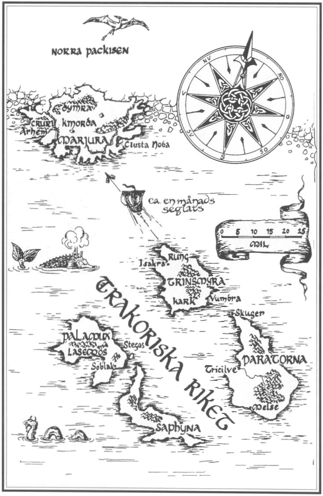
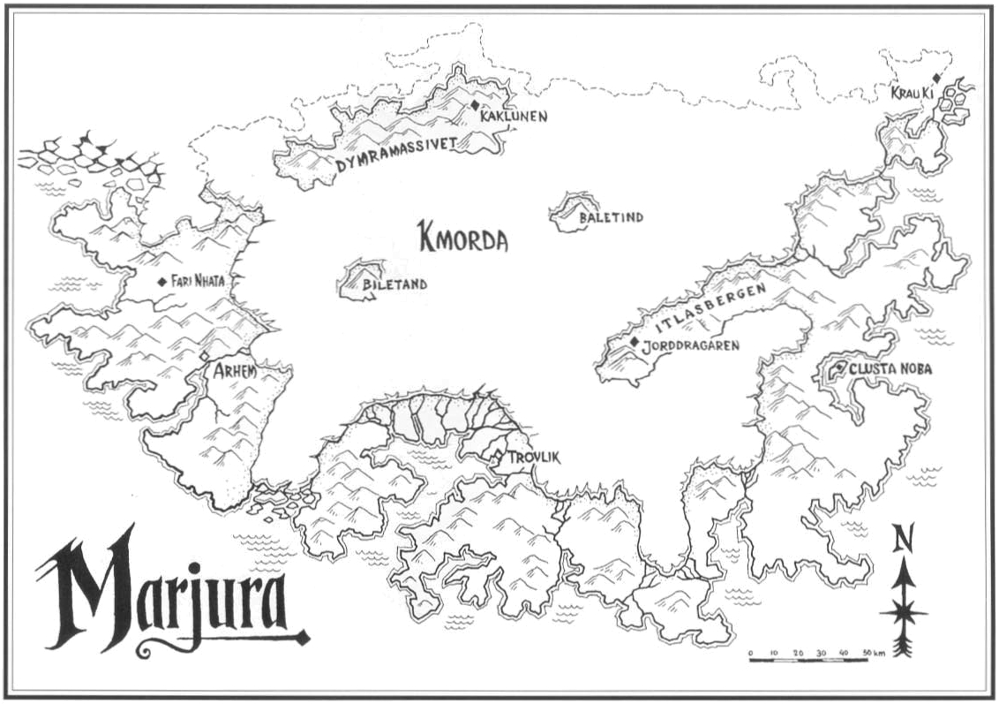
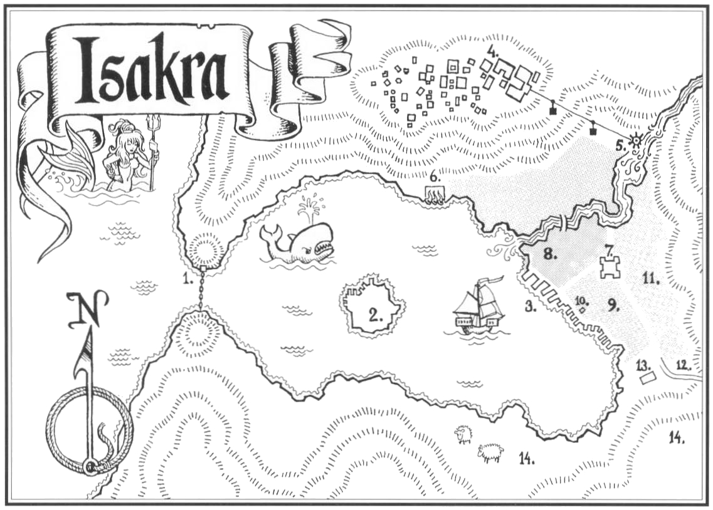
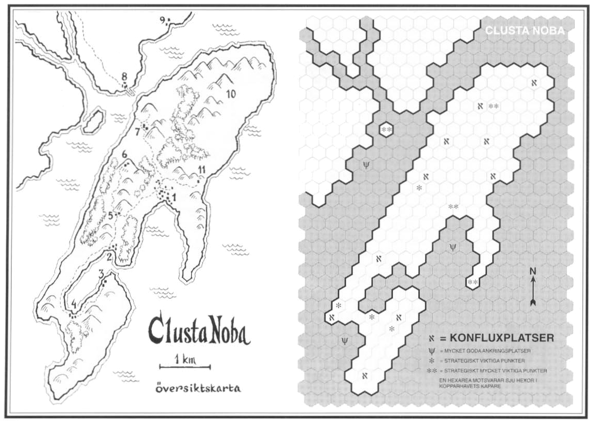
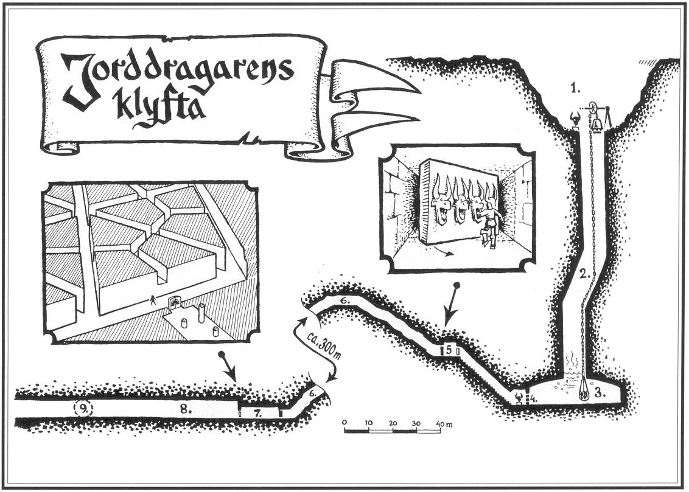
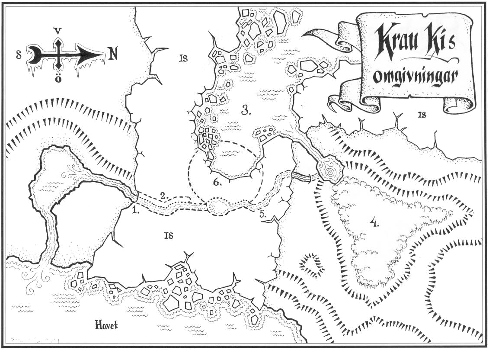
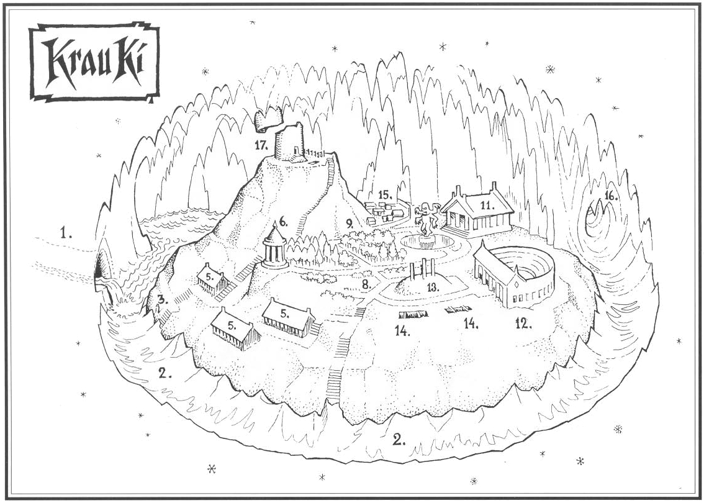
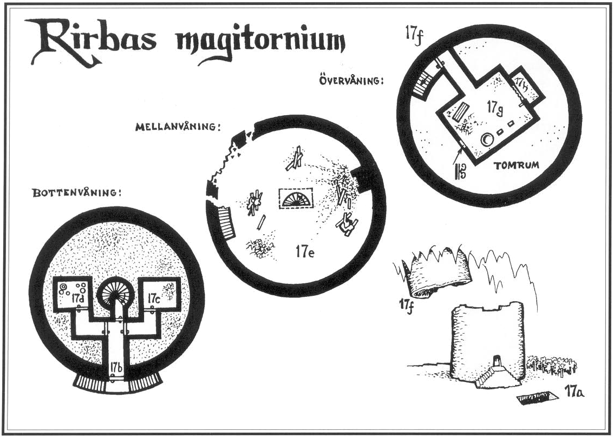
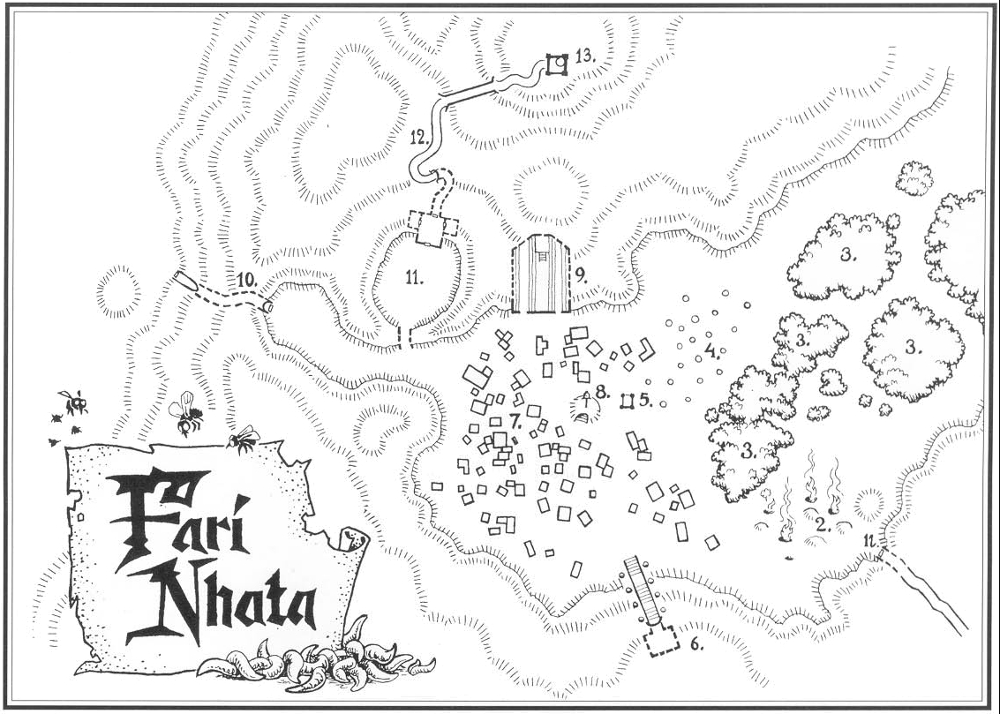
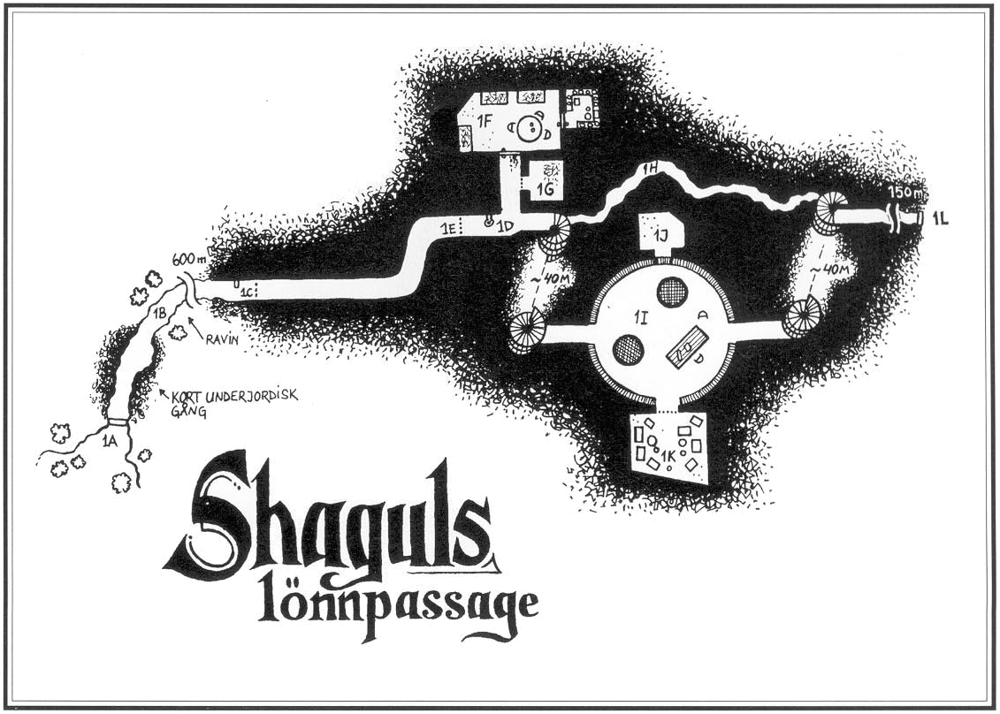

<title>Kartor - Den femte konfluxen</title>

# 17. Kartor

## Trakoriska riket

## Marjura

## Isakra

## Clusta Noba

## Jorddragarens klyfta

## Krau Kis omgivningar

## Krau Ki

## Rirbas magitornium

## Fari Nhata

## Shaguls lönnpassage

