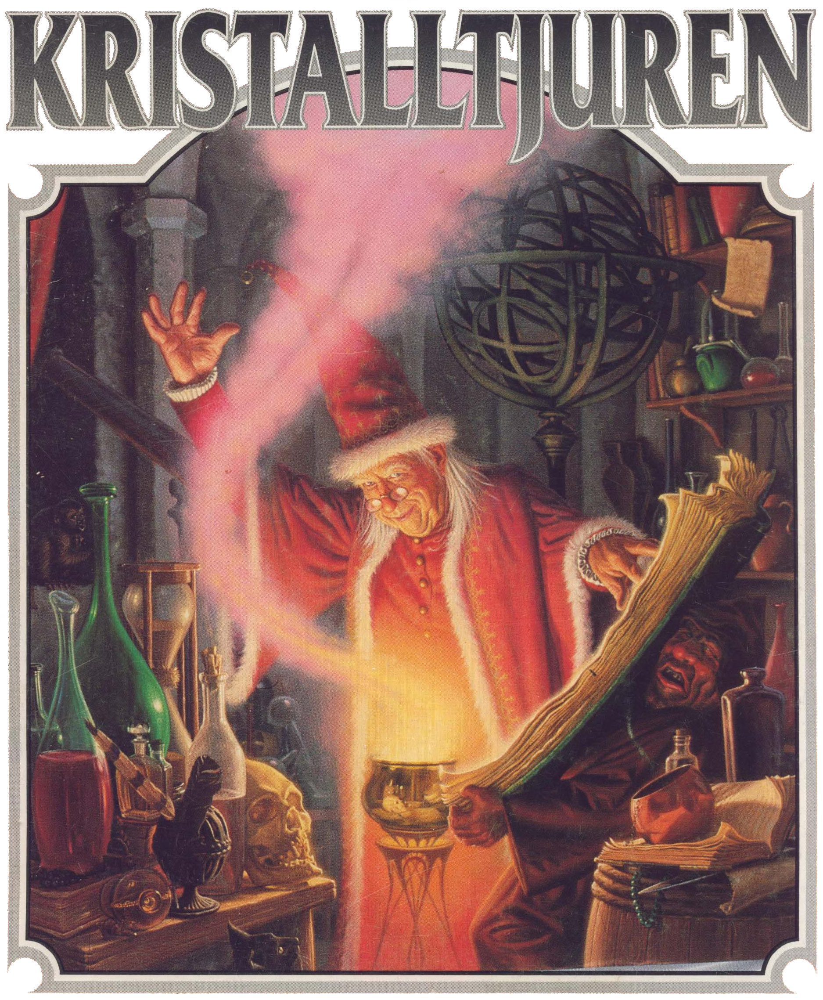
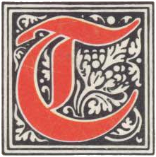
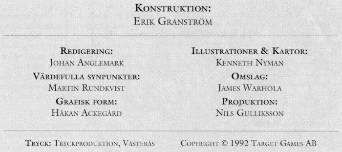

<title>Kristalltjuren</title>

*vå varelser vandrar över de gigantiska grå hallarnas golv. Inga ljud hörs utom deras svaga röster.*

*I nästa korsväg står de framför en jättelik staty. Melealina tvekar. Statyn sitter fet som en padda, med sina många armar utsträckta och ett ondskefullt flin över nunan.*

*”Vik undan!”, ropar Melealina. ”Vi söker passage i det heliga berget Ranz namn! Gå tillbaka till det mörker som är din hemvist!”*

*Demonens åtta klingor genomborrar Manghalde med ormens snabbhet och sliter besvärjaren i stycken på ett ögonblick.*

*Innan Melealina hinner reagera står statyn framför henne, nedsölad av trollkarlens rykande blod.*

*”Alltför långt har ditt liv varit, alvkona, men nu är det likväl till ända!” Stenvarelsen tar steget som skiljer dem åt.*

När jakten på oraklets fyra ögon var över, reste Melealina till ön Stegos för att erbjuda kungen sina tjänster som siare och rådgivare.

Hon förde med sig såväl trollkarlen Manghalde som de andra överlevande oraklen till Stegos och vann snart kungens förtroende. Rollpersonerna kanske följde med för att undkomma RhabdoRanas mördare. Det har förmodligen gått några månader, tiden spelar mindre roll, och äventyrarna befinner sig antingen på Stegos eller någonstans på västra kontinenten.

Det bör vara närmare vinter år 613-614 eO och spelet kan börja.

*Kristalltjuren*, en äventyrsmodul som utspelas i [*Trakorien*](../trakorien/00.titelblad.html), är fortsättningen på äventyret [*Oraklets fyra ögon*](../oraklets_fyra_ögon/00.titelblad.html), men även kan spelas fristående.

# 00. Titelblad

## Förord

Kronolaabets tunga pendel mäter ut tiden i Tricilve och femte konfluxen drar för varje pendelslag obönhörligen närmare. I detta, det näst sista äventyret, irrar rollpersonerna ut i Multiversum för att hämta hem hjälten Store Stenfar som behövs i slutstriden. Sedan återstår bara att göra upp med trollkarlen Shagul och hans anhang, att skydda konfluxen och lite annat smått och gott. För att ingen i förtid ska slappna av och drömma om historiens lyckliga slut, kan jag avslöja att segern ingalunda är given. Långt dit dock. Nu gäller först att rädda vad som räddas kan undan den bortskämde Nominatorn.

Jag har försökt göra *Kristalltjuren* annorlunda än förra delen i serien *Oraklets fyra ögon*, precis som den senare skiljde sig från *Svavelvinter*. Tonvikten ligger på problemlösning, men både svärd och kunnande kommer att behövas.

*Kristalltjuren* är, liksom för övrigt rollspelet Kult, starkt inspirerat av *gnosticismen*, en gammal skojig kättarsekt som bannlystes redan i tideräkningens barndom. Gnostikerna trodde att allt var en bluff, att ”de goda” försöker lura oss och att ”de onda” bara försöker tala om för oss arma vilseledda människor hur det egentligen ligger till. Den uppmärksamme hittar också påverkan från musiksviten *Carmina Burana*, från *IKEA* och naturligtvis från vår egen sönderfallande tids skröpligheter.

Erik Granström

*Och himlen vek undan, såsom när en bokrulle rullas tillhopa...* Apokalypsen 6:14

## Erkännanden

**Konstruktion:** Erik Granström
**Värdefulla synpunkter:** Martin Rundkvist
**Illustrationer och kartor:** Kenneth Nyman
**Omslag:** James Warhola
**Digitalisering:** Klas Lindberg

> ### För den historieintresserade
>
> Titelbladets lista med erkännanden hade ursprungligen detta innehåll:
>
> 
