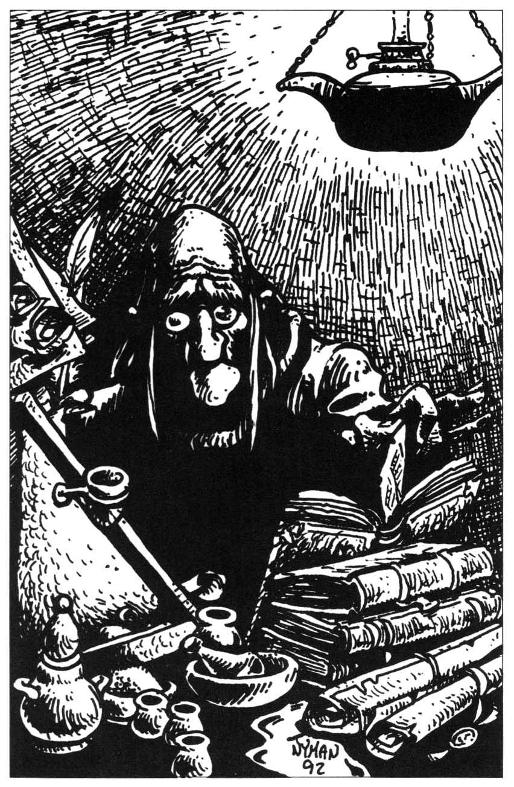
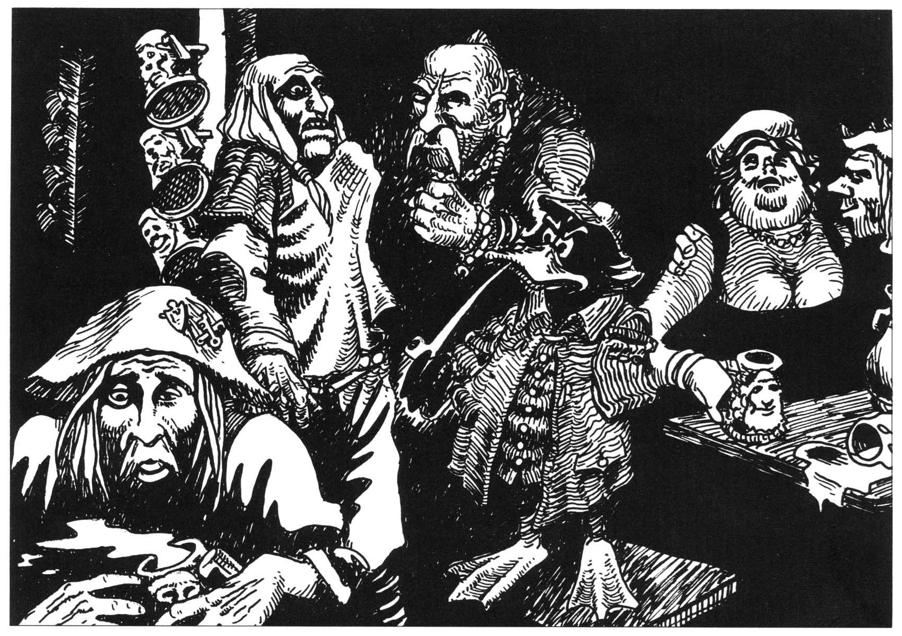
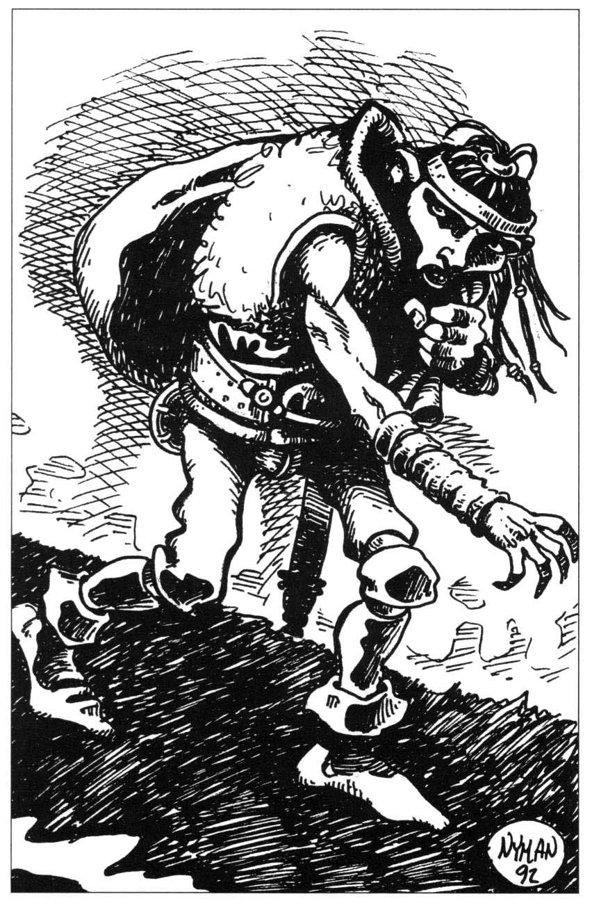
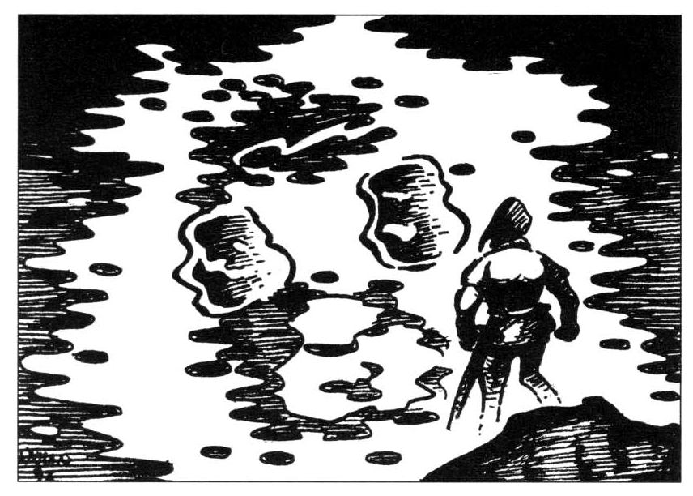
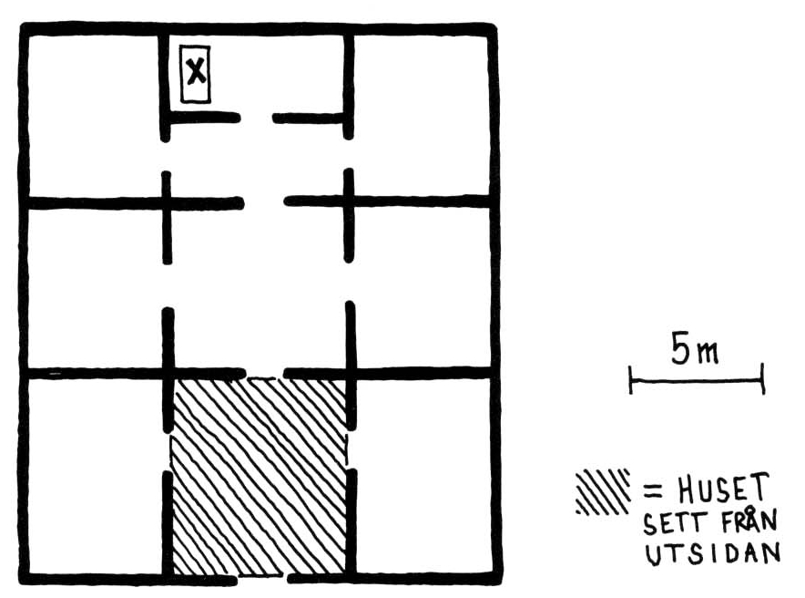
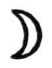
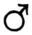
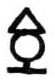
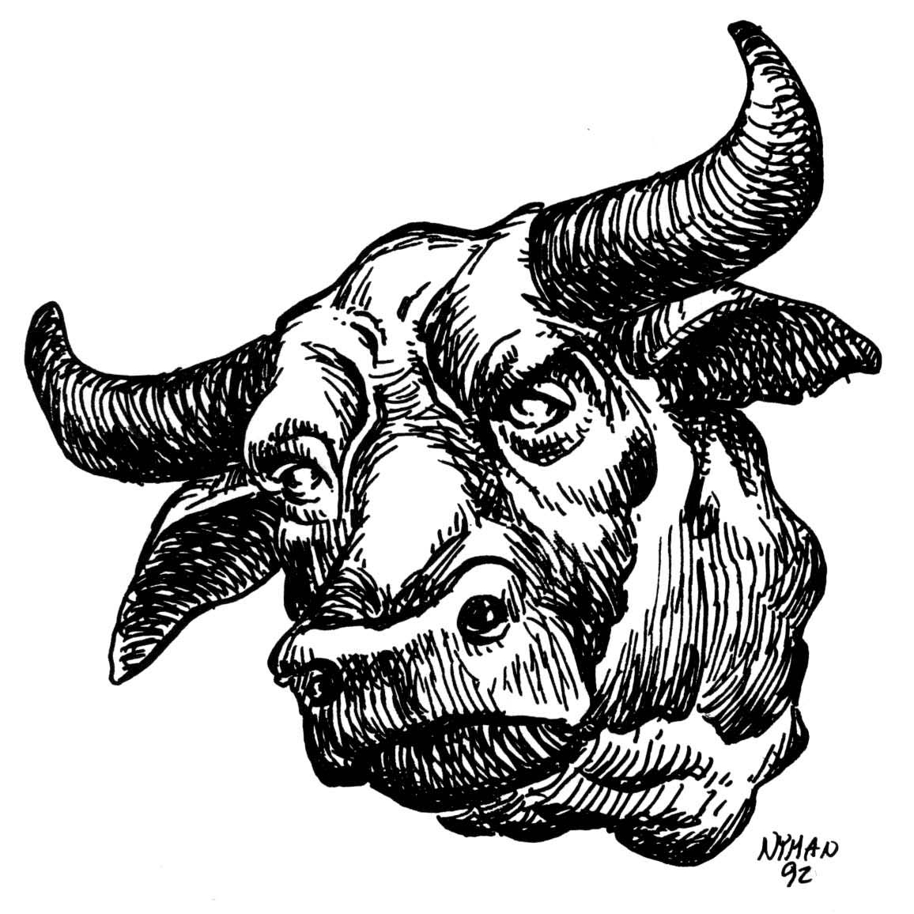

<title>Personer och varelser - Kristalltjuren</title>

# 06. Personer och varelser

### Alvoraklet Melealina

Melealina fick sitt namn av ”Meleas” — *mörk*, och ”alen” — *gryning*, eftersom hon föddes en morgon under solförmörkelse, vilket gav henne den speciella gåvan att se det som är fördolt för andra. Under solförmörkelse anses världen för en kort sekund stå stilla. Den tid som då ändå förflyter är till låns och gemensam för alla världar. Den som föds i den lånade tiden tillhör inte bara vår värld utan är en förmedlande länk till övriga världar och går ofta ett sällsamt öde till mötes.

**Utseende:** Den som möter alvkvinnan har mycket svårt att efteråt precisera hennes utseende mer än att hon är mörk med axellångt rakt hår och klädd i vackra gröna kläder. Hon utstrålar lugn och ger intrycket av att vara en gammal god vän som man återser efter lång tid trots att man aldrig träffat henne tidigare.

**Karaktär:** Melealina ger ett världsfrånvarande intryck och uppträder alltid vänligt och lugnt. Hon blir aldrig otålig, arg eller dominerande.

```
STY 6     SMI 15    KAR 19
STO 8     INT 19    KP  12
FYS 16    PSY 16 (25 vid magi)
```

**Färdigheter:**

* Astrologi 17
* Melealina har inga stridsfärdigheter.
* Melealina kommunicerar fritt med naturens djur, andar och älvfolk. Detta visar sig i spelet genom att hon kan få information om huruvida vissa personer befinner sig i den skog eller vid den sjö där hon för tillfallet är.
* Melealina fungerar som något av en väktare vid portar till andra världar, och känner därför i 40% av fallen till om en viss person har passerat till dödsriket samt vilka demoner och andra främmande varelser som finns inom 100 mils radie. Hon kan lämna ganska klara besked om dessa demoners egenskaper.
* Melealina kan läsa tankar och bli osynlig på samma sätt som älvor.

### Arn Dunkelbrink da Kharasme

Arn Dunkelbrink är i sanning en levande legend. Som arvtagare till Lasemosi största furstendöme Kharasma gjorde han sig tidigt känd som en ojämförligt skicklig svärdskämpe och härförare, men också som en strängt religiös man vilken innan varje företag förhörde sig om gudarnas vilja i fårtarmar och spåkort.

År **608 eO** klädde sig Arn i enkla kläder, svor att inte återvända förrän han ensam besegrat en drake, och gav sig trots moderns gråt iväg mot fastlandet. Efter ett halvårs famlande med dimmiga sägner som enda vägledning, spårade furstesonen en medelålders drake vid namn Blatifagus till de mörka bergen norr om det urgamla Jorpagna. Eftersom Arn var en riddersman av den uråldriga Banzikan, klev han öppet och utan fruktan in i drakens grotta där Blatifagus intresserat följde hans steg. Det tar en tiondels sekund för en drake att öppna klaffarna till gashålorna i svalget. Arn slet sitt spjut från ryggen och kastade det samtidigt som han hörde drakens bakre kindtänder slå ihop för att alstra den tändande gnistan. I nästa ögonblick slogs han till marken av en eldkvast som brände bort köttet i hans ansikte. Bara kläderna av eldfågelskinn räddade hans liv.

Arn reste sig mödosamt och drog sitt slagsvärd. Ögonen var blinda av elden, men krigaren rusade mot ljudet av den vrålande draken. Med sin klinga högg riddaren av svansspetsen på odjuret som därvid drabbades av en smärta och ångest han aldrig tidigare känt. För att inte sprängas av sina känslor skrek draken, och han skrek på Det höga språket som talades i världen före den första konfluxen, ett språk som i spelvärlden bara drakarna känner men som gudarna förbjudit dem att använda. Han skrek på sin mor och sina bröder och på alla de kraftväsen han kunde nämna och själva klippväggarna förvreds av de förbjudna ord de tvingades höra innan draken flydde ur grottan.

Arn Dunkelbrink låg kvar i tre dagar innan han släpade sig till närmaste by. Draken Blatifagus flydde mot norr. Arn återfann sin motståndare först under sommaren **år 613**, när han ensam steg in i kvicksilvergruvan på Marjura, men han krävde denna gång inte drakens liv utan dess lydnad, ty bland de förbjudna orden fanns drakens sanna namn att läsas upp för alla av lagmannen på Bhannavil om varelsen inte gjorde riddaren till viljes. Tillsammans lämnade de två Marjura och flög söderut genom svår dimma med riddaren på drakens rygg. Efter många dagars flykt över vatten siktade man okänt land, och Arn lät draken gå ner för att dricka. Där hälsades han som Stegosi herre och konung, och installerades till sin snabbt övergående förvåning i sitt ämbete.

**Utseende:** Arn Dunkelbrink är enkelt klädd i pilgrimsdräkt, men under kåpan bär han en ringbrynja prydd med Banzikans symboler: eken, stenen och fröet. Han är storväxt och bred som en tjur över skuldrorna. Vid sidan hänger säcken med Blatifagus svansspets, krigarens något värmeskadade slagsvärd och en dolk med smal spets. Kungens ansikte, vilket han döljer i sin kåpa, är liksom händerna helt vanställda av ärren efter Blatifagus eldandning, men de bergsgrå ögonen har läkt och ser på världen med orubblig kraft.

**Karaktär:** Kungen är bitter och allvarlig till sinnes, och undviker människor. Ibland oroar sig han över att han hör röster, men driver bort både oro och röster med hårda fysiska övningar och stränga religiösa ceremonier.

```
STY 22    SMI 17    KAR 11
STO 16    INT 9     KP  16
FYS 15    PSY 10
```

**Ålder:** 38 (år 613 eO)

**Färdigheter:** Första hjälpen 14, Heraldik B3, Geografi (Öarna i nordhavet) B2, Dra vapen 25, Slagsvärd 29, Dolk 18, Spjut (kast och närstrid) 23, Kulturkännedom B2, Finna dolda ting 12, Lyssna 10, Upptäcka fara 16, Rida 14, Sjökunnighet 11

**Särskilda förmågor:** Övertygande tonfall, Järnnäve, Extremt orädd, Orubblig vilja, Gott läkekött

### Naramsi av den östra klyftan

Den stegosiske riddaren Naramsi, uppkallad efter Klavykiska rikets förste kejsare, var den förste som mötte Arn Dunkelbrink på Stegos. Sedan den dagen är han obrottsligt lojal mot kungen. Naramsi anmäler sig självklart att följa med på den farofyllda men ärorika expeditionen för att hämta Store Stenfar och därmed bevisa kungens rätt till makten. Också Arn tycker idén är god eftersom Naramsi är pålitlig och en god bågskytt. Om rollpersonerna inte vill ha riddaren med sig måste de avspisa honom på ett hedersamt sätt, annars tar han mycket illa vid sig. Han kanske till och med utmanar någon rollperson på duell.

**Utseende:** Naramsi har smala, ädla drag och liknar mest en prydnadsfigur skuren i elfenben. Hans stora ögon står ut som pingisbollar och täcks nästan helt av ögonlocken, vilket ger honom ett halvsovande, arrogant drag. Håret är vitt, tunt och faller rakt ner mot skulderbladen.

Naramsi klär sig i en bred, ljusgrå plymhatt av ödleskinn, uppvikt på höger sida för att inte komma i vägen vid bågskytte. Kläderna är likaså grå, enkla och fältmässiga med svarta läderremmar fastsydda som dekorationer. Vid vänster sida har han sin pata, ett moskoriskt duellsvärd (beskrivs i *Trakorien*). Luta och pilbåge finns alltid nära till hands. Till vardags bär han inga skydd.

**Karaktär:** Riddaren är mycket romantiskt lagd och sjunger gärna tårdrypande ballader om unga par som söker döden tillsammans genom att kasta sig från höga klippor. Han är en utmärkt lutspelare och därtill mästare i bågskytte. Det är som om alla strängar låg lika väl i hans hand.

Naramsi håller de ridderliga idealen högt och låter dem som regel gå före sina personliga önskemål. Han är stursk till sinnes och tål inga förolämpningar.

Naramsi misstror alla palamoxier. Han är säker på att joobalasherna konspirerar mot Arn Dunkelbrink för att själva ta makten. Även om han inte följer med äventyrarna på deras uppdrag kommer han att varna dem för de lömska prästerna.

```
STY 11    SMI 9     KAR 16
STO 10    INT 12    KP  13
FYS 15    PSY 13
```

**Ålder:** 24 år

**Färdigheter:** Första hjälpen 13, Tala/läsa jori B5/B3/B3, Spela luta/sjunga B4/B4, Historia B3, Dra vapen (pilbåge) 15, Sammansatt båge 21, Pata 16, Avväpna (motståndare med pata) 14

### Enu Garasuga

Enu Garasuga var religiös ledare för Joobalashersekten i Frand under de svåra förföljelserna som föregick Kishatets fall. Krystalokraten Tiamfa, som ledde upprensningen i Frand, lät pina Garasuga offentligt för att han skulle ta tillbaka vissa uttalanden om ”den stora allreningen”. Joobalasherledaren gav inte vika, men sedan den dagen är hans fötter obrukbara.

Efter Kishatets fall blev Garasuga en av de tre högsta religiösa ledarna i *Vite Shamash* kyrka och personlig rådgivare åt kung Arn Dunkelbrink på Stegos. Han höjer sig inte över mängden vad gäller färdigheter, lärdom eller skarpsinne, men hans klara och okomplicerade tro och goda omdöme har gjort honom till en av de mest respekterade kyrkoledarna på Palamux.

**Utseende:** Garasuga är en oansenlig liten man som klär sig enkelt och inte tar till stora ord. Hans ansikte är långt ifrån vackert. Det saknar markerad haka och näsan är något sned efter en brysk tillrättavisning från Tiamfas soldater. Han färdas i bärstol och betjänas alltid av en handfull yngre präster.

**Karaktär:** Garasuga är bekymrad över den bräckliga politiska situationen på Stegos och Palamux. Han tycker det bästa vore om Arn Dunkelbrink accepterades som kung av alla så att krafterna kunde samlas mot den nyfödda statens många fiender, främst aggressiva ransarder och revanschlystna trakorier.

Garasuga har inte stort förtroende för alvkvinnan Melealina eller hennes påhitt med resor bortom världen, men tycker samtidigt att varje möjlighet måste prövas.

**Ålder:** 63 år

### Noscapio

När äventyrarna reser från Stegos på sitt viktiga uppdrag, vill Enu Garasuga skicka med dem en from rådgivare, ”*ett Shamashi rena vittne och representant för den vita sanningens kyrka*”. Han tänker på sin favoritlärjunge, Noscapio, en ytterst beläst joobalasherpräst från Frand. Garasuga har två avsikter med sin begäran. Dels tror han verkligen att en shamasherpräst kan leda sällskapet i Multiversums labyrint, dels vill han skicka med en pålitlig observatör som efteråt kan berätta vad som egentligen hänt.

Noscapio befinner sig för närvarande hos tempelföreståndaren i Fontra Cilor, Garasugas gamle prästkollega Gonega da HOXOH, och Garasuga föreslår att man plockar upp honom där. Templet är också en lämplig sovplats i den osäkra staden.

**Utseende:** Noscapio är en utpräglad pergamentmal och gnet. Hans största fysiska bedrift någonsin var att samtidigt lyckas bära alla tre banden av Gumfer Myrpräntes *Kausala prefix i äldre sydmoskoriska hymner* till sin läspulpet. Flitigt läsande i mörka kamrar har gjort honom tunn och blek med en nästan vaxartad hud. Han klär sig i en tjock, illaluktande särk av svart ylle och bär utomhus sandaler och en konformad hatt som går så långt ner över ansiktet att han måste luta sig bakåt för att se vart han är på väg. Fingrarna är långa och som regel svärtade av bläck. Ansiktet domineras av en lång och utstående näsa. På näsroten rider en s.k. näsnypare, en metallklämma med två förstoringsglas, som nyper så hårt åt att prästen alltid låter förkyld när han talar. Ögonen är bleka och bekymrade, läpparna plutande med mungiporna neddragna som hos en gädda.

**Karaktär:** Noscapio är helt befriad från humor och fantasi. Han är inte elak men förstår sig dåligt på vardagliga känslor och blir därför klumpig i sitt umgänge med folk. Ofta håller han långa, tråkiga utläggningar om sånt som andra inte är intresserade av. Samtidigt har han ett mycket skarpt intellekt, framför allt inriktat på att se genom falska eller ofullständiga resonemang. Han är ytterligt noggrann, pålitlig och uthållig, och uthärdar även fysiska prövningar utan att klaga. Lögn och förställning anser han vara synd och slöseri med tid. Den hårt tuktade kropp som omger hans hjärna behöver bara små mängder mat och vila. Behov utöver de mest grundläggande har den vant sig av med sedan länge.

Noscapio intresserar sig inte för värdeföremål. De enda ägodelar han bär med sig förutom kläderna är en miniatyrvolym av *Nomona Veritrae* och en meditationssten, en bergkristall i silverkedja som han bär i en innerficka.

**SL:** Noscapio är mest till besvär medan man är kvar i spelvärlden, men kan vara till viss nytta när det gäller att genomskåda Nominatorns bländverk. Om rollpersonerna lämnat honom innan dess får de klara sig själva.

```
STY 4     SMI 4     KAR 6
STO 11    INT 21    KP 11
FYS 11    PSY 18
```

**Prästerliga egenskaper:** -15 på skräcktabellen (ofta fattar Noscapio inte ens att något är otäckt eller farligt), +10 PSY mot all illusionsmagi

**Ålder:** 47

**Färdigheter:** Inga vapenfärdigheter, räkna med att Noscapio har minst B2 i alla lärdomsfärdigheter vad gäller frågor av allmän teoretisk natur, Tala/skriva öarnas jori B5, alviska B4, fornjori B5, hueli B3 (huelerna skriver inte själva, man Noscapio har själv hittat på ett skrivsätt till hueli för att kunna författa en avhandling om stäppfolkets språk), kargomitiska B3, rungli B2, caddiska B2, Administration B4, Geografi (kontinenten) B3, Geologi B3, Historia (Palamux) B5, Kulturkännedom Palamux B3/Hueler B2/Alver B1, Kunskap om demoner B3, Teologi B5, Räkning B3



### Ockerankan Pultry

Den svarta ankan Pultry är ockrare i Fontra Cilor. Han söker upp äventyrarna om de frågar efter Läderråttan i Fontra Cilor för att försöka utkräva tjuvens spelskuld på 1600 Sm. Pultry omger sig i staden alltid med minst tre dugliga livvakter. Ofta drar han i en silverkedja efter sig en yngre vit ankhona som han hittat på slavmarknaden. Hans starka position i Palamoxi undre värld beror framförallt på goda förbindelser med långväga smugglare, och på näbb för vilka exotiska droger och tjänster den degenererade moskoriska adeln vill köpa dyrt.

**Utseende:** Pultry är ärrad efter en vild ungdom som pirat i Kopparhavet. Vänstra armen är avhuggen vid armbågen och övre näbbhalvan kluven av ett yxhugg men lagad med silvernitar. Näbbskadan åstadkommer ett visslande ljud varje gång ankan säger ”n”. Hjässan är renplockad på fjäder och täcks av en slimmad läderkalott med skärm. Pultry har buskiga svartgrå plymer på kinderna. Runt honom står en tung doft av mysk från körtlarna på gumpen. Ankan bär ofta mörk sjömanskostym med kort nackstycke för att markera sitt ursprung. Som vapen har han en kort huggare i bältet. Hans tal är en grötig blandning av flera språk.

**Karaktär:** Pultry är van att få som han vill och blir lätt vresig och otålig om det trilskas. Han gör sig aldrig till för någon utan går alltid rakt på sak.

```
STY 10    SMI 13    KAR 8
STO 6     INT 15    KP  11
FYS 16    PSY 9
```

**Ålder:** 34

**Färdigheter:** Tala jori B3, Tala piratslang (en oskön blandning av språken runt Kopparhavet) B4, tala svartiska B2, Köpslå 19, Bluffa 17, Upptäcka fara 16, Värdera 18, Räkning B4, Administration B3, Drogkunskap 13, Geografi (allmän kontinenten) B2, Muta 18, Undre världen B5, Näbbläsning (upp till 30 meter bort) 14, Dolk 13, Huggare 15



### Tjuven Läderråttan

Tjuven Läderråttan är en förrymd ökennomad av Oeslistammen. Vid tretton års ålder reste han med sin familj till Na Yoh för att sälja växtfärger. Där gjorde han ett eget avtal med skumma krämare från Paratorna, stal förtjänsten och rymde till Fontra Cilor. I storstaden blev han springpojke hos en slavhandlare och drogsmugglare som gillade pojkens oärliga fräckhet. Efter några år drev Läderråttan en egen rörelse med handel av droger och stöldgods. Rörelsen sprack emellertid eftersom Läderråttan inte kunde låta bli att lura sina kontakter. Nuförtiden försöker han mest njuta av livets goda. Han gör en och annan skum affär med främmande köpmän och försöker hålla sig undan alla dem som är ute efter honom.

Huelerfolken förlåter sina stamfränder det mesta. Därför kan Läderråttan röra sig fritt i Fokale även om hans rykte inte är det bästa. När stadslivet blir för ohälsosamt, som det är just nu, brukar han fly ut på slätten tills upprörda fiender lugnat sig.

Läderråttan kom bra överens med den f.d. Poa Hualban som drömde om ett mer spännande liv i de stora städernas undre värld. Tillsammans planerade och genomförde de två stölden av nyckelväktarens ceremoniel.

**Utseende:** Tjuven är liten till växten och klär sig alltid i tunna kläder av oxblodsfärgat läder med en grå ulljacka om det är kallt. Runt huvudet har han virat en praktisk silkeslinda som dels värmer öronen, dels är bra att strypas med.

Huvudet är runt med bara enstaka blåaktiga hårtestar. De små grisögonen, som är typiska för ökenfolken, sitter mycket långt isär. Blicken hoppar alltid nervöst från det ena till det andra. På samma sätt har tjuven svårt att hålla händerna stilla.

**Karaktär:** Läderråttan är en passionerad lögnare som alltid försöker lura till sig fördelar, vilket givit honom många fiender. Därför är han mycket misstänksam och flyr fältet vid minsta tecken på fara. Samtidigt är han så nyfiken och girig att han inte kan låta bli en spännande affär. Han kommer att hjälpa rollpersonerna om de hälsar frän Onedom av Bhannavil, Arn Dunkelbrinks alias, den enda person Läderråttan beundrat. Erbjuds han dessutom skatter eller andra fördelar kan han till och med anstränga sig en smula.

Med folk han känner och litar på är Läderråttan skämtsam och pratglad. Han går gärna till kvinnor, men föredrar dem man betalar framför dem man uppvaktar. Tjuven använder inga som helst droger utan föredrar att bevara sin skärpa.

```
STY 10    SMI 17    KAR 9
STO 8     INT 17    KP  11
FYS 14    PSY 12
```

**Ålder:** 28 år

**Färdigheter:** Drogkunskap 15, Tala jori B3, Tala hueli B4, Kulturkännedom/Geografi/Historia (Fokale) B3, Värdera droger och stöldgods 17, Kortsvärd 8, Bluff 14, Muta 15, Gömma sig 13, Hantera fällor 12, Klättra 15, Låsdyrkning 9, Smyga 8, Stjäla föremål 14, Undre världen (Fontra Cilor) 16, Finna dolda ting 13, Upptäcka fara 19



#### Enhetsstaven

På Oeslistammens område, i en klippskreva invid Kargomväggen nära Laak Lakrima, har Läderråttan sparat det märkligaste av de föremål han och den siste Poa Hualban stal i Na Yoh. Han har inte vågat sälja det eftersom det är så lätt att känna igen. *Enhetsstaven* är en meterlång benstav som enligt legenden är skuren ur odjuret Tribagas nyckelben. För att hämta staven måste man klättra upp tre meter på klippväggen och sticka in handen i rätt hålighet. Framför staven, som ligger i sitt läderfodral, har Läderråttan placerat en liten keramikurna som innehåller ett mycket starkt nervgift (STY 25) och har ett halvdussin nålar. Det krävs ett svårt Upptäcka fara eller Hantera fållor för att upptäcka fällan om man inte är speciellt försiktig.

Staven är en meter lång och väger åtta kilo. Den är helt täckt av reliefer som föreställer hueler och eldelementarer i strid med allehanda odjur. En, två och tre decimeter från övre änden har staven skurna fördjupningar som passar en normalstor högerhand. I nedre änden finns en bronsfot.

Ett lyckat Kunskap om magi => Staven aktiveras antagligen på tre olika sätt genom att man håller den i ett av handgreppen och stöter bronsfoten mot marken. Möjligtvis ska ett kommandoord uttalas samtidigt.

**Stavens magi:** Staven fungerar bara på Palamux. Den som kontrollerar staven är helt immun mot såväl vanlig som magisk eld. Eldelementarer lyder honom automatiskt. (Deras lojalitet mot staven är större än lojaliteten mot någon levande varelse.)

**Översta handtaget** — Marken skakar till med ett dovt mullrande och ett gnistregn slår ut från bronsfoten. Stavens ägare kan mana fram eldelementarer motsvarande en sammanlagd effektgrad lika med ägarens PSY och kommendera dem att lyda under PSY SR.

**Mellanhandtaget** — Alla eldar släcks inom 3 x ägarens PSY meter.

**Nedre handtaget** — Allt brännbart fattar omedelbart eld inom 3 ⨉ ägarens PSY meter. Levande varelser får dock ett normalt motståndskast. Staven känner av ägarens undermedvetna önskemål så att föremål och varelser som ägaren inte vill mista automatiskt skonas av lågorna. Elden kan däremot bara styras medvetet av den som har PSY≥20.

### Gycklaren Rafler/lönnmörderskan Dahobny

Gycklaren Rafler kan placeras in var som helst på Palamux. Där är marknaden god för barder, gycklare och akrobater allt sedan Det heliga Kishatets trista styre upphörde. Rafler är egentligen en kvinna vid namn Dahobny, utsänd av mördarligan RhabdoRana på kontinentens fastland.

**Bakgrund:** I *Oraklets fyra ögon* tog trollkarlen Shagul telepatiskt över RhabdoRana i Trakorien för att använda sektens medlemmar i egna syften. På fastlandet undrade sektledarna naturligtvis vad som hänt när kontakten med öarna upphörde. Ryktet berättade ju att RhabdoRana var aktiva som aldrig förr i Trakorien, där siare mördades på löpande band. Tre agenter skickades ut, av vilka endast en återvände, och det redan kort tid efter sin avfärd. Agentens psyke var i oordning och han dillade om att någon sökt tränga in i hans huvud. Något var mycket fel, och sektens ledare beslöt bryta organisationens traditionella uppdelning i celler för att istället samla krafterna. Diskussioner pågår som bäst om vad man ska göra.

Under tiden har kretsledaren Desaba agerat på egen hand och skickat sin dotter Dahobny till Palamux för att snoka i sakernas tillstånd. Dahobny står utanför RhabdoRana, men är av sin far skolad i sektens speciella konster. Desaba misstänker helt riktigt att RhabdoRana blivit infiltrerat och vill genom Dahobny få en oberoende observatör för att komma eventuella förrädare på spåren.

Andra i RhabdoRana känner inte till Dahobny. I sin ungdom hade Desaba en passionerad kärleksaffär med en kvinnlig akrobat vid namn Eligan. Sådana förbindelser var strängt förbjudna för sektmedlemmar och den unge mördaren berättade därför inget. De fick en dotter ihop, men när Desaba återvände efter ett tvåårigt uppdrag vid Kopparhavet, hade Eligan kastats ut från sin gycklartrupp och tvingats till prostitution för att försörja sig och barnet. Strax innan Desaba hittade henne hade hon misshandlats till döds av en grym, adlig kund. Desaba placerade barnet hos sin bror, en mästertjuv i Triska innan han med sina raffinerade metoder avlivade dels alla kunder Eligan haft, dels hela gycklarsällskapet som kastat ut henne.

Dahobny växte upp i Triska, där hon snabbt lärde sig grunderna i tjuveri och gyckelkonst. Så ofta han kunde, hälsade Desaba på henne och lärde henne sina egna färdigheter. Numer är Dahobny ledare för en egen tjuvliga i staden O, där konkurrensen bokstavligt talat är mördande.

Dahobny har antagit faderns uppdrag som en intressant utmaning och som ett tillfälle att överglänsa de beryktade RhabdoRanerna.

**Utseende:** Dahobny har ett alldagligt utseende, men uppträder alltid under förklädnad. Till detta uppdrag har hon valt rollen som gycklaren Rafler från Munzga. Rafler har kort, spretigt morotsrött hår, dåliga tänder och en fruktansvärd andedräkt. Han vindar på ena ögat. Gycklaren bär en ärmlös, röd tunika, läderbälte med två dolkar och svarta byxor av ylletrikå. De långa stövlarna av mjukt läder har rågummisulor och är utmärkta att klättra med.

**SL:** Den dåliga andedräkten är en del av Dahobnys förklädnad avsedd att hålla närgångna främlingar på avstånd. Hon får den genom att tugga torkad kadaversvamp. (Svårt Botanik => lukten kan identifieras.) Tandrötan är målad med emaljfärg.

Någonstans på kroppen har hon alltid fyra kastknivar varav två är förgiftade med svartblod och en dolk med parerstång.

Dahobny har inte svartmålad underläpp trots att hon behärskar en del av RhabdoRanas konster. Hon bekänner sig inte till demonen Ghumgakk.

**Karaktär:** Dahobny är saklig, kall och professionell, men kan spela vilken sinnesstämning som helst som passar med hennes förklädnad.

```
STY 12    SMI 18    KAR 9
STO 8     INT 17    KP  11
FYR 14    PSY 15
```

**Ålder:** 24

**Färdigheter:** Upptäcka fara 18, Tala/läsa kontinental jori B5/B4, Administration B3, Giftkunskap 19, Kulturkännedom B3, Dolk kast/närstrid 20/15, Sjunga och spela flöjt B2, Akrobatik B4, Förklädnad 22, Gömma sig 14, Klättra 17, Låsdyrkning 14, Finna dolda ting 16, Upptäcka fara 18

### Tolgulden Bax

Tolgulden Bax, en jättemänniska från Gråtande bergen söder om slätten, är fåraherde och ordningsvakt i Na Yoh. För några år sedan var han som stolt krigare i oasen för att handla svin till sin stam. Natten innan han skulle vandra hemåt med de inköpta djuren, bet de ihjäl och åt upp delar av herr Saviran, ägare till glädjehuset Rosenpaviljongen. Herr Saviran låg och sov kraftigt berusad bakom tavernan. Bax tog så illa vid sig av händelsen att han beslöt stanna i oasen för att hjälpa den nyblivna änkan Saviran med gårdens grovsysslor. Madam Saviran var sedan länge less på sin fyllbult till man och sörjde inte den lyckliga händelseutvecklingen.

**Utseende:** Bax är nästan alltid melankolisk och tystlåten. Som tolguld är han över tre meter lång och sturig till humöret. Han har långt, ljust hår sammanvirat till en tjock fläta på bröstet. Ofta går han klädd i sitt gamla slitna bröstläder över en lång yllesärk. Till vardags är han inte beväpnad med annat än en kraftig stav, men i ett skrymsle hemma i stugan förvarar han sin saryng, det speciella tvåhandssvärd tolgulderkrigare använder i strid, och en magnifik pilbåge av horn från en uroxe.

**Karaktär:** Bax talar inte gärna med främlingar och ger bara korta svar om han måste. Av artighet förkortar Bax alla besökares namn till första stavelsen. Hos tolgulder tyder ett kort namn på hög status.

Jättemannen har funnit ett visst samförstånd med lönnmörderskan Wifi som är i oasen med herr Merinor. De två tränar tillsammans på lediga stunder. Efariern Zahembra gillar inte deras umgänge och funderar när han är berusad på om han inte skulle lära jätten en läxa. Ett slagsmål kan gärna bryta ut mellan de två och dra in rollpersonerna.

```
STY 32    SMI 9    KAR 5
STO 34    INT 7    KP  24
FYS 14    PSY 8    SB  +2T6
```

**Färdigheter:** Saryng 17, Pilbåge (modell större) 14, Stav 15, Fårskötsel B3

### Krystalokraten Huriems, alias Herr Merinor

”Herr Merinor” påstår själv att han är en ansedd kardisk konstnär i tjänst hos hertigen av Bry. Han är i Nah Yoh för att ”*studera det säreget levande ljuset från de speglande bergen*” och på så sätt berika sitt måleri. (Både Huriems och hans livvakter använder alltid exakt dessa ord, vilket kan låta mystiskt tredje gången man hör dem.) Eftersom Huriems inte ens kan teckna en streckgubbe, undviker han att diskutera sin konst vidare med ”dessa barbariska nordbor som inget begriper av livets skönhet”. Han har med sig några tavlor att visa upp om det kniper.

Herr Merinor är i själva verket krystalokraten Huriems, utsänd av Kishatets störtade ledare Manzonla för att förhandla med kargomiter och barbarer från de nordliga öarna om en allians mot Stegos. Se del 1 av *Äventyret*.

**Utseende:** Herr Merinor är en storväxt, något överviktig man som ger ett flottigt och brokigt intryck. Han smörjer sig i dyrbara oljor som ligger kvar som slemmet efter en snigel där han varit. Över hela kroppen har han smycken och ringar så billiga att till och med den otränade ser att de är oäkta. Kläderna är brokiga och av vågat snitt, hatten sitter rävigt nedhasad över ena örat.

**Karaktär:** Konstnären är vresig och högdragen. Han undviker att komma på tu man hand med någon. Blir han pressad, låtsas han få en kreativ idé som genast måste utvecklas i enrum. Hans livvakter motar ofta bort nyfikna för att de inte ska störa ”herr Merinors genialiska inspiration”.

```
STY    15    SMI 6     KAR 12
STO    16    INT 17    KP  13
FYS    10    PSY 12
```

**Färdigheter:** Huriems talanger är alla av lärdomsmässig och administrativ art. Någon konstnär är han definitivt inte. Han undviker både samtal och kroppslig beblandning med främlingar för att inte bli avslöjad.

### Zahembra, efariern

Efariern Zahembra är på strålande humör. Ransarderna har anlitat honom som livvakt åt krystalokraten Huriems, ett enkelt och välbetalt uppdrag som passar utmärkt mellan mer manliga äventyr. Dessutom är ju klimatet här på slätten underbart! Vem hade väntat sig en äkta öken på dessa fördömt nedisade öar. Efter ett par muggar vin är det faktiskt lätt att tänka hemåt och få en tår i ögat. Zahembra är så tuff att han måste dunka huvudet i väggen för att somna på kvällen.

Zahembras hobby är pilmakeri. Han tillverkar pilar mycket snabbt och experimenterar gärna med stabiliserande utskott, hullingar, och utsmyckningar med mångfärgade fjädrar. Som regel förgiftar han pilarna med svartblod.

**Utseende:** Zahembra är mörkbrun i skinnet men med efariernas blonda hår som skydd mot hemlandets solvärme. Han består mest av muskler och bullriga ord som ständigt söker sig ut på hög volym. Helst går han klädd bara i sandaler, ett höftkläde av leopardskinn och sin krigarhatt som är skuren ur ett björnkranium och klädd med papegojfjädrar. När nordens kyla tvingar på honom fulare paltor bär han ändå alltid sina egna kläder ytterst.

**Karaktär:** Zahembras aptit på mat, kvinnor och rusdrycker är stor, bara inte på ”detta getpiss isbarbarerna kallar öl”. Han älskar även striden och förmodar själv att han kommer att stupa på slagfältet, vilket är ett slut bättre än de flesta. En kväll utan slagsmål är slöseri för honom.

```
STY 18    SMI 16    KAR 12
STO 16    INT 5     KP  16
FYS 15    PSY 8     SB  +1T4
```

**Färdigheter:** Tala kontinental jori 2, Första hjälpen 15, Pilmakeri B4, Förhöra 13, Muta 14, Akrobatik B2, Hantera fällor 8, Klättra 13, Finna dolda ting 16, Upptäcka fara 15, Gömma sig 14, Långbåge 19, Kroksabel 19, Två vapen (kroksablar) 17, Slagsmål 18

**Särskilda förmågor:** Ambidextriös, Gott balanssinne, Härdig mot element, Extremt orädd, Snabb uppfattningsförmåga

### Wifi

Wifi är en snedögd kvinnlig krigerska/tjuv/lönnmördare från Morëlvidyn. Hon tar sin karriär mycket allvarligt och reser över kontinenten för att lära sig nya användbara tekniker. För tillfället är hon livvakt åt krystalokraten Huriems tillsammans med Zahembra. Kvinnan sköter tankearbetet åt de två.

Wifi missbrukar zinkakla-drogen från Traxilmes öknar. Drogen accelererar kroppens nervsignaler så att omvärlden tycks röra sig i ultrarapid.

Wifi är mycket mån om att utveckla sina färdigheter, speciellt vad gäller strid och tjuvkonster. Hon vill gärna träna med alla skickliga yrkesmän hon möter och drar sig inte för att fråga. I Na Yoh sparrar hon tolgulden Bax för att lära sig slåss mot större varelser. Hon brukar också stå bakom madam Savirans elaka åsna Maximilian, peta på den med en käpp och glida undan när den slår med bakhovarna.

En intressant möjlighet är en allians mellan Wifi och Rafler/Dahobny. De två kvinnorna har mycket gemensamt och Wifi skulle utan tvekan lämna både Zahembra och herr Merinor för möjligheten att lära sig några av RhabdoRanas hemligheter. SL kan starta en liten spelgrupp vid sidan av med de två.

**Utseende:** Wifi ser mycket utländsk ut, med brett ansikte, rött hår och sneda ögon. Hon varken kan eller försöker förklä sig eftersom tjuvar agerar mer öppet i hennes hemland. Hon är liten till växten, men muskulös för sin storlek och i envig en mycket svår motståndare, speciellt när hon ätit zinkakladrogen.

Wifi klär sig i löst sittande sidenkläder, en omlottjacka, knälånga hosor och hårband. Helst går hon barfota om bara vädret tillåter. Runt halsen innanför jackan hänger ett rep med korta läderremmar som impregnerats med zinkakladrogen. När hon behöver skärpa sig, tuggar Wifi under en halvminut på en av remmarna. Drogen verkar inom ytterligare en minut och effekten avklingar efter 6+1T6 minuter. Hennes SMI ökar med 7 när hon är påverkad, vilket även påverkar några SMI-baserade färdigheter.

**Karaktär:** Wifi är alltid på sin vakt och släpper ingen inpå livet. Hon förstår inte utlänningarnas seder eller humor.

```
STY 13    SMI 17/24    KAR 6
STO 8     INT 16       KP  10
FYS 12    PSY 15
```

**Färdigheter:** Drogkunskap 12, Tala jori B2, Dra kortsvärd 12/20, Kortsvärd 15/22, Klyka＊ 13/17, Avväpna med klyka 7/15, Gömma sig 17, Klättra 18/22, Smyga 15/22, Upptäcka fara 17/22, Simma B3, Sjökunnighet 14, Överlevnad 14

＊ Klykan är en liten Morëlvidynsk sköld med två utskjutande spetsar. Dessa kan köras in i motståndaren under närstrid eller användas för att fånga upp en attack och vrida vapnet ur motståndarens händer.

### Kandurra da Hempela

Kandurra da Hempela var i sin krafts dagar en av de skickligaste illusionisterna vid akademien i HOXOH. Under sina sista verksamma år var han skolans storsyntald i optisk irrlära, och en man med både rykte och förmögenhet. Hans forskning kretsade framförallt kring speglarnas skenvärldar. När han drog sig tillbaka byggde han en enkel, men magisk pyramid nära Kargomväggen för att djupare studera dess ljusbrytande egenskaper. Det föll sig då naturligt att investera ädelmynten han samlat i den närliggande saltgruvan som han äger till 75%.

Nu händer det inte sällan att äldre magiker förlorar förmågan att skilja verkligheten från sina tankar, speciellt om de isolerar sig. Just detta skedde med Kandurra. Han tillbringade mer och mer tid inne i sin pyramid där han målade upp scener från det förflutna och från fjärran, drömda platser med hjälp av sin illusionskonst. Dessa bilder blev för det mesta mycket trevligare än världen utanför som han alltmer sällan besökte. Han överlät därför allt praktiskt arbete till sin spiritus familiaris Koklai som också skaffar gamlingen mat och annat han behöver.

Numer stiger Kandurra sällan upp ur sin säng. Han tillbringar istället hela dagarna med att titta på sina egna illusioner. Han har helt enkelt blivit en tung missbrukare av magi.

Rollpersonerna kan inte kommunicera med honom på något sätt.

#### Kandurras stav

Kandurras illusioniststav är tillverkad i HOXOH och skänktes honom som bevis på hans utnämning till storsyntald. Den är manshög och tycks vara av gedigen pärlemor. Ett lyckat Zoologi (svårt) => Staven är skuren ur ett lårben av opalödlan, en sällsynt s.k. hoppreptil som finns i Solunas öknar. Redan utan magi är den värd ca 500 guldmynt. Hela ytan, utom den silverklädda foten, är täckt av fina, icke-föreställande dekorationer som tycks vara ristade i flera lager på varandra.

**Staven innehåller:** E1 HYPNOS, E1 AURA, 2 E1 SIGILL, PERMANENS, E1 NEXUS

Har du inte tillgång till *Magi* innehåller staven istället E1 TANKELÄSNING och E1 KONTROLLERA PERSON.

Den HYPNOtiska effekten drabbar den som närmare börjar studera mönstren på staven. Klarar man inte ett PSY-slag, går blicken vilse i de optiska labyrinterna och man blir sittande utan att kunna ta ögonen från staven. Man får slå ytterligare ett PSY var tionde minut för att komma loss. HYPNOSfunktionen försörjs av den förhäxades egen PSY.

AURAn fungerar enligt beskrivningen i Besvärjelseboken och utlöses när man stöter staven i marken (mycket praktiskt i undervisning bland pladdrande elever), men på grund av Kandurras ogynnsamma inflytande slår magin fel i 15% av fallen. Här är några förslag på felfunktion, SL kan hitta på fler egna:

* Besvärjelsen slår över i sin motsats. Stavens bärare framstår plötsligt som en ynklig stackare som frestar på tålamodet genom sin blotta existens.
* Den automatiske vikarien, en minimagifunktion Kandurra lagt in, utlöses istället. Bilden av en yngre Kandurra framträder och håller en tråkig föreläsning i optisk irrlära under besvärjelsens varaktighet.
* Den som använder staven blir färgförvanskad så att han ser ut som ett negativt färgfoto under besvärjelsens varaktighet.
* Högljudd musik börjar spela, en annan minimagi Kandurra lagt in som underhållning.
* Ingenting alls händer.

### Koklai

Koklai är spiritus familiaris hos illusionisten Kandurra da Hempela. För länge sedan åtog sig Koklai att tjäna magikern under dennes livstid, ett avtal tecknat i blod som man inte bryter ostraffat. På den tiden var illusionisten en kraftfull läromästare, men nu har han dragit sig tillbaka till pyramiden där han hela dagarna ligger och tittar på sina skenbilder. Koklai är mycket missnöjd med sin mästare och skulle inte gråta många tårar om han dog (tuppar gråter hur som helst inte särskilt ofta). Visserligen är en människoålder ingen lång tid, men Koklai tycker att dagarna hos Kandurra är förnedrande och slöseri med tid för en ande av hans rang. Koklai är betydligt starkare än de andar som trollkarlar vanligen använder till spiriti familiares. Detta beror på att han självmant sökte tjänst hos Kandurra för att lära sig mer magi.

**Utseende:** Koklai har valt att uppträda som en stor och färggrann tupp (enligt honom den enda varelse i spelvärlden med någon som helst skönhet). Han talar alla mänskliga språk utmärkt, men kan inte låta bli att gala mitt i meningarna när han blir upphetsad.

Utanför pyramiden håller sig Koklai osynlig eller uppträder i Kandurras gestalt.

Om han följer med rollpersonerna antar han för det mesta sin tuppform som är mer behaglig.

**Karaktär:** Koklai är en utpräglad aristokrat och använder uttryck som ”låt oss inte dra förhastade slutsatser, utan uppträda som civiliserade varelser, mina herrar” (om någon vill göra tuppgryta av honom). Kontinentens folk är för honom ”en pinsam samling vildar som aldrig ifrågasätter så mycket som sin egen näsas existens”. Han är varken ond eller god, utan mest besvärad och lite irriterad över sitt ogynnsamma öde. Själv beskriver han sig som ”en sanningssökare och spatiör i multivarats labyrint”. Han är fullständigt ointresserad av konfluxer, Shagul, Ebharing och allt annat som rör spelvärldens universum, vilket han finner ”obeskrivligt förutsägbart och andefattigt”.

Koklai vill gärna att rollpersonerna tar livet av hans mästare Kandurra de Hempela så att kontraktet dem emellan bryts. Han ser inget brottsligt i ett sådant mord så länge någon annan utför det. Snarare vore det en barmhärtighetsgärning att avliva den gamle narren, även om han själv är förhindrad att utföra handlingen enligt avtalet. Koklai kan läsa tankar och ser genast att rollpersonerna är på väg till Woddamporten och mellanvärlden där bortom. Han slår gärna följe för att via porten komma tillbaka till sin egen värld. Om de hjälper honom, erbjuder han sig dels att omgående skänka dem förste nyckelväktaren, dels att bistå dem så gott han kan bortom spelvärlden.

**SL:** Koklai tvekar att mörda sin mästare av mer än ett skäl. Han är rädd att mordet ska utlösa magikerns inneboende krafter i en sista oförutsägbar hämnd, som gärna får drabba någon annan.

```
STY 3    SMI 7     KAR 12
STO 3    INT 21    KP  5
FYS 6    PSY 30
```

**Färdigheter:** Tala/skriva alla språk B5, Koklai har minst B3 i alla allmänna lärdomsfärdigheter, Stridsfärdigheter = naturliga vapen hos den djurform han antagit, Finna dolda ting 14, Upptäcka fara 6

Koklai kan anta vilken form han vill men högst med STO 15. Han får inte eventuella specialförmågor hos djur han härmar. Han kan inte dö i spelvärlden, men om hans kropp förintas måste han välja ett annat utseende.

**Magiskolor (+ om du har tillbehöret *Magi*):** Animism 17, Mentalism 11, (Harmonism 28, Illusionism 18)

**Besvärjelser (+ om du har tillbehöret *Magi*):** ANTIMAGI 22, SKINGRA 21, VARSEBLIVNING 17, FINNA VATTEN 20, VINDPIL (med fjädrar) 18, HELA 16, SYN 10, OSYNLIGHET 19, (TRANSFER 26, AVLÄSA MAGI 14, RENA 18, STIGFINNARE 16, SANNFORM 11, BOTA FOBI 8, Alla harmonismbesvärjelser 20, ILLUSIONSKOPIA 12, FÖRTROLLAD SÖMN 17, ILLUSION 16, HJÄRNBLANK (permanent), FÄSTE 17, PSYKOMETRI 9)

### Wafna

Koklai är en interuniversell Casanova. Han har upplevt kärleksstunder med de mest skiftande varelser på sätt som skulle få Fontra Cilors mest perverterade libertiner att rodna. För några månader sedan kurtiserade han en liten ökenödla med vacker färg. Förbindelsen gjorde Koklai med barn, eller ägg eller larv eller vad det nu blir, vilket förvånade honom, eftersom han trodde sig vara av hankön. Koklai kan emellertid inte ta med sig avkomlingen ut i Multiversum innan den blivit bekant med sin egen värld, och ber därför rollpersonerna uppfostra den ett tag, så kommer han och hämtar den sedan. De ska bli rikligt belönade för besväret.

Ägget kläcks först när Koklai givit sig av. Ur ägget kommer Wafna.

**Utseende:** Wafna kläcks med ett litet gullegult kycklinghuvud som vore han hämtad direkt från påskbordet. Resten av honom är täckt av grå fjäll som en ödla, och längs sidorna finns ett par löjliga små fladdermusvingar. Under något halvår kommer han att växa till samma storlek som Koklai. Vid ca tre månaders ålder kan han flyga, men vad som är värre, vid fyra månader kan han förstena med sin blick. Wafna är nämligen en basilisk, fast det får rollpersonerna komma på själva.

**Karaktär:** Wafna är egensinnig som sin far och föds med avsevärd intelligens. När han kommer ur skalet tittar han misstänksamt på äventyrarna och frågar vem som är hans mamma. Han accepterar motvilligt deras historia och väljer någon persons axel att sitta på under de fortsatta äventyren.

Den unge basilisken är omåttligt frågvis och mycket frispråkig. Han vill naturligtvis inte förstena sina vänner, men blir lätt uppretad och kan ha svårt att kontrollera sin mördande blick i början...

**SL:** Rollpersonerna kan upptäcka Wafnas förmåga att förstena när någon katt försöker äta honom till frukost och plötsligt förvandlas till granit. Äventyrarna bör inte tillåtas använda den unge basilisken som vapen i alla lägen. Han gör inte som någon säger och spelas av SL.

Om/när Wafna dör, bleknar hans kropp bort och kvar ligger en jätterubin värd (antal månaders uppfostran)⨉200 Gm, dock högst 2000 Gm. Wafna har flyttats ut till Koklai i Multiversum och stenen är äventyrarnas belöning. Den är av sagolik kvalitet, men stirrar man in i den för länge, förvandlas man till röd sten såvida man inte klarar ett PSY-slag.

**Egenskaper** (inom parentes som kyckling):

```
STY	6     SMI 12      KAR 8
STO	5(1)  INT 20 (8)  KP  8 (6)
FYS	12    PSY 24 (12)
```

Se tillbehöret *Monster* för basiliskens övriga egenskaper.

### Bugalatman

Bugalatman är en vidrig, oformlig, levande massa som krälat upp i Yoh Niur genom sprickor under Woddamporten. Den har uppstått genom att de guldätande woddamiterna i gången inne i berget slingrat samman sina tentakler och givit upphov till en ny varelse. Ingen vet vad Bugalatman vill. Kanske hade den vuxit till ett verkligt hot om den fått leva, för den är i det närmaste osårbar och växer ständigt genom att sluka allt den kommer åt. Troligen har den någon form av intelligens.

**Utseende:** Bugalatman saknar form och yttre drag. Dess yta är fettglänsande, skiftar i rött-brunt-grönt och rör sig som en seg vätska. Ofta buktar den ut till underliga formationer. Vikten av den synliga massan kan uppskattas till 150 ton. Inuti sig har Bugalatman ett okänt antal halvmeterstora, genomskinliga kulor. 1T12 av dessa kulor tränger fram vid ytan när något närmar sig och fungerar antagligen som ögon. Kulorna är av ren kvarts och pilar studsar av utan att skada dem. Man kan däremot spräcka dem magiskt med anti-sten-magi.

Går någon närmare varelsen än 25 meter, börjar dess yta röra sig snabbare. En seg pelare reser sig och omformas på 1T4 minuter till en grotesk avbild av besökaren. Samtidigt ger varelsen ifrån sig ljud som när tjock gröt kokar och en lukt som påminner om bränt hår blandat med rutten fisk.

**Egenskaper:** Bugalatman försöker fånga alla som kommer närmare än tjugo meter genom att skjuta ut klibbiga slemsträngar och hala in. Träffsäkerheten är FV 9. För att själv ta sig loss måste man övervinna 18 med sin egen STY. Man får försöka varje SR och har 1T8 SR på sig innan man sugs in.

Bugalatman är okänslig för allt som rollpersonerna kan hitta på. Missiler och hugg absorberas i den sega massan utan att göra skada. Åskviggar, energistrålar och andra magiska attacker åstadkommer små missfärgningar i ytan, men det skadade området sugs omedelbart in i varelsens inre. Det enda sättet att döda den är att välta kolossen över den som det står i äventyret.

**Den döda Bugalatman:** Bugalatmans yta fortsätter att röra sig efter att hjärtat klyvts av kolossens yxa (ända tills kometen utplånar både den och Woddamporten.)

Man kan gå på ytan, men sjunker ner som i tuggummi och försvinner helt inom 1T6 minuter om man inte håller sig i rörelse. Själva hjärtat som kommit i dagen, liknar någon underlig organism av fastare substans, och är ett par meter i diameter. Dess kött är oerhört näringsrikt och har speciella egenskaper. Den som äter av det ökar permanent 1T4 slumpmässigt valda grundegenskaper med 1T4. Personen får samtidigt en tvångsmässig aptit på och en saliv som förmår lösa upp alla metaller. Begäret kräver ungefär en halv dolkmängd metall om dagen. Får man inte det, måste man klara ett PSY-slag för att inte ge sig på närmaste metallföremål. Saliven fräter inte på något annat än metaller, men kommer som en bieffekt att helt lösa upp personens tänder inom 1T4 veckor.

### Degenererade woddamiter

De varelser man stöter på i grottorna bortom Yoh Niur är degenererade rester av de ursprungliga woddamiterna som en gång behärskade spelvärlden och gjorde uppror mot gudarna. Trots att de var långt underlägsna sina förfäder byggde dessa utstötta missfoster en egen civilisation som varade mer än tusen år. Nu är grottorna så gott som döda. De varelser äventyrarna stöter på har inte mer intelligens än djur. De ligger i dvala i väntan på antingen mat eller slutgiltig utrotning.

**Utseende:** Varelserna är ledade som insekter. Ytterst har de ett hårt men skört skal av centimetertjockt glas. Skalet är genomskinligt så att man ser de gul-röd-bruna mjukdelarnas rörelser innanför. Kroppen är stor, rund och tillplattad från sidorna. Huvudet sitter en bit ner på kroppens framsida vilket ger ett puckelryggigt intryck. Varelserna har tolv till tjugo ledade ben som sitter fasta dels på kroppens undersida, dels bakom huvudet. Hälften av benen används till förflyttning medan resten har gripklor och fungerar som armar.

Själva huvudet är ganska stort. Pannan är kupad och överströdd med ett tjugotal svarta ögon. Mellan ögonen sitter meterlånga känselspröt som hela tiden rör sig. Varelserna saknar käkar, men har vid munnen ett stort antal mindre armar som sönderdelar födan innan den sugs in.

**Karaktär:** Glaswoddamiterna är utsvultna när de vaknar och angriper allt levande. De sätter gärna i sig såväl äventyrarna som deras kläder och ryggsäckar. Några andra tankar eller mål i livet har de knappast kvar, men vacker musik distraherar dem med minnen från en vackrare tid under 6+1T6 SR.

```
STY    11    SMI 7    KAR 0
STO    14    INT 4    KP  13
FYS    12    PSY 8
```

**Förflyttning:** L6

**Naturliga skydd mot vassa vapen:** 4 p glas. Dessutom halverad CL att överhuvud taget träffa eftersom vapnet lätt glider av.

**Naturliga skydd mot krossande vapen:** 2 p glas, men all skada som går igenom skyddet fördubblas.

**Naturliga vapen:** tre anfall med klor per SR (1T6), FV 10

**Färdigheter:** Klättra 20, Finna dolda ting 18. Djuren ser även ”osynliga” föremål. De kan inte uppfatta illusioner, bli rädda eller påverkas psykiskt på något sätt.

### Culexis

Culexis är en av de få ursprungliga woddamiterna som finns kvar, en mångtusenårig varelse som simmar i den gigantiska underjordiska syraoceanen.

**Utseende:** Culexis är stor som en blåval, men påminner till sitt yttre om en korsning mellan insekt och skaldjur (se bild). Eftersom han inte kan visa sig över havsytan och rollpersonerna inte kan dyka ner i syrahavet, kommer de bara att ana urvarelsens utseende. Möjligen får de en glimt av honom när han lämnar spelvärlden.

Emellertid kan Culexis skapa projektioner av ektoplasma ovanför ytan, illusioner av valfritt utseende vilka kan kommunicera med äventyrarna. Illusionerna saknar substans och kan inte skada någon ens om denne tror på dem.

**Karaktär:** Culexis är en ofattbart intelligent varelse. Han kan lösa varje upptänklig logisk gåta, läsa alla intelligenta varelsers tankar som i en öppen bok och förutsäga ett rikes öde redan när det grundas. Ändå är spelvärldens innevånare ett mysterium för honom eftersom han inte förstår sig på känslor. Culexis begriper inte varför en människa som ändå snart ska dö samlar rikedomar, varför någon föredrar blondiner eller varför peppar passar till kött men inte till frukt. Han förstår inte det lustiga i tvetydiga vitsar, skönheten hos en målning eller musikens ljuva toner. Sådana flyktiga värden bekymrar honom heller inte.

Emellertid vill han gärna försöka vinna äventyrarnas förtroende eftersom han anar att de kan hjälpa honom ut ur Woddam.

**Egenskaper:** Rollpersonerna kan inte påverka Culexis med magi eller fysisk kontakt i någon större utsträckning. Man kan bara samtala med urvarelsen och välja att åka med urvarelsen eller att låta bli.

Culexis samtalar på Det höga språket men vet inte att detta språk är tabu i spelvärlden. Se f.ö. avsnittet om Multiversum.



## Allmänt om varelser skapade av Nominatorn

Till bythosvarelser räknas varelser som *Nominatorn* skapat: arkoner, bythaner, polmer och andra. Alla bythosvarelser drivs av sin livslåga, sin pleroma, som Nominatorn stulit från Store Stenfar. Varelser utifrån räknas inte till denna grupp, dvs. stavdemoner, rollpersoner, träd i den förbjudna skogen, kvalster, Kristalltjuren, dödsängeln m.fl. Arkonen Iblis är ett specialfall. Han är en varelse utifrån som bundits i Nominatorns tjänst.

Nominatorn gjorde Bythos som en leksak åt sig själv, ett dockskåp som skulle roa honom i hans ensamhet. Bythosvarelsernas huvudsakliga uppgift var att berömma och dyrka sin skapare som var omåttligt fåfäng och svartsjuk. Det värsta brott bythosvarelserna kunde göra var att glömma Nominatorn och skaffa sig egna gudar. Då kunde han i vredesmod dunka pergamentet i bordet så att jordbävningar skakade Bythos och folket skräckslaget bad om förlåtelse. När rollpersonerna kommer till Bythos har Nominatorn sedan länge tröttnat på leken, rullat ihop sin modellvärld och gått därifrån. Därför märker han inte längre vad som händer.

Bythosvarelser känner inte till något annat än cylindervärlden, men arkonen Nachash anar att något är fel.

Bythosvarelser kan bara samtala med rollpersonerna via tecken eller via Det låga språket. Iblis är ett undantag. Han talar jori B2, vilket han lärt sig under sina resor.

## Arkoner

När Nominatorn tillverkade Bythos, skapade han sju mäktiga varelser som skulle sköta de löpande sysslorna i modellvärlden åt honom. Han kallade dem *arkoner*, ett ord som betyder ”furste” eller ”prins”. Arkonerna skapades genom att Nominatorn skrev ner deras namn på världspergamentet med regnbågspennan. Det enda sättet att slutgiltigt utplåna en arkon är att sudda ut dess namn. Dödas arkonen på annat sätt återuppstår den vid sitt rätta namn efter 1T4 timmar. Dödas Nachash försvinner han emellertid från Bythos och dyker upp först utanför låtsasvärlden.

Arkonerna vet liksom bythanerna ingenting om världen utanför Bythos. Nominatorn har bara berättat sådant som passar in i hans lek. Han talar till dem i drömmar eller via syner, men de har aldrig träffat honom personligen.

#### De sju arkonerna

**Nachash** — ormen och rebellen
**Iblis** — den lärde kattmannen
**Cupria** — hierodulen och modern
**Adamel** — tuppen och fadern
**Bayaga** — honspindeln och portväktaren
**Ialdabaot** — skarabén och jordbrukaren
**Trimegisto** — bronsjätten och bergsformaren

### Nachash ormen

Nachash är Ialdabaots tvillingbror. Tidigare var han en mäktig arkon. Tillsammans med Iblis skötte han Bythos enligt Nominatorns vilja. När Nachash försökte göra uppror tillsammans med sitt folk av Ormstammen, vände sig de andra arkonerna mot honom, besegrade honom och tog honom till fånga. De band honom i en orms gestalt och förvisade honom till södra delen av Bythos som redan var förstörd av stavdemoner.

**Utseende:** Nachash ser ut som en jättelik fläckig orm. Han är femtio meter lång och som mest en och en halv meter tjock. Svansspetsen är hård som pansar med vassa spetsar. Den kan användas som spikklubba.

**Karaktär:** Nachash är ganska ointresserad av det som händer i Bythos eftersom han är övertygad om att cylindervärlden är en illusion. Mest håller han till runt Kristalltjuren och försöker förstå hur han ska ta sig ut till den riktiga verkligheten. Ibland blir han så frustrerad över sin fångenskap och okunskap att han ringlar bort till demonstaven och dräper några tiotal demoner. Dessa har inga som helst vapen som biter på ormen. Ormstammens medlemmar får gärna ge honom gåvor och be till honom, men han bryr sig inte om dem och är över huvud taget ganska butter.

**Nachash’ namn:** Nachash’ namn står tecknat på världspergamentets baksida och kan alltså inte raderas förrän man lämnat Bythos.

**Egenskaper (inom parentes i Nominatorns palats):**

```
STY 90 (25)   SMI 14       KAR 17
STO 150 (22)  INT 22       KP 19
FYS 24 (16)   PSY 60 (20)  SB 6T6 (1T6)
```

**Förflyttning:** L14 (L10)

**Naturliga skydd:** Fjällpansar 6p (3p)

**Naturliga vapen:** Bett 16 skada 1T10, Svanssnärt 1T12

**Färdigheter:** Finna dolda ting 15, Upptäcka fara 12

#### Ormen Nachash världsåskådning:

*Jag upptäckte först av alla revan i världspergamentet och de andra defekterna i Bythos. När jag åt av frukterna i den förbjudna skogen kunde jag för första gången se klart. Jag blev övertygad om att cylindervärlden är ett fängelse och att Nominatorn är vår fångvaktare. Han har förslavat oss i den trånga cylindern och kräver att vi ska lyda hans minsta vink. Den som tvivlar bestraffas orimligt hårt. Utanför finns den underbara sanna världen som vi kommer att känna igen så snart vi bryter oss ut ur Bythos. Jag försökte berätta om min fantastiska upptäckt för de andra arkonerna, men de blev rädda och gjorde mig fredlös. De vägrar tro att något finns utanför Bythos. Jag hatar dem inte för det. Låt dem leva vidare som slavar, arma dårar! Kristalltjuren är det enda sanna föremålet i Bythos, för den är inte gjord av Nominatorn. Den kommer att hjälpa oss ut i friheten bara vi löser dess gåta. Jag vet inte hur eller när, bara att den yttersta dagen närmar sig, och då ska jag ta en gruvlig hämnd på den sjufalt förbannade Nominatorn...*

### Iblis kattmannen

Iblis är den mest lärde arkonen bortsett från den fredlöse ormen Nachash. De andra arkonerna funderar överhuvud taget inte särskilt mycket, utan accepterar i stort sett Iblis tolkning och ledarskap. Iblis är den enda varelse i Bythos, förutom eventuella magiker bland rollpersonerna, som behärskar någon form av magi.

#### Iblis bakgrund

Kattmannen Iblis skiljer sig på ett avgörande sätt från de andra arkonerna. Han är egentligen en alldeles levande karkion som Nominatorn inte skapat, utan bundit i sin tjänst. Karkionen Iblis reste för länge sedan runt i Multiversum och samlade intryck till en diktcykel om alltets underbara skönhet. Han kom en dag till Nominatorns ensamma boning i de grå korridorerna och bad om nattlogi eftersom hans tassar var ömma efter en lång vandring.

Nominatorn, som just höll på att skapa Bythos, bad främlingen först skriva sitt namn i gästboken, vilket den godtrogne poeten gärna gjorde. Men i samma ögonblick bläcket sjönk in i papperet fick den fallne guden makt över kattmannen. Med sina skaparinstrument förde Nominatorn över Iblis namnteckning på kartan över Bythos, och gjorde på detta sätt Iblis till sin främste tjänare i modell världen. När Iblis namn raderas förvandlas arkonen till den förvirrade och skrämde poeten.

**Utseende:** Som alla karkioner är Iblis en människoliknande varelse med gyllene päls och panterhuvud. På ryggen har han två jättelika, svarta fladdermusvingar. I Bythos är han två meter lång och atletiskt byggd. Han klär sig i ett enkelt vitt tyg som konstfullt lindats runt kroppen.

**Karaktär som arkon:** Iblis är ganska sympatisk, men samtidigt svårmodig och obalanserad. En äventyrare med intresse för psykologi anar att han lever under hård press som är nära att knäcka hans psyke. Han samtalar lågmält och uppmärksamt med alla besökare, men har svårt att intressera sig för annat än Bythosvärlden och dess problem. Sitt gamla liv som poet minns han inte alls.

Om någon hädar blir Iblis desperat eftersom han tror att minsta tvivel ska störta Bythos i olycka.

**Karaktär som poet:** Som poet är Iblis en försynt och känslig person. Han löses ur Nominatorns förtrollning när hans namn utplånas men psyket återhämtar sig helt först efter 3+1T4 dagar. Under denna tid drabbas Iblis av kaotiska minnen och hallucinationer från sin tid som arkon. Först efter hand accepterar poetens hjärna vad som hänt. Varje gång han ser ett bekant föremål eller en känd plats, slår SL ett INT-slag. Lyckas slaget får kattmannen en känsla av déjà vu. Först om han klarar ytterligare ett INT-slag minns han detaljerna.

Iblis är mycket tacksam mot rollpersonerna för att de räddat honom. Han blir en lojal vän för livet.

När han väl återhämtat sig är Iblis en mycket skicklig och mycket fredlig poet. Han har en osviklig psykologisk känsla för hur man bäst bör uppträda mot okända varelser.

**Egenskaper (som poet inom parentes):**

```
STY 25 (9)    SMI 15        KAR 18
STO 20 (7)    INT 22 (16)   KP  23 (12)
FYS 26 (16)   PSY 55 (21)   SB  6T6 (1T6)
```

**Förflyttning:** L12/F40 (L8/F30)

**Naturliga skydd:** Päls 1 poäng (0)

**Färdigheter som arkon:** Alla lärdomsfärdigheter som rör Bythos A20/B5, Slunga 19, Bredsvärd 18, Harmonism 23, Samtliga harmonistbesvärjelser: FV = 23-Skolvärde, Animism 15, Samtliga animistbesvärjelser med skolvärde under 15: FV = 15-skolvärde, Mentalism 15, LYFT 17, SKYDD 16, OSYNLIGHET 15, SYN (räckvidd 1 km) 12, TELEPORTERA INOM BYTHOS 12, MAGISK SYN 11

**Färdigheter som poet:** Alla allmänna lärdomsfärdigheter motsvarande A14/B3, Dikta, sjunga och dansa B5, Överlevnad (allmän) 16, Slunga 15, Dolk 13, Harmonism 23, Samtliga harmonistbesvärjelser: FV = 23-Skolvärde, Animism 15, Samtliga animistbesvärjelser med skolvärde under 15: FV = 15-skolvärde

#### Arkonen Iblis världsåskådning:

*Nominatorn, den ende guden, existerar. Det vet jag, för jag har själv pratat med honom. Nu har han inte hörts av på länge, antagligen därför att han ägnar sig åt viktigare sysslor på annat håll, gudomliga plikter som jag inte förmår fatta vidden av. Utanför Bythos finns bara mörker. Den gode Nominatorn har av barmhärtighet skapat ett rum av frid och skönhet mitt i ondskan, ett rum som jag är satt att förvalta. Nu har Bythos drabbats av stora problem, till exempel Nachash’ förräderi, demonstavens ankomst och det allmänna sönderfallet. Dessa problem beror på min och på de andra arkonernas bristande förmåga och tro. Guden är däremot perfekt och kan inte göra fel. Kanske är gudens frånvaro bara en prövning? Det vi kan göra är att ännu hårdare sköta våra plikter, be mer innerligt och vänta på hans återkomst som kommer att lösa alla problem. Det är viktigare än någonsin att läsa tecknen, lära sig de heliga texterna och framför allt att inte tappa tron för ett ögonblick. Revan i pergamentet bland midjebergen är Nachash’ verk, ett försök att sabotera Nominatorns perfekta skapelse och att sprida tvivel hos de troende. Revan bör döljas för de okunniga vanliga bythanerna så att de inte oroas i onödan och ytterligare sprider tvivlets sjuka.*

#### Iblis labyrint

Iblis bor i berget nära bythanernas stad. För att komma till huset måste man först ta sig igenom labyrinten han har lagt som skydd för att få vara ifred. Labyrinten är inte speciellt komplicerad, men räcker för att villa bort de inte alltför intelligenta bythanerna.

**Överblick:** En två meter bred och tre meter hög portal leder rakt in i bergssidan. Efter en tjugo meter lång gång kommer man ut mitt på den raka sidan i ett halvcirkelformat rum med tjugo meters diameter. Själva luften i rummet och gångarna tycks lysa av rött bythanskt ljus och doftar av tallbarr. I rummets rundade sida finns ytterligare sex portaler med gångar längre in i berget. Golvet i halvcirkeln är lagt med ljusa sexkantiga stenplattor. I varje platta finns fem, sex eller tre svarta steninläggningar.

**Detaljer:** Genom någon av de sex portalerna kommer man in i smala gångar. Snart hamnar man i ett halvcirkelformat rum liknande det första. I det nya rummet finns ytterligare sex portaler och samma mosaik. Man kan välja en ny gång och hålla på så utan att komma till något annat än nya likadana rum.

**SL:** Labyrinten är en illusion och det är hela tiden samma portar och rum man passerar. För att komma till Iblis hus måste man välja port fem, sex och tre i den ordningen. För att komma ut igen ur labyrinten väljer man tre gånger den ensamma porten på rummets raka sida.



#### Iblis hus

Sedan man passerat Iblis labyrint kommer man ut i liten dalgång med välansade, lagom stora polmerträd och blommor. Mitt i dalen står en enkel stuga i ljus sten. Det finns en dörröppning men ingen dörr och inga fönster. Stugan är märklig på så sätt att insidan är större än utsidan. Även i stugan är luften rött självlysande. Den innehåller tio rum som är helt kala, bortsett från en säng längst in markerad med ett ”⨉” på kartan. Bredvid sängen står en kruka med svart bläck och i den ett snett avskuret vassrör. Där står också ett litet bord med en tegelröd lertavla på. I tavlans lera är ristat ordet ”Trimegisto”.

En märklig detalj i stugan är att väggar och tak är helt täckta med ordet ”Iblis” sirligt skrivet gång på gång. Iblis själv är sällan i huset. Nominatorn gjorde det åt honom och han har aldrig gillat det utan vistas hellre bland bythanerna.

**SL:** Lertavlan bär bronsjätten Trimegistos namn. Krossas den förvandlas jätten till en orörlig kolossalstaty.

#### Iblis namn

Iblis har täckt väggarna i sitt hus med sitt namn skrivet tusen gånger tusen gånger för att gömma det rätta namnet som Nominatorn skrivit och som håller arkonen vid liv. Det rätta namnet är skrivet med blått bläck, medan alla de andra skrivits med svart bläck. I Bythos röda ljus ser alla namnen svarta ut, men om man använder en ljuskälla från spelvärlden, till exempel en fackla eller magiskt ljus, kan man skilja ut det blå. När namnet raderas eller målas över, förintas arkonen Iblis och byts ut mot den förvirrade karkionen och poeten med samma namn, nu löst ur Nominatorns slaveri.

### Cupria hierodulen

Cupria är Bythos enda sant kvinnliga varelse, och mor till alla bythaner. Hon lever på sin platå, sköter sin trädgård och föder avkomlingar. Hennes namn måste hållas hemligt för spelarna tills de gissat det. Hon kallas bara för ”mor” av alla i Bythos.

**Utseende:** Cupria har inget eget utseende. Varje varelse ser henne som en kvinnlig varelse efter sina egna föreställningar. En alv ser henne som en kvinnlig alv, en orch som en orchhona och en vargman som en vargtik. I samtliga fall är hon så lockande att en manlig varelse måste klara ett PSY mot KAR slag för att inte bli förälskad i henne och kanske våldsamt svartsjuk på andra män i närheten.

**Karaktär:** Eftersom hon är en rent sexuell varelse, men inställd på maximal förökning snarare än njutning, gör Cupria allt för att locka sina beundrare till intimare stunder. Detta innebär inte att hon bjuder ut sig, utan snarare att hon försöker vinna deras förtroende, tala med dem, bjuda dem på godsaker och på en starkt hetsande dryck.

*Tipz till SL: Receptet till Cuprias kärleksdryck kan fungera i spelvärlden också. Någon driftig äventyrare kan börja tillverka och sälja den när det här äventyret är slut. Sedan kanske de blir uppsökta av hämndlystna äkta män etc. En ny intrig har fötts!*

Cupria har också den böjelsen att hon älskar att se strid, speciellt mellan svartsjuka män. Hon kan mycket väl försöka spela ut manliga rollpersoner mot varandra.

```
KAR 22
```

Andra egenskaper beror på betraktarens föreställningar på samma sätt som utseendet. Liksom andra arkoner återuppstår hon inom 1T4 timmar en bit från platsen om någon får för sig att dräpa henne.

**SL:** Varje dag föder Cupria runt 250 bythaner. Om någon äventyrare förlustar sig med Cupria, liknar ett hundratal av nästa dags bythaner den kärlekskranke rollpersonen.

#### Cuprias namn

Cupria avslöjar inte själv sitt namn. Om någon frågar henne suckar hon, tar den frågvise vid handen och leder ut honom ur lusthuset ner i trädgården. I en glänta bland några polmerträd står åtta metallurnor i ring. De är fyllda med klart vatten. Cupria förklarar nu att varje urna har ett namn som den nyfikne blir varse om han dricker av vattnet som finns i den. Ett av namnen är också hennes. Om någon frågar henne en fråga och samtidigt uttalar hennes namn måste hon svara sant. De övriga sju namnen tillhör däremot varsin fruktansvärd demon som kallas till platsen om man säger dess namn högt.

Det står äventyrarna fritt att dricka efter behag och nämna de namn de vågar.

<table>
<tr><th>Urna</th>       <th>Utseende</th>         <th>Namn</th>     <th>Tecken</th></tr>
<tr><td>Kopparurna</td> <td>Kopparröd</td>        <td>Cupria</td>   <td></td></tr>
<tr><td>Guldurna</td>   <td>Gyllene</td>          <td>Aurora</td>   <td></td></tr>
<tr><td>Silverurna</td> <td>Silverglänsande</td>  <td>Argentina</td><td></td></tr>
<tr><td>Kromurna</td>   <td>Förkromad</td>        <td>Cromanta</td> <td></td></tr>
<tr><td>Järnurna</td>   <td>Gråmatt</td>          <td>Ferrina</td>  <td></td></tr>
<tr><td>Platinaurna</td><td>Silvervit</td>        <td>Platonia</td> <td></td></tr>
<tr><td>Iridiumurna</td><td>Regnbågsskimrande</td><td>Iridia</td>   <td></td></tr>
<tr><td>Kobolturna</td> <td>Blåskimrande</td>     <td>Coboldia</td> <td></td></tr>
</table>

När en person dricker ur en urna ser han dess namn träda fram på behållarens utsida. De som inte har druckit ser det fortfarande inte. Om SL tror spelarna behöver mer hjälp kan även tecknet träda fram, nu eller senare.

I drömmen sa Kristalltjuren att moderns namn var det mest kvinnliga. Det gäller för spelarna att inse att urnornas namn motsvarar åtta metaller, varav en är koppar. Det gängse karttecknet för koppar och för kvinna är detsamma. Arkonen heter alltså Cupria.

##### Vad händer om äventyrarna säger fel namn?

Säger någon fel namn bör SL ge ett straff som motsvarar spelarens oförsiktighet. Den som bara gissar på ett av de åtta namnen förtjänar ett rejält elände, kanske till och med att dö, eftersom han blivit varnad för faran. Det felaktiga namnet kan vara en magisk formel som förvandlar vattnet han just drack ur urnan till svavelsyra. Om spelaren försökt resonera sig fram till ett namn som tyvärr är fel bör SL däremot ge honom en chans. En lagom elak demon hopkokad efter monsterreglernas recept kan var en lagom besvärlighet.

*Tipz: Ett mer raffinerat alternativ, speciellt om SL använder en Shagulspelare enligt reglerna i* Oraklets fyra ögon*, är att låta ett eller flera av de felaktiga namnen vara demonen Ebharings alias i Bythos. Ebharing framkallas när namnet sägs, men i Bythos är han bara en liten krum dvärg. Ändå kan stor skada vara skedd. Så snart Ebharing får syn på äventyrarna sprider sig ett ondskefullt leende över hans knotiga ansikte.*

— Jaså det är här ni är, säger han. Vi har letat så efter er!

Ebharing behöver inte presentera sig. Spelarna blir säkert ännu oroligare om de inte vet vem han är. De kan döda honom här i Bythos, men nu känner både han och Shagul till var de befinner sig och Shagul kan välja att skicka en klon till platsen.

##### Vad händer om äventyrarna säger Cuprias rätta namn?

Kallar man Cupria vid hennes rätta namn skiner arkonen upp och klappar i händerna.

— Det är rätt, så trevligt, säger hon. Det hade varit förfärligt att mista er innan vi lärt känna varann ordentligt. Kom, låt oss gå och ta ett glas vin tillsammans nu när vi är presenterade.

##### Hur utplånas arkonen Cupria?

Cupria försvinner om hennes namn på kopparurnan förstörs, till exempel genom ett rejält yxhugg eller magisk eld. På samma sätt försvinner allt elände man har framkallat med de felaktiga namnen om motsvarande namn förstörs. Spelarna behöver alltså inte gissa Cuprias namn om de tänker efter. De kan dricka av alla åtta urnorna och sedan förstöra alla åtta namnen. När Cupria försvunnit föds inga bythaner mer. Inom några veckor är de alla utrotade om inte Bythos gått under innan dess.

### Adamel tuppen

På samma sätt som Cupria föder alla bythaner så är Adamel alla bythaners far. Adamel bor inte på något särskilt ställe även om han har ett rede där han kläcks på nytt om han stupar. Han har förmågan att bli osynlig och flyger rastlöst runt i norra Bythos på jakt efter stavdemoner som tagit sig förbi Bayagas nät. Får han syn på rollpersonerna dyker han säkert ner för att undersöka dem. En gång varje vecka landar han hos Cupria för att förlusta sig med henne och avla nya bythaner. Adamel uppfattar genast om någon hotar eller skadar Cupria och dyker då upp inom 1T20 minuter, förblindad som en tupp av stridsraseri.

**Utseende:** Adamel har formen av en färggrann, två och en halv meter hög stridstupp. Hans näbb är kraftig som en pikyxa och sporrarna gnistrar som polerade liar.

**Karaktär:** Adamel är en maskulint aggressiv krigare och viker inte undan för någon. Han talar Det höga språket obehindrat. I samtal är han provokativ och snar till vrede. Finner han en manlig varelse på Cuprias platå går han omedelbart till angrepp. Finner han sällskapet ute i Bythos vill han ta dem till Iblis för att avgöra vad man ska göra med dem. I strid kämpar Adamel som en tupp tills han eller motståndaren är död.

```
STY 30    SMI 14    KAR 9
STO 28    INT 8     KP  22
FYS 16    PSY 8     SB  1T10
```

**Förflyttning:** F36/L10 + eventuella hopp på högst tre meter

**Naturliga skydd:** Fjädrar 3 poäng

**Naturliga vapen:** Adamel anfaller med två av sina tre naturliga vapen varje stridsrunda. Anfaller han med båda sporrarna har han hoppat mot en och samma motståndare och får använda dubbel skadebonus. Näbb, 18, 1T8 skada, Två sporrar, 13, 1T8+2 skada

**Färdigheter:** Finna dolda ting 15, Upptäcka fara 16

Adamel kan vara osynlig så länge han är lugn, men tappar osynligheten så snart han blir upphetsad, t.ex i strid eller kärlek.

Varje gång Adamel dör lämnar han efter sig ett par sporrar medan resten går upp i rök. Sporrarna kan användas som kroksablar om man lindar något om fästet. De är magiska och sedan en bra vapensmed gjort ett riktigt hjalt motsvarar de kroksablar med permanent E3 FÖRTROLLA VAPEN, även i spelvärlden. Sporrarna används enligt Kristalltjurens dröm för att skära i Bayagas nät.

#### Adamels namn

Adamels namn finns skrivet på ett ägg han själv lagt. Ägget ligger i hans rede högst uppe på midjebergen där bergskedjan korsar värmelinjen. Krossas ägget försvinner arkonen.

### Bayaga honspindeln

Arkonen Bayaga är näst jätten Trimegisto den starkaste varelsen i Bythos. Hon regerar över det jättelika spindelnät som delar Bythos i två delar och som håller stavdemonerna borta från modellvärldens nordände. För det mesta ligger Bayaga i nästet vid nätets mitt och väntar på larm från sina mindre vakter när de behöver hennes hjälp.

**Utseende:** Bayaga är en fruktansvärd uppenbarelse, en svartröd glittrande jättespindel som väger närmare fem ton. För en modern betraktare skulle hon mest påminna om en hårig grävskopa med åtta grävarmar. Bakkroppen är klädd med grova borst och knagglig av spinnvårtor som lämnar nya sega trådar där hon går.

**Karaktär:** Bayaga är inte alls ond, men så tillbakadragen i sitt inre att hon knappast kommunicerar med omvärlden längre. Hon har ställt in sin groteska kropp på att döda och på att hålla nätet intakt, medan tankarna går egna vägar långt inne i hennes komplicerade hjärna. Bara om äventyrarna använder magi eller musik mot henne kallas hennes uppmärksamhet fram till ytan. Hon avbryter genast eventuella anfall och stoppar sina småspindlar för att istället höra om denna underbara kraft hon aldrig tidigare stött på. Hennes röst är mycket djup och skrovlig. SL kan gärna föra ett nonsenssamtal om diverse filosofiska djupsinnigheter. Hur som helst kommer spindeln att lyfta på nätet och låta sällskapet passera. Hon ber dem kontakta Iblis i staden med hälsningar från henne.

```
STY 150    SMI 6     KAR 3
STO 220    INT 28    KP  122
FYS 24     PSY 42    SB  8T6
```

**Förflyttning:** I nätet L8
**Naturliga skydd:** Kitinskal 12 p
**Naturliga vapen:** Bett, 16, skada 2T10, men inget gift

#### Bayagas namn

Bayagas namn är invävt i nätet nära dess mitt. Det enklaste och kanske enda sättet att förstöra namnet på är att sätta eld på hela nätet.

#### Bayagas småspindlar

Bayaga har ynglat fram ett trettiotal mindre spindlar som hjälper henne mota stavdemoner och laga mindre revor i nätet. Dessa spindlar är identiska med jättespindlarna i tillbehöret *Monster*. Dock har de inget gift.

Rörelser i nätet kallar till sig 1T4 spindlar, men aldrig fler eftersom spindlarna i grupper om fyra ansvarar för varsin sektor av nätet. Om nätet eldas upp överlever 1T4 spindlar som gömt sig uppe i nästet vid nätets mitt. Spindlarna nere i revan överlever också.

### Ialdabaot skarabén

Skarabén Ialdabaot är en stor skalbagge, av Nominatorn satt att sköta polmerträdskogarna. Ialdabaot tillbringar sin tid med att plöja fåror i marken där polmerna kan slå rot och bilda nya träd sedan de ätit sig mätta som larver. Den stora skalbaggen ägnar sig alltså helt åt fredlig verksamhet och varken kan eller vill slåss med någon.

**Utseende:** Ialdabaot ser ut som en sex meter lång tordyvel med kraftiga grävarmar fram. För det mesta plöjer han fram genom myllan så att man bara ser den metallglänsande ryggskölden.

**Karaktär:** Ialdabaot har ett slags intelligens eller snarare en intuition. För spelarna framstår han dock som ett fredligt men ointelligent djur.

KP 75

**Naturliga skydd:** Skal 8 p

#### Ialdabaots namn

Fromma bythaner gör en gång i livet en pilgrimsfärd till sandstranden vid den krälande floden där Ialdabaot plöjt vackra och mystiska mönster. Ungefär en gång i varje mansålder, dvs. var tredje vecka, återvänder skalbaggen till stranden och fördjupar mönstren, ty det är sagt att en stor olycka ska drabba världen om de någonsin får förfalla.

De vackra farorna bildar helt enkelt namnet Ialdabaot skrivet med snirklig skrivstil. Ordet är trettio meter djupt och totalt trehundra meter långt. Det kan bara tydas uppifrån bergen. När man kommer nära inpå är det så stort att all mening försvinner om man inte vet vad man letar efter. Ialdabaot förintas om någon del av namnfårorna fylls igen helt, vilket kräver en hel natts hårt grävande av tre man.

### Trimegisto bronsjätten

Trimegisto är en ointelligent arbetshäst. Han lyder den som kontrollerar lertavlan med hans namn. Tavlan ligger för närvarande vid Iblis säng inne i kattmannens boning. Om äventyrarna får tag i tavlan kan de dirigera jätten och antagligen ge de andra arkonerna en match i strid, men en sådan kamp leder ingen vart utan är bara slöseri med tid.

Trimegisto mejslar ut berget nära bythanernas stad till ett stort stenhuvud, till en avbild av Nominatorn. Iblis, som ligger bakom projektet, tror att det ska blidka guden att komma tillbaka till Bythos.

**Utseende:** Trimegisto är en fyrtio meter hög mansfigur i brons. Han är inte helt olik den f.d. kolossen i Yoh.

**Karaktär:** Trimegisto har lika lite karaktär som en zombie, Han gör bara vad han beordras göra.

```
STY 350    SMI 3    KAR 1
STO 350    INT 3    KP  200
FYS 40     PSY 1    SB  18T6
```

**Färdigheter:** Inga speciella

#### Trimegistos namn

Trimegistos namn är ristat i en lertavla som ligger i arkonen Iblis boning. Krossas tavlan förvandlas jätten till en bronsstaty.

### Bythaner

#### Dussinbythaner

Nominatorn orkade inte lägga ner något större arbete på de vanliga bythanerna, de som skulle bli den stora massan i hans värld. Han gjorde tjugo stycken och kopierade dem för att få fler. Därför finns bara tjugo olika utseenden bland bythaner även om kroppsmålningen och frisyr kan variera. Detta inser rollpersonen med högst INT efter 1T4 dagars samvaro med bythaner.

Vanliga bythaner lever bara ca tre veckor. Om rollpersonerna stannar några dagar hos en stam kommer de att märka hur individerna åldras.

Alla bythaner föds av urmodern Cupria och saknar själva kön. Arkonen Adamel är på samma sätt far till dem alla.

**Utseende:** Vanliga bythaner påminner om stora marsvin med människoliknande ansikte, armar och ben. Huvudet sitter fäst högst upp på deras äggformade kropp. De saknar hals och måste därför vända hela kroppen för att se sig omkring. Ögonen är stora och ständigt förvånade, munnen bred med ett fåraktigt leende. Bythanernas ben är krumma och korta. Liksom armarna tycks de inte riktigt vara gjorda för att användas.

Bythanerna har inga riktiga kläder. De stöter blommor och gräs till gröt i stora kar och låter gröten torka på kroppen som ett filtliknande skal. I det längre håret på huvudet sticker de gärna in hela blommor.

**Karaktär:** Vanliga bythaner är framför allt blyga för att inte säga larviga. De har inte vett att vara rädda för okända saker, men om rollpersonerna tilltalar dem flinar de dumt och sätter händerna för ansiktet. De har inga egna namn och skulle heller inte komma ihåg dem om de fick några. De begriper så gott som ingenting utan gör bara vad åldermännen säger åt dem. Blir de angripna av stavdemoner försöker de försvara sig med små klubbor.

Bythanerna har svaga hjärtan. Blir de skadade eller allvarligt hotade finns det 50% chans att de genast faller ihop och dör.

```
STY 6    SMI 3    KAR 9
STO 6    INT 4    KP  4
FYS 2    PSY 3
```

**Förflyttning:** L4

**Färdigheter:** Klubba 6 (skada 1T2), Upptäcka fara 2, Finna dolda ting 5

#### Ledarbythaner

Eftersom dussinbythaner är så försvarslösa och inte alltid kan pysslas om av arkoner, ordnade Nominatorn så att var femtionde individ föds starkare och intelligentare än de andra. Dessa ledarbythaner fungerar när de är unga som krigare och när de blir äldre som åldermän och ledare i stammen. De lever ungefär dubbelt så länge som vanliga bythaner. Det finns alltså en krigare och en ålderman på femtio bythaner. I ormstammen är var tionde bythan en ledare.

```
STY 11    SMI 8    KAR 12
STO 9     INT 9    KP  10
FYS 10    PSY 6
```

**Förflyttning:** L8

**Färdigheter:** Klubba 10 (skada 1T4), Upptäcka fara 2, Finna dolda ting 5

#### Ledarbythanernas världsåskådning

Vanliga bythaner funderar överhuvud taget inte på livets mening eller universums existens. De lever så gott de kan och gör som de blir tillsagda. Följande tolkning är bara begriplig för åldermännen.

*Vi lever i en hård tid, en prövning där mycket som händer är obegripligt. Det onda strider mot det goda över våra huvuden. Som tur är skyddas vi av mäktiga varelser som står i kontakt med den ende guden. Ormen Nachash, den fallne arkonen, leder ondskans makter i Bythos. Det godas seger är given bara vi tror och gör det som förväntas av oss. Enighet och tro är livsnödvändiga. De som tvivlar måste omedelbart straffas hårt. En gång ska guden själv återvända, öppna dödens portar och leva med oss alla i en evig lyckovärld.*

#### Ormstammens världsåskådning

Ormstammen försköts till Bythos södra ände tillsammans med sin arkon Nachash. Deras tro liknar de andra bythanernas, men för dem är Nachash god medan de andra arkonerna förfallit till irrläror. Allt ska reda upp sig när guden återkommer, bara de håller ut. Ormstammen är mer krigisk och anser att den ständiga striden mot stavdemonerna förbereder dem inför det slutgiltiga kriget när den ende guden ska besegra all ondska.

Så snart arkonen Cupria föder en bythan som hör till ormstammen kör de andra iväg den till världens sydände.

Nachash har inte berättat för ormstammen om sitt tvivel på Bythos och Nominatorn. Varför besvära sig? De är ändå bara en del av fängelset och skulle inte förstå.

### Polmer

Ett polmerträd är inte särskilt vackert med spelvärldsliga ögon sett. Det påminner mest om en samling mångarmade, blekrosa sjöstjärnor staplade på varandra. De kala grenarna rör sig långsamt som armarna på en havsanemon. Närmast stammen är grenarna grova, men smalnar av för att sluta i en sugskål längst ute på spetsen där frukterna växer fram. Barken påminner om skrovligt hårdgummi med sand på. Någon halvtimme innan ett syraregn utsöndrar polmerträden stora mängder slem som rinner längs grenarna. Slemmet skyddar mot syraregnen.

Polmerträd finns i alla storlekar från någon decimeters till trehundra meters höjd. De växer här och var men bildar bara täta skogar på några ställen i Bythos.

*Polmerna* är polmerträdens halvintelligenta, stjärnformade larver. De kläcks ur fröskidor på träden och kravlar iväg som meterstora sjöstjärnor för att söka näring direkt ur klipporna. När de ätit sig stinna samlas de flera stycken, klättrar upp den ena på den andra och växer ihop till ett nytt träd. Bythanerna har lärt sig mjölka polmerna på ett näringsrikt sekret genom att mata dem med speciell, metallhaltig sand. Sekretet har med åren blivit bythanernas huvudsakliga näring. Det smakar och ser ut ungefär som mandelmassa. Rollpersonerna kan äta sig mätta men får ingen näring av massan eller av något annat från Bythos.

Polmer förflyttar sig med en hastighet av L2 när de inte sitter stilla och äter av marken. Träden rör sig inte alls.

### Stavdemonerna

Stavdemonerna är visserligen skapade av Nominatorn, men hör inte alls till Bythos. De uppstod av misstag ute i gudens trädgård och svärmar runt i hans boning som små ilskna knott. Stavdemonerna är flygande smådjävlar med ett allvarligt konstruktionsfel: de saknar mage och tarmar. De föds hungriga och förblir hungriga tills de dör av svält. Själva är de inte medvetna om sin begränsning utan anfaller mer och mer desperat allt som rör sig. Ovanför sitt arbetsbord har Nominatorn hängt upp läckra köttkorvar bestrukna med ett starkt lim. Korvarna fungerar som flugpapper för stavdemonerna som irriterar även honom. En av korvarna har ramlat ner på kartan över Bythos och motsvar demonstaven i modellvärlden.

Staven föder fram så många demoner att det alltid finns mellan femhundra och tusen stycken i Bythos.

De små stavdemonerna i Nominatorns boning ger obehagliga utslag, men ingen förlust av KP.

**Utseende:** I Bythos är stavdemonerna mellan en halv och två meter långa, men 99 av 100 är under 120 cm. De är ilsket röda, humanoida varelser med fladdermusvingar på ryggen. Kroppen är så mager att huden tycks vara spänd direkt på skelettet. Ögon, näsa och öron liknar människors men är ungefär dubbelt så stora. Munnen är bred som en rävsax och fylld med vassa, trekantiga tänder. Underkäken hänger som en fri båge under huvudet; istället för tunga och svalg har de bara ett hål, så att maten ramlar ner på bröstet när de slitit loss ett stycke. Detta gör dem ursinniga och retar dem till att attackera maten ännu ivrigare.

Händerna har tre motstående klor och fötterna ser ut som en kråkas. Varelserna luktar starkt av kamfer.

**Karaktär och beteende:** Stavdemonerna är ganska ointelligenta och kan under sitt korta liv inte tänka på annat än mat. De anfaller i flockar om 1T20 individer. De har utmärkt lukt och hörsel och upptäcker lätt sånt som rör sig, men kan inte se stillastående varelser på mer än trettio meters avstånd.

**Egenskaper:**

```
%      STO
01-05  3
06-25  4
26-70  5
71-85  6
86-90  7
97     8
98     9
99     10
00     10+1T8
```

```
STY 2⨉STO  INT 3
FYS 8      PSY 6
SMI 15     KAR 1
```

**Förflyttning:** F25/L8

**Naturliga vapen:** 2 Klor, 12, Skada: l-STO/2, Bett, 10, Skada: 1-STO

**Naturliga skydd:** Inga

#### Materia-antimateria

Stavdemonernas vävnader är till viss del oförenliga med substans från spelvärldens universum. Detta innebär att när materia från spelvärlden kommer i kontakt med en stavdemon förintas spontant en liten bit spelvärldsmateria och en större bit stavdemon med en dov smäll. Explosionens storlek beror på med vilken hastighet och kraft de två möts.

Rent praktiskt gör ett närstridsvapen från spelvärlden lika många KP extra skada som användarens STY/4, men naggas samtidigt i kanten. SL kan räkna med att ett vanligt bredsvärd gör 100 extra skadepoäng innan det blir oanvändbart. Missiler ger 5+1T10 extra skadepoäng beroende på hastighet och tyngd, men förintas vanligen helt vid träff. Vid en perfekt missilträff sätter explosionen igång en kedjereaktion som förintar alla stavdemoner inom 1T100 meter.

Magiska vapen är skyddade mot denna typ av slitage och fungerar som vanligt. Paradoxalt nog kan alltså ett magiskt svärd i Bythos vara sämre än ett vanligt, men samtidigt varar det i längden.

### Läderkvalstren

I den förbjudna skogen vandrar stora åttabenta rovdjur omkring. De är egentligen läderskabb, små allätande kvalster som fattat tycke för Nominatorns mögliga karta. När rollpersonerna möter dem i Bythos är de stora som noshörningar, betydligt fulare och mycket glupska.

**Utseende:** Skabbdjuren har en mycket stor, oval kropp och åtta grova ben som slutar i en spetsig klo utan riktig fot. Kroppen är täckt av kitinsköldar som på ryggsidan bildar grova taggar. Den utvidgas rytmiskt och gungar upp och ner även när djuret står stilla. Huvudet sitter direkt på kroppen och är omgivet av bakåtriktade sköldar. Man ser inga direkta ögon, men många veck och springor runt huvudet i vilka någon slags synorgan döljer sig. Däremot saknas hörsel. Huvudets spetsiga mundel slutar i ett antal framåtriktade rörlika trynen. Bakom djuret släpar något halvdussin långa spröt som kanske hjälper odjuret att hålla balansen.

Skabbdjuren har inget eget läte, men gnider kropps-sköldarna mot varandra och framkallar på så sätt obehagliga knäppande ljud som när någon knastrar med fingerlederna.

**Karaktär och beteende:** Läderskabben är helt ointelligenta och drivs av en ständig hunger på allt organiskt material. De äter genom att hugga tag i sin tilltänkta middag och skjuta fram vassa spetsar ur de rörformade trynena så kraftigt att dessa tränger in i födan. Spetsarna utsöndrar enzymer som löser upp maten, vilken därefter sörplas upp med trynena. Odjuren föredrar stillastående mat. Kan de inte döda bytet, försöker de hålla fast det eller lägga sig på det och krossa det.

```
STY 30    SMI 6     KAR 1
STO 30    INT 1     KP  22
FYS 14    PSY 11    SB  2T6
```

**Förflyttning:** L10

**Naturligt skydd:** Kitinpansar 6

**Naturliga vapen:** 1 klösning, 13, 1T4, 4 spetsgardin, 1T4. Dessutom +4 av enzymer per SR efter en träff medan offret sitter fast. Spetsningarna kräver att djuret lyckats med fasthållning = två lyckade klösningar i rad mot samma offer.

### De håriga ormarna

Ostkanten som Nominatorn lämnat på kartan har invaderats av larver från fläskängern, en skalbagge som äter allt organiskt material. I Bythos motsvaras larverna av håriga jätteormar som borrar sig fram genom ostglaciären och plötsligt dyker upp för att sluka oförsiktiga rollpersoner. Ormarna är grå med spretande svarta borst som man hör rassla på 100+1T100 meters avstånd. De lämnar inga slemkokonger efter sig, men motsvaras i övrigt av tunnelmaskarna i tillbehöret *Monster*.

### Nominatorn

Nominatorn är den gud som skapat Bythos och som bor i ruinerna av slottet Store Stenfar i de grå hallarna. Ordet *nominator* betyder ”namngivare”. Den utslängde guden sysselsätter sig med olika skapelser och ger dem namn.

**Utseende:** Precis som hans skapelse Cupria i Bythos ser Nominatorn ut som betraktaren förväntar sig. Han är dock alltid en äldre mansvarelse som ser bra och förtroendeingivande ut, och är ca 2,5 meter lång. Han går gärna klädd i en lång kaftan med brokiga färger. Se modulens omslagsbild för ett typexempel på hur de flesta förväntar sig att Nominatorn ser ut.

**Karaktär:** Nominatorn har ett belevat sätt och hetsar sällan upp sig. Han har inget annat att göra än att fördriva sin oändliga tid och blir glad över allt nytt och oväntat som händer. Rollpersoner som attackerar honom med vapen eller magi är till exempel en krydda i tillvaron som måste utnyttjas. Han skadas naturligtvis inte, men förvandlar sig gärna till ett odjur eller ger sken av att vara sårad om det passar i leken.

Möten med dödliga varelser är för Nominatorn ungefär vad rollspel är för oss. Han spelar med, men tar inte besökarna på allvar. När han tröttnat kan han utan samvetskval behandla dem som det passar honom. De har ju ingen existens att tala om och ska ändå dö snart. Kanske behöver han reservdelar eller råmaterial till något han snickrar på. Kanske behöver han statister i någon lek, ungefär som han använde Iblis i Bythos eller utnyttjar de grodvarelser han förslavat som orkester. Det har också hänt att han förvanskat gästernas utseenden, satt sin 'tag', sitt personliga bomärke, på dem och släppt iväg dem som levande psykedelisk graffiti.

Nominatorn är dock rädd för att trampa någon annan gud på tårna. Han pratar artigt, säger att hans vänner kallar honom ”Pappa N”, förhör sig noga om sina gästers religion och lämnar den ifred som tycks vara bundis med någon gud. Frågar man om hans riktiga namn, ser han förvånad ut och svarar sedan att han inte har något namn. Han behöver inget eftersom han *är*. Det är bara avbilder som behöver namn.

Berättelser från andra världar roar honom knappast eftersom han känner till alla tänkbara skapelser.

Nominatorn är mycket svag för smicker. Berömmer man honom eller hans skapelser ger han gärna en furstlig belöning, t.ex. en enklare kopia av ett vapen i vapensmedjan, med en täthet och vikt som passar rollpersonen. Föremål som skapats direkt av en gud bör naturligtvis vara oöverträffade hemma i spelvärlden och kan utgöra rollpersonens belöning för att han lyckats klara det här äventyret. SL får själv avgöra vad som passar i hans värld utan att förta balansen.

**Egenskaper:** Som gud har Nominatorn egenskaper långt utöver allt rollpersonerna kan prestera. Hans blotta tyngd på 150 ton gör honom osårbar för magi och vapen. Inget vanligt eller ens magiskt vapen förmår tränga in i hans täta vävnader. Att anfalla honom med tvåhandssvärd är som att hugga mot en människa med ett vasstrå. På samma sätt som när han slår in Nachashs skalle då man möter honom, kan Nominatorn med en enkel handrörelse krossa allt som inte har gudomligt ursprung och därmed är lika kompakt som han själv.

Nominatorn behärskar regelböckernas alla färdigheter mästerligt, men är mest road av konst, matlagning, musik, smide, mekanik, optik och modellbyggen.

En magiker utnyttjar dolda energiflöden och egenskaper i världen runt honom, men Nominatorn har den gudomliga förmågan att verkligen skapa vad han vill från ingenting.

Nominatorn kan alltså mosa hela sällskapet när han vill. Var är då spänningen? Jo, spänningen ligger i att Nominatorn inte har någon anledning att mosa någon eftersom han är så överlägen. Varför skulle han förinta någon som inte kan hota eller ens reta honom. Rollpersonerna bör försöka få ut vad de kan av den egocentriske guden och sticka därifrån innan de fastnar i någon av hans lekar eller experiment.

### Kristalltjuren/Store Stenfar

Kristalltjuren är ett larvstadium av det växande slottet Store Stenfar. Nominatorn fick Store Stenfar att bo i när han förvisades från gudarnas boning, men dödade slottet för att stjäla dess livslåga. Nominatorn ville använda livslågan, *pleroman*, i sina egna försök att skapa liv. Rollpersonerna har samlat ihop Stenfars livslåga igen genom att förinta namnen på de sju arkonerna i Bythos. En sjundedel av pleroman var bunden i varje namn. När den siste arkonens namn raderats, vaknar Kristalltjuren och följer med äventyrarna till spelvärlden. Till dess är han en staty som bara förmår tala till andra via drömmar.

Rollpersonerna förstår inte vad Kristalltjuren säger. Bara en ranzinermunk eller en drake kan tolka stenvarelsens långsamma och dova tal. Även om man förstår Kristalltjuren svarar den inte på tilltal. Urvarelsen säger vad den själv vill säga och inte mer. Det är tveksamt om den ens hör vad människor säger.

Store Stenfar är en urvarelse och i praktiken oförstörbar. Han följer äventyrarna, och försvarar dem vid behov, som mot Ebharing i de grå hallarna, men tar inga andra initiativ. Så snart man kommer tillbaka till spelvärlden omvandlas Kristalltjuren till en oval kristallpuppa som är helt inaktiv.



### Ghumgakks tarmvarelser

I de grå hallarna kan man stöta på varelser från Ghumgakks tarmkanal. De är ute och försöker locka med sig vandrare in genom den svarta portal som är Ghumgakks mun i hallarna.

**Utseende och beteende:** De halvflytande tarmvarelserna är formlösa som halvmeterstora amöbor och nästan helt genomskinliga med en svag grön nyans. Man kan bara upptäcka dem med Finna dolda ting eller motsvarande. De sitter här och var i hallarnas hörn eller på väggarna nära den svarta portalen och väntar på förbipasserande. Så snart någon kommer nära sänder de ut en telepatisk ”sång” med löften om underbara förlustelser i en närbelägen trädgård. Den som klarar ett normalt INT-slag märker sången, men påverkas inte alls. Den den som misslyckas får däremot en mycket stark längtan att följa musiken till den underbara trädgården. SL meddelar den förhäxade att underbar musik hörs, men offret hinner skydda sig med lämpliga besvärjelser eller genom att hålla för öronen om han gör det omedelbart. En förhäxad person blir inte som en sömngångare, utan tänker fortfarande logiskt. Är han bland vänner tänker han antagligen något i stil med: ”Om jag går nu, försöker de andra antagligen hindra mig eftersom de bara är avundsjuka. Bäst jag gör mig osynlig eller springer ifrån dem allt vad jag orkar först.”

Fler tarmvarelser sitter längs vägen mot den svarta portalen och leder den förhäxade rätt in i Ghumgakks gap.

**Egenskaper:** Tarmvarelserna har inga andra egenskaper än sin sång. Upptäcker man dem kan man lugnt gå fram och krossa dem. De försöker inte försvara sig eller gå till motangrepp.

**Förflyttning:** L1 (även på väggar)

### Ebharing

I de grå hallarna kan rollpersonerna träffa på demonen Ebharings lokala manifestation i form av en grön staty på samma sätt som Manghalde och Melealina gjorde i spelets inledning. Så snart sällskapet möter demonen stannar Kristalltjuren och mobiliserar krafter tills han är stark nog att krossa statyn. Mobiliseringen tar (10+antal rollpersoner) SR och under tiden måste äventyrarna klara sig själva mot odjuret.

Eventuellt skickar Ebharing först fram 1T20 smådemoner som kanonmat för att testa sällskapets försvar.

Smådemonerna är skräckslagna, men törs inte göra annat än att lyda. Dessa smådemoner har samma stridsvärden som vättar och slåss bara med sina klor som gör 1T4 skada. När Ebharing bestämt sig för att göra slut på äventyrarna sätter han sig i äventyrarnas väg ca 40 meter efter ett hörn de kommer att runda. (Han använder ett fjärrsinne motsvarande mentalistbesvärjelsen SYN för att studera sällskapet på avstånd.)

Även om Ebharings manifestation dödas, kan och kommer han att berätta om mötet för Shagul.

**Utseende:** Statyn är gjord i klargrön sten med vita ådringar. Den liknar en korsning mellan en fet Buddhastaty, en padda och ett vårtsvin, med sex armar, tre ögon och en bred käft där huggtänderna spretar. Odjuret tycks inte vara beväpnat, men efter någon stridsrunda höjer den händerna och ett knippe halvmeterlånga svärdseggar växer upp ur varje handflata. Sittande är den ca tre meter hög, men när den ställer sig på sina krumma ben når statyn hela fem meters höjd. Fotstegen ekar tungt när den går till anfall mot äventyrarna.

**Karaktär:** Ebharing uppfattar inte mötet som en strid utan som en roande lek. Övertygad om sin överlägsenhet drar han gärna ut på nöjet och söker hellre lemlästa sina offer än döda dem omedelbart. Han är genuint sadistisk och försöker hela tiden förolämpa sina motståndare på flytande jori. Han kan låtsas skona en fångad motståndare för att i nästa ögonblick bita huvudet av den arme. Ebharing känner inte till Kristalltjuren som han därför ignorerar som en löjlig leksak.

```
STY 70    SMI 4     KAR 1
STO 90    INT 25    KP  60
FYS 14    PSY 30    SB  5T6＊
```

＊han utnyttjar bara 2T6 av SB för att inte döda för snabbt. Först när han själv blivit skadad utnyttjar Ebharing hela SB

**Förflyttning:** L14 + teleportation efter behag. Statyn kan dock inte teleportera sig närmare en annan levande varelse än 30 meter och inte anfalla i samma SR.

**Naturligt skydd:** Sten 8 p

**Onaturliga vapen:** 3 Klös, 16, Skada 5+1T10. Alternativt kan varelsen välja att skjuta ut en hullingförsedd två meter lång spets var som helst från sin kropp, FV 14, Skada 1T12, Ingen SB. Vid skada större än 6 har offret spetsats och sitter fast såvida han inte klarar ett SMI-slag.

**Magiskt försvar:** Demonen skyddas av en permanent E1 ANTIMAGI. Dess PSY kan normalt ej påverkas.
