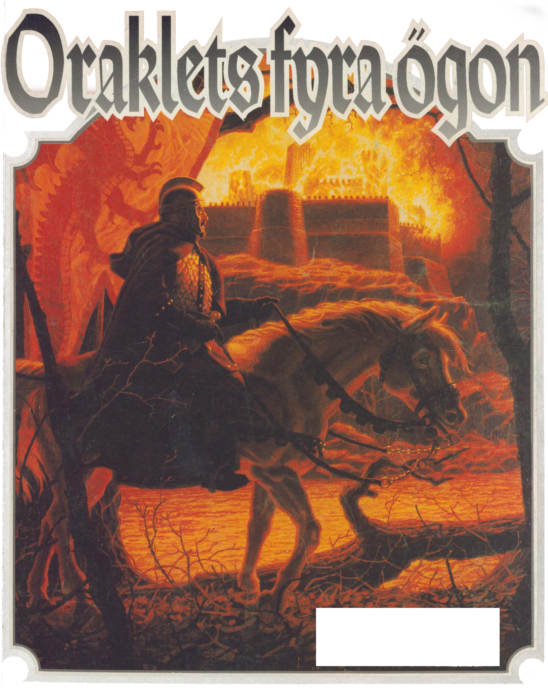

<title>Oraklets fyra ögon</title>

*På den stora trappstegspyramiden har Moskoriens främsta spåmän samlats för att tyda tecknen. Nere vid floden ränner en båt med svartklädda män i sanden. De öppnar försiktigt två urnor och glider sedan tyst bort i natten.*

*Inom någon minut klättrar röda skorpioner i hundratal uppför pyramidens vägg. Siarna har just tystnat i djup trans, när de kommer. En slav från inre Morëlvidyn har sett trädskorpioner tidigare och kastar sig handlöst över kanten. Ingen annan överlever.*

*Oraklets fyra ögon*, fortsättningen på [*Svavelvinter*](../svavelvinter/00.titelblad.html), är en äventyrsmodul i fyra delar som utspelar sig i [*Trakorien*](../trakorien/00.titelblad.html), men kan spelas fristående. En profetia, kallad Vox Ranzina, har fullbordats efter många år. Den förutsäger den femte konfluxen, en ödespunkt i tid och rum. Innan ranzinernas ledare dör visar han äventyrarna profetian som berättar om de fyra ögonen — fyra viktiga varelser som måste räddas undan okända mördare.

# 00. Titelblad

## Erkännanden

**Konstruktion:** Erik Granström
**Omslag:** Greg Hildebrandt
**Illustrationer:** Gregor Eldarb, Tobias Green, Maximilian Bech-Larsen, Håkan Ackegård
**Kartor:** Ann-Sophie Qvarnström
**Digitalisering:** Klas Lindberg

> ### För den historieintressarade
> 
> Titelbladets lista med erkännanden hade ursprungligen detta innehåll:
> 
> 
