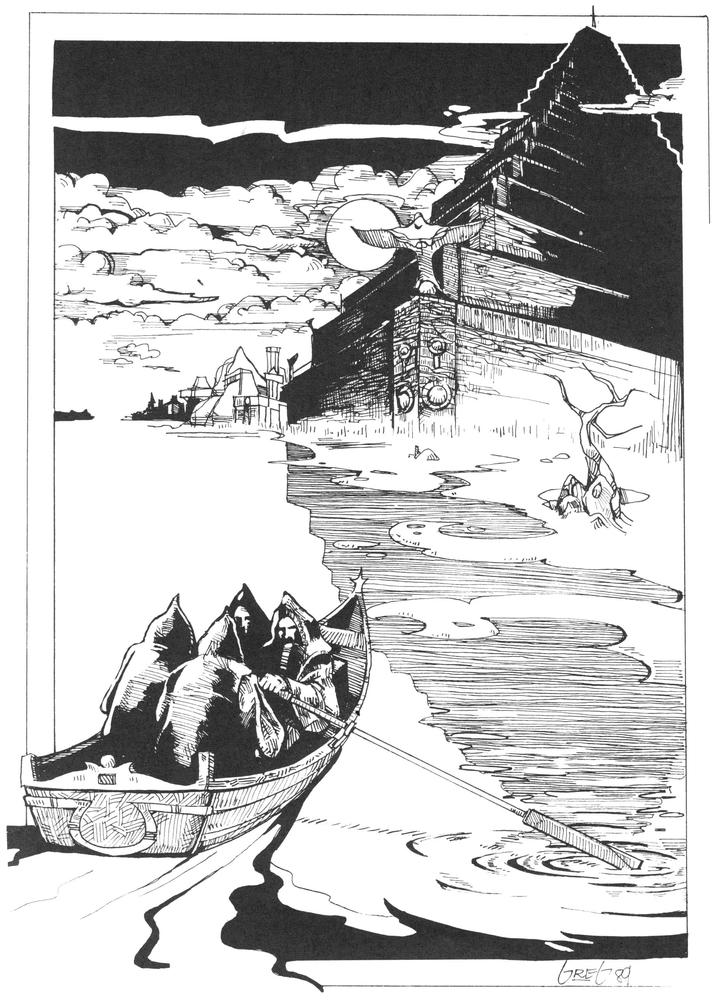

<title>Stämningsbilder - Oraklets fyra ögon</title>

# 01. Stämningsbilder

## I

Vårnatt över Fontra Cilor. En onaturlig hetta väller fram, trög som gröt, ur Fokalerslättens gryta. Flugor simmar genom den ruttna, stillastående luft som belägrar staden. En natt som denna sjuder av våld, tungsinne och onaturliga lustar, men sömnen har bara obetydligt utrymme.

På zigguraten, den stora trappstegspyramiden, har Moskoriens främsta spåmän och astrologer samlats för att tyda stjärntecknen. Många har sett hur framtiden föder stora händelser, men tolkningarna skiftar. De synska männen och kvinnorna sitter i ring på zigguratens översta platå, vaggar fram och åter. Man förenas i gemensam trans för en riskfylld färd genom etern. Slavar föser varsamt undan flugor från deras ansikten. Ögonen stirrar glasartat in i en stor röd kristall där eldarnas ljus och månskärans bild återspeglas.

Från buskarna i tempelparken gnistrar och tjuter eldcikador, dränker gatorna i ett oupphörligt fyrverkeri, men nere vid Quafachaflodens fåra är det tystare. En roddbåt klyver vattenytans slemlager. I båten sitter fyra svartklädda män. De talar inte och bär inga lyktor. Invid zigguraten ränner farkosten stäven i strandgyttjan, men roddarna sitter orörliga kvar någon stund, lyssnar efter rörelser i mörkret. Så vadar de in mot pyramidens fot. Mellan sig bär de två enorma keramikurnor som genomborrats av många små hål. Från behållarna hörs märkliga rasslande ljud. Männen lossar försiktigt de remmar som håller urnornas lock fastsurrade och drar sig hastigt tillbaka till roddbåten. Båda locken rycks av samtidigt med hjälp av linor, varpå båten tyst glider bort i natten.

Ett ögonblick är allt stilla på stranden, men snart krälar röda, krabbliknande varelser upp ur urnornas inre. Djuren är stora som människohänder. De är uppretade, klickar med käkarna och höjer hotande bakbenen mot varandra. Förvånansvärt kvickt skuttar de första ner i strandgyttjan, och inom någon minut myllrar varelserna i hundratal på strandkanten. Vattnet omger dem på tre sidor, men med sina gripklor klättrar de obehindrat uppför zigguratens vägg.

I Samkarnas djungler jagar de röda trädskorpionerna apor och kattdjur i träden. Flockvis svärmar de upp bland grenarna där bytesdjuren sökt nattvila. Med nervgiftet i gadden förlamar de sina offer, och snittar sedan upp huden för att komma åt de mjuka vävnaderna innanför. Trädskorpionen kallas också plogbagge, ty dess buksida är omvandlad till en skärande egg. När skorpionen ätit sin femdubbla vikt, omger den sig med en seg hinna och blir hängande i dvala från en trädgren tills äggläggningen kan inledas några veckor senare.

Siarna på zigguratens översta platå har just tystnat i djup trans, när slavarna ser de röda skorpionerna komma. Djuren hejdar sig någon sekund inför skenet från eldarna och höjer bakbenen mot den rubinröda kristallen, men hungern driver dem snart vidare. En slav från inre Morëlvidyn har sett trädskorpioner tidigare. Han utnyttjar rovdjurens tvekan och kastar sig handlöst över platåns kant, trots att fallet till nästa avsats är tio meter. Alla andra blir kvar. De fiesta hinner inte ens skrika.

Under morgontimmarna finner soldaterna ur tempelvakten enstaka Skorpioner på de lägre avsatserna, dit djuren rullat sedan de ätit sig klotrunda. Men flertalet är kvar invid de blodiga resterna av sina offer på zigguratens topp. Vid middagstid finner man urnorna på flodstranden, och i varje urna en stengroda, skuren i strimmig onyx.

## II
 
Ginerve, simmerskan, var ämnad för vattnet redan då hon lämnade sin mors kropp, ty hon föddes i havet av en musselfiskerska. Som barn kunde hon läsa vågorna och visa fångstmännen var de skulle kasta ut sina nät. Tången på strandklipporna berättade för henne om stormar och om skepp bortom horisonten. I sitt trettonde år fördes Ginerve som orakel till ambaquaordens vita grottor väster om Tigôld.

Den här morgonen vandrar hon som vanligt ner till de sjunkna trädgårdarna i sällskap med eunucken Ifralim. Hon lägger av sina kläder på marmorbänken medan eunucken lyfter bronsgallret som spärrar öppningen till de nedre grottorna. Rent, blått ljus strömmar upp ur vattnet från de självlysande alger som klär bassängernas väggar.

Naken dyker hon ner i vattnet och låter de sjunkna trädgårdarnas tysta, färgrika svalka omge henne. Ginerve kan stanna under vattnet flera minuter i sträck. Hon simmar ner till alkoven med den blommande havsapeln för att se om dess stora knopp slagit ut under natten. Knoppen står spänd som ett hjärta, men är fortfarande sluten. Först då hon rör vid den brister den i en blodröd kaskad. Tecknet är inte gott, ett av många ondvarsel hon mött den senaste tiden. Hon fortsätter till korallbågen med växt av genomskinlig bägartång för att höra dess åsikt. Växterna, ja själva stenarna är sorgsna och talar inte till henne. Hon förstår inte deras tystnad. En rödaktig slöja tycks sänka sig över trädgården.

Hon känner smaken av blod i vattnet. Ett dovt ljud når henne från ytan, som när ankaret från en galbalon går överbord. Då hon simmar uppåt möter hon eunucken Ibrahims välbekanta ansikte. Hans långa vita hår böljar som sjögräs runt huvudet, men resten av kroppen är kvar där uppe. Bronsgallret sjunger som en tempelklocka då det faller över grottans öppning ovanför henne. Ginerve simmar inte upp till de väntande dråparna, ty nu ser hon klart att de står med höjda spjut. Hon använder istället sin sista luft till att nå alkoven med den blommande havsapeln, plockar den röda blomman och håller den mellan sina händer. Tanken på döden skrämmer henne inte. Allt är sedan länge bestämt och hon är tillbaka vid sitt ursprung under vattnet.

Invid eunuckens kropp, från Vilken huvudet skiljts med ett enda hugg, finner man senare en liten strimmig groda av onyx. På en ingivelse från templets Kmeh'dulluh, förs kvinnokroppen aldrig upp ur vattnet, utan alkoven med havsapeln muras igen för alltid.