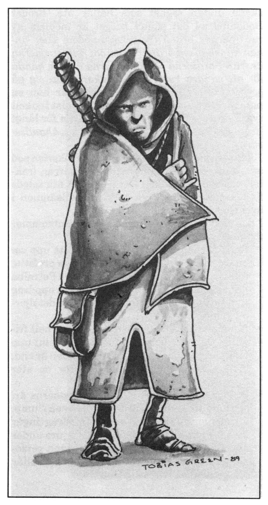

<title>Spelledarens introduktion - Oraklets fyra ögon</title>

# 03. Spelledarens introduktion

## Bruksanvisning för fristående spel

Man kan spela den här modulen helt fristående, utan att anknyta till *Svavelvinter* eller *Trakorien*, men då krävs lite förarbete och en del material blir oanvändbart. SL kan hitta på ett eget motiv till jakten på de fyra oraklen som passar in i hans egen kampanj. De fyra egentliga deläventyren, **det blå, det gröna, det vita och det röda ögat**, kan med en smula anpassning även spelas som separata äventyr. I alla fyra äventyren ska rollpersonerna med list och färdigheter ta sig förbi en mängd hinder fram till ett mål. Detta mål behöver inte vara ett orakel, utan kan vara en skatt, ett heligt föremål eller en bekant som ska räddas. Lönnmördarorganisationen RhabdoRana kan enkelt plockas ut och läggas in som motståndare i vilken kampanj som helst.

## Bruksanvisning för kampanjspel

Det naturliga sättet att spela den här modulen är som en fortsättning på *Svavelvinter*. Det rekommenderas att man använder Trakorienmodulen. Däremot klarar man sig bra utan modulen *Svavelvinter* om man läser resumén. Har han inte Trakorienmodulen får spelledaren leda spelarna till de rätta platserna på annat sätt.

### Översikt över äventyret

En profetia, kallad *Vox Ranzina*, har fullbordats efter många års mumlande av det heliga berget Ranz på Paratorna. Profetian förutsäger *den femte konfluxen*, en ödespunkt i tid och rum. Trollkarlen *Shagul*, själv en framstående astrolog, tror att den femte konfluxen kommer att äga rum på Marjura, en ö i nordhavet som han behärskar med hjälp av en armé odöda under *kung Ottar*. Shagul vill vara ensam om den femte konfluxen eftersom han räknar med att kunna utnyttja den för egna syften. För att dölja konfluxens exakta tid och plats så länge som möjligt, har Shagul givit mördarligan *RhabdoRana* order om att systematiskt avliva alla andra astrologer i Trakorien.

Några verser i Vox Ranzina antyder att Shagul ska dödas av någon som sett hans sanna ansikte. När trollkarlen kom fram ur sin grav efter femtio år under jord, visade han sig i övermod för några äventyrare. Detta ångrar han nu bittert. Han har för säkerhets skull givit RhabdoRana order om att spåra upp och avliva alla främlingar som besökte Marjura året 610 eO. Munkarna från berget Ranz letar samtidigt efter folk som varit på Marjura eftersom det finns hemliga verser av Vox Ranzina som är menade för några utvalda marjurafarare.

Trakoriska riket oroar sig över Vox Ranzina av helt andra anledningar. Några verser tycks förutsäga rikets undergång och används av Trakoriens fiender i propagandasyfte.

I **spelöppning** söker en ranzinermunk upp rollpersonerna för att varna dem för hotet från RhabdoRana. Munken vill att äventyrarna ska följa honom till Ranz för att höra Vox Ranzina. Under kvällen dyker RhabdoRana upp och äventyrarna tvingas hastigt ge sig av.

I **Ranz** anländer rollpersonerna till berget Ranz och träffar ranzinermunkarnas överhuvud Peatro Petralba. Under en nattlig attack av RhabdoRana förgiftas peatron. Innan han dör visar han äventyrarna Vox Ranzina. Versernas hemliga del berättar om de fyra ögonen — fyra viktiga varelser som måste räddas undan Shagul och hans mördare för att inte konfluxen ska falla i trollkarlens slemma händer. Peatron ger uppdraget åt rollpersonerna.

Mot djärva dåd i de fyra deläventyren alltså; **det blå, det gröna, det vita och det röda ögat**. Dessvärre har Shaguls mördare också fått tag i de hemliga verserna så det blir kapplöpning om vem som hinner först till "de fyra ögonen". Spelarna måste tolka profetians verser för att hitta de fyra varelserna, ta sig till dessa före RhabdoRana och till sist rädda dem. Uppgiften medför resor över hela Trakorien under stora faror och strapatser. Trakorienmodulen kan användas för att spela själva resandet. De fyra deläventyren kan spelas i den ordning spelarna själva bestämmer.

När spelarna vill kan de söka hjälp hos peatrons vän *Manghalde* i **Skuggornas träsk**. Manghalde är ingen annan än shagulitpatriarken Gobrugda från *Svavelvinter* som blivit religiös och nu vill hämnas på sin gamle mästare som försökt förgifta honom.

Under spelets gång slår spelledaren upp information han behöver i **referensdelen**. Här finns exempelvis uppgifter om alla viktiga personer i den ordning de dyker upp.

Spelet slutar när samtliga profetians fyra utpekade varelser är mördade/tillfångatagna av Shagul eller förda i säkerhet antingen hos Manghalde i Skuggornas träsk eller hos oraklet *Melealina* i Tocmerskogen av rollpersonerna. Vad som händer om rollpersonerna bara lyckas rädda ett, två eller tre av oraklen kommer att avslöjas i nästa modul i serien (alternativt får SL avgöra det själv). Det enda oraklet som *absolut inte* får gå förlorat är Melealina, men risken för att det sker är å andra sidan obefintlig. Spelledaren behöver inte läsa **avslutningen** förrän denna närmar sig. 

### Vad behövs? 

* Vill man spela ORAKLETS FYRA ÖGON som en sammanhängande kampanj bör spelargruppen ha tillgång till *Trakorien* för att finna svaren på profetians ledtrådar. Har man inte Trakorienmodulen får Spelledaren leda spelarna rätt på annat sätt.

* Det är trevligt men inte nödvändigt att gruppen tidigare har spelat *Svavelvinter*. Man klarar sig annars med resumén.

* Det förutsätts att Spelledaren har Drakar och Demoners grundregler, expertregler samt monsterbok I och II.

### Spelledarens förberedelser

* Om Spelledaren vill anlita en hemlig person som spelar Shagul (vilket rekommenderas), bör detta göras innan spelet börjar. Spelaren får tillgång till avsnitten om Shagul och RhabdoRana. Se för övrigt dessa avsnitt.

* Om spelledaren vill anlita en person som spelar officeren *Lugal Praanz da Kaelve* i Digeta Longa, Trakoriska rikets säkerhetspolis, bör detta göras innan spelet påbörjas. Spelaren får tillgång till avsnittet om Digeta Longa och till da Kaelves personuppgifter.

* Före spelet bör Spelledaren själv sätta sig in i avsnitten om **Vox Ranzina, Shagul** och **RhabdoRana**. Innan första spelmötet bör han läsa igenom **spelöppning** och **Ranz**. Deläventyren med de personer och varelser som dyker upp kan studeras före respektive speltillfälle. En del sammanhang kan dock klarna om spelledaren redan tidigt läser om Gobrugda i persongalleriet. Notera att personbeskrivningarna innehåller viktig information till respektive äventyr som inte dubbleras på annan plats!

* Av utrymmesskäl har ”dussinvarelser” som finns beskrivna i Monsterböckerna inte utarbetats. Inte heller vanliga vakter och soldater. SL kan använda schablonvärden ur monsterböckerna och expertreglerna sidan 73 eller arbeta fram varje varelse individuellt efter behag.

* Platser har beskrivits olika detaljerat efter konstruktörens bedömning.

### Råd till spelledaren

ORAKLETS FYRA ÖGON är en svår modul där rollpersonerna har alla chanser att stryka med. Det finns en risk att spelarna tappar modet och känner sig hopplöst otillräckliga inför sin uppgift och sina motståndare. Du rubbar knappast spelets balans Om du ibland blundar för regelboken och ger dem lite uppmuntran.

