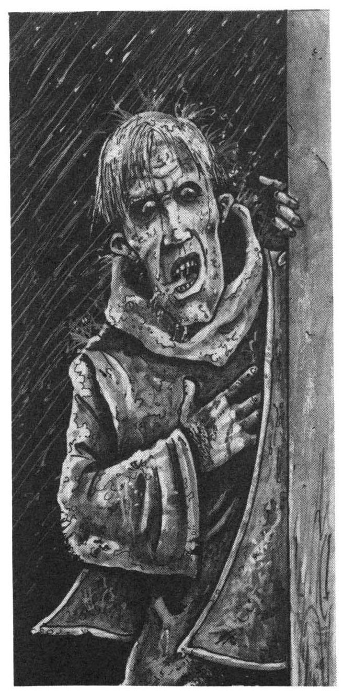

<title>Spelöppning - Oraklets fyra ögon</title>

# 04. Spelöppning 

När spelet börjar, befinner sig rollpersonerna på valfri plats i Trakorien, i sitt hem eller på sin bas under en tid av lugn. Man kanske sköter sin gård, studerar, tränar eller vilar efter tidigare strapatser. Möjligen är man ressugen och utled på stillsamheten.

## Bodonius av det sanna berget anländer

En kväll då kamraterna samlats till gille, knackar det på dörren och en vägfarande munk söker skydd undan regnet som hällar ute. Broder Bodonius av det sanna berget är medlem av ranzinernas orden *(*Kulturkännedom *eller annan kunskap om ordnar, eller om rollpersonerna är från Paratorna* => *Ranzinerna är inte kända för att vandra runt, utan brukar hålla sig på berget Ranz i Hiltre)*. På ryggen har han en packsäck och ett avlångt föremål inlindat i enkelt tyg. Detta föremål släpper han ogärna för långt ifrån sig *(*Taktik => *Föremålet är ett tvåhandssvärd)*.

Liksom på de flesta håll, är det i Trakorien sed att vandrare berättar nyheter från fjärran trakter, och sedan munken fått något att äta inleds livliga samtal. (SL kan hitta samtalsämnen i avsnittet om politisk utveckling.)

I den takt det faller sig naturligt, framkommer följande:

* Ranzinernas orden har nyligen lösts upp sedan Vox Ranzina, berget Ranz heliga profetia, fullbordats. Ordensmästaren Peatro Petralba har skickat ut bröderna på ett heligt uppdrag! som Bodonius tyvärr inte kan avslöja detaljerna kring.

* Ranzinersektens upplösning var inte helt frivillig. Delar av bergets profetia har retat upp mäktiga personer på Paratorna. Tiden är ond, men ranzinermunkarna står inför en stor uppgift.

* Broder Bodonius vet vilka rollpersonerna är, och har inte kommit till deras hus av en slump. I ranzinermunkarnas heliga uppdrag ingår att söka upp alla som besökt ön Marjura under året 610 eO. Munkarna hittar sådana personer genom att studera hamnarnas bokrullar och genom att fråga sig fram.

* Vox Ranzina innehåller enligt Peatro Petralba ett hemligt budskap till personer som varit på Marjura under året 610 eO. Ingen vet vad detta budskap innebär eller vilka mottagarna är, kanske inte ens de själva, men peatron var helt säker på sin sak. Rollpersonerna kan inte få höra Vox Ranzina nu, då Bodonius inte har någon avskrift med sig.

* Bodonius försiktighet beror på att en annan sekt, den beryktade mördarligan RhabdoRana, ”den strimmiga grodans brödraskap", intresserat sig för ranzinermunkarnas uppdrag. Flera munkar har mördats liksom personer de besökt. (Bodonius försäkrar spelarna att han varit mycket diskret då han sökt upp dem.) RhabdoRana har på sista tiden anklagats för att ligga bakom flera mord på framstående siare och astrologer i Trakorien. Motiven för dessa mord är oklara, men uppenbarligen vill RhabdoRana hålla framtiden dold.

* När han blivit övertygad om att rollpersonerna verkligen är de han söker, varnar Bodonius dem och säger att de är i stor fara. De måste genast resa med honom till Ranz för att höra Vox Ranzina, ty berget kallar. Stannar de kvar befinner de sig i yttersta livsfara. (Bodonius kan gärna beskriva några av RhabdoRanas mordmetoder för att skrämma spelarna.)

Nu säger sig munken vilja höra äventyrarnas åsikt om ett märkligt föremål. Han vecklar upp sitt paket och halar fram svärdet Ebharing, som rollpersonerna känner igen från äventyret *Svavelvinter*. (SL kan titta i *Svavelvinter* eller i avsnittet om Shagul för information). Har äventyrarna sett detta vapen tidigare? Spelarna får någon minut på sig att fundera innan fortsättningen följer *(*Vapenkännedom/Värdera vapen => *Svärdet är en nygjord kopia av gjutjärn)*.

## Bodonius anländer — igen!

*Speltipz: Ge spelarna chansen att reagera! Informera spelargruppen om att något inträffar. Ta därefter ut varje spelare i enrum tillsammans med ett stoppar, läs stycket nedan och ge spelaren lika många sekunder att reagera som karaktären har PSY-poäng. Spelaren ska ha avslutat sina instruktioner innan tiden gått ut, annars gjorde rollpersonen inte något alls.*

**Det knackar plötsligt på dörren och munken skyndar sig att linda in svärdet i tyget samtidigt som någon öppnar. I dörren står ytterligare en munk. Han är genomblöt av regnet, och lerig som om han legat på marken. Han håller sin lätt blodiga högerhand tryckt mot bröstet och andas hest. "Jag är Bodonius av Ranz. Ni är i lära...", väser han, men tystnar då han får syn på den andre munken.**

**Vad gör du?** (stoppur igång)

Munk nummer ett är en förklädd bedragare från RhabdoRana. När han får syn på den riktige Bodonius förstår han att spelet är slut och försöker fly. Om ingen av äventyrarna hindrar honom, drar bedragaren hastigt fram kopian av Ebharing och försöker ge nykomlingen ett banesår innan han flyr genom dörren ut i regnet. Står någon rollperson i vägen utdelar mördaren ett svärdshugg eller ett hammarslag (se avsnittet om RhabdoRana) för att komma fram. Om bedragaren lyckas fly, får SL räkna med att mördarna fortsättningsvis känner igen och jagar rollpersonerna. Lyckas de fånga och omärkligt föra bort mördaren, eller döda honom och skaffa undan liket, är de inte mer misstänkta än alla andra, åtminstone inte förrän RhabdoRana börjar undra var deras man håller hus.

### Fall 1 — Den riktige Bodonius blir dödligt sårad.

Den riktige Bodonius har 2 KP kvar när han raglar in genom dörren. Om bedragaren hugger honom kan han dö. Även om han dör hinner Bodonius dock uppmana spelarna att fly till Ranz och kontakta Peatro Petralba för att höra Vox Ranzina. Han varnar för RhabdoRanas mördare. Då alla tror att han redan dött, sätter han sig plötsligt upp och säger med klar röst: ”Jag ser! Låt oss förenas i Etemenanki!”, varpå han verkligen avlider.

### Fall 2 — Bodonius klarar sig.

Sedan bedragaren Hytt eller övermannats, berättar den riktige Bodonius att han var på väg till spelarna då han stacks ner av dubbelgångaren som uppenbarligen trodde han var död. Han vänder upp mördarens underläpp som är svart på insidan, nickar och berättar att RhabdoRanas medlemmar ofta svärtar sina läppar för att likna sitt skyddsväsen, demonen Ghumgakk, "hämnaren med de svarta läpparna". Bodonius bekräftar att allt dubbelgångaren sagt är sant, och att de svävar i större fara än någonsin. De måste omedelbart bege sig till Ranz på Paratorna för att träffa Peatro Petralba. Kopian av Ebharing vet han inget om. Han har aldrig sett ett liknande svärd tidigare.

**SL:** Oavsett om mördaren undkommer eller inte, kastar han ifrån sig kopian av svärdet Ebharing. Eftersom ingen annan än rollpersonerna, kung Ottar och Shagul sett svärdet, är kopian är ett bevis för att RhabdoRana har kontakt med Cruri, kanske via Shagul. På samma sätt vet Shagul att de som känner igen svärdet är de han letar efter. Hans mördare har en mängd kopior för att testa misstänkta äventyrare.

## Mot Ranz

Bodonius insisterar på att man genast avreser mot Ranz. Om bedragaren kom undan och rollpersonerna ändå stannar till morgonen , bör SL låta RhabdoRana göra minst en förberedd attack (se avsnittet om RhabdoRana i referensdelen). Om bedragaren är död eller fånge är det inte lika bråttom, Det ösregnar och tjuter av storm utanför dörren. Världen ligger öppen för äventyr...

