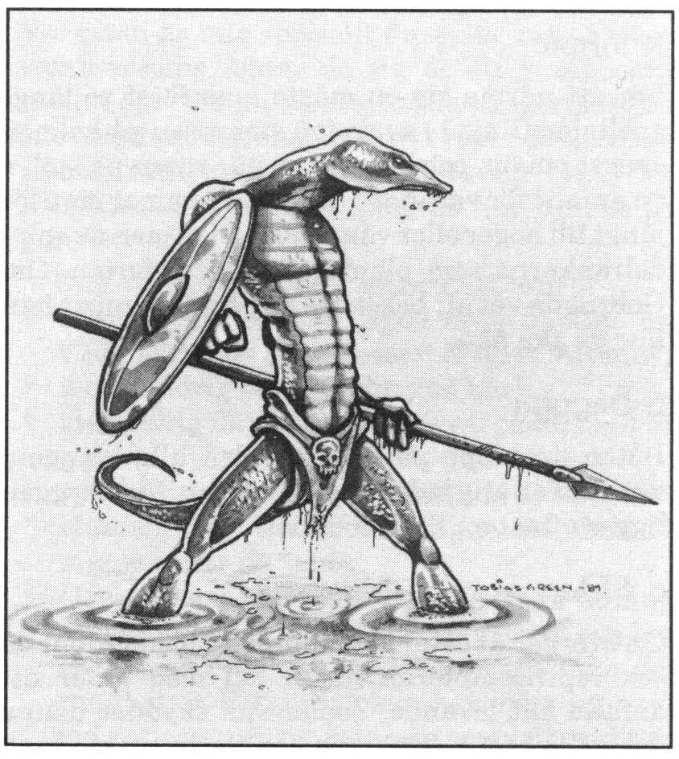

<title>Skuggornas träsk - Oraklets fyra ögon</title>

# 06. Skuggornas träsk

**Personer:** Gobrugda, Gozcana da Skugre
**Varelser:** Demonen Adgurbog

I skuggornas träsk bor shaguliten Gobrugda, den siste överlevande bland Shaguls lärjungar, under täcknamnet Manghalde. Ödet har fått honom att erkänna gudarnas överhöghet. På ett stillsamt sätt tillber han vishetens gud Enki och de ödeskrafter som verkar i berget Ranz. Hans enda sällskap är horndemonen Adgurbog och en handfull odöda tjänare. Nekromantikern är dömd att ruttna levande som straff för sin tidigare ondska, men han drivs vidare genom livet av sin nya gudstro och sitt begär att hämnas på Shagul.

Peatro Petralba på Ranz var Gobrugdas biktfader, vän och rådgivare. När peatron dog, dök den vise mannens ande upp inför Gobrugda (som ju är van att tala med de döda) och berättade vad som hänt. Gobrugda känner därför till rollpersonerna och deras uppdrag, vilket passar väl med hans hämndplaner. Han har lovat peatrons ande att hjälpa dem så gott han kan.

Under äventyrarnas färd genom träsket stöter de sannolikt på otrevliga varelser. Om SL har tillgång till *Marsklandet*, kan han med fördel lägga in ospelade småäventyr från denna modul under färden. I *Trakorien* beskrivs vidare några speciella träskmonster, däribland kråkbromsar (sid 85), som ofrånkomligt kommer att dras till sällskapet.

Slå två gånger per dag och en gång per natt för händelser i träsket:

```
1T12    Möten
1-4     Inget händer
5       Horndemonen Adgurbog får syn på sällskapet. I 30% av fallen är han
        hungrig. Gobrugda ser allt som demoner ser om han inte är upptagen.
        Det finns 50% chans att Gobrugda förstår att detta är äventyrarna
        han väntar på.
6       Sumpgasbubbla stiger ur bottnen vid båten/lägret. Gasen exploderar
        om man har öppen eld (ge personer med facklor och lampor en chans
        att reagera om de klarar ett SMI-slag) och gör då 1T6 skador på alla
        inom 5 m radie. Bräckliga föremål kan krossas/fatta eld. Båten kan
        välta.
7       1T6 Lyktgubbar (MB II sid. 94) rör sig som facklor en bit från
        sällskapet.
8       Man träffar på en hungrig (de är alltid hungriga) spindelranka
        (Trakorienmodulen sid. 85).
9       Man närmar sig en grå mareskunk (Trakorien sid. 84).
10-11   3 + 1T6 reptilmän (MB I sid. 35) på jakt överfaller sällskapet.
12      En kärlekskrank, växtätande jätteödla med abs 7 och alldeles för
        många KP blir förälskad i äventyrarnas båt och följer efter den för
        en kärleksstund. Lyckas den kravla sig upp på aktern kan den välta
        farkosten.
```



## Peatrons klocka

Peatro Petralba gav äventyrarna en klocka att ringa i. Gobrugdas horndemon hör och känner igen denna klocka på & kilometers avstånd. Har de slarvat bort klockan får äventyrarna försöka hitta på annat sätt. Kom ihåg att trollkarlen håller utkik efter dem.

## Gobrugdas ö

Gobrugda bor på en liten ö mitt i sumpmarken tillsammans med sin horndemon Adgurbog och några zombier tillverkade av döda reptilmän. Man kan åka båt dit från Malossisjön. Reptilmännen i träsket har utsett Gobrugda till sin ärkefiende eftersom ön tidigare låg i deras revir, men trollkarlen har inga större problem att hålla dem borta med sin magi, sina zombier och sitt försvar av vassa pålar och utplanterade spindelrankor. Gobrugdas enda färdmedel är en liten roddbåt. När han ska längre sträckor, till exempel för att samla örter, bärs han av horndemonen.

**Varelser:** På ön finns Gobrugdas gäst, den motsträvige Gozcana da Skugre. Gobrugda och hans horndemon är oftast på ön, men det finns 30% chans att de är ute och samlar örter och kommer tillbaka inom 1T4 timmar. Om Gozcana är ensam på ön när rollpersonerna kommer dit, kan han låtsas vara trollkarlen för att pumpa äventyrarna på information. Han måste då lyckas med *Bluff* 13.

### a Infart

För att närma sig ön måste man först ro längs enslinjen (linje 1) av de två stenrösen på holmen sydost om ön, och svänga av när rösen på själva ön är mitt för varandra (linje 2). Kommer man för långt till höger eller vänster angrips man av spindelrankorna som planterats runt infarten. Om Gobrugda vet att besökare är på infart ropar han hur de ska åka.

### b Brygga

Båten dras upp på land vid den lilla bryggan, varifrån en stig leder upp till stugan. Vid bryggan ligger oftast en liten roddbåt.

### c Mangrovebuskage

Ön övergår åt öster i ett sumpigt buskage, där de sex reptilzombierna håller till med order att anfalla allt levande. Zombierna skyddar denna del av ön mot inkräktare. De gör ingen skillnad på vänner och fiender.

### d Sötvattenkälla

En bit upp på klippan som utgör öns nordvästra hörn ligger en frisk kallkälla som fick Gobrugda att välja just den här ön. Vid källan har trollkarlen anlagt ett enkelt altare till guden Enkis ära. På altaret ligger en rökt träsksik. Från källan, som är överbyggd med plankor och en trälucka, rinner en bäck ner i träsket.

**Detaljer:** I källans djup glittrar ädelmetall. Vid närmare undersökning finner man tre statyetter; en svan av silver, en apa av guld och en delfin av platina. De är värda 30, 350 resp 450 sm. På altaret står ristat "Till honom som öser mig vishet ur det bottenlösa Abzu".

### e Mandalakammaren

Högst uppe på öns klippa ligger en liten rund byggnad som liknar ett lusthus. Från denna plats gör Gobrugda sina utflykter till andra världar. När han är "bortrest" sitter trollkarlens orörliga kropp mitt i en mandala, en magisk cirkel, som är målad på golvet. Inget annat finns i rummet.

**Detaljer:** *VARSEBLIVNING* => Mandalan är magisk. *Kunskap om magi* => Mandalan är en abstrakt bild av multiversum.

**SL:** Om någon spelare går ini mandalan känner han svindel efter 1T4 SR. Därefter tycker han att golvet böljar lösas upp i en virvel av moln. Virveln breder ut sig så att omvärlden börjar suddas ut. Nu måste rollpersonen slå ett svårt PSY-slag. Misslyckas slaget tycker sig personen falla ner genom virveln. Han fortsätter falla utan att kunna göra något åt det. De som betraktar honom ser bara hur ansiktet stelnar i fasa. Rollpersonens själ har försvunnit ut i multiversum och kan bara kallas tillbaka genom att en magiker letar rätt på honom med en TRANSFERritual. (Gobrugda kan t.ex. gå in efter honom i mandalan.)

### f Det döda trädet

Bredvid mandalakammaren står ett dött träd delvis överdraget med säckväv.

**Detaljer:** Under trädet ligger underlig djurspillning.

**Varelser:** Horndemonen Adgurbog bor under säckväven och befinner sig till 40% i trädet om Gobrugda är på ön. Om Gobrugda använder mandalakammaren vaktar Adgurbog denna.

### g Gobrugdas hus

Gobrugdas hus består av två enkla rum. Det första rummet innehåller ett stockbord med väggfasta bänkar, en underlig stol som man kan halvligga i, ett krus med märklig vätska på en hylla vid väggen (ansiktsvatten som Gobrugda baddar sig med. Vätskan ger frätskador på normal hud), och en eldstad. Rummet innanför är fyllt med laboratorieutrustning på en bänk. I ena hörnet står ett övertäckt sittbadkar, halvfyllt med svartgrön vätska som luktar formalin. Från taket hänger några trästavar med täta, tunna rispor.

**Detaljer:** *Språkkunskap* => Risporna liknar intelligenta insektoiders skrivtecken.
