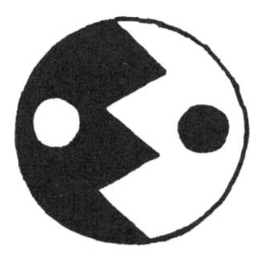
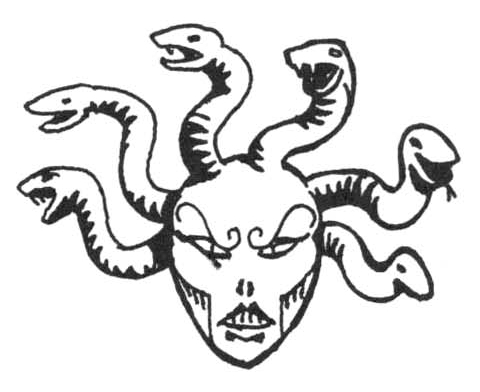
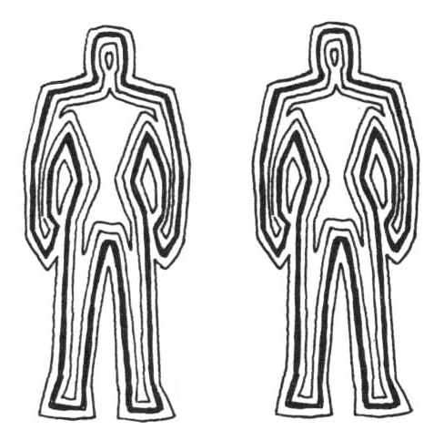
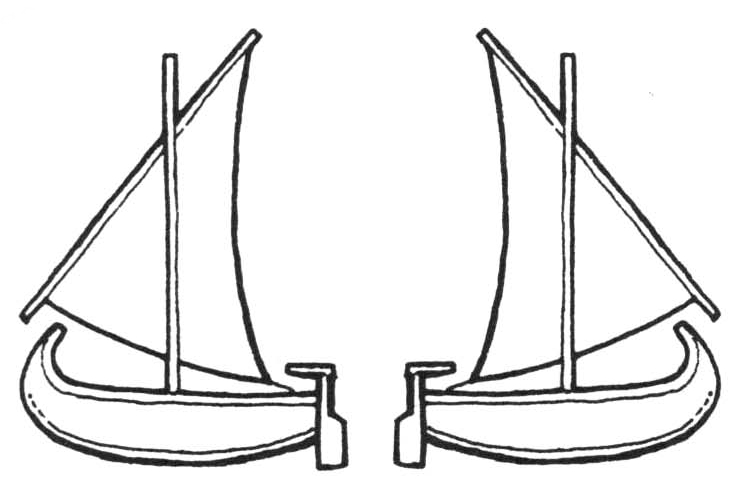

<title>Det vita ögat - Oraklets fyra ögon</title>

# 07. Det vita ögat

> *Mitt vita öga, vargskogens ödesstämma*
> *ylar orakelkäftad hymnens ord*
> *till ärans klang av ädel klav*
> *till lyckta dörrars lås en lösen*

**Personer:** Onda bettet, Kamalkus, Fundibera, Salmello, Raoga

Den vitpälsade Raoga är sierska vid Onda bettets hov i Wulferveden på Trinsmyra. Hennes profetiska ylande har under åren varnat vargmännen för många fällor och bakhåll. Någon månad innan äventyrarnas ankomst blev Raoga deprimerad och ville yla mot den uppgående solen vid havet. Hennes stamfränder tänkte att hon blivit efterlöpsk och skendräktig som honor gärna blir och skickade henne med ett par krigare till kusten i öst. Oturligt nog stötte vargmännen på ett j aktsällskap som tog Raoga till fånga. En av krigarna lyckades fly och kunde berätta att jägarna stammar från Gatves klippa, en liten ö behärskad av tvillingmagikerna Kamalkus och Fundibera. Vargmännen har själva inga skepp, men bygger nu ett dussin stora flottar för att undsätta ylerskan.

## Rollpersonerna i Wulferveden

Wulferveden är traditionellt en människofientlig skog även om vargmännen handlar med byarna vid skogsbrynet. Man sluter inga avtal eller allianser med kringliggande makter. Om äventyrarna försöker smyga sig in i skogen slås 1T20 per dag. Ett resultat lägre än (antal personer) x 2 innebär att gruppen blivit upptäckt av 1T12 + 4 vargmän. En person i gruppen får dock slå för färdigheten Kamouflage för att undvika upptäckten. Två av vargmännen ger sig genast av efter förstärkning, medan övriga stiger fram och bryskt frågar efter främlingarnas ärende. Om rollpersonerna uppträder fredligt, före de till Onda bettets hov, avväpnade och med förbundna ögon. Om strid bryter ut har försöket att finna ”det vita ögat” misslyckats, såvida inte SL i sin oändliga godhet låter spelarna hitta till Gatves klippa av en slump.

Äventyrarna kan också öppet kliva in i skogen, eller fråga en köpvarg i någon by efter ylerskan Raoga, och förs då till Onda bettets hov. Sällskapet har nytta av en vargman som tolk när de söker sig in i skogen, såvida de inte har högt FV Kulturkännedom om vargmän. Detta behöver naturligtvis inte SL informera dem om.

### Onda bettets hov — korrekt uppträdande

Vargmän är inte speciellt formella, men i större sammanhang ägnar de sig åt ett komplicerat socialt spel för att upprätthålla rangordningen. En vargman handlar intuitivt rätt i dessa situationer, men andra arter måste slå ett lyckat Kulturkännedom varje gång de har tillfälle att göra bort sig.

**Den underordnade vargmannen:**

* närmar sig med nerlagda öron (blottat huvud), slät päls och svansen diskret viftande.
* möter aldrig den ranghögres blick.
* äter aldrig förrän alla högre vargmän tagit för sig.
* visar aldrig tänderna (leenden är direkta hot). Humanoider håller lämpligen handen för munnen när de talar.
* Den extremt inställsamme (t.ex. den tillfångatagne som ber om nåd) kryper fram och lägger sig på rygg med blottad strupe inför den ranghögre. Försiktigt kan han resa sig, men vid varje varning måste han omedelbart kasta sig omkull igen.

**Den överordnade vargmannen:**

* gör sig så stor och lurvig som möjligt, med öron och svans höjda.
* får när som helst hota en underordnad genom ett skenutfall med blottade tänder. Emellertid måste han omedelbart avbryta hotet om den andre visar underkastelse. Vargmän reagerar starkt om någon slår den som lagt sig, eftersom ett sådant beteende hotar stammens stabilitet.
* tar alltid för sig av det bästa först. Man förstår sig inte på artighet.
* Biter aldrig en valp.

**Tillgivenhet visar vargmän genom att:**

* lägga händerna på varandras axlar och yla
* vifta på svansen
* inbjuda till lek genom att närma sig med glada hopp eller klappa med händerna i bordet framför sig.

**Övrigt:**

* Icke-hotande jämbördighet visar man genom att ignorera en annans hot med en lätt morrning. Detta betyder ungefär: ”Det där får vi göra upp en annan gång. Jag har annat att göra just nu!” Detta är ett lämpligt sätt att bemöta exempelvis vakter.
* I dörren till större salar står ofta en urinstinkande pelare. Hanliga gäster förväntas pinka på pelaren, varefter en speciell dörrsniffare identifierar och annonserar gästen. Okända besökare annonseras bara som ”främlingar”. Vargmän kan ibland lukta på varandras mindre trevliga delar, vilket anses helt normalt. Eftersom andra folk ogillar denna sed brukas den sällan utanför slutna vargmannakretsar.

Rollpersonerna kan välja att hävda en högre eller lägre rang, men den som uppträder för kaxigt kommer lätt i slagsmål. Vargmännen har dock viss kännedom om världen och inser att även pälslösa varelser kan ha inflytande.

### Onda bettets berättelse

Om man lyckas ta sig fram helskinnad till Onda bettet berättar hon via tolk vad som hänt ylerskan Raoga. Onda bettet har i sin nåd valt att träffa rollpersonerna eftersom Raoga förutspådde att pälslösingar skulle söka henne. Vargmännen låter rollpersonerna göra ett försök att frita Raoga om dessa verkar vara förtroendeingivande, men gör sig samtidigt klara för strid. Vargmännens Hottar är klara inom sex dagar och då tänker man storma tvillingmagikernas fäste på Gatves klippa.

Om äventyrarna övertygar Onda bettet om att Raoga är i fara, och att de vill hjälpa henne, så får de gå, kanske i sällskap med 1T12 dugliga vargkrigare om Onda bettet (dvs SL) tycker att de behöver förstärkning. För att komma till Gatves klippa måste man hyra eller stjäla en båt vid kusten. Det finns ingen reguljär transport.

## Gatves klippa

Gatves klippa är en liten holme öster om Trinsmyra. Ön betalar skatt till Trakoriska riket och tar emot fartyg för proviantering men eftersom hamnen är dålig saknar den större strategisk betydelse. På Gatves klippa härskar tvillingmagikerna Kamalkus och Fundibera, två excentriska samlare med en tvivelaktig bakgrund i Laabnes kustbyar. För ett tiotal år sedan köpte de det förfallna citadellet på Gatves klippa och lät rusta byggnaden för stora mängder guld. En resande köpman eller magiker från öarna har antagligen hört talas om dem, eftersom tvillingarna är mycket intresserade av magisk forskning och underliga föremål, särskilt speglar. Kamalkus ska dessutom vara en utomordentlig skulptör. Syskonen betraktas som lite udda men oförargliga.

Chansen att magikerna befinner sig på ön vid ett givet tillfälle är: Kamalkus 85%, Fundibera 45%. De är ibland på resa i någon annan värld. Fundibera gör också regelbundna turer till Vumbra och Tricilve.

### Inför äventyret

Vargmännens flottar med sextio hämndlystna krigare anländer 1T4 dagar efter äventyrarna. Om inte Raoga befriats innan dess är risken för blodbad överhängande, vilket spelarna bör känna till för att sättas under press. Rollpersonerna bör hinna göra ett eller flera försök att med list och i smyg befria vargsierskan. Misslyckas de, kan de istället försöka byta till sig fången mot något bättre magiskt föremål (Rirbas spegel från Svavelvinter är hårdvaluta). När vargmännen dyker upp kan man söka hindra dem från att genast slakta alla på ön med Övertala. Med en lyckad övertalning köper rollpersonerna några timmars respit för ytterligare ett försök, nu med hjälp av så många krigare de vill ha. I sista hand kan man hota öborna med att ön kommer att skövlas såvida inte fången släpps fri. Eftersom magikerna anser sig ha rätten på sin sida kommer de inte att ge vika för hot utan barrikaderar sig i citadellet, vilket lämnar byborna åt vargmännens vrede. En pressad men intressant situation uppstår.

Om äventyrarna vill agera i hemlighet, kan de gömma sig i snårskogen på öns södra del, eller i Fundiberas stängda balsal utanför byn. Det är emellertid omöjligt att utan magi dölja ett skepp vid ön eftersom fiskare dagligen seglar i alla väderstreck. En vacker, främmande kvinna som dyker upp i byn utan förklaring kommer att hälsas med stor vördnad, eftersom man tror hon är Fundibera (se beskrivningen av henne). Varken magikerna, soldaterna och byborna på ön kommer att hota någon som på ett fredligt sätt kräver vargkvinnan fri.

Om vargmännen ser att Raoga blivit tokig, kan de vända sitt raseri mot byborna eller mot äventyrarna såvida de inte omgående får trollkarlarnas huvuden på ett fat.

### Byn

Fiskebyn vid hamnen hyser något sjuttiotal familjer och ett tiotal trakoriska soldater under befäl av hamnjunkare Mikaklis. Denne Mikaklis ledde jaktlaget på fastlandet och kan pekas ut av den överlevande vargmannen. Soldaterna sköter till vardags fyrbåken, rapporterar om sjöfart och antecknar passagerare och last på anlöpande fartyg. (Sådan visitation kan undvikas med mutor, lämpliga dokument eller en förnäm titel.) Folket i byn är vana att se underliga främlingar med ärende till ”tokarna på klippan”. Man lyssnar gärna till historier från världen i förrummet till det lokala Anxaliskapellet vilket också tjänar som taverna. Fundibera har i byns utkant låtit uppföra en stor timrad sal, utvändigt prydd med främmande träornament där hon ibland underhåller gäster vid påkostade baler. Byggnaden verkar helt felplacerad i byn och står låst till vardags. (Ett utmärkt gömställe således.)

Många äldre bybor tar avstånd från magikernas luxuösa liv. Flera av dem var med vid ombyggnaden av citadellet och kan berätta var de dolda avdelningarna ligger om man vinner deras förtroende. Även de som ogillar Kamalkus och Fundibera inser dock att de rika tvillingarna fört mycket gott till den tidigare fattiga ön och deltar inte i några konspirationer.

Det finns 25% chans att ett halvstort handelsskepp från Vumbra eller Siola ligger för ankar utanför piren.

### Citadellet

Citadellet ligger på öns högsta punkt och består av ett grönmålat stentorn omgivet av en c:a fyra meter hög stenmur. På den lilla öppna gården bor ett halvdussin tjänare i trähus byggda mot murens insida. Två soldater patrullerar gården nattetid.

### Ingångsnivån (+4m)

**Överblick:** Efter att ha klivit uppför en fyra meter hög stentrappa på tornets utsida finner man en kraftig, järnbeslagen ekdörr som oftast står öppen dagtid. Innanför finns ett helt runt rum med stenväggar och välvt stentak vilande på tre bastanta pelare. Omedelbart till vänster om ingången fortsätter trappor upp till en lucka i taket, men längst in i rummet finns en stor spis omgiven av köksutrustning. Mellan spisen och dörren står två träbord och bänkar där tjänarna äter. I rummet finns också en tunna och en kista.

**Varelser:** 80% av tiden finns mästersmakaren Crapico, kockan Poluvia och en eller två kökspigor i rummet. Magikernas omfattande och avancerade kosthållning tar upp större delen av deras tid. Nattetid sover kvinnorna vid spisen. Vid måltider samlas alla tjänare och de två vaktande soldaterna runt borden. Vakttjänsten vid citadellet är mycket populär p.g.a. den goda maten. (En mästersmakare är en person som inte själv befattar sig med matlagning, men som hittar på nya avancerade rätter. Yrket kräver lång träning och höga FV 1 Provsmaka, Örtkunskap och Värdera råvaror.)

**Detaljer:** Kistan är olåst och innehåller sovmattor och filtar. Nära spisen finns en låst golvlucka till vilken Poluvia har nyckeln. (Låset har SG 8. Luckan har 80 KP.) Luckan till nästa våning är olåst 85% av tiden, men kan barrikaderas uppifrån med en tvärslå. (Luckan har 40 KP, men attacker nerifrån halveras p.g.a. svårigheten att få kraft i slagen.) Ett litet rep leder upp genom taket bredvid luckan. Drar mani det hörs pingel ovanifrån.

### Magikernas arbetsrum (+7m)

**Allmänt:** I arbetsrummet tillbringar tvillingarna dagens lugna timmar med studier, avkoppling eller enklare experiment.

**Överblick:** Genom luckan kommer man upp i ett runt rum med timrat tak och stenväggar genombrutna av skyttegluggar där glasfönster monterats in. Glasen får rummet att skimra i mångfärgat, dunkelt ljus. Omedelbart vid uppgången hänger en bjällra som ljuder diskret om någon drar i repet i undervåningen. Till höger står ett runt matbord ständigt dukat med utsökt vin och goda tilltugg under en vävtapet föreställande jakt till häst. Alla andra väggar kläs av hyllor for bokrullar. Längre bort finns en mindre laboratoriebänk med urnor och läderpåsar. Rummets östra, bortre del domineras av ett jättelikt skriv— bord kluvet av ett tre meter högt skovelhjul. På skrivbordet glittrar en hög blandade guld- och silvermynt. Till vänster om uppgången står en vacker harpa och flera andra mindre instrument hänger på väggen. Golven täcks av tjocka djurfällar.

**Varelser:** Nattetid ingen. Dagtid 25% Fundibera, 40% Kamalkus (om de alls är på ön), 25% någon tjänare eller musiker. Detaljer: I taket finns en cirkelrund trälucka som inte kan rubbas (den är barrikaderad uppifrån.) Skovelhjulet är ett bokställ, som snabbt låter läsaren snurra fram den volym han vill konsultera. På skrivbordet bredvid skovelhjulet står en bronsstatyett, en häst som hela tiden nickar med huvudet medan ett silverhjul med en fluga på snurrar runt den. Hästen är en experimentell evighetsmaskin som åtminstone inte stannat än.

Mynten på skrivbordet är totalt 25 guldmynt (trakiner) och 180 silvermynt (silverdecaurer). Högen ser ut som bete i en fälla, men är helt enkelt den slarviga Fundiberas handkassa. Bredvid högen ligger en lek med tarotkort för enklare Spådomar.

*Värdera pälsverk / Jakt / Kulturkännedom / personen är vargman* => en av golvpälsarna är det nyberedda skinnet av en vargman.

*Finna dolda ting* => Mitt i rummet finns en taklucka, Luckan är alltid barrikaderad uppifrån.

*Varsebli* => Fönstren, som går att öppna, har vart och ett två osynliga, magiska SIGILL.

Biblioteket är välutrustat och behandlar elementkemi, drogkunskap, grundläggande besvärjelsemönster m.m., men innehåller inga unika skatter.

*Värdera böcker* => varje volym väger 1 BEP och är värd c:a 500 sm. Det finns trehundra rullar och böcker. Skrifterna ger inga ökningar i färdigheter, men kan användas för att utrusta ett laboratorium för magisk forskning. (Motsvarande värde får dras av kostnaden för laboratoriet).

**SL:** Vargmannapälsen härstammar från Raogas väktare som dödades i samband med jakten på fastlandet.

Varje fönster har två SIGILL. Det yttre SIGILLet binder en E3 MÖRKER, tänkt att förinta inkräktare som försöker ta sig in via formeln LJUSVÄG. Det inre sigillet binder en E4 TELEPORTATION som sänder en inkräktare till cell e i källaren. Eftersom E4 TELEPORTATION bara kan transportera bort STO 12, påverkas inte större personer trots att SIGILLet upplöses då de passerar. (Men det blir mörkt...) SIGILLen är inte permanenta.

### Magikernas privata kammare (+10m)

**Överblick:** Det cirkelformade stenrummet lyses vackert upp genom sex gula glasfönster. Personer av STO 12 och mindre kan klättra in genom dess a. Runt väggarna finns fem buckliga speglar upphängda, varvat med målningar direkt på väggen och tre vackra marmorstatyer av människor i naturlig storlek. Golvet täcks av fällar och en tjock matta. Åt sydost och nordväst står två stora himmelssängar, fullastade med svällande bolstrar. Åt sydväst finns en övertäckt piedestal, och åt nordost ett upphöjt glasskåp med en tornmodell av jade. Tornet har tre våningar och står på en sockel.

Rummet har inga synliga utgångar.

**Varelser** (om magikerna alls är på ön): Dagtid: Kamalkus 25%, Fundibera 7 %. Nattetid: Kamalkus 95%, Fundibera 65%. Förutom magikerna får bara speciellt utvalda kurtisaner tillträde till sovkammaren, och förs då in genom golvluckan.

**Detaljer:** *Finna dolda ting* => I rummets mitt hänger talja och block från taket. Rakt under blocket finns en reglad lucka i golvet. Den syns bara om man rullar undan mattan.

*Varsebli* => Varje fönster har två magiska SIGILL.

Glasskåpet går att öppna, liksom tornmodellens tre avdelningar och sockeln. I modellens översta utrymme finns lika många små silverfigurer som antal personer i rummet. Vid noggrann undersökning ser man att figurerna i översta avdelningen faktiskt liknar just personerna i rummet.

**SL:** Speglarna är bucklade med flit, eftersom Fundibera är barnsligt road av att betrakta sin vanställda bild. (Hon påstår att det påminner henne om världen skenbara natur, ett svepskäl för att få sig ett barnsligt skratt)

Fönstren har samma typ av magiskt skydd som i våningen under.

Tornmodellen är ett magiskt hjälpmedel för snabb förflyttning från citadellets övervåning. Varje silverfigur är en förtätad, immateriell bild av någon människa som befinner sig i rummet. Flyttas en figur till ett annat rum, teleporteras genast personen till motsvarande rum i citadellet. Sockeln motsvarar källaren. Teleporteringen motsvarar effektgrad 6. En person som inte accepterar förflyttningen får göra motstånd enligt gängse regler. Misslyckas därvid förflyttningen löses silverfiguren upp i flyttarens hand och en ny materialiseras på den gamla platsen. Lyfts någon figur längre bort än en meter från modellen upplöses den likaså och nybildas på samma sätt.

Om SL vill göra det lite svårare, kan bara människor ses och flyttas i modellen. Detta innebär att man inte kan fly med vargkvinnan Raoga genom att använda modellen i källaren. (Hon är ditteleporterad av magikerna.)

Tornmodellernas funktion är knuten till platsen där de står. Flyttas en tornmodell fungerar den inte längre och silverfigurerna löses upp. Om man vill ställa tillbaka den, måste personen lyckas med både ett svårt SMI-slag och ett svårt INT-slag för att hitta den exakta platsen där modellen ska stå för att fungera igen, och varje person får bara försöka en gång. Varsebli visar dock magikern den exakt platsen automatiskt.

### Citadellets källare (-4m)

**Allmänt:** Då magikerna byggde om källarplanet murades alla ingångar igen för. att skydda deras mest privata ägodelar. Detta väckte naturligtvis visst uppseende bland byggarbetarna i byn, som därför minns hur det ser ut. Man kan bara ta sig dit genom att bryta upp någon av de igenmurade väggarna, genom teleportation eller genom att formförändrad ta sig in via cellfönstret i cell e.

### Skafferi a

**Överblick:** Sedan man forcerat den låsta golvluckan i citadellets ingångsplan, kan man vandra nerför en spiraltrappa och via en olåst dörr komma in i skafferiet. Här finns alla läckra råvaror man kan önska till ett förnämligt kök, såsom mjöl, falsk opiander, smör av klippkrälare, kokt kråkbroms i eget spad, rökta lämmeltassar, syrad isterulk med langockermos och mycket annat. Förrådet innehåller också en trälåda med sjutton facklor.

**Varelser:** Det finns 10% risk per timme att Poluvia går ner i skafferiet dagtid. Har man verklig otur (2% risk per timme) kommer Kamalkus invandrande genom väggen från Vinkällaren med det krus vin han vill serveras till middag. Han nyttjar därvid formeln JORDVÄG, såvida han inte bara teleporterar in kruset och hoppas att det hamnar på en hylla.

**Detaljer:** Östra väggen skiljer sig från övriga. (En typisk äventyrare tror säkert där finns typiska lönndörrar)

Om rollpersonen är dvärg eller känner till byggnadskonst => väggen är nyligen uppmurad och ca två dm tjock.

**SL:** Med lämpliga verktyg och stort oväsen kan man på 30 minuter bryta sig igenom väggen. Ljudet skulle kunna dämpas magiskt.

### Vinkällare b

**Allmänt:** Vinkällaren besöks normalt bara av Kamalkus och innehåller verkligt rara drycker.

**Överblick:** Genom den olåsta dörren i östra väggen kommer man in i ett svalt utrymme med angenäm doft. På väggen rakt fram sitter en lamphållare med en fylld oljelampa. Till höger ligger sex tunnor staplade medan vänstra och delar av bortre väggen är dold bakom en ställning med hundratals halvliterskrus.

**Varelser:** Om Kamalkus är i citadellet finns det 3% risk per timme att han kommer in i vinkällaren.

**Detaljer:** Värdera drycker => Två tunnor innehåller gott öl, och de andra ett utmärkt bordsvin från Balgumél. Krusen utgör en mycket dyrbar samling förnämliga viner från Kopparhavets kustländer. Där finns fem krus à 50 gm, trettio krus värda 10 gm styck och trehundra krus värda c:a 1 gm styck.

På en särskild hylla ligger fyra kopparbehållare. Drogkunskap => I behållarna finns sammanlagt fyra doser sarassos och fyra doser stjärnedryck.

**SL:** Drogerna används vid tvillingarnas livsförlängningsritualer.

### Hall c

**Allmänt:** I hallen in till muséet och ”gästrummen” har tvillingarna lett in gas från en naturlig källa under ön. Gasen används till belysning, men också som fälla för inkräktare.

**Överblick:** Den som teleporteras till källaren med hjälp av tornmodellen hamnar vid krysset i hallen. Vid kortänden finns en olåst dörr in till vinkällaren och ett glasskåp med en tornmodell liknande den som finns i trollkarlarnas privata kammare.

Det är varmt och torrt. Eld flammar väsande ur drakhuvuden skulpterade i sten längs hallens sidor. Mitt emot varje drakhuvud står en skulpterad stenkrigare med svärdet höjt.

**Detaljer:** Vid närmare undersökning + lyckat *Finna dolda ting* => Svärdsarmen på den första och sista statyn är rörlig.

*Upptäcka fara* => Alla statyerna utom den första och den sista, som inte har något drakhuvud mitt emot sig, har sotiga fläckar.

Koncentration + *Finna fällor* => Flera golvstenar i hallen är instabila.

**SL:** Tornmodellen fungerar på samma sätt som den i övervåningen, men silverfigurerna finns här i sockeln.

Gasfällan: Gasflödet från drakhuvudena kan plötsligt ökas så att hallen blir ett flammande inferno som ger 1T4 + 4 skador varje stridrunda (rustning skyddar). Detta kan ske på två sätt; antingen dras den rörliga svärdsarmen ner på en av de två statyerna (dessa är förbundna så att båda antingen är uppe eller nere), eller så trampar någon på de instabila golvplattorna. Plattorna vilar på rullar som vid minsta rörelse släpper på gasen. Då golvplattorna utlöses faller även statyarmarna ner, och elden kan minskas genom att dessa förs upp igen. Det finns totalt tolv rörliga plattor. Har man upptäckt en, kan man lätt finna och märka ut resten. Försöker man desarmera en platta genom att kila fast den, måste man lyckas med ytterligare ett *Hantera fällor* för varje platta för att inte utlösa elden. Alla plattor kan fixeras genom att ett reglage skjuts in i väggen bakom statyn vid . När magikerna själva är i källaren är plattorna fixerade, men fortfarande kan elden släppas på med statyernas armar. Om någon av magikerna är förföljd i hallen, försöker de lura in angriparna i hallen, varefter de drar i någon av armarna.

Den som hamnar i elden tappar helt orienteringen, och SL slår slumpmässigt fram personens rörelser för varje SR. Lyckas man undkomma, kan man inte utföra någon handling innan man vilat (15-FYS) minuter.

Ett effektivt sätt att spränga källaren i luften och sätta eld på hela citadellet (lämplig hämnd för den flådda vargmannen?), är att släcka alla lågorna, dra på gasen och ta sig från platsen snarast. Alla personer i källaren kommer då att efter en minut börja tappa en FYS-poäng per SR av syrebrist. Efter tio minuter slår SL för 10% chans att källaren sprängs, efter elva minuter för 20% chans etc. tills explosionen verkligen inträffar, och citadellet blir ett brinnande inferno (se modulens omslagsbild). Det bör dock finnas en rimlig chans för att magikerna varnas av gaslukten och teleportera sig ner för att stänga av flödet i tid.

### Korridor d

**Överblick:** Sedan man passerat genom en dörr, finner man en T-korsning. Den vänstra grenen tycks vara helt blockerad av ett ras, medan den högra fortsätter något tiotal meter med tre dörrar. Just till höger är manshöga speglar innefattade i korridorens båda väggarna.

**Detaljer:** *Lyssna* => ljud kan höras från någon av rummen **e** eller **f**.

Rollpersonen är dvärg/har kunskap om byggnadskonst eller gruvdrift => Raset i vänstra grenen av korridoren är inte naturligt.

Dörrarna på korridorens sidor har tittluckor, men är olåsta.

Speglarna är helt normala. 

**SL:** Stora speglar är sällsynta. En obildad äventyrare som passerar mellan speglarna kan bli skrämd av den ändlösa mängd spegelbilder han ser försvinna bortom glasens djup, såvida han inte lyckas med ett INT-slag. Han. tror kanske att speglarna är portar in till andra världar. Kom också ihåg speglarna om någon äventyrare fått en fientlig spegelbild i rum **g** och går tillbaka genom hallen.

Korridoren till vänster har blockerats med sten som inte kan fraktas undan inom överskådlig tid. I rummet bortom stenarna förvarar tvillingarna sina diamanter och sitt guld. De tar sig dit med besvärjelsen JORDVÄG. Någon annan väg in finns inte.

### Gästrum e

**Allmänt:** Innanför den olåsta dörren finns en låst gallerport till vilken Kamalkus har nyckeln. Man ser in i en luxuös boudoir med pösiga divaner, speglar, garderober och stora, stoppade tygskapelser i form av oanständiga människodelar. På ett litet bord står matrester på silverfat. En vägg av parfym antastar näsan.

**Varelser:** Kurtisanen Salmello från Fontra Cilor. Kurtisanen tror att rollpersonerna är vänner till trollkarlarna och anar inte att han svävar i livsfara. Det låsta gallret tror han beror på trollkarlarnas försiktighet.

**SL:** Låset har SG 20. Gallret har 120 KP.

### Gästrum f

**Allmänt:** I detta gästrum har Kamalkus spärrat in en remuntrapräst och vargkvinnan Raoga. Kamalkus tror med viss rätt att remuntradyrkan är en sjukdom snarare än en religion och vill prova ett speciellt botemedel från Gombitakle. Raoga hålls inspärrad i väntan på att en skicklig pälsberedare från Kharasme ska anlända.

**Överblick:** Bortom den låsta dörren råder fullständigt kaos i rummet. De enkla möblerna har staplats mitt på golvet, och först efter en liten stund märker man att två levande varelser ligger insnirklade i bråten. En obegriplig duett av varggnissel och ord som ”oi-ala utti utti oi-ala-ala utti-oi” ljuder. Mitt emot dörren finns en liten glugg genom vilken dagsljus tränger in.

**Varelser:** Vargkvinnan Raoga och remuntradyrkaren, en rund kvinna i femtioårsåldern som kallar sig Alla. Alla kommer inte att säga något vettigt alls, utan ägnar sig åt sång. Svarar hon över huvud taget på en fråga så ljuger hon och skriker i nästa ögonblick ”Alla ljuger, Alla ljuger!”. Även Raoga har blivit smittad av Remuntras lära och uppträder oberäkneligt men mer dämpat.

**Detaljer:** Från gluggen ser man ut över havet åt öster från c:a 50 meters höjd. Högst upp på högen med möbler balanserar en hink vatten som ramlar ner på den som först närmar sig såvida inte denne klarar ett SMI-kast.

**SL:** Dörren tål 100 KP och har ett lås med SG 20.

### Museum g

**Allmänt:** I museet förvarar tvillingmagikerna sina magiska skatter, och sina favoritkurtisaner förvandlade till statyer.

**Överblick:** Genom en olåst dörr kommer man in i en större sal med vitkalkade väggar. Rummet saknar lampor, men lyses upp med rött ljus från en av montrarna. Det är varmt, torrt och väldoftande. Bortre väggen döljs till stor del av ett draperi. Mitt i rummet står ett människostort föremål täckt av ett skynke. Stenskärvor ligger runt omkring och bredvid står en bänk med mejslar, hammare och andra verktyg. Till höger finns två glasmontrar, och till vänster några statyer i marmor. Bortom dessa ser man en dörr.

**Varelser:** Risken är 30% per timme att Kamalkus finns i muséet dagtid. För Fundibera är risken 20% per timme.

**Detaljer:** Under skynket finns ett marmorblock, grovt yxat till en människas storlek.

*Värdera konst / Konstnärligt hantverk* => Verktygen tycks knappast vara använda och täcks av ett dammlager. Den tillyxade stenen är amatörmässigt bearbetad. Statyerna, två vackra kvinnor och tre män, är oerhört naturlika. Vid ytterligare ett lyckat färdighetsslag inser man att de är för bra för att vara skulpturerade. Alla fem står i klassiska förföriska poser, ler och är helt nakna. Vid noggrann undersökning ser man att den bakersta statyn har fötterna insydda i läderfodral. Om lädret sprättas upp och klumpar av sönderfallande gips pillas bort, upptäcker man att statyns ben slutar i ett par skelettfötter.

Bortom draperiet finns fyra stora tavlor uppsatta på väggen. Vid närmare undersökning visar sig tavlorna vara luckor som döljer lika många manshöga speglar. På varje lucka finns en bild enligt nedan.

De fyra glasmontrarna innehåller: Ett rödlysande metallklot, en guldkrona, en bok + en handspegel och en bronsskål med blå kräm.

Dörren är olåst.

**SL:** Statyerna är kurtisaner förstenade med den andra magiska spegeln. Den bakre statyns skelettfötter beror på att personen stod med fötterna utanför spegelns verkningsområde då han förstenades.

#### Speglarna

I sitt museum har Fundibera satt upp fyra magiska speglar hon fått tag i. Speglarna är manshöga och väger 6 BEP styck. De kan inte krossas eftersom de är magiska. I ramen till varje spegel sitter ett par luckor monterade med en symbolisk bild som kan avslöja något om spegelns natur.

Skolvärde i Symbolism > 8 */Språkkännedom/Kunskap om magi/Heraldik* => Dörren visar ”dyskarma”, symbolen för motsatsernas ständiga kamp. Bilden är det välkända Yin-Yang-tecknets motsats.

*Upptäcka fara* (svårt) => Spegelbilden tycks blicka ut med visst hat mot betraktaren.

**Spegelns funktion:** Då någon tittar in i spegeln finns 30% risk per SR att ett fönster öppnas mot en annan värld, identisk med vår, fast spegelvänd. Varje spegelvarelse hatar sin motsvarighet i vår värld och söker förgöra den. Så snart fönstret öppnas (vilket inte går att märka annat med *Upptäcka fara*) angriper bilden. Spegelbilden kan sträcka sig in i vår värld, men inte kliva in i den, vilket begränsar dess räckvidd. Spegelbilden har samma vapen i händerna som betraktaren och använder dem med samma FV. Ett missilvapen låter bilden skjuta in i vår värld, en magikers bild kan kasta hans besvärjelser, etc. Om spegelbilden inte kan anfalla kommer den istället att smäda betraktaren, spotta mot den och avslöja pinsamma detaljer för andra i rummet. (Den vet allt som rollpersonen vet, också hans hemligheter.) Rollpersonen kan angripa sin spegelbild på motsvarande sätt så länge fönstret är öppet. Fönstret förblir öppet tills en av de två flyr utom synhåll för sin spegel. Då fönstret stängs försvinner samtidigt allt från spegelvärlden som trängt genom fönstret, t.ex. missiler.

Har man väl fått en fientlig spegelbild finns 30% risk att spegelfönstret öppnas även i ickemagiska speglar, ja varje gång man kommer nära en större reflekterande yta. Detta kan bli mycket besvärande, t.ex. om man lutar sig över en stilla vattenyta och plötsligt dras ner under vattnet av spegelbildens armar. Lyckas man avliva sin spegelbild kommer man fortsättningsvis inte att ha någon, vilket kan väcka misstankar hos vidskepligt folk.

*Historia/Symbolism* => Bilden föreställer ett gorgonhuvud; ett kvinnoansikte med ormar till hår. Gorgonerna är tre hemska odjur som enligt ryktet kan förstena med sin blick.

**Spegelns funktion:** Spegeln förstenar en person som orörlig ser in i den. Risken är 0% under den första SR, och därefter 50% per SR. Personen får ett PSY-kast innan han förstenas, men märker bara att något hemskt håller på att hända om han får ett perfekt kast. Den som håller sig i rörelse kan se in i spegeln utan fara (om än med viss nervositet).

**SL:** Kamalkus använder spegeln till att förstena människor vars skönhet han vill bevara. Vanligen låtsas han vilja skulptera offret. Han ber då personen inta en vacker pose framför spegeln och träna sig att stå orörlig.

Tecknen tycks föreställa abstrakta människor med flera konturer, men bilden har ingen djupare betydelse som rollpersonerna känner till. (SL kan naturligtvis låta lärda spelare få falska associationer)

**Spegelns funktion:** Spegeln konstruerades av en okänd animistmästare för några hundra år sedan och är ett utmärkt hjälpmedel för läkekunniga. Ett föremål eller en varelse som koncentrerat betraktas i spegeln kommer att ”kläs av” ett skikt i taget. Spegelbilden av en människa kommer exempelvis att i tur och ordning förlora sina kläder, sin hud, sina ytliga muskler och så vidare, vilket låter den läkekunnige undersöka inälvor och ben utan att karva med kniv. Effekten ter sig naturligtvis skrämmande för den oförberedde, och läkare brukade ställa upp sina patienter med ryggen mot spegeln för att de inte skulle bli rädda. Spelarna skulle kunna använda spegeln till att se vad som finns bakom väggarna i källarnas rum. Varje skikt, eller meter sten som ska genomskådas kräver emellertid ett lyckat PSY-slag.

Bilden föreställer som de flesta kan se två skepp.

**Spegelns funktion:** Denna spegel är helt enkelt ett teleportationshjälpmedel. Tänker man inte på något speciellt händer heller inget (kanske tycker man sig sväva över ett obestämt landskap), men föreställer sig betraktaren en plats, kommer han att först se den i spegeln och därefter förflyttas dit. Den som har PSY 11 kan flytta sig en meter bort, PSY 12 tio meter, PSY 13 hundra meter, osv. Detta innebär att en person med PSY 18 i princip kan färdas vart som helst i spelvärlden, och PSY >20 ökar räckvidden till flera andra världar. Emellertid måste personen själv ha varit på platsen dit han vill färdas, och återresan får ordnas på annat sätt eftersom spegeln inte följer med. Det finns också en risk att man inte lyckas koncentrera sig på rätt plats utan hamnar på något annat välbekant ställe dit man inte önskade komma (ett misslyckat, lätt PSY-slag innebär fel destination).

#### Montrarna

* Det röda klotet är av ett mineral hämtat från ett universum nära eldens och ljusets elementarkällor. Klotet lyser permanent med en lampas styrka men med rödare ljus, och utsänder därtill värme som en mindre kamin. Kamalkus har länge tänkt beställa ett bronsstativ till tinget, men det har inte blivit av.

* Kronan är falsk och bete i en falla för tjuvar. Om montern öppnas utlöses en E4 sövande gas som kan upptäckas med *Varsebli*, men inte med *Hantera fällor*.

*Värdera smycken eller metaller* => Man ser redan utanpå montern att kronan inte är äkta.

* Boken är ett vackert band om grundläggande Illusionism. Den som har FV<10 i Illusionism får 10 erfarenhetspoäng i skolan genom att studera verket under en vecka. *Värdera böcker* => Boken är värd 500 sm. Den väger 2 BEP.

* Spegeln i samma monter är magisk (med E1 ILLUSION, SIGILL och PERMANENS försörjd av E2 NEXUS). Den visar hur betraktaren skulle se ut om han hade KAR 18 och är således mycket smickrande för de flesta.

### Trappa h

**Allmänt:** Bortom den olåsta dörren bakom mattan i museet vindlar en spiraltrappa neråt. De översta trappstegen döljs av matrester, klädtrasor, stenflis och annan bråte, som om trappan använts till sopnedkast. Trappan snurrar ett varv och slutar i en dörr.

**Detaljer:** Den nedre dörren är fastspikad med en bräda på insidan, men kärvar även om brädan bryts loss. Uppenbarligen har dörren inte använts på länge. *Upptäcka fara* => eventuella tända facklor fladdrar. Man känner ett lätt drag om man för handen längs dörrspringorna. *Lyssna* (svår) => Man kan ana ett rytmiskt susande utanför.

Om dörren knuffas upp kommer man rakt uti luften med havets bränningar dånande mot klippan trettio meter längre ner. Den som knuffar måste klara ett SMI-slag för att inte falla ut, såvida inga försiktighetsåtgärder vidtagits.

**SL:** Tidigare ledde trappor ner från dörren till en liten pir där citadellets innevånare kunde komma och gå i smyg. Magikerna har tagit bort trapporna eftersom dörren inte ska användas. Rester av den gamla piren kan fortfarande synas.

### Skattkammare i

**Allmänt:** Sina rikedomar förvarar magikerna i en kammare blockerad med flera ton sten. De tar sig in till och ut från kammaren via besvärjelsen JORDVÄG. Spelarna kan inte ta sig dit på annat sätt.

**Skatter:** Kammaren är enkel med små lådor och säckar som innehåller enorma rikedomar; 30000 gm, 3000 sm och blandade ädelstenar till ett värde av 40000 gm, således tillräckligt för att bygga en mindre borg. Magikerna har som tidigare nämnts skaffat sin förmögenhet under resor i främmande världar, men är inte speciellt intresserade av den annat än som medel till njutning.
