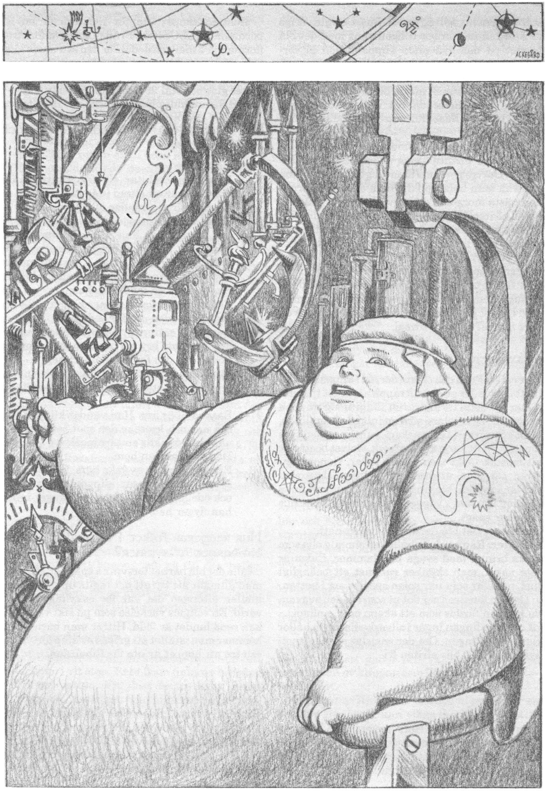
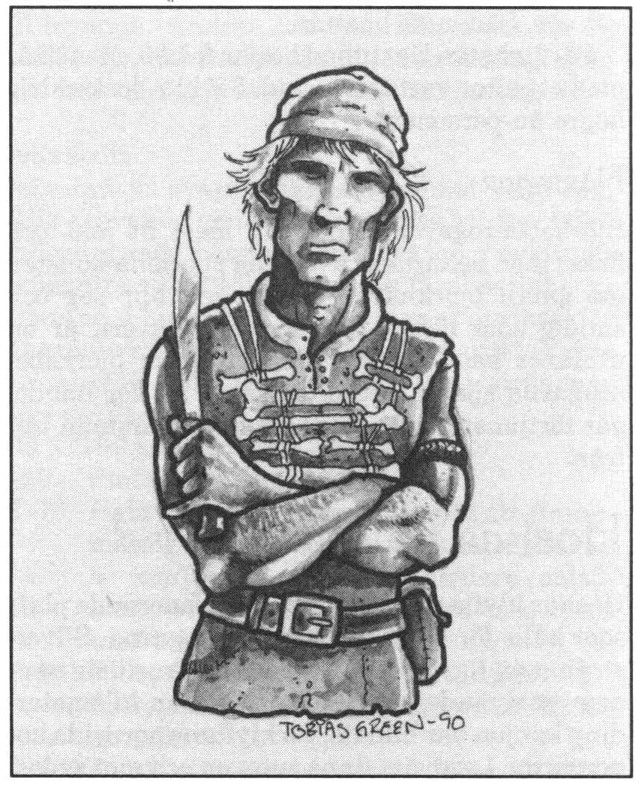
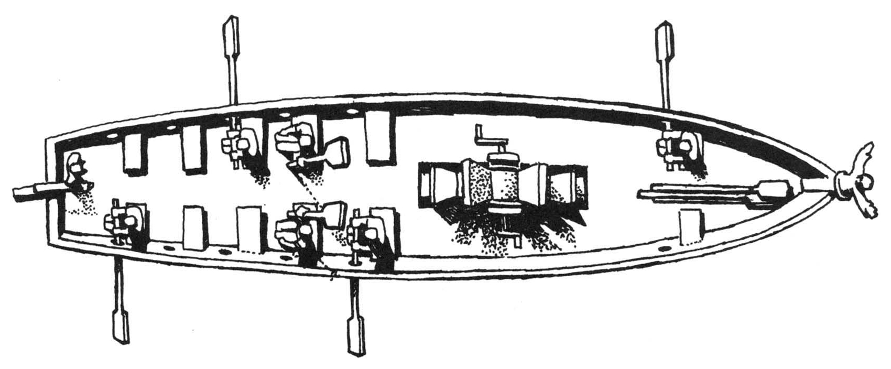
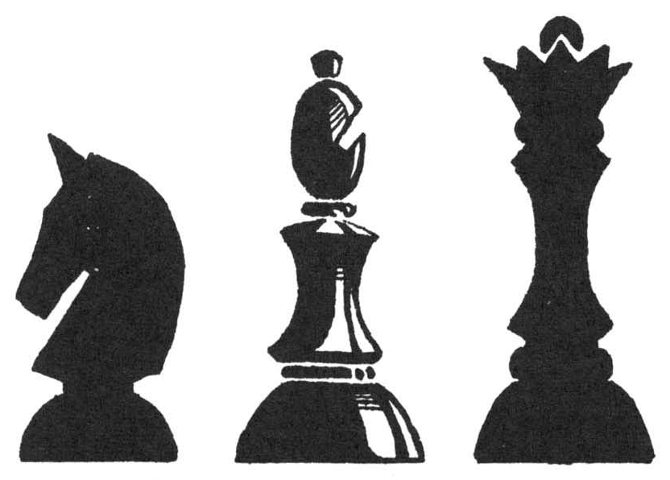

<title>Det röda ögat - Oraklets fyra ögon</title>

# 08. Det röda ögat

> *Mitt röda öga gömmes i krönta klippan*
> *Västerhavets vindar viner,*
> *drar mot söder att strida och falla*
> *döda i dödens askedalar*



**Personer:** Moliax, Godael, Bhrullist, Sigisnar av Godlar, Nastigast
**Varelser:** Bhe-yell och Ghu-Tha

## Inledning

Det röda ögat finns i de otillgängliga trakter norr om Laabne som kallas Björkrike. Längst inne i Hoskas klyfta ligger Kungsklippan där en blodig orakelsekt har sitt centrum. Äventyrarna kan ta sig dit till lands under stora strapatser, men det bästa sättet är att följa med kondottiären och köpmannen Moliax skepp till missionsstationen i Malurangu och göra en expedition därifrån. Folk i Maravelda känner vanligen till Moliax och något om björkebeningarna i Björkrike även om få varit där.

## Områden runt Björkrike

### Laabne

Ödelandet Laabne beskrivs närmare i Trakorienmodulen. Landet skövlades för nästan tusen år sedan av De grå eminenserna, en samling galna trollkarlar som förblindades av sin egen kraft. Laabne är idag ett helt dött och vindstilla land av grå askslätter och syrasjöar. Spillror av den vansinniga befolkningen lever kvar som odöda.

I Laabne gäller följande:

* Allmän magi: Halverad chans att lyckas med besvärjelser. Femdubbel chans till fummel. Lyckade besvärjelser får bieffekter som slumpartat halverad eller fördubblad effektgrad

* Shagulkloner: Landets okontrollerade kraftfält stör Shaguls utvidgade psyke. Detta innebär att Shagul inte kan kontakta RhabdoRanagrupper och att hans kloner inte kan gå in i området.

Om spelarna färdas in i staden Voag Aspede kan SL gärna lägga in ett intermezzo med odöda.

### Klagga

Vildlandet Klagga är ett tillhåll för svartfolk av olika storlekar. Sedan gammalt är svartfolken i Klagga lömskare, starkare och mer välorganiserade än i andra områden. Då och då enas hela trakten under någon trolltyrann och besvärar då folken i Lasemos och Gwondel Leigu med tunga räder. Det betraktas som rena självmordet att frivilligt gå in i Klagga. Rollpersonerna bör få varningar så det räcker i gränstrakterna och råka i rejäl knipa om de ignorerar dessa.

SL kan exempelvis låta äventyrarna förföljas av en större svartfolksstyrka i närheten av Laabne. Detaljerade grupper av svartfolk kan plockas ur snart sagt vilken annan modul som helst.

### Ferrofagerna

Palamoxi sydvästra kust präglas av elektriska fenomen, kraftiga åskväder, jordladdningar och magnetiska klippor. Mest fruktad är ögruppen Ferrofagerna som blivit många nyfikna resenärers grav. År 102 eO kalvade polarisen norr om Trakorien ett jättelikt isberg som flöt söderut ända till det tropiska Melukha, där man just försmäktade under en ihållande Värmebölja. Shamanfurstinnan blev så tacksam över köldgudarnas gåva att hon lastade en reslig guldhäst på ett nordgående skepp. Guldhästen skulle överlämnas till den eviga kölden, men fartyget som fraktade statyn förliste på Ferrofagerna. Sedan den dagen har oräkneliga äventyrare rest till magnetöarna på jakt efter guldskatten, men ingen har återvänt.

Ferrofagerna bör få behålla sin mystik, men om SL vill kan han tillämpa följande regler:

**3 mil från öarna:** Järnföremål dras med en styrka motsvarande 10xBEP järn mot öarna. Kaptenen på ett fartyg med > 70 BEP järn måste klara *Sjökunnighet* för att kunna hålla kursen. Misslyckas han kan han bara välja att segla rakt med vinden eller mot öarna.

**2 mil från öarna:** Järnföremål dras med en styrka motsvarande 20xBEP järn mot öarna. Kaptenen på ett fartyg med > 50 BEP järn måste klara ett svårt *Sjökunnighet* för att kunna segla ur zonen och då bara i vindens riktning. Det finns 30% risk per dag att järnspikar i skrovet börjar ryckas ut av kraften.

**På själva öarna:** Inga växter eller djur finns, bara svarta eller rostbruna, döda klippor. Varje levande varelse förlorar 1T4 FYS per dag tills han kommer ut i zon 2 eftersom järnet dras ur kroppen på honom. Ingen normal läkning sker. Magi fungerar inte p. g.a jordens starka järninnehåll. (En trollkarl ska dock ha undkommit på 500-talet genom att simma ut så långt han orkade och teleportera sig därifrån.) Järnföremål som sugs fast på ön rostar sönder totalt med en takt av 1 BEP/dag.

### Missionsstationen i Malurangu

På den lilla holmen Malurangu en halv dags seglats från Hoskaklyftans mynning mot havet, har merelderna byggt en missionsstation. Ett tiotal präster och lika många lärjungar från trakten driver ett sjukhus på ön. Man välkomnar främlingar, men rekommenderar ingen att stiga i land på fastlandet, inte ens bland sutarna.

Stationen drivs av översteprästinnan Godael, som är en erfaren animist. Vid missionsstationen finns också läkaren Hylakres (beskrivs ej närmare), ett halvdussin läkekunniga präster och några noviser, däribland helothanens son Bhrullist.

#### ÖVERSIKTSKARTA ÖVER ÖN

A. Missionsstationen
B. Utkik
C. Hamn
D. Fastlandet

#### KARTA ÖVER MISSIONSSTATIONEN

**A Gårdsplan.** Stationen är helt byggd i trä, med en tre meter hög palissad mot söder. Palissaden ska framför allt skydda mot rövare och raugoner. Nattetid släpps tre vakthundar ut på gården och porten barrikaderas med en tvärslå.

**B Fähus.** I huset finns en getflock, gäss och några grisar. Djurskötaren med fru och barn sover i huset.

**C Sjuksal.** I salen finns normalt 1T6+3 sjuklingar och ungefär lika många släktingar. En av de lokala noviserna fungerar som nattsköterska och går runt med en oljelampa.

**D Matsal.**

**E Altarpodium.** Från det meterhöga altarpodiet ser man både ut över sjuksalen och in i matsalen. Mitt på podiet, vilande på en urgröpt ekstubbe, finns en skärva av den heliga mereldiska ljusstenen. Skärvan är innesluten i ett glasklot, vilket i sin tur kläs av ett vitt sidenfodral. Skärvans ljus tränger genom tyget, huvudsakligen vitt, men med levande skiftningar i regnbågens alla färger.

##### Ljusskärvans egenskaper

* Missionsstationen fylls av behaglig temperatur och ljus som gör eldar och lampor obehövliga. Ljuset och värmen tycks fylla själva luften och strålar inte ut från stenen.

* Vigda Tigwalwananhängare bär en permanent E3 AURA inom huset.

* Magikunniga Tigwalwanpräster kan inte fumla med sin magi på ön Malurangu. Skärvan förser dem med kraft så att de kan kasta besvärjelser till halva PSY-kostnaden.

**F Hall.** Går man uppför trappan från altarpodiet kommer man in i en förhall till sovavdelningen.

**G Allmän sovsal.** I den stora gemensamma sovsalen placeras eventuella gäster. Merelderna har inga lås på dörrar eller sovlådor eftersom de predikar att folk ska lita på varandra. I sovsalens närmaste del bor missionsstationens vaktstyrka, 2+1T4 krigare av sutarnas stam. Här bor också de lägre prästerna och de lokala noviserna.

**H Arbetsrum och sovrum.** I den mindre sovsalen bor Godael och läkaren Hylakres. Rummet har dessutom tre skrivpulpeter där noviser och präster studerar på dagarna. I ett skåp finns ett enklare apotek, men läkekonsten bedrivs mest med ljusskärvans kraft.

**I Höskulle och grovförråd.** En jordramp leder upp till höskullen där man också förvarar basmat och grovgods.

**J Kök, K skafferi.** Via en trappa från matsalen in under altarpodiet kommer man ner till köket och skafferiet.

## Björkrike — björkebeningarnas land

I Björkrike runt Hoskas klyfta bor björkebeningarna, ett vilt skogsfolk av blandad härkomst. Stammarna söder om klyftan kallas sutare och har kargomitiskt-joriskt ursprung, medan de norr om klyftan kallas norsar och är av rent kargomitiskt blod. Enligt legenden är sutare och norsar barn av urkvinnorna Sute och Norn, två systrar som hatade varandra därför att de satt ihopväxta skuldra vid skuldra. Systrarna tjatade oupphörligt på sin fader, den mäktige stormguden Marduk, om att han skulle skilja dem åt, och till sist blev åskans herre så trött på sina döttrars pladder att han gjorde dem till viljes och högg isär dem med en ljungeld. Detta dödade omedelbart såväl Sute som Norn eftersom de hade delat på samma hjärta. Marduk sörjde som seden bjöd, men ska även ha yttrat att saken hade det goda med sig att systrarna i alla fall var tysta. Efter sitt hugg ska Marduk ha satt upp Sutes öga som solen på himlen och Norns öga som måne. De två ögonen cirklar för all framtid runt, runt varandra, men kan bara blänga i tysthet.

Liksom sina stammödrar hatar sutarna och norsarna varandra, och liksom dem är de sammanbundna, om inte annat så av vidskepelse, ty det är sagt att båda folken ska dö den dag de skiljs åt. Björkebeningarna tror att Hoskas klyfta är såret efter Marduks hugg som delade ursystrarna. Klyftan är därför en helig gemensam plats där man håller ting och marknad varje år i den sjätte månaden.

Björkebeningarna har ett starkt tabu mot järn. Man tror att metallen är förbannad. Den som vidrört järn är besmittad och tvingas genomgå plågsamma reningsritualer innan han får komma in i sin hemby igen. Detta tabu har sin grund" i landets elektriska fenomen som gör järnet livsfarligt.

### Om norsarnas och sutarnas tro

De senaste åren har norsarna kommit allt mer under inflytande av orakelkulten runt Kungsklippan. Norsarna är krigiska och grymma även i vanliga fall. Nu har de hetsats av oraklet på Kungsklippan att döda alla främlingar och är värre än någonsin. De har seden att äta sin besegrade fiendes hjärta för att binda hans ande i sin tjänst. De tror att den döde krigaren blir herre över sina besegrade motståndare i dödsriket. Av den anledningen är det bland norsar en stor sak att falla en ryktbar motståndare, medan man hellre skonar den oduglige för att inte få honom på halsen efter döden.

Sutarna har istället blivit allt mer civiliserade tack vare den mereldiska missionsstationen i Malurangu. Motsättningarna mellan folken har ökat och många gamla krigare muttrar om att man skulle utplåna båda dessa främmande kulter för att inte äventyra folkens framtid.

### En typisk björkebenisk krigare

Närheten till det oroliga Klagga liksom hotet från raugoner och fientliga stammar gör att de flesta björkebeningar är vana krigare.

**Utrustning:** Kläder helt i naturmaterial, vanligen av läder och filtad mossa. Byxor och stövlar tillverkas alltid av den garvade björknäver som givit björkebeningarna deras namn. Ofta bärs bröstskydd av sammanfogade benbitar. Fint folk kan ibland ha läderskjorta med fastsydda bronsringar och bronsskenor på armar och ben. Hjälmar är mindre vanliga.

**Vapen:** Kort pilbåge, spjut och sköld eller enhandsyxa och sköld. Metallen i alla metaller är brons.

**Skydd:** Benpansar 4, garvad björknäver 2

**Egenskaper:**
```
STY 2T6+6   SMI 2T6+6   KAR 2T6+3
STO 2T6+5   INT 2T6+2   KP  13 (typiskt)
FYS 2T6+6   PSY 2T6+5
```

**Färdigheter:** Kort pilbåge 14, Spjut/yxa 13, Duelldolk＊ 13, Sköld 13, Finna dolda ting 6, Upptäcka fara 1 1 , Kamouflage 8, J aga 9, Spåra 9, Överlevnad i Björkrike＊＊ 14, Rida klippget 12, Bastubad = FYS

＊ En förolämpad krigare utmanar ofta sin motståndare på duell med dolk, där motståndarnas högerfötter binds till varandra med ett tre meter långt rep.

＊＊ Färdigheten innebär att man känner till hur de speciella elektriska fenomenen i trakten kan undvikas.



### Styresform

Björkebeningarna indelas i klaner. Den mäktigaste klanhövdingen kallas hos norsarna lunothanen och hos sutarna helothanen. Klanhövdingarna samlas årligen vid tinget eller när thanen så bestämmer. Man tillämpar s.k. bastustyre. Alla beslut fattas då i bastun och den som lämnar bastun innan han har röstat förlorar sin röst. Inte sällan ser man två meningsmotståndare ensamma sitta kvar och slå vatten på de heta stenarna tills den ene svimmar, det enda hedersamma sättet att förlora en tvist på. Bastustyret anses förebygga onödigt pladder och tillämpas även i byarna.

### Bastubad

Bastun har en central roll i hela Björkrike. Man räknas som en rejäl karl om man står ut i bastun mer än en halvtimme.

En person kan sitta i bastun (FYS + PSY + FV Bastubad — 1T6) minuter.

Därefter måste man klara ett PSY-slag per minut för att kunna stanna kvar. Misslyckas det första PSY-slaget kan man ändå välja att stanna, men nästa gång slaget misslyckas svimmar man.

Om någon slår en kanna vatten på stenarna måste alla som misslyckas med både PSY- och FYS-slag gå ut.

En hjälte sitter alltid kvar längst. Finns det två hjältar sitter antagligen båda kvar någon timme innan de går ut samtidigt, tar ett stop öl och blir vänner. Sådan är bastun.

Färdigheten Bastubad börjar från 0, men ökar med ett efter vart femte bad. FV blir dock aldrig högre än personens FYS.

### Näringar

Björkebeningarna ägnar sig mest åt jakt och fiske, men behärskar även den speciella konsten att garva björknäver så att den blir seg och smidig som läder. Den garvade nävern är en utmärkt handelsvara, men eftersom björkebeningarna själva inte intresserar sig för handel går förtjänsten oftast till slipade affärsmän utifrån.

## Hoskas klyfta

Hoskas klyfta är i sanning en imponerande plats som hålls för helig av björkebeningarna. Silverströmmen har under årtusenden skurit sig ner i den omgivande högslätten så att en kilometerdjup kanjon har bildats. På klyftans nordsida bor norsarna, i sydväst finns sutarna och mot sydost vildlandet Klagga. Bergen runt klyftan består av lagrade, ömsom isolerande, ömsom elektriskt ledande bergarter som ger upphov till s.k. jordladdningar och stark magnetism. Det är riskabelt att klättra uppför branterna p.g.a. rasrisk, men björkebeningarna känner till flera hemliga stigar upp till kanten.

Längst inne i klyftan ligger Kungsklippan, krönt av spetsiga spiror i vit sten. Om äventyrarna försöker ta sig dit på kanten istället för i själva klyftan stöter de på stora styrkor svartfolk i Klagga eller lika stora trupper med norsar på nordsidan och tvingas antagligen vända.

*Tipz: Förebilden till Hoskas klyfta är Grand Canyon. Använd gärna bilder därifrån.*

### Karta över klyftan

#### 1 Tingsplatsen

Nere vid havsstranden vid klyftans mynning mot havet ligger tingsplatsen, där norsar och sutare gemensamt håller ting vid nymånen i årets sjätte månad. Resten av året träffas olika slags människor där och byter varor i de olåsta timmerstugorna, men den fasta befolkningen är bara ett äldre par med några får. Tingsplatsen ligger på gräsklädda ängar mot havet. De elektriska krafterna inne i klyftan når sällan hit.

#### 2 Vägskälet

Om man färdas på silverströmmens sydsida kommer man till ett vägskäl. Den ena vägen går över floden på en ranglig träbro. En skylt som pekar ditåt säger på jori och kargomitiska: ”Lång dags färd”. Den andra vågen fortsätter rakt fram med skylten ”Mot natt”. Vägen på Bodens nordsida tycks vara en omväg. Den går också förbi en populär mötesplats för jagande norsar (2b). Det finns 40% chans att man ser rök från ett jaktlag på 1T10 norsar. Vid vägskälet sitter en fåne som gärna ger värdelösa upplysningar mot betalning (Det är lätt att upplysa om vägen eftersom båda vägarna går ihop igen.)

SL: Skyltarna betyder att man kan gå den kortare vägen om man färdas på natten, men att man måste välja den längre vägen (dubbla färdtiden) på dagtid. Orsaken är att de stora men barnsliga jättarna på södra klippkanten har som favoritsport att försöka pricka förbipasserande med stora stenar.

#### 3 Borgen Lom Koranna

Vid borgen Lom Koranna skickar Hoskas klyfta en utlöpare, kallad Sekummaklyftan, in i vildlandet Klagga mot öster. Här finns flera skrevor där svartfolken kan klättra ner. För att skydda Hoskas klyfta och Björkrike från svartfolkens räder har man byggt en mindre borg och en mur tvärs över Sekummaklyftans mynning. Borgen bemannas normalt av 10+T10 krigare, men kan i orostider hålla ett hundratal man + folk i vakttornen. Det anses vara mycket hedersamt att ingå i vaktstyrkan vid Lom Koranna som består av lika delar norsar och sutar. Borgens befälhavare, för närvarande riddaren Sigisnar av Godlar, ska traditionellt vara en neutral utlänning och björkebeningarnas vän. Själva muren är sju meter hög och har obemannade vakttorn var tvåhundrade meter.

#### 4 Kungsklippan

Längst inne i Hoskas klyfta ligger Kungsklippan. Se separat beskrivning.

### Händelsen i klyftan

Slå 1T100 två gånger dagligen eller välj som det passar

```
T100        Händelse
1-35        Inget speciellt händer
36-43       Plötsligt väderomslag, slå på vädertabellen
44-55       Sällskapet bli överfallna av ett rövarband svartalfer som smugit
            sig ner i klyftan. Svartalferna är dubbelt så många som äventyrarna
            och har med sig 1T4 ulvar. De glupska ulvarna kan inte behärska sig,
            utan morrar så att äventyrarna hinner förbereda sig i 1T4 SR.
56-65       Sällskapet stöter på 1T4 norsar på jakt eller på väg från oraklet.
66-75       Sällskapet stöter på en patrull norsar. Patrullen rider på klippgetter
            och är lika många som äventyrarna + 1T4 st.
76-78       Äventyrarna kommer i närheten av en magnetitklippa (se beskrivning).
79-81       Äventyrarna kommer in i ett 1T4 km stort område med magnetitgrus (se
            beskrivning)
82-84       Äventyrarna vandrar in i ett 1T4 km stort område med svävstoft (se
            beskrivning)
85-87       Några vattenkroppar (se beskrivning) svävar förbi över vandrarna. Det
            finns 30% chans att någon faller över sällskapet.
88-90       En kaskadblixt (se beskrivning) utlöses plötsligt 1T6 km från
            rollpersonerna.
91-100      En elektrisk storm (se beskrivning) utlöses plötsligt.
```

### Speciella elektriska Fenomen

Eftersom de elektriska fenomenen i Hoskas klyfta delvis orsakas av elektriska elementarer och spillmagi från Laabne fungerar de inte alltid på samma sätt som i vår värld. Beskäftiga kommentarer om att kraftfält avtar med kvadraten på avståndet och liknande kan SL därför lugnt avfärda som vidskepelse.

#### Magnetitklippor

En magnetitklippa är svart och starkt järnhaltig. Den är kraftigt magnetisk och drar till sig järnföremål med en kraft av 10x(föremålets BEP) på trettio meters håll och 20xBEP på tio meters håll. Saker som fastnat på dess yta hålls kvar med 30xBEP. Järnföremål i kontakt med magnetit rostar sönder i en takt av en BEP per dag. Man hittar därför inga järnföremål på klippan, men drivor av rost nedanför. Klippans kraft är så stark att till och med en människa dras svagt mot den p.g.a. järnet i kroppen. Man kan dock gå därifrån utan svårighet eftersom kraften motsvarar 1 STY.

En människa i kontakt med magnetit förlorar 1 FYS per dag utan att märka något förrän han förlorat ungefär en tredjedel. *Geologi* => Personen känner till den skadliga effekten.

Ögruppen Ferrofagerna är helt uppbyggd av magnetit och liknande mineraler.

#### Magnetitgrus

Magnetitgrus är helt enkelt smulorna av en magnetitklippa. Gruset dras starkt till järnföremål. En person med järnrustning kan tyngas ner och krossas av tonvis med grus på någon minut och måste klara ett svårt SMI-slag för att hinna få av sig rustningen i tid. Gruset dras också svagt till levande varelser och man måste stanna då och då för att borsta av sig. Färdhastigheten halveras därför i områden med magnetitgrus.

#### Svävstoft

Svävstoft är svagt elektriskt laddad sand som hålls svävande genom magnetiska krafter i den underliggande berggrunden. Sikten i svävstoft är begränsad till 1T4 meter och färdhastigheten halverad. Man måste binda tyg runt ansiktet för att kunna andas. När kraftfälten i berget skiftar kan stoftet plötsligt börja röra sig i strömmar eller virvlar.

**Slå 1T100 per timmes färd:**
```
1-50        Stoftet står helt stilla
51-75       Hela stoftfältet börjar driva åt ett slumpmässigt väderstreck med
            en hastighet av 3 km/timme. Gruppens ledare måste klara ett Orientering
            för att inte luras med och komma vilse.
76-90       Plötslig sandstorm omöjliggör all förflyttning under 1T100 minuter.
            Sikten är noll.
91-100      En plötslig virvel motsvarande en E3 LUFTELEMENTAR bildas. Alla som
            inte är sammanbundna måste klara ett STO-slag för att inte irra iväg
            1T100 meter i någon slumpmässig riktning. Det är inte möjligt att
            återsamlas genom att ropa eftersom virveln dånar kraftigt. Varelser
            med STO <= 9 lyfts upp om de inte klarar sitt slag och förs 1T10 x 100
            meter åt ett slumpmässigt håll. Där faller de till marken från 1T10
            meters höjd.
```

#### Vattenkroppar

Vattenkropparna börjar som starkt laddade meterstora stenbumlingar som lyfts upp i luften av bergens kraftfält. Stenarna drar elektriskt till sig luftens vatten så att ett sfäriskt vattenklot med stenkärna växer sig större och större på 1T6 x 100 meters höjd. Klotet kan bli upp till tjugo meter i diameter och rör sig oregelbundet hit och dit innan det plötsligt faller till marken med ett gigantiskt plask, varvid stenkärnan ofta går till väders igen. Om en vattenkropp faller i närheten av äventyrarna kan de sköljas med nerför sluttningarna såvida de inte klarar ett svårt SMI-slag. Hur som helst blir de rejält blöta.

#### Kaskadblixt

Bergarterna runt Hoskas klyfta ligger lagrade på varandra. Vissa av dem leder elektricitet medan andra istället isolerar. När berget rör sig djupt därnere, eller när åskan går i bergen, uppstår gigantiska laddningar i jorden. När laddningarna blir tillräckligt stora, kan blixtar spontant slå ut mellan klipporna. Den första blixten löser ofta ut flera som sprider sig längs klyftans väggar i en gnistrande kedjereaktion. Samtidigt ekar klyftan av ett öronbedövande dån som infödingarna kallar ”Marduks röst”. Kaskadblixten sprider sig längs klyftan med en hastighet av 1 km i minuten, men är oftast begränsad till ett par bergarter som skiftar från gång till gång. Man vet på vilken sorts stenhäll man ska sätta sig i säkerhet om man lyckas med ett Överlevnad- -Björkrike. Gamla vildmarksrävar kan känna på lukten när en kaskadblixt är på gång och ser på blixtarnas färg vilka bergarter som är inblandade. Den som inte gör något alls löper 50% risk att drabbas av blixten, vilket ger skada som en E5 BLIXT. Offret måste vidare klarar ett FYS-slag för att inte förlora medvetandet under 10 + 1T100 minuter. Fumlar han drabbas han av hjärtstillestånd och kan bara räddas om någon lyckas med ett svårt Läkekonst vid första försöket. Rustningar skyddar inte mot elektricitet, men isolering mot marken halverar skadan.

#### Elektrisk storm

Spänningarna i Hoskas klyfta utlöser ofta plötsliga stormar. Stormen yttrar sig som ett häftigt åskväder som går över på 1T4 timmar. Under stormen finns det 30% risk för kulblixtar, 30% risk för en kaskadblixt och 50% risk för 1T6 timmars massivt regn.

#### Kulblixt

Kulblixten är ett gnistrande energiklot som föds till ett kort irrande liv. Lärda män tror kulblixten är ett mellanting mellan levande väsen och energi, en elektrisk elementar, vilket alls inte är omöjligt. Den rör sig oregelbundet med en hastighet av 10 meter i sekunden och dras till främst till metall men även till levande varelser. Vid kontakt urladdas den och ger skada som en E5 BLIXT. Kulblixten kommer i första hand att söka sig till den person som bär mest metall.

## Kungsklippan

**Överblick:** Längst inne i Hoskas klyfta störtar ett vattenfall ner i en liten sjö varifrån Silverströmmen rinner mot havet. Mot bergväggen på sjöns sydsida står en c:a hundra meter hög klippa med släta glittrande ytor. Klippan kröns av spiror i vit sandsten som liknar en krona. Det omgivande berget är på flera ställen genomsatt av grottor och en större grotta öppnar sig vid klippans fot, vaktad av 2 + 1T4 krigare av norserstam. Ett trettiotal meter framför grottöppning— en är ett 10 x 1 0 meter stort område kringgärdat av en fyra meter hög palissad. Alldeles framför grottan finns en skulptur i sten som föreställer ett roddarskepp av vikingatyp. Vid sjöstranden ryker det ur en mindre, timrad stuga. På bergväggen söder om grottan finns en klipphylla där några trashankar sitter och ylar framför en eld. Från själva grottan hör man vilda tjut. Det finns 20% chans att ett sällskap tältar på platsen för att fråga oraklet till råds.

**SL:** Om äventyrarna kan flyga, bör SL tänka på att en spanare från luften antagligen får syn på det röda takfönstret i Nastigasts rum och kanske hittar passagen in till den underjordiska sjön.

### a Prästernas grotta

På klipphyllan fem meter över dalens botten bor oraklets tre prästinnor som sköter människooffren, utför diverse ritualer och förmedlar oraklets kryptiska budskap till hågade besökare. Prästinnorna är tre smutsiga, skränande häxor som dansar, driver ut demoner och rabblar underliga formler utan att för den skull besitta magiskt kunnande. Bland björkebeningar anses galna människor ofta vara besatta av heliga andar.

På klipphyllan finns en ihålig trädstam som de använder som trumma och larmanordning för att kalla på vakterna. Deras grotta innehåller bara lump, ved och diverse skräp.

### b Vaktstugan

Nere vid sjön, som har utmärkt dricksvatten, finns en liten trästuga där oraklets hedersvakt bor. Vakten består av 2 + 1T4 krigare av norsarnas stam. Stugan innehåller, förutom vakternas personliga utrustning, bara enkla träbritsar och en eldstad.

### c Offerplatsen

En port i den fyra meter höga träpalissaden kan låsas med en tvärslå utifrån. Innanför palissaden finns ett stenaltare med fjättror för offrets händer och fötter. Vid varje nymåne offras en människa till Karulgerna, bergets andar. Offret renas ceremoniellt nere i sjön och binds vid altaret över natten. I första hand offrar man brottslingar och främlingar (rollpersoner?), men vid årets första nymåne måste offret vara en jungfru. Andra dagar i månaden offrar man frukt, nötter och värdeföremål till andarna.

**SL:** På offernätterna flyger onaquierna Bhe-Yell och Ghu-Tha ner till palissaden, sliter ut offrets hjärta och slukar det. Detta är den enda föda odjuren behöver. Vanlig mat och värdeföremål här de upp till Nastigast.

### d Det heliga skeppet

Framför förgrottan står en stor modell av ett roddarskepp av vikingatyp.

*Skeppskunnighet/kulturkännedom* => Paddelhjulet mitt på båtmodellen användes när man ville glida fram tyst på stilla vatten.

Längst framme i fören står en mansfigur vänd in mot båten. I fören ligger några åror.

**SL:** Skeppet är en karta över hur man ska gå genom labyrinten för att komma till oraklet. Man börjar läsa bakifrån och rör sig fram mot oraklet i fören. Varje årpar symboliserar en skiljeväg. Skeppet utgjorde på sin tid en prövning för de som skulle invigas genom labyrinten.

**Tolkning:**
I första skiljevägen går man till höger
I andra skiljevägen går man varken höger eller vänster, alltså rakt fram.
I tredje skiljevägen tar man vänster.
I fjärde skiljevägen går man endera trappan uppåt (roddarna håller årorna resta.)
Ovanför trapporna går man till höger.
Därefter kommer kommer man till hjulet.
Från hjulet hoppar man av åt vänster.
Man fortsätter uppför spiraltrappan och kommer till oraklet.



### e Förgrottan

**Överblick:** Man kommer in i en icke-upplyst, större grotta med sandgolv och ganska släta väggar med målningar som föreställer djur och krigsscener. Grottan stinker svett och piss och ylandet från ett antal mer eller mindre vilda galningar ekar mellan väggarna.

**Detaljer:** *Finna dolda ting* (om man letar på rätt ställe) => Längst inne i grottan finns en slät stenvägg med två avlånga skåror nere vid golvet. Om man lyfter uppåt i hålen med STY> 12 åker stenväggen upp som en garageport och blottar en gång in i berget.

*Provsmaka / överlevnad berg* => Det luktar gas.

Fackla + *Finna dolda ting* => Det drar svagt vid bortre väggen. En person med järnföremål märker en svag magnetism om han klarar *Upptäcka fara*.

**Varelser:** Byarnas vansinniga placeras i grottan till Karulgernas ära. Där finns 1T8 personer som dessvärre inte blir så gamla eftersom de förgiftas av gasen. Galningarna är i stort sett ofarliga, men kan få plötsliga raseriutbrott. SL: Efter en minut i grottan halveras alla INT och PSY-färdigheter för 4 + 1T6 minuter framåt av gasen som strömmar ur grottans golv. En magiker kan inte kasta besvärjelser alls om han inte klarar ett PSY-slag med sin halverade PSY.

På längre sikt är gasen giftig.

## Labyrinten

För att inte trampa i någon fälla på vägen till oraklet måste man rätt tolka det heliga skeppet utanför förgrottan. Labyrinten byggdes ursprungligen som en prövning för särskilt utvalda krigare, men numer känner de flesta högre norsar till den och har inga problem att komma till oraklet om de först studerar det heliga skeppet en stund. Om man förhör en vanlig soldat vet han att skeppet är något slags karta, men inte mer. Oraklets grotta är tabu för alla som inte godkänts av prästinnorna.

### f Järnslukaren

**Överblick:** Bortom lönndörren finner man en 9 meter lång korridor som slutar i en T-korsning. På väggen vid T-korset sitter ett jättelikt, skulpterat varulvsansikte med spretande tänder av grön sten. På tänderna sitter ett skelett Spetsat som om man kastat det mot huvudet med stor kraft.

**Detaljer:** *Värdera ädelstenar/Geologi* => Tänderna är av jade och värda 50 sm styck. Det finns ett tjugotal och de väger 1 BEP vardera.

På golvet runt varulvshuvudet ligger rostflagor. Framför finns en bassäng med galler som botten. Rester av torkat blod har runnit ner genom gallret.

**SL:** Varulvshuvudet är skulpterat av kraftigt magnetisk magnetit. Så snart lönndörren öppnas dras alla järnföremål mot huvudet med en kraft av 20 x BEP och fastnar med kraften 30 x BEP. Föremålen rostar med en takt av 1 BEP per dag när de är i kontakt med huvudet.

### g Blindkorridorerna

Samtliga tre blindkorridorer slutar i dörrar som inte leder någon vart. Plankgolven i korridorerna är vippbräden som tippar bortåt från ingången? vid 3 BEP övervikt på bortre sidan. Den som faller ner i fällan hamnar i den underjordiska sjön trettio meter längre ner (det streckade området). Säkra brädgolv kan bara skiljas från osäkra med ett lyckat *Hantera fällor* eller magi.

### h Råttfällan

Till detta rum kommer man via en spiraltrappa som vinglar sig 30 meter ner.

**Överblick:** Man kommer in i ett smutsigt rum med två smala bronspelare. Rummet luktar mögel och väggar och golv är täckta av ett smetigt grönsvart lager. Rakt fram i rummet sitter en överväxt humanoid på ett fyrkantigt podium. På högra väggen finns en dörr.

**Detaljer:** Humanoiden är en stenskulptur av en enögd reptilvarelse. Ögat är en rödaktig, ogenomskinlig sten. Nere vid golvet finns flera små hål.

*Upptäcka fara* (om man letar vid ingången) => Innanför tröskeln finns en spricka som löper runt hela dörrkarmen. Man känner ett svagt drag från sprickan nere vid golvet.

*Lyssna* => Man hör kluckandet av vatten. Med ytterligare ett lyckat slag lokaliserar man kluckandet till golvet.

*Värdera ädelstenar* => Statyettens öga är av rosenkvarts och vård 5 sm.

**SL:** Hela rummet är rörligt och glider på de två pelarna i mitten. Rummet är upphissat 2 meter över vattenytan på den underjordiska sjön i grotta **S**. Tar man i handtaget till den bortre dörren faller rummet ner mot vattnet. Dörröppningen man kom igenom blir kvar däruppe och ersätts av en bergvägg så att man inte kommer ut. När rummet sjunker ner under vattenytan börjar vatten strömma in runt pelarnas fötter och genom hålen vid golvet. Hela rummet vattenfylls på fyra minuter.

Man kan hejda rummet från att sjunka genom att kila in en dolk eller dylikt i sprickan mellan en pelare och taket, men man kommer fortfarande inte ut. I väggen ovanför den falska dörren finns en lönnlucka som öppnas utåt. Luckan kan öppnas först när bara någon decimeter luft återstår vid taket i rummet. Innan dess går den inte fri för berget. Tar man sig ut ur rummet befinner man sig i den vattenfyllda grottan **S** (se dito).

Rummet kan hissas upp igen via vinschen på klipphyllan i grottan, men den som vinschar kan inte ta sig in i rummet när det är upphissat.

### i Dubbeltrappor

Två vackra marmortrappor går upp till korridoren ovanför. Trapporna representeras på båten/ kartan av de uppresta årorna.

### j Vippande korridor

**Överblick:** Spelarna ser en korridor, som tycks öppna sig i en stor sal.

**Detaljer:** Man känner vinddrag från ”salen” och hör ljudet av vatten.

*Upptäcka fara/Hantera fällor* => Man ser en spricka runt hela korridoren där den rörliga delen börjar.

**SL:** Hela korridoren är en vippbräda som tippar om övervikten på bortre delen blir större än 5 BEP. Allt som befinner sig i korridoren när den vippar faller fyrtio meter ner i den underjordiska sjön, varefter korridoren vippar tillbaka.

### k Löparens korridor

**Överblick:** Framför dörren till korridoren ligger isolerande trästockar. På dörren finns följande bild:



Om dörren öppnas ser man en tio meter lång korridor med ömsom vita, ömsom svarta golvplattor och träväggar. Korridoren slutar i en trädörr.

**Detaljer:** *Lyssna* => Man hör små knastrande ljud. *Upptäcka fara* => Man ser små gnistor krypa över golvet.

**SL:** Golvplattor av olika färg har olika laddning. Trampar man bara rakt ini korridoren börjar det fräsa, spraka och göra ont i fötterna. Personen måste klara både ett SMI-slag och ett PSY-slag för att inte ramla omkull. Faller man på golvet får man en stöt som ger skada som en E4 BLIXT. Offret måste vidare klarar ett FYS-slag för att inte förlora medvetandet under 10 + 1T10 minuter. Fumlar han drabbas han av hjärtstillestånd och kan bara räddas om någon lyckas med ett *Läkekonst* vid första försöket. Rustningar skyddar inte mot elektriciteten.

Dörrbilden föreställer en löpare. Man kan undvika strömmen genom att bara trampa på vita rutor (den svarta löpare som står mellan springaren och damen går alltid bara på vita rutor). Går man bara på svarta rutor klarar man visserligen korridoren, men får en stöt när man stiger in på golvet i nästa rum som har samma spänning som de vita plattorna.
  
### l Kopparrummet

**Överblick:** Redan vid dörren hör man då och då en knall inifrån rummet Öppnas dörren ser man in i ett rum med vitt stengolv, träväggar och koppartak. Längst bort i rummet sitter en 1,2 meter hög, buddhaliknande staty i vit sten. Då och då slår en blixt mellan statyns huvud och koppartaket så det dundrar. Det luktar fränt och stickande. Till vänster i rummet finns en dörr.

**SL:** Rummets golv och tak har olika laddning och blixtar slår mellan dem på den närmaste punkten som är statyns huvud. Man kan krypa igenom rummet så länge man håller sig lägre än statyn, men om man reser sig upp (eller har ett spjut som sticker upp) får man en blixt som i rummet ovan.

### m Vattenhjulet

**Överblick:** I korridoren som leder från kopparrummet är det fuktigt och man hör vatten som brusar. Korridoren slutar i en öppning ut mot ett jättelikt vattenhjul vars paddelvingar oupphörligen rör sig nerifrån och upp. Dånet är så starkt _att man måste skrika i varandras öron för att göra sig hörd. Det vore inte omöjligt att stiga in på en paddelvinge och åka med uppåt, men vem vet var man hamnar?

**Detaljer:** *Finna dolda ting* (svår och om man letar på rätt ställe) => Man finner och kan öppna en lönndörr i den vänstra väggen.

**SL:** Om man åker med uppåt på en av hjulets vingar kommer man efter bara ett par meter till en avsats rakt fram och en avsats åt vänster. Man hinner inte fundera utan måste omedelbart bestämma var man stiger av. Tvekar man åker man med hjulet runt och hamnar i floden som driver det på andra sidan. I detta fall sköljs man med ner till den underjordiska sjön och får 3 x 1T4 skador under den omilda färden. (Rustning skyddar dock mot var och en av de tre tärningarna.)

Avsatsen rakt fram är en fallucka som omedelbart förpassar en besökare ner i floden mot sjön, medan avsatsen till vänster är fast. Genom en dörr kommer man in i en torrare korridor. Hur man än beter sig blir man genomblöt inne vid hjulet.

### n Lönnkorridor

**Överblick:** Innanför lönndörren finns trappor upp till en vanlig dörr.

**SL:** Lönntrappan är byggd för att de invigda torrskodda ska kunna ta sig förbi vattenhjulet och för att man ska kunna ta sig tillbaka igen. Den övre dörren är inte gömd.

### o Spiraltrappa

**Överblick:** Spiraltrappan leder uppåt varv på varv, totalt 50 meter.

### p Oraklets förrum

**Överblick:** Man kommer in i ett vackert målat rum med en brinnande fackla på högerväggen över ett bord med allehanda silver- och bronsföremål bland fruktskal, benbitar, små snidade träfigurer, en halväten fisk, en kanna utsökt vin och lite spridda hasselnötter. Under bordet har man stuvat in smutsiga dunbolstrar. Rakt fram ser man en dubbeldörr i ädelträ och till vänster en vanlig dörr.

**Detaljer:** Framför dörren till vänster hittar man underlig djurspillning; små rödaktiga harkulor som det kryper maskar i. *Zoologi/Jakt* => Spillningen kommer inte från något djur från vår värld. Utanför den vänstra dörren hänger ett rep med tofs ur ett hål i taket.

**SL:** Spillningen är från Bhe-Yell och Ghu-Tha. De bär upp föremål som offrats till oraklet och lägger dessa på bordet där Nastigast kan ta det han vill ha.

Drar man i repet klämtar en klocka utanför dörren och en av de två onaquierna kommer inom 1T4 minuter för att se vad Nastigast vill.

### q Schaktet

**Överblick:** Utanför dörren finns en balkong över ett bottenlöst hål. Just utanför balkongen sitter en kraftig stock monterad Vid balkongen hänger en skeppsklocka i mässing med ett rep in till förrummet.

**Detaljer:** Man ser intorkade blodslamsor på stocken och ytterst på balkongen. Man hittar också mer av den underliga spinningen. Jakt => Ytterst på balkongen finns märken efter klorna på en större, tretåig varelse.

**SL:** Schaktet leder ner till den underjordiska sjön 90 meter längre ner, men det är inte rakt, så en kastad sten (eller en fallande människa) studsar på klipporna på väggen ner.

### r Oraklets kammare

**Allmänt:** I den gamla ceremonisalen högst uppe i Kungsklippans labyrint har onaquierna inrättat en arbetsplats för matematikern Nastigast, där denne lever fullständigt nöjd med tillvaron.

**Överblick:** Man kommer in i en stor halvsfär fylld med diverse bråte. Hela rummet är smutsigt och illaluktande och badar dagtid i ett rött ljus som faller in från ett stort cirkulärt takfönster. Mitt i rummet står en gigantisk konstruktion av mässing, koppar och kristall. En kraftig stol hänger ner från ett cirkulärt spår som löper i taket. I stolen sitter en omåttligt fet person som skriker av fasa när äventyrarna kommer in. Längs väggarna ser man arbetsbord med verktyg och metalldelar, ett skrivbord med skrivdon och pergament, hyllor med tusentals pergamentrullar, ett stort hjul med handtag, en hög med lump och fällar och en gödselhink.

**Varelser:** Nastigast, 25% chans vardera for onaquierna Bhe-Yell och Ghu-Tha.

**R1 Mässingsspår.** Eftersom Nastigast har svårigheter att flytta sin stora kropp, har man monterat upp en stol som hänger i ett mässingsspår i taket. Nastigast kan köra runt stolen längs spåret med en liten vev.

**R2 Stjärnmaskinen.** Hela salens mitt upptas av något som vid en första anblick liknar en hög mässingsskrot. Detta är Nastigasts stjärnmaskin som han ständigt bygger till. En lång tub som pekar mot taket är en stjärnkikare som kan riktas mot himlen med olika rattar och spakar sedan takfönstret hissats upp. Genom speglar och linser kan Nastigast projicera stjärnorna på väggen över arbetsbordet R5 och mäta deras banor. Andra delar av maskinen fungerar som avancerade räknestickor, en sylvoleumeldad coffakokare, en våg, en kombinerad smedhammare och krossare av märgben eller är bara ditsatta som prydnader eller motvikter. Ingen annan än Nastigast kan förstå sig på hur den fungerar.

**R3 Manöverhjul för takfönstret.** I salens tak finns ett stort fönster av halvmetertjockt, rött glas. Taket kan fällas åt sidan med hjälp av manöverhjulets kedjor. Nastigast brukar fälla upp taket under klara, inte alltför kalla nätter för att studera stjärnorna. Klättrar eller flyger man ut ur takfönstret kommer man upp på Kungsklippans topp, med dalgången åt väster och Hoskaklyftans bergvägg åt alla andra håll.

**R4 Bokhyllor.** I hyllorna ligger tusentals pergament med stjärnkartor, matematiskt klotter och enstaka kargomitiska ord. Pergamenten är obegripliga för alla utom Nastigast som skrivit dem.

**R5 Skrivbord.** Vid skrivbordet sitter Nastigast och kladdar i sina pergament. Under och på bordet ligger högar med pergament bland ett tjugotal tomma bläckhorn och trubbiga gåsfjädrar. På bordet finns också några underliga mässingsinstrument, ett vinkrus, matrester, en ställning med koppartrådar kors och tvärs och små träklot som symboliserar himlakroppar på trådarna.

**R6 Arbetsbänk.** På arbetsbänkarna snickrar Nastigast och onaquierna ihop delar till stjärnmaskinen. Här finns diverse redskap och bitar av mässing, koppar och glas.

**R7 Sovplats.** Mellan arbetsbänken och bokhyllorna ligger ett stort antal smutsiga fällar och filtar där Nastigast sover.

**R8 Dynghink.** Hinken töms vid behov utför schaktet **Q**.

### s Den underjordiska grottan

**Allmänt:** Ramlar man ner i den underjordiska sjön via någon av fällorna, befinner man sig i ett jättelikt, mörkt och kallt klipprum. Facklor och lampor är utslagna och bara ljudet av skvalande vatten och fladdermusvingar hörs. Kanske anar man ljus uppifrån schaktet S1.

*Vad gör onaquierna om någon kommer nerdimpande i vattnet?*

Bhe-Yell och Ghu-Tha kommer att sitta på sin klipphylla och trakassera den olycklige med funderingar om hur han smakar och vadslagning om han ska hitta ut. Ibland kastar de sten, kastar besvärjelser eller gör skenattacker. Anfaller besökaren med magi eller besvärjelser flyger de till en annan klipphylla utom skotthåll och väntar ett tag. (Kom ihåg att facklor och lampor är utslagna om man faller ner i sjön.) När fångens krafter sinar anfaller de för att äta hans hjärta. Om det blir krisartat eller om någon smiter med Nastigast larmar de vakterna och anfaller i sista hand själva. Skulle en av dem dö, ger sig den andre av från trakten för all framtid.

**S1 Utväg.** Genom detta schakt kan man flygande komma från den underjordiska sjön upp på bergssidan ovanför Kungsklippan. Onaquierna kommer och går via öppningen.

**S2 Schaktet till förrummet.** Schaktet leder upp till förrummet vid oraklets boning.

**S3 Klipphylla med vinsch.** På en klipphylla fem meter över vattenytan kan man med en jättelik vinsch veva upp "råttfällan" i läge igen.

**S4 Undervattenspassage till sjön vid klippan — vägen ut.** Sjön bredvid Kungsklippan fortsätter också in i berget vid passagen (S4). Denna passage ligger under vattenytan och syns därför inte. Man kan av strömmarna ana var den ligger med *Finna dolda ting* (svår). Letar man runt slumpmässigt finns det 4% chans per minut att man hittar den. På kartan är vattnets djup i meter angivet med romerska siffror. Bara på stranden **S6** kan man sitta någorlunda torr.

Vattnet är 8°C året runt. Om en person vill vada eller simma runt räknar SL ut hans kondition som är medeltalet av nuvarande FYS och PSY. Personen förlorar en konditionspoäng per minut han befinner sig i vattnet och är utmattad när han kommer till 0 såvida han inte kan värma sig. Dessa poäng återfår han på lika många minuter om han får vila och värma sig.

**S5 Onaquiernas klipphylla.** På en klipphylla 10 meter över vattenytan brukar onaquierna hålla till. Härifrån har de överblick över grottan.

**S6 Stranden.** En smal strandremsa vid grottans kant är den enda platsen där man kan sitta torrskodd i den underjordiska grottan.
