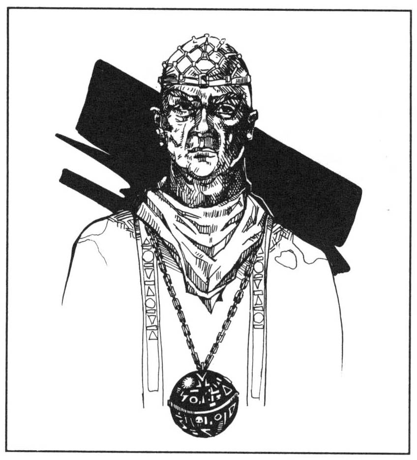
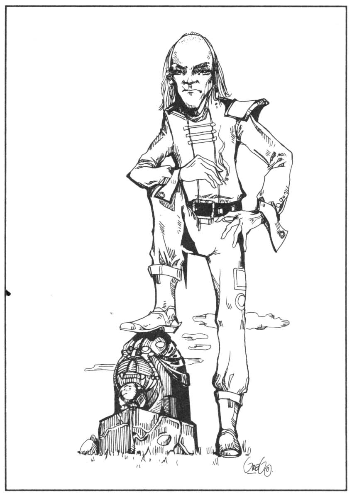
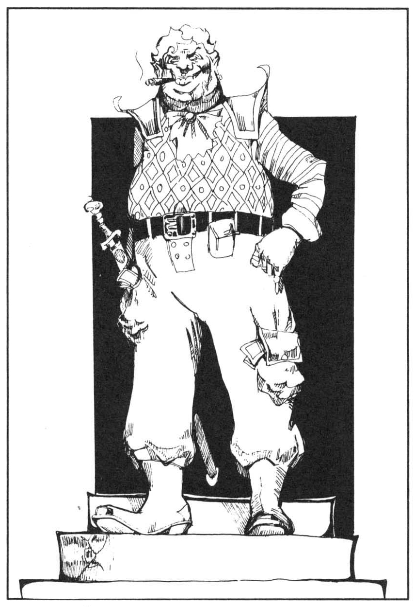
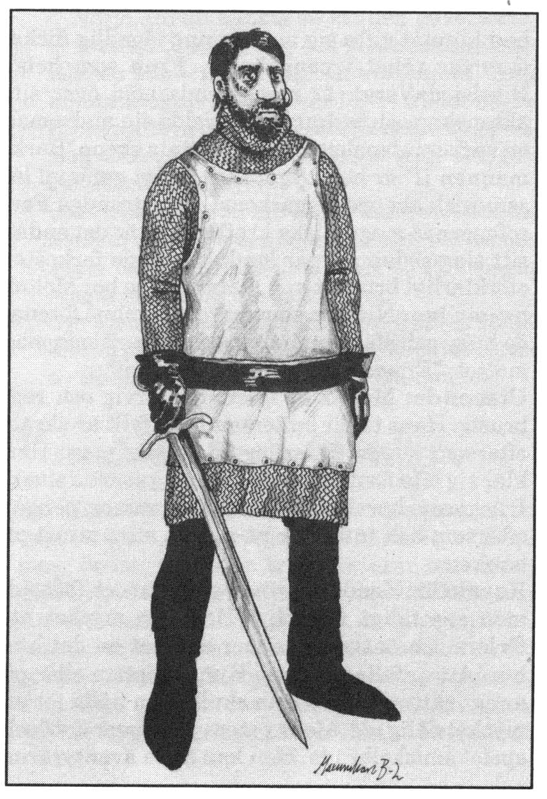
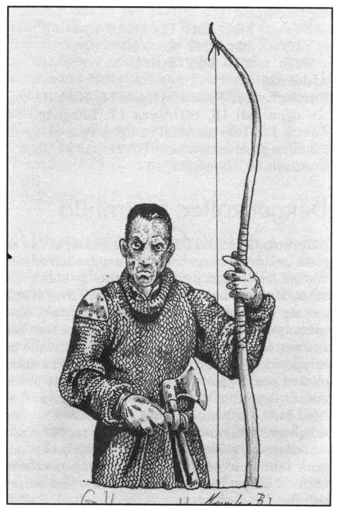

<title>SLP och varelser - Oraklets fyra ögon</title>

# 12. SLP och varelser

(I den ordning de dyker upp)

## Bodonius/Kinquarras av Ranz

**Allmänt:** Ranzinermunken Bodonius är utsänd för att leta efter folk som besökt Marjura år 610 eO. Hans uppdrag är att föra sådana personer till ordensmästaren Peatro Petralba på berget Ranz. Peatron har hemliga verser ur Vox Ranzina till de rätta utvalda. Efter någon månads detektivarbete har Bodonius spårat äventyrarna och kontaktar dem i spelöppningen. Om han överlever kan han fly med äventyrarna från Ranz och bli en i sällskapet. Om Bodonius inte överlever, träffar äventyrarna istället munken Kinquarras på berget Ranz. Denne har samma värden som Bodonius.

**Utseende:** Bodonius är en oansenlig, lätt skallig man i enkla pilgrimskläder.

**Karaktär:** Som ranzinermunk har Bodonius framförallt hur mycket tålamod som helst. Han blir aldrig upprörd och är en mycket god iakttagare med nästan fotografiskt minne. Han talar påtagligt sakta och väger noga varje ord. Som alla ranzinermunkar tror han att vägen till framgång är noggranna förberedelser och val av rätt tidpunkt, medan själva handlingen har mindre betydelse. Denna inställning formuleras i Vox Ranzinas första vers vilken Bodonius gärna citerar.

**Egenskaper:**
```
STY 8   KAR 14   PSY 17
STO 9   SMI 8    KP 10†
FYS 10  INT 16
```
† (När Bodonius dyker upp i spelöppningen har han bara 2 KP kvar)

**Ålder:** 32 

**Färdigheter:** Administration/juridik 10, Astrologi 6, Första hjälpen 14, Historia 16, Läsa/skriva jori B4, Språkkunskap 17, Trästav 7, Förhöra 14 (Förmågan kommer av Bodonius goda uppfattnings- och iakttagelseförmåga. Han behöver bara samtala normalt med personen för att få information), Finna dolda ting 17, Lyssna 19, Upptäcka fara 17, Rida 12, Simma B1

**Särskilda förmågor:** Genom sin munkfostran har Bodonius färdigheter som motsvarar hjälteegenskaperna Tidskänsla och Orädd.

## Peatro Petralba av Ranz

**Allmänt:** Peatro Petralba är inte ett namn utan titeln på Ranzinerordens ledare. Peatro Petralba betyder ”fader på den vita klippan”. Spelarna möter peatron då de kommer till Ranz. Dessvärre blir det ingen längre bekantskap eftersom den gamle mannen mördas samma natt. Se f.ö. avsnittet Ranz.

**Utseende:** Peatron är en tunn liten man med skallig hjässa och ett vitt skägg som är avklippt vid midjan. Han går klädd i en ren vit klädnad och sandaler. Han utstrålar en aura av prästerlig höghet (motsvarar en permanent E2 AURA i magiboken.)

Se f.ö. avsnittet **Ranz**.

## Mashmashu Goba da Grummi

**Allmänt:** Mashmashu är titeln på en högt uppsatt prästvigd kastratsångare. Goba da Grummi är en av de mäktigaste kastykerprästerna och Praanz da Kaelves överordnade i Digeta Longa. Han är mycket förmögen, intelligent och listig och har utmärkta förbindelser med hovet.

**Utseende:** I officiella sammanhang bär herr Goba alltid en färgglad tunika av kamsunsk papir över sin fetlagda kropp. Därunder hosor och strumpor vävda av rött siden med inlagda guldtrådar. Han är behängd som en julgran med dyrbart glitter och har på sitt renrakade huvud den officiella strutzerhatten. da Grummi förflyttar sig aldrig själv, utan transporteras överallt av bärare, omgiven av minst tre dugliga livvakter.

**Karaktär:** da Grummi behandlar ofta underordnade som sina små husdjur. Vanligt folk befattar han sig över huvud taget inte med. Han brusar lätt upp, men tappar aldrig kontrollen över sig själv. da Grummi är mycket intelligent och har näsa för när något lurt är på gång, vilket gör honom lämplig för sitt ämbete. Han har också mycket god kunskap om rikets adelsmän.

**SL:** Goba da Grummi kommer knappast i kontakt med rollpersonerna, men fungerar som Praanz da Kaelves kontaktman och kan ge denne information om spelaren ifråga behöver hjälpas på traven. Alla större utbetalningar i rikets tjänst eller omfattande order måste godkännas av da Grummi. Detta tvingar Digeta Longa-spelaren att hålla spelledaren underrättad om sina planer.

## Lugal Praanz da Kaelve

**Allmänt:** Lugal är en militär hederstitel för högt uppsatta officerare som utmärkt sig i rikets tjänst. Praanz da Kaelve är en adlig mästerfäktare från Tricilve. Efter militär karriär, bl.a. vid rikets garnison i Torilia och hos furst Pampalon i staden O, har da Kaelve tagit aktiv del i huvudstadens politiska intriger. Han skyltar helst inte med sin närvaro, men dyker regelbundet upp i dueller, skandaler och affärer med vackra kvinnor. Hans rykte som fäktare är mycket välgrundat. För närvarande har Praanz da Kaelve ett högt ämbete vid Digeta Longa — rikets fruktade hemliga polis. Det är i denna egenskap han kan korsa rollpersonernas väg.

**Utseende:** 32 år gammal med ett mörkt och intressant, men inte direkt skönt ansikte. Da Kaelve saknar höger öra som slitits av under ett slagsmål i ungdomen. Han går nästan alltid klädd i fältkläder utan onödig utsmyckning. Vanligtvis är det långa håret inlindat i en stram, svart läderturban.

**Karaktär:** Praanz da Kaelve är en passionerad man som helhjärtat ägnar sig åt stundens uppgift, vare sig det gäller dokumentskrivande, strid eller kärlek. Han älskar Tricilve, Paratorna och det politiska spelets möjligheter. I strid är han listig och effektiv med sina två vapen, men inte onödigt grym. da Kaelve sätter det personliga anseendet mycket högt. Han hånar aldrig en ärlig motståndare, men föraktar lättja, svaghet och velighet. Han finner det helt naturligt att luras och att bryta sitt ord, liksom att den starke utnyttjar den svage eftersom detta är världens gång.

**SL:** da Kaelves djupa hemlighet är en mörk fläck på högra axeln, stor som en handflata. Fläcken visar att da Kaelve har skeckerblod i sina ådror, vilket är otänkbart för en paratornisk adelsman i hans ställning. Kom hemligheten i dagen, skulle da Kaelve tvingas i landsflykt och söka en gruvlig hämnd på de ansvariga.

**Egenskaper:**
```
STY 14   SMI 17   KAR 17 
STO 11   INT 16   KP  14 
FYS 17   PSY 13
```
**Ålder:** 32
**Ambidextriös (tvåhänt)**
**Färdigheter:** Administration/juridik 10, Första hjälpen 13, Heraldik 18, Läsa/skriva jori B2, Områdeskännedom (Trakorien) 12, Värdera vapen 17, Dra vapen 21, Taktik 17, Två vapen 21, Sabelfäktning 26, Förhöra 13. Muta 15, Överklasstil 16, Hasardspel 14, Stadskännedom (Tricilve) 15, Finna dolda ting 13, Upptäcka fara 18, Rida 14

## Furstessan Didra Damagi av Krimbydh

**Allmänt:** Didra är dotter till fursten av Krimbydh, ett medelstort furstendöme vid den nordöstra Kargomiterkusten. Hon är också dotterdotter till prinsessan Elmesum som Shagul kidnappade för femtio år sedan för att få sällskap i sin grav. Den gamla Elmesum dog när Shaguls grav öppnades i modulen *Svavelvinter*, men hennes plågade själ kunde inte lämna världen. Hon dröjer kvar som ett spöke i Didras högra öra till stor förtret för den unga furstessan. Elmesum manar ständigt sin yngre släkting till hämnd på Shagul. Didra har svurit att göra sin mormor till viljes, mest för att bli av med spöket.

**Utseende:** Didra är smidig och farlig som en panter. Hennes seniga kropp täcks av mörkblå tatueringar som blir självlysande vid fullmåne, så att hon liknar en ande i natten. Hon bär svartröda, dyrbara kläder med överdrivet stora spännen i ädelmetall. Runt halsen har hon ett silversmycke i en kedja, runt handlederna dansremmar med bjällror, vid bältet en lång dolk med vågformat blad och tre hoplindade, hullingförsedda bolas. Didras korta här är korpsvart, infettat och bakåtstruket. När hon dansar bär hon förutom bjällerremmar runt hand- och fotleder endast ett svart höftkläde.

**SL:** Didras tatueringar är tecknade av den kargomitiske mästaren Xelimogga, som också varit hennes lärare i magi.

*Tipz: Om du inte använt äventyret med Xelimogga i Trakorien ännu, så kan det med fördel läggas in i denna kampanj. Äventyrarna kan exempelvis få lift med Xelimoggas mystiska båt när de behöver komma undan. De uppdykande varulvarna ger också Digeta Longa något att tänka på.*

* Högt uppe på högra låret har Didra en E3 SYMBOL för förstumning tatuerad. Alla män/intelligenta handjur som ser symbolen måste klara ett PSY-slag eller bli stående förhäxade under (25-PSY) SR och därvid lyda furstessans minsta vink. Symbolen har som bieffekt att den som en gång blivit förhäxad känner en stark lust att se symbolen igen. Han förhäxas då automatiskt.

* En hullingförsedd bola fungerar som en vanlig bola, men tar (1T3+2) SR att trassla sig ur.

* Dolken är magisk med El FÖRTROLLA VAPEN, NEXUS och PERMANENS.

* Silversmycket runt Didras hals kan öppnas och innehåller en infattad, svagt rosa diamant. Diamanten är ett E5 fängelse för människosjälar. Den som ser in i kristallen sugs själsligen in i den om han inte lyckas göra motstånd med sin PSY-grupp. Offrets kropp övertas därvid av kristallens tidigare fånge. En fånge i kristallen tycker sig sitta som ett spöke i en glascell som svävar i rosa dimma. Det är omöjligt att ta sig ut med våld eller magi, men fängelset kan utifrån öppnas med SKINGRA, varvid den själ som befinner sig närmast istället sugs in i kristallen (klarar denne sitt PSY-slag går turen till den som är näst närmast osv.) I kristallen sitter för närvarande Didras morbror Belibak av Fraak som konspirerade mot Didras far. Belibak är en enkel, barbarisk adelsman som bara talar kargomitiska.

**Karaktär:** Didra är kargomiteradel och har kargomiteradelns osentimentala inställning till livet: Makt är rätt, folket är till för adeln, grymheter är kul, frestelser är bäst när man faller för dem, osv. Mer än allt annat älskar hon att dansa till trummor och skränande blåsinstrument. Stillsammare musik föraktar hon däremot. Didra har inget emot att komma ut på äventyr. Hon har ett häftigt temperament, men kan bli svårmodig när mormor i örat irriterar henne.

**Elmesums karaktär:** Elmesum i Didras öra håller sig vanligen i bakgrunden och kommer fram först när Shagul förs på tal. Ibland gråter hon över sitt öde så att Didra får vatten i örat. SL kan låta Elmesum berätta om Shagul om de behöver ledtrådar. Trollkarlen har antagligen skrutit om sina planer under deras tid tillsammans.

**Didras egenskaper:**
```
STY 12    SMI 16    KAR 17
STO 13    INT 11    KP 12
FYS 10    PSY 15
```
**Ålder:** 23 
**Färdigheter:** Tatuera B4, Dansa B5, Bola (här ett vapen) 14, Dolk 10, Överklasstil 15, Jaga 8, Rida 10, Symbolism 8, STOPP 6, LOCKELSE 8, FJÄRRSKRIFT 4, Elementarmagi 4, ELD 5, FÖRSEGLA 3

## Gozcana da Skugre

**Allmänt:** Gozcana da Skugre dyker upp i avsnittet **skuggornas träsk** när rollpersonerna söker kontakt med trollkarlen Manghalde. Gozcana är ålderman i diFolternas orden i Ilibaurien. Han är gammal och trött efter ett fruktlöst liv av droger och hårt arbete. Först på gamla dar ser han ett nytt hopp för sitt land i den religiösa väckelsen runt den oskyldiges kult och det blå barnet.

**Utseende:** Gozcana är gammal med gulaktig, blek hy. Slemhinnorna runt ögonen och i munnen är blodröda av drogmissbruk och blöder ofta. Några enstaka hårtestar återstår på huvudet. Gozcana är oansenligt klädd. Vid hans bälte hänger behållare med örter som han då och då äter av.

**SL:** När äventyrarna möter Gozcana da Skugre hos Manghalde, har han rest till Skuggornas träsk på trollkarlens inbjudan eftersom de två är gamla vänner. Manghalde vill ha tillbaka det blå barnet, men Gozcana är fast besluten att inte göra honom till viljes. Han bryr sig inte om hot eller våld eftersom han ändå ska dö snart. Återvänder han inte från Skuggornas träsk, vet diFolterna att Gobrugda förrätt dem och ökar bevakningen runt templet i Skuger. Om Gozcana misstänker att rollpersonerna är lejda att frita det blå barnet kan han försöka slå ut dem med någon av följande droger: (slumpa eller välj)

* Magnolin — en dryck som gör människor starkt magnetiska under 1T4 veckor (mycket besvärande för magiker).

* Prosserblad — en träsksallad som färgar ögonvitorna gröna under 1T4 veckor. Detta gör det svårt att smyga sig in någonstans utan att märkas.

## Horndemonen Adgurbog

**Allmänt:** Ex-shaguliten Gobrugda har en mäktig horndemon som hjälpreda och livvakt på sin ö i Skuggornas träsk. Horndemonerna har beskrivits ingående i Svavelvinter. De är hämtade från en värld av rovdjur och står i telepatisk kontakt med sin shagulit. Denne har normalt kontrollen, men om horndemonen fångar ett offer tar rovinstinkten över om den misslyckas med en bärsärkskontroll.

**Egenskaper:**
```
STY 26    SMI 11    KAR 1
STO 24    INT 8     SB 1T6
FYS 22    PSY 15    KP 23
```
**Värde för bärsärkskontroll:** 4
```
Naturliga vapen    CL      Skada
Bett               16      1T10
Spy etter          16      1T4 x 1T4 SR
Malande kräva      autom.  1T10/SR (efter fasthållning)
```
**Naturligt skydd:** Bröstkorg 5, resten 2
**Förflyttning:** F 35/ L4
**Färdigheter:** Upptäcka fara 17, Finna dolda ting 15, Spåra 16
**Särskilda förmågor:** Okänslig för normala temperaturskiftningar, skadas ej av kemikalier (t ex syror), tar halv skada av gifter, kan inte bli skrämd.

## Manghalde, alias shaguliterpatriarken Gobrugda/Giafrak

Vilken patriark? Om Gobrugda dog i *Svavelvinter*, är denna person istället hans tvillingbror Giafrak med exakt samma värden. För enkelhetens skull kallas patriarken dock fortsättningsvis Gobrugda.

**Historia:** Sedan trollkarlen Shagul återuppstått ur sin grav i *Svavelvinter*, kallade han tillhopa sina sista trogna på Marjura och bjöd dem dricka för en enad framtid tillsammans med honom. I drycken hade Shagul blandat ett kraftigt gift, ty han ville bli av med sekten som kände honom alltför väl. Patriarken Gobrugda hade emellertid vuxit så i kunnande att han överlevde mästarens gift. Han reste sig bland sina döda kamrater och dräpte den klon av Shagul som givit honom den förgiftade drycken. Innan blodet helt flytt från klonens kropp, skar han av dess blånande hand och bevarade dess liv med sådana nekromantiska ritualer som var del av hans kunnande. Gobrugda svor därvid en högtidlig ed, med innebörden att Shaguls egen hand, genom patriarkens försorg skulle bli den svekfulle mästarens död.

Fortfarande sjuk av det starka giftet, flydde Gobrugda till Ilibaurien på Paratorna för att gömma sig bland de hemlighetsfulla diFolterna, en sekt drogmakare som han sedan länge haft kontakt med. I staden Mynd Mazuldre tänkte han smida sina planer på hämnd. Emellertid har Shaguls gift och avsaknaden av Shagulitersektens konster givit honom en obotlig sjukdom som får hans kropp att ruttna. Han har sedan ett par år dragit sig tillbaka i skuggornas träsk för att i det fuktiga klimatet kunna utföra sina livsuppehållande ritualer och sitt drogblandande i avskildhet.

**Kommentar:** Om *Svavelvinter* spelades på annat sätt än det ovan beskrivna, kan ju Shagul ha träffat Shagulitersektens kvarlevande på en helt annan plats där inte rollpersonerna var närvarande.

**Allmänt:** Gobrugda har drabbats av ett fruktansvärt straff för sitt livs ogärningar i Shagulitersektens tjänst. Medan sekten levde, odlade shaguliterna alger och andra organismer i sina egna kroppar. Människorna gav dessa småkryp skydd mot världen, och utnyttjade i gengäld algernas förmåga att göra näring av solljus. Då sekten upplöstes, förstördes dess laboratorier i järntornet. De livsuppehållande ritualerna kan nu inte längre genomföras. Gobrugdas kropp börjar obevekligt falla samman, men så livstränade är hans celler, att de fortfarande motstår döden. Patriarken ruttnar långsamt bort levande...

**Utseende:** Gobrugda är inte längre grön, utan skiftar i gul-röd-violetta, sjukliga färger. Han döljer bålen och benen i ett permanent igensytt hölje av syragarvat, parfymerat läder för att hålla samman delarna och för att minska deras stank. Över läderhöljet bär han en fotsid svartviolett kåpa. Armarna är hårt lindade med svarta tyger och händerna behandskade. Framför ansiktet har han vanligen en gråtande teatermask, men ansiktet har hjälpligt kvar så mycket av sin form att det kan kännas igen, även om det är sårigt och missfärgat.

Nära patriarken står en obehaglig doft av förruttnelse och formalin som gör att han inte kan vistas bland folk.

Gobrugda rör sig långsamt och med stor ansträngning. Talet är hest och avbryts ofta av sönderslitande hostningar.

**Karaktär:** Gobrugda är stillsam och resignerad inför sitt öde, men drivs av en brinnande längtan efter den hämnd som är hans enda återstående mål i livet. Inför sin svåra sjukdom har han kommit att dyrka dödsgudinnan Ereshkigal och ödet, representerat av berget Ranz profetia. Sin skapelse, ”det blå barnet”, behandlar han med förakt men omsorg, eftersom det för honom bara är ett redskap för hämnd på Shagul.

**Egenskaper:**
```
STY 14    SMI 6    KAR 11
STO 13    INT 18   KP 15
FYS 17    PSY 24
```
**Ålder:** 88 år
**Färdigheter:** Geografi 10, Historia 12, Räkning B3, Förhöra 16, Finna dolda ting 12, Lyssna 12, Upptäcka fara 12, Tala/skriva Jori B5/B4, Tala svartiska B3, Tala jättespråk B1, Astrologi 15, Drogkunskap 15 (de två sistnämnda egenskaperna fanns inte angivna i *Svavelvinter* eftersom de där saknade betydelse för spelet)
**Särskilda färdigheter:** Hjälteegenskaperna Orädd och Tålig.
**Magi:** Nekromanti 22. Gobrugda behärskar alla allmänna och nekromantiska besvärjelser. Skicklighetsvärdet i varje besvärjelse är (25 — besvärjelsens skolvärde). Hans nya tro gör dock att han helst undviker nekromanti.
Shagulism B5. Färdigheten Shagulism har mindre betydelse i detta äventyr, men den som har modulen Svavelvinter kan läsa om den på sidan 64.

**SL:** Skillnaderna i egenskaper och färdigheter från Svavelvinter beror på trollkarlens försämrade hälsa och nya tro.

Vad kan Gobrugda göra för sällskapet?

* Han kan informera sällskapet om det blå barnets sanna natur och berätta det han vet om Shaguls och RhabdoRanas roll. Han känner också till demonerna Shaggira och Lugahs.

* Han kan berätta om faran med opiander och visa hur kryddan luktar.

* Han kan erbjuda en fristad i träsket för räddade orakel eller jagade äventyrare.

* Han kan förstärka sällskapets kassa med 1000 x 1T6 sm om de så begär.

* Han kan ge sällskapet 1T4 doser av drogerna Ersinon, Smaugifonia, Svartblod, Stridsdryck och en drog som ger skendödhet i 20 + 1T6 timmar.

* Han kan ha letat reda på Grafficanus demonstav/Rirbas spegel/kroksabeln Sturmendrang, om dessa blev kvar på Marjura och ge dem till sällskapet. (Dessa ting beskrivs i Svavelvinter)

* Han kan bli spelledarens språkrör för att förmedla information som spelarna behöver.

* Han kan ha tillverkat en stav som av ett lik aktiverar en andra gradens zombie per dag. Zombien förblir aktiverad så länge den som håller i staven står still och koncentrerar sig på den.

Hur mycket hjälp spelarna ska få måste spelledaren avgöra.

## Onda bettet — vargmännens drottning

**Allmänt:** Aoya, som också kallas Onda bettet, har styrt bland vargmännen i Tocmerskogen under ett drygt decennium. Hon är en stor vargkvinna med vilddjurets sjätte sinne för faror. Onda bettet har en oerhört hög status bland sitt folk som utan tvekan offrar livet för henne. Trakorierna ser henne som en potentiell upprorsmakare och skulle gärna se henne undanröjd. Onda bettet tar emot rollpersonerna i sin tronsal där hon omges av över hundra starka vargmän.

**Utseende:** Vargkvinnan är stor och något äldre med grå stänk i pälsen. Högra örat är genomborrat av en jägares pil. Karaktär: Som de flesta vargmän i Wulferveden misstror Aoya ”opälsingar”, men innan sierskan Raoga försvann sade hon att pälslösa varelser skulle komma för att söka henne. Av den anledningen har vargdrottningen beslutat ta emot besökarna. Hon är bister, men inte otrevlig. Vargmän är strikt indelade i rang, men skiljer inte på fint och vanligt folk som människor.

**Egenskaper:**
```
STY 18    FYS 17    KAR 14/18＊
STO 16    INT 15    SB  1T4 
SMI 14    PSY 17    KP  17
```
＊människor/vargmän

Stridfärdigheter är knappast intressanta. Äventyrarna kommer aldrig att komma tillräckligt nära vargkvinnan för att använda närstridsvapen, och missilvapen är inte tillåtna. Färdighet av intresse: Upptäcka fara 25 (Aoya känner i god tid på sig varje fientlig avsikt som inte är maskerad med exempelvis HJÄRNBLANK)

## Kurtisanen Salmello

**Allmänt:** Salmello från Zaroflas är en manlig kurtisan, förd till Gatves klippa av trollkvinnan Fundibera som älskare och leksak. Även hennes bror Kamalkus har fattat tycke till mannens perfekta yttre och planerar att förvandla honom till staty för att bevara hans skönhet då Fundibera tröttnat på hans konster.

**Utseende:** Salmello är ljushårig med stora bruna ögon och skönt byggd ynglingakropp. I sin svit på Gatves klippa går han klädd i silverströdd sidenkimono och därunder ett par små sidenkalsonger av rosa spets. Kurtisanen behärskar flera musikinstrument och sällskapsspel liksom konsten att uppträda i finare kretsar. Han rör sig smidigt men med överdrivna manér och intar gärna klassiska poser som han lärt sig under en kort karriär som skådespelare. Han uttrycker sig barnsligt och bubblar med saliven då han talar, en vana som män ofta finner motbjudande, men som tilltalar vissa kvinnor.

**Karaktär:** Salmello är allt igenom tillgjord och bortskämd. Emellertid tar han sitt arbete med stort allvar och är mycket känslig för andras önskemål. Om rollpersonerna bemöter honom med avsmak kommer han mycket snabbt att ändra sitt beteende för att göra dem positivt inställda. I palatsen i Tricilve och Fontra Cilor kan en person som Salmello göra stor succé.

**Egenskaper:**
```
STY 10    SMI 16    KAR 17
STO 11    INT 10    KP 13
FYS 14    PSY 7
```
**Ålder:** 19
**Färdigheter:** Drogkunskap (skönhetsmedel, afrodisiaka och liknande) 14, Kulturkännedom, allmän 16, Tala/skriva jori B4, Schack och brädspel 11, Värdera smycken 8, Dolk 9, Sjunga och spela B4, Dans B4, Bluff 15, Stjäla föremål 14, Stadskännedom (Tricilve, Fontra Cilor, Zaroflas) 12

## Vargkvinnan Raoga

**Allmänt:** Raoga, sierskan i Wulferveden, har från födseln varit världsfrånvänd, men sedan hon blev fånge hos magikerna på Gatves klippa har hon suttit i samma cell som en remuntrapräst och dessutom smittats av Remuntras vansinne.

**Utseende:** Raoga är en liten och ganska tanig vargkvinna som dessutom är albinofärgad. Hon har alltså inget pigment, varför pälsen är kritvit och ögonen bleka.

**Karaktär:** Raoga tycks inte ens se andra varelser. Hon sitter oupphörligt och sjunger underliga sånger i underliga tonarter. Tar man henne vid tassen följer hon med och ger man henne mat äter hon, men hon tar inga egna initiativ.

*Sjunga/spela* => Vargkvinnan sjunger på ”den gyllene nyckeln”, en underlig tonart som remuntradyrkarna ofta använder och som därför undviks av andra musikanter.

**SL:** Rollpersonerna kanske förtvivlar när de märker att Raoga blivit tokig, men det är just sången som gör henne värdefull eftersom den fungerar som nyckel till Store Stenfar (som dyker upp i nästa modul). Om spelledaren vill kan sången fungera som en E7 ÖPPNA. Glöm inte risken att rollpersonerna smittas av remuntravansinnet.

**Egenskaper av intresse:**
```
STY 7    SMI 11    KAR 10
STO 8    INT ?     KP  11
FYS 13   PSY 5
```
**Ålder:** 17 
**Färdighet av intresse:** Sång B4
Se för övrigt avsnittet om Remuntra i Trakorien.

## Kamalkus



**Allmänt:** Magikern Kamalkus ägnade ungdomen åt att studera och gräva efter magiska fornföremål i Voag Aspedes ruiner tillsammans med sin tvillingsyster Fundibera. Under resor i andra världar kom de två ifrån varandra och Kamalkus strandsattes i Gombitakles bruna slemdjungler under ett och ett halvt sekel, något som satt djupa spår i både kropp och karaktär. Då han slutligen fann vägen hem, fick han en förmögenhet i diamanter som avskedsgåva av sin symbroder i Gombitakle, en trehövdad kaklun. (Kaklunerna sväljer ofta diamanter för att kunna sönderdela mineralerna de äter.) Nu vill han ägna resten av livet åt att njuta vår världs trevligheter och åt att försöka glömma Gombitakle.

**Utseende:** Trollkarlens hud är täckt av små ärr från syraregnen i de bruna slemdjunglerna. Kamalkus klär sig ofta i rödvita sidenkläder som gärna är solkiga och illaluktande eftersom han inte tvättar sig. Han har inget hår på sitt runda huvud, men täcker hjässan med ett rubinbesatt nät av flätad silvertråd. Kroppen är grov, ovårdad och överviktig.

**Detaljer:** Runt halsen har Kamalkus en guldkedja med ett svartglänsande, plommonstort klot. Klotet har inlagda guldtecken, guldådring och en ekvatorlinje av guld. *Språkkunskap/alviska* => tecknen är alviska och kan tydas till ”globa pandori". *Finna dolda ting* => klotet kan antagligen tas isär vid ekvatorlinjen.

**Karaktär:** Kamalkus är tystlåten och knepig till sinnes efter sina utomvärldsliga upplevelser som han aldrig diskuterar. Han uppehåller sig ofta i citadellets slutna delar och är bara intresserad av att träffa skickliga musiker och kurtisaner, samt vackra ungdomar och beryktade kolleger.

**SL:** Kamalkus har en otrevlig hemlig hobby. Han har gjort sig ett namn som skulptör, men hans skulpturer är i själva verket unga människor som han förstenat med spegeln i citadellets källare. Personer från Trakorien med FV ≥ A10/B3 i någon konstnärlig färdighet har antagligen hört talas om honom.

Det svarta klotet runt Kamalkus hals är en talisman, en magisk hämnare som ska straffa hans eventuella mördare. Se nedan.

**Egenskaper:**
```
STY 9    SMI 6    KAR 4
STO 14   INT 18   KP 11
FYS 8    PSY 24
```
**Ålder:** 80 (har upplevt mer än två sekler)
**Färdigheter:** Tala/skriva jori B5/4, Värdera konst 17, Geologi 12 (han har lärt sig av kaklunen i Gombitakle), Upptäcka fara 7
**Magi:** SKINGRA 17, VARSEBLIVNING 6, AVLÄSA MAGI 15, LIVSFÖRLÄNGNING 4, TRANSFER 9, Mentalism 18, ORIENTERING 12, MOTSTÅNDSKRAFT 9, HJÄRNBLANK 16, LUNGFILTER 6, SYRASKYDD 18 (Speciell besvärjelse utarbetad i Gombitakle. Varar 3 + 1T4 timmar), SKYDD 14, TANKEÖVERFÖRING 12, OSYNLIGHET 3, SANN SYN 2, KONTROLLERA PERSON 1 0, TELEPORTERA 8, MAGISK SYN 9,ÅTERVÄNDO 6, Elementarmagi 10,ELD 1 4, FROST 6, MÖRKER 7, ÖPPNA 5, JORDVÄG 8, EXTRAHERA NÄRING 8 (Speciell besvärjelse utarbetad i Gombitakle. Utvinner ätbar substans för en dag ur mineraler.)

## Pandoraklotet och Nekromorbus

*Tipz: Nekromorbus är ganska rolig att ha med i spelet. Om rollpersonerna inte får tag på Kamalkus klot, kan SL lägga en amulett med motsvarande funktion någon annanstans.*

### Pandoraklotet

**Allmänt:** Trollkarlen Kamalkus, som rollpersonerna kan möta i deläventyret om det vita ögat, här ett svart plommonliknande klot i en guldkedja runt halsen.

**Klotets historia:** Etemenankitemplet utanför Isakra på norra Trinsmyra har sina rötter i en dimmig forntid. Templet byggs ständigt till med nya kapell och salar till många gudars ära, både under och ovan jord. Mycket berömd är Rakmakolonnaden, en triumfport som bärs upp av tretton krigarstatyer skulpterade i grönsvart sten. Kolonnaden bekostades av den milackiske fursten Ctagon och uppfördes under åren 222—218 fO som en gåva till gudarna för att fursten kommit hem efter en farofylld resa i österled.

Sägnen berättar att mästerskulptören Odaffta av Rakma högg ut de tretton statyerna ur ett heligt klippblock som kastats upp ur havsdjupen under ett vulkanutbrott. Varje ny stenkrigare blev mer fulländad än den föregående och bar ett eget namn. Den trettonde och sista skulpturen kallades Nekromorbus och var så naturtrogen att den vaknade till liv så snart den var fullbordad. Odaffta, som var en gammal man utan arvingar, blev mycket lycklig, men Nekromorbus betraktade sin skapare med kalla stenögon och tänkte att denna skröpliga varelse var honom ovärdig. Han dräpte Odaffta med sitt stensvärd och vandrade ut på gatorna för att ta emot folkets beundran, men alla flydde när han närmade sig. Under flera dagar plågade Nekromorbus staden. Han drev bort furst Ctagon ur dennes palats och krävde att gatorna skulle fyllas med guld för att ge hans fötter en passande matta. Alla som misshagade honom det minsta föll för hans svärd, men själv var Nekromorbus osårbar, ty han var perfekt, och det perfekta kan inte skadas, utan måste utplånas som ett helt.

Nu levde utanför Isakra en skicklig symbolist vid namn Huria. Hon trädde inför den levande statyn och sade sig vilja skriva en hjältesång till hans ära. För att framhäva hans skönhet ville hon se honom bredvid hans sämre bröder, och med denna list lurade hon Nekromorbus att ställa sig på sin plats vid Etemenankitemplet. Där hade Huria dragit magiska tecken som band stenmannen till platsen och grävt ner en röd meteoritflisa som fångade hans livslåga. Nekromorbus förstenades som en av de tretton statyerna i Etemenankitemplets Rakmakolonn.

Trollkvinnan lade förbannelsens nyckel i ett svart klot, Pandoraklotet, som hon har om halsen under hela sin levnad. Det är detta klot som på okända vägar ärvts vidare till Kamalkus.

**Klotets funktion:** Skruvas Pandoraklotet isär vid ekvatorn flyger ett tjugotal gula små fjärilar ut. Dessa fjärilar är den magiska nyckeln till Nekromorbus förbannelse och löses upp i gul rök 4 + 1T6 SR efter att de kommit utomhus. Kvar i klotet finns en liten bit pergament med text. Texten är på alviska och lyder:

> *Tjuv*
> *Väl mött i skuggornas land!*
> *Budet har gått med gyllene vingar*
> *Än när du läser, vaknar Nekromorben*
> *vädrar i vinden, vandringen börjar.*
> *Lämnar sitt hjärta, den röda stenen,*
> *i gudarnas nordliga boning.*
> *Trettontalets helighet håller hans liv.*

Om man inte förintar alla fjärilar som lämnade klotet (t.ex. med en magisk ELD) vaknar Nekromorbus i Etemenankitemplet och lämnar Rakmakolonnen som då delvis rasar samman. (Denna händelse tolkas som ett synnerligt dåligt omen, och kommer säkert att diskuteras över hela Trakorien.) Nekromorbus kommer nu att söka upp den som öppnade klotet för att hämnas. I pergamentets vers finns två ledtrådar till hur man kan besegra statyn (Han är omöjlig att ta död på med vapenmakt och normal magi). Nekromorbus hjärta är den röda meteorflisa som ligger begravd under hans plats i kolonnen. Om flisan krossas blir han en vanlig staty för all framtid. Vidare är talet tretton i gammal tro ett heligt tal med stor kraft. Nekromorbus får delvis sin styrka av att vara en av de tretton statyerna huggna ur det heliga stenblock som kastades upp ur havet. Reser man till Isakra och förstör en av de andra statyerna bryts det heliga trettontalet och Nekromorbus blir en vanlig staty.

*Tipz: Även om rollpersonerna lyckas omintetgöra hotet från Nekromorbus hindrar inte det SL att låta en och annan gul fjäril dyka upp vid enstaka tillfällen efteråt; det gör spelarna trevligt nervösa.*

### Nekromorbus

**Utseende:** Nekromorbus är helt gjord av glittrande grönsvart sten. Han är ”klädd” i hjälm med nässkydd, kortärmad ringbrynja, förstärkta hosor och stövlar. (Allt detta sitter fast på hans stenkropp.) Han har en klassisk, mycket vacker. profil och är verkligen perfekt i minsta detalj. I höger hand bär han ett kortsvärd som han inte kan släppa, medan den vänstra är fri. Vid beröring är han kall och hård som polerad sten.

**Karaktär:** Nekromorbus tycker själv att han är ett perfekt väsen och vida överlägsen alla bräckliga människor både vad gäller styrka, skönhet, intelligens och allt annat som räknas. Han drivs framåt av förbannelsen som tvingar honom att hämnas på den som öppnade Pandoraklotet. Själv tror Nekromorbus att han blir fri när han väl dödat tjuven, men i själva verket förvandlas han till en vanlig staty om uppdraget fullbordas. Om tjuven dör på annat sätt, eller via magi lämnar spelvärlden, blir Nekromorbus däremot fri och försöker då upprätta ett enväldigt furstendöme till sin egen ära.

**Egenskaper:**
```
STY 46    SMI 13    KAR 1
STO 30    INT 8     SB 2T6
FYS 22    PSY 15    KP 26
```

Nekromorbus känner automatiskt avstånd och riktning till den som öppnat Pandoraklotet. Han vandrar dag och natt mot tjuven. Kommer han till havet går han längs bottnen. SL får på sin karta hålla reda på statyns rörelser. Nekromorbus kan bara dödas genom att stenhjärtat eller någon av de andra statyerna förstörs, men själv tror han att han är helt odödlig. Han kommer inte att försöka smyga sig på sitt offer, utan närmar sig i stor stil för att få omgivningen att darra. De som försöker stoppa honom hugger han ner utan större åthävor. Nekromorbus gör sig ingen brådska utan skryter och skrämmer gärna sitt offer innan han dödar honom.

**Färdigheter:** Kortsvärd 13, Tala jori/rungli B2, Lyssna 9.
**Förflyttning:** L8. Nekromorbus rör sig hela tiden i en och samma fart. Han sover eller vilar aldrig, man han gör heller inga ruscher.

## Fundibera

**Allmänt:** Magikern Fundibera är Kamalkus tvillingsyster, och har liknande intressen, men är av ett helt annat kynne.

**Utseende:** Trollkvinnans riktiga ansikte är alldagligt, man få vet hur hon egentligen ser ut eftersom hon alltid ”sminkar” sig med besvärjelsen FATA MORGANA. Hon förtrollar sig ständigt till nya undersköna former, och finner stort nöje i att variera sitt utseende. Av den anledningen kan en vacker, främmande kvinna lätt vandra runt på Gatves klippa och bemötas med stor vördnad (såvida inte Fundibera själv är där vill säga). Fundibera låter gärna onormalt stora juveler ingå i sin FATA MORGANA. Ett lyckat *Värdera ädelstenar* => Betraktaren tycker stenarna är overkliga.

**Karaktär:** Fundibera är en levnadsglad kvinna som gärna tar emot gäster och ser sig omkring både i denna och i andra världar. Hon är svag för allt som är lite udda och har heller inget emot en kärleksnatt med någon yngling som behagar henne. Tidigare var hon en hängiven utforskare av magi, men efter några skrämmande upplevelser ägnar hon sig nu mest åt nöjen. Liksom sin tvillingbror är hon i grunden egoistisk och struntar i andra människors problem. Hon har låtit uppföra en stor balsal på Gatves klippa och planerar ständigt baler. Hon vill att gästerna ska uppleva något extra vid varje besök på klippan och jagar ständigt sensationer. Hennes stora hobby är att skapa magiska illusioner.

**Egenskaper:**
```
STY 8    SMI 9    KAR 6 (18+ ＊)
STO 13   INT 18   KP 13
FYS 12   PSY 23
```
＊ med FATA MORGANA

**Ålder:** 80
**Färdigheter:** Heraldik 6, Tala/skriva jori B5/B4, Värdera (allmän) 16 Magi: ANTIMAGI 6, SKINGRA 18, VARSEBLIVNING 8, LIVSFÖRLÄNGNING 5, TRANSFER 8, Illusionism 20, DISTRAKTION 13, AVBILD 16, FÖRVIRRA 10, FÖRTROLLAD SÖMN 17, TYSTNAD 10, ILLUSION 14, FATA MORGANA 10

## Kondottiären Cymba

**Allmänt:** Cymba föddes i Skuger år 579 eO, men är en av de få ilibarier som gjort karriär utanför hemlandet. Som sextonåring deltog han i ockupationen av Marjura och utmärkte sig redan då för sin grymhet och list genom att förråda motståndarnas läger som en förälskad flicka visat för honom. Några år senare samlade han ihop ett gäng råbusar och tog uppdrag som ingen annan ville ha, bestraffningar, fångtransporter och utrotningskrig mot svartfolk. Han gjorde väl ifrån sig, men tyckte själv han förtjänade större uppgifter. Åren 608-611 eO bevakade Cymba Trakoriska rikets gruvor i Hymbergond på Trinsmyra. När den milackiska komplotten på Marjura avslöjades, fick Cymba tack vare sina kontakter chansen att leda bestraffningarna i Milacke. Han gick mycket grundligt till väga, men hans grymhet ledde till de resningar i regionen som fortfarande pågår och Cymba fick sparken. Kondottiären reste besviken hem till Skuger och vaktar för tillfället den oskyldiges tempel mot de mördare som försökt ta livet av orakelbarnet. Han har börjat missbruka droger regelbundet. Om rollpersonerna lyckas föra bort det blå barnet kommer Cymba att fly eftersom han enligt kontraktet då blir uppdragsgivarnas slav. Han kan, om SL så vill, tillsammans med en liten skara handplockade män försöka hämnas på dem som förstört hans framtid.

**Utseende:** Kondottiären är mager, blek och senig. Hans huvud är onormalt stort med vassa, ljusa ögon som sitter långt isär. När han är drogpåverkad är ögonens pupiller små som knappnålshuvuden. De smala läpparna är ofta krökta i ett onaturligt leende genom ett ärr på överläppen. Främre halvan av hjässan är rakad enligt ett äldre mode som vill framhäva en hög, beslutsam panna. Det här som återstår faller tunt och ljust till axlarna med en dragning åt violett av färgat puder. Kläderna är ofta dyrbara men inte opraktiska. Vid sidan har kondottiären en sabel och en dolk.



**Karaktär:** Cymba är en missnöjd människa som enbart finner nöje i att tillfredsställa sina begär efter droger och grymhet. Han skrattar nästan aldrig, är drogpåverkad av Smaugifonia och opiander 70% av tiden och undviker som regel annat sällskap än prostituerade som står ut med ett tjuvnyp mot betalning.

**Egenskaper:**
```
STY 12    SMI 13    KAR 17
STO 9     INT 16    KP 12
FYS 14    PSY 15
```
**Ålder:** 34 år
**Färdigheter:** Administration och juridik 12, Drogkunskap (njutningsdroger) 14, Läsa/skriva jori B4/B3, Tala vargmännens språk B1, Dra vapen 8, Två vapen (sabel och dolk) 10, Sabel 15, Dolk 12, Taktik 16, Förhöra (gärna plågsamt) 17, Muta 16, Övertala 15, Upptäcka fara 14

## Efriten Basenanji

**Allmänt:** Den jättelika, osynliga eldvarelsen Basenanji fångades med list, när diFoltersektens grundare, Fafalder den rasande, (Astrumal diFolt själv har faktiskt inget med sekten att göra) genomborrade den sovande efritens hand med en silverharpun fäst vid en silvertråd som band varelsen i Fafalders tjänst. Basenanji har beordrats att hålla upp den svävande klippan i Skuger, som alltså inte svävar av egen kraft. Han skyddar klippan mot inkräktare, men lyfter upp dem som följer uppstigningsritualen. Silvertråden som binder efriten finns inlagd i kopparkedjan som förbinder den svävande klippan med templets pyramid. Om tråden kapas någonstans blir efriten fri och lämnar sin tjänst.

**Utseende:** Efriten är osynlig, men kan ses om man tar på sig en av de heliga mantlarna eller använder magi. Basenanji ser ut som ett åskmoln med mänskliga drag.

**Karaktär:** Basenanji är helt ointresserad av människor och deras förehavanden. Han vill bara bli fri och återvända till sina hemtrakter vid Valgus eldsjö. Han utför tålmodigt det han beordras göra och väntar på friheten.

**Egenskaper:** Rollpersonerna kan inte påverka efriten på något sätt, vare sig med magi eller fysiska attacker. Den är oändligt mycket starkare än en människa. Blir det ”strid” mosar Basenanji vem som helst på ett ögonblick oavsett rustning.

## Det blå barnet

**Allmänt:** Det blå barnet är en klon av trollkarlen Shagul, framodlad ur mästarens avhuggna hand genom Gobrugdas försorg. Barnet hindrar Shagul från vidare förökning eftersom samtliga kloner måste vara närvarande då en ny skapas. ”Det blå barnet” besitter en del av Shagulklonernas kollektiva medvetande, vilket stör trollkarlens mentala förmåga. Ett mycket viktigt mål för Shagul i detta äventyr är därför att lokalisera och döda det blå barnet.

**Utseende:** På den svävande klippan i Skuger ser barnet ut som ett småvuxet och ljusblått men vackert barn i sjuårsåldern, klädd i enkla, ljusa kläder. Om barnet förs från klippan krymper det först till ett fosters storlek och växer därefter upp igen som en äldre, blå dvärg med plågat utseende. Den blå färgen beror på blodets avvikande färg som skiner genom huden.

**Karaktär:** På klippan är klonen ett frågvist, glatt och livligt barn. Sedan det transformerats till den äldre dvärgen har det ett plågat och jagat sinne eftersom bördan av Shaguls ondska ligger tung på dess axlar. Den ljusblå dvärgen är i det mesta fortfarande naiv som ett barn och vet inget om världens praktiska detaljer, t.ex. om hur man uppför sig bland folk. Dvärgen vill resa till Shagul för att övertala honom att bli god. Han har en dragning åt försakelse och självplågeri för att sona Shaguls synder. Han är mycket intresserad av lärdom, speciellt filosofi och religion. Med tiden blir han en munk som dyrkar Tiamat och det medvetslösa utslocknandet.

**Egenskaper:**

* Som barn har klonen ett barns egenskaper.

* Som dvärg har klonen Shaguls lärdomsfärdigheter utan att veta var han fått dem från. Han har dock inga av Shaguls magiska förmågor.

* Under två månader efter transformationen kommer klonen att utveckla en speciell "dämpande" förmåga, sammankopplad med hans dyrkan av Tiamat. Egenskapen har FV 15 och innebär att klonen kan:

    + Göra ett färgat föremål grått genom att stryka med handen över det.

    + Få ett hett eller kallt föremål att anta omgivningens temperatur genom att andas på det. Han kan även släcka eldar på detta sätt.

    + Lugna en persons skräck, ilska, glädje eller varje annan känsla så att den påverkade istället blir likgiltig och lätt melankolisk.

* Klonen känner riktning och avstånd till varje annan Shagulklon som har PSY 10 eller högre.

* Klonen klarar automatiskt alla defensiva PSY-slag eftersom han drar kraft från Shaguls gemensamma psyke.

* Om en Shagulklon använder magi mot den blå klonen, misslyckas magin och den blå klonen suger istället permanent åt sig de PSY-poäng magin skulle ha kostat Shagul.

* Om klonen kommer inom 1 km från jordblodkällan på Marjura övergår omedelbart hälften av Shaguls totala PSY-poäng till denne.

## Kondottiären Moliax

**Allmänt:** Moliax, som är av sutarnas stam, arbetade tidigare som livvakt åt olika furstar i Lasemos. Sedan några år transporterar han förnödenheter från Maravelda till mereldernas missionsstation i Malurangu. För denna tjänst har prästerna lovat honom en trygg ålderdom på den goda ön Mereld. Moliax handlar under resorna med sina stambröder bland björkebeningarna och har byggt upp lönande rörelse, så lönande att han kunnat gifta sig med en ung lågadlig flicka, vars far råkat i pengaknipa. Frun som heter Niselsi daVeral, är mycket missnöjd över sitt äktenskap och bedrar i Maravelda sin make med en vacker lutspelare. Moliax största skepp ”Barkmannen II” är helt byggt i trä enligt gammal lasemosisk skeppsbyggarkonst för att undgå Ferrofagernas magnetiska krafter. Det är det enda i sitt slag sedan ett par konkurrerande farkoster oförklarligt brunnit upp. I Maravelda bor Moliax hos sin bror Nimbus som driver ”Nimbus förenade hugg och slag”, en halvtaskig vapenskola med mottot: ”Enade vi stå, såriga de falla!”.



**Utseende:** Moliax är tjock, ljuslurvig och rödbrusig. Hans tal är bullersamt och fyllt av skratt eftersom kondottiären är en lycklig man. Han klär sig ofta förnämt, men beter sig som en slusk. I fickorna har han ofta stora summor pengar eftersom han inte litar på någon, allra minst på banker.

**Karaktär:** Kondottiären är gladlynt och förnöjd, men samtidigt försiktig. Han har mycket att förlora och önskar inte mer av livet än det han har. Att anfalla oraklet i Kungsklippan eller på annat sätt reta norsarna skulle han hålla för en mycket dålig idé. Moliax stora passioner är öl och spelet smickelbräde. Han kan tipsa äventyrarna om riddaren Sigisnar av Godlar i borgen Lom Koranna, även om de två inte direkt är bekanta.

**Egenskaper:**
```
STY 4    SMI 6    KAR 16
STO 16   INT 12   KP  14
FYS 12   PSY 9
```

**Ålder:** 42

**Färdigheter:** Områdeskännedom (trakterna och vattnen runt Lasemos) 12, Läsa/skriva jori B1, Kulturkännedom (sutar) 15, Kulturkännedom (norsar) 8, Värdera traktens handelsvaror 15, Slagsvärd 14, Taktik 13, Köpslå 11 , Finna dolda ting 8, Provsmaka (allmän) 14 , Provsmaka (öl) 18, Upptäcka fara 14, Navigera 14, Fiska 14, Sjökunnighet 14, Simma B2

### Moliax båt ”Barkmannen II”:

**Typ:** Helt träbyggd tvåmastad kavarell, maxfart 6 knop (= S10)

**Besättning:** 17 man varav 10 stridsmän (armborst, bronspikar, handyxor)

**Bestyckning:** Två arbalester som skjuter knippen med vässade stötar, 4⨉1T4 skada, räckvidd c:a 60 m, CL 7, en minut för omladdning. En katapult för sylvoleumtunnor, räckvidd 20 m, CL 10 (används mot raugonkolonier och piratskepp).

## Godael

**Allmänt:** Prästinnan Godael förestår den mereldiska missionsstationen i Malurangu bortom björkebeningarnas land på västra Palamux.

**Utseende:** Prästinnan är 60 år gammal och gör inga försök att dölja sin ålder. Hon är liten och skinntorr, men utstrålar vitalitet och handlingskraft. Godael bär alltid merelderläkarnas enkla, ljusblå klädnad med det långa håret strikt omslutet av en flätad bastmössa.

**Karaktär:** Godael har en självklar auktoritet som ytterligare förstärks av hennes prästerliga aura. (Se avsnittet om ljusskärvan.) Hon imponeras inte av titlar, rikedom eller hjältekonster, men kan blidkas av en lämplig donation eller andra bevis på god vilja.

**Egenskaper:**
```
STY 7    SMI 5    KAR 17
STO 9    INT 15   KP  11
FYS 12   PSY 17+10
```

**Ålder:** 60

**Färdigheter:** Läkeörtskunskaper 16, Första hjälpen 16, Läkekonst 17, Läsa/skriva jori B4/B4

**Magi:** Animism 12, ANTIMAGI 9, SKINGRA 12, BESKYDDARE 7, VARSEBLIVNING 3, RENA 14, HELA 18

## Bhrullist

**Allmänt:** Bhrullist är en ädel björkebening och nionde sonen till sutarnas hövding, den mäktige heliothanen av Sisclaggi. Han har genom Mereldernas mission blivit övertygad dyrkare av ljusguden Tigwalwan och går för närvarande som novis vid missionsstationen i Malurangu.

Bhrullist beundrar lärdom och vill helst av allt bli ljuspräst, men han är av gammal krigarsläkt och kan inte förstå sig på små skrivna krumelurer hur han än bryr sitt huvud. Detta gör honom så rasande att han sliter sönder pergament, slår sig i huvudet med dolkskaftet och till och med kastar ut sin läromästare genom fönstret ibland. För att bättra på sin självkänsla har han nu lovat att slå ihjäl norsarnas orakel i Kungsklippan så att den onda orakelkulten upphör. Med viss tvekan har hans fader lånat honom de heliga vapnen för ändamålet och tröstar sig med att han har fjorton andra söner kvar med större förstånd.

**Utseende:** Bhrullist är lång men atletiskt byggd. Ansiktet är blekt och skägglöst med höga kindkotor och grå, lätt sneda ögon. Hans vackra hår faller guldgult över axlarna. Han bär Tigwalwans ljusblå poncho trädd över huvudet och knuten i midjan, men under den rituella dräkten har han stammens traditionella naturfärgade kläder; en grön tunika av filtad mossa och byxor och stövlar av garvat näver. Hans normala uppsättning vapen är morgonstjärna och spjut med bronshuvud.

**Karaktär:** Bhrullist är inte alltför intelligent och ganska lättlurad. Han imponeras av fint tal och av all lärdom. Han är måttligt modig, men känner sig bunden av sitt löfte och slår sig gärna ihop med rollpersonerna. Om oraklet verkligen dödas eller förs bort och det blir bråk, pekar han ut RPna som de skyldiga. Bhrullist är en hängiven bastubadare och utmanar gärna nykomlingar på en svettning.

**Egenskaper:**
```
STY 14   SMI 9    KAR 8
STO 14   INT 6    KP  14
FYS 14   PSY 10   SB  1T6＊
```
＊ med styrkemasken

**Ålder:** 18

**Färdigheter:** Spjut 14, Morgonstjärna 11, Finna dolda ting 7, Upptäcka fara 12, Rida klippget 16, Träna klippgetter 14, Bastubad 14, Överlevnad i Björkrike 12

**De heliga vapnen:** Spjut och morgonstjärna med huvud av jade. Dessa vapen ger ökad skada och CL att träffa genom E2 FÖRTROLLA VAPEN. Bronssköld med inläggningar av jade i form av stjärnbilderna i Elfhelmergruppen. Skölden skyddar bäraren med en E2 ANTIMAGI och en E2 SKYDD. Till vapnen hör en bronshjälm, en brynja av hopfogade ödleben som ger Abs 3, kläder av filtade örter och stövlar av tjock bast som skyddar mot elektriska urladdningar. De magiska föremålen är helt självförsörjande vad gäller magisk kraft.

**Styrkemasken:** Bland de heliga föremålen finns också en förgylld bronsmask som hakas fast på bronshjälmen och täcker halva ansiktet. Masken ökar magiskt bärarens styrka med 10.

## Sigisnar av Godlar

**Allmänt:** Sigisnar av Godlar är en lasemosisk adelsman av den traditionella svinaktiga sorten. Han tvingades lämna hemlandet efter att i vredesmod ha slagit ihjäl sin svägerska och fått hela hennes släkt på halsen. Sedan han tjänat som livvakt åt norsarnas lunothan (under interna maktuppgörelser där lunothanen ville ha en handfast utlänning som inte var inblandad) blev han erbjuden jobbet som kommendant av borgen Lom Koranna i Hoskas klyfta. Sigisnars långsiktiga plan är att samla några klanhövdingar och göra upp med sina gamla motståndare i Lasemos, en fantasi som är mindre realistisk men som duger att drömma. Han tröstar sig i exilen med öl och med ett par norserkvinnor han tagit till sig.



**Utseende:** Från att ha varit en rikt klädd riddare, har Sigisnar tvingats sänka sina anspråk, men han är mycket mån om att klä sig annorlunda än infödingarna och beställer därför kläder från Mereld via Moliax som han känner till sedan tidigare. Han är svartlurvig med tjockt hår och skägg och grovt byggd. Han går klädd i ringbrynja och slagsvärd även till vardags och vissa säger att han till och med sover i rustning. I örat har han en jättelik guldring som är värd 150 gm.

**Karaktär:** Sigisnar är mörk till sinnes och ofta smårusig. Han är alltid högljudd och ilsken, sparkar och kastar saker omkring sig, men fortfarande en väldig krigare som har respekt med sig. Han skulle välkomna varje person från civilisationen för att supa och språka med dem en kväll innan norsarna tog dem till offerplatsen vid Kungsklippan. På morgonen skulle han kalla dem bror och gråta en skvätt och önska att han kunde byta med sina nya vänner, men detta är inte särskilt allvarligt menat. Han har inga höga tankar om björkebeningarna utan talar om dem som ”getrövar” eller värre.

**Egenskaper:**
```
STY 17   SMI 8    KAR 14
STO 18   INT 6    KP  17
FYS 16   PSY 11
```

**Ålder:** 32

**Färdigheter:** Första hjälpen 8, Heraldik 13, Läsa/skriva jori B2, Områdeskännedom (Björkrike/Lasemos) 12, Taktik 15, Två vapen (stridsyxa + dolk) 19, Stridsyxa 18, Dolk 14, Förhöra 10, Överklasstil 12, Fina dolda ting 14, Upptäcka fara 12, Rida (även klippget) 14

## Björkebeningarnas klippgetter

**Allmänt:** Björkebeningarna rider över sina berg på klippgetter, en storväxt get med osviklig balans. Klippgetter är bra färddjur, men kan inte stridstränas.

**Utseende:** Klippgeten är en rödbrun, storvuxen get med oproportionerligt stort huvud som ofta bär krumma horn. Bakdelen är betydligt lägre än framdelen.

```
STY 3T6 + 9 
STO 2T6 + 10 
FYS 3T6
SMI 2T6 + 8
INT 5 
PSY 3T6 
```

**Förflyttning:** L14, även i bergsterräng

**Skydd:** 2 poängs skinn

Inga naturliga vapen

## Nastigast

**Allmänt:** Kargomiten Nastigast är ett matematiskt geni. Ghu-Tha, onaquin som bor i Kungsklippan, lade märke till honom redan som barn och krävde att få honom som efterträdare till det dåvarande oraklet (som strax försvann). Nastigast växte snabbt in i rollen som stjärnskådare och trivs bra tillsammans med de två odjuren som ger honom allt han vill ha mot att han beräknar stjärnornas gång åt dem. Både Nastigast och onaquierna vet att deras verksamhet hotas av främlingar som vill döda eller föra bort Nastigast. De känner inte närmare till sammanhangen, men tar inga chanser. Genom sina präster har de bland norsarna piskat upp en hatisk stämning mot alla främlingar.

**Utseende:** Nastigast är stor och fet som en mänsklig padda. Han har mycket svårt att röra sig mer än några meter åt gången. Han går alltid klädd i en röd kaftan med silvertrådar och har runt huvudet en vit duk som hålls på plats med ett pannband i silver.

**Karaktär:** Om Nastigast får syn på främlingar blir han vansinnigt förskräckt och skriker på hjälp eftersom han tror de är mördare. Om man för bort honom och visar att man inte tänker döda honom, lugnar han sig och beter sig som ett bortskämt litet barn. Han ser dock ingen anledning att flytta från sin trevliga tillvaro på klippan och kan inte tänka sig att skiljas från sina maskiner och pergament. Han vet sitt värde och tycker själv att han bara förtjänar det bästa och dyraste. Nastigast är mycket förtjust i musik, men kan själv inte sjunga eller spela. Det roligaste han vet är annars att lösa uppgifter med huvudet. Han är fullständigt bortkommen vad gäller allt praktiskt arbete och har till och med svårt att prata.

**Egenskaper:**
```
STY 9    SMI 1    KAR 3
STO 24   INT 26   KP 12
FYS 12   PSY 6
```

**Ålder:** 24

**Färdigheter:** Astrologi 4 (Nastigast är astronom, inte astrolog. Han kan räkna ut stjärnornas ställning men inte själv tolka vad han ser.), Teoretisk mekanik/optik B5, Tala/skriva kargomitiska B3.

Nastigast har inga strids-, kommunikations-, tjuv-, uppfattnings- eller vildmarksfärdigheter att tala om.

**Speciella förmågor:** Nastigast är en överlägsen matematiker. De flesta av hans beräkningar är långt före sin tid och obegripliga för alla andra. Han kan inte lära ut sin matematik till andra eftersom han räknar mycket på intuition. Samtidens vanliga räkning klarar han i huvudet. Nastigast har ett absolut sifferminne och ett ofelbart ögonmått i allt som kan översättas till siffror. Han kan med lätthet uppskatta hur mycket vätska som ryms i en tunna, eller hur många procent silver det finns i ett mynt genom att väga det i handen. Efter någon timmes observation kan han slå vem som helst i teoretiska spel som schack och bräde eller instruera skyttar hur de ska träffa en exakt punkt med sin belägringsmaskin.

**SL:** Nastigast kan inte själv gå eller rida från Kungsklippan. (Tvingar man honom att försöka får han antagligen en hjärtattack.) Det bästa, kanske det enda sättet, att föra bort honom är att fånga hans själ i Didras kristallsmycke och släppa ut honom igen i en annan kropp. Observera att kristallens nuvarande fånge hamnar i Nastigasts kropp istället.

## Bhe-yell, Ghu-tha

**Allmänt:** Bhe-yell och Ghu-tha är två onaquier som driver orakelkulten i Kungsklippan. Odjuren finner stort nöje i att känna till framtiden före alla andra, men använder inte kunskapen till något utan iakttar passivt tidens gång och gläds i sina onda hjärtan åt hur människorna flänger fram och tillbaka utan att veta varför. När olyckor inträffar nickar de nöjt åt varandra och piper ”vad var det vi trodde”. (Det är fortfarande onaquier vi talar om, inte om spelledare!)

Ibland hjälper de naturligtvis norsarna med profetior så att kulten inte ska upphöra.

Var fjortonde dag måste norsarna offra en person på altaret utanför orakelgrottans ingång. På natten flyger onaquierna dit och sliter hjärtat ur bröstet på den olycklige och äter upp det. Detta är all föda de behöver. Vanlig mat som offras bär de med sig upp till Nastigast.

Onaquiparet är mycket förtjusta över Nastigasts matematiska förmåga som de tar åt sig äran av att ha upptäckt. De tre kommer väl överens. Bhe-yell och Ghu-tha sköter nattetid all kommunikation med kultens präster.

**Utseende:** Se MB I sid. 32

**Karaktär:** Odjuren är helt egoistiska och onda, men långt ifrån dumma. De ger sig inte på ett välrustat sällskap själva, utan litar till bergets fällor medan de via prästerna skickar efter förstärkning.

**Speciella skydd:** Magiska vapen och vapen av jade orsakar full skada, andra bara halv skada.

**Egenskaper:**
```
                    Bhe-yell    Ghu-tha
STY                 23          17
STO                 26          19
FYS                 16          14
SMI                 11          16
INT                 15          17
PSY                 10          16
KAR                 1           1
SB                  1T6         1T4
KP                  21          17
Bett (1T8 skada)    11          7
2 Klor (1T6 skada)  13          9
Hantera fällor      12          16
Gömma sig           7           14
Lyssna              15          15
Smyga               14          18
Spåra               15          12
Upptäcka fara       16          16
```

**Magi:**
```
                    Bhe-yell    Ghu-tha
Nekromanti          7           16
PARALYSERING        17          -
PANIK               -           14
SMÄRTA              -           16
DÖDSHAND            —           9
```

## Kentauren Kestur

**Historia:** Under de första ransardiska krigen utkämpades strider mellan Ransard och Klavykiska riket i Tocmerskogen. I striderna hade skogens kentaurer allierat sig med klavykerna för att driva bort ransarderna som skövlade deras hem. År 191 eO överraskade en trupp klavykiska soldater en ransardisk druid ute i skogen. Druiden förvandlade soldaterna till enbuskar. Kestur tillhörde samma trupp och dödade druiden, men hans mänskliga kamrater förblev buskar. Den plikttrogne Kestur har sedan dess bevakat dem. Eftersom Tocmerskogen sällan ändrar sig och tid spelar mindre roll för en älvfolksvarelse tycker inte Kestur att detta är något märkvärdigt. Han trivs i sin glänta och fördriver dagarna med att tala till fåglarna och de andra varelserna. Han vet inte att så gott som alla andra kentaurer försvunnit från skogen.

**Utseende:** Hästdelen av kentauren är skimmel (gråvit) och människodelen har rött skägg och hår. Ekipaget är något överviktigt eftersom det växer gott gräs i gläntan. Kestur är helt stridsklädd med läderharnesk, lans och pilbåge. Utrustningen är dock ålderstigen och det finns 30% risk att den faller sönder varje gång kentauren använder den. På lansen vajar klavykiska rikets fana med den gyllene nyckeln och den vita tapiren mot röd bakgrund.

**Karaktär:** Kestur är godmodig och blir glad över att åter se människor. Han försöker visa besökarna att buskarna är människor och vill ha hjälp med att förvandla dem tillbaka. Han undrar naturligtvis om äventyrarna är klavyker eller ransarder, men talar bara alviska med en lustig dialekt.

> *(När vi spelade scenen med Kestur utspelade sig följande samtal:*
> *Kentauren: Rannisardi? Klyveko?*
> *Sällskapet: ???*
> *Kentauren: RANNISARDI? KLYVEKO?*
> *Albion Moose: Bug off!*
> *Kentauren: Aah, bagoffi, bagoffi! Tullo, tullo!")*

Om någon hotar Kesturs buskar tvekar han inte att anfalla. Löser man hans vänner ur förtrollningen följer han gärna med, men lämnar inte Tocmerskogen. Om buskarna huggs ner av någon illdådare, tar Kestur skott av dem och försvinner djupare in i skogen för att plantera dem på lämplig plats.

**Egenskaper:**
```
STY 18   SMI 7    KAR 9
STO 30   INT 7    KP  22
FYS 14   PSY 12   SB  1T6
```

**Färdigheter:** Botanik och läkeörtkunskap 17, Områdeskännedom (Tocmerskogen) 17, Tala alviska B4, Lans 11, Kortbåge 12, Hoppa 16, Lyssna 15, Upptäcka fara 13, Kamouflage 14, Simma B1, Spåra 8

**Speciella färdigheter:** Kestur älskar fågelkvitter och flöjtmusik. Under sitt långa vaktpass har han lärt sig kalla på och tala med fåglar på motsvarande sätt som animistformeln. Det finns 40% chans att fåglar spontant berättar för Kestur om varelser eller underliga saker i närheten.

## Stöveljunkare Gaddagormgald

**Allmänt:** Gaddagormgald är en av de klavykiska soldater som förvandlades till enbuskar år 191 eO (se kentauren Kesturs historia). Dessvärre har han ensam överlevt tidens tand, men om sällskapet så önskar, följer han gärna med dem som förstärkning.



**Utseende:** Gaddagormgald är en ståtlig krigare av gammal hjältestam, men förhäxningen har lämnat spår på honom. Huden flagnar regelbundet som barken på en enbuske och hans stubbade hår är misstänkt likt barr. Gaddagormgald är i övrigt svartmuskig med grova drag. Han envisas med att bära sin uråldriga ringbrynja och sin yxa och långbåge.

**Karaktär:** När Gaddagormgald vaknar tror han att det är samma dag som då han förtrollades. Innan han kan acceptera något annat vill han söka upp sitt gamla läger vid havet. Lägret fanns där Piscimasjön nu ligger, och eftersom varken det eller havet finns kvar måste klavykern acceptera att något märkligt verkligen inträffat.

Gaddagormgald är mycket bestämd i sina åsikter, för att inte säga envis som en åsna, och som officer van att få sin vilja igenom. Han tvättar sig av princip inte och sover ogärna inomhus. Nutidens stora städer skrämmer honom. Han hävdar att allt var bättre förr och har alltid varit med om värre och märkvärdigare saker än alla andra. Dricker han för mycket skrålar han glömda soldatvisor, vill supa ikapp och bryta arm. Stöveljunkaren begriper inget av nutidens händelser och bryr sig heller inte om dem. Emellertid känner han en ärlig tacksamhet till sina räddare och hjälper dem i varje knipa. Han tror mycket starkt på lojalitet mellan vänner.

**Egenskaper:**
```
STY 16   SMI 11   KAR 10
STO 16   INT 6    KP  17
FYS 17   PSY 9
```

**Ålder:** 26

**Färdigheter:** Första hjälpen 14, Historia (om sin egen tid) 15, Stridsyxa 17, Långbåge 14, Taktik 14, Tala gammal jori B4, Tala alvspråk B2, Sjunga snuskiga visor B2, Hoppa 14, Jaga 7, Ilmarsch 16, Kamouflage 11

## Bergstrollet Grimhild

**Allmänt:** Grimhild i Tocmerskogen är ett av de sista uråldriga bergstrollen. Bergstrollen är inte riktiga troll, utan primitiva jättar av stenfolksstam. Hon har bott på berget Tocme i över tvåtusen år där hon sällan kommer i kontakt med människor. För ett par hundra år sedan dog hennes enda son i ett ras när han klättrade på klipporna i dalens västra ände. (Det är hans skelett som ligger där.) Grimhild hittade aldrig sonens kropp och vägrar därför tro att han är död. Med åren har hennes sinne förvirrats så att hon adopterar alla humanoida varelser som kommer i närheten. Problemet är att hon överbeskyddar sina telningar så hårt att de sällan överlever särskilt länge. Detta gör henne ännu mer ledsen och förvirrad.

**Utseende:** SL kan lämpligen studera John Bauers klassiska bilder av troll. Bergstrollen är stora, fula, starka, klumpiga och dumma. Skinnet är segt som bark och håret grågrönt och stripigt som skägglav. De klär sig i lump och hopsydda skinn.

**Karaktär:** Grimhild är alltså inte ond utan drivs av missriktad kärlek till sina adopterade "barn". Hon tror på en sträng uppfostran, något som är helt nödvändigt vad gäller bergstrollsbarn.

**Egenskaper:**
```
STY 65   SMI 5    KAR 2＊
STO 85   INT 6    SB  4T6
FYS 20   PSY 13   KP  53
```
＊ relativt människor

**Vapen**
```
              FV   Skada
2 Nävar       10   1T3
Kasta sten†   15   1T10 + 1T6 SB
Påk           10   2T4
Nät           13   —
```
† hon kastar sten när hon jagar. Räckvidd 150 meter, men med —1 på CL per 10 meters avstånd och —2 på skada per 50 meters avstånd

**Färdigheter:** Spåra 19 (med hjälp av luktsinnet — ingen modifiering för underlag), Lyssna 18, Finna dolda ting 12, Trädgårdsodlande 15, Jaga 12, Fiska 12, Sång B2

**Språk:** Grimhild talar ett primitivt stenfolksspråk. Den som kan dvärgspråk eller jättespråk kan tala med henne med FV —2.

**Skydd:** Skinn och kläder: 8 poäng
Grimhild har 80% motståndskraft mot all ickefysisk magi.
Bergstroll är helt immuna mot alla gifter.

**Förflyttning:** L 14 — även i tät skog. Om "barnen" har smitit joggar hon ylande den första halvmilen med hastigheten L20.

## Grimhilds jättekorpar Alame och Elux

**Allmänt:** Jättekvinnan Grimhild har som husdjur två jättelika, månghundraåriga korpar som heter Alame och Elux. Fåglarna är intelligenta och kan kommunicera på alla språk med FV B1 på samma sätt som vissa munkar. De är fega och flyr från alla strider, men är trollkvinnan till stor hjälp som spanare. Korparna häcklar gärna äventyrare som blivit fångar hos Grimhild.

**Utseende:** De kolsvarta fåglarna är ett par meter långa från näbb till stjärt och har en vingbredd på nära tre meter.

**Egenskaper:**
```
STY 17   SMI 12
STO 14   INT 15
FYS 14   PSY 13
```

**Förflyttning:** F 30/L 2

**Skydd:** 1 poängs fjädrar

**Färdigheter:** Finna dolda ting 15, Tala valfritt språk B1, Geografi (hela kontinenten) 14, Historia 10

## Älvorna Piso, Pipo, Sipo och Siso

**Allmänt:** Alvoraklet Melealina skyddas av en armé små älvor. Om rollpersonerna blir vänner med oraklet kommer älvornas konung Orangulot att vilja skicka med fyra av sina bästa krigare på sällskapets stora uppdrag. Accepterar rollpersonerna får de följe med de fyra syskonen Pipo, Piso, Sipo och Siso. (De som börjar på P är manliga och de som börjar på S är kvinnliga.) De fyra älvorna har identiskt samma egenskaper och utrustning.

**Utseende:** Älvor är för människor mycket svåra att skilja från varandra. De ser alla ut som små slanka, bevingade människor i yngre tonåren. Bara om de håller sig stilla, vilket de sällan gör, kan man se skillnad på manliga och kvinnliga älvor. Älvorna håller sig dessutom osynliga så snart främlingar kan få syn på dem.

**Karaktär (brist på?):** Älvor är i allmänhet glada och vänskapligt inställda till alla de möter, men de är skygga och visar sig sällan för främlingar. Bland rollpersonerna kommer de att ty sig till en "god", yngre person med hög karisma. De älskar att retas med storfolk och tycker det är ännu roligare om de utsatta blir arga, något de själva knappast kan bli. De har svårt att ta något på allvar och glömmer lätt bort vad de skulle göra om de får syn på något intressantare. Ett löfte från en älva är så gott som värdelöst. De känner aldrig samvetskval, men kan å andra sidan inte heller ljuga medvetet. Tråkiga förmaningar glömmer de genast bort. Bästa sättet att få dem till något är att göra en lek av uppgiften. Ber man dem vara tysta kan man vara säker på att de börjar fnittra vid fel tidpunkt.

**Egenskaper:**
```
STY 5   SMI 14   KAR 12
STO 2   INT 10   KP  3
FYS 4   PSY 14
```

**Färdigheter:** Liten pilbåge (1T4 + 1 i skada) 12, Dolk (1T3 + 1 i skada) 1O, Botanik 17, Sjunga B4, Tala älvspråk B4, Tala jori B1, Stjäla föremål 17, Finna dolda ting 8, Upptäcka fara 14

**Särskilda egenskaper:** Älvorna kan bli osynliga när de vill och ser själva osynliga varelser och föremål. De kan läsa andra intelligenta varelsers tankar när de vill, men gör det sällan självmant eftersom de tycker storfolkets tankar är så tråkiga. Om spelarna vill veta vad någon tänker får de fråga älvorna just då. Älvorna kan strunta i att berätta om tråkiga tankar och bara beskriva sådant de själva tycker verkar roligt. Ibland ljuger de ihop något de tror deras vänner vill höra bara för att göra dem glada.

**Särskild utrustning:** Älvorna har vardera tre sömnpilar och tjugo vanliga pilar.

## Enhörningen Kornalbon

**Allmänt:** Enhörningen Kornalbon är alvoraklet Melealinas trogne vän. Han bor med henne inne i Tocmerskogen. Om Melealina lämnar skogen säger hon åt Kornalbon att vänta där så länge.

**Egenskaper:**
```
STY 39   SMI 12   KAR 18
STO 28   INT 14   SB  2T6
FYS 14   PSY 22   KP  21
```

**Färdigheter:** Gömma sig 13, Lyssna 22, Upptäcka fara 22, Hoppa 13, Smyga 13

**Särskilda egenskaper:** Enhörningar kan läka 1T4 KP skada per person och dag genom att vidröra skadan med sitt horn. Stjäl man hornet har det kvar den läkande förmågan. Enhörningar upptäcker telepatiskt alla fiender inom en kilometers radie och kan kommunicera telepatiskt med sina vänner på upp till hundra meters håll.

**Naturligt skydd:** 1 poäng skinn

**Naturliga vapen:** Stångning 6 (1T6 skada), 2 Tramp 8 (1T6 skada), Bett 6 (1T6 skada (ingen SB))

**Förflyttning:** L 26

## Alvoraklet Melealina

**Allmänt:** Alviskan och stjärntyderskan Melealina bor i en dal mitt inne i Tocmerskogen. Hon fick sitt namn av "Meleas" — *mörk*, och "alen" — *gryning*, eftersom hon föddes en morgon under solförmörkelse, vilket gav henne den speciella gåvan att se det som är fördolt för andra. Under solförmörkelse anses världen för en kort sekund stå stilla. Den tid som då ändå förflyter är till läns och gemensam för alla världar. Den som föds i den lånade tiden tillhör inte bara vår värld utan är en förmedlande länk till övriga världar och går ofta ett sällsamt öde till mötes.

Melealina har tillfälligt dragit sig tillbaka och umgås bara med de små älvor som också lever i dalen.

När Peatro Petralba dog, uppenbarade sig hans ande för Melealina och berättade om Vox Ranzina, Shagul och om rollpersonerna och deras uppdrag. Redan då hade alvkvinnan sett i blomsterekens blommor att hon var utsedd att bevaka den femte konfluxens födelse och att hon snart skulle ge sig av från sin ö. Melealina är det sista av de fyra ögonen i Vox Ranzina och hon blir förvånad om rollpersonerna kommer till henne innan de varit på de andra platserna. I så fall skickar hon iväg dem igen, med teleportation om de så önskar, men bestämmer en mötesplats i skogens utkant där de kan träffas nästa gång.

**Utseende:** Den som möter alvkvinnan har mycket svårt att efteråt precisera hennes utseende mer än att hon är mörk med axellångt rakt hår och klädd i vackra gröna kläder. (Melealina är skogsalv men har mörkt hår beroende på sin speciella födelsetid) Hon utstrålar lugn och ger intrycket av att vara en gammal god vän som man återser efter lång tid trots att man aldrig träffat henne tidigare.

**Karaktär:** Melealina ger ett världsfrånvarande intryck och uppträder alltid vänligt och lugnt. Hon blir aldrig otålig, arg eller dominerande.

**Egenskaper:**
```
STY 6   SMI 15   KAR 19
STO 8   INT 19   KP  12
FYS 16  PSY 16 (25 vid magi)
```

*Melealinas egenskaper beskrivs här ganska allmänt. Spelledaren kan låta henne hjälpa rollpersonerna olika mycket beroende på hur det går för dem. (I min egen kampanj var spelarna vid det här laget mycket nedslagna och behövde lite uppmuntran.)*

**Färdigheter:**

* Astrologi 17

* Melealina har inga stridsfärdigheter.

* Melealina kommunicerar fritt med naturens djur, andar och älvfolk. Detta visar sig i spelet genom att hon kan få information om huruvida vissa personer befinner sig i den skog eller vid den sjö där hon för tillfället är. Vid havet kan hon få reda på vilka skepp som seglar inom en radie på hundra mil. Hon kan också få berättat i efterhand vad som hänt på en viss plats. Information kan dock vara olika detaljerad:

**Slå 1T100**
1-40: Uppgifterna förmedlas av växter eller primitiva andar som bara ser om någon har varit på platsen eller inte.
41-85: Informationen kommer från djur med deras begränsade förståelse.
86-100: Informationen kommer från en intelligent varelse, exempelvis från en alv eller najad, som dock ofta missuppfattar civiliserade folks beteenden.

Normalt kan Melealina be olika naturvarelser göra henne tjänster, som att låta vinden dö för att sinka ett skepp (hon måste då befinna sig vid havet), eller att föra ett budskap till någon. Hon skulle däremot inte be sina vänner riskera något genom att exempelvis anfalla eller försöka stjäla föremål om dessa inte själva erbjudit denna tjänst (vilket älvorna gjort).

* Melealina fungerar som något av en väktare vid portar till andra världar, och känner därför i 40% av fallen till om en viss person har passerat till dödsriket samt vilka demoner och andra främmande varelser som finns inom 100 mils radie. Hon kan lämna ganska klara besked om dessa demoners egenskaper.

* Melealina kan läsa tankar och bli osynlig på samma sätt som älvor.

* Melealina har förmågan att teleportera ett helt sällskap till en valfri plats. Teleportationen är en magisk ritual med följ ande begränsningar:

    + Teleportationen sker endast bort från blomstereken. Melealina kan inte teleportera tillbaka någon. (Tillsammans med teleportationsspegeln från Gatves klippa kan man dock upprätta en tvåvägsförbindelse.)

    + Teleportationen sker till ett annat specificerat träd.

    + En av personerna som teleporteras måste ha varit på platsen dit man ska. Personen måste kunna föreställa sig platsen för att komma dit (= klara ett PSY-slag).

    + Andra personer i sällskapet får inte tänka på en annan plats under ritualens kritiska moment.

    + Bara de varelser och den utrustning sola är med uppe i blomstereken kan följa med.

**PRAKTISKT UTFÖRANDE**

Ritualen pågår en hel kväll, och själva förflyttningen sker exakt vid midnatt. Den utvalda personen måste klara ett PSY-slag för att teleportationen ska lyckas. Misslyckas han får man göra ett nytt försök nästa natt. Fumlar han flyttas sällskapet till en helt annan plats som personen råkat tänka på istället.

"Passagerarna" måste vara medvetslösa eller medvetet tömma hjärnan på tankar för att ritualen ska lyckas. Om någon gör motstånd mot ritualen blir han kvar när de andra försvinner. Om någon medvetet tänker på en egen plats flyttas han dit istället. Misslyckades den utvalde personen samtidigt, åker hela sällskapet med till sabotörens destination.

**Skydd:** Melealina kan bara skadas av föremål, varelser eller företeelser som inte kommer från vår värld. Magi påverkar henne normalt inte, men om en magiker exempelvis kallar hit en demon kan denna skada alvkvinnan.

**Besvärjelser:** Melealina kan Animism 20 och behärskar följande animistformler med skicklighetsvärde 20. Hennes PSY räknas i sammanhanget permanent som 25 och förbrukas inte: Alla väder- och varelsebesvärjelser, RENA, SPÅRLÖS, HELA, SNABBVÄX, HÄVA FÖRSTENING, NEUTRALISERA GIFT (Gigant), FÖRDRIVNING (Gigant), REGENERERA (Gigant)

**SL:** Tillsammans med matematikgeniet Nastigast, som kan beräkna stjärnornas framtida läge, bildar Melealina ett oslagbart stjärnskådarpar. Nastigast är ”det röda ögat”.

### Melealinas gåvor

Beroende på hur mycket hjälp SL anser att äventyrarna behöver kan Melealina förse dem med en eller flera av följande föremål. Alternativt kan SL ge rollpersonerna 25% chans att få varje föremål.

* 1T4 rökelsestänger för exorcism. Varje demon som kommer närmare en tänd rökelsestång än tio meter måste övervinna 25 med sin PSY på motståndstabellen för att inte omedelbart skickas tillbaka till sin egen värld. Demonen kan inte kallas tillbaka på sex månader.

* En näverkont som lockar matsäck ur träden. Hänger man konten på en björk i kvällningen fylls den under natten med sav som helt tillfredsställer två personers behov av mat och dryck under nästa dag.

* 1T4 ekollon som växer upp till fullstora, undersköna ekar över en natt.

* 1T4 påsar kristallstoft. Funktionen beskrivs under avsnittet om älvorna. En person med FV 10 eller mer i Animism kan kontrollera växtlighet på samma sätt som animistälvorna. Häller någon annan ut pulvret på växter skjuter dessa upp till en massiv mur på 1x2x10 meter. Muren tar 80 KP skada innan den kan forceras.

## Horndemonen Lugahs

Också Shagul har en egen horndemon med exakt samma värden som Adgurbog. Lugahs befinner sig vid spelets början hos Shaguls klon vid jordblodskällan.

## Demonen Shaggira

**Allmänt:** Shagul har kallat demonen Shaggira till vår värld och slutit ett förbund med henne. Shaggira är en parasit som kan ta över och förbruka människors psyken. Det offer Shaggira tar över förlorar 1T4 PSY i veckan. Om personens PSY sjunker till noll, dör denne och Shaggira blir hemlös.

### Hur intar Shaggira ett offer?

Shaggira kan försöka hoppa över till en ny intelligent varelse genom att stirra offret i ögonen och övervinna dennes PSY med sin egen. Misslyckas hon, kan hon inte försöka med samma varelse igen förrän hon har lyckats ta sig in i någon annan. Om Shaggira misslyckas måste hon övervinna sitt nuvarande offers PSY för att kunna återvända. I annat fall blir hon hemlös.

### När lämnar Shaggira ett offer?

Demonen söker lämna sitt offer innan PSY sjunker till noll genom att ta över ett nytt offer. När Shaggira lämnar någon får denne slå ett PSY-slag för sin nuvarande PSY. Om slaget lyckas, överlever offret utan men. Lyckas i detta fall ytterligare ett slag, kommer offret ihåg delar av sin upplevelse. Misslyckas det första slaget slås ytterligare ett slag. Misslyckas också detta, dör personen omedelbart. I annat fall blir han bara Vansinnig men kan botas.

### Shaggira blir hemlös

Om Shaggira blir hemlös, måste hon ta sig till någon av Shaguls kloner för att få hjälp in i ett nytt offer. Utan kropp kan demonen färdas som en grå dimma med 1 km/h (=F 1).

**Egenskaper:**
```
PSY 18   INT 9
```

Övriga grundegenskaper beroende på värd.

Shaggira fungerar mest som spanare åt Shagul. En person som känt hennes värd tidigare märker omedelbart att något är fel. Det är alltså inte möjligt att smussla in Shaggira som dubbelgångare i ett sällskap. Om Shaggira konfronteras mer än flyktigt med vanliga personer måste hon klara ett slag för färdigheten Bluff. Hennes FV räknas då som 18.

Shaggira har smak för mänskliga hjärnor. Om hennes värd sätter munnen till en annan persons öra, kan demonen skapa ett plötsligt vakuum genom att öppna ett litet hål till sin egen värld och suga ut offrets hjärna på ett ögonblick. Om personen lyckas med ett svårt *Upptäcka fara* hinner han undan.

*Tipz: Spelaren som sköter Digeta Longa blir trevligt förbryllad om man börjar rapportera in lik utan hjärna här och var.*
