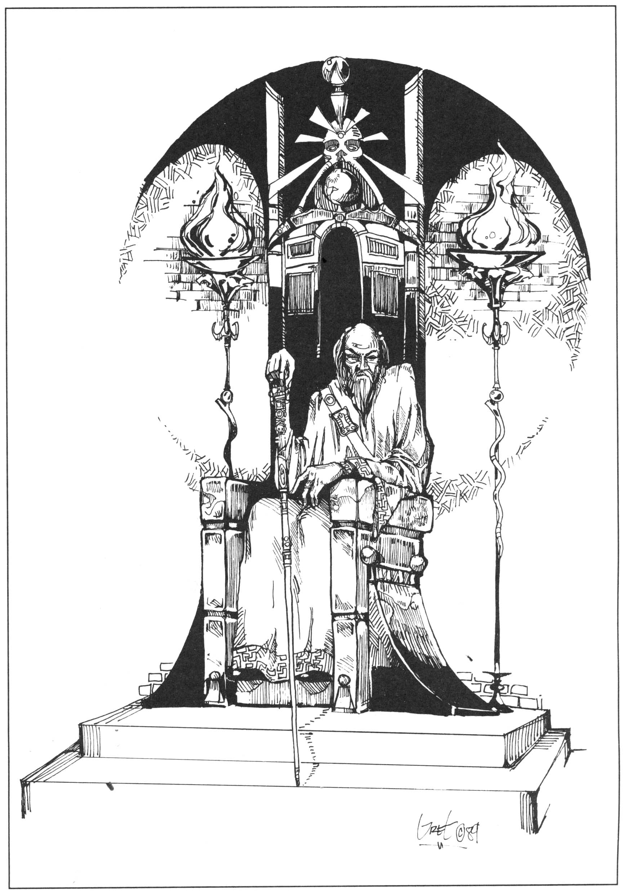

<title>Shagul som rollperson - Oraklets fyra ögon</title>

# 13. Shagul som rollperson

Vilken rollspelare drömmer inte om att någon gång få agera storskurk? Spelledaren kan i den här modulen låta en hemlig person spela trollkarlen Shagul. Både spelledaren och Shagulspelaren bör i så fall vara införstådda med följande:

* Shagul deltar sällan personligen i händelserna. Han ägnar sig framförallt åt strategiska drag mellan speltillfällena.

* Shagulspelaren bör vara en erfaren rollspelare som kan ha roligt utan att vinna och kan acceptera spelledarens veto om balansen rubbas alltför mycket. Med stor sannolikhet ogillar många gudar en uppkomling som Shagul och kommer att motarbeta honom genom att skydda hans fiender och söka styra hans öde. Vox Ranzinas profetior är just ett sådant gudaingripande.

* Shagulspelaren deltar inte personligen i speltillfällena utan lämnar sina drag mellan dessa. Det blir mer spännande om hans riktiga identitet är hemlig för spelgruppen även om detta inte är nödvändigt. Pratar spelarna bredvid mun får Shagulspelaren utnyttja informationen.



## Vad Vill Shagul?

Shaguls mål är att på sikt behärska så stor del av världen som möjligt, inte för att han vill njuta av den, utan för att han älskar kampen. Liksom Alexander den store och J. R. Ewing vill han vinna, och vinna ensam.

## Vad kan Shagul?

Shagul är mästare i Nekromanti, Mentalism och i shaguliternas speciella form av kroppskontroll som bl.a. låter honom anta vilken kroppsform som helst. Magikerns största makt ligger dock i förmågan att infiltrera, och i de kontakter med demoner och andeväsen som han skaffat under resor genom främmande världar.

## Shaguls historia

Shagul föddes i Tricilve, men såldes som barn till en excentrisk magiker i Fontra Cilor, där han växte upp och fick sin lärdom. Under uppväxttiden följde Shagul flera gånger sin mästare på resor till Kargom och Chrachz. Redan som en ung man grundade han Shagulitersekten, en munkmagikerorden som sökte fysisk, psykisk och magisk perfektion. Sekten verkade under många år i Vumbra, men fördrevs efter rykten om barnoffer och andra onämnbara ritualer. Sekten hade då byggt ett ensligt beläget tempel på den nordliga ön Marjura och drog sig tillbaka dit. När Shagul plundrade profeten Golabags grav under resor i Soluna för sjuttio år sedan, fick han reda på att det uråldriga Cruri skulle återuppstå ur Marjuras is och att den femte konfluxen närmade sig. Dessa händelser passade honom utmärkt, men han var för tidigt ute. För att i lugn och ro få förbereda sina planer, låtsades han ta sitt liv och stängde in sig i en gravkammare tillsammans med den vackra furstessan Elmesum av Krimbydh som en ringa förlustelse. Från graven gjorde han flera resor, både i spelvärlden och i andra världar. Han utvecklade ytterligare sin magi och sin kroppskontroll, tills han kunde skapa exakta kopior av sig själv.

Medan åren gick växte emellertid hans lärjungars kunnande och makt. Shaguliterna började oroa Shagul och han ångrade att han inte upplöst sekten innan han gick i graven.

Ödet tycktes spela honom i händerna i *Svavelvinter*. En grupp oförsiktiga äventyrare utplånade Shagulitersekten åt honom och väckte samtidigt Cruris siste kung Ottar från den åttahundraåriga sömnen. Det var dags att komma ut ur graven. Shagul kunde emellertid inte låta bli att skryta lite inför dessa enfaldiga äventyrare, något han senare ångrat många gånger. Shagul kallade till sig de överlevande Shaguliterna som deras återuppståndne mästare. Han bjöd dem vin, förgiftat med ett starkt salt från Traxilmes violetta öken, och såg dem dö. Visserligen dog också en av Shaguls kloner, men det spelade mindre roll.

Tiden efter Svavelvinter har Shagul ägnat åt att befästa alliansen med det återuppståndna Cruri.

## Vilket planer har Shagul för den närmaste tiden?

Den femte konfluxen är en tidpunkt och en plats, en fyrfaldig punkt bestämd av stjärnornas rörelser. Det som dominerar denna punkt kommer att påverka världens öde för lång tid framåt. Shagul misstänker att konfluxen kommer att äga rum på Marjura inom några år. Hans mål är att lokalisera konfluxen i tid och rum och använda dess kraft till att släppa in demonen Ebharing i vår värld. Samtidigt försöker han hindra alla andra från att finna den. Detta är anledningen till att han systematiskt mördar Trakoriens astrologer. Demonen Ebharing kommer att beskrivas närmare i kommande moduler.

## Vad talar för Shagul?

* Shagul är självutnämnd rådgivare till kung Ottar av Cruri, vars armé på c:a 7000 odöda är närmast oövervinnerlig på Marjura. Kung Ottar måste dock tas med lampor eftersom han vill bestämma enväldigt över sitt rike. Shagul kan handskas med Ottars något dammiga hjärna, men har svårare med den gamla hovtrollpackan Rirba. Shagul har alltså kontroll över Marjura där konfluxen antagligen kommer att äga rum.

* Ottar har ett svärd, besatt av den mäktiga demonen Ebharing. Shagul vet att bara en del av Ebharing tagit sig in i vår värld och har planer på att föra hit demonen hel och hållen under sin egen kontroll. Problemet är att Ottar inte vill skiljas från svärdet och att demonen Ebharing bara kommunicerar med den gamle kungen. Shagul räknar med att lura av kungen svärdet just innan konfluxen, och att kunna utnyttja konfluxens kraft för att föra hit och kontrollera demonen.

* Cruris odöda tar kraft från jordblodskällan, en källa där jordens essens strömmar fram som en röd asfaltliknande vätska. Shagul har lärt sig använda källans kraft för att utvidga sitt medvetande. Detta innebär att han kan sända ut sina kloner över världen och styra dem som ett kollektivt medvetande så länge en klon sitter vid jordblodskällan.

* Kmorda, det istäcke som täckt Marjura under Cruris förbannelse, smälter snabbt. Snart kommer Cruris gamla huvudstad Krau-Ki fram ur isen med mäktiga magiska föremål som Shagul räknar med att kunna använda.

* Shagul har tagit över lönnmördarorganisationen RhabdoRana genom att infiltrera deras primitiva kollektiva medvetande. Han har röjt de tidigare ledarna ur vägen.

## Vad talar mot Shagul?

* Shaguliterpatriarken Gobrugda överlevde Shaguls förräderi mot sekten och har svurit att hämnas. Gobrugda skar av och stal handen från den Shagulklon som förgiftat honom och de andra shaguliterna innan han flydde från Marjura. Patriarken har odlat fram handen till en ny klon som står bortom Shaguls kontroll. Shagul kan inte odla fram nya kloner om inte alla de andra är närvarande, och kan därför inte föröka sig förrän den stulna klonen är lokaliserad och undanskaffad. Gobrugda måste likaså röjas ur vägen för att inte kvarstå som ett hot mot sin forne mästare.

* Ranzinermunkarna har nyligen utfärdat en profetia vars innehåll hotar Shagul. Det sägs bland annat att Shaguls bane har sett hans rätta ansikte. (Shaguls tolkning, se raderna 33—40 i Vox Ranzina). Då Shagul stod fram ur graven visade han sig i övermod för äventyrarna som utplånat Shagulitersekten och väckt kung Ottar (just det, de andra spelarna). Av den anledningen har han givit RhabdoRana i uppgift att lokalisera och avliva dessa personer. Ranzinermunkarna söker samma äventyrare, vilket övertygat Shagul om deras betydelse. Shagul misstänker vidare att det finns fler, ej offentlig-orda delar av Vox Ranzina.

* På den lilla löjliga holmen Clusta Noba öster om Marjura finns en envis munkskola som ännu inte fallit under kung Ottars välde. Holmen befinner sig bara ett par hundra meter från huvudön, men de odöda arméerna kan inte korsa det djupa vatten som skiljer. Man har byggt jättelika katapulter som bombarderar munkarna, men dessa är av synnerligen härdat slag och mer stridsdugliga än vanliga munkar. De bor i ödemarken just för att härda sig fysiskt och psykiskt via den klassiska Banzikan. Clusta Noba är en nagel i ögat på Shagul, för det är inte omöjligt att konfluxen kan äga rum just där.

* Prinsessan Elmesum, Shaguls gamla sällskapsdam, avled när trollkarlen öppnade sin grav, men hennes ande har inte lämnat världen enligt de döda själar trollkarlen talat med. Elmesum hatar Shagul, men hon har vad Shagul vet inga speciella egenskaper som utgör något hot mot honom. En gång älskade han henne, men mot slutet lät han henne bli gammal, skrumpnad och tandlös för att frigöra sig från sitt beroende av henne.

## Shaguls färdigheter

Detta ärbara ett urval. Shagul besitter dessutom en hel del färdigheter och magi som inte står i regelböckerna, t.ex. när det gäller att kommunicera med andra världar, men detta har ingen betydelse för spelet. (För fördelning av magifärdigheter och PSY mellan klonerna, se avsnittet **Shaguls kloner**.)

**Egenskaper:**
```
STY 20   SMI 13   KAR 10 
STO 14   INT 22   KP  19
FYS 24   PSY 40
```

**Naturliga skydd:** Hud 2, halv skada av eggvapen.

**Naturligt magiskydd:** Inga besvärjelser som påverkar offrets psyke biter på Shagul såvida inte hela hans psyke = alla levande kloner befinner sig inom räckvidden för formeln.

Alla kloner besitter följande **färdigheter**: Astrologi 23, Drogkunskap (inkl. giftkunskap) 28, Geografi 20, Geologi 15, Historia 26, Läsa/ skriva/tala språk, jori (något föråldrad) 5/5/5, alviska 4/4/4, drakspråk 3/3/3, svartiska 2/2/5, insektoidspråk 3/3/3, dvärgspråk 1/1/3, Förklädnad 18 (se avsnittet **Shaguls kloner**)

Följande **magifärdigheter** ska fördelas enligt avsnittet **Shaguls kloner**:

Allmänna besvärjelser — Varje klon behärskar alla formler den kan ha upp till det högsta skolvärde den f.n. besitter i någon magiskola. Färdighetsvärdet är lika med skolvärdet i alla besvärjelser, av den enkla anledningen att han konsekvent tränar på de besvärjelser han är sämst på:

### Nekromanti 42

LIVSUTTÖMNING (Shagul använder en speciellt otrevlig variant som han själv har forskat fram. Räckvidden är 50 meter och PSY-kostnaden som dras är 1 per effektgrad.)

Andra nekromantikerformler — Varje klon behärskar alla formler den kan ha upp till det färdighetsvärde den för närvarande besitter i skolan Nekromanti. Skicklighetsvärdet i varje besvärjelse är lika med FV Nekromanti.

### Mentalism 34

Mentalistformler — Varje klon behärskar alla formler den kan ha upp till det färdighetsvärde den för närvarande besitter i skolan Mentalism. Skicklighetsvärdet i varje besvärjelse är lika med FV Mentalism.

Shagulism-egenskaper (bättre beskrivna i *Svavelvinter*):

Observera att Shagul ser ut som en vanlig människa trots att han har dessa egenskaper. Han är alltså inte grön, illaluktande etc. som shaguliterna var.

* Huden absorberar 2 KP skada.

* Regenererar skador 1 KP per timme. Förlorade kroppsdelar växer ut igen. (Om kroppen delas i flera lika stora delar är det biten med hjärnan som utvecklas). Icke-magiska eggvapen ger bara halv skada.

* Behöver inte andas.

* Okänslig för temperaturer mellan -100 till +100° C.

* Lever på någon näve mineraler per månad och två dl vatten per vecka.

* Kan ändra kroppsform efter behag på en timme (ej öka eller minska kroppsmassan). En formförändrad klon måste binda tre PSY-poäng för att stanna kvar i främmande form och återtar automatiskt Shaguls riktiga utseende om den dör, blir medvetslös eller hamnar på PSY < 3. De tre bundna PSY-poängen får inte användas ens för räddningskast om klonen vill behålla sin främmande form. Formförändringen påverkas inte av järn eftersom den inte bygger på magi.

## Shaguls kloner

Shagul har fyra kloner när spelet börjar. En av klonerna måste befinna sig vid jordblodskällan i Ottars grav som ger Shagul kraft. Om ingen levande klon finns inom 1 km från jordblodskällan eller närmare, eller om källan sinar, räcker Shaguls psykiska kraft bara 10 mil. Alla kloner utanför räckvidden dör omedelbart, men Shagulspelaren bestämmer vilka som ska överleva (”Gobrugdas piratklon” påverkas inte eftersom den är av annan fason). Han tappar också kontrollen över RhabdoRana, och kan inte ta kommando på nytt även om han återvänder till källan.

Övriga kloner kan befinna sig var som helst i Trakorien, men är inte riktigt vana att umgås med folk. Om en Shagulklon försöker framstå som en vanlig människa, slår SL för färdigheten Förklädnad FV 18 minst en gång per vecka. Vid ett misslyckat slag tycker någon att klonen är mystisk. Vid fummel är denne undrande polis/vakt el. dyl.

Om ”piratklonen” dör kan Shagul tillverka en ny klon per månad såvida alla existerande kloner är samlade på ett ställe. (Rent praktiskt skulle nog Shagul avliva alla kloner utom den vid jordblodskällan och göra nya där.)

### Klonernas färdigheter

Shaguls färdighetsvärden i magiskolor delas på valfritt sätt mellan klonerna, men den klon som sitter vid jordblodkällan måste ha minst hälften i varje färdighet. Beroende på vilket skolvärde som tilldelats dem, kan de olika klonerna alltså kasta olika besvärjelser med olika chans att lyckas.

Alla kloner har Shaguls grundegenskaper. PSY fördelas dock mellan klonerna på samma sätt som färdigheterna i magiskolor.

Shagul kan flytta ett poäng PSY eller färdighetsvärde i någon magiskola mellan två valfria kloner per dag.

### Vad händer om en klon dör?

Om en Shagulklon dör återgår alla dess färdighetsvärden i magiskolor och hälften av dess tilldelade PSY till klonen vid jordblodskällan. Resterande av PSY förloras för alltid.

## Shaguls övriga styrkor:

### Demonerna Shaggira och Lugahs

Shagul får styra demonerna som han vill enligt de förutsättningar som ges i respektive avsnitt.

### RhabdoRana 

* I spelets början får Shagulspelaren placera ut RhabdoRanas medlemmar på Trakoriska öarna som han vill eller enligt förslaget i avsnittet. Han får också placera ut två hemliga baser där organisationen förvarar/tillverkar sina kryp respektive gifter.

* Information från fältet når Shagul på 1T8 dagar.

* Shagul kan ge fyra order till RhabdoRanaledare per spelvecka. Dessa har i sin tur givit sina underlydande order efter 1T8 dagar. Se f.ö. avsnittet om RhabdoRana.

### Det odöda Cruri

Kung Ottars folk spelar mindre roll för närvarande. Ottar behärskar hela Marjura, och om SL vill kan trupperna få utkämpa krig mot öns kvarvarande jättar, dvärgar och människor som gör förtvivlat motstånd. Annars ägnar sig Ottars zombier åt att bygga befästningar, fylla ut vattengapet mellan Marjura och Clusta Noba med sten, vilket tar flera år, och åt att bombardera munkarna med katapulter.

### Andeväsen

Genom sina förbindelser med andra världar, kan Shagul bevaka om tre specifika personer passerar porten till dödsriket (på in- eller utväg). En själ passerar normalt in i dödsriket 6 + 1T6 timmar efter sin död. Elmesums själ har ännu inte passerat in trots att hon dog för ett par år sedan. 

## Spelledarens information till Shagulspelaren

* Shagul får reda på vad Ottars zombier och RhabdoRana har att rapportera inom 1T8 dagar. SL bör regelbundet skriva en rapport och blanda upp den med påhittad information.

* Shagul vet omedelbart allt hans kloner och demonen Shaggira upplever.

* Shagul vet med 70% säkerhet allt demonen Lugahs upplever.

### Sammanfattning: Shaguls möjliga speldrag

* Ge högst fyra order till RhabdoRanaledare per spelvecka.

* Ge order/personligen styra demonerna Shaggira och Lugahs.

* Flytta en poäng PSY/färdighetspoäng i magiskola per dag mellan två Shagulkloner.

* Rollspela klonerna om han och SL vill och detta är aktuellt.

* Ge order om vilka tre personers eventuella död/återuppståndelse som ska rapporteras från dödsrikets port.
