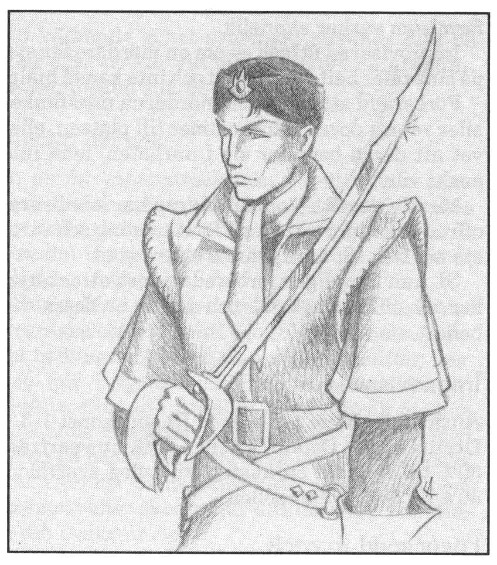

<title>Digeta longa - Oraklets fyra ögon</title>

# 15. Digeta longa

## Digeta longa

Trakoriska riket ser inte stillatigande på när orosmolnen hopas. Man har satt sin bästa spion på att undersöka de mystiska omständigheterna runt katastrofen på Marjura och oroligheterna på Trinsmyra. Lugal Praanz da Kaelve är Paratornas främste sabelfäktare och därtill högt uppsatt officer inom bodâkens säkerhetspolis, Digeta longa. Om spelledaren vill, kan han anlita en hemlig spelare som sköter Digeta longa genom Praanz da Kaelve.

*Tipz: Det är en fördel att ha både en da-Kaelvespelare och en Shagulspelare så att de kan bråka med varandra och ge spelargruppen en chans att slinka undan. I min egen kampanj lyckades Digeta langa arrestera en av Shaguls kloner genom att lägga ut ett bete. Sedan hade båda spelarna sysselsättning för flera veckor framåt.*

Förutsättningarna är följande:

* da Kaelve-spelaren deltar inte i speltillfällena annat än då spelarna stöter på honom personligen (inget hindrar dock att han eller hans agenter söker bli medlemmar av sällskapet). Spelledaren ger regelbundet da Kaelve-spelaren information från hans spioner och om allmänna händelser. Mellan spelmötena får spelaren lämna in order och information sina styrkor, allmänna efterlysningar m.m. Han kan också rollspela på egen hand då det är motiverat eller önskvärt.

* da Kaelves lojalitet bör i första hand gälla riket och inte spelargruppen även om han är medlem i denna. I den mån motiven sammanfaller kan han i smyg tänkas hjälpa gruppen. Om säkerhetspolisens resurser däremot villkorslöst ställs till gruppens förfogande kommer då Kaelves överordnade att misstänka förräderi.

* da Kaelve kan agera utan moraliska hänsyn så länge inte han eller Digeta longa komprometteras. Skulle så ske kopplas han bort från undersökningen och har förlorat spelet. Likaså ansvarar da Kaelve inför sina överordnade för undersökningens utveckling i stort. Han har många konkurrenter som gärna såg att han misslyckades.

* Om inte då Kaelve kommer någon vart i sin undersökning kan Goba da Grummi sätta in ytterligare en agent, dvs. spelledaren kan anlita fler spelare.

*Tipz: I min kampanj sköttes Digeta longa redan från början av två spelare, vilket gjorde att de kunde konferera och turas om att lämna huvudstaden på hemliga uppdrag. Spelare nummer två spelade en ädling från Palamux vid namn Nindohallask da Bhannavile. De två fick i sin tur fria händer att anlita spioner i spelargruppens vänkrets efter behag, naturligtvis med risken att bli avslöjade eller att anlita någon som redan var Shaguls spion.*

## Digeta longas syn på dagsläget

Trakoriska riket ockuperade för 17 år sedan staden Arhem på Marjura för att få kontroll över svavelutvinningen i träsken nära staden. Svavelhandeln var mycket lönsam, men för två år sedan tvingades man utrymma kolonin eftersom ett helt rike odöda plötsligt stod upp ur sina gravar och anföll människornas samhällen. Äventyrare hade rört sig i den ödsliga trakten Cruri varifrån de odöda kom, och man misstänker att gravplundring kan ha väckt de döda. Man vill veta vad som hände i Cruri och vad man tog från de döda så att deras frid kan återställas, men har inte lyckats spåra alla som befann sig på Marjura vid den aktuella tiden.

Samtidigt med de dödas uppståndelse avslöjades en komplott mellan Marjuras rebeller och konservativa krafter på ön Trinsmyra. Man hade i hemlighet skeppat vapen till Arhem och underhandlat med isbarbarer om att driva bort trakorierna från ön. Avslöjandet ledde till straffexpeditioner i Milacke på Trinsmyra. Dessa expeditioner leddes av kondottiären Cymba, som gick till verket med sådan grymhet att ett inbördeskrig blomstrade upp. Cymba fick sparken och den mer rutinerade Kakralgus Piknäsa återfick kommandot. För tillfället härskar ett spänt lugn i Milacke, men det jäser under ytan.

Praanz da Kaelve misstänker att de äventyrare som väckte upp de döda i Cruri var milackiska sabotörer och vill gärna ha tag i dem.

Alldeles nyligen har ytterligare komplikationer tillstött. Den gamla oförargliga ranzinersekten har offentliggjort en profetia med statsfientligt innehåll, där rikets undergång antyds. Representanter från det heliga Kishatet, där man enligt rikets spioner rustar i smyg, var mycket snabba med att sprida och tolka profetian till rikets nackdel. Bodâken upplöste genast ranzinersekten, men dess munkar tycks mer hängivna än någonsin. De reser runt på öarna och besöker alla som var på Marjura strax innan man tvingades lämna ön. Munkarna tycks söka efter samma personer som da Kaelve vill ha tag i. Kanske är också ranzinerna inblandade i en mycket större komplott?

Av någon anledning har den gamla religiösa mördarorganisationen RhabdoRana blivit aktiv. Mördarna har dels utfört flera terrormord mot heliga män, dels följt ranzinerna i spåren och dödat flera av munkarna och de människor munkarna besökt. da Kaelve har fångat och förhört en RhabdoRanamördare, men mannen dog under förhören utan att avslöja något.

Praanz da Kaelve har nu rest till ranzinernas överhuvud, Peatro Petralba av Ranz. Tillsammans med sin chef, prästen Goba da Grummi, tillika medlem i bodâkens Mana extenda, ska han förmå Peatron att ta tillbaka profetian. Man har mandat att förklara ranzinerna fredlösa om peatron vägrar. Riket får emellertid på intet sätt förknippas med våld eller olagligheter mot sekten. Detta skulle genast utnyttjas i Kishatets propaganda.

## da Kaelves order

da Kaelves uppdrag är att kartlägga sambanden mellan Marjurakrisen, RhabdoRana och Vox Ranzina. Trakoriska rikets intressen måste tas tillvara och rikets fiender avslöjas. Kanske står rikets hela existens på spel. Orderna kan komma att ändras med förutsättningarna.

## Information vid spelets början

da Kaelve-spelaren får läsa de allmänna delarna av Vox Ranzina och den politiska utvecklingen fram till spelets början. Han har också tillgång till kartan över militära styrkor. da Kaelves personuppgifter finns i persongalleriet.

## da Kaelves resurser

### Spioner

Innan spelet börjar får da Kaelve placera ut tio spioner i Trakorien. Det är roligare, men besvärligare om dessa spioner arbetas fram som riktiga personer. Eftersom säkerhetspolisen plockat ut dessa spioner bland ett stort antal kandidater, kan SL låta Praanz-spelaren plocka ihop tio SLP efter behag, men förbehålla sig vetorätten om de görs för mäktiga. Spionerna rapporterar omedelbart allt av intresse till da Kaelve. Detta tar normalt 1-2 dagar om han är i Tricilve (via brevduvor m.m.) och annars 2 + 1T6 dagar. Order till spionerna når dem inom 1T10 dagar (beroende på var de befinner sig.)

Spionerna kan skapas med följande begränsningar:

* Inga egenskaper eller färdigheter över 18.

* Summan av personens grundegenskaper får inte överstiga 85.

* Spionens färdigheter får motsvara högst 500 poäng.

* Högst tre får vara magiker.

* Alla har den bästa tänkbara utrustning, men ingen har magiska föremål.

Allt som trakoriska trupper eller tjänstemän ser kommer i 70% av fallen till då Kaelves kännedom inom 4 + 1T6 dagar om det har med hans uppdrag att göra. Alla meddelanden är skrivna på kod.

### Lejdebrev

Praanz da Kaelve har ett kejserligt lejdebrev som låter honom begära fri transport och logi av rikets innevånare. Han kan begära rimlig och diskret assistans och utrustning från trakoriska garnisoner eller tjänstemän närhelst det behagar honom. Varje gång lägre officerare, tjänstemän eller vanliga soldater är inblandade, finns 35% chans vardera att Kishatet och RhabdoRana får reda på vad da Kaelve sagt.

### Större insatser

Om da Kaelve vill använda stora truppstyrkor eller göra något annat som kostar mycket pengar måste han motivera sig inför Goba da Grummi (=spelledaren). Goba da Grummi kan sanktionera utgifterna om de tycks vara rimliga. Öka gärna pressen genom att låta herr Goba säga: ”Du ska få dina pengar, men jag hoppas för din egen skull att detta leder någonstans!”

### Borgen vid Fam Kvalvi

På ”Blodiga backens” klippor utanför Fam Kvalvi ligger säkerhetspolisens egen borg. I dess djupa källarvalv finns många rymningssäkra celler och förhörskamrar med utrustning som gör den mest tystlåtne talför. Alla i borgen är handplockade och noga kontrollerade med magiska metoder. Vakterna har skrivit på ett välbetalt kontrakt med s.k. strikt ansvar. Detta innebär att de förlorar livet om någon fånge lyckas rymma även om de inte gjort något fel. SL bör räkna med att det som händer innanför borgens murar förblir en hemlighet. Borgens försvar är kraftigt förstärkt med magi.

### Lärdom

Digeta Longa har i borgen ett eget bibliotek med en handfull pålitliga lärda män. Praanz da Kaelve kan ställa frågor till de lärda männen, vars kunnande motsvarar FV 15 i alla lärdomsfärdigheter. Om han inte får svar, kan da Kaelve vända sig till akademin i Tricilve. Den samlade akademin motsvarar FV 20 i alla lärdomsfärdigheter, men det finns 35% chans vardera att RhabdoRana och Kishatet får reda på både frågor och svar.

Hovastrologen Miraklor (FV 18 i Astrologi) med några lärlingar befinner sig i borgen för att skyddas mot RhabdoRana.

### Magi

I borgen vid Fam Kvalvi finns ett välutrustat laboratorium och fyra pålitliga magiker. Dessa häxmästare underhåller borgens magiska försvar, hjälper till vid förhör och deltar i undersökningsarbetet så snart man misstänker att magi är inblandat i ett fall. 

Räkna med att magikerna tillsammans har FV 18 i Mentalism, Illusionism och Elementarmagi samt FV 15 i Symbolism och Animism. Varje enskild besvärjelse upp till det angivna skolvärdet kan kastas av en eller två magiker (Slå 1T2 eller bestäm det som verkar troligt).
