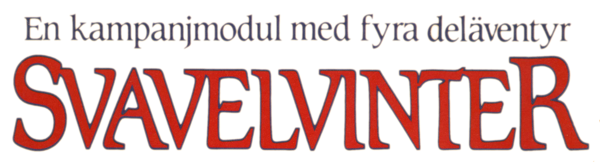
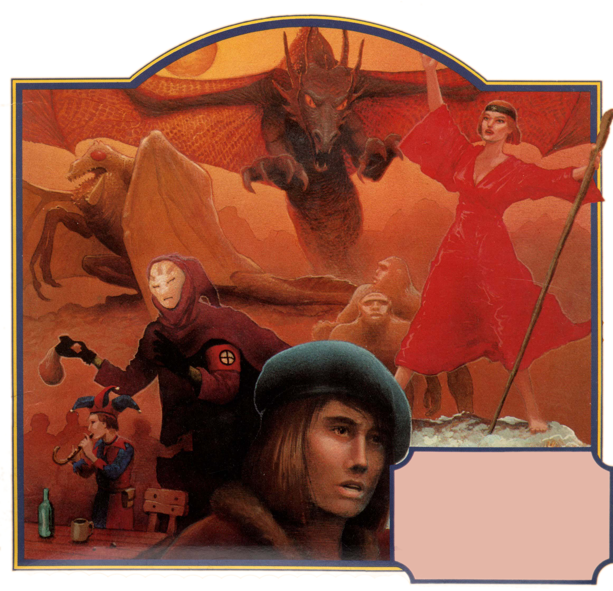
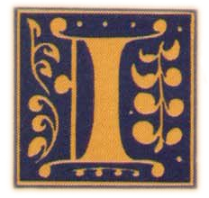
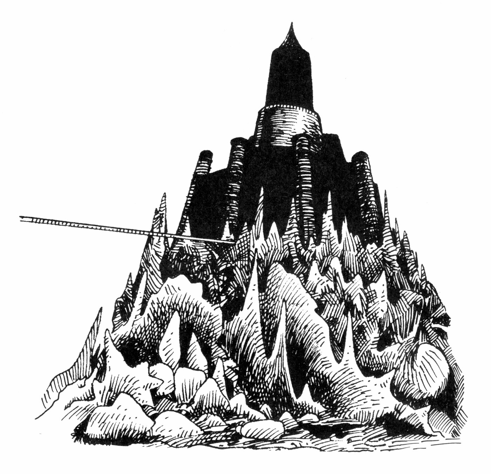
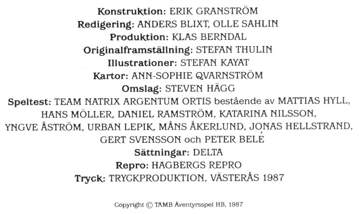

<title>Svavelvinter</title>

 Norra Ishavet ligger Trakoriens yttersta utpost, ön Marjura. Den är glest befolkad med religiösa fritänkare från Trakorien, primitiva urinvånare, dvärgar och jättar. Sedan en tid tillbaka är den ockuperad av trakoriska trupper, som skyddar den viktiga svavelutvinningen. Under ytan sjuder det av spänning; det finns många dolda konflikter mellan olika intressen.

I huvudstaden Arhem blandas alla befolkningsgrupper och där kan en äventyrare ha goda möjligheter att tjäna pengar. Ute i ödemarken finns många intressanta platser att utforska, t ex det forntida Cruris gravfält och den drakbesatta kvicksilvergruvan.

Men det finns ondskefulla motståndare. Shaguls grymma nekromantikersekt utövar ett stort inflytande över ön från sitt dolda Järntorn. Politiska fanatiker konspirerar mot varandra, och utomstående kan dras in i deras intriger.

Svavelvinter är en omfattande kampanjmodul. Den innehåller en detaljerad skildring av ön Marjura, dess huvudstad Arhem och många andra viktiga platser, beskrivningar av alla viktiga SLP, inklusive Shagulitersekten, fyra äventyr, och en fyrfärgskarta över ön. Modulen är avsedd för en rutinerad spelledare med erfarna rollpersoner i sin grupp.

# 00. Titelblad

## Erkännanden

**Konstruktion:** Erik Granström
**Illustrationer:** Stefan Kayat
**Kartor:** Ann-Sophie Qvarnström
**Omslag:** Steven Stahlberg (Hägg)
**Speltest:** *Team Natrix Argentum Ortis* bestående av Mattias Hyll, Hans Möller, Daniel Ramström, Katarina Nilsson, Yngve Åström, Urban Lepik, Måns Åkerlund, Jonas Hellstrand, Gert Svensson och Peter Belé
**Digitalisering:** Klas Lindberg

> ### För den historieintresserade
>
> Titelbladets lista med erkännanden hade ursprungligen detta innehåll:
>
> 
