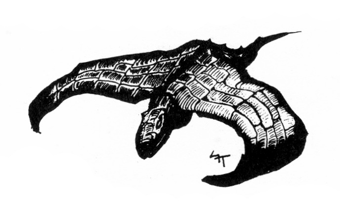
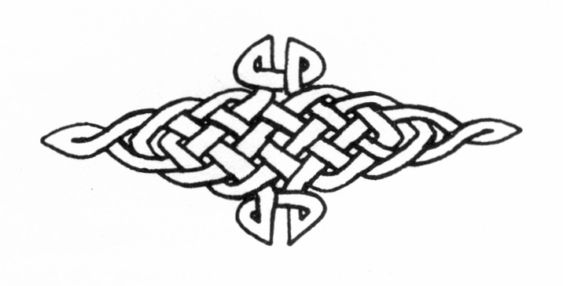

<title>Introduktion för SL - Svavelvinter</title>


# 02. Introduktion för SL

Svavelvinter är ett ganska stort kampanjscenario som bör räcka till många spelmöten.

När rollpersonerna kommer till ön Marjura, hamnar de mitt i en härva av intriger, där olika intressen mer eller mindre öppet bekämpar varandra. Det är en fördel om SL offrar lite tid på att läsa igenom och sätta sig in i maktgrupperingarnas planer innan spelet börjar. Med största sannolikhet kommer rollpersonerna snart att dra uppmärksamheten till sig och trampa någon på tårna. SL måste kunna avgöra vilka som intresserar sig för deras handlingar och vilken reaktionen kan bli.

Spelet blir mer spännande och spelarna oroligare om de märker att händelser de inte förstår hela tiden pågår runt omkring dem. De ska få intrycket av att Marjura inte legat och väntat på dem, utan kanske helst velat slippa dem.

Så länge rollpersonerna befinner sig i Arhem kan SL slå på slumptabellen för att se vad som händer, men spelarna bör själva tvingas ta initiativet att driva händelserna framåt. När tabellen visar det, eller när det faller sig naturligt, kontaktas äventyrarna av nyckelpersonerna till deläventyren.

I Kvicksilvergruvan vill dvärgen Gwellmyn anlita rollpersonerna för att hämta upp några tunnor kvicksilver ur en gruva som ockuperats av draken Blatifagus.

Druidtemplet inleds med att den kvinnliga isdruiden Perrima vill ha eskort för att kunna undersöka vad som hänt med druidernas tempel på berget Biletand.

I Cruris gravar leds rollpersonerna av det nomadiserande kvurerfolket till Cruris gravfält för att hämta mäktiga vapen som ska befria Marjura från shaguliternas ondska.

Dessa deläventyr ger rollpersonerna hjälpmedel, allierade och information som kan hjälpa dem i slutstriden mot shagulitersekten, vars mörka skugga ligger tung över Marjuras is. De kan spelas i valfri ordning.

I det sista deläventyret beskrivs sekten och dess högkvarter, Järntornet i Dymrabergen.

Vill man inte spela hela scenariot kan deläventyren plockas ut och spelas fristående även om detta förtar sammanhanget.

Närmast följer lite spelteknisk information för SL. Sedan kommer en beskrivning av Marjuras klimat, djurliv, historia mm. SL kan låta spelarna få del av denna information allt efter rollpersonernas färdigheter.

Före deläventyren beskrivs också hamnstaden Arhem och slavlägret i svavelträsken.

## Speltekniska detaljer för SL

* I textens sidhänvisningar betyder D — Grundregelboken, E — Expertregelboken, M — Magiboken och MB — Monsterboken.

* I en del detalj ritade rum har det stor betydelse var alla står, tex när en fälla utlöses. Det rekommenderas att tennfigurer eller något liknande används så fort rollpersonerna kommer in i sådana rum.

* SL-personer beskrivs enligt följande mall: Värden, färdigheter, utrustning, inlästa formler och en del andra enklare egenskaper finns noterat på ett separat rollformulär för varje person. I texten beskrivs utseende, karaktär och mer speciella förmågor i det sammanhang där man först träffar personen.

* Platser beskrivs enligt följande mall: **ALLMÄNT** berättar om vilken typ av plats man hamnat på. **ÖVERBLICK** beskriver vad man ser om man tittar sig omkring utan större noggrannhet. Det här avsnittet kan oftast läsas upp för spelarna allt eftersom de vandrar omkring. **DETALJER** skildrar vad man hittar om man letar mer noggrant och på rätt plats, eller lyckas med de färdighetsslag som krävs. **VARELSER** talar om vilka levande eller odöda varelser man kan stöta på. **SKATTER** beskriver de värdeföremål man kan hitta, hur man hittar dem och vad de är värda. Ibland har samma föremål olika värde beroende på vilken värdering som används. T ex kan en dolk ha ett värde som vapen, ett annat som antikvitet, ett tredje som prydnadsföremål och så vidare. SL kommentarer avsedda för spelledaren.

* Förkortningen FV betyder att en färdighet måste användas för att få viss information. *Exempel: FV Värdera metall — 200 gm, betyder att ett lyckat slag med färdigheten Värdera metall avslöjar att föremålet är vårt 200 gm.*

* Många av de individer som rollpersonerna kommer att stöta på under äventyrandet är redan namngivna och utarbetade. Däremot har mer anonyma varelser av utrymmesskäl inte beskrivits i detalj. Istället har typiska värden för grundegenskaper och färdigheter listats i en tabell.

* När rollpersonerna möter soldater och slödder kan SL slå 1T20 för att kontrollera om en individ är informatör åt shaguliterna. Resultatet 18, 19 eller 20 innebär att en lösdrivare är informatör. Resultatet 20 innebär att en soldat är informatör. Informatörer berättar allt de ser eller hör av intresse för sina uppdragsgivare.

* Om den hemlighetsfulle yrkesmördaren Tobik används bör SL redan från början bestämma vem han är och modifiera personen ifråga.

## Ön Marjura

### Marjuras historia

**800 år före nu (fn):** Kungadömet Cruri går mot sin slutliga undergång efter att ha dragit gudarnas förbannelse över sig genom förbjudna magiska efterforskningar. Kung Ottar, Cruris siste härskare, går i graven samtidigt som gudarna täcker Marjura med snö och is. Rikets primitiva tjänarfolk anpassar sig till nomad— och jägarliv och lever vidare med oklara sägner som enda minne av sina forna härskare. De kallar sig kvurer, vilket är en ombildning av ordet "Cruri".

**700 år fn:** Dvärgar och isjättar vandrar över polarisen och bosätter sig på Marjura.

**200 år fn:** Efter hårda religionskrig på Trinsmyra flyr en utbrytargrupp med jämlikhetsideal till ön och slår sig ner på sydvästkusten där de livnär sig på fiske och fårskötsel. Namnet Marjura stammar från denna tid.

**100 år fn:** Nekromantikern Shagul fördrivs från den trinsmyriska staden Vumbra och tar sin tillflykt till ön. I Dymrabergen på norra Marjura bygger Shagul sitt järntorn med hjälp av dvärgar.

**50 är fn:** Shagul söker själv döden, driven av obesvarad kärlek till prinsessan Elmesum. Shagulitersekten lever vidare och fördjupar de onämnbara lärorna.

**15 är fn:** Tasenbar Örtkänne upptäcker nyttan av vinsvavling och trakoriska trupper ockuperar svavelträsken på sydvästra Marjura efter hårda strider med Marjurerna. Marknadsplatsen Arhem byggs ut till hamnstad. Straffångar deporteras till Marjura för att samla och rena svavel från träsken.

**10 år fn:** Dymratraktatet undertecknas av Trakoriens kejsare. Traktatet låter shaguliterna praktisera sina läror utan inblandning så länge trakoriska lagar respekteras och bara slavar eller infödingar används till experimenten.

**4 år fn:** Guldfynd från nordvästra Marjura hemförs till Tricilve och väcker där stor uppståndelse. En mindre guldrush följer, men flera expeditioner försvinner spårlöst. Diskreta krafter tycks vilja skydda öns hemligheter.

Draken Blatifagus anfaller oväntat dvärgarnas kvicksilvergruva och ockuperar den "av personliga skäl". I all hast sluter man en bräcklig överenskommelse med odjuret, där trakorierna åtar sig att hålla besten med mat så länge den inte ställer till bråk.

**Nu:** Rollpersonerna kommer till Marjura.

### Sjöfart till och från Marjura

Transport över haven kan bara ske på våren och hösten. Sommartid bildas lokala cykloner med hård åska över vattnet och dessa bildar vandrande oceanvirvlar som kan dra stora farkoster i djupet.

Chansen att stöta på cykloner är x% per dag, där x är antal kilometer från land, men högst 20. Chansen att drabbas av en oceanvirvel är x% per dag, där x är antal kilometer från land, men högst 10.

Vintertid gör drivande isberg färden osäker. Dessutom leker sjöormarna i vattnen söder om Marjura under årstiden. Chansen att styra på ett isberg på vintern är 15% per dag, men om befälhavaren lyckas med Sjökunnighet undviker man kollisionen. Vid kollision mister farkosten 1T100 + 20% av sina KP, sin styrförmåga och sin fart. Vid förlust av 100% eller mer av sina KP sjunker farkosten. Slaget kan modifieras med befälhavarens Sjökunnighet och minskas med 20% om båten rör sig med halv fart eller mindre.

Chansen att locka till sig 1-2 sjöormar är x% per dag, där x är antal kilometer från land men högst 25.

Överfart mellan Paratorna och Marjura sker vanligen i konvoj eftersom ensamma skepp lätt kapas av pirater.

### Marjuras klimat

I väderavsnittet kan man avläsa dag- och natt-temperatur månad för månad. Medeltemperaturen kan modifieras med +10°C på dagen och —5°C på natten om det är klart väder.

SL behöver inte ange temperaturen särskilt noga för spelarna, eftersom rollpersonerna varken känner till termometrar eller temperaturskalor. Det räcker med att säga att det droppar från istapparna eller att det är bitande kallt och att rimfrosten tynger i skäggen.

För att bestämma nederbörd och vindstyrka placerar man vädermarkören på rutan "Halvklart, lätt bris" den dagen rollpersonerna kommer till Arhem. Sedan slår man varje morgon 1T10 och flyttar markören enligt instruktionerna. Hamnar markören i ytterläge på skalan, flyttas den inte längre även om tärningsslaget anger detta.

### Förfrysning

Vandrar man omkring i hård kyla med bristfälliga kläder finns det en risk för frysskador. SL får bestämma om bristerna är måttliga eller allvarliga.

Karsonfett motverkar alla negativa följder av kyla. Måttligt bristande utrustning medför att CL för alla SMI-baserade färdigheter minskar med 2. Vidare måste personen klara ett normalt FYS-slag/dag eller få 1 poäng frysskada. Rustningar skyddar inte mot frysskador.

Allvarligt bristande utrustning eller storm vid —2O°C eller kallare medför att CL halveras för SMI-baserade färdigheter Personen får dessutom 1T4 i frysskada om han inte klarar ett svårt FYS-slag/dag. Söker man vindskydd vid storm i kallt väder får man inte några skador.

Alla färdigheter som måste utföras med bara händer, tex klättra, får CL —1 per —5°C under noll, såvida man inte smort in fingrarna med karsonfett eller annat köldskydd.

### Terräng och Växtlighet

På översiktskartan finns de olika typerna av landskap utmärkta.

**Nakna klippor med lavar:** Marjuras berg är av vulkaniskt ursprung, taggiga och oslipade. Det är svårt att överraska någon i den här terrängen eftersom man måste röra sig försiktigt och inte har några buskar att gömma sig i. Några enstaka lavar duger att koka soppa på, annars är växtligheten mager. Förflyttning sker enligt tabellen sidan E 71.

**Hedlandskap:** På Marjuras hedar strövar betesdjuren omkring. Det är ganska svårt att komma inpå dem eftersom landskapet här är flackt och bara har en låg, tät växtlighet av ljung och gräs. Förflyttning sker enligt "öppen terräng" tabellen sidan E 71.

**Mager tallskog:** Närmare havsstranden har vinden pressat ner tallarna till knotiga buskar, men i mer skyddat läge kan träden bli upp till femton meter höga. Det är svårt att få tag i riktiga plankor på Marjura, men virket från tallarna är mycket segt och starkt. Förflyttning sker som i öppen skog i inlandet, men som i tät skog närmare kusten.

**Vitskog:** Vitskogen bildas av jättevitmossa som liknar vanlig vitmossa [sådan som man lägger i adventsstakar) men som är sex meter hög. Skogen är mycket vacker, men svårforcerad. De grova buskarna har ett svampigt och fuktigt trä som är odugligt till det mesta. Man torkar det och använder som bränsle, eller som isoleringsmaterial i kläder och byggnader. Buskarna håller inte att klättra upp i för personer med STO mer än 6. Förflyttning sker som i tät skog enligt tabell sidan E 71. Sikten är mycket begränsad i vitskog och man har +5 CL på färdigheten Kamouflage.

**Glaciär:** Sådan terräng är täckt av ett tjockt, sammanhängande islager.

**Träsk** beskrivs närmare i samband med svavelträsken.

### Marjuras fauna

Marjuras djurliv är sparsamt och består dels av smågnagare, sälar, hjortar, vildfår och renar. Dessa djur sammanfattas som "bytesdjur". Dessutom finns mer aggressiva djur som kan ställa till besvär för äventyrare. Dessa är ulvar, isbjörnar, karsonbison, mammutar och pälsödlor. De fyra förstnämnda finns alla beskrivna i monsterboken, medan pälsödlan beskrivs här.

### Pälsödla



Pälsödlorna är en högre utvecklad, varmblodig variant av flygödlorna (MB). Namnet är missvisande eftersom dessa djur inte alls har päls, utan skyddas mot kylan av en tjock porös hud, vars många små hålrum kan fyllas med luft som isolerar djuret.

Pälsödlan är mindre, men intelligentare än sin anfader och föder levande ungar, vilket fått vissa lärda att räkna den till däggdjuren. Till skillnad från flygödlan luktar pälsödlan inte illa, men är lika glupsk och aggressiv.

Om huden prepareras av en garvare inom ett par timmar, behåller den sin värmehållande förmåga och är då värd ca 50 sm. Man syr bla läderflaskor för varma drycker av den.

**Hemvist:** 11
**Vanlighet:** Ovanlig
**Antal:** 1-2

#### Grundegenskaper

```
STY 2T6+25    32    SB 1T10
STO 2T6+17    24    KP 21
FYS 2T6+10    17
SMI 3T6       11
INT 8         8
PSY 2T6       7

Naturliga vapen    GC    Skada
1 Bett             15    1T6
```

**Naturligt skydd:** 3p skinn
**Förflyttning:** F40/L4
**Färdigheter:** Finna dolda ting 12

## Äventyrande i vildmarken

### Allmänt om långfärder

I många rollspel tvingas spelarna använda en viss förutbestämd stig för att komma från sin bas till sitt mål. Det berättas då vad man ser på vägen, hur lång tid marschen tar osv. Nackdelen med ett sådant system är att äventyrarna måste följa det förutbestämda mönstret och inte plötsligt kan gå rakt in i skogen eftersom kartan i princip är blank bortom stigen.

I detta äventyr beskrivs inga speciella vägar till de platser man vill vandra till, utan spelarna får själva finna en väg genom att fråga lokala jägare, hyra en guide eller ge sig av mot något lämpligt väderstreck.

Stigar och vägar är förstås kända av de som brukar använda dem, men i vildmarken måste man följa fasta landmärken som floder, skogskanter, glaciärer, bergskedjor, kustlinjer eller liknande. Man kan också ta riktning mot ett berg i fjärran.

SL bör hålla i tankarna vilken inverkan dåligt väder får på orienteringsförmågan. Följer man en flod är det förstås svårt att gå vilse, men om rollpersonerna fortsätter utan orienteringspunkter slår SL slumpmässigt fram deras färdriktning.

Ett annat sätt är att vandra mot ett visst väderstreck, vilket kräver färdigheten Orientering. Färdigheten bör i detta äventyr innebära att man vet åt vilket väderstreck och hur lång sträcka man färdats under dagen, alltså inte att man hittar vägen från punkt A till punkt B, vilket anges i Expertreglerna.

Har man vissa landmärken att gå efter räcker ett lyckat färdighetsslag om dagen, men orienterar man helt efter himlen måste två slag om dagen slås. Misslyckas slaget felbedömer man färdriktningen med 110—20 grader och färdsträckan med +-10-20%.

### Slumptabell för händelser i vildmarken

Då rollpersonerna befinner sig i vildmarken kan SL antingen själv bestämma vad som händer eller slå två gånger per dygn på denna tabell. Även om SL använder tabellen behöver han inte tveka över att lägga in annat som passar med omständigheterna. Det viktigaste är att spelarna råkar ut för rimliga möten. SL kan också avstå från att använda tabellen om han anser att gruppen är så försvagad att den inte skulle klara av några möten.

```
1T100   Händelse
01-50   Inget speciellt händer.
51—55   Plötsligt väderomslag. Slå på vädertabellen.
56-65   Ett större bytesdjur upptäcks på håll.
66-70   Bäck eller hetvattenkälla porlar invid leden.
71-72   1-2 pälsödlor på jakt upptäcker vandrarna.
73-75   1-2 isbjörnar påträffas (bara vid kusten).
76-77   Bisonflock på bete (hedland långt från folk).
78      1-2 mammutar på bete (hedland långt från folk).
79      2-4 jagande ulvar upptäcker äventyrarna.
80      Jagande horndemon upptäcker äventyrarna (25% den vilda).
81-83   2-12 dvärgar på jakt vandrar förbi.
84-86   Man möter 1-6 kvurerjägare.
87      Man möter en trakorisk vildmarkstrupp.
88      Man träffar 1-4 marjuriska pälsjägare.
89      Man upptäcks av snapphanarna.
90      Råbald Niding ligger i bakhåll eller rusar fram för att snappa åt sig något.
91      Draken Blatifagus flyger förbi. Han struntar i äventyrarna 95% av gångerna.
92      Man möter Gistacki och Robur Rödvad på guldletning.
93      2-8 marjurerorcher på människojakt upptäcker äventyrarna. 25% chans att de leds av en horndemon.
94      Man möter munken Abenazer på vandring.
95      Guster Svartskäkta ligger i bakhåll tillsammans med 2-8 rövare (värden som soldat sidan E 73).
96-00   Färden måste avbrytas för dagen på grund av lättare skada på person eller utrustning.
```

### Färd på glaciären

Den som ger sig ut på glaciären lever farligt om han inte har sakkunnigt sällskap och god utrustning. Marjuras glaciär är ett enda sammanhängande istäcke. Det kallas "Kmorda" av öns urinnevånare och anses vara en levande varelse, en sträng domare och läromästare i livets allvar. Isjättar och kvurer kan visserligen orientera sig med hjälp av vindar och lukten av havet, men alla andra har bara sol. stjärnor och avlägsna berg att gå efter. Så fort snö eller storm skymmer sikten ser alla väderstreck likadana ut. CL att orientera sig minskar då till en tredjedel.

### Färdhastighet

Följande tillägg till tabellen sidan E 71 ska göras:

```
                    Smyga   Gång/Skidor
Plan Glaciär        10      20
Jökelsluttning      3       6
```

### Speciella hinder på glaciären

**Krust-is** innebär att isen är genomsatt av luftbubblor som gör den skör att gå på. Tätpersonen måste lyckas med Finna dolda ting, Upptäcka fara eller Överlevnad för att inte rasa igenom och ta 1T2 i skada. Färden sinkas 1-4 timmars normal marschsträcka, eftersom man måste gå runt sprickan.

**Issprickor** är djupa håligheter som ligger gömda under ett tunt ytlager. Misslyckas tätpersonen med Finna dolda ting, Upptäcka fara eller Överlevnad faller han ner och tar 1T6 i skada. Mot dessa skador hjälper inget skydd. Personen måste hjälpas upp med rep.

**Klyftor** är 3T4 meter breda och öppnar sig just där man vill passera. Man måste vika av 90 grader eller mer under 2-5 km marsch.

**Gaskälla** betyder att bubblande vätska strömmar upp genom isen och samlas i en damm. Vätskans temperatur är —150°C. Allt som faller ner i den fryser omedelbart till is. Personer som vistas inom tio meter från källan förlorar 1 FYS-poäng per minut genom gasförgiftning. FYS 0 eller mindre innebär som vanligt medvetslöshet, men poängen återställs på 20-FYS minuter då man kommer i frisk luft. Man märker förgiftningssymtom om man lyckas med Överlevnad eller Upptäcka fara.

### Slumptabell för händelser på glaciären

På glaciären år det mer ödsligt än i vildmarken och därför slår man bara en gång dagligen på tabellen.

```
T100    Händelse
01-50   Inget speciellt händer
51-60   Plötsligt väderomslag. Slå på vädertabellen.
61-65   Överraskande polarstorm. Stormen varar bara denna dag, sedan återgår vädret till det föregående.
66-70   Krust-is-område i färdvägen.
71-80   Isspricka i färdvägen.
81-84   Isklyfta i färdvägen.
85      Gaskälla i färdvägen.
86      1-2 pälsödlor på jakt upptäcker äventyrarna.
87      Ensam mammut vandrar över isen.
88-89   1-6 kvurerjägare håller på att stycka ett djur.
90-91   1-2 kvurerjägare på tama pälsödlor flyger över gruppen.
92      Horndemon på jakt upptäcker gruppen (20% den vilda).
93      2-8 marjurerorcher stöter på äventyrarna. 25% chans att de leds av en horndemon.
94      Man möter jätten Basimor Armgrove.
95      Man möter jätten Stor-Thule.
96-00   Färden måste avbrytas för dagen genom mindre skada på person eller utrustning.
```




