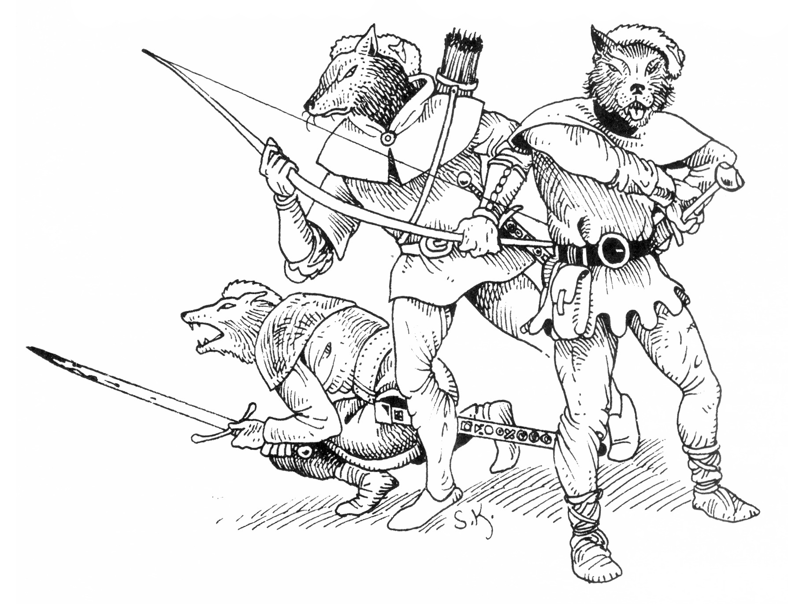

<title>Trakorierna - Svavelvinter</title>


# 04. Trakorierna

## Trakoriska trupper

Det finns ca 300 elitsoldater på Marjura. De är lejda yrkesmän som frivilligt sökt tjänsten och betalas med tredubbel sold + bonus beroende på handelsvinstens storlek.

De flesta soldater hatar Marjura med dess innevånare och undviker onödiga kontakter. På sin fritid jagar de i grupper eller håller sig på garnisonens område. De är välutrustade och hårda i nyporna.

### Trakorisk soldat

```
STY 14    SMI 14    KAR 11
STO 14    INT 11    SB —
FYS 16    PSY 13    KP 13
```

**Förmågor & färdigheter:** Mutfaktor 1T4+6, Kroksabel 13, Medelstor sköld 13, Långbåge 13, Finna dolda ting 10, Upptäcka fara 11, Slagsmål 13

### Trakoriskt underbefäl

```
STY 16    SMI 14    KAR 13
STO 14    INT 14    SB —
FYS 16    PSY 13    KP 15
```

**Förmågor & färdigheter:** Mutfaktor 1T4+9, Kroksabel 18, Medelstor sköld 18, Långbåge 18, Stadskännedom 15, Upptäcka fara 18, Finna dolda ting 17, Taktik 1T4+10

### Trakorisk officer

```
STY 14    SMI 12    KAR 13
STO 12    INT 15    SB —
FYS 13    PSY 14    KP 13
```

**Förmågor & färdigheter:** Mutfaktor 1T4+13, Kroksabel 17, Medelstor sköld 17, Långbåge 17, Finna dolda ting 18, Upptäcka fara 18, Taktik 20, Övertala/Förhöra 18, Kamouflage 15

### Stadspatrull

2-6 soldater + 30% chans att ett underbefäl leder dem.

### Vildmarkspatrull

10-14 soldater + ett underbefäl + 30% chans att en officer leder dem.

## Snapphanarna

Trakorierna har i sin tjänst en speciellt duglig jägartrupp bestående av tio vargmän. Flocken kallas Snapphanarna och används för speciella vildmarksuppdrag. Vargmännen är nästan alltid tillsammans och är helt lojala inom flocken. De är mycket samtränade, men har ingen speciell ledare.

**UTSEENDE:** Stora och välvuxna vargmän i kamouflagefärgade kläder (vintertid vita). De bär grå kaninpälsbaskrar med ett broderat, rött varghuvud



### Snapphane

```
STY 20    SMI 18    KAR 9
STO 16    INT 12    KP  15
FYS 14    PSY 12    SB  lT4
```

**Skydd:** Skinn 1 poäng, läderrustning 2 poäng
**Förmågor & färdigheter:** Långbåge 16, Dolk 16, Lätt tvåhandssvärd (som No-dachi) 16, Dra vapen 8, Första hjälpen 12, Taktik 14, Tala människospråk 1, Tala vargmannaspråk  4, Eget teckenspråk 3, Smyga 15, Lyssna 15, Finna dolda ting 10, Upptäcka fara 17, Jaga 14, Kamouflage 18, Skidor 15, Orientering 14, Spåra 19, Överlevnad 16.

## Gottard av Melse

**ALLMÄNT:** Herr Gottard är en trakorisk adelsman som råkat i ekonomisk knipa, och därför tvingats acceptera ämbetet som fogde under en tid. Hans uppgift är att upprätthålla lugnet på Marjura och att skydda handeln. Han får en fast andel av vinsten och söker maximera svavelleveransen för att förkorta sin exil. Herr Gottard upprätthåller lagen med ursinne, även om han ser mellan fingrarna om hans pojkar vill roa sig ibland. Han ingriper kraftfullt, nästan besinningslöst mot allt som hotar svavelhandeln. Trakoriska adelsmän som kommer till Marjura får en inbjudan att gästa herr Gottard så länge de är i staden, och behöver då inte betala annat än lämpliga gengåvor för sitt uppehälle.

**UTSEENDE:** Kort, kraftig man i sextioårsåldern. Rödbrusigt ansikte, med dåliga tänder och grått, okammat hår. Klädd i förnäma, men slitna och illa vårdade trakoriska kläder.

**KARAKTÄR:** Herr Gottard är trött och pessimistisk och lämnar sällan sitt residens. Han hatar Marjura och allt som har anknytning till ön. Ofta drabbas han av besinningslöst raseri över bagateller, men faller snabbt tillbaka i apatisk klagan igen. Bara det som kan förlänga hans vistelse på Marjura retar verkligen upp honom och kan då grumla hans omdöme till onödig grymhet.

**ÖVRIGT:** Vid behov av grundegenskaper och andra detaljer kan värden för officer (sidan E 73) användas med modifierade färdigheter.

## Selisia Gottardskona

**ALLMÄNT:** Selisia är fogdens högättade hustru. De två har fått ett nu tvåårigt sladdbarn som kvinnan skämmer bort så att det blivit tjockt som en boll. Vanligen sköts barnet av en amma.

**UTSEENDE:** 48 år. Parant, medelålders dam med silvergrått här. Hon klär gärna upp sig i siden och smycken på ett överdrivet och vulgärt sätt som betonas av för trånga dräkter från yngre dagar.

**KARAKTÄR:** Selisia Gottardskona missar aldrig ett tillfälle att förebrå sin make för att hon, med sin sociala position och sitt umgängesbehov, tvingats följa en oduglig sämre hälft (som inte alls är lika fin) till världens ände. I brist på andra sysslor lägger hon sig i allting och går omgivningen på nerverna.

Hon blir mycket förtjust över adliga gäster och anförtror sig lätt till dessa, framför allt om de är belevade yngre ädlingar med charmerande sätt.


