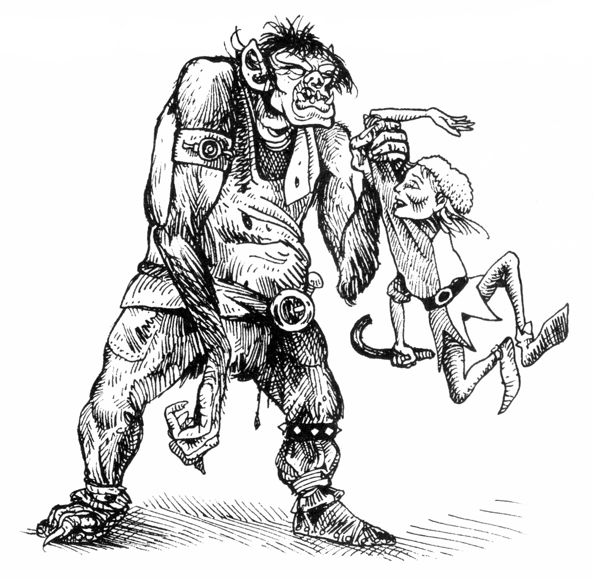
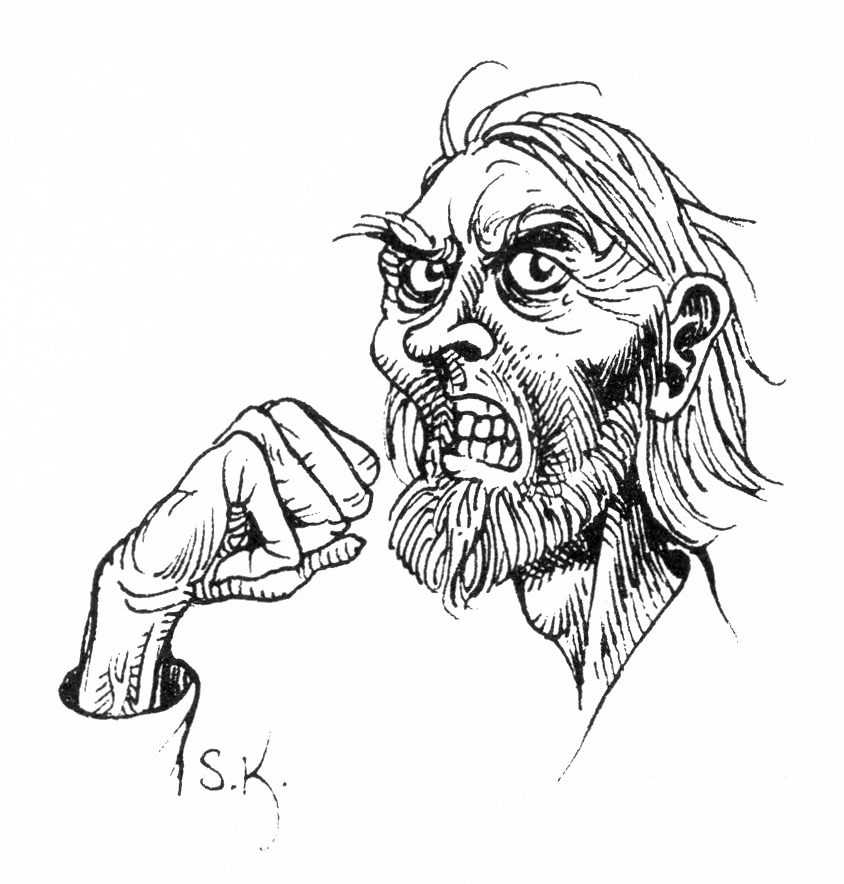
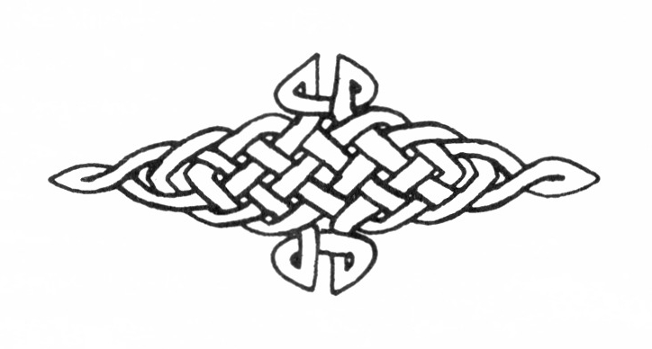

<title>Svavelträsken - Svavelvinter</title>

# 05. Svavelträsken

**ALLMÄNT:** På två holmar ute i svavelträsken ligger slavlägret och raffinaderiet. Miljön präglas av en fruktansvärd stank som biter sig fast i alla som stannar för länge. Efter något år blir huden dessutom gulaktig av ångorna.

Totalt finns på holmarna ett fyrtiotal slavar, tjugo fasta slavdrivare och tio soldater som byts ut varje månad. Slavdrivarna är illa sedda av alla, men har istället fått en viss sammanhållning och yrkesstolthet inom gruppen. Ofta råkar de i gräl med soldaterna som föraktar dem.

## Rutiner i slavlägret

Slavarna väcks tidigt på morgonen, utfodras med gröt och får en halv kopp zombin. Varje träskpråm bemannas med ett par slavdrivare och 5—10 slavar innan båtarna stakas ut åt olika håll. Råsvavel samlas genom att slavarna vadar omkring eller från båten slevar upp skummet som samlats i vassruggarna. Man pressar ur vattnet med pressdukar och sparar den grågula substansen. På kvällen stakar man hemåt, ger slavarna mat och läser in dem.

I raffinaderiets tankar kokas sörjan och det renade svavlet tappas ut medan slaggen dumpas i vattnet. En tjock pelare gulstickande rök stiger på dagarna från processen.

## Träsken

### 1. Väg mot Arhem

**ALLMÄNT:** Över träsken har en våg anlagts på en bädd av grus. Här drar oxar och slavar leveranser till eller från lägret.

### 2. Portal

**ALLMÄNT:** En kraftig kringbyggd träport stänger förbindelsen mellan Storholmen och landvägen. Porten är låst med kedja och hänglås (150 KP, SG 40). Nycklar till låset finns hos officeren och underofficerarna.

### 3. Träbro

**ALLMÄNT:** Bron går mellan Storholmen och Slavholmen. Den vilar på rullar och kan snabbt dras upp på Storholmen, vilket sker nattetid.

### Slavdrivarnas hus

**ALLMÄNT:** Till slavdrivare har man rekryterat lösdrivande, hårda busar som gillar att hunsa folk. Om rollpersonerna vill, kan de lätt få arbete.

För att få värden på en enstaka slavdrivare används tabellen på sidan E73. Hälften av slavdrivarna motsvarar "busar", hälften "utkastare".

**ÖVERBLICK:** Huset är en stor lada, till synes slumpmässigt hopfogad av sten, lertegel och trä.

Går man in genom dubbelportarna kommer man in i en stor, kal lokal med trampat jordgolv och några runda eller fyrkantiga bord ställda som det faller sig. Det luktar rök, svett och urin.

Lite avgnagda ben ligger i hörnen, en trasig stövel och en spotthink fylld med läbbiga lobbor. På bortre vägen är ett par människosiluetter i helfigur målade. Över närmaste ingången till sovsalen hänger ett ensamt, illa preparerat hjorthuvud.

Till höger i rummet leder två korta trappor upp till sovsalen, och till vänster stiger en likadan trappa mot köket.

**DETALJER:** Siluetterna tycks av märkena att döma vara måltavlor för kast med kniv, yxa och pil.

**VARELSER:** Kvällstid: 10-18 slavdrivare. Dagtid: 1-4 slavdrivare.

### Abrelax — 25 år, slavdrivarnas förman

**ALLMÄNT:** Störst och starkast bland slavdrivarna år Abrelax, som är av svartfolkstam, ett orchtroll (beskrivs i Sinkadus 3 sidan 12). Om SL inte har tillgång till denna Sinkadus kan man låta honom vara rese istället.

**UTSEENDE:** Abrelax är stor, en bra bit över två meter lång, och kraftigt men oproportionerligt byggd. Armarna hänger långa som på en orangutang och täcks av tät borst. Huden är lätt grönaktig och sträv som sandpapper. Det täta huvudhåret hänger svart och stripigt, men skäggväxt saknas.

Ansiktet tycks vara hopfogat av överblivna rester från flera olika skapelseprocesser. Tänderna står vildvridna som knotiga stubbar i den för stora underkäken.

Abrelax klär sig i grova, smutsiga yllekläder, men runt halsen bär han en röd scarf som han påstår sig ha fått av en dam.

**DETALJER:** I de stora fickorna har Abrelax lite överbliven mat, tuggtobak, två knogjärn, 1-10 sm, 10-20 km och två tärningar, varav den ena slår 6 en gång av fyra. Vid bältet hänger en påk.

**KARAKTÄR:** Abrelax är brutal och pennalistisk mot kamraterna, men inställsam mot överordnade. Han kallar dem sina "polare" när de är med, men pratar dynga om dem så fort de är utom hörhåll.

Han missar aldrig ett tillfälle till slagsmål och provocerar gärna nykomlingar. Får han stryk, blir han inställsam, men ruvar på hämnd. Hildur Ornetand har klått upp Abrelax ett par gånger med spiskroken på "Junker Hildurs" och är den ende orchtrollet är riktigt rädd för. Gycklaren Moska trakasserar han gärna eftersom han inte tål musik.

### 5. Soldaternas förläggning

**ALLMÄNT:** Normalt finns tio soldater förlagda i slavlägret, varav en officer och två underofficerare. Soldaternas uppgift är att bevaka slavdrivarna och att vakta anläggningen mot rebeller.

Alla soldater avskyr att tjänstgöra i slavlägret eftersom det är tråkigt och otrevligt. De jämställer i stort sett slavar och slavdrivare.

Postering dagtid: På portalen, utanför Sulidon Rumperlaks hus, i fyrtornet och två på slavbarackerna.

Posteringar nattetid: Som på dagen, men vakten i fyrtornet patrullerar istället på Storholmen.

Officeren och underofficerarna har varsin nyckelknippa med nycklar till portalen, slavbarackerna och träskpråmarna. Officeren har dessutom en nyckel till Sulidon Rumperlaks hus och källare.

### 6. Fyrtorn

**ALLMÄNT:** Tornet är femton meter högt och används som utkik. Vid larm till garnisonen i Arhem tänder man eld i tornet.

### 7. Bränsleförråd

**ALLMÄNT:** Under ett tak ligger kvistar och vitträ som ska användas till att elda under svaveltankarna med.

### 8. Raffinaderi

**ALLMÄNT:** Två stora bronscylindrar står upphöjda över marken. Man eldar under dem på dagarna så att stickande gul rök väller upp mot himlen. Genom stora tappkranar kan det flytande svavlet tappas i tunnor. Slaggen måste skaffas undan genom luckor i taket.

### 9. Två vagnar

### 10. Tunnor

**ALLMÄNT:** Cirka tvåhundra tunnor ligger staplade på varandra. Slå 2T100 för att se hur många som är fyllda med svavel.

### 11. Båthus

**ALLMÄNT:** Under taket ligger fem stora, flatbottnade träskpråmar med tre kraftiga störar i var och en. På nätterna kedjas båtarna fast i väggen med hänglås (30 KP, SG 15). Nycklar finns hos officeren och underofficerarna.

Träskpråmarna kan bara stakas fram i sakta mak, ca 1 km/h per man som stakar, med en högsta fart av 4 km/h.

### 12. Skjul

**ALLMÄNT:** Här förvaras slavarnas utrustning: korgar, stövlar, slevar, pressdukar mm. Halva skjulet är fyllt med vitträflis till strö.

### 13, 14, 15. Slavbaracker

**ALLMÄNT:** Solitt murade stenhus med tjocka trädörrar (150 KP) som låses med kedja och hänglås på natten (låsen tål 90 KP och har SG 25). Nycklar finns hos officer och underofficerare.

I de mindre husen kan farliga eller sjuka personer isoleras. Husen har inga fönster och ingen inredning. Man strör med spån och har en hink till dyngplats.

### 16. Sulidon Rumperlaks hus / Droglagret

#### A. Bostadsrum

**ÖVERBLICK:** Dörren till huset är låst när Rumperlak är ute. Innanför dörren finns ett trångt, varmt och starkt kryddoftande rum, till vänster avgränsat av ett draperi. Rakt fram ser man en öppen spis med flera olikstora kittlar och intill denna en obäddad sovlåda. Skrivbordet till höger innanför dörren täcks av en stor uppslagen bok, skrivdon, lösa pergament, ett halvfullt vinkrus, en kulram och ett litet schatull på vilket han ställt en statyett föreställande en naken kvinna med ormar i händerna. Skrivbordet flankeras av bokhyllor med många volymer. Över väggarna hänger utländska brokiga batiktyger. Här och där, speciellt runt spisen, hänger knippen av växter på tork. Golvet täcks av en stor, smutsig trasmatta.

**DETALJER:** Sovlådan innehåller kläder, ett brädspel, ett vinkrus, 560 gm, 1400 sm, och 318 km utspridda på bottnen. Den uppslagna boken är en arbetsjournal som berättar att Rumperlak idag skurit en böld, dragit två tänder etc. I schatullet ligger ett hoprullat och förseglat pergament. Det är ett brev till Malek Mangus vilket förklarar att Rumperlak sänder en tunna zombin för testning så snart det blir vaktavlösning i lägret. Texten berättar att Rumperlak sökt dämpa zombinets beska smak genom extraktion med svingalla. Böckerna i hyllorna handlar om botanik, drogblandning och läkekonst.

FV Botanik — växterna på väggarna är korsört, svartblister, skägglav, fjällsippa och hjortronblad.

**SL:** En månads studium av Sulidon Rumperlaks bibliotek ger +8 EP Botanik, +10 EP Drogkunskap och +1 på FV i Läkekonst och Första hjälpen.

Brevet till Malek Mangus skulle starkt kompromettera shaguliterna och drogmakaren om det kom till fogdens kännedom. Rumperlak skulle omedelbart kastas i fängelse och shaguliterna mista sin gynnade ställning eftersom handel med zombin är strängt förbjuden.

Dörren till huset tål 90 KP och har SG 32. Bara drogmakaren och officeren har nyckel.

#### B. Laboratorium

**ÖVERBLICK:** Bakom de fläckade draperierna finns arbetsbänkar och hyllor med burkar och bråte. En större låda står inskjuten under bänken. Längst till höger löper trappor ner i källarplanet.

**DETALJER:** På arbetsbänkarna finns mortlar, slevar, en våg, en liten destilleringsapparat, en burk levande blodiglar i vatten, rester av växter, en blodig skalpell, en burk blybitar, ett svart lerkrus och några sjöormsfjäll. På hyllorna står flaskor med kemikalier.

FV Giftkunskap — Det svarta kruset innehåller en dos av giftet svartblod.

Lådan under bänken innehåller såg, borrar, tänger, knivar, läderremmar och andra kirurgiska instrument.

**SL:** Blybitarna har Rumperlak länge försökt förvandla till guld. Han visar dem alltid för besökare och undrar om de märker något speciellt.

#### C. Källaren — Droglagret

**ÖVERBLICK:** Dörren är låst och ganska rejäl. Innanför hittar man en sval, skarpluktande källarlokal. Längst in i rummet finns ett tjugotal rödmålade tjugofemliterskaggar. Ovanför tunnorna ligger en mängd igenkorkade lerkrus i sina ställ. Innanför dörren finns två kistor och en stor tunna.

**DETALJER:** De röda kaggarna innehåller en violett, simmig och mycket besk vätska. FV svår Drogkunskap — zombin (se nedan).

Då konvojen kommit är alla tunnorna fulla och töms sedan under halvåret som går.

Lerkrusen innehåller vin av olika kvalitéer. Tunnan innanför dörren är fylld med friskt vatten. Kistorna innehåller bär, växtknippen, flaskor, påsar med pulver etc.

FV Drogkunskap/Botanik — 14 lökar av Svanblomma, 150 g Liliansörtblad i gelé, 60 cl magsaft, 11 frukter från Gyllenbuske (ligger i sand) 56 Drakbär, 4 BEP Koffabär i säck (kokas till stärkande dryck), knippen av torkad Tallört, Korsört, Salvia, Guldregn, Lavendel, Björnmossa och Renlav. 3 doser Celli, en stor kruka Duragos (400 doser), en dos Erisinon, en tre doser Rekupera, en kruka maskmedel, en burk tjära, en kruka olivolja.

### Zombin

**Effekt:** Offrets PSY och INT minskar till 2. Personen tar inga egna initiativ, utan gör vad den blir tillsagd att göra så länge instruktionerna är enkla.
**Form:** Simmig violett vätska med intensivt besk smak. Ingen varelse dricker zombin frivilligt.
**Väntetid:** 1-4 timmar
**Verkningstid:** 30-40 timmar
**Väntetid:** Övergår direkt i efterverkningar.
**Efterverkningstid:** 1—2 dygn. Efter lång tids bruk kulminerar efterverkningarna efter en vecka, men fortsätter 1-4 månader.
**Efterverkningar:** Skakningar, illamående, aggressivitet, plötsliga känslokast, ryckningar, feberanfall under vilka SMI och PSY minskar till hälften.

### Sulidon Rumperlak — 51 år, drogmakare

**ALLMÄNT:** Rumperlak står garnisonen, slavlägret och i mån av tid Arhem till tjänst med läkekonst, medicin och andra droger. Oftast är han ute och flänger och är omöjlig att få tag på.

**UTSEENDE:** Liten till växten. Flottigt, mörkt hår kammat i mittbena. Ansiktet är tärt och blekt med slappa, köttiga kinder och påsar under rödkantade ögon. Svavelträsket har för alltid satt sin otrevliga lukt och gula färg i hans hud. Rumperlak har alltid samma rödbruna, slitna läkemanskåpa med tillhörande bred skråmössa.

**DETALJER:** En dolk och en metallsond sitter i gemensam skida i bältet. Innanför kåpan bär han börsen med ca 40 gm, 20 sm och 30 km, samt två påsar innehållande 26 krossade mantikoratänder. Runt halsen bär han ett band med 38 uppträdda kimeratänder.

**KARAKTÄR:** Den hårt arbetande Sulidon Rumperlak känner sig ofta ensam och melankolisk. Människor och klimat på Marjura passar honom inte. Han saknar hemlandets förfinade umgänge, sin trädgård och lugnet i skogen, vilket gör att han ständigt gnäller och klagar över hur besvärligt allt är. Grämelsen får folk att undvika honom, vilket ytterligare ökar ensamheten. Som tröst har han blivit drogmissbrukare och experimenterar med olika blandningar. Spel och alkemi roar honom mycket. Han är ganska snål och pengakär, vilket fått honom att falla för den farliga frestelsen att sälja zombin till shaguliterna. En förstående person kan lätt vinna hans förtroende.

### Komplikationer

* Om rollpersonerna tillsammans med rebellerna gör en räd mot slavlägret och förstör zombinlagret kommer snart ett uppror att utbryta och några slavar att rymma. Dessa kommer att smyga omkring i vildmarken i desperat behov av utrustning och mat, med den enda tanken att rymma från Marjura till varje pris. De kommer att vara påverkade av zombinets efterverkningar och därför extra oberäkneliga och farliga. Som förrymda brottslingar kan man använda tex anonyma busar eller tjuvar enligt schablontabellen eller en eller flera av Shulaban, Gistacki, Robur Rödvad, Guster Svartskäkta.

* Rebellerna vill gärna befria den marjuriska krigshjälten och adelsmannen Guzier da Ollach från svavelträsken och tar hjälp av rollpersonerna om dessa är villiga.

### Guzier da Ollach — 60 år, rådsherre och storbonde

**ALLMÄNT:** Guzier da Ollach är en marjurisk storbonde och rådsherre som aldrig givit upp kampen mot inkräktarna. Gång på gång har hans stolthet och orubbliga frihetsideal besvärat trakorierna tills han slutligen greps vid en sabotageräd mot ett trakoriskt handelsskepp. Nu avtjänar han sedan ett halvår sitt straff i svavelträsken. De flesta marjurer är upprörda över att fogden satt en gammal, förvirrad hjälte i slavarbete, och fritänkarna planerar att befria honom.

Herr Gottard tänker dock som en försonande gest benåda Guzier på trakoriska nationaldagen.

**UTSEENDE:** Guzier da Ollach är en lång, mager gamling med stripigt grått skägg och ädla drag. Slavarbetet har tärt hårt på hans krafter, men ögonen brinner i febrig eld.

**KARAKTÄR:** Guzier da Ollach lever i sin egen värld, där rättvisan alltid segrar och där Marjura ska befrias. Han talar gällt och upphetsat, manar ständigt till motstånd, men har inget begrepp om verkligheten. Påfrestningarna i slavlägret har ytterligare förmörkat hans virriga hjärna. Ofta tror han att kriget mot trakorierna fortfarande pågår.

**SL:** Guzier saknar alla användbara egenskaper. Om fritänkarna lyckas befria honom blir de snart besvikna och tycker i hemlighet att han gjorde mer nytta som fånge.

Hildur Ornetand kommer via rådet att få höra om fogdens planer på frigivning, och skäller för att rebellerna bara gjort saken värre.

