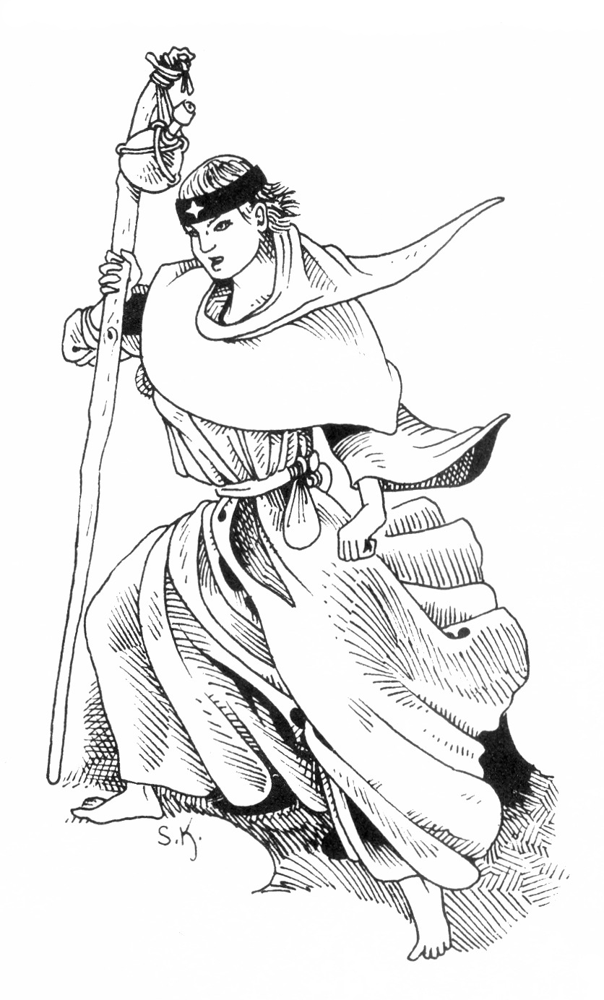
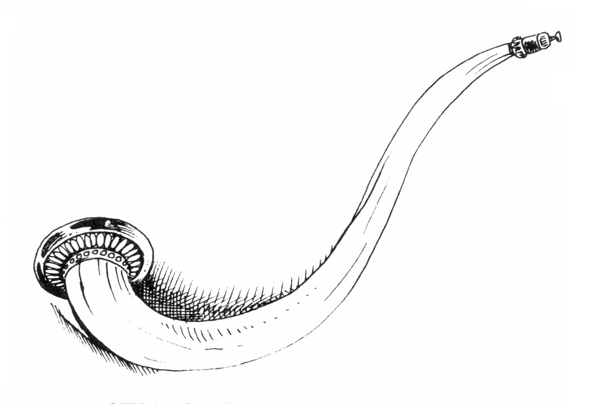
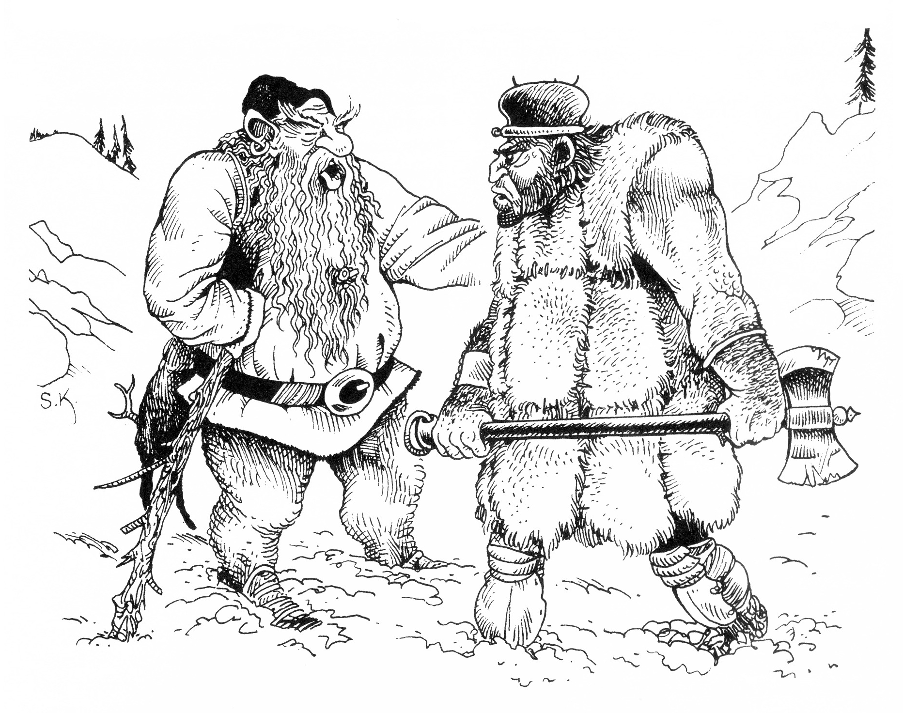
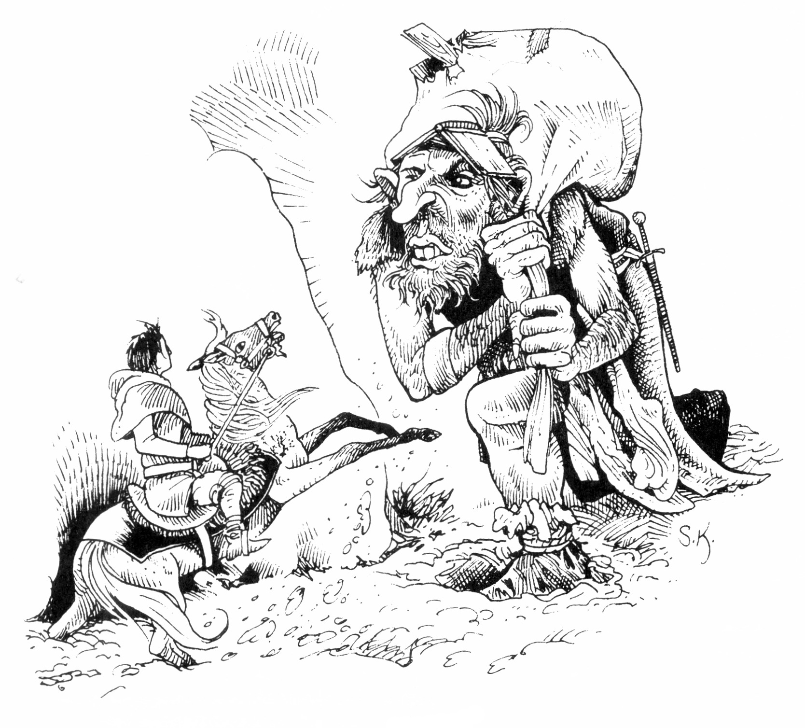

<title>Kmordadruidernas tempel - Svavelvinter</title>

# 06. Kmordadruidernas tempel

## Inledning

På Marjura finns en religiös grupp druider som anser att naturens väsen klarast framträder i den strängaste kyla, när all grönska och utsmyckning år frånvarande och de mest ursprungliga krafterna talar i form av norrsken och i kristalliseringen av livsvätskorna. Gruppen har anlagt ett tempel på berget Biletand vilket skjuter upp ur ismassivet som täcker Marjuras inre högland.

Druidernas centrala begrepp är "Kmorda", vilket betecknar jordens ursprungliga livskraft och används om såväl kölden i sig, som om glaciären och om den vilande framtiden. Genom att studera norrskenet och köldens yttringar söker druiderna uppnå enhet med världsalltets liv.

I Arhem har druiderna ett litet kapell vid marknadsplatsen, dit jägare och andra som har ärende upp på glaciären brukar gå för att offra och utröna Kmordas vilja om lämplig tidpunkt för viktiga beslut, mm. Druiderna är ett fredligt sällskap som bemöter alla intelligenta varelser lika och därför respekteras av såväl kvurer som dvärgar och isjättar. De utmärks av sin lätta klädsel som visar deras totala okänslighet för all köld. Faktiskt kan de gå helt nakna i den mest fruktansvärda polarstorm utan att ens få gåshud.

Den senaste tiden har den kvinnliga druiden Perrima skött kapellet, men de som ofta besöker henne kan märka att hon de sista dagarna blivit allt mer frånvarande och fått ett bekymrat ansiktsuttryck. Rollpersonerna kan komma i kontakt med Perrima på två sätt:

* Om de tänker ge sig upp på glaciären och frågar efter råd eller guide kommer man att hänvisa dem till druiderna. Perrima överraskar med att erbjuda sig själv som guide, om äventyrarna i gengäld vill följa henne till templet. Hon är orolig eftersom hon inte har hört av sina kamrater som de avtalat. Då hon sökte besked från Kmorda sprack den heliga siarskålen under isbildningsritualen.

* Perrima söker direkt upp rollpersonerna och säger att hon behöver hjälp men inte vågar lita på någon i Arhem. Hon erbjuder äventyrarna guld och framtida vänskap om de vill eskortera henne till templet eftersom hon tror att något fruktansvärt har hänt. Får hon förtroende för sällskapet eller om de tvekar, berättar hon försiktigt att druiderna hotats av shagulitersekten som inte tål deras närvaro på Marjura. Hon är rädd att sekten nu slagit till mot templet. Senare, då man redan är på väg, kan Perrima berätta om en helig relik som måste föras i säkerhet eler andra detaljer, enligt SLs gottfinnande.

### Perrima — 22 år, isdruid

**UTSEENDE:** Perrima är påfallande vacker, nästan en overklig uppenbarelse där hon går omkring barfota, klädd i lätta, röda sidenplagg sommar som vinter. Hennes blekhyade, slanka gestalt kontrasterar starkt mot Marjuras övriga påbyltade innevånare. Håret är rött och kortklippt, men runt pannan bär hon ett svart pannband med en silversmidd snöstjärna. Hennes ansikte är blekt med stora blågrå ögon.

**KARAKTÄR:** Kmordadruidernas ideal är att vara toleranta och vänliga mot alla. Perrima försöker oftast leva upp till dem, men hennes häftiga temperament och starka självkänsla bär ibland iväg med henne. Speciellt otålig är hon mot veliga och överdrivet försiktiga personer.

**SL:** Perrima har ett antal magiska egenskaper. Dessa fungerar på effektgrad 3 och drar PSY som vanligt, men misslyckas aldrig eftersom krafterna kommer från gudarna. Skolvärdet motsvaras av 19. Hennes magi påverkas inte av järn. Gentemot yngre män ökas Perrimas kommunikationsfärdigheter med 5 om offret inte lyckas med ett PSY—slag.

## Kmordahelgedomen

**ALLMÄNT:** Druidernas tempel ligger på nordsidan av berget Biletand. För att komma dit från Arhem måste man vandra ca fyra mil på glaciären, vilket i bra väder brukar ta två dagar.

### 1. Stenmur

**ALLMÄNT:** Den går runt tempelområdet och är ca 1 m hög.

### 2. Staty

**ALLMÄNT:** En klippstod föreställande en människa som håller handen till fredshälsning. Statyns huvud är avslaget och ligger nedåt berget. Kroppen är ristad med onda symboler och nedsmetat med avföring.

### 3. Bastu

**ALLMÄNT:** I denna lilla tillbyggnad på templets utsida mynnar en het källa som fyller utrymmet med ånga. Temperaturen ligger på ca 7000 med hög luftfuktighet. Tillbyggnaden är av sten och det finns två lavar av flätade rötter att sitta på. SL: Redan på avstånd kan men se "rök" stiga från bastun.

### 4. Tempelbyggnaden

**ALLMÄNT:** Templet är enkelt, men stadigt murat i naturlig sten. På framsidan leder en kort trappa upp mot en trädörr flankerad av två fönsterluckor, varav den vänstra är stängd och den högra trasig så att den slår i vinden.

**DETALJER:** FV Dolda ting/upptäcka fara — Ett blekt ansikte skymtar innanför det trasiga fönstret. Om någon visar sig öppet utanför templet försvinner ansiktet. 20% chans att någon av husets innevånare är ute på gården. Dörrhandtaget är nerkladdat med ett brunaktigt ammoniakluktande slem.

#### a. Hall

**ÖVERBLICK:** Innanför ytterdörren år det lika kallt som ute. En meterbred korridor leder fram till en T—korsning. På högra väggen finns en låg dörr. Rakt fram i korsningen är en normal dörr. Den korsande korridorens ändar slutar i var sin dörr.

#### b. Domonas kapell

**ÖVERBLICK:** Ett vackert rum byggt direkt mot klippan bakom. Golvet är belagt med vita stenplattor och väggarna är vitmålade bakom flortunna, regnbågsskiftande tygslöjor som böljar likt norrsken. Från klippväggen strömmar klart vatten fram och samlas i en bassäng uthuggen i golvet. Vattnet tycks försvinna i samma takt det fylls på via ett hål i bottnen. Innanför dörren står två stenbänkar vända mot källan. Vid högra väggen finns ett vackert snidat träskåp.

**DETALJER:** I skåpet hänger tolv halvliters läderflaskor på krokar. Där finns också en vackert snidad ispik och en bok med noteringar om vattenleveranser.

FV Upptäcka fara/magi VARSEBLIVNING — Vattnet är boning för någon övernaturlig varelse. VARELSER: Om någon varelse med onda avsikter rör vid källans vatten framkallas en undin E5. Den lämnar inte kapellet.

**SL:** Härifrån rinner vattnet ner i gravkammaren 6 d. Via LJUSVÄG eller annan magi kan man följa vattnets väg.

##### Källan

Den heliga källans vatten har följande egenskaper:

* Vattnet fryser aldrig.

* Vattnet släcker törsten dubbelt så länge som normalt och ger en känsla av värme och välbehag.

* Doppar man sig i källan känns vattnet mycket kallt, men ändå inte obehagligt. Kroppen fylls tvärtom med kraft genom att alla skador läks och all sinnesförvillelse botas. Däremot kan vattnet inte återskapa förlorade kroppsdelar.

* Dricker man vattnet verkar det som motgift till alla gifter.

* Vattnet ger 1T6 KPs skada på odöda och demoner per halvliter som sköljs över dem.

Tar man med sig vatten i flaskor behåller det samtliga egenskaper utom den skadeläkande förmågan.

#### c. Matsal och sällskapsrum

**ÖVERBLICK:** Ett kvadratiskt rum som domineras av ett stort träbord på vilket en sargad och röd— bemålad kropp ligger utsträckt. Rummet är kallt och fyllt av en kväljande tjock svaveldimma som får ögonen att rinna. Röken kommer från ett fyrfat invid likets huvud. På högra väggen finns en dörr och bortom denna en öppen spis utan eld. Några omkullvälta stolar och resterna av en måltid ligger slängda på golvet.

**VARELSER:** En shagulit och en horndemon — bestäm slumpmässigt vilka. Zombie 1.

**SL:** Shaguliten har förgäves försökt få liket av översteprästen att berätta var tempelskatten ligger gömd. Man räknar inte med att någon ska komma till templet och blir därför överraskad såvida inte zombien i rum d har varnat. Om inkräktarna tycks vara många eller starka försöker shaguliten och horndemonen fly och lämnar zombie 1-2 att täcka reträtten.

#### d. Kök

**ÖVERBLICK:** Rummet är kallt och delvis översnöat, eftersom ena fönsterluckan är nedriven. På väggarna hänger hyllor med diverse köksutrustning, i taket stänger med hårdbrödkakor. En torkad utkavlad deg ligger på en arbetsbänk tillsammans med bakformar och en kavel. I ena hörnet finns en bakugn.

**DETALJER:** Under snön vid ugnen ligger den döde kocken. Han tycks vara dödad av ett knivhugg i nacken. I bakugnen finns förkolnade bröd.

**VARELSER:** Zombie 2, med instruktioner att hålla utkik genom fönstret och varna varelserna i rum c om någon kommer inom synhåll.

**SL:** Perrima känner igen zombie 2 som en tjänare.

#### e. Skafferi

**ÖVERBLICK:** Tre välta tunnor. Några krossade krukor på golvet.

**DETALJER:** Tunnorna innehåller frusen öl. l krukorna finns sylt.

**SL:** Skafferiet är plundrat och maten bortförd.

#### f. Sovsal

**ÖVERBLICK:** Rummet är lika kallt som utomhus. Mitt i lokalen finns en eldstad med utbrända kol över vilka rökluckan står öppen. Man ser fyra sovlådor med halmmadrasser och yllefiltar. Fönsterluckorna är stängda så rummet ligger i halvdunkel Det luktar unket och skämt.

**DETALJER:** Den första bädden är omkullvält och innehåller tomma papper, skrivdon, en trasig kudde och ett kortsvärd i skida.

I den andra bädden ligger en ung död kvinna, badande i blod. Perrima känner igen henne som sin syster Girinda. FV Läkekonst — Kvinnans hals är avskuren. Sovlådan under är tom.

Den tredje bädden innehåller ett vackert schackspel med pjäser av ebenholts och elfenben, några filtar, ett par kängor och en vandringsstav. FV Värdera konst — Schackspelet är värt 93 gm.

I den fjärde bädden ligger en trasig läderryggsäck, en vacker bönematta, en ihopvikt överrock. Ett vackert skrin med pulver och vätskor i behållare av glas. Tre flaskor är sönderfrusna. FV Värdera mattor — Bönemattan är värd 450 sm. FV Kulturkännedom — Pulvren och våtskorna används till spådom.

**VARELSER:** Om någon person rör vid liket framträder Girindas spöke. Det angriper omedelbart shaguliteranhängare, men ber respektfulla besökare om hjälp:

> "Hör min syster! Novisen Melobin sålde oss till de gröna männen från norr. I nattens mörker vandrade hans kniv som ormens tand över sovande huden.
> 
> Hämndens tid ska komma, men först ska du föra den heliges huvud till säkert hägn. Följ Domonas ström från kryptan till drakens mun där tvenne solkors skall vridas. Om detta jag ber, men Kmordas vilja må råda!"

Spöket ger inga vidare råd utan bleknar bort då det lämnat sitt budskap (spelarna bör få skriva ner meddelandet om de inte kan minnas).

**SL:** Spökets bud anvisar hur man ska ta sig till tempelskatten och de heliga relikerna utan att utlösa fällorna. Perrima vet att det ska finnas en krypta under templet, men inte var.

Då Perrima får höra sin systers ord grips hon av heligt raseri mot shaguliterna - se kommentar vid avsnittet om klonodlingarna i Järntornet.

#### g. Ceremonirum

**ÖVERBLICK:** En ganska varm och torr lokal med behaglig lukt av rökelse. Golvet täcks av mattor och två träbänkar finns att sitta på. En grov klängväxt av koppar klättrar från golv till tak på den bortre väggen. De andra väggarna pryds med målningar av alplandskap. På golvet ligger mammuthornet.

**DETALJER:** Kopparväxten utstrålar värme och väser svagt.

FV Finna dolda ting — en nyckelknippa ligger kastad i ett hörn.

**VARELSER:** Skelett 1 och 2 med instruktion att anfalla allt utom shaguliter, horndemoner och odöda sitter på bänkarna.

**SL:** Kopparväxten är ihålig och fungerar som ett element genom att vatten från en hetvattenkälla leds genom den.

Rummet brukar användas för rituell dans.

##### Mammuthornet

**UTSEENDE:** En tre meter lång, urholkad mammutbete med ett munstycke av brons i spetsen, och en vid bronstratt i bredänden.

**DETALJER:** Hornet väger 20 BEP.

**SL:** För att kunna få ljud i hornet måste man vara van vid något blåsinstrument (Spela 1 eller bättre). Blåser man, hörs en mycket djup, tilltagande ton som får omgivningen att skaka. Ljudvågorna kommer att bilda en växande tryckvåg bort från hornets mynning.

Varje SR tonen obruten får ljuda ökar tonens styrka med det dubbla. Efter en SR motsvarar tonen STY 1, efter 2 SR STY 2, 3 SR STY 4 osv.

Man orkar blåsa FYS/2 SR men måste sedan vila lika många minuter. Det är inte möjligt att både rikta hornet själv och blåsa.

Tryckvågen förmår inte skada levande varelser eller föremål som är elastiska eller kan släppa igenom vågorna. Murar, dörrar, stenblock och andra massiva ting kan däremot flyttas eller sprängas om styrkan blir tillräcklig. Använd motståndstabellen.

Observera att ett hus mycket väl kan rasa samman över en om man blåser inomhus.

### 5. Bildernas torn

**ALLMÄNT:** På en klippa framför templet står ett litet runt stentorn där prästerna höll utkik över väder och omvärld.

**ÖVERBLICK:** En trappa huggen i berget leder upp till en uppbruten träport vid tornets fot. Innanför leder en spiraltrappa upp till utkiksrummet som är kvadratiskt och utan inredning. Ett huvudlöst manslik ligger på golvet.

Åt varje väderstreck finns dubbla fönsterluckor. Under varje fönster är respektive utsikt avbildad.

Norra fönstret — Utsikt mot Dymramassivet.

Östra fönstret — Utsikt mot berget Baletind som anas i fjärran.

Södra fönstret — Utsikt över tempelbyggnaden och gårdsplanen.

Västra fönstret — Utsikt mot svaveldalen och Cruri.

**DETALJER:** På vägen hänger en tubkikare i ett etui. En lins är sprucken. I bilderna under utsiktsfönstren kan intressanta detaljer urskiljas om någon tittar noggrant.

Norra fönstret — Järntornet, shaguliternas tempel är utritat. I bilden pekar en hand på ett bergspass som liknar två horn sydöst om Järntornet.

Östra fönstret — På Baletind är jätten Stor-Thules gård utritad. Närmare i bilden blåser en människa i mammuthornet. Några krumelurer syns bredvid hornblåsaren. FV Musik/Språkkunskap — Krumelurerna är notskrift som anger en melodi.

Södra fönstret — På tempelgården syns en lucka öppna sig ner i underjorden. Invid luckan står skrivet: "Följ det heliga vattnet till drakens mun. Två solkors vridna banar vägen."

Västra fönstret — I Cruri är en ensam obelisk ritad.

**SL:** Kikaren kan repareras av dvärgmästare i Bethra zur, men inte av någon människa på Marjura.

Blåser man den angivna melodin på mammuthornet mot Baletind kommer Stor-Thule inom 1T4 timmar. Han har ingått blodbrödraskap med överdruiden i Kmordatemplet och kommer att söka hämnd, ensam eller med rollpersonerna. Obelisken i Cruri markerar kung Ottars grav.

Liket tillhör en av templets präster. Huvudet har hans baneman tagit med sig.

### 6. Luckan till kryptan

## Kryptan och skattgömman

**ALLMÄNT:** Begravningsritualerna är för druiderna något mycket heligt och tabubelagt, varför bara de mest upphöjda fick känna till kryptans läge.

### a. Luckan

**ALLMÄNT:** Gräver man på rätt ställe hackar man sig på en timme ner till luckan under isen på gårdsplanen. Den är täckt med torv över grovt kläde och består av järnbeslagen fur med två ringar att lyfta i.

Vet man inte var man ska gräva får man slå ett kritiskt FV Finna dolda ting per sex timmars letande på gården.

### b. Trappa

**ÖVERBLICK:** En brant, 75 cm bred trätrappa med dammiga steg. Luften är fuktig och unken. Utrymmet är hugget direkt ner i klippan. Trappan slutar i en olåst trädörr.

**DETALJER:** Berget tycks vibrera lätt. FV Lyssna — Svaga gurglande och väsande ljud hörs inne i klippan.

### c. Gravkammare

**ÖVERBLICK:** En bred korridor med omsorgsfullt vitmålade väggar och tak. Luften är varm och torr och luktar skarpt av parfym. På båda väggarna hänger uppkrokade, mumifierade människokroppar. Varje mumie är förtorkad och har vitmålad hud, är klädd i en enkel särk. Alla kroppsöppningar är igensydda med snören.

Det finns totalt sju mumier, men också fem tomma krokar.

I korridorens bortre del står ett massivt stenbord med tre lerkrukor. På golvet nedanför står ett fyrfat och en läderspann.

**DETALJER:** Två krukor innehåller parfymerade krämer, men den tredje ett vitt pulver. Läderspannen är tom. FV Drogkunskap — balsameringskrämer och ett magnesiumsalt man kan elda med för att få ljus.

**SL:** Perrima är illa berörd över att behöva störa de heliga rummen och tål inga respektlösheter härnere. Magnesiumpulvret brinner långsamt med klar vit låga och utan att avge rök om man tänder det.

### d. Domonas källa

**ÖVERBLICK:** Dörren från gravkammaren är låst. Om den öppnas blir en smal trappa synlig, vid vars ände blåskimrande ljus och porlande vatten kan anas.

Man kommer ner i ytterligare en vitmålad gång, med många små blåskimrande stenar satta i väggarna. Närmast trappan porlar klart vatten ut ur vägen, samlas i en ränna längs vänstra väggen och försvinner längst bort i rummet genom ett runt stengaller i golvet. De blå stenarnas egensken och vattnets reflexer ger rummet ett mycket vackert och rofyllt ljus.

**DETALJER:** Tio små guldberlocker ligger nere i vattnet. FV Värdera smycken — 40 sm styck. FV Värdera mineral — Blåstenarna slutar lysa om man tar dem.

**SL:** Stengallret går att lyfta med en sammanlagd styrka på 25. Under finns ett lodrätt schakt med klättersteg i vägarna. Det är ca 75 cm brett. Hit rinner Domonas ström från kapellet uppe i templet.

### e. Schakt

**ÖVERBLICK:** Brunnen fortsätter ett tiotal meter rakt ner. Det är ganska lätt att klättra även om stegen är hala. Vatten strilar hela tiden ner över klättraren från schaktets mynning. Det känns svalt men inte alls obehagligt. Efter tio meter finns en 75x75 cm stor kvadratisk öppning i schaktets norra vägg.

**DETALJER:** Då man kikar in i öppningen ser man ett jättelikt drakhuvud stirra på en från några meters håll.

**SL:** Om klättraren är skadad eller lider av någon sinnesstörning känner han befriande kraft strömma in i honom igen (se beskrivningen av Domonakällans egenskaper).

En klättrare med 5 eller högre i färdigheten klättra kan inte falla i schaktet. Andra måste slå under Klättra X 4 med 1T20 för att inte falla ner. Chansen dubbleras om man har rustning eller är tungt lastad. Den förste som tittar in i sidogången måste lyckas med ett normalt INT—slag för att inte tappa fotfästet i förskräckelsen.

### f. Underjordisk damm

I denna grotta samlas Domonas vatten innan det flödar bort genom berget. Tidigare var ett nät spänt vid schaktets nedre mynning, men det har ruttnat sönder.

Vattendjupet är ca 2,5 meter. Man måste ha hjälp för att kunna klättra upp igen om man har fallit i. Personer med STO 7 eller mindre kan hala sig upp i resterna av nätet.

### g. Drakens rum

**ALLMÄNT:** Grottorna under Kmordatemplet, inklusive drakhuvudet och fällan, konstruerades en gång av en dvärgmästare. Man har byggt in en naturlig hetvattenkälla i ett kanalsystem dolt i vägarna. Det märks som vibrationer och gurglande ljud i väggarna. De två solkorsen öppnar och stänger kanaler. På så sätt styrs det vattentryck som får draken att gapa, fällan att utlösas, etc. Fällan kan med rätta tyckas vara mycket tekniskt avancerad. Den är ett mästerverk av regionens dvärgar.

**ÖVERBLICK:** Rummet är dimfuktigt, lätt svaveldoftande och det är ca +15°C. Väggarna är klädda med kala gråstensplattor, men golvet täcks av ett tjockt lager svart, vulkanisk sand.

Ett jättelikt drakhuvud, utmejslat i sten, skjuter fram ur den bortre väggen. Drakens käftar är stängda. En skeletthand hänger ut mellan tänderna där slingor av ånga sipprar fram.

**DETALJER:** FV 3-5 i Hantverk: ingenjörskonst (eller andra tekniska kunskaper) — drakens käftar är rörliga i förhållande till varandra.

FV Dolda ting (svår) — Under sanden mitt framför draken finns ett horisontellt bronshjul med fyra ekrar, vars axel försvinner ner i klippan.

FV Upptäcka fara — Skakningar och väsanden i berget är starkare än tidigare.

**SL:** Bronshjulet är solkors I (se beskrivningen av fällans funktion).

### h. Passage till skattkammaren

Då drakmunnen öppnats (se funktionsbeskrivning) blir en 60X60 cm trång passage synlig, huggen rakt in i klippan. Omedelbart innanför tänderna blockeras vägen av ett skelett, klätt i svarta, sönderfallande kläder och läderstövlar. Varm svavelånga strömmar som het andedräkt ur drakens mun.

**SKATTER:** Liket har en börs med 28 gm och 36 sm, samt ett smaragdbesatt, kort silversvärd.

**DETALJER:** FV Värdera vapen/smycken — Svärdets värde är 130 gm. FV Upptäcka fara/magi VARSEBLIVNING — Svärdet är magiskt.

Likets mjukdelar är borta, men vissa stora senor finns kvar och ger ett underligt, kokt intryck. Detsamma gäller stövlarna som svällt upp och blivit svampiga.

FV Läkekonst — Skelettets hand fastnade medan det ännu levde.

I bältet har liket en samling små underliga verktyg i hård, ljus metall. En tjuv identifierar dessa som utmärkta dyrkar.

En tekniskt lagd person inser att drakens överkäke väger flera ton och att oerhörda krafter måste ligga bakom dess snabba rörelse.

**SL:** Kortsvärdet innehåller följande magi: FÖRTROLLA VAPEN E3, SIGILL E3, PERMANENS E3 — observera att svärdet drar tre PSY från användaren varje gång han träffar och aktiverar magin. Dyrkarna ger + 1T6 på CL vid dyrkning av lås. De bryts inte av vid normalt användande.

### i. Skattkammaren

**ÖVERBLICK:** Den trånga passagen öppnar sig i en vacker, vit hall som är tre meter hög och lika bred. På var sida om ingången står stora statyer som når ända upp till taket. De föreställer två Kvinnor som läser ur varsin bok. Bortom statyerna finns på vardera väggen två mansansikten i relief. Varje ansikte är två meter högt och ser ut att sjunga. Golvet är täckt av vulkanisk sand. Längst bort i hallen står en vacker marmorkista upphöjd med ett par trappsteg på ett podium. På väggarna mellan stenansiktena finns tomma fackelhållare.

**DETALJER:** Ett sprucket, barnhuvudstort stenklot ligger nedanför den vänstra statyn. Hallens vägar är sandiga upp till en skarp gräns på två meters höjd. Näsan på ansiktsreliefen till höger om marmorkistan är avslagen och ligger i sanden nedanför.

Under sanden mitt i rummet finns ett likadant bronshjul som i drakens rum [man hittar det bara om man gräver i sanden]. Marmorkistans lock hålls nere av en hasp. Det ser tungt ut. FV Lyssna — Gurglande och väsande ljud hörs i väggarna som skakar.

**SL:** Bronshjulet är solkors II (se funktionsbeskrivning).

**SKATTER:** Kistans innehåll:

* 1200 gm, 4500 sm, 750 km i tygsäckar om 300 mynt.

* En liten gulddrake med rubinögon och turkoser som ryggfjäll. FV Värdera konst/juvelarbeten — 3200 gm. FV Värdera ädelstenar och metall — 800 gm + rubiner a 130 gm.

* En decimeterbred dosa i svart emalj som innehåller en svart metallstjärna formad som en snöflinga. I locket finns en inskription skriven med ålderdomliga runor (kräver FV 4—5 i läsa).

>  "Flyg, svartfågel, skönt din ban till hjärtat sköra.
>  Viska gällt din sång om död i utvalt öra."

FV Upptäcka fara — Stjärnan utstrålar olycksbådande magi.

* Ett vitt stenhuvud på en möglig sidenkudde. Huvudet går att dela. Lyfter man av ansiktet hittar man ett mumifierat människohuvud vars mun oupphörligt rör sig utan att ljud hörs.

**SL:** Den svarta snöflingan är en magisk kaststjärna av svart mithril. Kastas vapnet av en person med FV 1 eller mer kommer det ofelbart att söka sitt mål, som en sågklinga tränga igenom varje normalt skydd in till varelsens centrum och där upplösas i en dödande explosion.

Stjärnan är långt ifrån riskfri att använda eftersom den en gång kastad alltid kommer att döda ett offer, i sista hand kastaren själv. Om kastaren saknar färdighet på vapnet, finns 30% chans att stjärnan viker av och söker ett annat offer inom räckvidden. Är offret magiskt skyddad finns 20% chans per effektgrad hos skyddet att stjärnan väljer ett annat mål.

Stjärnan uppfattar heller inte odöda som mål eftersom de inte kan dödas.

Det mumifierade huvudet tillhörde helgonet Ezer och är en kraftfull religiös relik. Huvudet mumlar ohörbart en ritual som påverkar allt falskt och förvanskat inom 20 meters radie. Detta innebär att allt osynligt blir synligt, alla illusioner försvinner, allt formförändrat tvingas tillbaka till sin rätta form, onaturliga gäster tvingas hem till sin egen värld och odöda mister sina konstlade liv. Levande och odöda varelser undgår besvärjelsen om de klarar ett normalt PSY-kast, men måste omedelbart fly utom räckhåll och kan inte självmant gå nära huvudet igen. Ritualens kraft motsvarar E1O.

Shaguliterna känner till reliken som hotar både horndemoner och odöda tjänare. De anföll templet för att få tag i den, men vet inte var den finns.

## Vad händer då templet befriats?

Om inte rollpersonerna betett sig illa i templet, kan Perrima tänka sig att hämnas på Shaguliterna tillsammans med dem. Hon kan avstå en tredjedel av mynten och kaststjärnan till sina följeslagare, men behåller resten för sin ordens räkning. Med viss tvekan kan Ezers huvud användas mot Shaguliterna så länge det inte kan falla i sektens händer, vilket vore en katastrof.

Sällskapet kan få hjälp av jätten Stor—Thule om de kallat på honom med mammuthornet eller träffat honom på annat sätt. Om Stor-Thule slår följe vill också den äventyrslystne sonsonen Basimor Armgrove vara med om man träffar honom.

Kom bara ihåg att kratern runt Järntornet är tabu för jättar. Se fortsättningsvis avsnittet om jättarna.

En patrull kvurerkrigare, Shamanen Uxu och köpmannen Umma har i hemlighet bevakat templet sedan shaguliternas överfall. Kvurerna dyrkar Kmorda och då de ser att befriare är på väg blir de mycket upphetsade. På sin höjd ingriper de i striden genom att smyga fram och avlossa en salva pilar. Kommer någon shagulit, horndemon eller odöd mot dem flyr de i panik. När alla tempelplundrare är oskadliggjorda eller har flytt, kommer de fram och kastar sig till marken inför hjältarna. De stinker av karsonolja. Shamanen börjar uppföra jubeldanser som varar nästan en timme.

Under tiden berättar Umma att kvurerna länge väntat på det heliga krigets början då Marjura änligen ska befrias. De är redo att leda befriarna till sin by i Cruri.

Se fortsättningsvis avsnittet om kvurer och deläventyret Cruri.

### Komplikationer

OM rollpersonerna försöker sälja gods från Kmordatemplet i Arhem...

SÅ kommer myndigheterna att undra var man har fått tag i trakoriskt guld på Marjura. Allt efter omständigheterna kan rollpersonerna anklagas för plundringen av templet, mord på Perrima etc. Shaguliterna i Arhem kommer att försöka stödja anklagelserna med falska bevis och vittnen.

## Isjättarna

På berget Baletind i öst bor en klan isjättar. De undviker andra intelligenta arter och nöjer sig med att valla bisonoxar på Itlasbergens sluttningar eller fiska mamelucker på havsisen, som de alltid har gjort. Jättarna anser att hela Marjura, och glaciärerna i synnerhet, är deras marker, men de tolererar andra arter så länge de inte stör. På senare år har situationen Spetsat till sig genom Arhemkolonins tillväxt och en del intermezzon. Några yngre jättar hävdar att tiden är mogen för att driva bort småfolken och väntar bara på en lämplig provokation, medan de äldre vill bevara freden in det längsta. Klanhövdingen Stor-Thules blodsbrödraskap med Kmordatemplets överdruid har ofta fungerat som medlande länk mellan folken. Isjättarnas värden följer MB med följande tillägg:

* Alla isjättar är helt okänsliga för kyla.

* Isjättarnas ludna skinn ger tillsammans med kläder och pälsar ett naturligt skydd på 3.

* Isjättarna har automatiskt lyckad Orientering och Geografi på Marjura. Rollpersonerna kan komma i kontakt med isjättar på följande sätt:

* Man kallar på hjälp via mammuthornet i Kmordatemplet och formar en allians.

* Man möter Stor-Thule eller Basimor Armgrove på glaciären. Uppstår strid inleds eventuellt en fejd mellan folken.

* Man möter Råbald Niding nedanför glaciären. Skadar man jätten allvarligt blir klanen arg trots att Råbald är utstött.

### Komplikationer

Om jätteklanen får veta att Råbald Niding skadats allvarligt eller dödats av en människa, så kommer Stor-Thule att söka upp fogdens folk och kräver att den skyldige straffas. Fogden inleder undersökningar.

Om Basimor Armgrove skadas av en människa, så kommer Basimor vid nästa möte ha 2-5 kamrater i sällskap och de anfaller omedelbart. Jättarna tycker att alla människor ser likadana ut och har svårt att känna igen individer. Därför slår de ihjäl alla de får tag i, för säkerhets skull.

Om en jätte, förutom Råbald Niding, dödas av människor, så kommer Stor—Thule att kräva missdådaren utlämnad inom en vecka eller 5000 gm i mansbot. Uppfylls inte kraven blir det fejd. Isjättarna kommer att börja anfalla gårdar, resande sällskap och mindre byar. Fogden kommer att anklaga den skyldige för statsfientlig verksamhet.

### Stor-Thule — isjätte och klanledare, 205 år gammal

**UTSEENDE:** Stor—Thule liknar en förvuxen jultomte med långt, vitt skägg och röd potatisnäsa. Till vardags klär sig jätten i pälsfodrad skjorta och hosor stickade av rep. På huvudet drar han ett sälskinn. Han har en rustning av sjöormskinn att dra på sig om ofärd hotar. Som stridshjälm och högtidshatt bär han en tornklocka som Kmordadruiderna skänkt honom.

**KARAKTÄR:** Stor-Thule är fredlig, men stolt och frihetsälskande. Han söker i det längsta undvika människobråk, men tål inte förolämpningar el— ler oförrätter.

Liksom hos andra jättar, präglas hans tänkande av lojalitet mot släkten, blodshämnd och lika-för-lika-tänkande.

### Basimor Armgrove — isjätte, 40 år ung

**UTSEENDE:** Runt ansikte med grova drag och platt näsa. Blågrått, spretande här under en järnkittel han bär som hjälm. Kroppen är luden och grovlemmad, klädd med isbjörnskinn som han snört fast med rep. På benen har Basimor spänt fast sköldar från den jättelika polarhummern som skydd mot småknyttens i och för sig löjliga, men ändå obehagliga vapen.

Han har ärvt en stor dubbelyxa av sin farfar och slåss av princip alltid med den även om skickligheten saknas.

**KARAKTÄR:** Basimor är hetlevrad och mycket stolt. Han ogillar allt småfolk som kryllar över hans ö. I ungdomligt övermod och svärmiska hjältedrömmar stryker han ofta runt på isen över Arhem för att se vad människorna ställer till med.

Stöter han på vandrare visar han gärna upp sig och muckar gräl. Blir han skadad drar han sig undan och hämtar sina kamrater.

### Råbald Niding — utstött isjätte, 103 år (medelålders)

**ALLMÄNT:** Råbald är utstött från klanen sedan han tjuvat och får inte gå upp på isen. Nu vandrar han ensam i kustlandskapen och lever på jakt, fiske och stöld från människogårdar.

Man kan köpa tjänster av honom för ett ölfat, ett får eller en låda smör, men han år opålitlig. Det händer att han plundrar ensliga hus eller överfaller vandrare, men han vill inte provocera småfolken så mycket att de samlar ett uppbåd mot honom. Dessa brukar i sin tur undvika jätten för att inte reta klanen.

**UTSEENDE:** Råbald år smutsig, med stripigt grått skägg och hår. Han är klädd i illaluktande, dåligt garvade skinn av olika slag. Ofta bär han en säck med diverse bråte över axeln. Till mössa har han stulit toppen av ett utedass.

**KARAKTÄR:** Vresig och tystlåten.

**UTRUSTNING:** Stor träklubba som vapen. I bältet har han ett bredsvärd som han använder som dolk. I säcken finns: Ett surnat fårkadaver, en halv tunna kall gröt, två färska fårskinn, stora fiskedon, fyra snaror, fyra rep a 10 meter. Ett vackert, men smutsigt, rött tyg, en hjälm till matskål.

