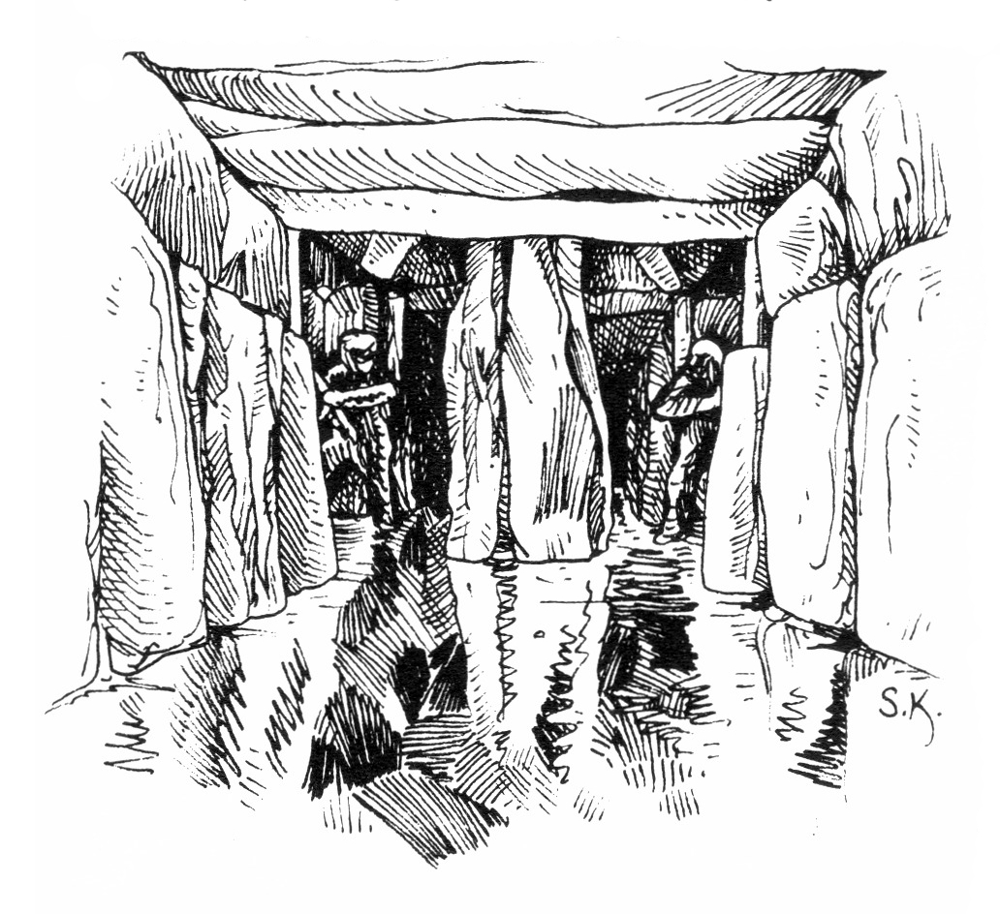
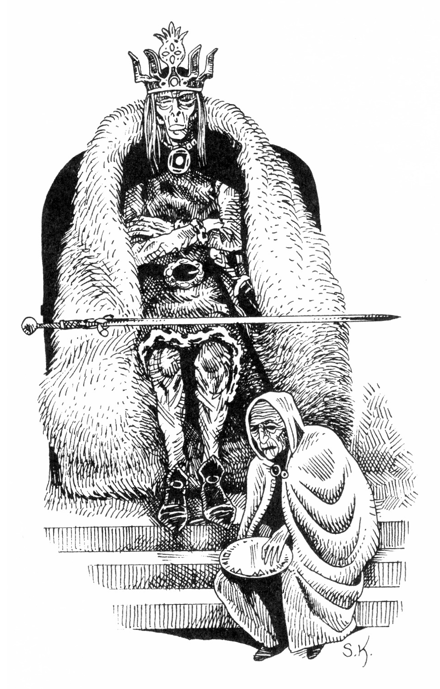
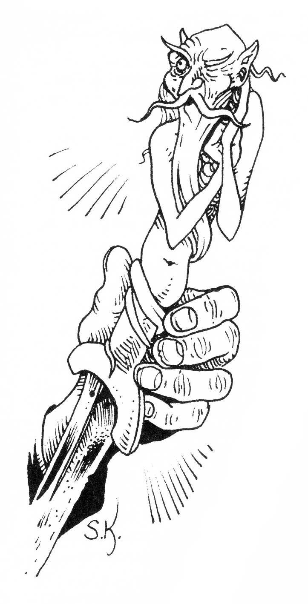
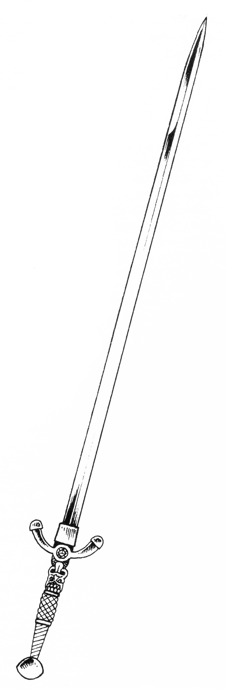
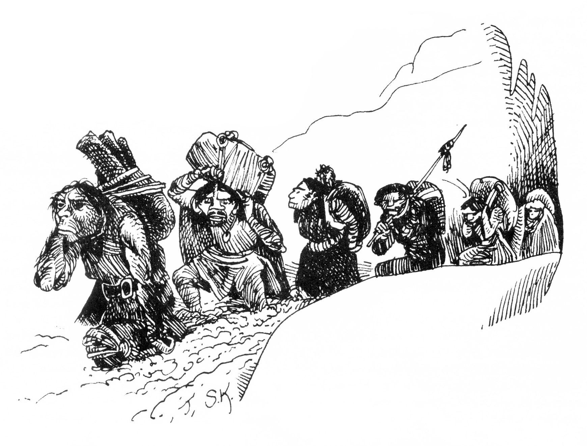
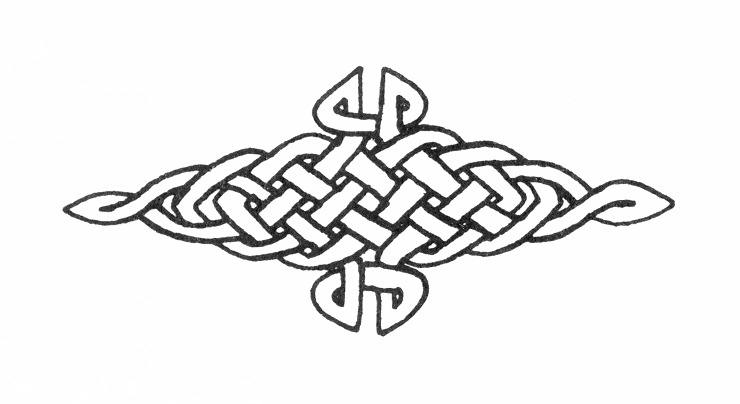

<title>Cruris gravar - Svavelvinter</title>


# 07. Cruris gravar

## Om landet Cruri

I gamla tider var magi en ny och oprövad konst som lockade många i fördärvet med drömmar om makt och evigt liv. Då utforskade hemlighetsfulla män tillvarons dolda krafter och sökte allt djupare så att mörkermakter ofta väcktes och kunde ödelägga hela städer över en natt.

På Marjuras nordvästra kustland, i den trakt som kallas Cruri, bodde på den tiden ett grymt och stolt folk med gränslös makthunger. De stod mindre än andra ut med tanken på sin bortgång och började därför studera nekromantikens lära. De första nekromantikerna lyckades besegra döden, men drog samtidigt gudarnas förbannelse över sig så att inga barn längre föddes i Cruri. Sakta men säkert dog deras släkte ut och jordblodskällan, där de hämtade sin kraft, sinade.

Då landets sista vise män kände slutet nalkas sökte de upp sin kung vars namn var Ottar. Sierskan och häxmästarinnan Riba förklarade hur man måste försöka övervintra medan förbannelsens onda vind drog förbi. Innan de gick in i sin långa sömn, lämnade Cruris folk en statyett, kringvävd med starka profetior, till sina tjänare kvurerna. Spådomen förutsade att kungadömet Cruri en gång ska återuppstå genom statyettens makt.

## Inledning — alternativ 1

Kvurerna har blivit goda vänner med rollpersonerna och fått klart för sig att dessa är shaguliternas fiender. Sedan man har hållit gästabud i kvurerbyn börjar man tala allvar. Det framgår att kvurerna hatar shaguliterna som jagar kvurer och för dem till sina svarta berg för att äta dem. Ingen har någonsin återvänt från de svarta bergen.

Men en dag ska Marjura befrias från ondskan. Kmorda ska förbarmas över jägarfolket och kalla mäktiga främlingar till dess hjälp. Shamankvinnan Uxu hämtar nu fram en uråldrig, halvmeter— hög statyett i gulfärgad sten. Figuren föreställer en pekande minotaur på en bred sockel, vars botten är så ojämnt utformad att pjäsen inte går att ställa på ett plant underlag. Sockeln är vidare ristad med en mängd underliga oläsbara runor.

FV Värdera arkeologiska lämningar — statyetten är minst 700 år.

FV Språkkunskap — runorna är av Ithilgroms tunga, ett uråldrigt språk av vilket bara några enstaka tecken levt kvar i nekromantikernas formelskrivande.

Statyetten ska enligt Uxu vara nyckeln till de mäktiga vapen som i tidens början smiddes för just denna strid. Vapnen kan hämtas från Stenfingerskrevan, en ravin som i alla tider varit tabubelagt område för kvurer.

Om rollpersonerna förklarar sig villiga att söka efter vapnen, leder dem en guide norrut in i ett otillgängligt område med djupa raviner och klösande, tät buskskog. Man vandrar en hel dag, rökpelaren från vulkanen Kislak kommer närmare för var timme och vägvisaren blir alltmer försiktig. Då man på eftermiddagen kommer till en axelbred spricka ner i berget, säger ledsagaren att detta är Stenfingerskrevan och att han inte kan gå längre. Han väntar här och önskar dem Kmordas välvilja.

Rollpersonerna klättrar ner i sprickan, passerar en grotta i dess förlängning och kommer ut i en dold sänka. Här finner man mycket gamla ruiner: husgrunder, fallna pelare, enstaka slipade stenverktyg m m.

Hela sänkan ger ett dött, deprimerande intryck. Ingen vind blåser och luften är ständigt disig som om man vandrade under vatten. Överallt finner man upprättstående gravstenar spreta som tänder mot den avlägsna himlen. Uxu har sagt att man ska leta efter Femfingerhandens tumme och med den tanken vandrar man runt i tystnaden...

## Inledning — alternativ 2

Om rollpersonerna inte lyckats bli vän med kvurerna kan istället Robur Rödvad eller någon annan halvskum figur ha statyetten. Ägaren har köpt pjäsen på Paratorna tillsammans med en vägbeskrivning till stenfingerskrevan av en försupen gravplundrare som tidigare varit på Marjura och funnit guld. Gravplundraren hade stulit statyetten av infödingarna som påstod att den kunde visa vägen till en urgammal skatt. Man skulle gå till stenfingerskrevan och leta efter femfingerhandens tumme. 

## Kung Ottars grav

Sedan man vandrat runt under någon timme, finner man i svackan mellan tre ljungklädda kullar en Stensättning med fem resta megaliter. Fyra av stenarna är uppställda parvis och nära tre meter höga, medan den udda stenen slutar i midjehöjd och har en distinkt avplanad topp.

**DETALJER:** FV Finna dolda ting — På den udda stenens topp är spår uthuggna som precis passar statyettens undersida så att denna kan ställas i spåren. Statyetten pekar då ca femton meter bort på en av kullarna.

Precis där statyetten pekar börjar saker hända. Eventuell snö smälter och ångar undan så att barmarken blir synlig. Jorden på platsen känns mjuk och varm. En rännil som av färskt blod tränger fram och samlas i en liten pöl. Plötsligt skakas sänkan av en sättning i marken. En ensam svart fågel skriker gällt och flyger mot himlen.

### 1. Gravens ingång

Det går lätt att gräva på den utpekade platsen, men snart finner man bitar av tre kvurerskelett och en trasig stenhacka. Drygt en meter in i kullen stöter man på en slät stenplatta med utmejslade byglar. Försöker man gräva runt den spärras vägen av jättelika naturliga stenblock.

**DETALJER:** FV Läkekonst — Kvurerskeletten har fått skallarna inslagna.

**SL:** Man kan fästa rep i byglarna och dra. Det krävs 50 STY eller mer för att rubba plattan, men spett eller talja och block kan nyttjas. Det går utmärkt att fästa rep runt megaliterna.

### 2. Förgång

**ÖVERBLICK:** Bortom stenplattan är luften unken, kall och fuktig. En 80 cm bred och 120 cm hög passage leder in i kullen. Stora kantställda stenar bildar väggar och flata block ligger på dessa som tak med kullen över sig. Golvet är stampad lera. Mitt i gången har en taksten fallit ner och dragit med sig ett mindre ras. Bortom detta tycks gången sluta i en murken trälucka.

**DETALJER:** Ett hundstort rovdjursskelett ligger vid raset.

FV Zoologi — Det är ett grävlingskelett. Längst ner på träluckan är ett hål gnagt.

**SL:** Stenarna väger mellan 300 och 1000 kg. Träluckan är genomrutten och kan lätt rivas ner.

### 3. Hall

**ÖVERBLICK:** Bortom träluckan öppnar sig ett mer än manshögt, kvadratiskt rum, där höga block ställts till väggar. Flata stenar har staplats korsvis till ett spetsigt valv, och mitt i rummet stöttas det av en grov pelare bestående av tre klippblock. I vart och ett av rummets fyra hörn skjuter en hörnsten ut i ansiktshöjd. Ett ärgat bronsstag vilar på varje hörnsten och stöttar taket nära pelaren.

Rummet ger ett vackert grönglittrande återsken. Skimrande obsidianstycken är inkilade mellan de större blocken och hela golvet tycks vara gjutet av tjockt, grönt glas.

Luften är parfymerad, men så frän att ögonen gärna tåras. På var och en av hörnstenarna står ett fyrfat av massivt guld. Passager leder ut från hällens alla fyra väggar. Gången rakt fram är bredare än de andra och har full ståhöjd.

På varje sida om den bredare gången står en primitiv, modellerad lerkrigare.



**DETALJER:** FV Upptäcka fara — Något är fel. Det luktar syra. Då träluckan splittrades föll några flisor ut på golvet. Bitarna har delvis sjunkit ner i ”glasgolvet" och färgats vita vid kontakten.

Om hörnsten och bronsstag undersöks finner man med hjälp av FV Hantera fällor — Takets tyngd vilar inte på bronsstagen. Hörnstenarna tycks snarare hänga i dem.

Om guldfyrfaten undersöks: Foten på varje fyrfat är en stång som sitter nerkörd i ett borrat hål i hörnstenen. Det kräver ett visst våld för att rycka loss dem.

FV Hantera fällor — Stången är en sprint som håller hörnstenen på plats.

FV Värdera smycken — fyrfaten är av brons och bara förgyllda. De ser vid en hastig blick ut att vara värda 600 gm styck, men är bara värda 150 sm styck.

**SL:** Golvets gröna glas är ett fotsdjupt lager trögflytande, mycket starkt frätande syra.

Klampar äventyrarna in utan minsta försiktighetsmått, trampar åtminstone den första personen ner i syran med en eller två fötter. Misslyckas personen därvid med ett normalt SMI—slag förlorar han balansen och måste sätta ner en hand också. Fumlar man, så faller man raklång i smörjan.

Syran förstör metall- och läderskydd med en hastighet av 1 abs per SR. Vapens brytvärde minskar med 1 per SR och skadan de kan tillfoga med 1 per 2 SR.

Varje del av kroppen som exponeras för syran tar 1 KP i skada per SR. Den klibbiga smeten kan inte torkas bort utan måste sköljas bort med vatten. En kroppsdel som tagit full skada av syra kan aldrig läka utan måste amputeras. Syran angriper inte sten eller friskt trä.

Fyrfaten utgör bete i en fälla som får hallen att rasa samman.

Fyrfatet (a) håller hörnstenen (b) på plats. Rycks fatet loss pendlar stenen med bronsstaget (c) in mot hallens centrum och slår omkull pelaren (d). Hallen rasar samman.

Utlöses fällan måste personer nära sidogångarna klara ett normalt SMI-kast för att lyckas slänga sig in i närmaste gång. Personer ute i rummet måste slå ett svårt SMI—slag för att hinna kasta sig in i närmaste gång.

En person som misslyckas med sitt kast dör omedelbart, såvida det inte fattas bara 1-2 poäng från att lyckas. I så fall överlever han, men ett eller två ben kläms fast. Fastklämningen ger sådana skador att benets/benens KP minskas till 0.

### 4. Kungafamiljens gravkammare

**ÖVERBLICK:** Dörren består av ganska välbevarad ek, med ett inbyggt lås. Via nyckelhålet tränger ett rörligt, rött sken ut. Då dörren öppnas kommer man in i en pelarlös kammare, byggd med samma teknik som hallen utanför.

Innanför tröskeln brinner en evig röd eld ur ett tvärgående, meterbrett dike, men en smal stenbro gör att man kan passera om man raskar på. Bortom diket står två keramikstatyer liknande dem i hallen. Rummet är ganska varmt och torrt. Golvet är ojämnt och sluttar uppåt mot kammarens bortre ände, mot vilken en människostor, svart avgudabild är uppställd. I bildens utsträckta händer glittrar två stora guldföremål. Den högra handen bär en dödskalle i guld och den vänstra en urna.

I kammarens vänstra väg är en tung bronsboja fastslagen, och i den högra väggen finns två mindre kedjor. På golvet ligger tre skelett. De är bundna med fotlänkar och tycks omfamna varandra i döden. Deras kläder är förnäma, men ruttnade.

**DETALJER:** Två av skeletten är barn.

FV Läkekonst — Det större skelettet är en kvinna.

FV Upptäcka fara — Det ligger en svag lukt av petroleum i rummet.

FV Finna dolda ting/hantera fällor — Avgudabilden balanserar på en bronsaxel som försvinner in i väggen bakom den.

FV Hantera fällor — Om statyn tippar kan en fälla utlösas. Detta kan förhindras tex om föremål kilas fast under statyns fötter.

**SKATTER:** På det vuxna skelettet hittar man: En silverkedja med topaser runt halsen och tre järnringar och ett ornamenterat bältesspänne av järn. Barnskeletten har vardera fyra halskedjor av järn och varsin järnring på vänsterhanden.

FV Värdera smycken — Kedjan med topaser är värd 100 gm. Järnsakerna är värdelösa annat än som kuriosa. Guldskallen och urnan är värda 500 gm styck.

FV Värdera fornföremål — Topaskedjan är värd 380 gm och avgudens guldföremål 500 gm styck. Den mycket välbevarade samlingen järnprydnader är tillsammans värda 600 gm för en samlare. Då graven anlades kände man bara till metalliskt järn från meteoriter. Det ansågs skydda mot ond magi och var då mycket dyrbart p g a sin sällsynthet.

**OBS:** Personer med färdigheten Värdera fornlämningar 6 eller mer får söka efter intressanta föremål i gravkammarsystemet. De får slå ett FV-slag per timmes sökande. Ett lyckat slag innebär att lämningar värda 50-150 sm hittas. Man får leta tills man slagit fyra misslyckade slag eller ett fummelslag, varvid graven anses vara tömd. De som letar kan inte göra något annat samtidigt. Om flera personer besitter färdigheten får de leta tills en av dem slagit tre misslyckade slag, men den som slår ett fummelslag hittar inget mer. Det första och sedan vartannat lyckat slag ger en erfarenhetspoäng i bonus för färdigheten.

**SL:** Rummets dörr tål 40 KP och låset är SG 20. Skeletten var en gång den begravde kung Ottars familj, som på hans befallning tvingades följa honom i döden. Statyn med guldföremålen hade en rituell innebörd i Cruris tjurdyrkarkult, som av vissa historiker anses ha frambringat minotaurernas ras. Den utgör också en fälla för giriga gravplundrare.

Tas båda guldföremålen samtidigt händer ingenting. Tas det ena guldföremålet ur gudens hand tippar den åt sidan genom tyngden i den andra. Därvid blottas ett brett munstycke (b) på väggen bakom bilden. Dold inne i väggen finns en tryckbelastad behållare (c) fylld med lättantändligt petroleum som strilar ut över den närmaste omgivningen då munstycket blottas. Oljan dränker in plundraren, flödar ner över golvet och rinner längs det lutande rummet ner mot elddiket (d). Efter 4 SR når oljan elden och hela rummet flammar explosionsartat upp till ett rasande eldhav. Försöker den oljedränkta plundraren springa över diket fattar han eld om han inte klarar ett svårt SMI—slag. Skadan av eld sker enligt sidan D 33, men ökas med 2 per SR till följd av oljan.

För att släcka den brinnande plundraren måste han rullas in i något tyg, en manöver som kräver att han själv eller någon hjälpare lyckas med ett svårt SMI—slag. Om personen slitit av sig kläderna räcker ett normalt SMI-slag. Ramlar guldföremålen ner på golvet rullar de med stor sannolikhet ner i elddiket och försvinner. Personen brinner i 3T6 SR.

### 5. Kung Ottars gravkammare

**ÖVERBLICK:** Dörren blockeras av en maskäten ekdörr med inbyggt lås. Bortom dörren finner man en stenkammare byggd i samma teknik som hallen. Som lägst är kammaren ca 2 meter hög.

På en upphöjd tron i rummets bortre del sitter en högrest, mumifierad man (STO 18). Ansiktet har i döden behållit ett hårt och föraktfullt uttryck. Mannen är klädd i en ruttnande konungadräkt av purpurskimrande sammet med hermelinbård och invävda guldtrådar. På huvudet bär han en stor juvelbesatt guldkrona, och runt midjan ett svart sammetsbälte med en dolk i skida.

Över knät ligger ett smäckert, silverglittrande tvåhandssvärd löst ur sin svarta skida.

På trappan upp till tronen sitter det förtorkade liket av en mycket gammal kvinna i enkel grå dräkt. I hennes knä ligger en vacker, men bucklig spegel med pärlemorram i vilken underliga runor finns ristade. FV Språkkunskap — Älviska (lydelsen står på annan plats).

Vid högra och vänstra väggen sitter två högresta mumier på varsin sten, den vänstra med ett kraftigt, svart bredsvärd i knät, den högra med en silverglittrande kroksabel. De är klädda i förnäma, men förmultnade kläder och ärgade bronsbrynjor.



**DETALJER:** FV Historia — Rummet innehåller inga större rikedomar, ingen utsmyckning och inga bruksföremål, varför det egentligen inte tycks vara ett traditionellt gravrum. FV Upptäcka fara — Mumierna ser ovanligt välbevarade ut för att vara så gamla.

**SKATTER:** På kungen finner man följande föremål:

Kungakronan: FV Värdera konst/fornfynd/smycken — Kronan är närmast ovärderlig och kan knappast säljas. Den lämpar sig mest som gåva till en mäktig härskare. Säljer man den ändå kan man få 10.000 gm.

Tre släta guldringar: FV Värdera smycken — 350 sm styck.

Ett halsband av ornamenterade järnlänkar: FV Värdera fornfynd — 120 gm till samlare.

Drakskinnsrustning (dold under kläderna): Spricker då man tar av den.

Mantelspänne i slipad ametist: FV Värdera ädelstenar — 250 sm.

**SL:** Varelsen på tronen var kung Ottar, Cruris sista konung. Vid hans fötter sitter häxmästarinnan Rirba som ledde det magiska rådet. De två krigarna var kungens väpnare, men deras namn är sedan länge glömda.

Rummet år inte inrett som en typisk gravkammare eftersom man enligt profetian ska vakna till kungadömets återfödelse.

**ÖVRIGT:** Det finns följande magiska föremål i graven.

### Rirbas spegel

Spegeln fungerar som fängelse åt en ondsint etervarelse med makt att skåda in i fjärran tid och rum. Den kan användas på två sätt: som formeln FJÄRRSYN eller som en kombination av Astrologi och Upptäcka fara.

Den fjärrseende funktionen aktiveras genom att man vänder sig åt ett visst håll med spegeln i handen och och säger:

> "Kropp är tung och fötter tröga. Slav i spegel, bär mitt öga!"

Dessa ord står ristade på spegelramen på älviska (Rirba antog att detta språk inte skulle förändras så mycket med tiden). 

I spegeln kommer nu avstånden successivt att krympa åt det utpekade hållet. Varannan SR kommer fjärrsynens effektgrad att öka med 1, så att man ser allt längre bort. PSY—kostnaden tas allt eftersom från användaren.

För att avsluta Fjärrskådandet ska man säga:

> "Trött blir ögat av att rida. Spegelslav låt blicken bida!"

Denna ramsa står inte skriven på spegeln utan måste erhållas genom AVLÄSA MAGI. Känner man inte till hur spegeln ska hejdas kommer PSY att förbrukas i allt snabbare takt tills den oförsiktige användaren dör. Processen kan också avbrytas med en SKINGRING.

Rirbas tanke var att en nyfiken spegeltittare skulle läsa tecknen högt och sedan dö för sin fräckhets skull.

Funktionen Astrologi/Upptäcka fara aktiveras genom att användaren på vers berättar för spegeln om en specifik handling han tänker utföra inom den närmaste timmen. Spegeln kommer då att visa vilka farliga konsekvenser handlingen kan få genom att demonstrera konsekvenserna på spegelbilden av användaren.

*Exempel: Äventyraren säger: "Jag vill korsa flodens is för att hämta brännbart ris”. Spegeln visar äventyrarens bild under vattnet, kämpande för att hitta en vak, etc.*

Eftersom varelsen i spegeln hatar alla som ger den order, tar den tillfället i akt och frossar i snaskiga detaljer Får den hållas visar den gärna hur användarens lik äts av maskar och så vidare.

Den som nyttjar spegeln på detta sätt måste därför klara ett PSY—slag eller tvingas avbryta utan att få någon information. Misslyckas man tre gånger i sträck kan man aldrig mer förmå sig att använda spegeln. Fumlar man måste man slå på skräcktabellen och kan aldrig använda spegeln igen. Astrologifunktionen drar PSY beroende på visionens omfattning.

Då spegeln ska avläsas motsvarar den effektgrad 6.

### Kroksabeln Sturmendrang

**UTSEENDE:** En smäcker, silverglittrande kroksabel med inlagda runor på främmande språk och slingrande ormar i guld på bladet. Närmast parerstången, som har tre smaragder på varje sida, är sju små stjärnor präglade. Hjaltet har lindats med svart, flätat ödleskinn för säkert grepp. Skidan saknas.

**DETALJER:** FV Värdera vapen — 275 gm (magi ej inräknad). FV Värdera smycken - 175 gm, varav smaragderna 15 gm styck. FV Upptäcka fara/magi VARSEBLIVNING — Svärdet är magiskt. SL: Runorna är skrivna på Ithilgroms tunga. Stjärnorna utgör vapnets sigill.

**MAGI:** Sabeln innehåller FÖRTROLLA VAPEN E4 + E3 riktade speciellt mot odöda, SIGILL E3 + E3, PERMANENS E4 + E3, NEXUS E8, samt ytterligare magi av okänt slag.

Mot vanliga motståndare ger Sturmendrang +4 skador och +4 på CL enligt formeln FÖRTROLLA VAPEN som försörjs av NEXUS. Mot odöda ger sabeln + 7 skador och + 7 på CL. De tre extra skadorna på odöda är inte försörjda av NEXUS. För varje ny odöd som angrips kommer därför tre PSY-poäng att dras från användaren.

Användaren är tack vare den okända magin immun mot skrämsel från odöda och nekromanti—besvärjelser så länge han håller Sturmendrang i handen.

**BIEFFEKT:** På grund av Crurifolkets bristande magiska förståelse blev Sturmendrang beroendeframkallande. Förlorar användaren sabeln börjar han tappa FYS—poäng med en hastighet av en per dag. Totalt förlorar han lika många poäng som antalet veckor sabeln varit i hans ägo, men inte fler än ner till 1. Poängen återställs i samma ögonblick man rör sabeln igen. Beroendet visar sig efter ett par veckors innehav, då ägaren börjar visa en sjuklig omsorg om vapnet och blir ovillig att lämna det ifrån sig.

### Dolken Demens

**ÖVERBLICK:** I kung Ottars bälte sitter en enkel bronsdolk med ett obekvämt elfenbensskaft format som överkropp och huvud av en långskäggig gubbe. Skidan är enkel.



**DETALJER:** Blad och skaft glappar och är amatörmässigt hopfogade.

FV Värdera fornfynd/vapen — Blad och skida tycks vara gjorda i en annan stil än skaftet, som tycks vara äldre. 

FV Värdera vapen — 8 sm. 

FV Värdera konst — Skaftet kanske kan säljas för 50 sm till någon excentrisk samlare. 

Magi VARSEBLIVNING/FV Upptäcka fara — Skaftet är magiskt. 

FV Lyssna — Svaga snarkningar hörs från vapnet.

**SL:** Dolkskaftet vaknar och börjar pladdra på ett obegripligt språk om man drar vapnet ur skidan. Snart tystnar det och den snidade gubben plirar försiktigt på äventyrarna.

Dolken Demens skapades av misstag i de urminnes tider då människan tog sina första övermodiga kliv på häxkonstens hala trappa. Besvärjaren Demens var bland de första som försökte förtrolla vapen, men ett felaktigt tecknat sigill blev hans öde. Hans själ sögs in i elfenbensskaftet på den dolk han sökt besvärja, medan den gamla kroppen föll sönder i sina beståndsdelar. Istället för att gräma sig, gjorde Demens det bästa av situationen och tjänade i många sekler som dolk och rådgivare åt Cruris kungaätt. Med tiden blev han tankspridd och världsfrånvänd, men gick ändå i arv som en gammal trotjänare.

**EGENSKAPER:** Anfall som vanlig dolk, men med CL —2 och skada -1. Varje gång dolken träffar ett mål eller häftigt dras ur skidan, finns 20% chans att bladet lossnar, varvid Demens ropar: ”Mina löständer, mina löständer!”

**FÄRDIGHETER:** Tala/läsa språk: Ithilgroms tunga 5, andra äldre människospråk + älviska 2, drakspråk, svartiska, ödlespråk, insektoid 1, Räkna 5, Överklasstil 21, Schack och brädspel 23, Hasardspel 23.

På följande lärdomsfärdigheter har Demens FV 15, men ett resultat på 18-20 innebär fummel: Administration och juridik (hopplöst föråldrat, men med historiskt värde), Botanik, Drogkunskap, Marjuras geografi (lägg märke till att glaciären inte fanns på Demens tid) , Geologi, Heraldik, Marjuras historia, Kunskap om magi, Områdeskännedom, Språkkunskap, Värdesätta (generell) och Zoologi.

**KARAKTÄR:** Demens är sällskaplig och tror alla om gott. Han pratar gärna när han inte sover, d v s när man stoppar honom i skidan. Då han förstått var han hamnat inser han snart sin plikt att upplysa dessa sentida barbarer genom att dela med sig av sitt överlägsna vetande vare sig de vill det eller inte.

Demens stora passion är spel. För att kunna skaffa sig en anständig skida, ett guldblad och en mindre vapenkammare föreslår han att man spelar om pengar.

Han är van att föra sig bland kungligheter och försöker på ett beskäftigt sätt uppfostra sin bärare till goda manér. Diskuterar man hans värde i pengar blir han förolämpad och hämnas genom att luras då man frågar honom om något.

### Tvåhandssvärdet Ebharing

**ALLMÄNT:** Ebharing är cruriska kungaättens arvesvärd och ett av den tidiga magins mest lyckade verk. Hur man lyckades ladda vapnet med så förödande magi, och till vilket pris, kommer att framgå senare i äventyret.

**ÖVERBLICK:** Ebharing är ett silverglänsande tvåhandssvärd med bronshjalt och grepp av tvinnad silvertråd. På parerstångens ena sida sitter en ensam stjärnsafir. Ovanför denna är hjaltets ände format till ett grinande djävulshuvud med lång, utsträckt tunga. Huvudets ögon är två polerade svarta stenar. Skidan är i svart läder med guldornament.



**DETALJER:** Svärdsskidan faller sönder om man lyfter den.

FV Upptäcka fara/magi VARSEBLIVNING — Svärdet tycks utstråla magi, illvilja och förakt. Det tycks vara skyddat av någon fälla. FV Värdera vapen — Detta utsökt balanserade och skarpa mithrilsvärd är värt 3500 gm förutom ev magiska egenskaper.

FV Värdera metall — Svärdets mithril är värt 1200 gm och guldet efter skidan 110 gm.

FV Värdera ädelstenar - Stjärnsafiren är värd 700 gm.

FV Hantera fällor/finna dolda ting — Djävulshuvudet kan vridas ett halvt varv.

FV Hantera fällor — Vrids djävulshuvudet bort från safiren desarmeras någon skyddande fälla.

**MAGI:** FÖRTROLLA VAPEN E8, ANIMERA DÖD E4, BLIXT E1, SIGILL E8+E4+E1, PERMANENS E8+E4+E1 NEXUS E18.

Ebharing ger som mest +8 på skada och CL att träffa, men låter sig bara hanteras av goda svärdsmän. Bonus blir därför högst 2 vapenfärdighetens gruppnummer. Detta innebär att man kan utnyttja bonus fullt ut först med rätt vapenfärdighet 17 eller högre.

Intelligenta humanoider som dödas av Ebharing står 1—4 timmar senare upp som zombietjänare åt svärdets bärare. Zombierna motsvarar effektgrad 3, men är permanent aktiverade. Ebharing kan hålla maximalt 30 tjänare. Då Kvoten fyllts förblir nya offer döda. Animeringen av döda är inte försörjd av nexus. När ett av svärdets offer vaknar till zombieliv förlorar dess baneman 4 PSY-poäng, varav ett permanent. Skulle svärdbäraren själv avlida till följd av negativa PSY—poäng blir han själv en femte gradens zombie under svärdets kontroll.

De aktiverade zombierna lyder den som för tillfället bär Ebharing. Om bäraren själv blir zombie styr svärdet denne mot Cruri för att åter— förenas med Ottar.

BLIXTfunktionen är aktiverad när djävulshuvudet vridits så att det ser åt samma håll som safiren. Vidrör någon då hjaltets silvertråd utlöses en E1 BLIXT. Om personen uttryckligen griper hjaltet och misslyckas med ett normalt FYS—slag, sluter sig hans fingrar i kramp runt svärdet och BLIXTen utlöses varje SR.

Personen kan befria sig om han lyckas med ett svårt FYS—slag eller om djävulshuvudet vrids.

**SL:** Demens kan berätta vilka magiska formler som finns i de andra svärden, men tänker inte på att säga något om man inte frågar honom. Informationen är i stort sätt riktig, även om han inte känner till föremålens sidoeffekter. Efter Demens beskrivning kan man försöka harmonisera sitt psyke med sakernas magi.

### Nabakos — det svarta bredsvärdet

**ÖVERBLICK:** I väpnarens knä ligger ett tungt bredsvärd, vars blad, parerstång och hjalt tycks vara smidda i ett enda stycke av en svart metall. På bladet finns en främmande runa ristad som inte syns utan måste upptäckas med känseln, men ingen annan utsmyckning syns. Svärdet reflekterar inget som helst ljus, utan är svart som förtätat mörker.

**DETALJER: Bladets runa är på Ithilgroms tunga och betyder Nabakos, "Järnbitaren".

FV Geologi — Undersökaren har aldrig stött på en liknande metall.

FV Värdera metaller — Omöjlig att värdera, men metallurger och dvärgar borde vara intresserade av forskningsskäl.

Magi VARSEBLIVNING — Svärdet är inte magiskt.

FV Värdera vapen — Vapnet är sämre än moderna svärd genom sin tyngd och klumpighet, men eggen tycks vara god och utan minsta märke.

Värden: Fattning 1H, STY-grupp 3, skada 1T8, vapenlängd 1, tyngd 2 BEP, BV 22, typ T, CL-modifikation —1. SL: Nabakos är inte smitt i vår värld och repas normalt inte av dess element. Den svarta metallen har förmågan att klyva järnbaserade föremål. Varje gång motståndaren parerar med ett järnvapen minskar dess BV med 2T6. Träffar Nabakos en detalj i en järnrustning eller en järnsköld, absorberas visserligen skadan, men absorberingsförmågan minskar med skadans värde. Används hel rustning minskar totala absorptionsförmågan med skadan/3 avrundat uppåt.

Svärdet kan vidare användas till att forcera järnbeslagna dörrar, kistor o dyl som om de vore av trä.

Eftersom metallen absorberar allt ljus blir den varm. I solljus stiger svärdets temperatur med +5°C/minuts exponering tills det inte längre kan hållas i handen. Från och med +2O0°C ger svärdet +1 skada per 50°C, men det blir högst 350°C varmt och glöder då svagt rött. I konstgjort ljus eller mulen dager, håller metallen ca +4O°C och tjänar då som ett behagligt element.

### 6. Jordblodskällan 

**ÖVERBLICK:** Passerar man från gravens hall mellan de båda keramikstatyerna kommer man efter några stenlagda trappsteg ner till en röd dubbelport i murket trä. Ett oxkranium i kopparrelief pryder den olåsta dörren. Innanför portarna möter man en varmfuktigt ångande grotta där en koppartjur i naturlig storlek står uppställd. Ur en bred öppning i tjurens hals flyter trög, röd, blodliknande vätska ut över golvet och ner genom borrade hål. Framför tjuren finns ett enkelt stenaltare.

**DETALJER:** FV Geologi — Vätskan är asfaltsliknande, men har stora mängder organisk substans. Något liknande har sällan skådats. Demens kan berätta att detta är jordblodskällan där den levande jordens essens strömmar fram. Jordblodet kunde skänka stora kraften men Demens trodde källan hade sinat. Han minns inte på vilket sätt den var mäktig. SL: Jordblodet rinner upp ur marken och upp genom tjuren man byggt runt källan. I Cruris glansdagar kände trollkarlarna till ett sätt att liksom vampyrer suga ut dess makt, men källan sinade då förbannelsen föll över landet. Dricker en spelare av källan, som smakar järn, faller han i djup sömn under 1-20 timmar och vaknar sedan med huvudvärk.

### Komplikationer

1: Om svärdet Ebharing flyttas från kung Ottars knä vaknar kungen upp 2-8 timmar senare. Hans första mål är att vinna kraft genom att dricka från jordkällan, sedan ger han sig ut för att hämta tillbaka sitt svärd och sin krona. Ottar och Ebharing står i telepatisk förbindelse med varandra och söker återförenas.

Då han återvunnit regalierna kommer Ottar att återvända till gravfältet för att väcka sitt folk. Beger sig äventyrarna till Stenfingerskrevan möts de av en armé odöda (motsvarar mumier). (I praktiken är det bara att hålla sig därifrån). När Ottars folk befinner sig nära (100 m) jordblodskällan, kan de endast skadas av magiska vapen.

Tio dagar efter Ottars uppvaknande kommer en procession av förtorkade lik att vandra in i Arhem under Cruris ruttnade banér. På torget kommer en härold att med hes röst läsa ett oförståeligt budskap på Ithilgroms tunga, med innebörden att Ottar nu kräver sitt rike äter och väntar sig folkets lydnad. Sedan blir budet stående i väntan på svar. Efter ett dygn vandrar liken tillbaka mot Cruri. De försvarar sig inte om de angrips.

Häroldens budskap möts med viss uppståndelse (fniss) bland trakorierna i Arhem, men fogden försöker tysta ner händelsen för att inte skapa panik. Han kommer att placera en rejäl vaktstyrka på vägen norrut och skicka snapphanarna att speja i trakten, men sänder ingen expedition mot Cruri.

Trakoriska riket gör bara anspråk på Marjuras sydkust och området runt Arhem, men har inga intressen i det ödsliga Cruri. Eftersom inget mer inträffar under speltiden vidtas inga ytterligare åtgärder.

Shaguliterna blir förvirrade och nyfikna när Cruri återuppstår och spanar i området med orcher och via flygande horndemoner, men lyckas inte på egen hand lokalisera gravarna eftersom dalen är smal och dold. Skulle de ledas till platsen av äventyrarna eller av väckta kvurerlik finner de att deras nekromanti är verkningslös gentemot de odöda som står under jordblodskällans inflytande. Rådslag kommer att hållas, men inget konkret händer under speltiden.

För rollpersonerna innebär detta att fler möten sker runt Cruri och att shaguliterna kommer att söka förhöra någon av dem om de kan förknippas med uppvaknandet.

Andra äventyrare kan komma att kontakta rollpersonerna för att göra en gemensam expedition.

### Kung Ottar — Cruris konung

```
STY 16 (86)    SMI 10 (17)    KP 17 (52)
STO 18 (18)    INT 4  (17)    SB 1T4 (4T6)
FYS  0  (0)    PSY 2  (20)
```

Siffror inom parentes gäller sedan kungen druckit av jordblodskällan.

**Skydd:** Lång ringbrynja av brons med abs 6 och en romersk hjälm av brons med abs 6. Båda skadas endast av magiska vapen.
**Färdigheter:** Slagsmål 8 (14), Tvåhandssvärd 10 (19), Dolk 8 (16).

**SL:** Kungen räknas som högre odöd. Sedan Ottar druckit av jordblodet skyddas han av ANTIMAGI E3. Det är nästan omöjligt att besegra kung Ottar, speciellt sedan han fått tag i svärdet Ebharing. Detta är avsiktligt, men för att inte rollpersonerna ska offra sig i onödan bör SL demonstrera hans makt på ett tydligt sätt. Ottar kan gärna vandra in rakt genom väggen, snabbt gripa Ebharing och gå därifrån utan att ta minsta notis om äventyrarna, ens om dessa hackar på honom med sina vapen.

Spelarna bör starkt avrådas från att uppsöka Cruri igen. Tänk på att de ursprungliga uppdragen kan saboteras genom dumdristigheter.

2: Om rollpersonerna öppet försöker sälja gammalt gravguld i Arhem väcker man genast uppmärksamhet. Alla skattjägare och tjuvar kommer att dras som flugor till dem, och kan bryta sig in hos dem, överfalla dem utanför staden, etc.

## Kvurerna

Kvurerna är ett primitivt neanderthalfolk som specialiserat sig på att leva i polartrakter. De vandrar omkring i flockar nedanför glaciärkanten och lever av att fiska, samla växter och jaga. Ofta ger sig grupper av män upp på isen för att under Kmordas vilja finna storvilt. Man anser att djur fångade på isen har ett särskilt starkt kött. Kvurernas munnar har svårt att forma ord, men de kommunicerar genom grymtningar och andra strupljud, samt genom ett högt utvecklat teckenspråk. Eftersom de inte kan tala betraktar andra folk kvurerna som halvdjur och behandlar dem ofta illa. Bland människor är kvurerna rätts— lösa och får bara närma sig folkboningar på nåder. Man tolererar dem mest därför att de säljer skinn, karsonfett och annat användbart.



**UTSEENDE:** Kvurerna går klädda i päls och skinn som smälter väl in i omgivningarna. De har ett typiskt neanderthalutseende med kraftiga kindkotor och ögonbrynsbågar och sluttande panna. Näsan är bred och platt, läpparna stora. Deras kroppar är kraftigt byggda och täckta med tät hårväxt. De rör sig med en framåtlutande gäng.

Eftersom de ofta smörjer utsatta kroppsdelar med karsonfett mot kylan har de en motbjudande lukt.

**SEDER & BRUK:** Kvurerna har en primitiv naturreligion som tillskriver allt i världen en ande man måste hålla sig väl med. De är mycket vidskepliga och skräms lätt av all magi och allt övernaturligt. Varje flock har en shaman, en helig person som tolkar andarnas sinnesstämning, botar sjuka m m.

Kmorda är för dem glaciärens ande, den mäktigaste varelsen på Marjura, vars vrede kan förgöra hela flockar om den retas.

Kvurerna använder inte pengar utan byter varor direkt. De uppskattar ting efter användbarhet eller skönhet, tar gärna emot några blänkande guldmynt, men har ingen användning för stora mängder av den tunga metallen som bara är besvärlig att bära på.

Normalt är kvurerna fredliga men skygga. De misstror människor av naturliga skäl. Över allt annat hatar och fruktar de shaguliterna som för dem är mörkerandar.

Vinner man kvurernas förtroende visar de sig vara mycket gästfria och lojala. I deras hårda tillvaro är det självklart att vänner måste kunna lita på varandra, och lögn är för dem något obegripligt, närmast ett tecken på sinnessjukdom. Har man en gång svikit en kvurers förtroende litar de aldrig mer på en.

Kvurerna har inget begrepp om personlig egendom. Inom flocken och vänkretsen delar man allt efter tillgång och behov. En kvurer kan be att få vad som helst av en rollperson och blir mycket förvånad om denne vägrar utan ett begripligt motiv.

### Kvurerflocken i Cruri

I Cruris otillgängliga bergstrakter norr om svaveldalen finns den kvurerflock rollpersonerna lättast kommer i kontakt med.

Flocken jagar ofta i trakten eller kommer till Arhem för handel. Den består av tjugo män, tjugofem kvinnor och trettio barn. Det finns sex sådana grupper på Marjura. Flocken delar sig om den blir för stor eftersom det underlättar födosamlandet. Cruriflocken använder snögrottor eller kåtor som bostäder. Man flyttar ungefär varannan månad och väljer undangömda platser att slå sig ner på (kräver lyckat bruk av Dolda ting för att upptäcka).

Om rollpersonerna blir vänner med Cruriflocken ordnar man fest i byn med skådespel och sånger. Man serverar läckerheter som förtuggad tångsallad, maginnehåll av säl, jäst bröstmjölk med bitar av härsket valspäck, sursäl, m m.

Bland kvurerna är det sed att framstående manliga gäster ärar sina värdar genom att befrukta någon av stammens kvinnor och på sätt dela med sig av sin storhet. Artigheten bjuder vidare att ingen gäst ska behöva sova ensam i kylan. Dessa seder kan ge upphov till många intressanta förvecklingar. SL kan tex berätta för en spelare att en mörk skugga smyger fram mot hans sovplats mitt i natten...

### Pälsödlor

Cruristammen har pälsödla 1 & 2 i monstertabellen som riddjur. De aggressiva och dumma varelserna räknas som stridstränade. Bara den som är mycket van förmår hantera dem.

### Värden för en vuxen kvurerjägare

```
STY 4T6   14    SB  —
STO 8+1T4 11    KP 13
FYS 10+T6 14
SMI 3T6   11
INT 2T6    7
PSY 3T6   11
KAR 2T6    7
```

**Skydd:** 2 p pälsar
**Typiska färdigheter:** Kortbåge 15, Träklubba 13, Kniv 13, Arktisk botanik 14, Geografi (Östra Marjura) 17, Första Hjälpen 15, Teckenspråk 4, Kamouflage (arktisk) 18, Hantera fällor 12, Lyssna/Provsmaka 10, Finna dolda ting 15, Upptäcka fara/Orientering/Jakt 16, Skidor/Överlevnad (arktisk) 18.
**Typisk jägarutrustning:** Ändamålsenliga kläder av skinn och päls, skidor med en stav, pilbåge och dolk, liten dosa karsonfett, ett par snaror, två dagsransoner av sälspäck och lavar, bensnide i öronen eller runt halsen, talisman i påse runt halsen.

**SL:** En kvurer tror att hans själ finns i talismanen. Att förlora den är mycket farligt, eftersom man då kommer i klorna på en eventuell upphittare.

### Uxu — shamankvinna, 35 år

**UTSEENDE:** Till vardags klär sig Uxu som alla andra kvurer, men vid rituella tillfällen smörjer hon sig helt i färgade karsonoljor och hänger magiska amuletter och djurdelar på kroppen. Framför ansiktet sätter hon sin shamanmask, ett målat djurbäcken. Hennes kropp är mager och senig.

**EXTRA UTRUSTNING:** Förutom vanlig jägarutrustning har Uxu en trolltrumma, en stridsklubba och allehanda små behållare med oljor, krämer och talismaner.

**KARAKTÄR:** Uxu är nyfiken och framfusig mot främlingar. Eftersom hon känner andarna är hon modigare och mindre vidskeplig än andra kvurer.

**FÄRDIGHETER (UTÖVER DE NORMALA):** Astrologi 16, Drogkunskap 14, Läkekonst 16.

### Umma — köpman och flockledare, 40 år

**ALLMÄNT:** Umma skadades svårt som vägvisare åt ett jaktlag i sin ungdom och togs om hand av en god Marjurisk bonde sedan jägarna lämnat honom att förblöda. Hos bonden stannade Umma flera år och lärde sig mycket om människornas samhälle och seder.

Då han återvände till sitt folk hölls han högt i ära för sina stora kunskapers skull. Han sköter ofta flockens affärer i Arhem eftersom han talar människospråk bäst av alla kvurer.

**UTSEENDE:** Typiskt utseende för en äldre kvurer, med gråsprängt kroppshår och nernötta tänder. Klär sig mer människolikt än sitt folk och brukar inte karsonfett då han är i Arhem. Vänstra sidan av ansiktet är svårt ärrad efter en rivskada. Umma haltar på höger ben, och vänstra armen är nästan lam.

**KARAKTÄR:** Umma har med tiden blivit sorgmodig över människornas grymhet och är fast besluten att skydda sitt enkla folk från civilisationens förbannelser. I staden är han allvarlig och på sin vakt, men ute i det fria tillsammans med sitt folk blir han mer avspänd. Då han gör affärer är han bestämd, men inte småsint.

**SL:** Förhållandet mellan Umma och Uxu kan bli spänt ibland då de har olika åsikter om andarnas betydelse.

### Komplikationer

Om Kmordatemplet försvaras av rollpersonerna och de hjälper kvurer i knipa, så kommer kvurerna försiktigt ta kontakt med dessa goda män, då de kanske är Marjuras befriare.

Om rollpersonerna utför något skändligt dåd mot kvurer, så kommer rollpersonerna för all framtid att vara klassade som onda varelser. Kvurerna hämnas dock normalt inte.




