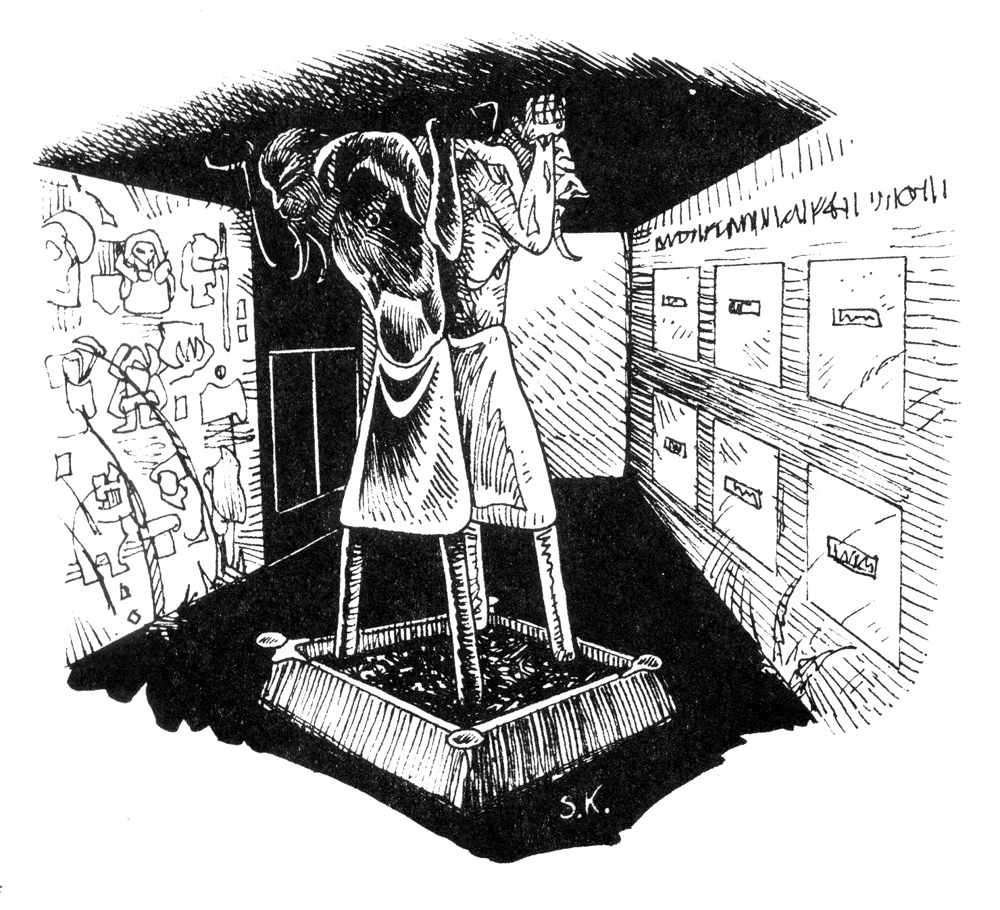
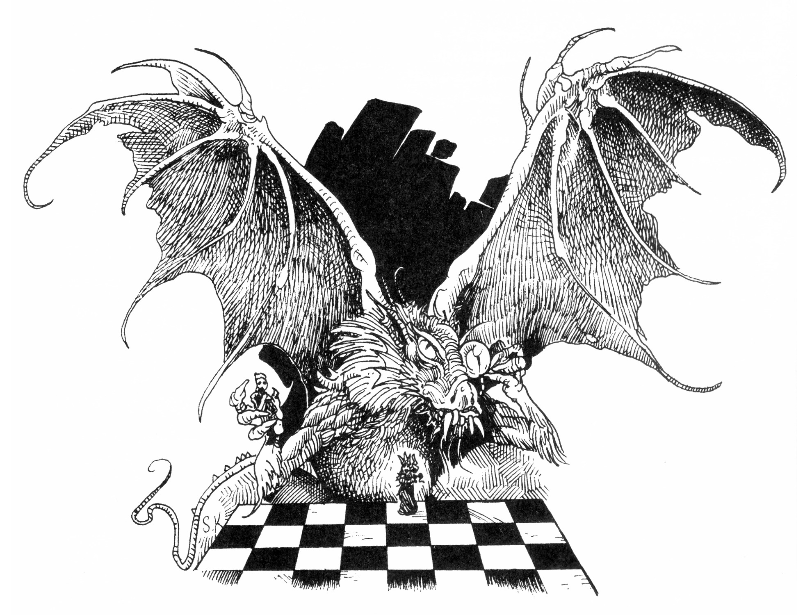
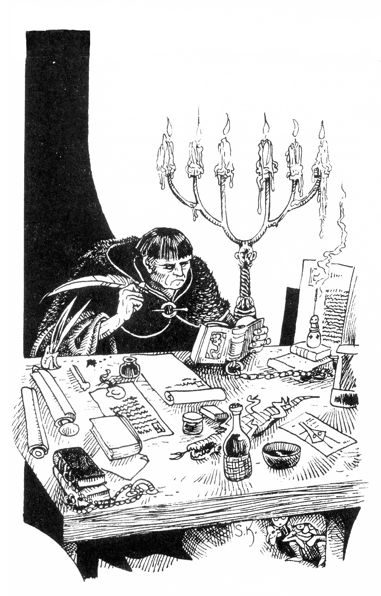
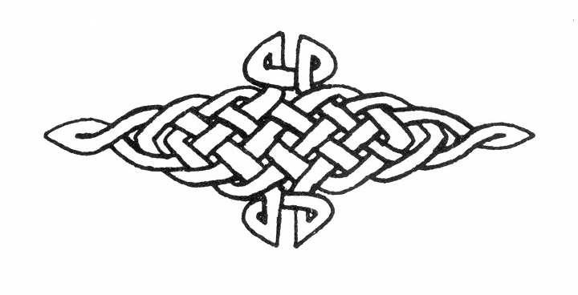

<title>Kvicksilvergruvan - Svavelvinter</title>

# 08. Kvicksilvergruvan

## Inledning

Dvärgen Gwellmyn kommer under kvällen fram till rollpersonernas bord på värdshuset "Junker Hildurs" och frågar om han får slå sig ner. Han tar god tid på sig att stoppa sin stora sjöskumspipa och möter de andras utforskande blickar med ett milt leende.

Är herrar äventyrarna kanske intresserade av en affär? Gwellmyn berättar att dvärgarna tills för några år sedan tappade kvicksilver ur berget i en gruva några mil sydost om Arhem, men att gruvan tyvärr måste överges när draken Blatifagus slog sig ner i den största grottan.

Nu behöver dvärgarna det renade kvicksilver som finns lagrat på gruvans tredje nivå till sina legeringar, och betalar 50 gm per tunna som kan levereras till dvärgstaden Bethra Zur.

De skulle naturligtvis hämta metallen själv, men fogden har förbjudit dem att störa draken eller ens gå i närheten av gruvan. Av politiska skäl vill man ogärna trotsa fogden, medan herrarna däremot är främlingar på ön. ingen behöver ju veta att dvärgarna lejt herrarna!

Gwellmyn erbjuder som ytterligare betalning ett gott vapen åt var och en. Känner han till att äventyrarna är efter shaguliterna, kan han som lockbete nämna att dvärgarna en gång byggde sektens järntorn och vet en hel del om det som inte shaguliterna själva känner till.

Själva aktionen bör inte vara alltför farlig om man är försiktig och undviker draken och fogdens vakter som finns i gamla utkiken, där också trollkarlen Trodax Draconicus håller till. Det ska finnas en lönnpassage från kontornet ner till gruvans andra plan, men allt man fått ur den ende överlevande från attacken, som visste något om lönngången är: "Gå med hetta, gå i mörker!". Det är kanske något slags lösenord.

Om rollpersonerna accepterar utmaningen leder en yngre dvärg sällskapet till bergsryggen ovanför gruvans kontorn, varpå han förmanar dem att inte reta draken i onödan och ger sig av.

Efter genomfört uppdrag berättar Gwellmyn om Järntornets hemliga läge, om silverstädet och om gångbrons förstörande.

## 1. Kontornet

**ÖVERBLICK UTIFRÅN:** En halvcylinder är murad som ett svalbo direkt mot klippan. Man har använt stora solida stenblock vid arbetet. Cylinderns höjd är ca tjugo meter och radien tio meter.

En smal trappa leder upp till en järnbeslagen dörr ca 15 m upp på väggen. Till höger om denna dörr syns ett gallerförsett fönster.

**DETALJER UTIFRÅN:** Dörren är svart av sot, mycket massiv och låst med ett komplicerat, inbyggt lås. Fönstret kan man nå genom att klättra på väggen (ganska lätt +2 CL klättra) men gallren är bastanta och kräver STY 60 för att ryckas loss. Innanför fönstergallren hänger förkolnade rester av träluckor Rummet därinne är täckt av kol, aska och snö (på vintern).

**SL:** Dörren tål 200 KP. Låset har SG 60.

### 1a. Kontorsrummet

**ÖVERBLICK:** Kontoret är ett halvcirkelformat rum, motsvarande tornets utsida och ca två meter högt. I rummets vänstra hörn finns en öppen spis. På vägen mitt emot spisen finns en trädörr. Golvet täcks av förkolnade rester av trämöbler och stora mängder pappersaska.

**DETALJER:** FV Geologi — Rummet tycks ha träffats av intensiv hetta från fönstret att döma av hetsprickorna i väggen.

FV Dolda ting — Tre förkolnade dvärgskelett ligger i askan. Ett av liken bär en silverring märkt ”Ebul, min son”.

Man kan också hitta en Stridsyxa med förkolnat skaft samt spridda mynt.

FV Administration — Askan härrör från brända protokoll över handel med kvicksilver. Det gängse priset tycks ha varit 40 gm/liter.

**SKATTER:** Totalt finns 12 gm, 28 sm och 45 km. Ringen är värd 20 sm.

**SL:** Rummet brändes av draken Blatifagus då han tog över gruvan.

### 1b. Trappor

**ÖVERBLICK:** Dörren i kontoret år olåst. Trappor leder ner åt höger längs klippväggen och slutar i en liten unken hall med en trädörr på var sida.

### 1c. Arkiv

**ÖVERBLICK:** Dörren är olåst. Innanför finns en mögelluktande, trång skrubb där hyllor med inbundna böcker täcker väggarna.

**DETALJER:** FV Administration — Böckerna är bokföring över utvunna och renade mängder kvicksilver, handelsuppgörelser m m.

En speciell bok är skriven på kod, det är en dagbok som Gwellmyn vore speciellt tacksam över att få.

FV Dolda ting - (Svår CL om man inte letar speciellt). Bakom böckerna på högra väggen finns ett lönnfack med kontorets handkassa i ett skrin.

**SKATTER:** I kassaskrinet finns totalt 140 gm, 380 sm och 180 km.

### 1d. Krematorium och gravkammare

**ALLMÄNT:** Dvärgarna på Marjura har som sed att begrava sina döda på arbetsplatsen för att andarna ska dela med sig av sina kunskaper.

**ÖVERBLICK:** Ett långsträckt rum med slätt golv och målade väggar som visar dvärgar i arbete. Mitt i rummet står två statyer i olikfärgade metaller med ryggarna intill varandra. Statyerna står i en eldstad med kolrester och stöttar taket med sina händer På högra väggen finns sex stenluckor över vilka står skrivet: "Gå med hetta dit som silver strilar vattenlikt ur handen". Längst bort i vänstra väggen finns en stor ugn med järnluckor.

**DETALJER:** På stenplattorna finns inskriptioner med namnen på döda dvärgar. Plattorna är mycket exakt inpassade i väggen och därför svåra att bryta upp. De tål 150 KP i rent våld. Innanför luckorna hittar man urnor med aska och gruvverktyg, men ingen rikedom.

FV Dolda ting — Krökta repor kan ses på båda långväggarna i rummets hitre del.

FV Geologi/Värdera metall/magi IDENTIFIKATION — Statyerna är gjorda i koppar respektive en blank legering bestående av 5% silver + 25% kvicksilver + 50% tenn + 20% Galvorn. Legeringen är inte speciellt stark, men har den speciella egenskapen att den krymper något då den upphettas.

FV Kulturkännedom, dvärgar — Statyerna föreställer de legendariska bergsgnomerna Guezar och Mazalbar, vilka sägs öppna bergets vägar.

**SL:** För att komma in i den hemliga gången ska man "gå med hetta". Rummets golv vilar på en axel som löper mitt under statyerna. Eldar man kraftigt under statyerna utvidgar sig kopparfiguren medan den silverblanka statyn krymper. Golvet kommer då att tippa, och den hemliga gången blottas efter ca en kvart. Slutar man elda återställs golvet långsamt igen. Får en ordentlig eld brinna ut, tar detta ca två timmar, men släcker man och rakar undan glöden, stängs passagen på en kvart.

### 1e. Hemlig passage

**ÖVERBLICK:** Omedelbart innanför krematoriet öppnar sig en naturlig klippgång, ca 90 cm bred och 150 cm hög. Luften är fuktig och råkall.

Gången vindlar sig ner ett halvt varv medsols och fortsätter med svag sluttning men rak riktning ca 100 m. Här och var rinner vatten på väggarna, men dräneras via små rännor och hål i golvet.

## 2:I. Gruvans första plan

### a. Öppen plats

**ÖVERBLICK:** Utanför gruvans mynning finns en klipphylla varifrån vägen mot kontornet och vidare ner mot hamnen försvinner åt sydväst. Bergssidan fortsätter brant ovanför klipphyllan och stupar hisnande mot dalen. Sluttningen är dock inte värre än att en van klättrare bör kunna ta sig fram ganska lätt.

En stor ornamenterad stenport täcker halva gruvöppningen medan andra porthalvan ligger sprucken och omkullvräkt. Över ingången är berget glaserat av hetta och stora spretiga bokstäver är inristade "Inkräktare kekas lävande!!!"

Ur gruvan tränger svavelosande ånga fram i pustar.

**DETALJER:** FV Klättra (lätt) — Bergssidan kan forceras med dubbel klätterhastighet.

FV Skidåkning — Man kan snabbt åka störtlopp till den skyddande skogen nedanför klipphyllan om det finns snö.

### b. Ingång

**ÖVERBLICK:** En jättelik, femton meter hög och bred, grottgång leder rakt in i berget, men bortre änden är höljd i mörker. Det luktar starkt av svavel. Längs vänstra väggen finns en slags byggnadsställningar uppsatta. Här och där i väggar och tak finns borrhål.

Längre in på höger hand finns de förbrända resterna av en stor vagn.

**DETALJER:** FV Lyssna — Strilande av vatten. Om draken är inne hörs skrapet av stora klor, ljudet av ben som krossas, smaskanden, muttranden och eventuellt snarkningar.

På byggnadsställningarna ligger stora järnborrar, släggor och hinkar. Ett par förkolnade dvärglik ligger på nedersta avsatsen.

**SL:** I bergen ansamlas kvicksilver i håligheter. Dvärgarna knackar sig fram till var dessa finns och tappar dem på metall genom att borra sig in. Gången är ca 80 meter lång.

### c. Schakt

**ÖVERBLICK:** Grottan vidgas åt höger, men rakt fram öppnar sig ett brett schakt ner i golvet. En bred, men delvis raserad hylla leder förbi schaktet på höger sida. Efter vänstra väggen leder trappor i medurs spiral ner längs hålets sida med en sänkning på 20 meter per halvt varv.

**DETALJER:** Bortom schaktet ser man genom diset ett antal människoliknande siluetter. På hitsidan schaktet finns en stor vinsch från vilken en grov kätting löper upp till en talja i taket och vidare ner i hålet.

Kastar men ner något i schaktet hör man ett avlägset plums efter ca tre sekunder. INT-slag — 50 meters djup.

Kastas en tänd fackla ner ser man avsatser på vägen ner. Det finns då 15% chans att en svartfolksvarelse skrämd håller händerna för ansiktet och rusar in i berget. Fladdermöss skräms av ljuset och flyger kors och tvärs under gälla skrin. Facklan slocknar då den når vattnet som tycks fylla schaktets botten.

**SL:** Med sammanlagd STY + STO 90 kan man vinscha upp en gruvkorg full med vatten. Spelet gnisslar och rasslar högt. Draken Blatifagus har försvagat passagen förbi schaktet. Alla som försöker gå över den måste slå ett kast med 1T100 för (2xSMI—STO). Misslyckas man halkar man till och för oväsen. Dessutom måste man slå ett SMI—slag för att inte störta ut i schaktet.

### d. Kvicksilverraffinaderi

**ÖVERBLICK:** En stor rymlig grotta med stark lukt av svavel, djurträck och kadaver. Luften är mättad med ånga och sikten kort som i tät dimma.

### d1. Drakens schackspel

**ÖVERBLICK:** Ett stort schackspel är ritat på golvet och förbrända, torkade lik m m, används som pjäser.

Torn — Stulna små byggnader, typ dass eller fähus
Springare — Provisoriska skelett av får
Bönder — Förbrända dvärglik
Löpare, Dam, Kung — Förbrända människolik

**SL:** Draken beklagar att han saknar riktiga hästar till spelet. Han skulle anstränga sig mycket om han kunde få tag på några på Marjura, vilket Trodax Draconicus känner till. Om någon roll— person medför en till Arhem kommer Trodax att kräva den för draken mot ersättning.

### d2. Benhög

**ALLMÄNT:** I högen finns mest avgnagda fårben, men också en del rester av dvärgar och människor.

### d3. Ugnar

**ÖVERBLICK:** Två stora ugnar står invid klippan. Golvet framför ugnarna täcks av sot och slagg. En stor järnkittel ligger omkullvält.

**DETALJER:** FV Dolda ting — Ett rökhål finns i taket ovanför ugnarna.

### d4. Arbetsredskap

**ALLMÄNT:** Bredvid ugnarna står en box fylld med stenkol och en skyffel. Framför boxen finns ett grunt stenkar med avtappningshål. Dessutom hittar man arbetsbord och hyllor. På golvet ligger sönderslagna krukor.

### d5. Kemikalieförråd

**ÖVERBLICK:** I en klippalkov står några förseglade tunnor och lådor.

**DETALJER:** FV Drogkunskap — Tunnorna innehåller lut och syra. I lådorna finns olikfärgade metallsalter.

**SL:** Kemikalierna har använts för att rena kvicksilvret.

### d6. Blatifagus den bleke — medelålders drake

**UTSEENDE:** Draken har en massiv, bronsfjällad ödlekropp med stor taggig ryggkam och spretande kindsköldar. Över sitt vänstra öga bär han en jättelik monokel i kvarts, fäst runt hans hals med en guldkedja.

**DETALJER:** Den som vet något om drakar ser att Blatifagus är ganska mager, med försvagade muskler och schabbigare utseende än normalt. Han rör sig osmidigt, med knotiga ben och svullna leder. Kroppens fjäll saknar lyster och har kluvna toppar.

**KARAKTÄR:** Vissa dagar (25%) plågar reumatismen Blatifagus. Han är då vresig, anfaller oprovocerat och vill inte prata. Annars kan han finna nöje i att språka med sina offer innan de blir uppätna.

Han är stolt och fåfäng, vill gärna bli betraktad som en lärd varelse och avskyr de som vet bättre. Draken gömmer alltid sin svans bakom sig eftersom spetsen huggits av i strid med riddaren Arn Dunkelbrink av Lasemos. Den förlorade svansspetsen är hans ömmaste punkt.

**SL:** Blatifagus har kommit till Marjura på långväga flykt undan skammen över sin stympade svans.

En läkekunnig kvinna berättade för draken, innan Blatifagus åt upp henne, att reumatism kan lindras med kvicksilver, och därför slog han sig ner i gruvan, där han befinner sig 97% av tiden.

Han fruktar allra mest att någon annan drake ska få syn på honom, eller att herr Arn ska lyckas spåra honom till Marjura.

Draken finner ett visst nöje i att spela schack och konversera med Trodax Draconicus, men väntar också på tillfälle att näpsa "den högfärdige taskspelaren” med en välriktad eldkvast.

Blir han utmanad på schack skonar han tillfälligt motståndaren och föreslår följande insatser för att höja spänningen: Blatifagus satsar själv 5000 gm av sin skatt, medan motspelaren intar vite kungens plats och blir uppäten om han förlorar.

Skulle Blatifagus ligga illa till knuffar han ”av misstag” omkull pjäserna och vill börja om. Förlorar han igen blir han rasande och beskyller motståndaren för fusk innan han anfaller.

Hör Blatifagus att en häst kommit till Marjura ger han sig genast ut på spaning för att hämta den till spelet.

Blatifagus blir rasande av följande anledningar:

* Han får en skada och gärningsmannen undkommer.
* Något stjäls från hans skatt.
* Någon vinner två gånger i schack och kommer undan.
* Draken blir grovt förolämpad, tex för sin svans.

Blir draken rasande söker han i första hand hämnd på den som retat honom, men ger sig annars på Arhem, Trodax, slavlägret, en handelskonvoj eller gårdar på landet.

### d7. Drakskatten

Blatifagus lyckades endast få med sig en liten del av sin skatt när han flydde från sitt forna hem och här på Marjura har möjligheterna till plundring varit begränsade. Så med drakars mått mått är Blatifagus en fattig stackare. Hans skatt består av 2000 gm och ädelstenar för ca 5000 gm. För att ge skatthögen ett mer imponerande utseende har han lagt en mängd värdelöst glaskross som liknar ädelstenar. Han vill inte bli avslöjad så han släpper ingen i närheten av sin hög.

## 2:II. Gruvans andra plan (-20 m)

**ALLMÄNT:** Draken Blatifagus betraktas av svartalfstammarna i gruvans närhet som ett högre väsen, och de skickar sitt bästa ungfolk till gruvan för att genomgå ”svartbarhetsprovet". Denna mognadsrit omfattar sådana fruktansvärda prövningar som att stå öga mot öga med draken och att ta ett bad.

Blatifagus smickras hejdlöst av rollen som gud och uttalar mystiska visdomar som svartalfernas orakel försöker tyda. Ibland äter han upp någon svartalf som ser välgödd ut för att markera sin allsmäktighet. Drakens mål är att med list få upp oraklet och dess hela prästerskap framför näsan och sedan bränna upp hela bunten precis då de tror sig frälsta.

Trodax känner till svartbarhetstemplet i gruvan, men låter svartalferna vara ifred eftersom de roar draken.

### g. Ljusgrottan

ÖVERBLICK: Gången från kontornet slutar i en stendörr på vilken är ristat "Gå i jordens mörker". Dörren är olåst och lättöppnad. I rummet strålar ett underbart, blåviolett sken från kristaller i väggarna. Rummet är ett par meter brett och underligt format. Längs ena väggen löper en ledstång.

**DETALJER:** FV Värdera ädelstenar - Kristallerna är tillverkade och värdelösa.

FV Geologi — Ljuset orsakas av alger fångade i kristallerna som slutar lysa om man lossar dem från vägen. Ljuset är farligt för ögonen.

FV Grottorientering/Hantverk: gruvdrift - Ljuset kan vara skadligt för ögonen.

FV Upptäcka fara — Grannlåten sticker en nästan i ögonen.

**SL:** Ljusgrottan är inrättad för att oskadliggöra eventuella inkräktare, framför allt svartfolk. Den

### h. Grottkammare

**ÖVERBLICK:** Om man kommer från ljusgrottan finner man på den bortre vägen en 1x1 m vit stenplatta med en kraftig hasp, konstruerad att falla på plats av sig själv. Detta rum är insidan av "Iarlagabs grav".

### a. Grotthall

**ÖVERBLICK:** En vid grottsal, ca fem meter i tak, öppnar sig från schaktet. Mitt i salen står en grov, järnskodd stötta. Framme vid schaktet finns trappor både uppåt och neråt, men i dess mitt löper en grov kätting ner i djupet. Det luktar ganska illa härinne.

Man finner en grovt tillyxad drakskulptur på en blodbestänkt sten. På stenen ligger också ett halvruttet fårhuvud och 3 sm. Flera gångar leder ut från klippsalen. Det finns borrhål i väggarna.

**VARELSER:** Svartalfinna 1 ligger på knä vid altaret, klädd i en lodjurspäls. Får hon syn på äventyrarna rusar hon skrikande mot rum e.

### b. Gravkammare

**ÖVERBLICK:** Rummet är en planhuggen klippkammare med flera fackelhållare på väggarna. Stora målningar porträtterar dvärgar som drabbas av ras medan de borrar.

Fem kvadratiska 1⨉1 m, vita plattor är infattade i väggarna. På vägen ser man följande skrift:

"Djärvborrande dvärgar doldes av raset; Druvall, Gramti, Skrym och Iarlagab med brodern Mogyn. Må de vila i frid!" ("vila i frid" är överstruket och istället står "ätas me senap!”).

**DETALJER:** FV Dolda ting — Märken tyder på att någon försökt bända bort plattorna utan framgång. (De tål 300 KP trubbigt våld innan de spricker, men kan inte brytas upp).

FV Språkkunskap/Dvärgkulturkännedom — Iarlagab är inget dvärgnamn.

Plattan på kortväggen, märkt "Iarlagab den vise", kan vara en hemlig dörr.

Öppnas gravarna finner man dvärgskelett begravda med varsin slägga och borr, men inga värdesaker.

**SL:** Iarlagabs grav är mycket riktigt en lönngång, men kan inte öppnas härifrån utan magi. Slår luckan igen låses plattan fast automatiskt genom att haspen på insidan faller på plats. De döda dvärgarna omkom i ett gruvras.

### c. Svartbarhetsnovisernas grotta

**ÖVERBLICK:** Ett gruvbrott med många hål i väggarna. Fem bastmattor ligger slarvigt utslängda i en klippalkov. I en annan, särskilt illaluktande vrå ligger matrester, djurben och avföring.

**VARELSER:** Svartalfer 2-6. Svartalferna har inga kläder på sig, utan dessa ligger tillsammans med vapnen slängda bland sovmattorna. Det tar 3 SR för varelserna att bli stridsberedda.

**DETALJER:** På grottans väggar är många fula gubbar ristade och texter som: "Gruka suger tårna. Ycko eter träck. Gruka har ingen lus."

**SL:** Grottan används som sovplats för de unga svartalfer som ska genomgå svartbarhetsprovet. Sedan de fått tag på vapnen slåss de med +5 moral eftersom de tror att äventyrarna ingår i prövningarna.

### d. Förhall

**ÖVERBLICK:** Där hallen delar sig står en grovhuggen, svartmålad träskulptur.

**VARELSER:** Svartalf 7

**SKATTER:** Svartalfen har ett silverhalsband värt 12 sm.

### e. Förberedelsegrotta

**ÖVERBLICK:** Grottans väggar är klädda med säckväv på vilken man stänkt olikfärgade, illaluktande vätskor. Några lerskålar står på golvet.

**DETALJER:** Skålarna innehåller olika färgade vätskor:

FV Jakt/Läkekonst — Skålarna innehåller galla, urin och blod från djur, samt vatten och någon växtgröt.

FV Dolda ting — Svartalfinna 8, söker gömma sig bakom väven i den djupaste håligheten. Blir hon upptäckt gråter hon och ger sig.

**VARELSER:** Svartalfinna 8, klädd i säckväv och särskilt illaluktande.

**SL:** Här sker den rituella besudlingen av ungfolket.

### f. Oraklets grotta

**ÖVERBLICK:** Ett smutsigt säckvävsdraperi täcker grottgången. Bortom detta finns en improviserad stentron täckt av djurhudar. Väggarna är bjärt målade med bilder av ögon, vapen, drakar m m,. Framför stentronen står ett träkar fyllt med smutsigt vatten. Grottan har tre alkover.

**DETALJER:** I den högra alkoven finns en bädd med många stinkande fällar. I den bortre ligger bitar av ett får. I den vänstra hänger en mängd snören med benbitar, kopparstycken, snäckor och stenar. En mask av ödleskinn ligger på en låda.

**VARELSER:** Svartalfinna 9 — oraklet. En urgammal varelse som gör ett malätet och patetiskt intryck på mer civiliserade folk. Hon är svept i ett gammalt gult sammetsdraperi med träringarna kvar. Överallt på henne hänger en skog av djurdelar, benbitar och vackra stenar med olika religiösa innebörder.

Om främlingarna kommer in börjar hon gasta och rabbla ramsor, men flyttar sig inte och försvarar sig inte heller. I handen håller hon dock en giftgadd som hon sticker den som griper tag i henne med. Lyckas man med Upptäcka fara undviker man sticket. Giftet har styrka 15.

**SKATTER:** I lådan under ödleskinnmasken finns 78 sm, 218 km och en liten mångfärgad turmalinstav vård 130 sm.

## 2:III. Gruvans tredje plan (-30 m från plan II)

**ALLMÄNT:** Den tredje nivån ligger öde så när som på en otrevlig jätteamöba. Här, och på lägre nivåer, bröts de största mängderna kvicksilver, men eftersom ingen längre dränerar gruvan har grundvattnet stigit så här högt. Vissa avsnitt är markerade på kartan och ligger under vatten och syns inte. Siffror med en decimal anger ungefärligt vattendjup i meter. Dvärgarnas bostäder ligger också i gruvans vattenfyllda del.

### a. Grottsjön

**ÖVERBLICK:** Då man vandrar nerför gruvschaktets trappor från andra nivån vidgas plötsligt schaktets väggar åt ena sidan till en stor underjordisk grotta, mellan noll och fem meter hög.

Hela grottan är fylld med stillastående grumligt vatten som luktar mycket illa. Schaktets kedja och trapporna fortsätter ner under ytan. Man skymtar i fackelljus ett antal passager som leder bort från grottsalen. De sluttar neråt och försvinner under vattenytan.

I vattnet, som är ca +4°C, flyter en mängd dynga omkring. Vatten strilar också längs väggarna och droppar från taket, men annars är det tyst som i graven.

**DETALJER:** Strax under vattenytan hänger gruvkorgen. Tar man sig ner i de översvämmade gångarna hittar man vid b en dörr, annars fortsätter passager och grottor i ett omfattande system under vattnet. Lyckas man inte med ett INT-kast kommer man vilse.

**VARELSER:** Jätteamöba med nässelkapslar.

Till 70% ligger amöban orörlig i ytan vid schaktet, där diverse mat brukar ramla ner. Rollpersonerna tycker sig i så fall se några tunnor som flyter just i ytan (=nässelkapslarna).

Det finns 20% chans att amöban är någon annanstans i närheten och närmar sig då den känner rörelser i vattnet.

FV Upptäcka fara — Man ser att något närmar sig alldeles under ytan.

Det finns också 10% chans att amöban är någon helt annanstans i gruvan. Slå i så fall 1T6 var tionde minut. På en sexa dyker varelsen upp, antingen via schaktet eller från någon annan passage.

Jätteamöban beter sig enligt MB sidan 75, men kan också skjuta nässelskott för att harpunera och paralysera offer.

**Nässelskott:** Amöban har totalt fem nässelkapslar, men kan bara avfyra en per SR. Nässelskotten används bara ovanför vattenytan och utlöses automatiskt av värme, vilket innebär att att eventuella fackelbärare anfalles i första hand. Harpunerna når högst tre meter bort och har CL 15 på att träffa och fastna. Normalt blir man överraskad och hinner inte parera. För varje abs—poäng skydd målet har minskar CL att harpunen fastnar med 4. På en rustning med abs 5 studsar den alltså automatiskt, vilket naturligtvis amöban inte fattar.

Harpunen förorsakar i sig 1T4 skada, men ingen styrkebonus räknas. Via tentakeln pumpas ett förlamande gift (styrka 20) in i offret då spetsen har fastnat. Offrets styrka minskar då med 1T6 varje SR, men sjunker inte under 0. Varje SR amöban övervinner ett harpunerat offers STY med sin egen, halas bytet in en meter. Då det halats in helt anfaller amöban som vanligt med pseudopoder.

**Skydd:** Varje harpunlina tål 2 KP, men är så seg och slemmig att den har ABS 6.

Om varelsen är helt under vatten minskar chansen att träffa den med 3.

### b. Kvicksilverlagret

**ÖVERBLICK:** Simmar någon ner i passagen fram till b, hittar han en olåst trädörr, som dock kräver ett lyckat STY-slag att öppna eftersom den svällt. Innanför dörren leder trappor upp till en luftficka i ett fyrkantigt,jämnhugget rum. Ur vattnet sticker topparna på tolv tunnor upp.

**DETALJER:** Tunnorna innehåller rent kvicksilver av yppersta kvalitet. Varje tunna innehåller ca 25 l kvicksilver och väger 100 BEP (!).

**SKATTER:** FV Värdera metaller (svårt) — 40 gm per liter kvicksilver.

**SL:** De enda köparna på Marjura torde vara dvärgarna och handelshusen. Dvärgarnas bud på metallen kan tyckas vara oförskämt lågt, men kom ihåg att de anser att kvicksilvret är deras och bara ska hämtas av de lejda äventyrarna. Handelshusen är säkert mycket intresserade köpare, men kan inte betala mer än 4OOO gm kontant. Resten måste tas i form av växlar eller egendomar i Trakorien, eller som aktier i företaget. SL bör observera svårigheten med att frakta upp det tunga kvicksilvret.

### Komplikationer

OM rollpersonerna säljer kvicksilvret till andra än dvärgarna eller skändar gruvans döda...

SÅ blir rollpersonerna dvärgarnas svurna fiender. Grupper om 2-12 hårdföra krigare kommer att jaga rollpersonerna för dom och avrättning i Bethra Zur. Specialmöte = Dvärgjägare.

OM rollpersonerna kursar kvicksilver öppet i Arhem...

SÅ kommer fogdens män att vilja veta var de har fått tag i metallen. Kom ihåg att det är förbjudet att gå nära gruvan.

OM draken blir rasande och eldar upp något...

SÅ kommer fogden att söka efter anledningen till drakens utbrott och straffa de skyldiga hårt.

## 3. Rökgångens mynning

**DETALJER:** FV Dolda ting — Svag rök tycks stiga ur bergssidan ca trettio meter ovanför gruvans mynning. Klättrar man dit finner man ett lodrätt, 8 m brett hål som mynnar över ugnarna i kvicksilverraffinaderiet. Rökgångens vägar är sotiga och slippriga och man kan Knappast klättra ner utan rep.

## 4. Vakttornet och Trodax Draconicus bostad

**ALLMÄNT:** På en klippås ca 300 meter sydost om gruvan, med god överblick åt alla håll, står ett välmurat, runt vakttorn. Här bor trollkarlen Trodax Draconicus vars uppgift är att hålla draken lugn så att den inte stör svavelhandeln. Trollkarlen går varje förmiddag ner till gruvan för att tala med Blatifagus och kanske spela schack. En trupp soldater är dessutom förlagd till tornet.

Alla andra personer som påträffas i gruvans närhet körs bryskt iväg och rapporteras. Blir någon besvärlig eller påträffas flera gånger arresteras han och förs till Arhem.

### a. Dagrum

**ÖVERBLICK:** Innanför en järnbeslagen ekdörr finns ett rymligt runt rum med lukt av svett, rök och kanske mat eller nybakat bröd. Längs väggen till vänster om dörren leder en trappa upp genom ett hål i trätaket. Fyra sovlådor finns i lokalen, varav två under trappan. Runt den stora ugnen mitt i rummet hänger kläder på tork. En stor tunna står innanför dörren och längre in några bord.

**DETALJER:** Köket är mycket välutrustat eftersom Trodax kräver förstklassig mat. Tunnan är fylld till 3/4 med dricksvatten. Sovlådorna innehåller alldaglig soldatutrustning.

**VARELSER:** Tre soldater sitter vid långbordet och dricker öl och spelar kort. En fjärde står vid ugnen och donar.

**SKATTER:** Varje soldat har 10-20 km + 1-10 sm på sig. 25% har något värdeföremål, typ en ring, värd 10-100 sm.

**SL:** På natten barrikaderas dörren med en bom och tål då 250 KP.

### b. Skafferi

Skafferiet innehåller ett överflöd av god mat, öl och vin i fat. Maten räcker ungefär en månad för fyra man.

### c. Underofficerens rum

**ÖVERBLICK:** Intill skorstensstocken står en sovlåda och ett skrivbord. Trappor fortsätter upp till nästa våning, men vid avsatsen finns ett fönster med rejäla luckor.

Till höger om skorstenen finns en trädörr och under trapporna står ett skåp och en sovlåda.

**DETALJER:** Sovlådor och skåp innehåller fullständig soldatutrustning av god kvalitet.

**VARELSER:** Underofficeren

**SKATTER:** I sovlådan finns 200 sm och 36 km. Underofficeren har i bältet en silverdolk med inskriptionen "Mod är ära”.

FV Värdera vapen — Dolken är en trakorisk utmärkelse för tapperhet i fält, värd ca 350 sm.

### d. Trollkarlens arbetsrum

**ÖVERBLICK:** Innanför dörren finns ett stort bord med en bok, bläck och pensel. På ett mindre, runt bord nära rummets fönsterluckor står en fuktig lerskulptur föreställande en ödla.

På väggarna hänger några stora akvareller som visar en drake i flykt över landskapet. Ett stort, stängt skåp står längs högra väggen. Längst in i rummet finns en trädörr med ett stort, rött pentagram målat med texten: "Hav akt du nyfikne. Eljest din stund är kommen!"

**DETALJER:** Boken innehåller dagliga rapporter om vädret, hur draken mår, vad den ätit, om den varit ute etc. Som bokmärke ligger ett påbörjat brev till någon Pazzia med ovanligt klyschiga kommentarer om hur vädret är.

I skåpet finns pappersrullar, färger och penslar, lera i ett krus och andra redskap för bildkonst. Dörren med pentagrammet är låst. Magi VARSEBLIVNING — Pentagramet är inte magiskt.

**VARELSER:** Trodax går på förmiddagarna ner till gruvan och reser en dag i veckan till Arhem. Annars är han till 80% i sina rum.

**SL:** Trollkarlen bedriver anatomiska studier av draken för en avhandling om kräldjur vid akademien i Tricilve.

Sigillet på dörren är ditritat för att skrämma bort obehöriga, men trollkarlen behärskar inte formeln. Dörren tål 60 KP och har ett lås med SG 20 till vilket Trodax ensam har nyckeln.

### Magister Trodax Draconicus av Tricilve — 48 år, trollkarl

**ALLMÄNT:** Trollkarlen är anställd av fogden i Arhem för att hålla koll på draken så att den inte stör svavelhandeln. Det innebär att han ska förse djuret med mat och gåvor, och se till att inga obehöriga stör den. Trodax har accepterat uppgiften för sin forsknings skull. Magister Draconicus är av trakorisk, lågadlig börd och har hög social status på Marjura, där alla känner igen och fruktar honom.

**UTSEENDE:** Trollkarlen har ett buttert, knotigt ansikte med grova drag och rakt, tjockt, svart hår i pottklippning. Hans gestalt är reslig och senig, klädd helt i vacker, svart pälskappa med huva och röda bårder. Under pälsen har han svartröda sammetskläder. Draconicus ogillar all onödig grannlåt och har bara en enkel kopparring där han laddar PSY—poäng. I bältet bär han en läderpung och en vacker, turkosbelagd silverdolk.

**DETALJER:** I pungen har han luktsnus, en dosa balsam, tobak och pipa, en dosa salt, en liten flaska lampolja, en liten silvervissla, en dosa karsonfett, och en påse torkade insekter.

Trollkarlen använder inte mynt eftersom han får allt ha vill ha på kredit.

Magi VARSEBLIVNING - Dolken är magisk: FÖRTROLLA VAPEN E1, SIGILL E1, PERMANENS E1 och NEXUS E2.

Sitt pergament med nedtecknade formler bär Draconicus närmast kroppen.

### Kolopus — sandödla, Spiritus familiarus

Den lilla ödlan Kolopus ligger mest och slöar i trollkarlens ficka eftersom den är växelvarm och dåsar till av kylan.

### e. Trollkarlens kammare

**ÖVERBLICK:** Forceras den låsta dörren kommer man in i en mindre kammare där stort kaos råder.

Omedelbart till vänster om dörren står en luxuös bädd med sidenlakan och dunbolstrar. Bredvid sången finns ett skrivbord belamrat med böcker, pergament, papper och ett vinkrus. På alla väggar hänger hyllor med böcker, bokrullar, skrivdon, målarpenslar, skisser, torkade brödkanter, tobaksaska och annan bråte i en enda röra. Två stora bronslampor står på varsitt golvstativ och en uppstoppad alligator hänger från taket.

**DETALJER:** De flesta böcker, skisser och anteckningar handlar om kräldjur.

FV Språkkunskap — De många handskrifterna på chiffer tycks vara försök att anpassa drakarnas talspråk till olika skriftspråk. (Kan man inte drakspråk eller misslyckas med kastet verkar alltsammans vara meningslöst klotter).

FV Värdera böcker/pergament = det som står i parentes efter verken.

Ett tiotal volymer på allmänspråket om allmän språklära (800 sm). De ger 20 erfarenhetspoäng i Språkkunskap efter två veckors studier.

*Hypokritikens grunder, en jämförelse med Savirans hallucinatoriska teorem* (250 gm. Ger 15 erfarenhetspoäng i illusionism efter 1 veckas studier).

*Med dig i mina tarmar, poesi från Palamux* (Ett avantgardistiskt, men misslyckat försök att skriva svartisk poesi med alvskrift. Verket är unikt och värt ca 320 gm för ett bibliotek).

*Det Mokoriska näsgurglet, en underskattad komponent i modern besvärjelseteknik?* (Värde 480 gm bland magiker. Trollkarlar som studerar denna banbrytande skrift i en vecka ökar sitt FV med 1 i de skolor han har FV 5—15 i).

Bibliotekets totala värde uppgår till ca 1500 gm.

### f. Tak

**ÖVERBLICK:** Öppnar man takluckan i underofficerens rum kommer man upp på det asfaltsbelagda taket som sluttar från mitten ut mot kanterna. Runt skorstenen ligger runda stenar staplade. På ett träpodium döljer sig någon konstruktion under en filt.

**DETALJER:** Under filten finns en ballista som kan göras stridsberedd på 5 minuter. Ett tjugotal pilar finns i underofficerens skåp.

**VARELSER:** En vakt står alltid på taket, dag som natt.

**SL:** Stenarna kan användas som värmehållare eller som kastvapen.

### g. Fähus

**ÖVERBLICK:** Ett stadigt stockhus som nattetid barrikaderas utifrån. Golvet är täckt av vitträflis. Det finns en vattenho i huset som luktar av får.

**VARELSER:** 2-10 får och vallpojken Mok-mok.

**SL:** Bönderna i trakten är ålagda att leverera får till draken. Djuren förvaras i fähuset tills de förs till gruvan.

### Mok-mok — 11 år, vallpojke

Trodax har personligen köpt pojken för att han ska passa fåren. Mok-mok år stum, fullständigt vildvuxen och lever som ett djur bland fåren. Han ser upp till Draconicus som en hund till sin husse. Trollkarlen är rätt fäst vid pojken trots att han inte erkänner det ens för sig själv.

Skulle något hända Mok-mok, kommer Draconicus att agera kraftfullt för att hjälpa eller hämnas honom.

## 5. Fyrbåken

**ALLMÄNT:** Från vakttornet leder en 600 meter lång stig upp på bergsryggen ovanför gruvan, där ved ligger övertäckt och staplad. En eld på berget varnar garnisonen i Arhem om att draken år på krigsstigen. Trollkarlen har ett pulver som färgar lågorna röda. En sådan signal betyder att ett anfall år att vänta.

