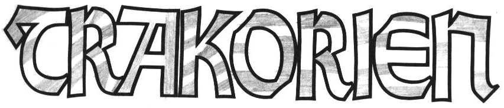
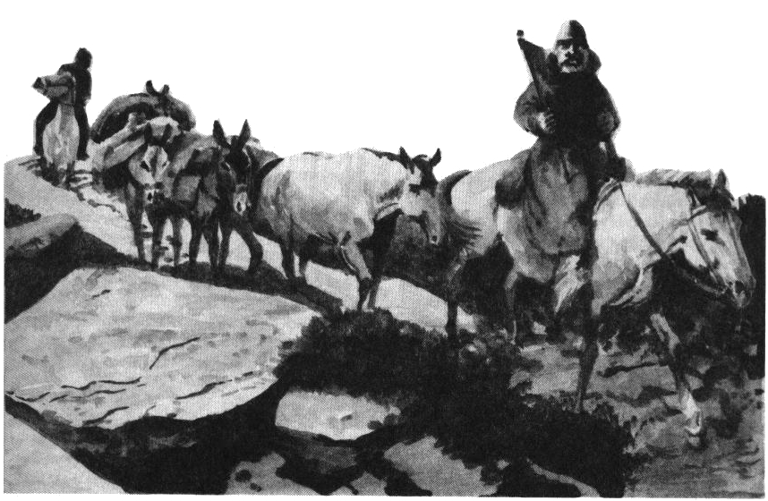
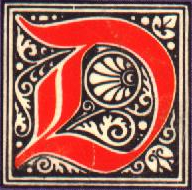
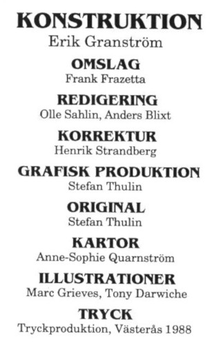

<title>Trakorien</title>

*en trakt som kallas Hiltre griper om tvenne berg. Vi seglade till en början nära det heliga berget Ranz som skjuter upp ur Malossisjöns borte vatten. Flera tempel skymtade längs sluttningarna, alla byggda i en mycket säregen trattform ut från berget. Klamender Gomba berättade att munkarna i dessa tempel tillhör Ranzinersekten. Ranzinerna tror att berget talar stora ord till dem, men så långsamt att ingen vanlig människa uppfattar vad stenen säger.*

Trakorien är en bok som beskriver landet Trakorien, dess invånare, traditioner, sedvänjor, djurliv och politik. Den består av två sektioner och en färgkarta över landets fyra öar.

Den första sektionen är en reseskildring och är avsedd för både spelare och spelledare. Där får man följa munken Brior på hans vandringar genom det märkliga landet.

Den andra sektionen innehåller artiklar om olika ämnen och ska endast läsas av spelledaren. Där kan man finna speldata över djurlivet, beskrivningar av det politiska systemet, handelsrutter, klimat och mycket annat. Beskrivningarna kompletteras med kartor och illustrationer.

# 00. Titelblad

## Erkännanden

**Konstruktion:** Erik Granström
**Kartor:** Ann-Sophie Qvarnström
**Illustrationer:** Marc Grieves, Tony Cronstam (Darwiche)
**Digitalisering:** Klas Lindberg

> ### För den historieintressarade
> 
> Titelbladets lista med erkännanden hade ursprungligen detta innehåll:
> 
> 
