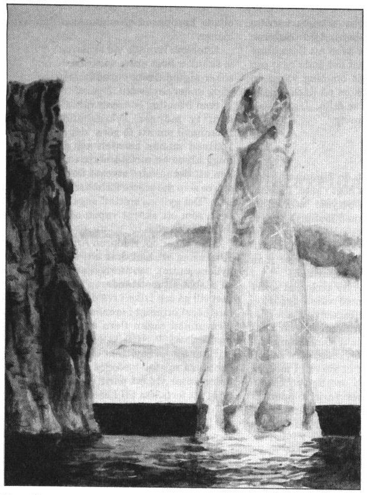
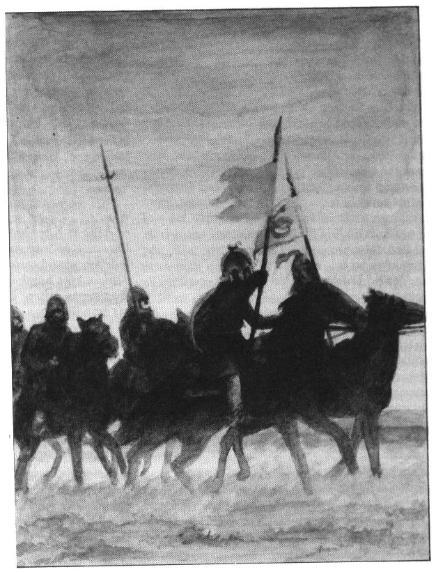
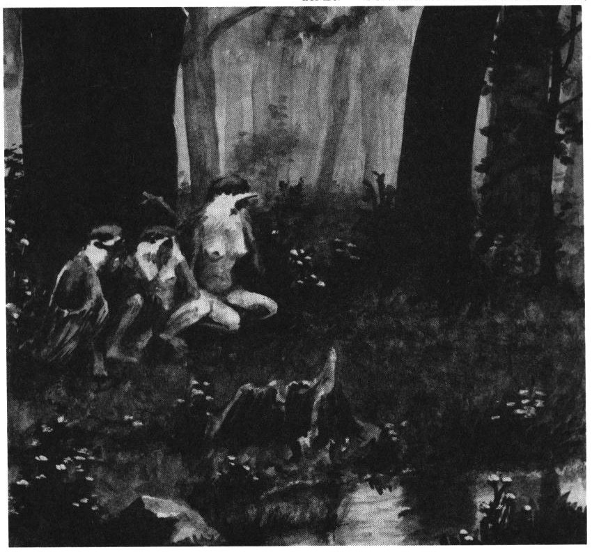
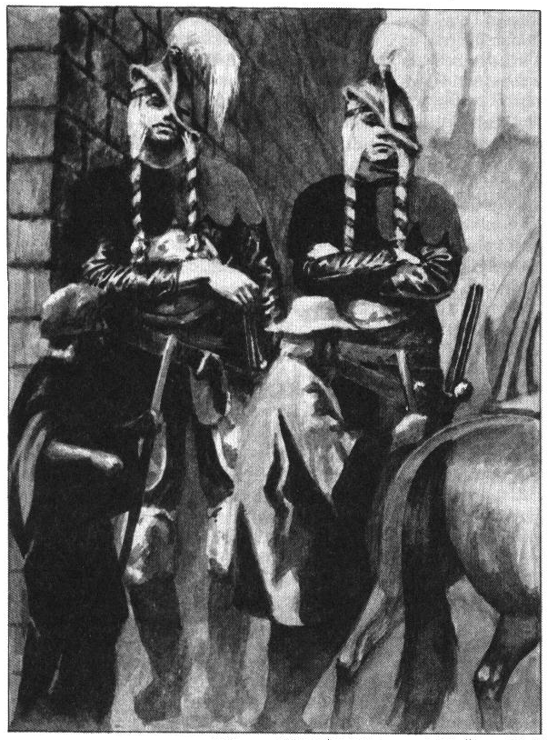
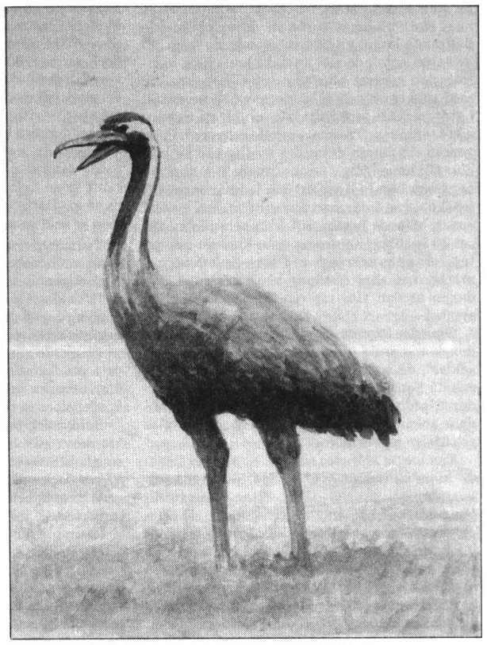
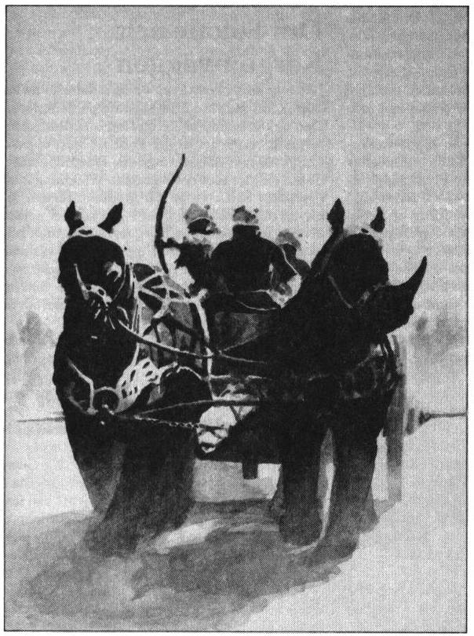
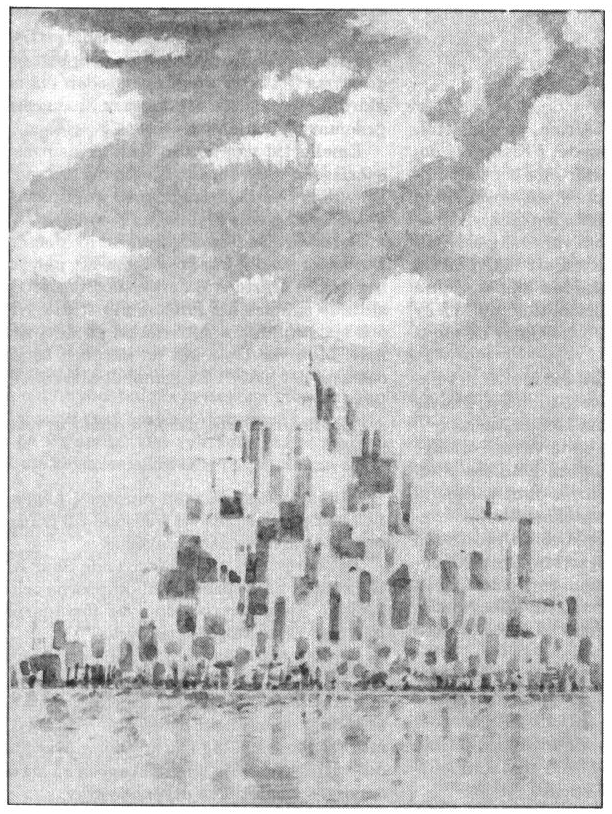

<title>Palamux - Trakorien</title>

# 04. Palamux

Då jag lämnade Saphyna, lämnade jag också friden och världens lugnsinnade människor bakom mig, ty befolkningen på de övriga trakoriska öarna har till temperamentet litet gemensamt med saphynierna. Under ett par dagar följde vi på betryggande avstånd Krindenlands östkust, innan vi korsade Marduks rännarbana, det stormpiskade och hårdströmmande sund som skiljer Saphyna från Palamux. I denna dödsskuggans kittel lutade vår farkost så skarpt åt styrbord att jag surrade knippen av flöten vid min kropp, övertygad om att vi skulle kapsejsa, och skapade med min jämmer omåttlig munterhet bland matroserna. De menade att sjön ingalunda var mer än lätt krusad, och att vi redan nästa dag skulle vandra genom glädjegränderna i Soblak, rikets enda stad på Palamux och den största i Trakorien näst Tricilve.

I detta var de emellertid misstagna.

På redden, då vi genom dimman redan kunde se stadens ljus, hejdade oss en hamnslup, vars kapten meddelade att vi ej kunde landstiga, då häftiga strider rasade i trakten. Ett uppror mot rikets primus prokurator, Urigallu Klusenveld Graam, härjade sedan tre dagar. Eftersom jag hållit Palamux för en hård, men dock fridens ö, syntes mig detta vara en stor händelse, men vår styrman suckade och berättade att sådana uppror inträffade mest varje år sedan skörden väl bärgats.

## Ziddisbar

Halvön Ziddisbar söder om Soblak befolkas av de ostyriga och stolta barboskerna som inte tål några herrar ens bland sina egna. Det berättas att barboskernas hövdingar i äldre tider brukade samlas till ting för att välja konung. Redan veckorna innan dessa möten utbyttes böner, löften och ultimatum mellan grannbygder, och många skärmytslingar utspelades för att övertyga om den egna hövdingens duglighet. Man möttes så under tre dagars oupphörligt hamrande på sköldarna, svärjande och tandagnisslande utan att kunna enas. Framåt eftermiddagen den tredje dagen hände det att någon valdes bara av tidsbrist och leda, men de förolämpade medtävlarna utmanade honom till envig i tur och ordning tills han förbrukades av ren utmattning.

Kungavalen upphörde med tiden och man samlades istället till ledarlöst storting, där månghanda beslutades, varpå alla for hem och handlade efter eget huvud. Tingsplatsen ligger en dagsritt söder om Soblak och nyttjas nu till kämpalekar under midsommarblotet.

Barboskerna i Ziddisbar är i grunden inget frihetstörstande folk. De nöjer sig med Paratorni styre, som ger god handel och ökat välstånd, men vill ändå markera sitt oberoende genom vapenskrammel med jämna mellanrum. Bara enstaka kämpar stupar i upproren, där legoknektarna beordras klä vapnen med garvat läder för att undvika sår. Under stridernas gång, samlas ofta kämpar från båda läger i kvällningen till dryckeslag på något värdshus i trakten. Så snart barboskern får en lagom klädsam skråma, återvänder han till sin hemby för att ägna vintern åt mjödsupa och skrytsamheter inför barn och kvinnfolk.

## Branyle Gannula

Som vi nu inte kunde besöka Soblak, fortsatte vi färden söderut och lade till först i Branyle Gannula nära Shamash-sektens heliga glasklippa. Barboskerna i detta område deltog ej i årets uppror eftersom stora leveranser av sten hade kontrakterats till Enkis tempel i Gudiena för skeppning innan vintern.

Den speciella Ziddisgraniten är vackert grönblå och mycket hållfast. Ändå är den lättarbetad då den självmant spricker i rätvinkliga block när man krossar den. Stenen är Ziddisbars främsta handelsvara och betalas högre ju starkare färgen lyser. Ibland stöter man på ådror av den dyrbara, självlysande månstenen, varom talas i *Svavelvinter*.

I Branyle Gannulas hamn imponerades jag av de många monumentalbyggnaderna, som dock visade sig vara stenupplag. Vidare förundrades jag över det stora antalet män, tills jag upptäckte att många faktiskt var skäggiga kvinnor. Dessa ludna skönheter är utan tvivel den främsta orsaken till barboskernas oblandade blodslinjer.

Till kroppen är båda kön av detta folk grova likt förvuxna dvärgar och huggna som landskapet i kantig sten. De talar med oviga tungor, men har gott huvud och lätt till skratt, vilket är en sällsynt egenskap på Palamux.

## Brosma

Eftersom vårt skepp låg i hamn över natten för att lossa viltskinn och spannmål, som skulle fraktas landvägen till uppköpare i Soblak när striderna lagt sig, lånade Baldyr och jag hästar för att besöka byn Brosma, där bergen är urhuggna som trappor.

Medan min reskamrat talte barndomsminnen i hövdingens enrum, bjöd mig hans männer delta i kämpalekar, vilket jag avböjde artigt men bestämt. Favoritlekarna heter knuckel och kväsa gumse.

Knuckel går så till, att deltagarna står mitt för varandra och slår sina knytnävar samman, varefter poäng gives för blånad, blodvite och benspräckning som tilldelats motståndaren. Kraften i slagen fick stockhuset att eka, men intet ljud fick yppas av spelarna, under straff att sänkas i tarvtunna med fötterna upp.

Kväsa gumse är en laglek, där kämparnas händer binds till ryggen. Det gäller nu att enbart med hjälp av sina huvuden fälla motståndarlaget till marken.

Leken stammar från den gamla seden att på lika villkor visa husdjur vem som bestämmer. En liknande lek, kallad ’bita hund’, leks mera sällan då den ofta ställer oreda i skäggflätorna, medan ’sparka häst’ fortfarande förekommer. Flera par järnskor hängde även på väggen i mina värdars stuga till detta ändamål.

Senare mot kvällen anställdes bänkalag med helkokt, syrad isterulk som genomgående rätt, till vilket serverades kål och källvatten.

Hövdingens yngsta dotter satt vid min sida och hade flätat sitt lingula skägg med röda band kvällen till ära. Hon inledde konversationen med att skalla mig över näsan så att jag såg stjärnor. Baldyr Brummare gratulerade till det oväntade beviset på uppskattning samtidigt som han hjälpte mig upp från golvet.

I fostrande syfte sökte jag under förrätten intressera bordsdamen för den vise Shukallitudas meditationer över metallernas musikalitet, men när hon för tredje gången ville spetsa min tumme på gaffeln, rann mitt sinne liksom soppan över mina kläder. Jag golvade henne med isterulkens bukben och återgick oberörd till ätande under tystnad.

Efter det tycktes vi vara så gott som trolovade.

Jag tvingades under natten barrikadera min sovkammare med ett stockbord för att freda mig. Som ni förstår lämnade jag följande dag Ziddisbar utan saknad genom en lumpen lönnflykt från Brosma. Den förälskade hövdingadottern dök upp på kajen just som vi la ut från Branyle Gannula, kastade sig med ett tjut i vattnet då hon såg mig på däck och simmade en dryg sjömil efter båten innan jag fick henne att vända om genom att slå sylvoleum i vattnet och hota med att tända på.

Samtidigt som hon vände sitt hundsim mot land, lovade hon vänta på mig, varför jag på stående däck beslutade att aldrig besöka denna trakt igen.

## Shamashs finger

Samma dag passerade vår kavarell för god vind shamashernas heliga glasklippa, om än på respektfullt avstånd. Den höga, gnistrande glaspelaren stiger ur havet utanför en lodrätt stupande kust, där små nischer huggits in i berget. Pilgrimer sänks ner i rep till dessa nischer, där de ensamma tillbringar flera veckor med att betrakta ljusets spel i kristallen. Då och då försvinner någon spårlöst ur sin nisch, vilket utlöser tacksägelseceremonier för att guden Shamash upptagit ännu en sökande bland de upplysta.

För en mindre upplyst förefaller det kanske mer sannolikt att den mediterande fallit ner i havet under natten, eller slukats av någon flygande best som i klippans nischer har ett pålitligt och välordnat skafferi, men sådana åsikter bör knappast yppas på Palamux, där man tar sin tro på stort allvar.

Glaspelaren omnämns av de troende som Shamashs finger, men kallas av hedningar för något mer onämnbart.

## Kopparbergen

På vår seglats rundade vi härnäst Ziddisbars sydspets, ett berg namnat Panzarklacken. Härifrån sträcker sig Kopparbergen norrut längs halvöns hela västkust med toppar på över fyratusen meter.

Bergen hyser ett dvärgrike, ett svårmodigt, tillbakadraget folk som utan ansträngning motstått alla erövringsförsök. Dvärgarna handlar med människor, men enbart vid en handelsstation byggd i en djup ravin på deras område, tre dagars färd med oxkärra från Soblak. Vägen till ravinen kan lätt övervakas av spejare, och fastän den är välbyggd rymmer den inga härskaror.

Orsaken till dvärgarnas försiktighet är att de kom till Palamux som slavar for att bruka koppar åt det heliga Kishatet. De flydde snart bland de otillgängliga bergen, och har under tvåhundra år byggt upp sitt rike. Till en början rådde öppen fientlighet med människorna, men nu förekommer viss kopparhandel.

Det är känt att inkräktare i bergen avvisas tämligen brutalt, och shamashpräster har bevisligen försvunnit även på senare tid.

## Thimassergapet

Från Panzarklacken tog vår styrman kurs efter stjärnan Gargule mot Bhannavil på andra sidan Thimassergapet — ”Den bottenlösa bukten” — som av sjöfarare påstås vara en port ner mot det oändliga salthavet Tiamat på vilket världsskivan flyter.

På öppet hav blev vi till allas fasa kappseglade av ett piratskepp med blodfläckade segel. Sådana uslingar har i alla tider gömt sina hamnar i Kopparbergens västfjordar där de sitter säkra som lusen i armhålan. Vi räddades bara av Baldyr Brummares påhittighet och kännedom om piraternas vidskepelse. Den gode mannen rakade sitt huvud till de fem tofsarnas fason, svepte sig i segelduk och begynte yla som en Remuntradyrkare så snart kaparen kom inom hörhåll. Han bjöd dem stiga ombord för att få kyssa deras nio körtlar och tillsammans med dem bilda den stora knuten. Detta fick piraterna att omedelbart byta bog och segla bort under frenetisk rening av skeppsdäcket med svingalla.

Jag föll min vän om halsen under häftiga tacksägelser, men han syntes märkbart irriterad och bad att snarast bli befriad från de vämjeliga tofsarna. Jag märkte även att flera äldre sjöbussar gjorde tecknet mot det onda ögat och drog sig undan, muttrande om ting värre än döden. En hink svingalla kom på däck medan Baldyr såg sina sista lockar falla. Jag förstod blott senare denna misstämning.

## Bhannavil

Vi seglade nu vidare mot ön Bhannavil där stridsguden Trocuspa hålls högt i säte. I hamnstaden S’rid be Ghile, det betyder ”staden på den violetta sanden” sagt med laabnisk tunga, finns öarnas äldsta tempelområde till stridskonstens ära. Templet är den enda plats förutom Clusta Noba på östra Marjura, där man undervisar i den ursprungliga banzikan.

Banzikan lär inte, som nyare skolor, ut serier av konstfärdigt viftande med vassa eggar, ej heller knipövningar för fältmanövrer eller läsande av terrängens kurvor. Man strävar blott efter att finna ett; den absoluta sinnesstämningen. Enligt den paratorniske yxmästaren Lugal-Fusca, har banzikan spelat ut sin roll i modern krigföring då den är alltför orörlig och opraktisk, men fortfarande söker varje kondottiär rådgivare från Bhannavil till sina fälttåg, medan Lugal-Fusca såvitt känt hittills bara tillfrågats om gladiatorstrider och parader i Tricilve.

Det berättas om den tappre Baskimer Brushane, som tillfångtogs i det legendariska fälttåget mot Laabnes grå eminenser, att han skulle avrättas på Voag Aspedes murar inför ögonen på den belägrande hären. Sedan yxbladet studsat tre gånger mot hans tjurnacke bad han själv att få slipa eggen vilket tilläts honom. Han lade sig därefter på rygg i stupstocken för att kunna instruera bödeln till bättre ansats, ty som han sade: ”Ett illa utfört värv är mig en styggelse värre än döden”. Då yxan åter svingades drog sig Baskimer påpassligt undan, men sådan var nu vapnets skärpa att det genomklöv ej blott stupstock, utan tillika ett gott stycke av muren så att denna rämnade, varpå hären strömmade in i staden och erövrade den utan strid.

Sådan sinnesnärvaro skänker blott banzikan.

Nu undervisar man på Bhannavil förvisso även i annan stridskonst som synes mig mer användbar för vanligt folk. Tempelfältet, kallat ”det skriande gräsets Kisalmakhu”, ljuder dag som natt av klingornas musik. Då mörkret faller tänds stora furvedseldar där de nakna och oljade kropparna glimmar som dansande demoner.

Eftersom lärande vid skolorna i S’rid be Ghile skänker högt anseende och god sold i pungen söker sig de flesta ansedda krigare hit någon gång under sin livstid.

Som främling bör man vakta sin tunga i staden, ty mången svärdshand drömmer på Bhannavil om att få göra ”det gyllene snittet”. Därmed menas konsten att genom ett enda hugg klyva en motståndare i två sådana stycken att det mindre stycket förhåller sig till det större som det större förhåller sig till hela kroppen. ”Det gyllene snittet” sägs kräva såväl goda ögon som ett skarpt vapen och lösköttat offer av måttsam vikt.

Man säger om riddaren Arn Dunkelbrink da Kharasme att han drar sitt svärd, utdelar det gyllene snittet, och återbördar vapnet till skidan så snabbt att motståndaren inget märker förrän han vill gå och faller i två delar. Sådant tal faller mig högst orimligt i öronen, men då riddaren är försvunnen sedan flera år kan det knappast motbevisas.

Efter att ha bevittnat trenne goda tornerspel och nära mistat huvudet genom en oförsiktig kommentar vid ett parti smickelbräde, var jag ivrig att fortsätta till Lasemos på fastlandet för att där bevista de laabniska ruinstäder om vilka jag läst månget i Dëamon Psuggus’ skrift: ”Palamoxi äggamark — varur klack vårt rike”.

Blott klenskrovade galärer fanns att tillgå, då eken betraktas som helig i dessa trakter, men vår överfart var lyckosam i stilla väder till fridsam låt av slavårans sång. I skymningen då vi rodde ut, blommade vattnet av mareldens månghanda färger, av vilka staden S’rid be Ghile fått sitt namn.

På galären lönnhörde jag en lasemosisk gumma sjunga till sitt trilskande barn, och nedpräntade hennes ramsa i minnet då den syntes mig väl spegla palamoxisk fostran. Jag vill återge den på troget folkmål som bäst gör den rättvisa:

### Vaggvisa från Lasemos

Stille mi lilla
å slute å spilla
di tårer som trilla på kjolera mi för dä tåler ja dålit.
Å gir ja de anners
te upprare bärgen
mä anleter vite i färgen
å kniver som klor där di bor
i Bäktar dän fula i enslia kula
te elaken lunpräst.¹
För si sover du gliset
å skrier nå mer sömma griset
ve blotet, så tar han fäl skotet frå midja
snor de åck flinkt kring di hals
Sen bär de vägåt, vila ej alls.
Dä förste du sir
när ni far ä en bir²
mä en gap som ä glupt³
å de glapprer han öm dina tår som han tar
om du inta ä rar nu å somner mäsamma
när prästa å du lilla far över kullarna
bort ifrå mamma.
Kommer i sänna,
rider gör lunprästan, du får fäl ränna,
te träna i skogen
där knäna vill vitne frå blogen
å skake på krake du lilla du unge
som inta vill blunge⁴
å trollena vistar⁵ å väser
å ristar å fräser
i krypta å kista
män misstar se gör man på dätta no ej.
Å sän får du krype
som krävvek⁶ å lype⁷ i bärga
å prästpuken värja
din snok emot otyg som härja
män nej si de gör han no näppe
män love å so ve så inte ja gåve
di villigert opp te dän sluken.
Å här finns vulkaner å gruvla titaner
som rycker av armar
å stickar av tarmarna dina
så nätta små hoser åt ongera sina.
Kommer i sänna te sanden å hettan
Oppå dän slätt
ska du stekas på spett
Eldar ska brinna
men köttet de stinna
ska stanna där stänna⁸
ä bränna frå bena te kol å te kala
di bena ä skala.
Dätta ska hänna i Bäktar dän fula
i ensliga kula
om inta du somner mäsamma i kväll
Var nu snäll
ellerst dänger ja huve ditt hårt emot bärg å i häll.

För intresserade vill jag nämna att berget Bektar i visan verkligen hägrar bortom vildlandet Klagga. Det omtalas just som en plats där de onda måndyrkarna offrade barn till mörkrets makter i de grå eminensernas tid. Jag rekommenderar ingen att resa dit.

*¹Måndyrkare*
*²Björn*
*³Hungrigt*
*⁴Blunda*
*⁵Skrattar tyst och elakt*
*⁶Kräfta*
*⁷Lus*
*⁸Ständigt*

## Maravelda

Lasemos är inte som många tror ett enhetligt lydrike, utan består av ett halvdussin furstendömen, vars härskande familjer alla är släkt via slugmenta giften. Detta hindrar dem inte från att ständigt ligga i fejd med varandra.

Baldyr och jag fick vada sista biten in till Maravelda eftersom ebben dränerat musselbankarna så att den unge styrmannen blev osäker om sjörösen, vände portolanen upp och ner och ställde oss på grund, varvid slavarnas skratt trängde upp ur galärens inre. Redan då jag vred ur mina hosor på stranden beklämdes jag över stadens torftighet. Enligt Dëamon Psuggus låg det Trakoriska rikets vagga i Lasemos, fastän Tasenbar Örtkänne hävdar annorlunda. Från den gamla laabniska kulturen ska klavykiska stammar ha befolkat Ziddisbar, Moskorien och den då grönskande Fokalerslätten. Därifrån ska de ha seglat vidare mot Stegos, Paratorna och Trinsmyra. Av anfaderlig storhet syntes dock intet. Vid åsynen av de fattiga hjonen, rucklen och magerkräken mindes jag blott shamashernas föga muntrande devis: ”Världen är ynk och eländes elände!”

Förr än vi vandrade inåtlands, avlade jag ett besök vid stadens uråldriga akademi, där jag till min glädje fann en sinnenas höghet jag knappast träffat vare sig förr eller senare. Visserligen var även de lärda männen och kvinnorna påvert klädda, men deras lärdom lyste klar som platinerbleck. Vi tillbringade natten under samtal om rytmernas kontrapunktik och det psinolytiska mättnadsteoremet. Under svinets timme, när månen redan stod högt, tog mig Sabarga, Trakoriens främsta astromatissa, vid handen och lät mig för ett ögonblick betrakta den gamle Shukallitudas fårade gestalt, där han stod orörlig i atriumgårdens pelargång. Jag är henne innerligt tacksam för denna ynnest, och betraktar fortfarande det ögonblicket som höjdpunkten på min resa.

## Lasemos

Om Lasemos i övrigt är blott föga att orda. Min tanke är att Paratornas råd i vishet låtit detta land självhärska, emedan furstarna har nog att göra av inbördes strider, och således saknar kraft till enhet gentemot rikets makt. I sanning tär dock detta dyrköpta riddarvälde på enkelt folk, vars skördar ständigt uppsnappas, eller nedrides under hetsiga viltjakter. Baldyr och jag tvingades fler än en gång av vägen då herrarnes följen nalkades i stor prakt.

Det hände att råa knektar i deras garde genomrotade våra fattiga ägodelar på jakt efter plundergods. Till gömnad tvingades Baldyr därför dölja våra fåtaliga silverstycken i sin orena utgång, så att de knappast togs av krämarna som betalning.

Landets brukande av jorden är gammelkunnigt. Man nyttjar allmänt den raka årdern, detta trots att jordvändarplogen är känd sedan en mansålder på Saphyna. Ej heller males kornet i vindkvarn, fastän vädret är utmärkt till ändamålet. Till skäl sades mig blott flatord som att ”barnet bäst går i faders spår”. Man menade även att om Shamash velat vända jord med årdern, hade han skapat den sådan.

## Kharasma

Först då vi närmade oss borgen Kharasma, nordhavets pansarlås och släkten Dunkelbrinks arvegods invid bergen nedom vildlandet Klagga, mötte oss åter en mer framsynt nejd. Man stoltserar här med en högdriven läderkonst i sadlar, rustningar och skodon. Vi slog följe med en grupp garvarlärlingar som på åsnerygg och egna huvuden bar en gorgonerbörda råhudar ut mot askdalarna i väst, mot legendernas Laabne, dit min tanke nu drogs som vind drar segel.

## Laabne

Laabnes askdalar skapades av de grå eminenserna när de sög livet från en tidigare skön trakt så att deras palats i Voag Aspede skulle blomstra i övervärldslig prakt. Först när gråheten även kröp över Lasemosi gräns samlades en här under Baskimer Brushane mot de fruktade magikerna.

Men ej genom vapenmakt, utan av de få hjältarnas dåd, befriades Trakorien från de grå eminensernas livstörst. Från denna tid stammar det väl förståeliga bann man i Lasemos lagt på all magi.

I Laabnes tysta land, vadar man fotsdjupt i aska. Den virvlar kvävande genom strupen, men ingen vind rör stoftet som snart faller dött till marken igen. Här och var i asköknen finns syrasjöar, vars stickande ångor fick mina ögon att tåras då vi nalkades dem. I dessa frätande gölar plägar garvarna härda sina skinn, men så otrevlig är denna syssla att den alltid överlåts åt gesäller. Den övervakande mästern slog på gott avstånd upp sitt soltält och lät en slav förmedla hut och anvisningar åt de svärande ynglingarna vid syrastranden.

Laabnes lockelse var mig vid denna tidpunkt storligen dämpad, men till trots mot Baldyrs illflin (sinnets förfining är honom obekant, han tänker blott på klingande trakiner, mjukhullat kvinnkött och flottig spis) ville jag ändå söka nå Voag Aspede, vars ruiner hägrade mot bergen. Jag besteg alltså en klippa for bättre syn, men överraskade därvid en solsökande syrödla, vars frätande salivstråle träffade mig över benet. Vi rusade var åt sitt, men jag skriade högt av fruktan då dess frätande loska väl kunde kosta min vandringsförmåga. Nu var det så lyckosamt att garvarmästern medförde slemmad lut och örtbalsam mot syrningsskador, så att såren kunde minskas förrän de uppstod.

## Sägner bortom Laabne

Dock erbjöds jag några dagars vila hos den gode hantverkaren, varför jag ärofullt kunde ge upp tanken på vidare äventyr i Laabne. Garvarens broder, pälsjägare till yrket, stillade min nyfikenhet rörande landen bortom askslätten. Han förtalte att en tät och frisk skog bidar bortom ruinerna i Voag Aspede, där gott byte kan nedläggas. Man aktar blott för jakt nära bergspassen mot Klagga vilka hemsökes av såväl troll som vilddjur. Vidare undviker jägare de laabniska ruinerna, ty gengångare sägs vandra bland öde gator. Närmare kusten fortsätter askfälten in bland klippor dit vissa onämnbara sekter säges ha tagit sin tillflykt, men längst ute på Palamoxi västspets finns ett vackert hedlandskap kallat ”vindens ängar”.

Från denna punkt ska Klastobrest Dimvett, saphyniern som först av alla predikade guden Remuntras lära, året 350 e.O. ha seglat mot drömmens kuster med halva Palamoxi flotthär i följe. Från denna resa återvände som bekant ej så mycket som en jolle.

Det tvistas ännu om flotthärens öde, men jag anser det troligast att den fallit över världsskivans rand och kanhända faller än. Sjöfart rakt väster om Palamux förekommer hur som helst knappast i vår dag. Ferrofagernas fruktade arkipelag, vars rovgiriga klippor drar till sig metaller som stryparrankan fångar det betande kidet, gör färden alltför vådlig.

Och där bortom ligger blott svarta strömmar och okändhet.

Av Klastobrest Dimvetts öde stammar den fruktan och den respekt gentemot guden Remuntras lära som kan förmärkas Trakorien över.

Remuntradyrkare kamperar än i denna dag på vindens ängar där de dansar jubeldanser till gudens ära. Dyrkarna vill påskina att Klastobrest mötte döden med ”en sång och ett skratt”, till vilket de tillfogar ett olidligt ”tra la la”. Så lite är livet värt för dessa galningar.

Vindens ängar hemsöks dessbättre ofta av raugoner, så att dyrkarna sällan blir gamla på denna plats, men ej heller detta tycks bekymra dem. Hur någon kan låta sig genomkrälas av raugonerlarver med en sång och ett skratt är mig en gåta, men som den vise Shukallituda fogar till sin essä ”Shukallitudas betraktelser vid en varm skål coffa”, så blir var man salig på sitt.

Tra la la.

Emedan pälsjägarens berättande gav mig stort utbyte, plågade mig hans kroppsliga närhet, detta som lasemosernas stapelföda utgörs av lök i olika former. Då jag försynt påpekade detta faktum blev han gramse och upphörde i sitt tal. Kort därpå avreste en handelskaravan mot Moskorien, varför vi bröt upp mot nya äventyr.

## Oorams skog

Vi passerade de ömkliga furstestaterna Sampra och Krild, innan vi omsider beträdde Oorams skog. Såväl svartfolk som annat otyg spiller över bergen mot Klagga in i dessa glest folkade skogar, så att man bör färdas blott i väpnad trupp. Skogsbyggarna i trakten har viss hjälp av fågelmän, som varnar för rörelser i passen om de får någon enkel metallsak i gengåva. Fågelmännen är dock flyktiga och skygga, och tjänar illa som pålitliga vakter.

## Gwondel Leigû

Färjeläget över floden Tramenze ligger tryggt på en ö mitt i strömmen, och vi firade där den sista kastanjens fall med en dags vila innan vi fortsatte in i Gwondel Leigûs dunkel. Dessa ekskogar är hemvist för alvfolk av olika släkt, och det är ej rådligt att vandra utom synhåll från landsvägen. För män med frid i hjärtat, sådana som jag själv, är skogens musik och åldriga grönska en fröjd för alla sinnen, men många i vårt resesällskap bligade nervöst mot trädkronorna som efter rövare och käringgamar. Knektarna bättrade efter förmåga på denna fruktan genom bloddrypande berättelser om vilseledda vandrare och rövade barn. En viss Rutvald Skrummert ska ha trätt fram i Urma efter hundra års sömn, skänkt av bågskjutande fjärilsmänniskor i älvkungens tjänst. Där talades även om lockande nakna nymfer, men sådan dreglande svada hörs förvisso alltid i kaserner och drängastugor eller eljest där svultna männer samlas.

Vårt följe mötte blott några tiggande fågelflickor som skänktes ett par mynt och därpå lyfte under ljudligt klapprande med sina näbbar. Vidare fann vi en morgon att några packpåsar försvunnit, men vi återfann dem upphängda i spindelvävar på en död gren. Då en yngling klättrade efter dem, brast grenen och vi tycktes höra ljusa skratt då han föll i backen, men därutöver intet.

I skogarna låg stundom ett mjukt regn på västvinden, men torkan blev större sedan vi övervandrat högslätten mellan de Gråtande bergen och Kopparbergens nordligaste utlöpare, där jättar sägs leva.

## Högpasset mot Moskorien

I passets bortre del, mot staden Urma, vaktar en mur med befästningstorn den Moskoriska högslätten mot inkräktare från Klagga och Gwondel Leigû. Då vi närmades en av dess portar tog jag nära till flykten, ty ett par krigare av två och halvannan meters längd steg emot oss i full stridsmundering. De tilltalade oss dock på behaglig muskari, den dialekt man plägar nyttja i dessa trakter, och förklarade sig nödgade att genomsöka våra handelsbalar. Deras anleten var hårda, men fagra och det slog mig att detta var kämpar av det beryktade tolgulderfolket om vilket jag läst i Lususces ”Resbok för öarnes Hieltar”.

En av storkrigarna erbjöd sig vänligen påkalla läkare, ty mina lemmar skalv ännu i fruktan, vilket varelsen tolkade som träskfrossa. I min enfald hade jag tagit dem för troll, och då jag förklarade detta, nickade tolgulden bistert men lät sig därmed tystas. Därpå slet han upp våra pckningar så våldsamt att persedlarna yrde åt alla håll, tydligen på jakt efter förbjudna, synvrängande droger.

I Baldyrs ägo fanns två små glasspeglar, vilka han plägade fasta från öronen till lockelse av kvinnfolk. Dessa höll tolguldern genast i beslag och förklarade allt speglande eller eljest avbildande som bannlyst av själve Shar Kishatin i Albarunzia.

Då Baldyr sökte besticka honom en silverdecaur för speglarnas frid, tog krigaren visserligen emot myntet, men kastade det sedan ut i buskarna. Han uppmanade oss att noga vakta såväl ryggskinn som tunga i fortsättningen, sade sig dock ej vara någon småfolkets bödel, varpå han lämnade oss.

Baldyr grämdes svårt över förlusten av speglarna, då deras lockelsekraft vore femdubblad i detta stränga land, men förklarade slugsmilat att han hade ytterligare ett par ”på säkert ställe”.

Jag lärde sedemera om dessa tolgulder att de är fruktansvärda krigare, men egensinniga och känsliga för stängda rum, skepp och stora eldar.

## Urma

Staden Urma är byggd i luckra kvarter för att passa stadens tolgulder. Den har till namnet eget styre, men är nära allierad med det heliga Kishatet. Dess rikedom är avsevärd, och kommer av hantverk i trä, järn och sten. På ingen annan plats i Trakorien har jag sett så goda kärror, pelarfötter och jordredskap säljas till så låga priser. Man prutar dock aldrig i denna trakt, vilket jag bittert fick erfara. Någon fattigdom syntes ej förekomma, men heller ej någon pösande prakt.

Enstaka skogsalver från Gwondel Leigû kan stundom besöka Urma, men stannar ogärna, då djuriske halvfolk bemöts med misstro och har lågt anseende i alla Kishatets domäner. I synnerhet gäller detta dvärgar.

Vi lärde i Urma att Shamashs kärlek till påbud är gränslös, ty om nära nog varje företeelse har hans präster, vars ord är lag, något att anföra.

Exempelvis gäller enligt matsalarnas plakat följande:

* Till skaffning må blott omörat kött av gammal oxe nyttjas, ty så säger SHAMASH: ’Segt kött ger munnen syssla, men mindre pladder bland ätande’.
* Förrän vin kommer till bords skall det spädas fyrfaldigt, ty så säger SHAMASH: ’Rus är trons träskfly’.
* Då föda tillföres krydda, skall lika mängder torkad galla ock tillföras, ty så säger SHAMASH: ’Föda skall vattnas av ögats tårar, ty i människans inre skall den ömkligen förruttna, och dess välsmak är blott vind och förbländelse, folkets tungor till förledelse’.
* Av skaffning må ej sådan mängd givas att mage mättas, ty så säger SHAMASH: ’Mättnad är blott vind och förbländelse, ty den mätta magen är i morgon åter hungrig, men salig är den ständigt hungrande, ty han känner det bestående’.

Listan kunde lätt göras längre, men man blir ej muntrare av detta.

Det är i Urma endast tillåtet att sova i gemensam sal om minst tjugo personers bäddmängd, varvid vakt ska utsättas. Sömn skall ske på brädgolv eller hårdstampad lera med filt av högst två korns vävtjocknad som underlägg. I Shamashs ögon är drömmarnas skenbilder av stor ondo, och man vill på detta sätt undvika den alltför tunga vilan.

Vår sista natt i tempelhärbärgets sovsal trilskades min mage av förbittring över det magra kosthåll den tvingades utstå. Jag kastade mig av och an så att salsväktaren ideligen ruskade mig vaken för att frälsa mig från häftigt drömmande.

Då morgonen kom vandrade Baldyr och jag därför med långa kliv åt nordost för att lämna Kishatets domäner.

## Bosper Gmilje

Vi sökte natthärbärge i en by vid namn Bospernyndahg Gmiljendano Gavacaso, vilket utsäges: Bosper Gmilje. Där stötte vi av en slump på en underjordisk sekt, vars medlemmar dyrkar måttlöshetens gud Uelgeric genom vilda nattliga orgier. Orgierna inleds genom att en bassäng, i vars botten man lagt ett tjockt lager dunbolstrar, till bredden fylls med omsorgsfullt tillagade läckerheter och pärlande drycker. På ett givet tecken sliter män som kvinnor av sig sina kläder och kastar sig ut i bassängen för att som fluglarver kräla runt bland de flottiga anrättningarna tills morgonen gryr. Stundom rusar någon ut i extas för att i karaktäristisk, framåtlutad böneställning, dyrka guden genom uppkastande av mat med ett högljutt ”Uelgeric!”

## Moskoriens tidiga historia

Vi kom så ner på den Moskoriska lerslätten, vars brist på metaller, sten och trä, gör att långa handelskaravaner ständigt ringlar längs de många kanaler som genomkorsar landskapet.

För att rätt förstå moskorierna, vars högkultur under flera århundraden dominerade Trakorien, måste man känna något av historien.

Som tidigare nämnts befolkades slätten i åldriga tider av klavykerstammar från Lasemos. I dessa dagar var slätten omåttligt bördig. Kanaler spred floden Gushars vatten ut över jorden så att den blomstrade utan like. På den varma Fokalerslätten byggde stormän jaktslott, och trädgårdar anlades där fruktträd gav tredubbel skörd.

Med sådant överflöd kunde klavykerna ägna mycken tid åt sitt tänkande och sitt hantverk, så att en högkultur stod fram på slätten mellan Yoh och Albarunzia.

De primitiva jägarfolk, som tidigare varit ensamma herrar på låglandet, förstod inget av bevattningskonst, och eftersom bara lite regn tog sig över bergen i syd och väst, hade den bördiga jorden ändå bara givit dem magra skördar.

Då jägarna nu såg hur klavykerna frodades, blev de gramse och ville ha sin jord tillbaka. Många krig utkämpades i dessa dagar mellan folken. På nomadernas sida anslöt sig omsider furstar från bergstrakterna i Nastrôl och det vilda Kargom, ty ej heller de kunde tåla rikedom annat än i egen kista. Bergsfurstarna var av mörkt sinne och drog sig inte för att använda såväl svartfolk som dödgångare i sina härar, men klavykerna motstod dem, då de var uppfyllda av Trocuspas banzika, så att trupperna följde sina ledare som dresserade drakar.

I kriget slöts en bestående allians med tolgulderna, och dessa jättemän har sedan den tiden levt i vänskap med folket på slätten.

I sammanhanget bör även ordas om de vita tapirerna.

Det berättas om klavykernas tredje kejsare Naramsi, att hans här hade ställts mot Iarlagab Vargätarens tusenhundvagnar, men med Kackelaträsken i ryggen så att döden syntes vara ett säkert öde. Man gav kejsaren rådet att gå till motangrepp på det att slutet månde bli skönt och värdigt en sång. Men Naramsi höjde i vånda sina händer för att åkalla hjälp från Trocuspa som dittills stått honom bi. Knappt hade hans röst förklingat förrän en vit tapir höjde sin dallrande kropp ur gölarna, vandrade fram till kejsaren och lade sitt huvud i hans knä, varifrån den sorgset blickade upp i hans ansikte med sina troskyldiga, bruna ögon. Naramsi föll i gråt, strödde jord i sitt hår och klöste sitt ansikte, eftersom Trocuspa gjorde narr av honom genom att sända detta det fredligaste av alla djur till hans hjälp i farans stund. Men tapiren tog hans hand i snabeln och ledde honom till träskets rand där en vältrande massa av vitt späck hälsade honom till trumpetande av tusende snablar. Kejsarens män klev nu upp på tapirernas ryggar och red bort genom sumpmarken på sina tretåade vänner. Sedan den dagen är den vita tapiren Moskoriens heliga symbol.

Omsider lägrade sig ett lugn över slätten och den kommande tiden kallas ofta ”Kristallens sekler”, då storhet i tanke präglade Palamux, och då Fontra Cilor fick sitt namn, vilket betyder ”Nordhavets låga”. Under denna tid grundade kolonister städerna Siola, Skuger, Zaroflas och Melse på Paratorna.

Emellertid åldrades slätten. År efter år flödade kanalvatten ut över jorden, dunstade och kvarlämnade sitt salt, så att sältan ständigt tilltog och träden så småningom började dö. Floderna Gushar och Quafacha slammades igen långa delar av året så att Laak Lakrima växte och blev ett dött salthav. Idag är Fokalerslätten och Moskorien mest öken och minnen, men folket minns sina trädgårdar och gråter, och deras gråt saltar jorden.

## Famarulh

Baldyr och jag nalkades staden Famarulh vid Gushars magra nordarm efter en dags vandring från Bosper Gmilje. Redan i gamla tider byggde man här en fördämning för att behärska städerna nedströms. Om dessa städer trilskades i sin lojalitet, kunde man hejda vattnets flöde så länge att deras vallgravar torrlades och arméer kunde inta dem. Hiatus Neffro, ”den galne milacken”, ska även ha sänkt burar med döda pestoffer i floden för att sprida smitta nedströms och så kväsa allt motstånd, men smittan fördes med handelsmän tillbaka till Famarulh så att hela landet led stort manfall.

Famarulh omges av starka befästningsverk och är känt för goda vapensmeder och rustmakare. Vi ämnade oss in genom Tapirporten, men en stor folkmassa blockerade vägen. Man beskådade en duell där en av stadens gardeskaptener mötte en ädling från Kark. Vi trängde oss nyfiket fram till själva striden. Duellen var dock en besvikelse eftersom gardeskaptenen var en ojämförligt bättre fäktare som lätt avvärjde ynglingens hätska inrusningar, och med spetsen av sitt vapen plockade detaljer ur den andres dyrbara klädsel.

Kaptenen använde en klassisk moskorisk pata, det raka och smala duellsvärdet, vars skaft är en hylsa som spänns fast över svärdshanden. Detta svärd kräver mycken träning, men är snabbt och exakt på en mästares hand.

Trinsmyriern befriades snart från sin konventionella sabel och blev sittande på marken, hypnotiserad av patans spets.

”Ur elden i askan”, mälde segraren nöjt, varvid ynglingen hastigt grep en näve jord som han strödde över sig.

Vi sporde varom duellen utkämpats, och fick veta att främlingen sökt träda in i Famarulh utan att aska sina kläder och sitt hår till respekt för den döde hertigen.

Baldyr och jag genmälde med enad stämma att detta var höjden av ohövlighet, men besneglade diskret varandras kläder och ansikten. Vi var dock solkigare än de flesta andra av vägens damm, och skred allvarliga in genom Tapirporten.

I sanning fann vi Famarulh en sörjande stad och förstod att hertigen varit en måttlöst älskad person. Vita tyger prydde fasaderna på alla byggnader. Många stadsbor hade även blekt sina ansikten sorgevita och skred fram i processioner tillsammans med yrkeskunniga gråtare, pukenerare, förtvivlerskor och självpiskare. Från stadens många torn ylades klagosånger ut för att besvaras av hundar och barn i gathörnen.

De flesta värdshus låg öde, men vi lyckades få ett icke oävet gravöl på tavernan ”Thet bruustna hierthat”, där vi var ensamma kunder.

Vi frågade när hertigens begravning skulle stånda, på det att vi månde betyga honom vår heder.

Då värden svarade att hertigen varit död i femton år, fick Baldyr ett plötsligt skrattanfall som inte stod att hejda. Krögaren fick något vilt i blicken och stängde skyndsamt port och fönsterluckor. Han berättade att en gycklare från Krindenmaar så sent som förra månaden hängts upp i tungan för en enkel ordleks skull, och att vi måste lämna Famarulh fortast möjligt. Såvida vår skrattlust var ohejdbar, kunde han, mot en mindre gengåva, leda oss till en grupp Uelgeric-dyrkare.

Vi var emellertid mätta på dylika orgier och bad endast om sovplats för natten, vilket han inte vågade neka oss.

Dagen efter vandrade vi mot Fontra Cilor.

## Moskorien

I morgontimman gnistrade slättens frostnupna tistlar som av silver. Vi var vid gott mod och utbytte skämtsamheter såsom:

”Vad skiljer väl palamoxiern från det döda trädet? Palamoxiern knarrar även i stiltje!”

Emellertid blev middagstimman mindre munter när vi tvingades gömma oss för två jagande rovtranor i en halvt sammanfallen ruin. Dessa glupska löpfåglar är nära tre meter höga och kan på några ögonblick slita en människa i stycken med sina kraftiga kroknäbbar. Rovtranan är inte ursprunglig på Palamux, utan har förvildats från de tio stridstränade exemplar som shamanfurstinnan av Melukha skänkte länsherren Karkeste da Sobelasti efter ”de heliga svanarnas seglats”, när en klavykisk flotta räddade tusentals melukhier från den sjunkande ön Kymm.

Fortfarande använder Palamoxi rikshär mindre grupper av så nämnda "rovryttare” i räder mot svartfolk, men tranorna är lynniga och har mer än en gång dödat sina förare i stridens hetta.

Hela eftermiddagen vandrade bestarna som tuppar runt ett maskbo och krafsade ilsket mot tegelmurarna. Dessa motstod dock angreppen, för vilket jag gärna tänder ett rökelsekar till byggherrens minne. Först mot kvällningen skrämdes rovtranorna på flykten av ett dovt mullrande ljud, och vi steg darrande fram för att hinna beskåda en avdelning tunga stridsvagnar dåna förbi på vägen mot Fontra Cilor.

Jag har aldrig sett ett verkligt fältslag med dessa vagnar, men väl en uppvisningsstrid på Paratorna, och jag kan svårligen tänka mig något som står dem mot på plana slätten. Som dragare nyttjas den sexbenta stäpphörningen, en bepansrad best på närmare tolvhundra kilo, vars kropp enligt seden bemålas med magiska kraftsymboler i skrikande färger. Vagnen förses i strid med utskjutande klingor och spetsar avsedda att meja ner infanteritrupper. Förutom kusken bemannas varje ekipage av en bågskytt och en ”trossgosse”, vars uppgift är att bevaka och vid behov kapa loss de vässade draggar som studsar omkring i rep efter vagnen for att ytterligare skapa förödelse och skräck i fiendeleden.

Ett väl samtränat regemente anfaller ofta gruppvis på korsande banor för att skapa desorientering.

## Fontra Cilor

Ack, huru torrögd beskriva ”Nordhavets låga”, det en gång blomstrande Fontra Cilor! Som en tiggande moder kallade hon ömk och kärlek till mitt sinne. Den delvis fallna muren, de höga tvespetsade tornen och de breda palatsen av vit marmor minner än om tider då hon var världens mitt. Staden bebos idag av färre männer genom onda tiders försorg. Där finns dock en god andel av Palamoxi kvarlevande högadel vilken sorgligen perverterats, liksom många lärda män och ännu fler mindre lärda handlare. Därtill sågs vissa gudadyrkare i övermått och hela klaner av inflyttade nomader. De senare har inte sällan trängt in i övergivna palats, där de finner ett gott skydd undan vinterns dammstormar.

Jag vill också nämna ”de allvarligas gille”, en asketisk krets hantverkare, vars högsta mål är att under sitt liv förfärdiga ett enda verkligt mästerverk, på vilket de arbetar i decennier under stor försakelse. Deras högsta lycka är att kunna kämpa ända in på sin dödsbädd med sitt konstverk och ge upp andan i samma ögonblick detta är fullbordat. Därvid påstås anden få det lyft som krävs för att kunna uppgå i Shamash.

Baldyr och jag tog husrum på Quafachas nergångna nordstrand i gästgiveriet Then pilske prelaten, vars namn tilltalade min reskamrat. Stället visade sig inte helt oväntat vara ett näste av otukt och ogudliga spektakel, men jag stålsatte mitt känsliga sinne eftersom rummen trots allt var billiga.

Till kvällvarden i storstugan bjöds underhållning av lägsta slag. Oklädda mamseller dansade till inledning på borden så att soppskålen studsade under min sked. Omsider trädde den beryktade ”hundslukaren” fram, en bredkäftad orch av blåsfötternas klan. Han påstod sig stamma av Iarlagab Vargätaren och hade i sällskap en liten fläckig byracka som han utan vidare krusiduller stoppade in i sitt bottenlösa gap tills bara baktassarna och svansen syntes.

Hunden kunde nu på kommando svänga svans, skälla och stoppa tassarna i artistens näsa. Hundslukaren vandrade runt bland borden och viftade med sina stora öron åt varje kopparslant som gavs honom. Då han närmades mig, knep han lömskt en korvbit som jag sparat i min soppa. Han stoppade godbiten i mungipan, slog en trumvirvel på magen och halade ut hunden, lätt fuktig men med korven i käften.

Hundslukaren gjorde senare succé i Zaroflas på Paratorna, men kvävdes olyckligt när han sökte utveckla sin konst med större djur. Därav kommer det folkliga ordstävet att ”den som gapar över mycke kan få halsen full av jycke”.

Eftersom nästa nummer utlovade synnerlig otukt mellan två hermafroditer, drog jag mig nu uppför trappan till vårt rum.

Natten var klar med månsken. Bortom floden brann eldar på trappstegspyramidens avsatser. Pyramiden, eller zigguraten, står mellan tempelområdet och flodstranden och används av astrologer och astromantiker för att komma närmare stjärnorna. Man anser att dess form och massa suger åt sig de kosmiska flöden som berättar om kommande tider.

Genom astrologernas höga åkallan hördes skrik och skratt ur gränderna. Man hade varnat oss för att gå i staden om natten, ty mycken ondska kryper fram ur skuggorna. Detta är vanligt i alla gamla städer där andar efter mördare och offer, trollkarlar och tyranner ofrånkomligt samlas under århundradenas gång. Det berättas också om onämnbara seder bakom palatsens stängda dörrar och inte sällan försvinner människor spårlöst i ödekvarteren. Palamoxi adel är mörk till sinnes.

## Om Fokale och Kargomväggen

Låt mig kort berätta om de inre delarna av Palamux, dit jag inte dristade mig på denna resa. Den cirkelrunda Fokalerslätten som åtminstone formellt sett lyder under Fontra Cilor, uppstod enligt sägnen när stormguden Marduk slungade ett eldklot mot det hedniska Woddam för att i urtiden sätta stopp för woddamiternas demondyrkan. Klotet ska ha bränt sig ner genom berget och så skapat Kargomväggen, den lodräta, tusen meter höga klippvägg som avslutar slätten mot nord och väst. Av hettan glaserades Kargomväggen till en spegelblank yta som reflekterar solljus ner i dalen. Därför är hettan på slätten onaturligt stark.

Fokale var en gång bördigt, men har nu försaltats liksom Moskorien så att bara några tåliga nomader lever kvar. Den urgamla heliga staden Yoh Niur invid Kargomväggen är övergiven sedan länge, medan oasen Na Yoh fortfarande lever ett tynande liv, främst som glädjeplats för folket vid saltgruvorna i nordost.

Efter någon veckas vistelse i Fontra Cilor, fann jag en morgon de två hermafroditerna i Baldyr Brummares säng, och insåg att den förfallna staden hade ett ofördelaktigt inflytande på min reskamrat. Jag insisterade på omedelbart uppbrott, varför vi samma eftermiddag begav oss norrut mot munkstaten Nastrôl.

På något sätt jag ogärna ville forska i, hade Baldyr skaffat en påse blandade ädelmynt i Fontra Cilor, varför vi, eller åtminstone jag, någon tid kunde leva som anständigt folk.

## Nastrôl

Nastrol, med de två större städerna HOXOH och Balgumél, är ett hängivenhetens land. Allt sedan utrensningen av de tyranniska bergsfurstarna i samband med ”Festivalen i HOXOH” år 68 f.O., har landet vaktat Moskorien mot Kargoms barbarer och svarta magi. Nastrol domineras politiskt av de fyra anrika munkordnar som svor att skydda Moskorien mot all fara redan vid kejsartidens början. De flesta yngre män och kvinnor arbetar någon gång på klosterplantagerna och många stannar i klostertjänst även om de inte lyckas bli fullvärdiga medlemmar.

Den största av munkordnarna, Felikerorden, står öppen för såväl män som kvinnor. Felikerna anser katten vara det högsta av alla djur. Genom att studera och följa kattens exempel kan människan enligt felikerna uppnå kroppslig och själslig harmoni. Både Baldyr och jag fann det högst komiskt att se vördade åldringar buga sig för strykarkatter, varför vår vistelse hos felikerna blev tämligen kortvarig.

Istället trivdes vi utmärkt bland de vänliga munkarna av ”Nardor Brodrans sturske sinnen”, den orden vi gästade i Balgumél. Ändå stannade vi blott ett par dagar i den vackra staden för att beskåda fiskdammarna med deras vanväxta blötdjur innan vi vandrade vidare mot nordväst. Både Baldyr och jag var ivriga att se Eniaken, en levande mur omtalad som Tiamats största växande varelse, naturligtvis bortsett från världsormen själv. Vår vandring förde oss norrut genom de sköna vingårdar för vilka Balgumél blivit känt. Vinet kan frodas i denna nordliga boning tack vare värmen från Fokalerslätten.

Eniaken planterades som skydd mot det vilda Kargom under omständiga ritualer och viss mansspillan redan de närmaste åren efter erövringen av Nastrol. Sedan dess har den enorma svampen växt oavbrutet.

I min enfald väntade jag mig något kantarelliknande fast av jätteformat, men redan på långt avstånd såg vi Eniaken som ett vidsträckt bälte av rödbrunt trassel utan någon särskild form alls. Min reskamrat, som alltid tänker på mat, liknade den vid ett fat nudlar i rödrotsås och flinade dumt. Dock tystnade även han då vi närmades, ty Eniaken syntes växa för var gång vi skymtade den från åskrönen.

Vår vägvisare, munken Mobodgar av Nardor Brodrans orden, berättade att Eniaken är ett sammanhängande mycel, en svamphärva, med trådar av mellan två och femtio meters tjocklek. Den når som högst en höjd på fyrahundra meter och en bredd på två kilometer, men håller i stort sett sin långsträckta form ända från havet i norr till Kargomväggen i sydväst. Mobodgar förtalte även om Hyphererorden, Nastrôls äldsta och mest tillbakadragna munkorden, som vakar över Eniaken. Hypherermunkarnas hemvist är fästet Faa vid Gremskporten, den passage under Eniaken som är enda förbindelsen mellan Kargom och Nastrôl såvida man inte vill flyga, klättra eller paddla båt.

Vi mötte flera av munkarna från Faa under vandringen, och dessa möten följde ständigt samma mönster. Mobodgar hejdade oss redan på långt avstånd och lyssnade efter sången som han alltid hörde före oss. Sedan hypherermunken avslutat den vers eller strof han påbörjat, vilket kunde ta ansenlig tid, rusade Mobodgar fram och kysste sångarens handflator, varefter han bugade mot Eniaken och hastade tillbaka till oss.

Han förklarade så småningom att munkarnas musik håller den stora svampen på rätt plats. Utan sången skulle Eniaken dö eller kanske sprida sig över hela Palamux.

Själva gick vi inte närmare muren än några hundratal meter eftersom den är dödligt farlig för alla oinvigda. Redan på avstånd såg vi hur mycelet täcktes av stora blåsor och klot. Mobodgar förklarade att svampen skjuter sina sporer genom att spränga dessa blåsor med sådan kraft att fröna tränger tumsdjupt ner i solid sten eller med lätthet genomborrar en usel människa, exempelvis Baldyr. Explosionerna kan utlösas av minsta rörelse, men hypherermunkarna vet hur man rör sig inne bland stammarna utan fara och tappar all sin näring från Eniaken. Det händer att gasklot rullar utför berget eller ner i havet för att sprängas då de mognat långt senare. Man har till och med använt kloten som projektiler vid belägringar, men detta ogillas starkt av munkarna.

## Om Kargom

Bortom Eniaken skymtade de sällsamt illvilliga bergen i Kargom, den norra del av Palamux som hyser de illa beryktade kargomiterfolken. Kargomiternas seder och språk ter sig främmande för andra trakorier. På öarne nyttjas, liksom för övrigt i hela västra och sydliga kontinenten, gemenligen joridialekter sprungna från det gamla riket Jorpagna, men i Kargom talas ett sprucket språk med många djuriska läten bland orden, vilket ingen annan förstår.

Kargomiterna har seden att rista sina kroppar och ansikten med blå färg i vilda mönster så att de liknar mandriller från det fjärran Melukha.

Vi mötte tre köpmän vid ett härbärge nedom Faa, och jag nickade artigt, men avstod från att närmare söka deras umgänge. Munken Mobodgar, som vid det laget gästade borgen Faa, dit blott de invigda äger tillträde, hade berättat alltför många sagor om uråldrig måndyrkan, nekromanti och kannibalism i Kargom. Sannerligen motsade inte dessa köpmän hans berättelser! De var längre än andra och klädda i silver och mörkblått, med utdragna anleten och fingrar som knotiga grenar.

På min hälsning stirrade de blott under tunga ögonlock, men erbjöd varken ord eller främlingars leende till svar. Baldyr blev så förgrymmad att han tvärt vände om och som av en händelse lät hosorna glida från ändalykten, men ej heller detta bekom kargomiterna.

Man viskar att landet bortom Eniaken hyser mången ond häxmäster samt oändliga horder svartfolk. Värst skall vara den nordliga ön Chracz, vars namn uttalas just som askråkans läte. Det sägs att man där utbildar trollkarlar i mörka uråldriga magiskolor, och att man tränar sin konst på de människoätande vildar som bebor de närliggande öarna Lumaria och Manovga.

Mer än en gång har goda män sökt tömma denna Palamoxi varböld, men eftersom Kargom är en trakt av gömda dalar och stupande bergssidor, biter sig ondskan fast som skabb i skrynkligt skinn. Längs kusten finns förvisso fredliga mindre byar med päls- och slavhandel, men främlingar är illa sedda och oförsiktiga handelsmän kan lika gärna sluta som varor.

## HOXOH

Då Mobodgar väl återkom från Faa, tog vi farväl och följde bergens muntra bäckar ner mot Quafachas vatten. Vid floden fick vi åka flotte mot havet med en timmerskeppare, något jag ångrade vid varje fors. Emellertid var stränderna så branta att jag omöjligen kunde stiga av när jag en gång väl kommit ombord på farkosten. Det bästa jag kan säga om denna färd är att den gick mycket hastigt.

Vid floddeltat gnistrade snart tornen från HOXOH, klädda i speglande plåtar och glas. Av alla städer jag besökte under min resa, syntes mig HOXOH vara den skönaste. Den ligger på en klippa över havet och är uppförd helt i vit kalksten, men pryds även med statyer och gnistrande stoder i grönskimrande malakit eller ödesdunkel obsidian.

HOXOH är bildernas stad, där talmystiken och illusionskonsten driver högt ansedda akademier. Stadens namn sägs ha en mystisk kraft, ty det förblir detsamma hur det än speglas eller vänds. Man påstår att förvillelser kan genomskådas av den som rätt betraktar namnet HOXOH i sitt inre.

Innevånarna i staden är barnsligt uppsluppna, och skratt hörs ständigt på gatorna. Man klär sig i ljusa och lätta kläder, ty klimatet är ovanligt behagligt genom att Fokalerslättens hetta strömmar ut längs Quafachas fåra och omströmmar klippön långt fram på förvintern.

Redan första dagen irrade vi hopplöst runt på stadens branta gator, ledda av falska vägbeskrivningar. Så småningom insåg vi att lögner är konst i denna illusionernas stad. Den magiska akademiens lärjungar måste lära sig ljuga övertygande för att rätt förstå människans villfarelser. Även ficktjuveri accepteras. Man tvingas på gatorna vakta sina ägodelar, ty många fingerfärdiga labbar vill leta sig ner i ens fickor, och ertappade tjuvar straffas sällan utan ber flinande om ursäkt och försöker med ett annat offer.

På Örnhyllan, ett torg som från hög höjd överblickar östhavet och den uppgående solen, hörde jag varje dag ett stycke ur ”Det gambla hafvet”.

Denna symfoni pågår ständigt genom att musikerna avlöser varandra vid instrument av olika slag. Toner från stora kristallurnor dånar ständigt mot sköra klockors och pipors lek. Musikens karaktär skiftar långsamt så att man efter någon vecka spelar en helt ny musik.

’Det gambla havet’ betecknar också en lika oändlig sångcykel vilken uppläses till musiken i ett hörn av torget. Jag vill för den poesiälskande nämna några rader ur sångens början, som den en gång sprang ur barden Bhênt-Imels mun. Versformen söker likna vågen som rullar mot den öde strand dit poetens älskade flyr i tanken var höstnatt. Man kan förnimma hur majsen böjer sig över vattnet vid en mogen åker, när sommarens sista svala just dyker till vintervila.

### Första strofen ur "Det gambla hafvet"

                              O 
                             Hav 
                            O hav 
                           Se havet 
                         havet brusar 
                      O hör havet brusa 
                        Brusar havet? 
                           Havsbrus 
                              Ja

## Om det heliga Kishatet

Såsom vi tidigare erfarit i Urma, är allt avbildande eller speglande förbjudet i Kishatets domäner. Jag förvånades därför inte över att finna ett bittert hat mot Shamashprästerna bland folket i HOXOH. Man talade om Shar Kishatin som en maktgalen hund, vars religiösa iver blott är förklädnad och ägnad att hetsa folket till heligt krig mot Nastrôl. Man menar vidare att denne härskare har lärt alltför mycket av Paratornas ränksmidande och saknar en mans heder.

I denna fråga vill jag blott medge att det likgiltiga Moskorien förvisso vore under Kishatets spira om inte för dess svurna kämpe Nastrôl.

Då vi skulle ge oss av, hade varken Baldyr eller jag någon större längtan att bese Shamashs heliga stad Albarunzia, utan vände nu hågen mot Paratorna, Trakoriens huvudö. Sedan vi passerat den Moskoriska sjöstaden Trybra, gick emellertid seglatsen längs Kishatets kust, med korta uppehåll för lastning och lossning i såväl Maghurbal som Albarunzia, varför vi kunde studera landet på avstånd utan att drabbas av dess stränghet.

Fiskarbyarna längs färden syntes oss lika gråtråkiga och stilla som kall välling, men i storhamnarna rådde ivrig aktivitet. En stor del av fiskeflottan utgjordes av lätt maskerade krigsskepp. Jag belöt framföra denna min iakttagelse till Mana Extenda i Tricilve.

Gudadyrkares krigshets har i alla tider fått min mage att surna.

## Stegos

Strax norr om Albarunzia genomseglade vi Kiari Hekapzo, ”Den gudomliga vredens sund”, vilket åtskiljer Palamux och den förmörkade ön Stegos. Stegos sorgliga öde är väl värt att återberättas, särskilt som öns död födde Kishatets nuvarande makt.

I slutskedet av kriget mot Trinsmyra året 440 e.O., hände det att en invasionsflotta närmade sig Albarunzia under befäl av Ganfryd Åålskalles högste vattenvandrare Kiarlakom d’Isakre (trinsmyrierna plägade bruka sådana märkliga benämningar på sina ledare). Den heliga staden Albarunzia förlitade sig helt på Stegosernas flotta, ty Stegos var sedan två mansåldrar heligt svuren att försvara Shamashs helgedomar på fastlandet.

Emellertid var flottan från Trinsmyra helt överlägsen i styrka, och Stegos låg sedan en tid i hemliga överläggningar med angriparna. De löften man givit i Shamashs namn syntes vara mindre värda eftersom dyrkan av denna gud sannolikt skulle upphöra inom ett par veckor sedan alla präster väl avrättats. Stegoserna beslutade således att förekomma trinsmyrierna och själva plundra Albarunzia på dess rikedomar. Man var trots allt de närmast sörjande, och som det heter i ett gammalt moskoriskt talesätt:

”Det är inte borta, det som rinner ur näsa till mun.”

Alltså avseglade man munter i hågen mot fastlandet och sände ett fredsbud till trinsmyrierna för att sinka deras ankomst.

Det berättas att den dåvarande Shar Kishatin steg ut på de branta kalkklipporna och nedkallade Shamashs vrede över förrädarna då han blev varse Stegosernas svek.

Nu var det sedan länge känt att en solförmörkelse skulle infalla just denna dag och stegoserflottan hade förvisso inget emot att deras skändliga handlingar doldes. Men då solskivan åter trädde fram, låg mörkret kvar över Stegos, och vattnet bar inte längre skeppen så att dessa ömkligen sjönk till en drypande grav.

Sedan den dagen har inget hörts från ön. Det syns vara omöjligt att flyga eller segla dit, ty varken luft eller vatten är farbara. De farkoster som nalkas sjunker allt lägre tills de tvingas vända om eller går under.

Stegos förbannelse gjorde ett så mäktigt intryck på trinsmyrierna, som är ett känslostarkt folk, att de avstod från Albarunzias rikedomar, vände hemåt och därmed avslutade kriget. Om det liv som kan finnas kvar inne i mörkret över Stegos vet ingen mycket. En legend säger att förbannelsen ska hävas först sedan den stora arenan i huvudstaden Mea Plakole fyllts till bredden med skallarna av stadens ättlingar. Sådant låter förvisso ödesmättat, men behöver alls inte hålla någon sanning för den skull.
