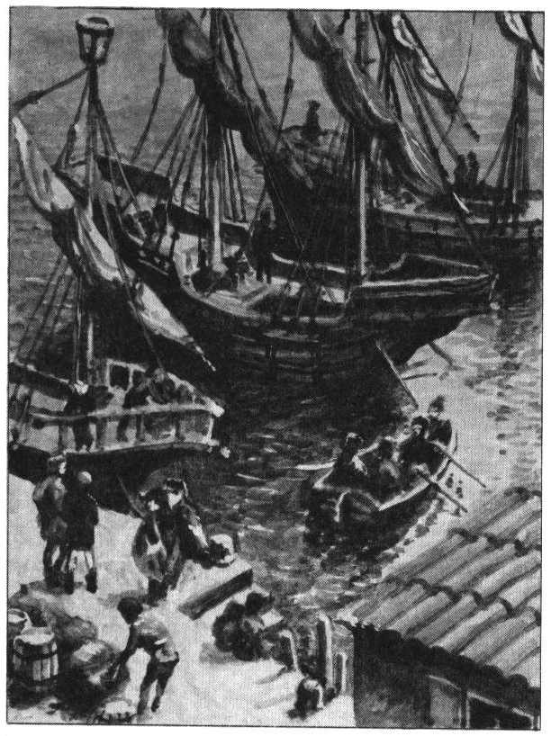
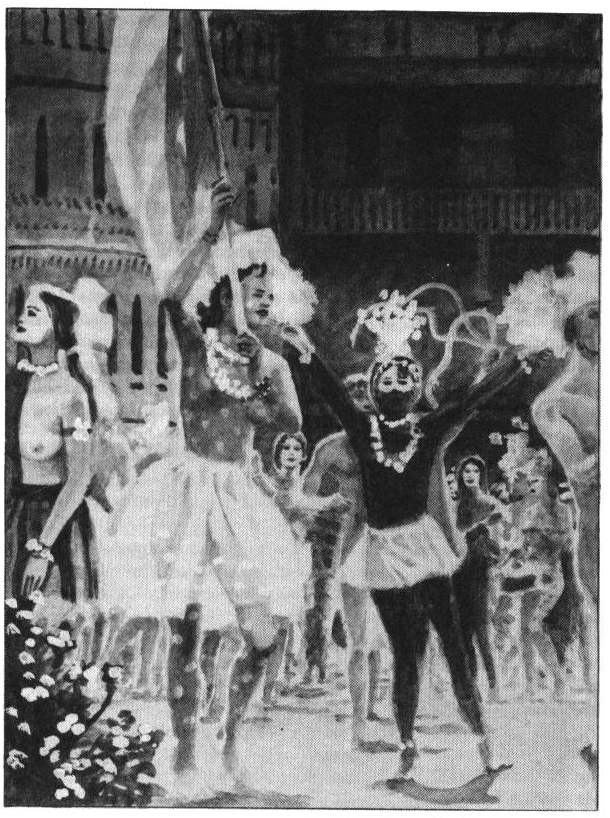
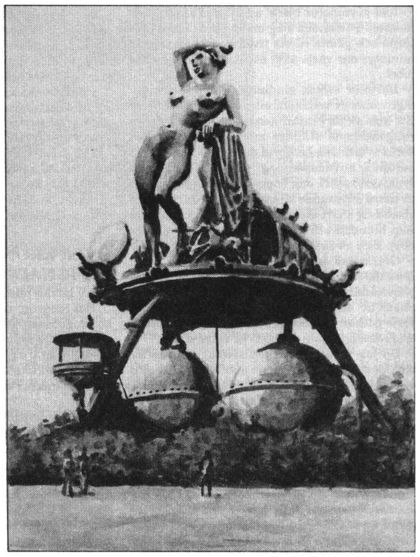
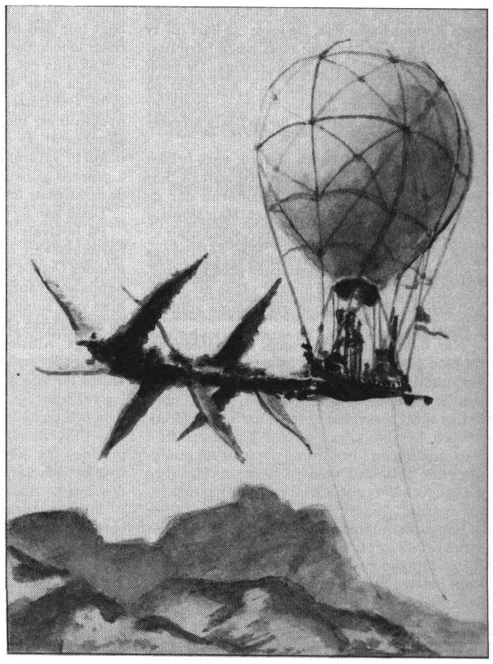
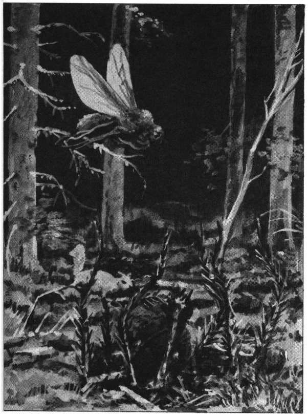
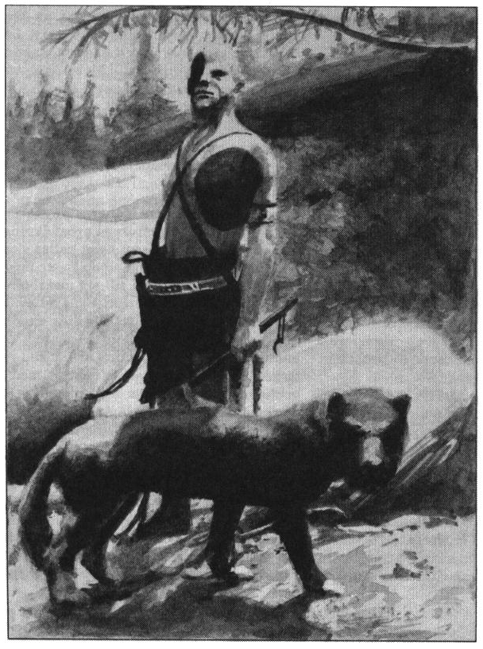
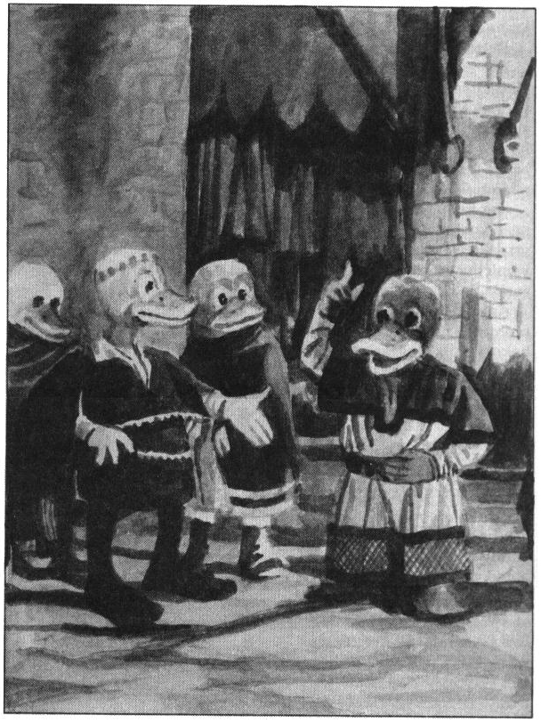
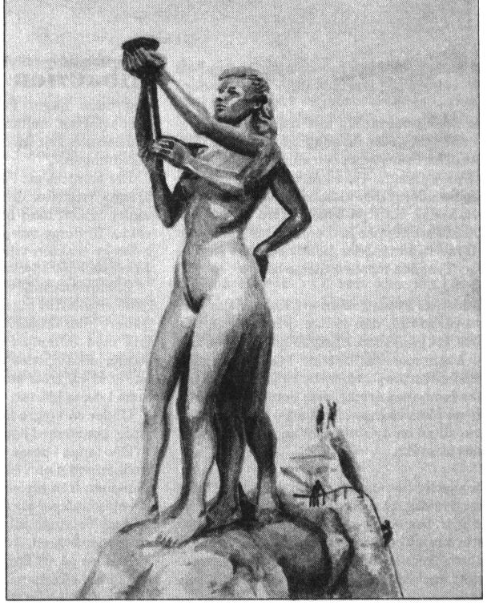

<title>Paratorna - Trakorien</title>

# 05. Paratorna

## Överfarten

Vid färd över öarna tvingas man ständigt ut på lömska vatten. Emellertid var de kavareller som förde oss över Trakoriska sjön mellan Albarunzia och Tricilve behagligt trinda och stadiga, och så nerlastade med salt och sten att de krängde blott obetydligt.

Jag stiftade under resan bekantskap med fader Iarmons av Frand, en Shamashpräst vars ärliga allvar förljusade bilden av denna kyrka i mitt sinne. Han var inbjuden av själve överlexikalen vid huvudstadens kejserliga bibliotek för att skriva en essä om shamashernas tidiga historia på Palamux. Det ryktades bland matroserna att kejsaren själv efterfrågat denna artikel.

Fader Iarmons hade inför sin resa fått ett förmaningsbrev från fader Bryndegolh av Krima, pashishu och majus moralisma vid templet i Tricilve. Detta senare ämbete skänker ansvar för kyrkobrödernas rena leverne. Eftersom brevet ger viss inblick i huvudöns kynne, vill jag här återge valda stycken.

”... Vet detta, sanne broder: gudinnan Kastyke dyrkas i Paratorni trakter ej av tro, men som förevändning till girighet och självtänkande, ty hennes första bud lyder sålunda:

’Kastyke älskar den som älskar sig själv!’

Denna sentens hör man uttalas såväl innan gladiatorn dräper sitt slagna offer, som då girigbuken pinar kopparslantar ur fattigt folk eller då sjukdom drabbar grannens fä. Du gör således rätt i att ej betrakta Kastykerprästerna som helige bröder, men hellre såsom köpmäns och fogdars handgångne...

... Då du hörer en oförskämdhet kastas i ditt anlete, må du alls ej förfäras därav, ty vet, käre broder, att ofint sätt och offentlig svinlevnad på Paratorna är tecken på makt och höghet. Således talar kejsaren till sitt folk med ord som: ’Hören, I slemma och fåkunnige horder! Lyften edra utstående örontrattar mot harmoniens källa och peten vaxen ur edra hörelsehål!’

Det hålles i högre kretsar för höjden av förfining att uttala dräpande och nyfunna elakheter till jämlikar, medan simplare tilltal, såsom ’träckslukare’ och ’dallerläpp’ endast bör kastas till nedomstående.

Ödmjukhet och vänlighet tolkas på Paratorna blott till svaghet och bemötes med förakt av rik som fattig. Du bör därför under överfarten inpränta i minnet de giftige fraser jag nedtecknat mot slutet av detta brev. Träna gärna elakt tal mot en nära vän av flegmatisk läggning, ty konsten är svår och motbjudande, men din vistelse på denna svinens ö skall med övning bliva högeligen lättad...

... I Tricilve må allt köpas för guld, så även adelskap, titlar och ära, sådant man på Palamux blott värver av börd eller dådkraft. Av denna anledning bör du aldrig efterfråga fint folks bakgrund, ty detta kan innebära en större förolämpning än du mäktar försvara.

Låt följande händelse, som inträffade helt nyligen, lända dig till varning:

En ädling av god stam, låt oss kalla honom ’Karles’, dristade sig att förolämpa en Grusser Dunderbuk av Moherra, den rikaste sylvoleumhandlaren i Zaroflas, genom att likna hans stamträd vid en späd ek, planterad i en guldskål vatten. Den fete köpmannen utmanade omedelbart ädlingen på duell, vilket iakttagarna fann komiskt, ty så förfettade var Grussers fingrar, att han näppe hölle svärd i sin hand, än mindre svingade det.

Emellertid hyrde köpmannen en kämpe i sitt ställe, vilket på Paratorna är helt ärbart, nämligen den beryktade fäktmästaren Kimbrog Bukflängaren, känd för att med njutning sarga sina motståndare till långsam död. Som Karles var vid ringa kassa förfärades han, ty han förmådde ej hyra de yppersta kämpar, de vilka kunde tänkas motstå Kimbrog. Han syntes därför själv gå en kvalfull död till mötes.

Det föll sig emellertid så att Karles hade en tjänarinna, en oäkta dotter inom familjen, vars moder drev ett glädjehus där Kimbrog plägade förlusta sig före varje strid. Man lyckades i huset nersmyga ett gift i fäktmästarens vin, så att hans lemmar blev såsom bly när striden stundade. Karles kunde så vinna duellen utan ansträngning, men Grusser Dunderbuk spred mycken guld i staden för att tysta spott och spe...”

Både Iarmons och jag fann fader Bryndegolhs maningar, varav dessa nämnda blott är ett fattigt fåtal, värda all efterföljd, och vi beslöt vänja våra tungor vid ont tal i skeppets förstäv, dit besättningen sällan hade ärende på öppet hav.

Vi gjorde efter några trevande tillmälen sådana framsteg i smädeskonst att vi omsider förmådde kalla varandra såväl ’kloakpadda’ som ’rövböld’ utan att rodna. Detta smaklösa utbyte av tarv sockrades naturligtvis med ständiga ursäkter.

På den tredje dagen överraskade oss Baldyr, oväntat uppstigen ur det bakrus han värvat hos kölsvinen i lastrummet kvällen innan. Baldyr var okammad och misslynt men krävde att få delta i leken. Efter blott någon sekunds grubbel spreds ett ondskefullt flin över hans nuna, och han hävde ur sig något jag varken vill eller kan upprepa. Själva solen mattades för ett ögonblick och fader Iarmons bleknade innan han vacklade mot sin hytt. Beklagligt nog undvek denne känslige präst fortsättningsvis både mitt och Baldyrs sällskap. Det sades mig senare att han aldrig förmådde avsluta sin essä om shamashernas historia, utan tvingades tillbaka till Palamux på grund av överdriven känslighet mot kritik. Jag håller Baldyr ansvarig för fader Iarmons’ tragiska personlighetsutveckling, men denne lymmel blir bara upplivad av sådana anklagelser.

## Okruzande

För bara två sekler sedan var Trakoriska rikets huvudstad Tricilve en obetydlig fiskestad på västra Paratorna. (Trinsmyrier hävdar ofta att så fortfarande är fallet.) Staden har aldrig ägt en god djuphamn eftersom floden Coimatri dumpar stora mängder dy i Kruzanderviken, varför vår konvoj tvingades kasta ankar i den naturliga hamnbassängen vid Okruzande, en stad på en tämligen omotiverad klippö ute i viken.

Okruzande har som huvuduppgift att lasta om varor mellan pråmar och havsfarare for in- eller utskeppning till huvudstaden.

På den kryllande kajen bjöds en verklig smak av världsskivans bredd, ty där kunde allehanda farsegels raser och gods beskådas.

Från det nordliga Sanithsid bringade blånerade orghingar en last ädel-is som kom deras skepp att ryka likt en svettig häst i höstsolen. Denna is från glaciärernas inre är för alltid stelnad till kristall, och man slipar därav smycken som skänker ständig svalka.

En bredbottnad farkost från Morelvidyn vid kopparhavets södra strand sålde slavar direkt över däck, mest vildar från Samkarnas inre, men även högborne fångar tagna i strid mot efariska furstar.

Man såg även flerhanda djuriske halvfolk, varav de vita ankorna är väl spridda och äger mycken trad på Paratorna. Ön hyser därjämte vargmannaflockar, fågelmän och halvlängdsmän, men inga stenfolk förutom en och annan dvärgslav inköpt från Palamux för smidets skull. De älvfolk vi stötte på var alla främlingar på resa, men det taltes om bofasta sälingar på öns östsida, i den trakt som kallas Hoedjar.

Vi fördrev dagen i Okruzande under tämlig stiltje, barnsligt glada över att åter ha fast mark under våra fötter. Fler skepp anlände, mest mindre handelsskorvar från marknadsstäderna längs kusten, men också smäckra jakter med förnäma ädlingar. Mot eftermiddagen löpte en underlig flermastare från Melukha in i hamnen ackompanjerad av skrällande musik som spelades på däck. Den var målad i gulrosa mönster och liknade mest en lustgård, ty hela riggen prunkade av lianer och kottepalmer. Lättklädda danserskor kastade frukt mot åskådarna på kajen, vilka till en början kastade tillbaka, men snart upptäckte att det rörde sig om sällsynta läckerheter som gick att äta eller sälja för goda decaurer.

Jag sporde en repflätare om trafiken på Okruzande alltid var lika livlig. Mannen kallade mig krabbhuvud och frågade om jag var farsegels från det virrande blå därovan eller från de bottenlösa djupen inunder eftersom jag inte visste att frihetsspelen just tagit sin början.

Mot sena eftermiddagen kom så högvattnet till Kruzanderviken, och en armada av mindre och större roddbåtar uppenbarade sig för att frakta nykomlingar till Tricilve. Baldyr fann för gott att lägga ett extra silvermynt till en snabb roddare, ty med festligheter i staden kunde husrum vara svårt att finna senare mot kvällen.

Vi slog oss alltså tillrätta på passagerarbänken, men roddaren gjorde alls ingen min av att lägga ut. Då vi påtalade den utlovade snabbheten sade han sig först vilja fylla båten och att snabbheten blott gällde själva rodden, vilket vittnen kunde intyga. Om villkoren inte passade kunde vi hyra någon annan eller ro själva. Jag uppstötte förtretade gnyn mot himlen, men Baldyr steg oberörd upp, lämpade karlen över bord och satte sig själv vid årorna. Då roddaren frustande dök upp till ytan tackade min reskamrat för erbjudandet att ro själv, vilket vittnen kunde intyga om, och lämnade kajen med kraftfulla årtag. Även jag, vars klena lekamen knappast lämpar sig för arbete, grep nu i triumf en åra, och tillsammans tog vi oss raskt över viken.

## Tricilve

Man säger att ädla metaller inte luktar, men Paratornas guldtrakiner stinker av allt från parfym till fisk. Skrän och gillen har rätt att själva prägla en viss mängd mynt varje år, och varje ädelslageri har hemliga metoder att sätta sin speciella arom på mynten. Tyvärr, eller tursamt nog, försvinner lukten med tiden, men i Tricilve är den fortfarande helt tydlig.

Huvudstaden skalv i feststämning. Man firar under en veckas tid frihetskarnevalen till minnet av frigörelsen från Palamux. Den lössläppthet som präglar festivalen var till en början riktad mot shamashernas stränga regim, men numer frågar ingen efter anledningen längre.

Som planerat fick vi med lätthet ett rum på gästgiveriet Musslans svarta pärla eftersom vi var bland de första nykomlingarna denna kväll.

Vi avlämnade där våra packningar och gav oss upprymda ut i staden.

Tricilve är en mycket vidsträckt och lågbyggd stad uppförd på ostadig lera. Leran tillåter blott en låg ringmur runt staden, men som Paratornas makt bygger på handel och inte på krig är detta fullt tillräckligt. Trots stadens storlek var alla gator fyllda av människor. I detta myller slogs jag genast av tricilvernas märkliga klädesvanor.

Huvudstadens sprättande ungfolk synes mig i detta avseende vara ohämmat fåfängt. Män som kvinnor målar gärna blottade kroppsdelar i skrikande färgmönster. Sommartid kan detta blottande och färgläggande anta mycket oblyga proportioner, och man rakar gärna delar av huvud och kropp för att kunna anlägga ytterligare dekorationer.

Klädedräkten skall vara opraktisk, gräll och ljudande. De verkligt förnäma bär plagg av kamsunsk papir, ett material som varken tål att repas, slitas, fuktas eller användas på något sätt utan att förstöras. Den papirklädde måste sitta helt stilla för att bevara kläderna intakta. Vill han färdas måste han bäras. Vill han äta måste han matas och tugga utan alltför stora munrörelser. En man klädd i kamsunerpapir visar således att han är mycket rik och sysslolös, vilket är materialets enda funktion.

Själva gick vi till torgs och inhandlade vackra dräkter av spunnet algsilke. Silkesalger odlas i dammar nära kusten för att därefter pressas, dras och spinnas till kläde. Denna näring och efterföljande sömnad sysselsätter stora delar av befolkningen runt Tricilve.

Baldyr visade sig inte helt oväntat vara mycket förfaren i handeln och förklarade att man på Paratorna mer än på andra ställen noga måste granska vad man köper, ty här saknas all stolthet bland hantverkare.

Man plägar om hösten rena algdammarna genom odling av karpfisk, varför vi till gott pris åt smakliga fiskmåltider under hela vår vistelse i Tricilve.

Jag ville gärna skåda akademin och biblioteksparken med den omtalade kronolaben, men Baldyr anmärkte att ljuset redan flyktade och föreslog att vi istället skulle övervara frihetsspelens öppnande på stora amfiteatern.

Någon timme senare satt vi alltså på goda platser i marmorkratern vars botten flammade av mångfärgade eldar. Lågornas onaturliga färger sades komma av alkemiska pulver och nyttjande av dyrbar kromanterved från Samkarnas djungler.

Där steg nu fram en högrest, vitklädd bard, vars stämma mäktigt påbörjade den välkända mytiska cykeln ”Tiamats tvenad”. Tårar steg till mina öron, ty denne gudasångare hade en röst av flytande guld.

Döm om min förfäran då plötsligt ett visslande steg ur främsta raden och projektiler singlade ner över skalden som förfärat tystnade. En hoper råa sällar hoppade över skranket, slet ifrån barden hans klockerin och bar honom runt arenan under hopens skratt och spe. In stormade en naken ryttarinna till häst, efter vad jag förstod föreställande gudinnan Kastyke. Hon sprängde runt varv på varv och snärtade med sin piska varje gång hon passerade den fångne sångaren. Då Baldyr såg min oförstående blick, förklarade han att scenen symboliserade Paratornas uppbrott från Palamux’ stelnade välde.

I samma stund bar man ut sångaren och Baldyr berättade att man nu förde honom ner till hamnen för att placera honom på en flotte iklädd endast ett ogarvat getskinn. Därefter rodde man flotten ut till havs så att den månde driva tillbaka till Palamux.

Jag frågade om inte detta var att föra skådespelet väl långt, men min reskamrat skrattade och sade att det alls inte rörde sig om något skådespel. Varje år tillfrågas en poet från främmande land om han inte vill sjunga ”Tiamats tvenad” inför hela Tricilve. Otroligt nog finner man varje år någon som inte har hört talas om seden. Man menar i staden att sådana världsfrämlingar gott förtjänar att placeras på en flotte i havet.

Baldyr fann det hela mycket komiskt. Jag däremot ville genast gå, men han rådde mig att stanna, ty paratornierna var denna natt mycket uppspelta och skulle gärna sätta ännu en främling på flotten.

Jag satte mig alltså tillrätta och genomled kvällen under största svårmod.

Idel grymheter bjöds ut till den skränande massan. Historiska slag mellan det unga Paratorna och gamla rikets trupper spelades upp i miniatyr där varje äkta sår hälsades med äkta jubel.

Därefter vidtog gladiatorstrider som ständigt vanns av bodâkens eller kejsarens kämpar. Ett sus av förväntan genomfor teatern då en raugonerhona ställdes mot tre kämpar med korta svärd. Jag hade vid det laget drabbats av bultande huvudspänning och ett för mig sällsynt, tyst raseri. Jag hoppades äntligen få se en av dessa struttande låtsashjältar blöda, men det visade sig snart att raugonen var såväl avgiftad som bländad och drogad så att mitt ovärdiga hopp kom på skam.

Omtumlad stapplade jag ut på gatan i den sena natten. I min avsmak var jag dock ensam bland andras lystnad och godmod. Målade varelser av obestämt kön bedrev öppen otukt i varje gathörn. Sedan vi återfunnit gästgiverier bjöd natten för min del blott på ringa sömn.

Då jag följande morgon skakat olusten av mig, bestämde jag att vi nu skulle se akademin och biblioteksparken. Baldyr ryckte bara skamset på axlarna ty han märkte min rättmätiga vrede.

Akademin i Tricilve är sannolikt den största norr om Kopparhavet. Detta lärosäte anlades inte av kunskapstörst, utan för att framhålla Paratornas stora djupsinne inför främmande länder. Färre än en tredjedel av akademins mästare stammar från hemön. De många lärarna farsegels ifrån framhåller ofta att Paratorni unga har ringa tålamod till tydande av bleka pergament, men desto hellre visar de smulor av vetande som slumpat sig kvar i deras minnen.

Från Maravelda medförde jag astromatissan Sabargas hälsningar till alven Simenard Froim, akademiens storsyntald av semantik och kalligrafisk historia. Denne stillsamme läromästare gladde mig genom att motta min anspråkslösa skrift över mineralernas inneboende rytmik för bibliotekets räkning.

I Simenard Froims sällskap vandrade vi runt hela förmiddagen under samtal med akademiens vise. Först när solen stod som högst tog vi avsked i biblioteksparken invid den märkliga kronolaben.

## Kronolaben

Kronolaben konstruerades under ledning av mäster Gaoski från Klomellien. I tio års tid offrades säckvis med guldtrakiner på uppförandet av bronskolossen. Skisser, gjutformar och dvärgsmidda detaljer skeppades varje månad kors och tvärs över Nordhavet.

Officiellt ska kronolaben mäta tidens gång så att huvudstadens astrologer lättare kan förutsäga stjärnornas rörelser och därmed se in i Trakoriens lysande framtid.

Det finns också en annan bild som hör samman med skandalen vid kronolabens invigning år 604 eO. En ambassadör vid Trakoriska kejsarhovet, magillern Maglo da Munzga, återberättade händelsen sålunda:

### Över Kronolaabens invignad

”Dyre broder minister!

Det smärtar mig att höra hur vår älskade konungafader, må hans gnista omsider enas med alltet, i munterhet över min förra redogörelse ådragit sig hjärtstyng så att den årliga vildsvinsjakten fått inställas. Dock låter sig denna händelse knappast sägas med större allvar.

Låt mig återpränta kortare stycken ur mitt tidigare dokument på det du må förstå och ej förbli gramse.

’...Ty denna dagen skulle Kronolaaben av Tricilve vigas åt sin uppgift, och mången, däribland er ödmjuke tjänare, var bjuden från långväga land att övervara högtiden.

Märkligt är kronolaabens mätande av tid. På vidundrets topp tronar en bildstod av jordemodern ur vars bröst vattnet strilar då fem minuter passerat. Var kvarts timme står därtill ånga ur hennes öron som symbol över havets dimma. Där utväxlas även slag mellan tvenne träriddare vid jämn timme och mycket annat. Man förklarade innan igångsättandet nogsamt dessa vidundrets alla mekanismer, på det att pöbeln ej månde förfäras då skovelhjulen sänktes till den underjordiska strömmen och kuggar begynte mala.

Solen glänste den dagen i de två mässingsglober som håller vatten till ångkokaren. Vid de trennefaldiga bronsbenen, lindade med rankor av humle och vin, hade en magnifik pendel utgörande kronolaabens hierta surrats med hamprep. Dessa rep skulle avbrännas just vid middagstimmen, då solljuset genom en brännlins kom att söka sig till hampans fibrer.

Till gudomlig ledning äntrade kastykernas pelarfader upp på podiet då tiden närmades. Hamprepen sprang i glöd blott något andetag förrän pendeln, stor var dess vikt, svang undan.

Och folket häpnades.

Men pendeln svang bort och stannade, varpå den vände åter och slog pelarfadern för pannan så blodet skvatt. Då gastade hopen och rusade likt höns från platsen. Där ryktades snart i staden att kolossen löpte fri över gatorna, slaktande kvinnfolk och barn i klasar.

Men på sitt firmament stod vidundret kvar. Blott kastykernas pelarfader bligade glasögd mot den svingande pendeln där han låg i dödens ro.

Ylande bronslurar inkallade kavalleriet från exercisheden för att nedkämpa monstret och flera strider utkämpades mellan inbillade angripare innan sansen återvände.

De gäster, däribland er ringa tjänare, som kommit till Tricilve för att bländas av Trakoriens ljus, sattes på båtar till sina hemland innan kvällsmörkret föll, ty stor skam och tystnad rådde i staden.’

Just så vart kronolaaben invigd.

Eder tjänare
Baron Maglo da Munzga”

Vi stannade hela veckan i Tricilve, men eftersom jag fortsättningsvis undvek frihetsspelens nöjen, såg jag sällan Baldyr Brummare. Istället vandrade jag upp i den tidiga morgonen, medan stadsborna ännu sov rusen ur sina kroppar, för att plocka krabbor och musslor på stranden när tidvattnet rann ut. De fattiga strandletare jag mötte under dessa tidiga timmar syntes mig vara stadens bästa folk. De lever ett hårt liv, ty på Paratorna möter man blott ringa barmhärtighet med gamla, sjuka och fattiga. De mest vanföra kan visa upp sig mot marackel på marknader, och det händer att man vanställer sig för detta ändamål, men för de flesta återstår att leva bäst de kan.

Kafrilersekten från ön Mereld, vars bröder och systrar dyrkar ljusguden Tigwalvan, har rest hjälpstugor över hela Paratorna där de olyckliga får mat och tak för intet. Man skrattar i Tricilve allmänt åt ”dessa dårar, vilka utan löning tömmer annans dynga”, men kafrilernas godhet syns mig vara Paratornas skönaste ting. Det skall till Paratorni försvar sägas att Bodâken årligen skänker en större summa guld till sektens hjälp.

När Baldyr vaknade framåt eftermiddagarna bjöd jag honom färsk sjösoppa till langockerpudding. Ordet ”langock” stod ursprungligen för Paratornas urinnevånare, vilka numer kallas skecker och har trängts undan till Hoedjar och Kryfferskogarna. När kolonister från Palamux tog ön i besittning döpte de en pumpliknande nyttoväxt med ett beskt, mosigt inre till langock, förvisso som förolämpning mot infödingarna.

Langockerpumporna gröps ur och innehållet syras i stora kar inför vintern. Massan anrättas till puddingar med kött och frukt. Man plägar även halstra färska langocker över eld och äta dem med smält getsmör, varvid smaken minner om kastanjer.

Varje dag fick jag av Baldyr höra om de gräsligheter som tilldragit sig på marmorteatern kvällen innan.

Den andra dagen utspelades ”svartjakten” för att fira hurusom Paratorna rensades från svartfolk under rikets tidiga år. Denna jakt tillgår så att ett halvdussin förskrämda orcher släpps från sina burar på amfiteatern med löfte om frihet bara de tar sig ur staden. De arma bestarna får tolv minuters försprång innan sex jaktlag, ett för var stadsdel, rusar efter dem. Det gäller nu för jägarna att till arenan återföra sin orchs huvud spetsat på lagets paradlans före de andra. Hela staden kokar under denna jakt där stor prestige och många silverdecaurer står på spel.

Väl så folkkärt är ”ödeslotteriet” under festivalens näst sista dag.

I detta lotteri drar Kastykes pelarfader namnet på en adelsman från lotteriets åldriga bronsurna. I samma stund som namnet läses högt blir den utvalde fredlös och stora hopar rusar omedelbart mot hans hem för att plundra och skända det. Andra finner åter större nöje i att jaga efter den olyckliges person i samma syfte. Ödeslotteriet ska symbolisera gudarnas nyckfullhet, men valet sker ingalunda helt slumpartat, ty det är möjligt att köpa ut sitt namn ur valurnan. Lotten faller heller aldrig på kejsarens gunstlingar eller på medlemmar av de mäktigaste limbes.

Detta kan förvisso bero på gudarnas försyn.

På festivalens sista dag träffade Baldyr en barndomsvän och adelsman vid namn Klamender Gomba av Hiltre. Vi fann honom av en händelse i rännstenen utanför ett härbre, och liten var i sanning hans ädelhet vid detta tillfälle, men därom skall intet mera ordas ty så är ej passligt. Alltnog bjöd oss denne Klamender Gomba till familjens gods Helterhem på berget Hiltre för vila över vintern. Såväl Baldyr som jag var hjärtligt trötta på vandrande i växande kyla och tackade därför ja. Jag ägde emellertid föga tillit till vår värd, vars helt rakade huvud pryddes av sammanslingrade satyrer och nymfer, och vars ändalykt blott hjälpligt skyldes med karmosinröda hosor av algsiden.

Jag våndades även vid tanken på resan till bergen, ty mellan oss och dem låg enligt Simenard Froim Skuggornas träsk i vars sörja blott dårar sänker sin fot.

## Kamest

Emellertid slapp vi vada i träskets gyttja, ty denna märkliga färd skulle gå med zepelond från staden Kamest. Roddare förde oss österut över Kruzanderviken till floden Coimatris mynning.

Kamest är en blomstrande handelsplats dit gods förs från Paratornas inland via de vidsträckta vattenvägarna. Framförallt passerar stora mängder sylvoleum genom staden. Klamender Gomba berättade om sina stora oljepilskogar i Hiltre. Han beskrev hur man utvinner brännbar vätska ur träden genom att tappa dem på sav under sommarmånaderna. Saven samlas i fat och saltas med rent bergssalt. Efter någon vecka kan sylvoleum skummas av från ytan och direkt användas i lampor eller andra brännare.

När man fraktar sylvoleum för handel sker saltningen dock först vid leverans, ty detta minskar risken for vådabrand.

### Zepelondfärd

En zepelondfarkost består av en algsidenbälg vars inre uppfylles med varm sylvoleumrök.

Denna stigande rök förmår lyfta såväl zepelonderbälgen som passagerarnas gondol mot skyarna. Färdsättet är inte helt ovanligt på Paratorna, men drar mycket guld och nyttjas därför blott av de rika.

Familjen Gombas zepelond drogs framåt av ett sexspann albadorer, tränade att slå sina mäktiga vingar i en särskild rytm så att farkosten höll jämn fart i färdriktningen. Själva sidenbälgen var formad till en jättelik, blodröd oljetunna; släkten Gombas skydds-märke.

Efter någon inledande förskräckelse just då gondolen lyfte, var färden mycket angenäm under klar himmel. Vi följde Coimatrifloden uppströms över vidsträckta langockerodlingar. Halvvägs mot Mazmatra störde vi en koloni dyngtärnor som skränande började orena oss, varför Klamender tvingades lämpa en av våra reservtunnor sylvoleum överbord så att höjden ökades. Han fäste en brinnande lunta vid tunnan innan den föll. Jag fann detta tilltag högst onödigt, ty en stor del av fågelkolonin liksom ett stycke oskyldig åker flammade i lågor, men de andra skrattade länge och gott åt denna skämtsamhet.

## Skuggornas träsk

Vi slog nu kurs rakt österut in över Skuggornas träsk. Jag bad en bön till Ezgela, sylfernas moder, att vår zepelond månde hålla sin höjd. Skuggornas träsk utgör en vidsträckt sumpmark väster om Hesiphamassivet. Även fast den omges av Paratorni bullrande horder, ligger trakten helt öde, ty den hyser sällsamma odjur som på några få dagar kan driva den mest stenskallade dvärg till sammanbrott. Den lärde faunisten Kapke, med tillnamnet Slemsöka efter sitt krälande i tillvarons dy, beskriver flera av de märkliga arter som hemsöker Skuggornas träsk. Jag vill orda något kort därom.

Den djärve besökaren märker bland träskets andra lömska flyn omedelbart den grönglänsande kråkbromsen. Denna dovsurrande jättefluga dras genast till besökare men misstas ofta för skadade kråkfåglar, vilka den liknar i storleken om än ej i flykten. Kråkbromsen lever av blod, exkrementer och dödkroppar. Den uppträder i mångfald och besvärar vandrare genom att sätta sig på deras ryggar eller huvuden utan att skrämmas undan med lätthet. Honorna lägger var månad ett trettiotal levande larver, vilka den söker placera på ouppmärksamma eller sovande djur, där avkomman kan suga sig fast för att dricka blod. Dock utgör kråkbromsarnas blotta närvaro den största plågan för svagsinnade personer, ty djuren utsänder vågor av glupsk lystnad. Dessa hjärnvågor blir starkare ju fler flugorna är, och framkallar hos träskvandrare en oförklarlig nervositet som övergår till förföljelseskräck, sömnsvårigheter och raseriutbrott. Många upplever hur flugorna efter några dygn viskar ont till dem, och man känner fall där vilsegångna män i vansinne slitit av sig kläderna och vilt skrattande låtit kråkbromsarna antasta deras nakna kroppar.

Just den starka tankekraften särskiljer flera av träskets arter från liknande släktingar. Kapke Slemsöka menade att någon källa till fenomenet torde dölja sig långt inne bland sumpträden. Därom är dock än idag helt ovisst.

Den grå mareskunken är ytterligare ett exempel. Denna halvmeterlånga allätare är så stillsam och oansenlig att man ofta märker den först då den känner sig hotad och nyttjar sitt fruktade försvar.

Mareskunken kan nämligen inlära andra varelsers tankar och känslor. Djuret förstår knappast den finare innebörden i dessa tankar, men tycks kunna särskilja grundmönster som fruktan, sömn, förvirring och liknande. Då den känner sig hotad sänder skunken känslor den tidigare uppfattat mot sin angripare, så att dessa främmande tankar intar motståndarens vilja. Äldre djur har av erfarenhet lärt sig vilka tankar som effektivast driver angripare på flykten och kan framkalla fruktansvärda mardrömmar.

Det berättas att man för något tiotal år sedan i Mazmatra samlade ett uppbåd om tvåhundra man för att döda en enda mareskunk som inlärt en jägares dödsångest medan denne åts upp av en spindelranka. Denna skunk hade då sprängt fyra människors hjärtan och gjort ytterligare tre vansinniga genom att låta dem genomgå jägarens erfarenhet.

Om spindelrankan skall sägas att den liknar ondskan själv i växtform. Detta monster äger förvisserligen släktskap med stryparrankan, blott är den tiofalt lömskare. Spindelrankan gror på gränsland mellan fuktig och torr mark, där den utvecklar sina långa, svarta tentakler vilka är täckta med tusentals håriga utskott som ständigt rör sig likt spindelben. Då den uppnått viss storlek begynner rankan gräva för att sänka sig i en grop som fylls med vätska från jorden. Spindelrankan utsöndrar därvid ett grönt skum, vilket lägger sig liksom mossa på dammens yta. Dold i dammen väntar växten tills något djur trampar genom ytan, varvid tentakler skjuter ut för att gripa offret och dra ner det mot munnen på stammen. Vissa exemplar besitter ett svagt paralyserande gift vid tentaklernas bas.

Tankar på dylika odjur tvingade sig in i mitt huvud under färden över Skuggornas träsk. Kanske var de sända av skrämda mareskunkar, men zepelonden drogs säkert framåt av de outtröttliga albadorerna och snart flög vi ut över Malossisjöns vatten där gott fiske gives.

## Ranz

Den trakt som kallas Hiltre griper om tvenne berg. Vi seglade till en början nära det heliga berget Ranz som skjuter upp ur Malossisjöns bortre vatten. Flera tempel skymtade längs sluttningarna, alla byggda i en mycket säregen trattform ut från berget. Klamender Gomba berättade att munkarna i dessa tempel tillhör Ranzinersekten. Ranzinerna tror att berget talar stora ord till dem, men så långsamt att ingen vanlig människa uppfattar vad stenen säger. De tränar sig därför i tålamod och stillsinne för att kunna lyssna orörliga framför grottöppningar dagar i ända utan att äta eller sova. Enligt Klamender blir munkarna efter några dagars fasta och vaka så förvirrade att de tror sig uppfatta en stavelse, eller kanske bara ett fragment av en stavelse från berget. De rusar då överlyckliga hem till sitt tempel för att nedpränta meddelandet. En gång om året samlas budskapen i den stora bok som kallas Vox Ranzina under bergspredikningens högtid.

## Helterhem

Zepelonden landade vid den åldriga borgen Helterhem på berget Hiltre öster om Ranz. Jag erfor med viss förvåning att släkten Gomba är en av de ursprungliga adelsfamiljerna på Paratorna. Klamenders syskon var emellertid en underlig samling, kanske beroende på att föräldrarna ryckts bort i tidiga år.

Brodern Angantrym var ranzinermunk, vilket förklarade Klamenders kunnande i saken. Angantrym tillbringade hela vintern i fadershuset med att stirra mot samma stenvägg i storsalen. En gång om dagen höll den gamla köksfrun, som var en älskande existens, upp en kristallspegel framför hans mun för att se så att han levde. De andra tjänarna behandlade honom med mindre respekt, ja det gick därhän att man hängde fuktiga kläder på tork över honom eftersom han aldrig protesterade.

Systern Linvina, en blodfattig fröken vars violetta peruk spretade som en buske, fattade tidigt tycke till mig, men var för tyst och stolt för att erkänna det. Under vår hela vistelse försökte hon istället väcka min lusta med svartkonst och magiska drycker, vilket jag förstod först när Baldyr frågade efter smaken av den brunstiga horngroda hon inblandat i min löksufflé. Efter detta blev jag mer observant och försiktig. Varje morgon kastade hennes svärtade ögon lystna blickar mot mitt skrev innan hon förärade mig en hälsning. Som min lust står blott till pergamentens ord fann hon aldrig vad hon åstundade.

Om dessa två tidigare syskon var tystlåtna, så var äldste brodern Trimboldt desto mer bullrande, och en rovriddartyp av barboskermått. Varje morgon plägade han rulla stora klippblock utför berget mot byn nedom borgen i avsikt att ”hålla bondkusarna på tå med mössa i hand”. För detta tilltag var han hjärtligt avskydd i bygden vilket är väl förståeligt.

Man bjöd middag på silverfat. Till huvudrätt serverades bastklädda knyten med svart skorpa och ett krämigt, starkt doftande inre. Först alltför sent insåg jag att det rörde sig om surrad kråkbroms, alltså halstrade jätteträskflugor som ombundits för att inte spricka i hettan.

## Mazmatra och Malossi skogar

Under denna vinter reste jag mycket på södra Paratorna i sällskap med rättaren på Helterhem, den vita handelsankan Casimo Hruckert.

Den stora mängden sylvoleum från familjen Gombas skogar skeppas över Malossisjön för att säljas i Mazmatra, som är mig närmast av alla Paratorni städer, ty här finns en ärlighet och ett yrkeskunnande som eljest saknas. Man har i staden en stor kärlek till skogarna längs Malossisjöns stränder, vilka sysselsätter befolkningen med oljerening, skeppsbygge, snickeri och jakt.

En druidsekt kallad ”trädknusarne” har stort anseende i trakten. Då man genomvandrar lundarna runt Mazmatra ser man omsider sektmedlemmar med trånande iver omfamna särdeles älskade träd. Sektens främsta uppgift är annars att vakta mot oren inväxt av ormgräs från Kryfferskogen i öst.

Ormgräset eller kryffermåran som den även kallas, är en märklig växt som förvisso kan nyttjas till månget, men likväl skys av skogsfolk. Den är ett slingrande gräs som växer mycket snabbt såväl under trädens skugga som ute på slätten. I skogsbygd klänger den längs marken och uppåt från gren till gren, så att inom kort all annan markväxt förkväves. Där bildas vid marken ett svårhugget nätverk av levande och död kryffermåra upp till flera meters höjd, vilket svårgör all vandring och allt skogsbruk.

På slättmark ter sig växten mer stadig och bildar täta ruggar likt den säv man plägar finna i sjökanter. Ormgräset nämnes ofta ”härgräs” av bönder, ty det rycker fram obönhörligt som en härskara.

Ormgräsets långa och sega stammar torkas och bråkas till seg bast som kallas asbast och nyttjas av flatare Trakorien över. Asbast kan märkligt nog inte antändas. Man kan därför inte utrota växten genom avbränning, men dess eldfasthet gör asbast mycket användbart till takflätande, eller varhelst eld vill undvikas.

## Övriga Bralorge

Bodâken har förbjudit införande av ormgräsfrö eller levande plantor till hela Bralorge, varmed menas slättlanden mellan Tricilve och Melse. Denna slätt var i tidernas begynnelse havsbotten och mången gröda springer gott ur dess fruktbara sköte. Främst bland dessa är vete och korn samt langocker och rovor. Havsleran lämpar sig även för krukmakande av praktiska men alls icke vackra föremål.

Bralorgeslätten är så hårt folkad att man från vart gods ser minst fem andra herresäten och därtill tre tempel och tvenne byar. Bruket av jorden tarvar riklig mankraft och stor slavhandel bedrivs därför i städerna Zaroflas och Grumm på västkusten.

Casimo Hruckert fann stor fröjd i att nedklafsa sina simfötter i slättmyllan, men själv hyser jag ringa kärlek till Bralorge. Dess städer tycks mig osköna och utan särart, samt därtill fulla av knipsluga handlare vilka skreko i mitt öra och grävde i min ficka för att påpracka mig allsköns skräp.

Gott hantverk gives knappast på Paratorna, ty därtill saknas tålamod och kunnande. Man drar sig dock inte för att söka efterlikna konst av andra folk, men varje kännare ser genast skillnaden. Av eget konstsmide tillverkas blott fula bronsminiatyrer föreställande kronolaben, kolossen i Fam Kvalvi eller kejserliga palatset, men dessa ting är så dåligt arbetade, att man sällan ens gitter bortslipa gjutskarven.

Av Saphynas vänliga saktmod märks intet trots den myckna handeln mellan öarna, men förvisso mildras folket i sina sinnen ju längre från Tricilve man färdas. Ej heller gives mycken spänning för den så lystne, såvida man ej hetsas av krämeri och viktfuskande.

## Karramak

Överkorsar man floden Mea Simia inträder man så i Karramak. Även här odlades tidigare mycken gröda, men stor inväxt av härgräs spiller grums i jordnäringens bägare. Istället håller man nu boskap och fjäderfä, samt idkar fiske och asbastbruk, vartill Melse är en utskepparhamn av stor vikt sydvart. I staden Karnald hålls en stor flottstyrka till skydd av kusterna mot pirater, ransarder och isbarbarer.

## Moherra

I den befästa staden Moherra stötte jag för första gången på Paratornas urbefolkning, det märkliga hundfolket som även kallas skecker. Skeckerna plägar lämna sina skogar med dyrbara pälsar för att byta till sig metallföremål, främst spjut- och pilspetsar. Urfolket är förvisso av människoart och bär alls inga hundhuvuden som Klamender Gomba påstod. Deras namn kommer av att huden är fläckad i olika färger, så att vitare partier samsas med gula, bruna och svarta såsom man plägar se bland djur. Detta gör dem väl lämpade att kringsmyga i Kryfferskogens dunkel. Sedan jag väl vant mig vid deras säregna hudteckning, fann jag dem ädla i dragen och till synes överlägsna paratornierna i karaktären. (Detta är förvisso ej märkvärdigt, ty även en padda har bättre karaktär än de flesta paratornier).

Jag bevittnade ett uppträde invid stadsporten i Moherra, där en vackert tecknad, ung jägare medförde en tam best av för mig okänd art, vilken vakten nekade tillträde till staden. Då skeckerjägaren yttrade en mycket träffande förolämpning, hotade knekten dra blankt, men därvid utstötte besten ett så fruktansvärt skri att mannen bleknade och drog sig bakåt.

Jag frågade Casimo Hruckert om djuret och han berättade att detta var en mustelon, enligt jägarna det farligaste villebråd som vandrar i Paratorni skogar.

Mustelonen stammar ursprungligen från Akrogallien, och är ett mårddjur av vargens storlek, men till kroppsformen lägre och smidigare. Den liknar en förvuxen mink med sina små öron och sitt spolformade huvud, men benen är kraftigare och pälsen ofta gulbrun. Mustelonen jagar ensam eller i par, och kan i vilt tillstånd bli en stor plåga för fårfarmare, ty den dödar för nöjes skull och kan nedlägga ett tjugotal djur vid ett enda tillfälle. Likaså utgör den en stor fara for människor och är genom sin list, smidighet och kraftiga käkar döden för varje obeväpnad skogvandrare. Den är känd för stor fräckhet och kan smyga in i byar nattetid för att röva husdjur och även barn.

I Kryfferskogens trassliga inre tar den sig fram betydligt snabbare än andra djur.

## Hesiphas massiv

Hiltre och Ranz utgör den sydliga utlöpan av Hesiphas massiv, en skarp bergskedja vilken löper som en ryggrad längs Paratorni östkust. Baldyr och jag följde familjen Gomba till släktingar i dessa trakter där den äldre adeln byggt många jaktslott. Färden gick med släde över snön som nu fallit.

Vi ledsagades av Helterhems knektar och jag sporde om vilka faror man räddes. Då förtaltes att flera svartfolksstammar bebodde grottor bland bergen, även fast det rörde sig om svart-alfer, vättar och annat klenknytt. Det framgick att dessa arma krakar mest var bytesdjur vid herremännens nöjesjakter, ty man var noga underrättad om deras boningar och hade förvisso utrotat dem vid önskan. I flera slottssalar såg jag också svartfolkens huvuden pryda spiselstenen. Deras tomma ögonhålors sorgsna blickar ingav mig blott svårmod.

## Kryfferskogens utkant

Trimboldt Gomba pikade mig vintern i ända för brist på vulstigt armkött och plägade klämma om mina armar tills jag skrek av smärta. Detta blev mig övernog när vi var i Stemgora strax norr om Kryfferskogens bryn mot bergen. Vi gästade vid detta tillfälle en gård där magister Usergaldre av elementikens skola satt i högsäte.

I östra Hesipha tuggar man som bekant gärna rötter av sötbunken efter var måltid och den söta örten hade vid detta tillfälle stigit till mitt huvud, varför tungan löpte stursk som en åringshingst i munnen.

Jag ingick i all dumhet ett vad, med påföljd att jag nästa morgon befann mig i Kryfferskogen med ett hesapiskt björnspjut i händerna.

Min uppgift var att nedlägga en vild mustelon.

Snön drap från träden över min mantel och jag ångrade stort mitt hätska tal kvällen innan. Då jag sport gårdsfolket huru jag skulle finna vilda musteloner, hade man rått mig att ej ängslas däröver. Vilddjuren torde med all säkerhet känna min vittring och komma löpande i mängder.

Detta besked lugnade ingalunda min oro.

Det hesapiska björnspjutet har fem springblad vilka slår ut likt en ondskans blomma när vapnet stöts genom ett mål. Längre ner på skaftet är en kraftig parerstång satt för att hindra bytets inglidande mot jägaren. Spjutets bakre ände kan vidare länkas vid ett bälte runt midjan för att hålla en spetsad best på avstånd.

Jag hade ömkligen avlämnats i glesare skog nära kusten och sökte mig nu mot vatten for att ytterligare öppna landskapet. Efter en kort vandring stötte jag på en djup ravin med forsande flodvirvlar och slog följe med strömmen.

Ännu idag vet jag inte vad, men plötsligt prasslade något i buskagen bara ett tiotal meter bakom mig. Jag snodde runt men mitt spjut slog mot ett träd så att hullingarna löste ut. I upphetsningen tog jag ett steg för mycket och föll i nästa ögonblick ut i ravinen, ner mot forsen.

## Hoedjar

Jag vaknade med ett hostande, kräktes vatten och undrade smått var jag befann mig. Någon vänlig själ hade uppenbarligen bäddat ner mig bland yllefiltar i en enkel hydda.

Jag var, kort sagt, vid liv.

En kvinna av tidlös ålder steg in och bjöd mig en rätt av rå fisk och tångsallad med te på örter sedan jag tillpiggnat. Hennes utseende var varken klavykiskt eller skeckiskt, men milt och vackert om inte frestande. Håret var kortklippt, rikligt och grått fast hon ej tycktes åldrad i övrigt.

Kvinnan lyssnade intresserat på min berättelse och innan kvällen hade hon fått höra om hela min resa från ön Bzegusta till Paratorna. Vi förfärades båda på nytt över de mänskliga grymheter jag bevittnat, och kom varandra på detta sätt mycket nära. Först då jag ville förklara mina teorier om metallernas musikalitet, lade hon fingrarna över mina läppar och bjöd mig vila till morgonen.

Hon satte sig utanför hyddan och stämde upp ljuvlig sång mot havet. Själv lade jag mig tillrätta och slöt ögonen om hennes fridsamma bild. Jag var nästan förälskad.

På den tredje dagen vandrade en man, hennes man som det visade sig, upp från stranden, men jag såg ingen båt på vattnet. Han förargades alls icke över min närvaro. Emellertid var tiden nu mogen för mig att återförenas med Baldyr och familjen Gomba.

Nästa morgon ledde mannen mig in i skogen och vid middagstid skymtade vi en by dit han manade mina steg. Själv ville han ogärna träda in bland folket, men till avsked gav han mig ett oberett mustelonskinn.

Först sedan mannen försvunnit föll det mig in att jag varken visste hans eller kvinnans namn. Hela vistelsen i fiskarhyddan tycktes mig plötsligt vara en dröm.

Min återkomst till magister Usergaldres gård väckte stor uppståndelse ty man räknade mig vid det laget som död. Vid en stor bankett ville man höra om min jakt. Någon stund skröt jag över mustelonskinnet, men som jag är en usel lögnare kröp sanningen snart fram.

Usergaldre intresserade sig mycket för fiskarparet som bistått mig i nöden. Han höll dem för sälingar, ett alverfolk vars skepnad skiftar mellan djur- och människoform. Detta folk skall ha så stora magiska gåvor att man annars sällan ser dem.

## Joodak

Omsider beslutade jag så att medfölja en vårlig konvoj mot Trakoriens nordö Marjura. Det var alltså hög tid att fortsätta mot Trinsmyra, men som Baldyr ämnade sig söderut, skildes våra vägar under stor gråt och förbrödran.

Den goda ankan Casimo Hruckert färdades emellertid mot Ruhl för att fira midvinterblot hos sin familj och bjöd mig vandra i sällskap.

Vi färdades till Joodak, Hoedjars enda stad, varifrån ett skepp skulle avgå mot Fanzimle i Ruhl. Joodak är en timrad vildbygdstad som klättrar på sidorna av en djup fjord. Dess gator folkas mest av lurviga jägare i lurviga skinnkläder och av knektar som vaktar östkusten mot isbarbarernas plundringståg.

## Fanzimle i Ruhl

Jag överraskades stort vid ankomsten till Fanzimle, ty staden är byggd i halvformat för ankor och småmän. Ruhlertrakten utgör en ankstat inom Trakoriska riket, med ett eget råd, ett eget garde och även en egen ankborg. Denna frihet kommer av djurfolkets stora inflytande på trakorisk trad.

Staden Fanzimle är inför alldaglige männer närmast löjeväckande ren och prydsam. Emellertid driver man särskilda kvarter för storfolk, vilka till gästernas trivsel smakfullt smutsas ner av speciella kontaminörer. Här gives ypperliga tavernor vars tjänster dock suger pengar som jord drar vatten.

De vita ankorna i Ruhl förtjusar sig stort över allt spel och gyckel. På kvällarna spelas allankligen smickelbräde, dam och spräcka snok i varje kvarter.

Smickelbräde är ett mycket populärt spel i hela Trakorien. Det kombinerar taktik på spelbordet med mer våldsamma inslag. Tex måste den som gör hoppsmickel skutta upp på spelplanen före motståndaren innan poängen räknas honom till godo. Skulle motståndaren erövra en spelpjäs, får man behålla halva om man hinner klyva den med sitt svärd medan den är kvar på brädet. Den senare regeln har kostat mången god smickelspelare hans fingrar och givit talesättet: ”Den som inga fingrar har, ej i leken bliver kvar!”

Av gatans lustigheter lockar dockspelen ojämförligt flest åskådare. Kommedia dell’anco visar ständigt samma kända persongalleri:

*Coprostomba* heter den lärde gamle mannen som alltid talar vers och luras av ankan *Kvalbak*, skådespelens listige hjälte.

*Yaggamuk*, den slemme svartankan, är hjältens ständige motståndare.

*Mesurinn* och *Nindada*, det mänskliga kärleksparet, häcklas för sin virriga hjärtesmärta och lusta. (Ankor förstår sällan sådana skira företeelser. Detta insåg jag grymt då jag berättade om sälkvinnan i Hoedjar för Casimo Hruckert. Den tomhövdade dvärggåsen flinade bara brednäbbat åt mitt brustna hjärta.)

Den lille oskyldige halvmannen *Prolzo*, spelens narr, tittar mest på och får skulden för allt när han inte äter eller rapar, medan vargmannen *Okrof* kliar sina löss och hotar alla med stryk.

Varje berättelse slutar i munter musik där Kvalbak får slå takten med en påse silver han lurat till sig. Yggamuk får prygel av Okrof och kärleksparet bedriver otukt. Allt är åter som det ska.

## Västra Ruhl

Jag firade midvintern på släkten Hruckerts gods en halvdags marsch nordväst om Fanzimle, invid den sumpiga floden Zymb där grodor och brödnate odlas åt ankor över hela Trakorien.

Midvinterbloten genomfördes med ankors sedvanliga trams och tamhet. Man åt allehanda vämjeliga rätter, drack grodromstoddy, sjöng flerstämmiga kvackpsalmerier och dansade flapstepp, en ograciös så kallad humpadans, där man gör höga hopp och klappar ihop simfötterna.

Efter bara någon dag tog jag farväl och vandrade surmagad vidare mot väster.

## Paraltro

Jag ämnade söka överfart mot Trinsmyra från staden Siola i Paraltro och trädde med stor möda in i den sköna trakten över snörika bergspass.

I det böljande landskapet nedom bergen genomborras kullarna av halvmännens hålor. Byarna är så väl dolda att man kan slå upp sitt läger allena i kvällningen och vakna med frukosteldarnas rök runt omkring sig om morgonen.

Av riktigt folk gives i Paraltro många herdar, ty fårhållning är den vanligaste sysslan. Men närmare kusten tronar borgar på skogsklädda kullar där nötter gives i mängd.

## Fam Kvalvi

Eftersom resan hastade norrut, gick staden Fam Kvalvi miste om min fagra nunas åsyn, vilket ingalunda hindrar något ordande över orten.

Fam Kvalvi är gudinnan Kastykes heliga stad som grundades på hundraårsjubiléet av den Kastykiska frigörelsen. Staden anlades effektfullt på de höga röda klipporna norr om Kruzanderviken där den skulle göra intryck på inseglande främlingar. Till ceremonin vid stadsutnämningen hade man rest en kolossalstaty föreställande gudinnan Kastyke på klippkanten. Statyn skulle göra tjänst som landmärke för sjöfarten varför man placerat ett flammande fyrfat i dess famn. Emellertid hade gjutarna fuskat och gjort bronsplåten så tunn att statyn vek sig och störtade utför branten ner i havet.

Paratornierna lät sig inte nedslås av en sådan malör, utan lät de odugliga gjutarna följa sin skapelse över stupet och anlitade nya yrkesmän från Palamux. Dessa allvarliga herrar hade noga studerat den klassiska kolossen i Yoh, som då redan stått på benen i fyra sekler, och förklarade att klippan helt enkelt inte kunde bära erforderliga mängder metall utan att smulas sönder. Tyngden måste fördelas bättre.

Problemet löstes genom att Kastykiska kyrkans överhuvud, den helige pelarfadern, förklarade att gudinnan Kastyke har sex ben och inte två som man dittills trott. För att bibehålla de gudomliga proportionerna måste man även skänka henne sex armar, men detta höll fyrfatet bättre på plats så ingen ledsnades däröver. Man byggde alltså en ny staty som än i dag fungerar alldeles utmärkt.

Emellertid har staden på klippan aldrig blivit riktigt livaktig, ty den saknar naturliga näringar och är besvärlig att nå. Den härbärgerar prästernas akademi och några av Bodâkens kanslier, liksom ett Ezgelatempel och kejsarens luftslott med öarnas enda zepelonderflotta som garde.

Bodâken håller alltid nyårets första möte i Fam Kvalvi, där mäktiga falanger traditionellt gör sig kvitt besvärliga motståndare med ett smidigt kast utför klippan. Klipporna kallas i folkmun ofta för ”Blodiga backen”.

## Siola

Emellertid är detta blott hörsägen, och själv hastade jag till Siola som är ullspinnarnas stad och tillika en stor flotthamn och handelspost mot norr. I traktens skogar växer goda ekar varför den kejserliga arsenalen förlagts till Siola. Arsenalen utspottar årligen en handfull krigsfartyg, samt därtill kastmaskiner, vagnar, arcuballistor och mycket annat i trägods. Skogarna runt staden ska en gång i tiden ha folkats av alver, vilka mer eller mindre brutalt drivits på flykten.

Man seglar från Siola en stadig trad på Trinsmyra, varför jag snart fann skeppsrum och gav mig åstad.

## Ilibaurien

Jag hade något förvånats över den ringa skeppsfarten mellan Paratornas nordland Ilibaurien och Trinsmyra, men fick snart nog veta anledningen.

Det berättas att Paratorna skakades av långdragna krig efter den Kastykiska omvändelsen under vilken man frigjorde sig från Palamoxi välde. Bralorge var pådrivande i dessa stridigheter ty trakten ville lägga under sig hela ön vilket sedemera lyckades.

Ilibauriens innevånare på norra Paratorna hade emellertid ingen önskan att bli Bralorges tjänare eller bröder. De var ett frihetsälskande folk med Palamoxi dygder bevarade. Många strider utkämpades, men ilibarerna försvarade sitt land väl trots att de var få, ty banzikan var ännu i deras hjärtan.

Under en längre tid av fred sökte så Bralorge vinna landet med list.

Där fanns i dessa dagar en droghandlare och trollkarl vid namn Astrumal diFolt, också kallad ’demonen från Melse’. Denne onde mäster tjänte i ett slavläger för ett giftmords skull, men erbjöd sig betvinga Ilibaurien mot att i gengäld få sin frihet och en stor summa guld. Som inget förlorades på ett försök, ty guldet skulle utlämnas först i efterhand, ställdes ett skepp till Astrumal diFolts förfogande, och han avseglade inom kort mot staden O.

Ett halvår senare hölls en tidigare okänd kryddört med mild, men ändå skarp smak till försäljning på marknaden i Mynd Mazuldre. Köpmannen som hemfört växten kallade örten ’opiander’ och bjöd till stadens finfolk på underbart kryddade läckerheter. Han lät sig själv väl smaka, och alla var överens om att något så smakligt aldrig tidigare bjudits människor i Mynd Mazuldre. Lasten av frön och torkad krydda såldes följaktligen inom några dagar.

Så underbar är opiandern att ingen som smakat den vill ha någon annan krydda. Först sedan flera år passerat och örten redan odlades över hela Ilibaurien insåg man att mer och mer krydda krävs för att nöja den vane ätaren. Vid denna tid visade sig också kryddans skadliga verkan, ty i stora mängder fräter den på mage och huvud så att blod rinner ur den ätandes båda ändar och hans tanke blir slapp såsom död fisk.

Ingen återsåg någonsin köpmannen, vars sanna skepnad var Astrumal diFolt. Man fann heller aldrig ut varifrån opiandern hämtats, men det ryktas att droghandlaren köpt den från främmande världar till onämnbara priser.

Från denna tid sjönk Ilibaurien allt djupare i misär, och kom snart under Bralorges makt. Men segern köptes till priset av ett gott land, ty än idag lever ilibarerna i opianderns våld. Många köpmän från Tricilve och Siola har i landet funnit en god marknad även för andra droger och kryddor, ty där finns stort behov att döva sorg och fattigdom.

Om Astrumal diFolt ryktas att han själv kom under örtens makt och tvingades återvända till Ilibaurien. Han ska där ha ådragit sig en häxas förbannelse att för alltid tvingas vandra i opianderns blodsot över världen, men därom är intet säkert. Enligt en sägen i Ilibaurien vandrar såväl droghandlaren som hans ättlingar, kallade diFolter, runt i landet.

## Mynd Mazuldre

Mitt enda intryck av Ilibaurien är en kort nattlig vistelse i Mynd Mazuldres hamn, dit vi tvingades av dåligt väder. Några hus brann vid stranden, men ingen tycktes ta mycken notis om detta. Jag såg kroppar ligga i de smutsiga gränderna fast snön gloppade från ovan. Längre in över land syntes ruinerna av de gamla paradbyggnaderna från storhetstiden, uppförda i grönaste ziddisgranit. Jag beslöt att inte gå iland.

Senare under min resa kom jag i kontakt med kondottiären Cymba från Skuger och upptäckte då att ilibarer som lyckas lämna sin förpestade hemtrakt blir hatiska mot allt och alla och kan visa stor grymhet.

Emellertid gick resan nu vidare mot Vumbra på Trinsmyra.
