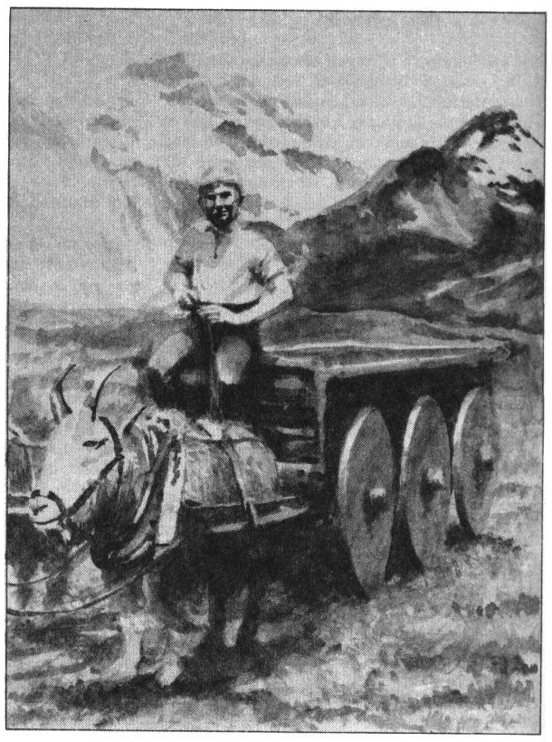
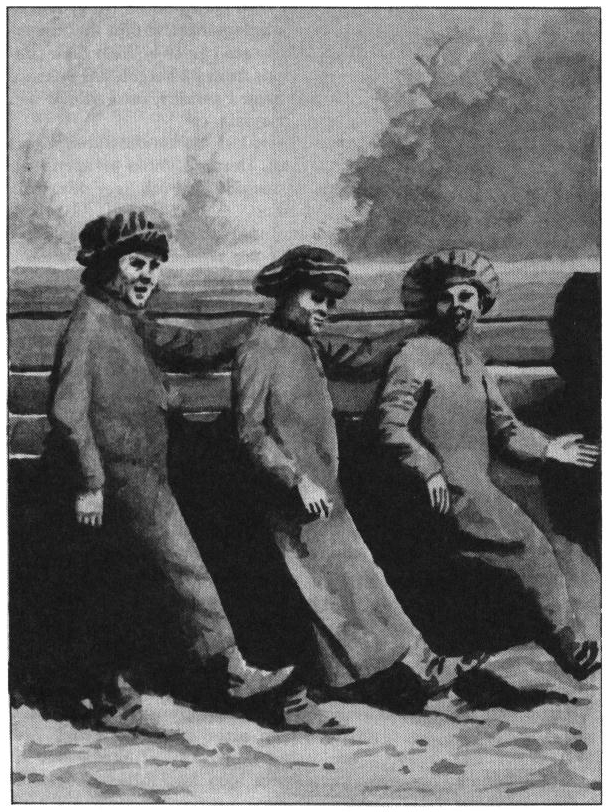
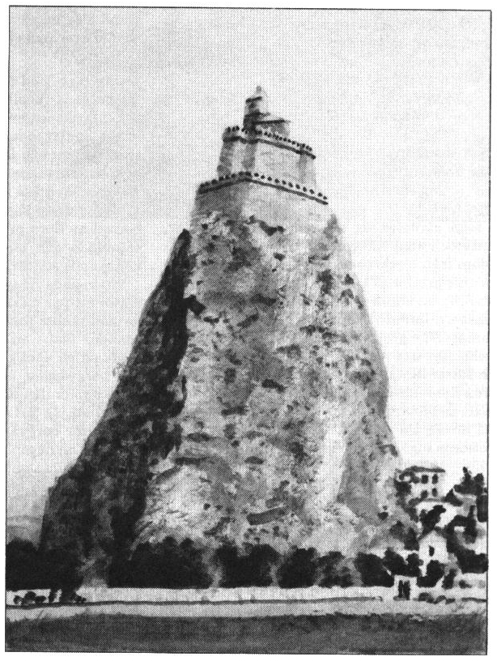
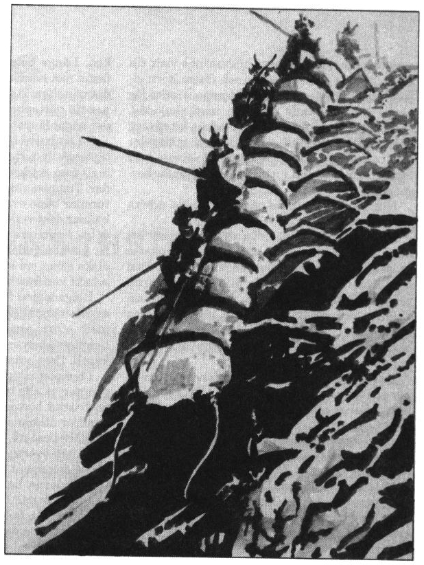

<title>Trinsmyra - Trakorien</title>

# 06. Trinsmyra

## Vumbra

Vi nalkades Vumbra med stilla rodd genom tät dimma. Stadens mistlurar ylade sorgset, men på stränderna larmade musik från flera håll. Rytmerna föll säreget medryckande i mitt öra om än främmande till tonen. Uppenbarligen steg klangen ur ett hamrande på solida metallkroppar blandat med brölet av stora lurar, men även flöjter, klockor, pukor och harpolåt kunde urskiljas.

Som jag senare förstod är musik en viktig del av Trinsmyras liv. Somliga hävdar att världen skulle gå under om musiken tystnade, ty den är gudinnan Inashtars största glädje.

Vumbra är enda staden på det sydliga slättland som kallas Kark. Under århundradet före Paratornas invasion år 530 eO ägde kungarna av ätten Åålskalle säte i Vumbra, dock med måttsam makt, ty trinsmyrer misstror av hävd all överhöghet. Vid invasionen flydde Åålskallarna till bergen i Rung varifrån de än idag leder ett envist motstånd.

Det berättas att Ganfryd Åålskalle upprättade kungamakten sedan styret alltmer övergått till adeln efter milackernas glansdagar. I de dagarna visade man sitt missnöje genom att ligga i lådor framför kungliga sommarborgen i Vumbra.

Knorrarna plägade hamra på medförda plåtar, väsnas med sina magar och gnälla tänder så illt att mjölken skar sig till halvannan mils avstånd. Sådant oväsen kallas därav ”att hålla låda”.

Men under ett adligt missmöte året 428 eO, spikade Ganfryd Åålskalle, som då var konungens härförare, igen alla klagolådor varpå man kastade dem i havet. Detta skedde när de gnölande adelmännen sov sin sötaste sömn och ingen enda slapp undan, men därav kommer uttrycket ”att lägga locket på”.

Det sägs att lådorna efter en tid flöt iland på den lilla ön Myxa som sedan dess har ett övermått herrar, men konungen av Kark var gammal och Ganfryd Åålskalle blev snart hans efterträdare.

Trakoriens kejsare håller i Vumbra tre stora härar och en ansenlig flotta mot härjande barbarer och upprorsmän. Tunga bylsen av snörd asbast klär krigsskeppens sidor ty frihetskämparna använder vildeld som vapen till havs. Denna vildeld är en vätska som blandas av sylvoleum, guano, osläckt kalk och svavel enligt urgamla, hemliga recept. När den sprids över havsytan fattar den eld och flammar med gulgrön låga, förtärande varje oskyddad farkost i sin väg. Asbastskydden gör skeppen tunga och långsamma så att rebellernas smäckra katremasser lätt seglar undan.

Vumbra är vidare en stor utskeppshamn för metaller. Dessa metaller, främst tenn, bly, koppar och silver är Paratorni huvudsakliga intresse på Trinsmyra. Tack vare en vänlig fogde fick jag tillfälle att besöka gruvorna.

## Kark

Jag fick alltså skjuts med en kolkonvoj västerut mot det bergsmassiv som kallas Hymbergond, där paratornierna bryter sin malm. Förvisso lyste denna resa upp mitt kunnande, men det ymnigt dammande träkolet avsett för järnsmältorna svärtade istället ner min lekamen. Våra fordon var bergskärror av en säregen sexhjulig konstruktion, med trenne hjul på var sida satta runt en gemensam axel. Dessa vagnar förmår klättra över varje hinder och dras av klippklättrare, en bergens boskap med gripklor istället för klövar.

Som jag är en älskande och känslig natur, ville jag under resan gärna blanda mig med bygdens folk, men karkernas svallande humör föreföll mig mer skrämmande än lockande.

Ena minuten skämtade de med knektarna i mitt sällskap så att ögonen tårades i skratt, för att i nästa stund fara ut i gräsliga otidigheter över någon bagatell. Lyckligtvis föll svordomarna på rungli, det obegripliga bergens språk som mest liknar barbarbabbel. Detta språk ska äga stor ordrikedom vad gäller känslosamheter, och lämpar sig enligt kännarna väl för poesi och förbannelser.

## Vulferveden

Stundom korsade vi sagolikt släta vägar mot nord, och jag sporde om vilka praktfulla palats de månde betjäna. Man svarade att dessa vägar var stelnade lavafloder från vulkaner i södra Rung. Närmare bergen rinner lavan genom Vulferveden, en skog där ingen människa bör färdas. I skogen härskar vargfolkets drottning Ao’ya, bland karker bättre känd som ”Onda bettet”. Denna ljuspälsade jättevargkvinna ska enligt folktro besitta magiska krafter som skyddar henne mot fällor och pilar. Vargmän från Vulferveden färdas visserligen fredligt över Trinsmyra, men tål inget intrång i skogen, vilket allmänt respekteras.

## Hymbergond

Jag kan inte glädjas över gruvorna i Hymbergond trots att de berikar skönare trakter med sin metall, ty i dessa berg kan skådas mycken grymhet. Horder av slavar bryter malm ur vattensjuka avgrundssvalg där de arma varelserna tvingas leva sin tid utan att någonsin skåda dagens ljus. Man nyttjar såväl missdådare som krigsfångar från kontinenten till gruvdrift under jord, medan daglönare sköter malmfrakten på ytan. Någon stad gives ej, men flera timrade byar har vuxit fram på berget, där väktare och stenbärare lever i svineri, med skökor och rus till främsta frisyssla.

Gruvorna övervakas av kondottiären Cymba och hans män. Denne Cymba är sprungen ur Ilibariens förpestade jord och äger därav ett sällsamt orent sinne.

Kondottiären finner stort nöje i att själv tjäna som bödel, varför jag tvingades beskåda hans falska nuna under en offentlig bestraffning som alla beordrats övervara. Jag förvånades till en början över hans ringa kroppshydda och fagra anlete, som bättre passat en skönsjungande yngling vid något tempel. Emellertid är dessa detaljer ägnade att förvilla, ty aldrig såg jag någon svinga piskan eller hantera de glödande tängerna med större glädje.

Märkligt nog är Cymba högt älskad av sina män. Han ger dem god löning och blott ”Onda bettet” sägs överträffa honom i list.

Jag beklämdes emellertid av bestraffningen, trots att man pinade en våldsverkare, och undvek denna kväll paratorniernas sällskap. En blodstank tycktes mig stå runt rikets tjänare.

På en krog i byn Jyrsind kom jag i lag med en milackisk sjöman på hemvandring. Han var klädd i landets sedvanliga fotsida yllekaftan och hade huvudet omlindat med tygremsor mot kylan. Sjöfararens namn var Hulgemart av S’gaHagly och efter trevande utbyte av åsikter om herrefolket från Paratorna blev vi vänner, varpå han bjöd mig följa honom till hemtrakten.

På borgen Helterhem hade Klamender Gomba ofta varnat mig for milackernas vansinne, men jag tvekade inte ett ögonblick att anta Hulgemarts inbjudan, ty han var en innerlig och ärlig man. Han förklarade att konvojen mot Marjura plägade proviantera i Esakra om några veckor, och lovade föra mig dit i tid.

Nästa morgon vandrade vi så utför Hymbergondbergens kala nordsluttningar som man plundrat på träd för att föda smedjornas eldar. Vi överraskades av en trupp jagande knektar som bemötte oss mycket bryskt tills jag visade mitt färdebrev från Vumbra, en träram med mjuk lera vari erforderliga sigill pressats.

Sedan knektarna lämnat oss, uppförde Hulgemart en glädjedans och prisade Inashtar för vår räddning undan gruvornas mörker. Han ville nu visa mig hur en sann milacker färdas och intruerade mig någon stund i milackisk folkdans.

Vi skuttade alltså under skratt och sång utför berget, och fastän jag föll mer än två gånger tog vi oss innan kvällen så nära Rakma att stadens ljus syntes från vårt läger.

Folket i byarna färdas enligt Hulgemart alltid i långdans, ty så kommer man både längre och lustigare mot sitt mål. Då vi sedemera lämnade Rakma mötte vi en hel rad allvarliga gamla rådsherrar komma hoppande mot staden till fagottens toner. Scenen var så komisk att jag brast i gapskratt, men ingen förargades över detta, ty på Trinsmyra är skrattet Inashters gåva, och den skrattande ärar gudinnan med sin glädje.

## Rakma

Rakma var under 200-talet säte för de galna milackernas regim, och vilar på en halvö i floden Rangindros mynning. Staden omges av imponerande ringmurar, i vilka dock stora bräscher slagits upp på kejsarens order. Flodens södra strand hyser idag en nybyggd trästad där Paratorni handelsmän har sina lager och bostäder. Här kamperar också kondottiären Kakrálgus Piknäsa med sina trupper till kuvnad av uppror och räder från Rung. Härförarens namn kommer av hans vana att i strid bära hjälm med spetsigt visir.

Trots Trakoriska rikets dominans är Rakma trinsmyrernas egen stad, och en munter plats för den välkomne. Gatorna sjuder av musik, vilket håller paratornierna borta, ty oljudet får deras översluga huvuden att värka.

Alla byggnader är uppförda i sten vilket tillåter ohämmat eldande till gudinnans ära. Som bränsle använder man dock sällan ved, utan mest pimperkork, en porös korall som i stor mängd flyter iland med västvinden. Under vår- och höstfestligheterna anläggs bränder längs gatorna och unga män visar sin manbarhet genom att springa över lågorna tills stövlarna glöder.

Folket i Rakma, liksom i hela Milacke har minsta möjliga samröre med Paratorna, men handeln är livlig mot Palamux, och i synnerhet mot staden HOXOH, där folket är av liknande kynne. Det ryktas även om oheliga förbindelser med Kargom, vars språk ska äga någon likhet med rungli.

## Milacke

Vi dansade omsider vidare genom det sköna Milacke, där bergen reser sig som spjutspetsar ur kulle och slätt. På bergstopparna tronar stundom befästa borgar, men i den vildaste fantasi förstår jag inte hur dessa fästen kunnat byggas annat än av fåglar. Hulgemart förtalte att slotten är mycket gamla, ty Milacke blomstrade redan när Baskimer Brushane stred mot de grå eminenserna i Laabne, i en tid då Paratorna blott befolkades av skecker och av de halvapor som är rikets fäder. Klippan under dessa slott är inte sällan genomborrade av lönngångar likt en maskäten stubbe. Vid Paratorni invasion intogs inte ett enda fäste med strid, utan knektarna tvingades svälta ut borgfolket med stor möda. Någon plundring kom heller aldrig till stånd ty man förhandlade om fred när vintern kom.

Annars är klimatet på Trinsmyra mindre strängt, fastän blåsigare än på Paratorna eftersom fuktiga havsvindar från väst plägar täcka ön i dimma. Ej heller gives mycken torka sommartid.

På kullarna i Milacki nejder skådade vi under vandringen ett flertal åldriga gravsättningar. Jag ville som bildad man gärna skåda dessa gravar närmare i stenen, men Hulgemart räddes av vidskepelse och skyddade sina ögon i deras närhet.

Större klippblock balanserar ofta på dösarnas topp. Den som bringar ett sådant block på fall drabbas enligt folktron av den dödes förbannelse. Ja, den som blott ser ett gravblock falla utan att själv ha skuld däri kan drabbas av olycka och sjukdom. Stenarna tjänar således till gott skydd mot plundring av graven, vilket sannolikt är deras egentliga syfte.

## Pelarbergen

Norr om floden Obbola beträdde vi ett märkligt landskap. Bergssidorna blev allt fler och allt brantare tills vi vandrade genom en skog av gigantiska stenpelare. På flera pelarkrön brann eldar i natten och säregna toner hördes. Hulgemart förtalte att primitiva stammar kan leva isolerade på samma platå generation efter generation. De jagar i snårskogarna med sina tama falkar, odlar rotfrukter och samlar regnvatten till dryck. Genom syskongifte blir dessa stammar allt mer människofrämmande så att ingen längre vill ha med dem att göra.

Flera enstöriga trollkarlar ska även ha tagit boning i avskildheten på pelarbergens platåer.

## S’gaHagly

Bortom pelarklipporna, på sluttningarna upp mot högbergen vandrade vi omsider in i byn S’gaHagly där vi mottogs med ett överdåd som kunde ha anstått hemvändande hjältar. Till en början smickrades jag av uppmärksamheten, men snart stod det klart att vår ankomst blott var en förevändning för glammande, som man annars funnit andra anledningar till.

Byn lever huvudsakligen av lädermusfångst i bergens många vulkaniska grottor. Överallt runt husen hängde lädermöss till tork på träställningar eller uppspikade som våldsmän på stegelhjul.

Man utrustar sig till sådan jakt med håv, lunta och små näverdosor fyllda med gyllenpollen från bjeckrebusken, varefter man vandrar in i grottorna till ljus av svaga lyktor. Då tätsniffaren känner lukt av lädermöss, skärmas ljuset av, luntorna tänds och jaktlaget smyger framåt. När grottväggarna känns hala av exkrementer tror man sig vara i lädermuskolonin och sätter luntan till en dosa, vars gyllenpollen strax flammar upp. Ljusblixten bländar djuren så att de flaxar runt utan mål och lätt kan fångas i håvar. Då man ibland stöter på svartfolk i grottorna ingår alltid några krigare i truppen.

## Rung

En morgon övertalades jag att själv delta i en lädermusjakt, men kom vilse i mörkret sedan lyktan släckts. Jag irrade flera timmar under jord innan jag genom gudarnas försyn återkom till dagen i en trång, främmande dal. Som i drömmen hörde jag ljuv musik spelas, och sedan mina ögon vants vid ljuset skådade jag en ung kvinna sitta invid en bergskälla med sin klockerin i knät. Hon hade fäst långa metallspröt på fingertopparna med vilka hon lockade ett underbart regn av toner ur instrumentets många glasklockor.

Emellertid upptäckte jag i nästa ögonblick hur en förfärande vätte just höjde sin båge till skott mot musikanten helt nära platsen där jag stod. Ingen av de två hade upptäckt mig, men då jag upphov ett varningstjut, bytte odjuret strax mål och riktade istället pilspetsen mot mitt bultande hjärta.

I handen höll jag fortfarande den brinnande luntan och min sista dosa gyllenpollen. När jag skräckslagen ryggade tillbaka halkade jag och råkade doppa luntan i pollendosan så att pulvret flammade upp och bländade vättens grisögon. Pilen ven förbi min hals på ett hårstrås avstånd, men gjorde dock ingen skada. I denna stund blev mig sinnesrörelsen övermäktig, och jag föll avsvimmad till marken.

Jag blev med denna händelse presenterad för bergens rebeller, ty när jag åter kom till sans, flockades en skara människor runt mig, ivrigt snattrande på rungli. Flera personer trädde fram och kysste mig så häftigt att jag nästan svimmade igen, däribland kvinnan jag räddat men också flera män.

Bredvid oss låg vättens döda kropp genomborrad av flera pilar. Några barn i sällskapet skändade den med knivar, som träning för kommande strider.

Nu ropade någon. Fler vättar närmade sig, varför ett par märkliga riddjur leddes fram, till formen skapta som jättelika tusenfotingar. Jag spändes fast i en av de många sadlarna och bjöds på en vådlig färd. Djuren manades rakt mot bergväggen, men stannade inte utan fortsatte uppför den lodräta klippan i oförminskad fart så att jag tjöt av skräck. Ritten gick uppför och nerför bergväggarna vilka i Rung stupar brantare än någon annanstans.

I mer stilla samtal lärde jag att djuren kallas skolopoder och kan bli upp till trettio meter långa. De föds i vissa dolda fjordar på norra Trinsmyra där havsormarna har sina kyrkogårdar. Där lever de asätande skolopoderna av kadavren, och även tama exemplar måste årligen föras till platsen för att inte dö, ty något i ormarnas kroppar är nödvändigt för deras välgång.

## Ard Gachlaf

Vår färd fick sin ände på en himmelshisnande skön plats, staden Ard Gachlaf anlagd på en grönskande högslätt dit ingen kommer på vanliga stigar. Från denna plats syns rykande vulkaner bland berg så höga att de förlorar sig över molnen. Långt under oss skymtade skogar av vitträ, den jättelika mossa som även växer ymnigt på Marjura.

Man förde mig in i berget där stadens boplatser ligger. Jag förvånades över att se mängder av dvärgar som uppenbarligen bor i största sämja med runglerfolket. Enligt sägnen ska dessa dvärgar ha kommit vandrande som krigsflyktingar från östra kontinenten i tidernas begynnelse och träffat trinsmyriska handelsmän i nuvarande Ransard. Hövdingarna i Rung bjöd dem fristad på Trinsmyra för att bruka de stora metallfyndigheterna, och så stor var dvärgarnas nöd att de utstod skeppsfärden mellan fastlandet och nordön för att få ro. Av naturliga skäl råder en annan sämja här än i Ziddisbar dit dvärgarna fördes som slavar, även om bergsfolket också har egna, människofria städer. För första och sista gången i mitt liv skådade jag dvärgkvinnor. Seden bjuder att de rakar skägget för att inte visa främlingar sitt rätta ansikte, varför de lätt gick att skilja från männen.

Jag ställdes inför stadens hövding och fick berätta utförligt om hela min resa. Trots en viss välvilja över min hjältemodiga insats, var detta utan tvivel ett förhör. Man ville övertyga sig om att jag inte var en paratornisk spion. Vid förhören deltog en obehaglig individ med svartmålade läppar, en medlem av demonen Ghumgakks brödraskap. Hans sätt att liksom kameleonten röra på ett öga i sänder, gjorde mig illa till mods men tycktes inte bekymra runglerna.

Då kvällen kom sattes jag i bekvämt men säkert förvar. Klockerinspelerskan som jag räddat från vättens pil besökte mig iklädd den vackraste dräkt av bralorgiskt algsiden. För att lindra min ensamhet tillredde hon oss en måltid av grottsvamp, serverad med honungsvin och underhöll mig med spel på sin klockerin. Därtill visade hon sig förfaren i många andra konster. Hennes namn var Ghamgonli och hon var hierodul i gudinnan Inashtars tjänst.

Man gjorde uppenbarligen efterfrågningar i byn S’gaHagly under natten, ty då morgonen grydde, bringades jag hälsningar från sjömannen Hulgemart. Efter detta skänktes jag större frihet i Ghamgonlis sällskap.

Runglerna är ett krigiskt folk. Dagligen tränar man stridskonst på fälten utanför staden. Krigarnas rustningar är alla olika men mycket vackert arbetade, ty i denna konst tävlar landets smeder. Man hamrar hjälmarnas visir till skrämmande demonmasker och fäster horn eller vingar på hjässan. Speciellt imponerades jag av de överraskande anfallen med skolopod. Djuren kom rusande utför en lodrät klippvägg ner mot träningsfältet där en rad måltavlor stod uppställda. Ryttarna avlossade sina pilar i farten, och försvann i nästa sekund uppför berget igen.

Hur skulle Paratorna någonsin kunna erövra ett sådant folk?

Jag frågade Ghamgonli varför man inte genast återtog hela Trinsmyra och återinsatte Åålskallarnas ätt om man önskade detta. Den milda hierodulen svarade mig att erövrarna var ojämförligt starkare på slätten i Kark och Milacke, och att ett krig skulle ödelägga dessa trakter. Därtill kan ingen sann rungler lämna bergen under längre tid, ty med visshet skall all annan mark snart bli hans död.

Detta senare höll jag för vidskepelse, men när jag omsider själv lämnade Rung drabbades jag tillfälligt av en svaghet jag aldrig tidigare känt. Det är nu min övertygelse att något i Runglerbergen faktiskt skänker sådan kraft att de urfödda blir sjuka intill döden på alla andra platser.

Mitt avsked blev emellertid ett styng i hjärtat, ty jag trivdes gott i Ghamgonlis sällskap och har aldrig känt större tillfredsställelse med min kropp än i dessa berg där jag stannade någon vecka. Ändå ville jag inte missa konvojen till Marjura som redan avgått från Tricilve. Runglerna avlämnade mig således i en by nära Esakra där en vänlig korgflätare lovade föra mig till stadsporten sedan jag vilat mig någon dag. Jag tog ett ömt farväl av hierodulen och skänkte henne en liten alvklocka av silver från Simenard Froim i Tricilve, att fästa på klockerinen till mitt minne.

## Isakra

Korgflätaren och jag red varsin åsna över de karga och ödsliga hedarna mot Isakra. Ingen odling bedrivs ovan jord i denna trakt ty regn och stormar piskar Trinsmyras nordliga delar. Folket är fåtaligt men lever drägligt av fiske och fårhållning.

På många platser strömmade ånga fram ur lavalandskapet, men åsnorna skrämdes ej därav, ty sådan var nu den värld de kände. Vi kom således lyckligt fram till staden.

Isakra är en av Trakoriens äldsta städer, med en historia som förlorar sig i urtidens töcken. Länge betraktades staden som det sista fästet mot nordens tomhet, ett lås på porten mot det oändliga Tiamat. Bebyggelsen sträcker sig ner till vattenbrynet i en djup fjord som erbjuder något lä mot havsstormarna.

På en halvö i hamninloppet tronar det hemlighetsfulla alltemplet, Etemenanki, lika gammalt som staden och tillägnat världens alla gudar. Templet växer ständigt med nya kapell och tunnlar både ovan och under jord så att ingen känner dess verkliga utbredning. Det ryktas om dolda kammare med underligt målade altaren for glömda gudar, om trappor ner till underjordiska sjöar, om hemsökta grottor och bottenlösa schakt varifrån ingen återvänt levande.

Helgedomen förvaltas sedan urminnes tider av Etemenankerna, en fristående riddarorden med stort anseende. Riddarna övervakar templets oberoende och anvisar platser for nya kapell. Dess präster är stora astrologer.

I templet möter man rungler, ransarder, kargomiter, ja alla världens folk, ty Etemenanki är en fristad bortom världsliga makter, dit man vandrar utlämnad åt gudarnas välvilja.

Själv besökte jag Piondermunkarnas bibliotek i den översta kretsen, där jag fann många unika dokument rörande malmernas tillväxt.

Pionderna har sitt ursprung i Maghurbal, och jag tog mig friheten att lämna rekommendationer från fader Iarmons av Frand.

Fisket är annars Isakras enda näring av vikt. Stim av småval vandrar ständigt längs kusten, och särskilda sångare, kallade sirender, söker locka in djuren i fjorden genom att härma valarnas sång. Sirenderna sitter på speciella stensäten invid vattnet och sjunger genom olikstora bronsrör som fortsätter ner under ytan. En god sirend lönas mycket högt, och tävlingar i valsång hålls regelbundet.

Det mästerskap jag bevittnade avbröts emellertid genom svavelkonvojens ankomst. Från konvojens flaggskepp, en bepansrad galbalon, flammade rikets baner med tapiren och den gyllene nyckeln. Trumpetstötarna smattrade över vattnet så att fjorden raskt tömdes på eventuella valar.

Jag gick samma eftermiddag ombord på kavarellen ”Vågdansaren”.

Redan två dagar senare svängde vinden till syd och vi avseglade mot Marjura.

Men det är en helt annan historia.

Brior Brådfot
invid Gryppas vik
Anno 618 eO
