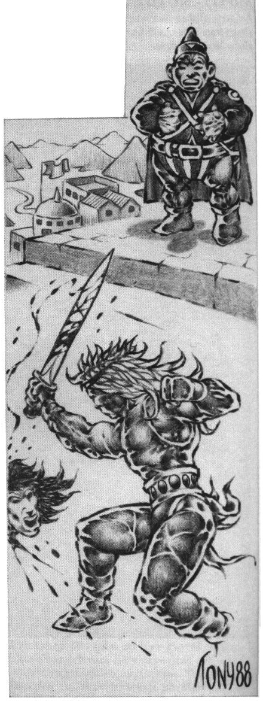
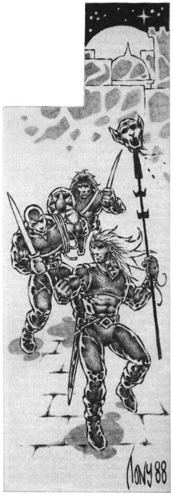

<title>Trakoriskt maktbruk - Trakorien</title>

# 09. Trakoriskt maktbruk

**Villkor:** FV Administration/juridik eller FV Överklasstil eller FV Områdeskännedom. FV över tio i de aktuella färdigheterna ger automatiskt tillgång till hela artikeln.



## Översyn

Det politiska styret på öarna har genomgått tre faser:

#### I. Feodalt välde i Lasemos.

Det tidiga Lasemos behärskades helt av adelssläkter med oinskränkt makt över sitt eget område. Någon kung fanns inte utan varje område var ett eget furstendöme. Ständiga strider pågick mellan riddarna, men folket blandades inte in mer än genom skattepålagor.

#### II. Klavykiska rikets kejsarvälde.

Klavykiska riket med Fontra Cilor som huvudstad grundades av flyktingar undan Lasemosi strider, vilka var måna om en sammanhållande makt. Man valde därför en kejsare på livstid, som till hjälp hade ett adelsmannaråd, ”bodâken”. Fortfarande hade adeln all makt, och varje släkt härskade över sina län, men med skyldigheter gentemot riket.

#### III. Trakoriska rikets oligarki

Den Kastykiska omvändelsen (se avsnitt om historia och religion) undanröjde alla gamla principer, moralbegrepp och hämningar på Paratorna. Tänkaren Pisarus yttrade sina berömda ord ”Slå mot allt! Krossa det bräckliga, ty därav ska enbart det hållbara äga bestånd!”, vilket den samtida profaneten Makulon Nihivelli tolkade som att inget är heligt, utan bara mer eller mindre ändamålsenligt.

Därmed var grunden lagd för det praktiska styre som kommit att prägla Trakorien på senare tid. Man dyrkar officiellt gudinnan Kastyke på Paratorna, men hon vänder sig sällan mot politiken, eftersom hennes första bud lyder:

*”Kastyke älskar den som älskar sig själv.”*

Styrelseformen med en kejsare och ett stort adelsmannaråd, Bodâken, har man plagierat från det gamla riket på Palamux, men systemet är mindre stelt än fordom. Kejsaren väljs på livstid, men titeln går inte i arv. Härskarens livstid kan dessutom bli nog så kort om missnöje uppstår.

Från den stora rådsförsamlingen avdelas mindre grupper att sköta olika sysslor. Sådana grupper kallas limbes (=lemmar, singular: limba) och representerar den mångarmade Kastykes händer och fötter. Några viktiga limbes är:

* Mana Xifa (Svärdshanden) — rikets försvar
* Mana Friga (Kalla handen) — lag och rätt
* Poda Arux (Guldfoten) — rikets finanser
* Mana Extenda (Rikets långa arm) — utrikespolitiken
* Mana Phena (Havshanden) — sjöfart och flotta
* Poda Snica (Framfoten) — handeln

Underavdelningar till limbes kallas digeter och falaner (fingrar och tår).

Kejsaren har fördelen att sitta med i alla limbes, vilket ger honom en unik inblick. Han har dessutom femdubbel röst i Bodâken.

Enligt klavykisk tradition bör inte adelsmän ägna sig åt köpmannasysslor eller bankaffärer, något man håller mycket strikt på i Trakorien.

Det berättas att hirdmannen och mästerfäktaren Praanz da Kaelve utmanade rådsherren och baronen Gonynter da Karramax på duell sedan denne sålt ett parti spannmål till några svältande bergsbyar för en spottstyver. Den mildhjärtade baronen tvingades till en offentlig ursäkt for sitt ”tölpartade krämeri”, och måste bränna säden inför ögonen på de gråtande sändebuden från bergen. Det uppdagades senare att Praanz da Kaelve fått betalt av sädesmäklarnas skrå för att ”ståndaktigt stå vid de höge och gamble värden”, men däröver förargades ingen. Praanz da Kaelve fick tvärtom ord om sig att vara en listig karl, medan herr Gonynter tvingades lämna sitt ämbete vid Poda Arux’ kansli.

Adelsmän ägnar sig alltså personligen knappast åt handel, vilket ger dem begränsade inkomstmöjligheter. Istället har det utvecklats ett klientsystem, där skrån och enskilda köpmän betalar rådsherrar för att bevaka vissa politiska intressen. Adelsmän kan också investera pengar i handelsbolag så länge det sker diskret eller via bulvaner. Regeln är att ju rikare och mäktigare man är, desto mer kan man tillåta sig utan att befläcka sin heder.

Detta system av beskydd och mutor leder förstås till ständigt fiffel i kulisserna och inte sällan till repressalier och politiska mord, men ingen vill riktigt ändra på det.

De få som försöker överlever sällan särskilt länge.

Förutom Bodâken finns en folkförsamling där rika borgare sköter en del praktiska frågor. Folkförsamlingen har i vissa fall begränsad vetorätt gentemot Bodâkens beslut.

### Politiskt styre i provinserna

Farsegels hemön tillämpar paratornierna på varje plats det styresskick som verkar mest användbart. I ett fredligt land som betalar sin skatt till riket utan trassel och som inte gör uppror i onödan, ser man gärna att de lokala härskarna sitter kvar. Man tillåter dock inte några stora härar bortom rikets kontroll. På mer osäkra eller betydelsefulla platser installerar man däremot en primus prokurator som bara tar order direkt av Mana Extenda, eller en prokurator som tjänar under länsherren eller primus prokuratorn. (Skillnaden mellan dessa båda senare är att länsherrar bara utses sedan provinsen blivit en officiell del av riket.) Under prokuratorn sköter fogdar själva maktbruket.

Parallellt med detta civila styre finns militärmakten.

## Militär makt

Den trakoriska militärmakten består av legoarméer, hirder, roteknektar, folkmilis och privata arméer.

### Legoarméer

En legoarmé hyrs ut av sin härförare, kondottiären, som tecknar kontrakt med den uppdragsgivare som erbjuder bäst villkor. Kondottiären betalar ut sold till sina män, vilka själva äger sin utrustning.

Fördelarna med legotrupper är att rikets befolkning kan ägna sig åt nyttigare sysslor än krigstjänst. Man har en stående armé av yrkeskrigare som vid större fara dessutom snabbt kan träna upp folkmilis. Ett vapenlöst folk frestas inte heller så lätt till uppror och inbördeskrig i missnöjestider.

Nackdelarna är att legotrupper saknar djupare lojalitet och kan gå över till fienden om det kniper. Detta händer dock mera sällan eftersom en illojal kondottiär snart får dåligt rykte och därmed inga kontrakt. Legoarmén sviker i praktiken bara om uppdragsgivaren inte betalar eller utsätter den för omåttligt stora faror.

Ofta anklagas legotrupper för att spara sin svett och sitt blod, speciellt i strid mot yrkesbröder. Sant är att en legoarmé knappast kämpar till sista man om andra alternativ finns.

Skulle kondottiären dö kanske männen kan enas om en ny ledare, annars skingras armén och soldaterna söker ny anställning eller bildar rövarband.

En kontraktslös legoarmé kan utgöra en stor fara för sin omgivning. Det har hänt att man plundrat byar och krävt lösen av städer. I några fall har också kondottiärer installerat sig som härskare över mindre furstendömen.

Eftersom Trakoriska riket till stor del förlitar sig på kontrakterade legotrupper måste man skydda sig mot sådana otrevliga överraskningar. Man anlitar hellre många små arméer än några få stora för att ingen enskild kondottiär ska bli för mäktig. Dessutom placerar ofta den fruktade säkerhetspolisen, Digeta Longa — lagens långa finger, spioner bland legotrupperna för att avslöja förrädare.

Det berättas om äventyraren Ramombo, att han kallades till Moherra med sin här for att befria trakten från en besvärande orcherstam. Då uppdraget utförts ville kondottiären själv välja sin lön från stadens rikedomar som han ansåg sig ha räddat. Han uppmanade därför köpmannagillet att föra sitt guld och sina skönaste döttrar till honom, ty även kvinnornas väna hull hade han frälst från slemma svartlabbar och således gjort sig förtjänt av.

Ramombo höll i kvällningen gille med sina officerare för att fira segern, men då han nästa morgon vaknade ur sitt rus låg hans vänstra långfinger prydligt avkapat på en silverbricka invid bädden.

En sådan varning kallas för ”fingervisning” eller ”att ge någon fingret”, och missförstås sällan, så ej heller av kondottiären Ramombo, som genast drog sig tillbaka.

### Hirder

Hirderna är rikets egna yrkestrupper som lyder direkt under Bodâken eller kejsaren. Rikstrupperna nyttjas där man inte törs lita på legosoldater, t ex till huvudstadens försvar.

Hirdens befälhavare kallas hirdman om han är underställd den lokale prokuratorn, och storhirdman om han själv är primus prokurator eller lyder direkt under Mana Xifa.

Bara adelsmän från Paratorna eller Palamux kan bli hirdmän.



### Roteknektar

Roteknektar är lokala förmågor som underhålls av en rote, dvs av ett visst antal hushåll. Roteknektarna upprätthåller ordningen i byarna, sköter stadsvakt och skatteindrivning under den lokale fogden. De deltar bara i nödfall i rent militära operationer.

### Folkmilis

I ofärdstider kan vanligt folk snabbutbildas till rikets försvar. Ofta lyder sådan folkmilis under den lokale kondottiären eller hirdmannen.

I fältslag händer det att kondottiärer skickar fram folkmilis för att dra på sig fiendens värsta missiler och trollformler, och på så sätt sparar sina egna män. Sådan taktik kallas ”svart slagöppning” och anses knappast vara rumsren.

### Privatarméer

Adelsmän med egna gods är berättigade att hålla en mindre armé för privat bruk. Om styrkorna ställs till rikets förfogande någon månad per år får adelsmannen vissa skattelättnader. Myndigheterna har dock synpunkter på omotiverat stora privatarméer. Man tillåter större trupper i gränstrakter eller i skogar med rövare och svartfolk, än man gör i pastoral jordbruksbygd.

### Flotta

Krigsflottan ägs till största delen av riket under Mana Phena, men enheter av kondottiärtyp är vanliga, framför allt som fritt arbetande kapare i mer smutsiga ärenden och som piratbekämpare (se även avsnittet om sjöfart).

## Civilt och militärt styre på Saphyna

Saphyna är numer en del av riket under officiellt styre direkt från Tricilve. I praktiken har den Palamoxiske Storhirdmannen och Primus prokuratorn Ripigus Oxenklöv da Nastrôl ensam makt över hela Saphyna och är därmed sannolikt den mäktigaste mannen i Trakorien. Han betraktas närmast som ett helgon och är såvitt känt fullständigt omutbar, bunden av heliga löften till Shamash. I Gudiena har kondottiären Bertanwund da Vraan befälet. Prokuratorer finns i Frimbole Olvi, Gudiena och Gaz Oloel.

Saphyna är en ganska fredlig ö, men hotas potentiellt av starka riken i söder och av pirater och raugoner. Detta förklarar den relativt stora militärstyrkan.

### Truppfördelning

#### Gaz Oloel

```
Truppslag       Manipler legotrupp/hird
Fast garnison             8/2
Tungt kavalleri           2/2
lätt kavalleri           10/-
Hippogriffkavalleri       -/1
Tungt infanteri           3/2
Lätt infanteri           14/1
```

#### Frimbole Olvi

```
Lätt kavalleri            1/0
Lätt infanteri            2/1
```

#### Krindenmaar

```
Lätt infanteri            2/1
Tungt infanteri           1/0
```

#### Gudiena

```
Fast garnison             4/1
Lätt kavalleri            2
Tungt infanteri           5
Lätt infanteri           14/1
```

#### Korjulme

```
Endast privata styrkor
Lätt infanteri            6
Lätt kavalleri            4
```

## Civilt och militärt styre på Palamux

Palamux har en särställning som Trakoriska rikets modersö. För att inte väcka de urgamla religiösa och ideella krafter som fortfarande genomsyrar dess befolkning, har man från Paratorna sökt vinna ön med diplomati snarare än med vapenmakt. Det finns ett talesätt i Tricilve som säger att ”Då säden sinar sänder man nötter till Saphyna och soldater till Trinsmyra, men till Palamux en tänkare, ty palamoxiern kan tugga på sitt grubbel och därav mättas”.
