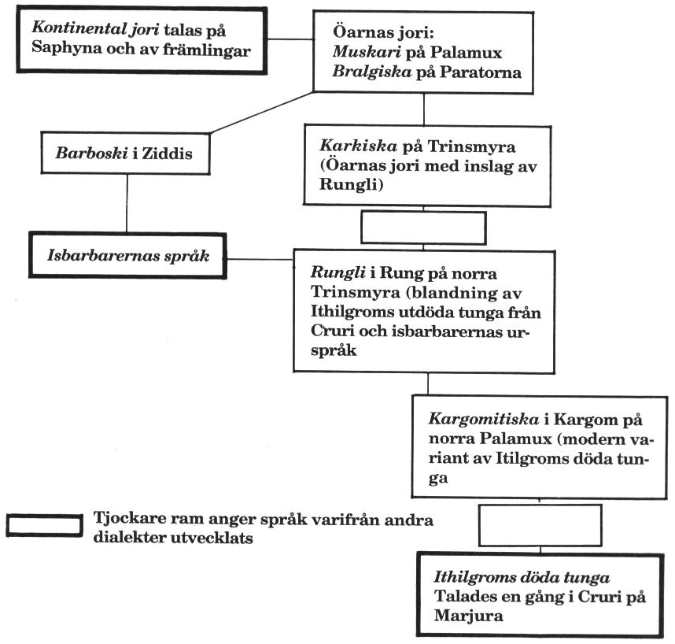

<title>Öarnas språk - Trakorien</title>

# 12. Öarnas språk

**Villkor:** FV Språkkunskap.

En person som kommer till Trakorien söderifrån talar sannolikt en dialekt av kontinental jori, dvs det döda kejsardömet Jorpagnas språk, som talas på hela centrala kontinenten inklusive Zorakin, Kardien och i Kandra.

En person som är född på öarna talar den dialekt som är vanligast i hans hemtrakt. Se bild över detta. På bilden kan man se hur språken är släkt. Om två personer med olika språk försöker prata avgör tungornas släktskap hur väl de förstår varandra. Räkna hur många rutor som skiljer och subtrahera avståndet från personernas FV Tala jori. Det FV som återstår beskriver hur motparten uppfattar talet. Observera dock att man kan missförstå varandra även om orden går fram.

Vad gäller satenu (älviska) så är detta mer universellt. Detta innebär att alver förstår varandra världen över, och att lärda människor från olika länder ofta kommunicerar på satenu istället för på människospråk.

