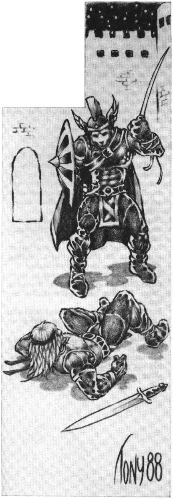

<title>Äventyrsuppslag - Trakorien</title>

# 19. Äventyrsuppslag

En fantasifull spelledare hittar säkert egna uppslag till äventyr i Trakorien, men här följer ändå några trådar att spinna vidare på för den hugade.

## 1. Tatueraren från Kargom

På Paratorna är det högsta mode att dekorera sin kropp och tatuerarnas priser stiger stadigt. När kroppsristarnas mästare, Xelimogga från Kargom, ankrar med sin kavarell längst ute i Siolas hamnbassäng, blir den tyste, exotiske mannen snart anlitad av de allra rikaste i staden. Ingen behärskar som han tatuerarkonsten, vilken i Kargom har uråldriga anor. Hans målningar i de heliga, djupblå färgerna betalas med tusentals trakiner. Om nätterna hörs hans djuriska åkallan av Kargoms hedniska makter, men inga nyfikna släpps ombord.

Så en morgon är skeppet borta.

### Kalla fakta

Xelimogga är i hemlighet en månpräst av den fanatiska Ptaklunakretsen, vars medlemmar tveklöst offrar livet för sin tro. Ptaklunerna anser lykantroper vara heliga varelser och anfalles inte av varulvar eller andra mångalna. De underliga ljud som nattetid hörs från Xelimoggas båt kommer från en fjättrad varulv. Tatueraren samlar saliv från varulven och blandar i sin färg för att sprida sjukdomen på Paratorna, en ö som han hatar. Orsaken till detta hat är att hans gård med flera släktingar bränts ner till grunden vid en trakorisk straffexpedition in i Kargom. Specifikt letar han efter expeditionens ledare, kaptenen Frasica, som nu tjänstgör vid hamnens hird i Tricilve.

Tatueraren lämnar Siola innan fullmånen för att inte förknippas med eventuella varulvar, och seglar då mot Tricilve. Xelimogga räknar med att avslöjas förr eller senare och söker då ta sitt liv hellre än att fångas. Konfronteras han med angripare söker han sticka dem med sin varulvsnål som en sista hämnd.

Efterforskningar kan avslöja att Xelimoggas skepp ägs av den ilibariske silverhandlaren Kawsa da Krafans, som även hyrt besättningen och soldaterna. Silverhandlaren drivs av ilibarernas sedvanliga patriotiska hat mot södra Paratorna. Dessutom har hans dotter gått under i drogmissbruk som han skyller på bralorgerna. Kawsa räknar med att inte avslöjas, och ser fram mot ett stigande silverpris om varulvar börjar uppträda.

#### Spelarna kan stöta på komplotten så här:

* Man kan vara oförsiktig nog att själv anlita tatueraren.
* En präst kan få besök av en förnäm person som anar sig vara varulv och behöver själavård.
* Man kan anlitas för att undersöka ett antal mord i Siola, där offren slitits i stycken.
* En varulv kan ha dödats, varvid en färsk tatuering syns på kroppen.
* En besättningsman på Xelimoggas båt kan muttra om mystiska utlänningar på någon hamnkrog.

Xelimoggas skepp skyddas av ett dussin välbetalda, mycket goda stridsmän.

Om det kommer ut att tatuerade människor är varulvar blir det sannolikt upplopp och flera lynchningar av oskyldiga. Eftersom bara de rikaste och mäktigaste anlitat Xelimogga blir det politiska läget mycket ansträngt.

## 2. Raugonernas fångar

Rollpersonerna gästar en kustby i Lasemos eller på västra Saphyna. Byfolket är gästvänligt, men en förstämning råder eftersom en fiskebåt med tre fiskare försvunnit någon vecka tidigare.

Märkligt nog dyker en morgon en gråalv upp i sällskap med en av de saknade männen. Den försvunna båten stoppades enligt sjömannen av raugoner och besättningen fördes till insektoidernas flytande koloni. Samtidigt befann sig gråalver bland raugonerna för att byta till sig purpursnäckor från de stora djupen. Man kunde köpa fritt ett av offren, men de andra två var inte till salu eftersom en av insektoidernas honor snart skulle kläcka larver så att färskt kött behövdes på kolonin.

Byborna blir mycket upphetsade och vill leja äventyrarna att leda en befrielseaktion. Emellertid har man inga krigsskepp eller någon annan stridsutrustning att tala om. Gråalverna kan, av sympati med fångarnas släktingar, övertalas att visa räddarna till raugonerkolonin, men de är bundna av heliga fredslöften och deltar inte på annat sätt.

Samma kväll löper en trakorisk katremass in i byns hamn. Skeppet ska snarast möjligt föra Bodâkens ambassadör Wilgynard da Hiltre till Bzegusta, men har tvingats i hamn på grund av en trasig rodermast. (Befinner man sig i Lasemos har man kommit ordentligt ur kurs i en storm och har extra bråttom.)

På katremassen finns sylvoleumtunnor som kan hivas iväg ett tjugotal meter med en enkel katapult, därtill två arbalester och småvapen till ett tiotal män utöver de tio soldaterna ombord.

Ambassadören vägrar emellertid styvnackat att riskera sitt uppdrag ”för några fattiga havsluffares skull”, och lånar inte ut skeppet. Han viftar med kejsarens lejdebrev och kräver mat och logi, samt därtill hjälp av byns timmermän. Katremassens kapten, Birdner Våghals, och hans besättning sympatiserar med byfolket. De skulle gärna ta ett nappatag om det lät sig göras, men lyder helt under ambassadören.

## 3. Shamashs finger

Rollpersonerna blir bekanta med Kalyphard Vidfärde, en lärd resenär och munk av Ambaquaorden. Kalyphard var en gång lärjunge hos den mycket aktade vetenskapsmannen Cambalum Vise av Lasemos, vilken enligt gängse tal försvann vid en expedition i Krindenland år 593 eO. Emellertid har munken fått anledning att betvivla denna historia. Han köpte nyligen sin gamle mästares hus i Maravelda, och fann under reparationsarbetet en pergamentsamling i ett dolt utrymme. Pergamenten berättar om Cambalums sista projekt; att söka förklaringen till de underliga fenomenen i Krindenlands landskap.

Enligt Cambalums teorier uppstår ett visst magiskt spill varje gång en trollkarl läser en besvärjelse. Spillet kan påvisas genom att släppa dun runt den aktive magikern. Cambalum fann därvid att magispillet alltid störde dunens fall mest i en viss riktning. Genom att upprepa försöket på olika platser i Trakorien, gjorde han iakttagelsen att spillet alltid riktas mot shamashernas heliga glasklippa utanför halvön Ziddisbar, det s.k. Shamashs finger. Uppenbarligen suger kristallklippan åt sig små magiska strömmar från hela kontinenten. Cambalum upptäckte vidare att de magiska krafterna, sedan de väl sugits in i kristallen, samlas till ett enda utgående knippe, riktat mot Krindenland tvärs över Saphynersundet. Krindenlands instabila naturlagar skulle alltså bero på ett okontrollerat magiskt flöde till regionen.

Lönnfackets märkligaste pergament är skrivet av Cambalum tidigt år 594 eO, året efter den lärde mannens påstådda död under expeditionen till Krindenland. Där berättar Cambalum att han besökt Krindenland under skydd av stark antimagi, och att han där sett något fruktansvärt. Texten är hastigt nedrafsad och svårtydd. Cambalum talar om revor i den uppluckrade ”världshuden”, och om hur något söker ta sig in genom revorna från en annan och grymmare värld. Han berättar att han tänker resa till Soblak för att träffa en viss Enu Tiamfa vid shamashertemplet för att diskutera hur kristallklippan ska kunna förstöras. Pergamentet slutar med denna föresats, och något mer finns inte att läsa.

Kalyphard är övertygad om att Cambalum visste vad han talade om. Detta kan innebära att hela världen är i stor fara om inte Shamashs finger förstörs.

### Kalla fakta

* Cambalum Vise mördades diskret av fader Tiamfa, som nu är en av de tretton krystalokraterna i Albarunzia. Brottet har plågat prästen i alla år, men han såg det som nödvändigt. Längst inne gnager en osäkerhet om att Cambalum verkligen hade sett något farligt i Krindenland.
* Shamasherna skulle flå den levande som som planerar att förstöra deras heliga glasklippa.
* En god geolog vet att varje kristall har en svag punkt. Ett tillräckligt hårt, välriktat slag mot punkten kan splittra kristallen.
* En god geolog kan i dagsljus och på några dagar finna den svaga punkten i Shamashs finger. Punkten ligger i vattenlinjen mot sydost.
* För att splittra klippan krävs en kraftig stöt; t.ex. av en rammande galbalon, eller av en rasande narval.
* Narvalar med ett kraftigt noshorn finns i Trakoriska sjön. Under den tidiga vinterns parningstid anfaller hannarna besinningslöst allt gult. Det har hänt att gulmålade skepp rammats i sank av ilskna narvalar.

## 4. Nitlotten

Äventyrarna befinner sig på Paratorna om hösten, då en budbärare lämnar dem dyrbara kläder och ber dem träffa hans herre i Tricilve, den rike tyghandlaren och sömmaren Sansigald Silkeshand da Kamasti. Hans herre behöver hjälp av några orädda män och äventyrarna skulle passa alldeles förträffligt.

Då man anländer till palatset visar det sig att tyghandlaren på pricken liknar en av rollpersonerna. Sansigald förklarar sitt ärende:

Frihetsspelen närmar sig och därmed ödeslotteriet i vilket en adelsman kommer att förklaras som fredlös. Sansigald misstänker att lotten i år kommer att falla på honom eftersom en av hans arvfiender blivit kejsarens gunstling. Ändå måste han delta i spelen om inte hela släkten ska råka illa ut. Han vill därför hyra äventyraren/dubbelgångaren. Spelet kan naturligtvis ha sina risker, men Sansigald betalar tvåhundra rikstrakiner i förskott. Om inget händer får äventyraren behålla dessa pengar, men om lotten faller på Sansigald betalar denne ytterligare femhundra Tr, förutsatt att dubbelgångaren lyckas fly undan den blodtörstiga pöbeln. Sansigald tänker låta sin palatsmagiker vänta i en gränd utanför arenan för att göra ersättaren osynlig när han dyker upp. En roddbåt ska också vänta i hamnen som flykthjälp. Om lotten faller på honom tänker Sansigald segla söderut med sina rikedomar. Han erbjuder sig att sätta av rollfigurerna varhelst de vill under färden.

### Kalla fakta

* SL kan själv bestämma eller slå för om Sansigald blir vald i ödeslotteriet. Chansen kan vara 50%.
* Om dubbelgångaren avslöjas blir det stort rabalder och utmätta straff för ”illgärning mot gudars vilja och brott mot de uurgamble värden”. Kanske behöver man ytterligare en gladiator till spelen?
* Om lotten faller på Sansigald måste rollpersonen försöka fly undan folkmassan. Förhoppningsvis har man gjort egna förberedelser. Sansigald har varken placerat ut någon magiker eller roddbåt till dubbelgångarens hjälp och struntar fullständigt i hur det går för denne. Han har redan avseglat och tänker hur som helst inte betala mer pengar.

## 5. Den försvunna zepelonden

Ack hemska händelse!

Den paratorniske ädlingen och odågan Phantango daMelasti har med stor tur lyckats översegla Trakoriska sjön till HOXOH med sin zepelond, dragen av den trogna hippogriffen Latissimus. Sporrad av bedriften fortsatte resenären, trots varningar, in över Kargom där han försvann. Nu rapporterar spioner att zepelonden erövrats av kargomiter nära byn Tat’hamaskli tre dagsmarscher in i Kargom, i de osympatiska drudd’hocidernas region, ett område känt för sina vämjeliga brygdblandare och giftkokare. Det ryktas också sedan någon tid att drudd’hocidernas stamhövdingar slutit fred för första gången på två sekler, och att mästerdruider från trakten samlats för att framställa en dekokt som för all framtid gör slut på Eniaken, den levande mur som skyddar Nastrol och Moskorien från bergens barbarer. Man fruktar att drudd’hociderna tänker använda Phantangos zepelond för att sprida sin dödande sörja över Eniaken.

Rollpersonerna anlitas för att stoppa denna slemma plan. Till sin hjälp får man som vägvisare en halvvild överlöpare med blott FV 1 i språket jori. Vid behov kan gruppen förstärkas av en eller flera hypherermunkar från Faa. Munkarna kan ta sig fram absolut tyst, en egenskap som låter dem vandra oskadda bland Eniakens trådar. De är stridvana och väl tränade vid bågskytte och något lätt handvapen.

Byn Tat’hamaskli hyser ett par hundra stridsmän av barbartyp. 5% av dessa använder vapen förgiftade med svartblod, men giftet är inte påstruket om striden kommer oväntat. Bland de församlade drogmästarna finns några framstående symbolister och elementarmagiker.

Zepelonden vaktas av 1T10+10 stridsmän, 40% av tiden förstärkta med någon magiker. Zepelondens gondol är täckt av ett skynke. Under skynket har man målat en E3 EPILEPSI-symbol for att hejda obehöriga.

Phantango daMelasti hänger i en träbur utanför hödingens hus, vaktad av två stridsmän. När han övermannades försvann hippogriffen, men Phantango kan med 60% säkerhet kalla den tillbaka. Adelsmannen betalar bra för sin frihet och blir sina hjälpares vän för framtiden, en icke föraktfull kontakt i adelskretsar nära hovet.

Vid hövdingens hus står också den stora giftkitteln och sjuder med sina ruttna getter, alrunor och grodögon.

Detta äventyr är av ”Rambo”-typ och passar således de kötthövdade svärdsvingarna. Det kan tilläggas att drudd’hocidernas plan skulle misslyckas även om allt gick som man tänkt sig. Hypherermunkarna kunde lätt skjuta ner zepelonden genom att utlösa Eniakens sporkapslar med sin sång. Dessutom skulle giftet bara döda en liten del av svampen.
